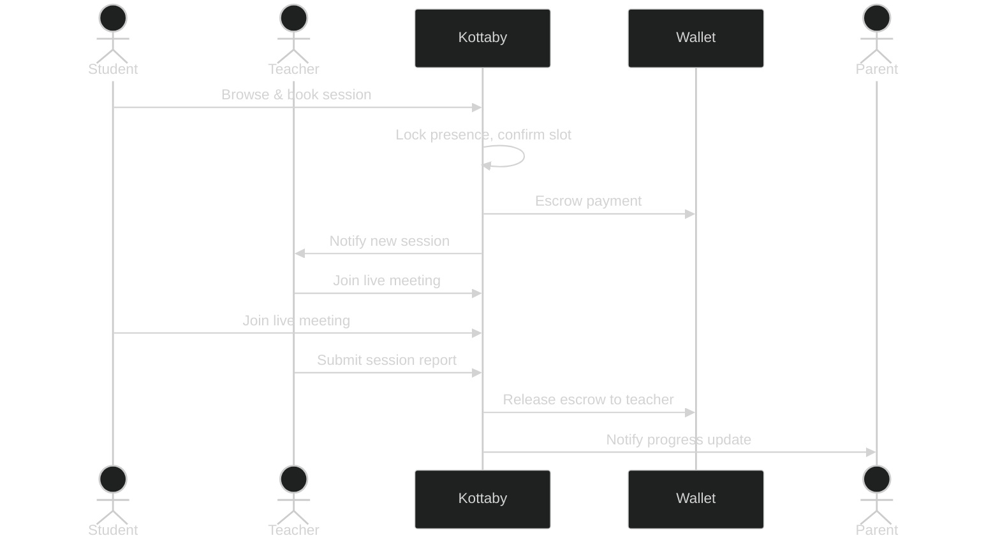
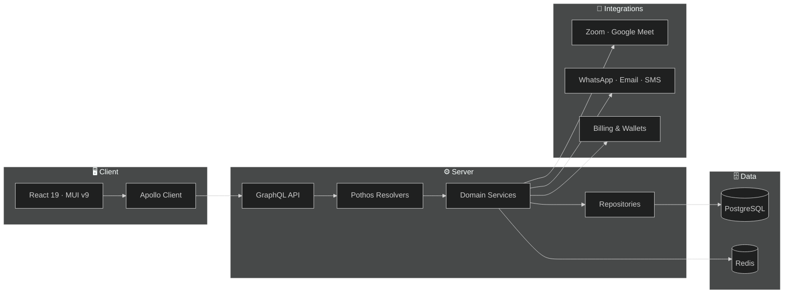

<div align="center">

# 📖 Kottaby

**A full-stack platform for live Quran learning — connecting students, teachers, and parents.**

`Next.js 16` · `React 19` · `Bun` · `GraphQL` · `PostgreSQL`

</div>

---

## ✨ What it does

Kottaby brings the academy experience online:

- **🧑‍🏫 Verified teachers** — a multi-session evaluation and approval pipeline before anyone can teach
- **⚡ On-demand matching** — real-time student→teacher discovery with presence locking and queues
- **🗓️ Live sessions** — meeting integrations, attendance, reports, and a wallet-escrow payment flow
- **👨‍👩‍👧 Parent supervision** — code-based pairing handshakes to monitor children's progress
- **🛡️ Admin governance** — onboarding overrides, audits, and role-based access control
- **🌍 Fully bilingual** — Arabic & English with RTL support, localized at compile time

### 🔄 The core loop



## 🧱 Architecture

A single Next.js monolith with strict, layered separation:



> Source `.mmd` files: `docs/architecture/readme-system-overview.mmd`, `docs/architecture/readme-session-journey.mmd`

| Layer | Path | Role |
|---|---|---|
| App Router | `app/` | Routes, pages, API endpoints |
| Frontend | `frontend/` | Views, stores (Zustand), UI components |
| Shared | `shared/` | i18n, constants, cross-layer types |
| Backend | `backend/` | GraphQL (Pothos), domain services, repositories |
| Testing | `test/` | Component, integration, and E2E suites |

## 🛠️ Tech Stack

- **Runtime & Framework** — Bun, Next.js 16 (App Router, Turbopack), React 19
- **UI** — MUI v9 (Material 3), Tailwind CSS 4, Framer Motion, Storybook
- **Data** — Drizzle ORM, PostgreSQL (Neon), SQLite for local dev
- **API** — Pothos GraphQL, Apollo Client v4, DataLoader batching
- **Auth & Jobs** — JWT sessions, RBAC, BullMQ / pg-boss, cron workers
- **Integrations** — Zoom, Google Meet, WhatsApp, Twilio, Stripe-style billing, email providers

## 🚀 Getting Started

```bash
bun install                 # Install dependencies
cp .env.example .env        # Configure environment
bun run dev                 # Dev server → http://localhost:3000
```

Local database without Docker:

```bash
bun run db:sqlite push      # Sync schema to SQLite
bun run db:sqlite seed      # Seed data
bun run db:sqlite:studio    # Browse data
```

## ✅ Testing & Quality

```bash
bun run test                # Full test suite
bun run test:ui:e2e         # Playwright end-to-end (run bun run build:test first)
bun quality-gate            # Types → lint → format → duplication, all gates
bun run tsgo                # Fast type checking
```

## 📜 Scripts Cheatsheet

| Command | Purpose |
|---|---|
| `bun run dev` | Development server (port 3000) |
| `bun run build` | Production build |
| `bun run storybook` | Component workshop (port 6006) |
| `bun run generate:gqlSchema` | Regenerate GraphQL schema |
| `bun codegen` | Regenerate GraphQL TypeScript types |

---

<div align="center">
Built with ❤️ for learners of the Quran.
</div>
