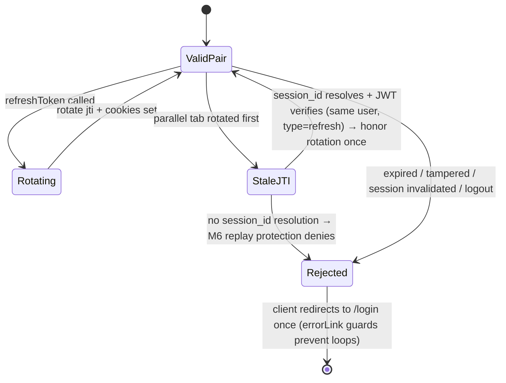

# Technical Architecture & Implementation Design: DEV2-001 — JWT Authentication Service

## 1. System Overview & Architecture Diagram

### 1.1 Request Paths (two authenticated channels, one token contract)

```
┌───────────────────────── CLIENT (React 19 / Apollo 4) ─────────────────────────┐
│ AuthProvider (in-memory access token)                                          │
│   ├─ login() ──► loginUserMutationDocument ────────────────┐                   │
│   ├─ checkAuth() ──► refreshTokenMutationDocument ─────┐   │                   │
│   └─ logout() ──► logoutMutationDocument ──────────┐   │   │                   │
│ authLink adds `Authorization: Bearer <access>` ─────────┐  │   │               │
└─────────────────────────────────────────────────────────┼──┼───┼───────────────┘
                                                          ▼  ▼   ▼
┌───────────────────────── GRAPHQL API ─────────────────────────────────────────┐
│ gqlContextFactory.ts                                                          │
│   session_id + access_token cookies → preloadSession (1 fetch)                │
│   → resolveAuthIdentityFromToken (+ role from users.role)                     │
│   → ctx { user, safeUser, role, locale, permissions… }                        │
│ auth.mutation.ts: login / refreshToken / logout  (public: no authScope)       │
│   → SessionService → AuthRepository/UserRepository → PostgreSQL               │
└───────────────────────────────────────────────────────────────────────────────┘

┌───────────────────────── SSR (Next.js 16 App Router) ─────────────────────────┐
│ app/(dashboard)/layout.tsx → getServerUserContext()                           │
│   reads httpOnly cookies: session_id + access_token                           │
│   { userId, context } | { null, null } → redirectToLogin()                    │
│ app/(auth) pages (login) ← bounce guard when authenticated                    │
└───────────────────────────────────────────────────────────────────────────────┘
```

### 1.2 Login Sequence

```mermaid
sequenceDiagram
    participant C as Client (LoginContainer)
    participant GQL as login resolver
    participant RL as Rate Limiter
    participant S as SessionService
    participant DB as PostgreSQL
    C->>GQL: login(email, password)
    GQL->>RL: checkRateLimit / isLocked (fail-open try/catch)
    GQL->>S: authenticate(email, password)
    S->>DB: users by email (retryTransient)
    alt unknown email OR wrong password
        S-->>GQL: identical invalid-credentials DomainError
        GQL-->>C: 401 / UNAUTHENTICATED (localized)
    else governed (deleted/blocked/suspended-active)
        S-->>GQL: governance DomainError 403 / FORBIDDEN (localized)
    else valid + active
        S->>DB: createAuthSession + update last_active_at (tx)
        S-->>GQL: { user, accessToken, refreshToken, sessionId }
        GQL->>C: setAuthCookies(3 cookies) + payload { token, user{id,...} }
        C->>C: token → React state; hard redirect /dashboard
    end
```

### 1.3 Refresh Rotation State Machine (stale-JTI race resolution)



**Key decisions:**
1. **Reuse, don't rebuild** — existing `jwt.ts` / `auth.mutation.ts` / `SessionService` are the canonical implementations; this ticket fixes and hardens them.
2. **Stale-JTI honored only when identity is independently anchored** by a valid `session_id` session — replay protection on the cookie-less path preserved.
3. **No schema work** — all persistence assumed from DEV1-001 / existing session table; gaps escalate to `deferred-items.md`.

## 2. Data Models & Database Schema

**No schema changes.** Consumed (read/write) objects only:

| Table | Usage in this ticket | Owner |
|---|---|---|
| `users` | Read by email; verify `role` (user_role), governance fields; bump `last_active_at` on successful auth/session touch | DEV1-001 |
| auth session store (as used by `SessionService.createAuthSession` / `preloadSession`) | create on login, rotate `jti` on refresh, invalidate on logout | existing substrate (DEV1-001 gap escalation if absent) |
| `audit_logs` (optional) | login-failure observability stays in `logger`; NO new audit rows in this ticket (append-only anyway, A.5) | DEV1-001 |

**Canonical types (new/refined, `backend/types/auth/`):**

```ts
// backend/types/auth/auth.types.ts
LoginSubmitInput        = { email: string; password: string }                // whitelist contract (BOPLA)
AuthTokensReturnType    = { accessToken: string; refreshToken: string }
AuthUserReturnType      // Omit<UserSelectType, "passwordHash"|"rememberTokenHash"> & { role: UserRole }
LoginPayloadReturnType  = { token: string; user: AuthUserReturnType }
AuthSessionClaims       = { sub: string; role: UserRole; type: "access" }
RefreshTokenClaims      = { sub: string; jti: string; type: "refresh" }
GovernanceGateResult    = { allowed: true } | { allowed: false; reason: "deleted"|"blocked"|"suspended" }
```

Rules: `{Entity}SelectType`/`InsertType` inferred from schema; all enums value-imported when used at runtime; `DBTransaction` from `@/backend/types`; barrels use `./` relative `export *`.

## 3. API Contracts & Pothos Resolvers

| Operation | authScopes | Input | Returns | Errors (`extensions.code`) |
|---|---|---|---|---|
| `login(input: LoginInput!)` | none (public) + rate-limit wrapper | `{ email!, password! }` (whitelist only) | `LoginPayload { token id user { id role … } }` | `UNAUTHENTICATED` (invalid creds), `FORBIDDEN` (governance), `SERVICE_UNAVAILABLE` (transient exhaustion), `VALIDATION` (malformed) |
| `refreshToken` | none (public) | cookie-carried (`session_id`, `refresh_token`) | `{ token id user { id … } } \| null` (null on invalid rotation — documented) | 401 semantics via null-return contract + errorLink handling |
| `logout` | authenticated | — | `Boolean` (`success`) | `UNAUTHENTICATED` without session |
| `me` | authenticated | — | current `User` (with `id`) | `UNAUTHENTICATED` |

Constraints:
- Resolver errors use `ctx.t("errors")`; services use `getServerTranslations(locale, "errors")`; all throw `DomainError` subclasses per `docs/graphql/domain-error-extensions-code.md`.
- Single canonical `User` Pothos object (no local types); role exposed from canonical type.
- `setAuthCookies(ctx, sessionId, refreshToken, accessToken)` contract preserved for all call sites (login, demoLogin, `rotateTokensAndSession`); `logout` deletes all three cookies.
- Cold-start resilience: limiter fail-open; `retryTransient()` on critical DB reads; exhaustion → `SERVICE_UNAVAILABLE`.
- Codegen: run `bun run generate:gqlSchema && bun codegen` if any Pothos surface is touched; frontend documents per `frontend/graphql/sharedDocuments/AGENTS.md`.

## 4. Backend Services & Repositories

### Services
- **`SessionService`/Auth service surface** (`backend/services/auth/`):
  - `authenticate(email, password)` → governance pre-check order: existence → password verify → governance gate (deleted → blocked → suspended-active → lapsed-suspension allow) → session create + `last_active_at` bump, single `tx` where multi-write.
  - `rotateSession(sessionId, presentedJti)` → strict match OR stale-honor branch of REQ-021; atomic single-statement jti compare-and-set guarded by the session row (no read-then-write TOCTOU).
  - `touchLastActive(userId)` → throttled update (skip if < 60s since last recorded value — cadence decision, avoids per-request write storm).
- **Governance gate** is a pure, unit-testable function of the user row + `now`; localized reason mapping lives beside it; used by BOTH login and `gqlContextFactory` (fail-closed).
- **Password verification** via the project's existing bcrypt-class hasher; unknown-email path executes the same-shaped hash compare against a module-level dummy hash to blunt timing oracles.

### Repositories (`backend/db/repo/`)
- User lookup by email: non-transactional read → `queryDb(tx)` Neon-HTTP pattern; simple prepared statement only for TCP path; never `inArray`+placeholder.
- Session create/rotate/invalidate: all write methods accept `tx?: DBTransaction`; rotation guarded by PostgreSQL `UPDATE … WHERE id = @sid AND refresh_token_jti = @jti RETURNING`-style atomic statement (zero-affected-rows → stale/invalid branch).
- All test access wrapped in `runInRollback`; `tx` passed to every call.

## 5. Frontend UX & Navigation Specification

### Routes & URLs Table

| Path | Purpose | Permission | Allowed Roles |
|---|---|---|---|
| `/login` (app `(auth)` group) | Public login form | none (authenticated users bounce → `/dashboard`) | GUEST |
| `/dashboard` (existing) | Post-login landing (redirect target) | authenticated context | all active roles |
| `/api/graphql` | Auth mutations/queries | per-operation above | — |

### Navigation Integration
- No new nav items. `(auth)` layout guards login; dashboard layout guards via `getServerUserContext()`. No change to sidebar groups.

### Per-Audience Rendering (login view)

| Audience | Difference |
|---|---|
| GUEST | Full login form; localized placeholders/errors; governance errors render as distinct inline banners (deleted/blocked/suspended) vs generic invalid-credentials |
| STUDENT / PARENT / TEACHER / SUPERVISOR / ADMIN (already authed) | Bounced from `/login` to `/dashboard` by `(auth)` layout; post-login landing identical (role routing occurs post-DEV2-002) |

### Apollo GraphQL Documents & UI Components
- Documents (`frontend/graphql/sharedDocuments/auth/`): `loginUserMutationDocument`, `refreshTokenMutationDocument`, `logoutMutationDocument`, `meQueryDocument` — `TypedDocumentNode` from `@apollo/client`, `id` in all selections, codegen types only, no mapping layers.
- Components: `frontend/views/auth/login/` (existing) — fix wiring only: submit via `React.SubmitEvent`, MUI v9 `sx`-only styling, `theme.palette.*` colors, errors rendered from translated copy, tokens kept in `AuthProvider` memory (never Zustand `persist`).
- Hooks: `useAppTranslation("auth")` / errors namespace; Apollo `useMutation` from `@apollo/client/react`.

## 6. Security, Authorization & Tenancy Mitigations

- **BOLA / IDOR**: Identity never from client input; only from verified JWT/session resolved server-side (`ctx.user.id`). Login input carries no IDs at all.
- **BOPLA**: `LoginSubmitInput` is the sole read shape; unknown fields dropped by construction; no `{ ...input }` into any Drizzle call.
- **BFLA**: `role` claim sourced only from `users.role` at issuance; test proves input-carried `role: "admin"` is ignored.
- **Brute force**: rate limiter + identical invalid-credentials response + dummy-hash timing equalization; `TEST_ENFORCE_RATE_LIMIT=1` for deterministic tests.
- **Token theft surface**: access token memory-only client-side; httpOnly `strict` cookies for SSR; refresh token single-use via jti rotation; constant-time comparison for secret comparisons; tokens never logged.
- **Injection**: parameterized Drizzle only; no LIKE user input on auth paths (wildcard-escape N/A, stated); no raw SQL string concatenation.
- **Governance fail-closed**: context factory rejects governed accounts even with valid tokens; checks re-run per request path (cached context scoped per request).
- **Loop safety**: SSR failure → `/login`; refresh failure → single redirect guarded by errorLink SSR/login-page guards (no recursive bounce).
