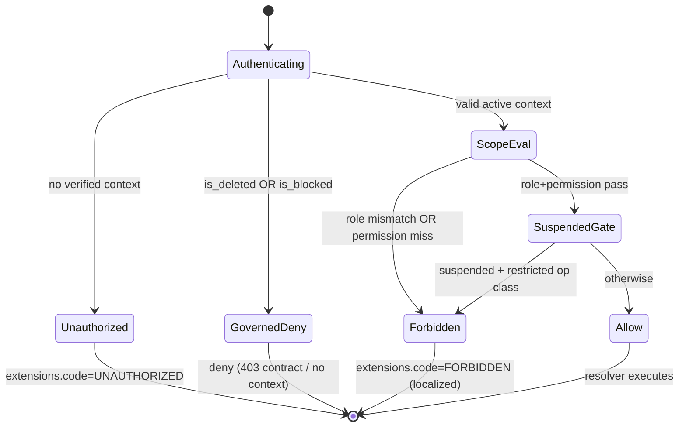

# Technical Architecture & Implementation Design: DEV2-002 — Role-Based Authorization Middleware

## 1. System Overview & Architecture

### Design Goals

1. **Canonical deny/allow contract** shared by GraphQL (Pothos `authScopes`) and SSR pages (`withPageAuth` / `requirePermissionForPage` / new `requireRoleForPage`).
2. **Zero trusted client identity** — authorization identity flows only from DEV2-001's verified context.
3. **Fail-closed everywhere** — any evaluation error or governed context denies.
4. **Extend, don't fork** — build on `buildAuthScopes`, `PermissionsService`, and existing guards; no parallel RBAC implementation.

### Layered Decision Flow

```
GraphQL request
    │
    ▼
DEV2-001 context factory (gqlContextFactory)
    ├─ verifies token / resolves session → ctx.user, ctx.role, ctx.permissions, ctx.isSuperAdmin
    └─ governed account (deleted/blocked) → NO usable context (fail-closed) ──► downsteam ops reject
    │
    ▼
Pothos scopeAuth (authenticated?) ──no──► GraphQLError code=UNAUTHORIZED (401 semantics)
    │ yes
    ▼
authScopes evaluation (buildAuthScopes)          [THIS TICKET: adds `role` scope]
    ├─ role:        effective ctx.role ∈ required roles?        ──no──► FORBIDDEN (403, localized)
    ├─ permission:  ctx.permissions ∩ required ≠ ∅?             ──no──► FORBIDDEN
    ├─ superAdmin:  ctx.isSuperAdmin === true                    ──no──► FORBIDDEN
    ├─ notImpersonating: ctx.impersonation absent?               ──no──► FORBIDDEN
    └─ any evaluator throws → fail closed (deny + logger.error)   [THIS TICKET hardens]
    │ all pass
    ▼
Resolver body → Service → Repository → DB

SSR page
    │
    ▼
layout guard: getServerUserContext() (DEV2-001) → { userId, context } | { null, null } ──null──► redirectToLogin()
    │
    ▼
page guard: requirePermissionForPage(...)  OR  requireRoleForPage(...) [THIS TICKET]
    ──fail──► redirect("/dashboard") (localized via getTranslations(locale, "errors"))
    │ pass
    ▼
Container renders; fine-grained <RequirePermission> only for element-level UX
```

### Component Boundaries & Sequence

```
Client Component ──Apollo──► GraphQL API ──Pothos authScopes──► Service
Server Component ──direct──► Service (via require*ForPage guard, never GraphQL)
```

- **New module surface:** `backend/lib/auth/require-role.ts` (server helper `requireRoleForPage`), role-scope registration inside existing `buildAuthScopes` in `backend/graphql/gqlSchemaBuilder.ts`, suspension helper `assertNotSuspended` in `backend/services/auth/` (or the existing auth domain module per repo layout), canonical role constants reuse from `backend/enum/users/`.
- **No new GraphQL operations.** This ticket exposes no mutations/queries of its own; representative existing operations act as enforcement fixtures.

### Key Design Decisions

**Decision: Extend `buildAuthScopes` with a `role` scope instead of retrofitting role strings into `permission`.**
- Context: Kottaby's canonical fine-grained gate is `permission: AppPermission.X`. The Draft Academy ticket speaks in roles (`admin|teacher|student|parent`).
- Options: (1) map every role gate to permission bundles only — Cons: loses the readable coarse contract the ticket and the planning docs demand; role drift goes untested. (2) add a first-class `role` scope documented as coarse outer gate, `permission` remaining primary — Pros: satisfies both vocabularies; enables REQ-060/061 schema-coverage proof.
- **Decision:** Option 2.
- **Rationale:** DEV3-016 admin CRUD, DEV2-004 flows, DEV1-016 parent portal all reference role expectations; a tested `role` scope locks the contract at schema level.

**Decision: Governance deny rides the DEV2-001 context boundary, plus an explicit suspension helper at the authorization layer.**
- Rationale: deleted/blocked are already fail-closed upstream (REQ-033 in DEV2-001); suspension needs a *selective* deny (read-only profile OK, session creation denied → INV-U2), which only the authorization layer can express — hence `assertNotSuspended` is shipped and unit-tested here for DEV3-004 to consume.

**Decision: SSR role guard consumes `UserPermissionContext.role` — no extra DB queries.**
- Rationale: serverless cold-start rule (`docs/backend/serverless-cold-start-optimization.md`); role is already on context.

### Mermaid: Authorization Decision State Chart



## 2. Data Models & Database Schema

**No schema changes.** All table/enum ownership is DEV1-001. This ticket consumes:

- `users.role` (`user_role` enum: `admin | teacher | student | parent` — C.1, runtime enum from `backend/enum/users/`).
- `users.is_deleted | deleted_at | is_blocked | blocked_at | suspended | suspended_at | suspended_period_days` (A.7 governance).
- Permission persistence consumed read-only via `PermissionsService.getUserContext` (no direct repo access from the scope layer beyond existing service APIs).

**Canonical types touched (additive only, no existing type mutation):**

`backend/types/auth/authorization.types.ts` (new file, added to `backend/types/auth/index.ts` barrel):

| Type | Shape | Purpose |
|---|---|---|
| `RoleGateInput` | `{ readonly role: UserRoleTypeValue \| readonly UserRoleTypeValue[] }` via canonical role value type (from `backend/enum` users role enum's value union type) | scope argument typing — NO local string-literal unions |
| `SuspensionGuardResult` | `{ allowed: boolean }`-shaped return type if needed by `assertNotSuspended` consumer contract | DEV3-004 seam |
| `RequireRolePageArgs` | reuse of existing `requirePermissionForPage` signature pattern (`userId`, roles, `locale`, `context: UserPermissionContext`) | SSR helper typing |

All barrels follow the root conventions: `export * from "./authorization.types"` with `./` relative paths, no `@/` aliases in barrels.

## 3. API Contracts & Pothos Resolvers

### New authScope: `role`

**Registration (compose, don't replace):** `buildAuthScopes` in `backend/graphql/gqlSchemaBuilder.ts` gains:

```ts
authScopes: {
  // existing: permission, superAdmin, notImpersonating ... (unchanged semantics)
  role: (required) => ctx.role !== null && asRoleSet(required).has(ctx.role),
}
```

Contract rules:
- **OR semantics** within the role set (scalar or array input normalized via a canonical guard — `Object.values(<RoleEnum>)` membership check, no unsafe casts, `String(...)` normalization consistent with `no-unsafe-enum-comparison` patterns).
- **AND composition** across distinct scope dimensions (Pothos default: all declared scopes must pass) — documented.
- **Evaluation exceptions → deny** + structured `logger.error` (fail closed, REQ-032).
- **Unauthenticated** short-circuits earlier in `scopeAuth` with `UNAUTHORIZED` (unchanged).
- **Impersonation/simulation interplay:** `ctx.role` reflects the *effective* context produced by DEV2-001 (group simulation mutates permissions; the role scope contract documents that simulated role equals the resolved context role — behavior preserved, documented).

### Suspension helper (authorization-layer seam for DEV3-004)

`assertNotSuspended(userId, context | locale, tx?)` in `backend/services/auth/`:
- Reads governed fields through the existing user context/user service (no new repository surface unless an existing read exists; prefer context fields when the caller has `safeUser` rows, else a minimal service read).
- Computes window: `suspended && suspended_at && (suspended_period_days == null || suspended_at + days > now)` → throw `ForbiddenError` with localized `errors.accountSuspended`/`errors.forbidden` key via `getServerTranslations(locale, "errors")`.
- Expired suspension → allow (matches DEV2-001 REQ-032 lapse semantics; actual reactivation field updates remain DEV2-001's `last_active_at`/governance-owner domain).

**No new GraphQL fields.** No `generate:gqlSchema`/`codegen` delta is expected from authorization scaffolding alone; if any Pothos-visible type is touched, run `bun run generate:gqlSchema && bun codegen` and assert byte-stability except for intended diffs.

### Representative enforcement fixtures (test-only usage)
Tests use EXISTING operations already carrying scopes (e.g., an admin-permission-gated mutation, a student-scoped query, a parent-scoped query, a public op like `login`/`registerUser`). If no suitable role-gated op exists pre-DEV1/DEV3 work, the schema-coverage test (REQ-060) validates the *mechanism* via permission-scoped ops + a scope-evaluator harness, and the role scope is applied to the earliest existing eligible op without changing its public contract.

## 4. Backend Services & Repositories

### Service layer
- **`PermissionsService`** — unchanged API surface (`getUserContext` single + batch). Tests mock it for fail-closed branches; real path exercised via `runInRollback` logic tests using `entity-setup.ts`-created users with real permission assignment where the matrix needs it.
- **Auth domain service module** — hosts `assertNotSuspended`. All errors: `DomainError` subclasses (`ForbiddenError`/`ValidationError` where appropriate) with `extensions.code` per `docs/graphql/domain-error-extensions-code.md`; messages via `getServerTranslations(locale, "errors")`. Logging: `logger.logDomainError` for expected denies, `logger.error` for unexpected evaluation failures. **No `console.*`.**

### Repository layer
- **No new repositories.** Existing user/permission read paths reused; any read inside a transaction-capable helper accepts `tx?: DBTransaction` (from `@/backend/types`) and propagates it.
- Read methods reused follow the existing `queryDb(tx)` Neon-HTTP rule; prepared-statement rules unchanged (no new prepared statements needed — no new hot paths).

### Concurrency & safety
- Authorization evaluation is **read-only and pure** over already-resolved context → no write races, no TOCTOU surface introduced.
- Suspension check is a **single read + compute** at request time; the authoritative enforcement for session creation lands in DEV3-004's transactional flow (this ticket ships the guard + contract; the transactional caller couples it with the session tx).
- No module-level mutable state.

## 5. Frontend UX & Navigation Specification

### Routes & URLs Table

**No new routes.** Authorization is enforced on existing routes. The contract for guarded routes is:

| Path (existing patterns) | Purpose | Server guard | Allowed |
|---|---|---|---|
| `/dashboard` (and children) | Role portals | `withPageAuth(null)` auth-only | any authenticated active user |
| Admin management pages | DEV3-era governance | `requirePermissionForPage(...)` (+ role=admin outer gate where applied) | admin w/ permission |
| Teacher portal pages | DEV2-era | permission/role gate | teacher (+ admin where specified) |
| Parent portal pages | DEV1-era | role=parent | parent |
| Public auth pages | login/register | `app/(auth)/layout.tsx` bounce guard | unauthenticated |

### Navigation Integration
- No sidebar changes. Deny UX on element level remains `<RequirePermission fallback={...}>`; page-level deny remains server redirect to `/dashboard`.
- **Mobile nav:** unchanged; unauthorized items were already hidden via permission filtering (contract preserved, not extended).

### Per-Audience Rendering
| Audience | Sees | Denied |
|---|---|---|
| Student | student surfaces | admin/teacher ops → 403 (API) / hidden (UI) |
| Teacher (applicant) | applicant-permitted surfaces | teaching surfaces remain additionally gated by domain (`is_approved`) — NOT by this ticket's role scope (REQ-023 documented boundary) |
| Certified Sheikh | teacher surfaces | admin ops → 403 |
| Parent | read-only own-children surfaces | ALL write ops → 403 (INV-P2 enforced by absence of permission grants on parent role; matrix-tested) |
| Super Admin | everything (isSuperAdmin) | — |

### Apollo Documents & Components
- **No new GraphQL documents.** Existing documents unchanged.
- `frontend/views/**`: only touched if a deny-fallback copy/wiring defect is found during tests; changes rules: MUI v9 `sx` only, `theme.palette.*` colors, `React.SubmitEvent`, full `useAppTranslation(...)` coverage, `PermissionDeniedFallback` with `LockOutlined` + translated title/description + `role="alert"`.
- **Stores:** none. No Zustand `persist` additions.

## 6. Security, Authorization & Tenancy Mitigations

- **BOLA / IDOR defense:** All authorization identity is derived from `ctx.user.id`/`ctx.role`/`ctx.permissions` (server-verified). Zero decision inputs for authorization come from mutations' args. Schema-level test asserts no authorization-relevant field accepts client identity (REQ-050).
- **BOPLA defense:** Scope evaluation reads a fixed whitelist of context keys (`role`, `permissions`, `isSuperAdmin`, impersonation marker). No input spreading into any persistence call exists in this layer (it performs no persistence writes at all).
- **BFLA defense:** Role scope cannot be satisfied without the DB-sourced role claim; `superAdmin` composition preserved; no elevation mutation exists by construction (REQ-052, REQ-074 test proof).
- **Governance deny:** deleted/blocked contexts never materialize (DEV2-001 fail-closed); RBAC layer additionally treats governed markers as deny + `logDomainError` (defense in depth, REQ-030).
- **Fail-closed evaluation:** every scope evaluator wrapped so thrown errors resolve to deny + structured log (REQ-032).
- **Error hygiene / no oracle:** denies use canonical localized strings only; no leak of required permission lists, role thresholds, or other users' governance state (REQ-053).
- **SQL / LIKE injection:** this ticket introduces no user-input-driven queries; enum-guard comparisons only (`escapeLikeWildcards` not applicable — documented in doc's security section).
- **i18n keys:** additions confined to `errors` namespace in `shared/locale/types/` + `ar` + `en` (+ `MessageSchema`, `namespacePaths` only if a new namespace were introduced — expected: reuse existing `errors` namespace).
