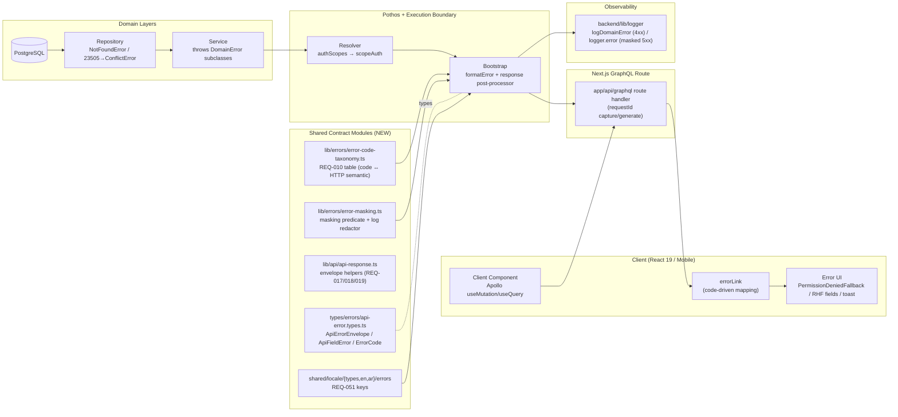

# Technical Architecture & Implementation Design: DEV3-002 — Shared Error Handling & Response Contracts

> **Plan of record:** `ai/plans/dev3-002-shared-error-handling-response-contracts/`
> **Specs:** `specs.md` REQ-001..REQ-083
> **Canonical refs:** `docs/graphql/domain-error-extensions-code.md`, `docs/auth/user-registration.md`, `docs/backend/login-cold-start-resilience.md`, `docs/IDEMPOTENCY.md`, `docs/specs/open-decisions-and-gaps.md`, `docs/specs/state-machine-invariants.md`

---

## 1. System Overview & Architecture Diagram

### 1.1 Scope Statement

DEV3-002 is a **cross-cutting contract ticket with zero database-table changes**. It standardizes how every layer produces, translates, masks, localizes, serializes, and consumes errors. The `DomainError` hierarchy (`backend/lib/errors.ts`) and the 23505 cause-chain translator (`isUniqueViolation`) **already exist** from DEV1-002 — this design standardizes the contract surface **around** them without re-inventing them.

### 1.2 Error Production & Masking Pipeline (GraphQL Path)



### 1.3 API-Route Envelope Path (non-GraphQL)

```
app/api/**/route.ts
   │  resolveRequestId(request)          ← X-Request-Id honored, else UUID v4
   │  try { handler } catch (err) { apiErrorResponse(err, ctx) }
   ▼
apiErrorResponse (lib/api/api-response.ts)
   ├── DomainError            → mapped code + localized message + whitelisted details
   ├── PG 23505 (cause walk)  → CONFLICT + localized conflict message
   └── anything else          → INTERNAL_SERVER_ERROR (masked) + logger.error(original, requestId)
   ▼
{ "error": { "code", "message", "details?", "requestId" } }   ← exact shape, correct HTTP status
```

### 1.4 Key Design Decisions Table

| # | Decision | Options Considered | Pros / Cons | Rationale (Maintainability, Scalability, Reliability) |
|---|---|---|---|---|
| D1 | **Extend** the existing `DomainError` hierarchy; add a *taxonomy module* beside it rather than modifying throw sites | (a) Rebuild hierarchy (b) Extend + taxonomy map (c) Pothos plugin-errors type registration | (a) breaks 5+ downstream throw sites; (b) additive, zero-drift; (c) forces resolver-local error classes, violates "resolvers throw, boundary formats" | (b). DEV1-002/Dev2 error docs (`domain-error-extensions-code.md`) already establish hierarchy semantics; taxonomy is data, not a class change. Lowest blast radius across three dev streams. |
| D2 | **Mask at the response boundary with request context** (post-execution response post-processor invoked from the GraphQL HTTP handler path; same pure function also exportable for Apollo `formatError`/`willSendResponse` plugin wiring) | (a) Apollo `formatError` alone (b) Per-resolver try/catch (c) Response-boundary post-processor with `{locale, requestId}` | (a) lacks `ctx.locale` + `ctx.requestId` in Apollo's `formatError(formatted, error)` signature — masked generic message could not be localized; (b) violates REQ-040 purity and guarantees misses; (c) has full request context, single registration point (REQ-060) | (c). REQ-011 requires the masked message to be localized and correlated. Only the boundary sees both the thrown error and `{locale, requestId}`. One registration = no per-stream drift. |
| D3 | Model REQ-010 codes as a **TS string-union `ErrorCode` + const map** in `backend/types/errors/`; NO DB enum, NO GraphQL enum | (a) `pgEnum` + GraphQL enum (b) TS union + map (c) GraphQL enum only | (a) error codes are transport metadata (`extensions.code` is `String` in GraphQL `extensions`), not persisted rows — a DB enum is wrong-layer coupling; (c) codegen enum adds schema churn with zero consumer benefit since clients branch on string codes | (b). `extensions.code` is conventionally `string`; a TS union gives compile-time safety without schema/DB churn, and mobile clients read raw strings per `docs/IDEMPOTENCY.md`. |
| D4 | **`requestId` resolved once in the context factory / route entry** (`resolveRequestId`): honor `X-Request-Id`, else `crypto.randomUUID()`; stored on `ctx.requestId` | (a) Per-resolver middleware (b) Context-factory resolution (c) Async-local storage | (a) N registrations, drift risk; (c) Bun/Next lambda support for ALS is fragile for serverless cold starts | (b). Consistent with existing `gqlContextFactory` preload pattern (`preloadSession`); deterministic, testable, zero new runtime deps. |
| D5 | **API-route envelope as two pure helpers** `apiSuccessResponse(data, {requestId, status})` / `apiErrorResponse(error, {locale, requestId})` in `backend/lib/api/api-response.ts` | (a) Higher-order `withApiEnvelope(handler)` wrapper (b) Pure helpers (c) Next.js middleware | (a) wraps route modules opaquely and fights Next route typing; (c) middleware can't see handler-thrown errors reliably | (b). Explicit, SSR/route-agnostic, trivially unit-testable to 100% (REQ-070), composable with webhook-ack exemptions (REQ-019). |
| D6 | **Field errors ride `extensions.fields: [{field, code, message}]`** attached by the boundary when the thrown error is a `ValidationError` carrying a field map | (a) Encode fields in `details` JSON string (b) Dedicated `FieldValidationError` subclass w/ serialized array (c) `extensions.fields` structured | (a) unparseable by RHF; (b) adds class explosion | (c). Directly consumable by React Hook Form `setError`, matches REQ-015 shape exactly, keeps `DomainError` hierarchy stable. |
| D7 | **Keep GraphQL domain errors on HTTP 200** (Apollo convention); HTTP status semantic column governs `app/api/**` and transport failures only | (a) Status-driven GraphQL (b) Convention-faithful 200 + `errors[]` | (a) breaks Apollo Client error pipeline; contradicts REQ-016 | (b). REQ-016/REQ-061: frontend MUST branch on `extensions.code`; transport statuses stay 400/405/413 only. |
| D8 | **Extend the existing `errors` i18n namespace** with REQ-051 keys; reuse `auth` keys for field validations (REQ-055) | (a) New `errors-contract` namespace (b) Extend `errors` | (a) duplicates, violates REQ-055 duplication intent | (b). `errors` namespace exists from DEV1-002; additive keys keep `MessageSchema` compile-time gate (REQ-054). |
| D9 | **Frontend mapping centralized in `errorLink`** with a documented code→behavior table; `PermissionDeniedFallback` for page/section `FORBIDDEN`, toasts for mutation contexts, RHF field mapping for `VALIDATION` | (a) Per-component handling (b) Central link + documented fallbacks | (a) three-stream drift, missed branches | (b). Single mapping table (REQ-061) is the whole point of a *shared* contract. |
| D10 | **Convention (not scanner): `{ENTITY}_NOT_FOUND` preferred over `FORBIDDEN` where existence is sensitive** (REQ-031), enforced by plan-review + tests, not a lint rule | (a) Lint rule (b) Convention + security tests | (a) false-positive-prone (many legitimate FORBIDDENs) | (b). Documented in the canonical doc + REQ-074 cross-tenant probe; pragmatic. |

---

## 2. Data Models & Database Schema

### 2.1 Existing Schema Verification (No Changes)

**DECISION: No Drizzle table, enum, or migration changes are introduced.** Verified against `backend/db/schema/`, `db/schema.dbml`, and `docs/specs/state-machine-invariants.md`:

| Contract dependency | Existing implementation | Verified at |
|---|---|---|
| 23505 uniqueness on `users.email` (→ `CONFLICT`) | `unique("users_email_unique")` | `backend/db/schema/users/users.ts` |
| 23505 on `students.handshake_code` (→ `CONFLICT`) | `unique("students_handshake_code_unique")` | `backend/db/schema/students/students.ts` |
| Check constraints surfacing as violations (balances ≥ 0, scores/ratings ranges) | `check(...)` on `students`, `wallet`, `teacher_transaction`, `evaluations`, `home_work`, `reports` | `backend/db/schema/**` |
| Governance fields driving nondisclosable auth rejections (REQ-021) | `users.isDeleted / suspended / isBlocked` (Decision A.7) | `backend/db/schema/users/users.ts` |
| Financial immutability (corrections via adjustments; tamper → `CONFLICT` own-ticket rule) | `student_payments`, `teacher_transaction` (INV-W6, INV-PAY2) | `backend/db/schema/billing/*` |

`bun validate:dbml` MUST remain green with **zero** `db/schema.dbml` diff. Rule restated in the canonical doc: schema structure changes are **out of scope** (REQ — non-goals).

### 2.2 Canonical Types (NEW — `backend/types/errors/`)

New file `backend/types/errors/api-error.types.ts` + barrel `backend/types/errors/index.ts`, registered in `backend/types/index.ts`. All types follow the canonical naming rules in `backend/types/AGENTS.md` (no GraphQL object types here — these are transport-runtime contracts):

```typescript
// backend/types/errors/api-error.types.ts
/** REQ-010 canonical category codes. Transport metadata; NOT a DB/GraphQL enum (Decision D3). */
export type ErrorCode =
  | "BAD_REQUEST" | "UNAUTHORIZED" | "FORBIDDEN"
  | "CONFLICT" | "DUPLICATE_REQUEST" | "VALIDATION"
  | "RATE_LIMITED" | "SERVICE_UNAVAILABLE" | "INTERNAL_SERVER_ERROR";

export interface ApiFieldErrorType {
  readonly field: string;     // RHF-consumable path, e.g. "email", "homeWork.currentGrade"
  readonly code: string;      // SCREAMING_SNAKE_CASE, e.g. "EMAIL_INVALID", "GRADE_OUT_OF_RANGE"
  readonly message: string;   // localized (REQ-015/REQ-050)
}

/** REQ-017 exact envelope shape for app/api routes. */
export interface ApiErrorEnvelopeReturnType {
  readonly error: {
    readonly code: string;             // ErrorCode category OR custom SCREAMING_SNAKE domain code
    readonly message: string;          // localized
    readonly details?: unknown;        // explicitly whitelisted; NEVER input echo / SQL / PII (REQ-033)
    readonly requestId: string;        // REQ-013
    readonly fields?: readonly ApiFieldErrorType[];  // present only when ValidationError carries fields (REQ-015)
  };
}

/** REQ-019 success envelope for app/api routes. */
export interface ApiSuccessEnvelopeReturnType<TData> {
  readonly data: TData;
  readonly requestId: string;
}

/** GraphQL-facing extension shape emitted by the boundary (REQ-014/REQ-015). */
export interface GraphQLErrorExtensionsType {
  readonly code: string;
  readonly requestId?: string;         // dev/non-prod or always-ar; decision: always include (correlation-safe)
  readonly fields?: readonly ApiFieldErrorType[];
}
```

Barrels: `backend/types/errors/index.ts` → `export * from "./api-error.types";`; `backend/types/index.ts` gains `export * from "./errors";`.

**No new enums in `backend/enum/` and none in `backend/db/schema/enums.ts`** (Decision D3 — codes are runtime transport strings, not persisted values; adding a `pgEnum` or Pothos enum registration is **prohibited** by this plan).

### 2.3 i18n Data Contract (REQ-050/051/054/055)

Extend the existing `errors` namespace (DEV1-002) — **no new namespace**:

| File | Change |
|---|---|
| `shared/locale/types/errors/index.ts` | Add to the namespace interface: `internalServerError`, `validationFailed`, `unauthorized`, `forbidden`, `notFound`, `conflict`, `duplicateRequest`, `rateLimited`, `serviceUnavailable`, `badRequest` (all `string`; interpolation variants as `(… ) => string` where parameterized, e.g. `notFoundEntity: (entity: string) => string` — only if a throw site needs it; prefer static) |
| `shared/locale/en/errors/index.ts` | English implementations for every new key |
| `shared/locale/ar/errors/index.ts` | Arabic implementations (RTL-natural phrasing; Arabic line-height rules unchanged) |

Rules: compile-time `MessageSchema` parity is the gate (missing key = `tsgo` failure — REQ-054). Field-level domain validations (`emailInvalid`, `passwordTooShort`, …) are **reused from `auth`/`errors` existing keys** — new near-duplicate keys are prohibited (REQ-055); `check:duplicates` runs on the locale modules in the quality loop.

---

## 3. API Contracts & Pothos Resolvers

### 3.1 GraphQL Schema Surface

**No new queries, mutations, object types, or input types are added.** The contract is additive *metadata* on the existing error channel. The effective SDL-level contract (documented, not new operations):

```graphql
# No SDL change. Every operation error follows this effective contract:
# {
#   "errors": [{
#     "message":  "<localized>",                       # DomainError message (pass-through)
#     "path":     ["mutationName"],                     # Apollo convention (REQ-014)
#     "extensions": {
#       "code":      "VALIDATION" | "{ENTITY}_NOT_FOUND" | "CONFLICT" | ...,   # REQ-010
#       "requestId": "uuid",                            # correlation (REQ-013)
#       "fields":    [{ "field": "email", "code": "EMAIL_INVALID", "message": "...", "id": "…" }]
#                                                    # only for field-carrying ValidationError (REQ-015)
#     }
#   }],
#   "data": null
# }
```

> Note: field entries carry no `id` (they are value objects, not entities — consistent with the embedded-type non-normalization policy in `frontend/graphql/AGENTS.md`; they are never written to the Apollo cache as entities).

### 3.2 Boundary Registration (REQ-060) — GraphQL Bootstrap

The error path is registered **exactly once** in the GraphQL server bootstrap/route wiring (the same module that configures the schema execution; i.e., the `app/api/graphql` route + the shared bootstrap used by `frontend/graphql/test` `setupTestServerLifecycle`):

1. `resolveRequestId(request)` → `ctx.requestId` (Decision D4), done in the context factory (`gqlContextFactory`) or route wrapper — one place.
2. A response post-processor `finalizeGraphqlErrors(result, { locale, requestId })` (pure) is applied to the execution result before serialization:
   - For each error: unwrap to the original thrown value (Apollo `unwrapResolverError`-equivalent for the configured server).
   - `instanceof DomainError` → **pass-through**: preserve localized `message`, overwrite/assert `extensions.code` to the subclass code, attach `extensions.requestId`, and if the error carries a validated `fields` payload (new optional readonly property on `ValidationError`), map it explicitly into `extensions.fields` (REQ-015, REQ-033 — property-by-property, never spread).
   - Otherwise → **mask** (REQ-011): replace message with `t.errors.internalServerError` (`getServerTranslations(locale, "errors")`), set `extensions.code = "INTERNAL_SERVER_ERROR"`, keep `path`, drop stack/SQL/env. **Log the original** via `logger.error` with `{ requestId, operationName, err }` (REQ-012).
   - Business rejections pass through at `logger.logDomainError` level (debug under `TEST_SERVER=1`) — REQ-025.
3. Transport failures remain HTTP-level: malformed JSON → `400 BAD_REQUEST`, wrong method → 405, oversize → 413 (REQ-016).

`authScopes` mapping is already correct per `docs/graphql/domain-error-extensions-code.md` — **documented and test-locked here** (REQ-020):
- `scopeAuth` failure (no session) → `UNAUTHORIZED`.
- `authScopes` failure (authenticated, lacks permission) → `FORBIDDEN`.

### 3.3 Mutation Result Warning Surfacing (REQ-027)

Touched resolvers for warning-capable mutations follow the existing documented precedence (`deleteClassInstance → { success, warnings }`, `releaseQuotaIfDeducted → { success, warning }`): **warnings travel in the payload, errors travel in `errors[]`**. The canonical doc states this as a rule; no new resolver is added by this ticket, but the contract test suite includes one representative mutation propagation assertion using the existing surface.

### 3.4 Non-GraphQL API Contract (REQ-017/018/019/022)

All `app/api/**` routes adopt via the shared helpers (existing webhook routes — e.g. `app/api/webhooks/whatsapp` — are **migrated to the envelope or formally exempted** per REQ-019's provider-ack clause; exemption recorded in the canonical doc):

```
GET    success (read)    → 200 { data, requestId }
POST   success (create)  → 201 { data, requestId }
webhook provider ack     → exemption documented; correlated logs still emitted
error                    → <REQ-010 status> { error: { code, message, details?, requestId } }
duplicate idempotency    → 409 DUPLICATE_REQUEST (REQ-022; details MAY reference entity id, NEVER echo payload)
```

**`details` whitelist mapping (REQ-018/033):** the envelope helper maps `DomainError` payloads field-by-field from a validated structure; arbitrary thrown values get **no** `details`.

### 3.5 Permission Matrix (Error Behavior by Caller Role)

| Interaction | Anonymous | Student | Parent | Teacher | Supervisor | Super Admin |
|---|---|---|---|---|---|---|
| Auth-gated field, no session | `UNAUTHORIZED` | — | — | — | — | — |
| Gated mutation w/o permission | — | `FORBIDDEN` | `FORBIDDEN` | `FORBIDDEN` | `FORBIDDEN` | allowed (perm-gated) |
| Foreign-tenant resource read (sensitive existence, e.g. parent → other student) | — | `{ENTITY}_NOT_FOUND` | `{ENTITY}_NOT_FOUND` | `{ENTITY}_NOT_FOUND` | per-permission | per-permission |
| Foreign-tenant mutation (non-sensitive existence) | — | `FORBIDDEN` | `FORBIDDEN` | `FORBIDDEN` | perm-gated | allowed |
| Public register/login shape failure | `VALIDATION`/400 (schema-layer, pre-resolver — REQ-032) | — | — | — | — | — |
| Public brute force | `RATE_LIMITED` (generic copy — REQ-034) | — | — | — | — | — |
| Governance-blocked login (deleted/suspended/blocked) | `UNAUTHORIZED` with generic invalid-credentials message (REQ-021) | — | — | — | — | — |
| Idempotent replay on create mutation | — | `DUPLICATE_REQUEST` | `DUPLICATE_REQUEST` | `DUPLICATE_REQUEST` | `DUPLICATE_REQUEST` | `DUPLICATE_REQUEST` |
| DB/transient exhaustion | `SERVICE_UNAVAILABLE` for all roles (REQ-023; never masked as 500, never conflated with 401/422) | same | same | same | same | same |

---

## 4. Backend Services, Repositories & Concurrency Model

### 4.1 New / Modified Modules

| File | Kind | Responsibility |
|---|---|---|
| `backend/types/errors/api-error.types.ts` (+`index.ts`, root barrel) | NEW | Canonical contract types (§2.2). |
| `backend/lib/errors/error-code-taxonomy.ts` | NEW | `ERROR_CODE_HTTP_STATUS: Readonly<Record<ErrorCode, number>>` — the REQ-010 table as data; `isErrorCode(value): value is ErrorCode` type guard. |
| `backend/lib/errors/error-masking.ts` | NEW | Pure boundary utilities: `isDomainError(value)` guard, `maskInternalError({locale, requestId})` building the masked extension/message pair, `redactLogContext(ctx)` stripping secret-shaped keys (tokens/passwords/encryption keys/provider creds — REQ-035), `finalizeGraphqlErrors(result, {locale, requestId, log})`. **No DB, no cache, no network (REQ-040).** |
| `backend/lib/errors.ts` | EXTEND | Add optional `readonly fields?: readonly ApiFieldErrorType[]` on `ValidationError` (backwards-compatible, overloaded constructor unchanged); re-export taxonomy/mask helpers via the existing lib barrel pattern; `isUniqueViolation`** reused as-is** (already cycle-safe, REQ-042). |
| `backend/lib/api/api-response.ts` (+`backend/lib/api/index.ts`) | NEW | `resolveRequestId(headers)`, `apiSuccessResponse(data, {requestId, status})`, `apiErrorResponse(error, {locale, requestId})` implementing REQ-017/018/019/022 with 23505→CONFLICT translation (reusing `isUniqueViolation`) and masking fallback. Returns `NextResponse`/plain Response per existing route style. Pure; never touches DB. |
| `backend/graphql/gqlContextFactory.ts` | MODIFY | Populate `ctx.requestId` via `resolveRequestId` (Decision D4). No other change. |
| GraphQL bootstrap / `app/api/graphql` route | MODIFY | Register `finalizeGraphqlErrors` on the response path exactly once (REQ-060); ensure stack traces are never emitted in production config (REQ-030). |
| `app/api/**/route.ts` (in-scope existing routes) | MODIFY | Adopt `apiSuccessResponse`/`apiErrorResponse`; document provider-ack exemptions (REQ-019). |
| `backend/lib/logger` (existing) | REUSE | `logger.error` / `logger.logDomainError` call sites only; no logger changes. |

### 4.2 Service / Repository Conventions Locked by This Contract (documentation-level, enforced by review + tests)

- Throw only `DomainError` subclasses for expected failures (REQ-052); `NotFoundError(entity, msg)` receives the entity name (never `{X}_NOT_FOUND` — prevents double suffix).
- No plain `new Error` throws in resolvers/services/repos; no catch-swallow — rethrow typed with `cause` or handle-and-log (REQ-026).
- Custom codes SCREAMING_SNAKE_CASE, listed in the canonical doc's "extending the taxonomy" section; transaction errors never caught-and-committed-partially (REQ-041 — rely on Drizzle rollback; do not `catch` inside `db.transaction` and continue the outer flow).
- No repository signature changes are introduced; all DB reads in this ticket's modules: **none**.

### 4.3 Concurrency & Race Condition Assessment

This ticket introduces **no mutable rows, balances, quotas, or locks** — it is a transform/serialization layer. No `SELECT FOR UPDATE` or advisory locks are added. Assessment required by the design phase:

| Scenario | Actors | Risk | Mitigation |
|---|---|---|---|
| Concurrent duplicate submissions sharing an idempotency key (replay burst) | Student web + mobile on flaky network | Double execution vs. double `DUPLICATE_REQUEST` | Storage/guard mechanics stay in owning tickets per `docs/IDEMPOTENCY.md`; **this contract fixes the response shape/code only** (REQ-022/043). REQ-076 chaos test proves: first success + N× `DUPLICATE_REQUEST`, and a `5xx` first attempt allows same-key retry (24h expiry wording locked). |
| Interleaved errors on one request + simultaneous logging streams | Boundary post-processor × `logger` | Interleaved/redaction-missed logs | `redactLogContext` is a pure, total function applied to every boundary log call; structured single-call logging (no multi-write assembly). No module-level mutable state anywhere in the new modules (severity-check: bounded-state rule). |
| Error.cause cycles (exotic wrapped errors) | Boundary traversal | Infinite loop in unwrap | Reuse the existing cycle-guarded `isUniqueViolation` traversal with a visited set; mask path never recursively walks — one-hop unwrap + classify (REQ-042). |
| Request races on shared requestId generation | Two requests | Collision | `crypto.randomUUID()` per request at context factory; no shared counter/state. |
| TOCTOU on uniqueness (`users.email`) | Two concurrent registrations | Pre-check race | **Existing DEV1-002 stance preserved**: no SELECT-pre-check; rely on constraint + 23505 translation inside the transaction. This contract standardizes the translation reuse, not the timing. |
| Rollback semantics under typed errors | Service tx blocks | Partial commit | REQ-041: typed throws propagate through `db.transaction` unchanged; boundary runs **after** commit/rollback resolution; masking never swallows rollback errors. |
| Redis/atomic ops | — | — | None in scope; no caching/locking is introduced. |

**Guarantee statement (TOCTOU window):** the masking/taxonomy/envelope layer holds no check-then-act state at all; correctness is invariant to interleaving.

---

## 5. Frontend UX & Navigation Specification

### 5.1 Routes & URLs Table

**No new routes.** This contract hardens error behavior on existing surfaces.

| Path | Purpose | Required Permission | Allowed Roles |
|---|---|---|---|
| Existing dashboard/auth routes (unchanged) | Consume standardized errors | per-route existing guards | per-route existing |
| GraphQL endpoint | `errors[].extensions.code` contract | operation-specific | all |
| `app/api/**` existing routes | Envelope adoption | route-specific | route-specific |

### 5.2 Sidebar & Navigation Integration

None. No navigation delta for this ticket (explicitly recorded to satisfy the navigation section of the design checklist).

### 5.3 Per-Audience Rendering (Error Surfaces)

| Audience | What differs |
|---|---|
| Student | Localized field-level form errors (registration fields reuse `auth` keys); insufficient-balance/cooldown typed messages as inline notices; retryable `SERVICE_UNAVAILABLE`/"try again" notice; masked 500 → generic localized toast + correlation guidance |
| Parent | Oracle-resistant failures (foreign child code → generic not-found); link expired/rejected typed messages (shape fixed here, copy owned by DEV1-014/015); read-only write attempts → `FORBIDDEN` → `PermissionDeniedFallback` |
| Teacher (incl. applicant) | Report/grade range errors as field-level messages; cooldown/threshold textual distinction (REQ — INV-TV3/B.1 locality); wallet/insufficient withdrawal as typed 422-class notice |
| Supervisor | `FORBIDDEN` on out-of-scope mutations → `PermissionDeniedFallback` (never bare `null` — `frontend/AGENTS.md` accessibility rule) |
| Super Admin | Conflict on immutable-financial tamper attempts; all failures correlated via `requestId` in the toast/log for audit-trail lookup (Workflow 05) |
| Anonymous | `UNAUTHORIZED` refresh→login flow; public forms show schema-level `VALIDATION`/400 and generic rate-limit copy without threshold disclosure |

### 5.4 Apollo / UI Contract Implementation

**`errorLink` mapping (REQ-061) — single table, implemented in the existing Apollo link module (`frontend/providers/apollo/utils.ts`-adjacent, extracted to `frontend/providers/apollo/error-link.map.ts` as a pure function):**

| `extensions.code` | Behavior |
|---|---|
| `UNAUTHORIZED` | Trigger one token refresh via existing deduped refresh path; on failure → logout → safe redirect to login. No toast for the transient hop. |
| `FORBIDDEN` | Query context → `PermissionDeniedFallback` (LockOutlined icon, localized title/description, `role="alert"`). Mutation context → localized toast via `Translation.<Errors>` namespace. |
| `VALIDATION` / custom field codes with `extensions.fields[]` | Map to RHF `setError(field, { message })` when a form context is present; otherwise localized toast with the top-level message. |
| `{ENTITY}_NOT_FOUND` | Localized not-found empty-state/toast; never stack or entity internals. |
| `CONFLICT` / `DUPLICATE_REQUEST` | Localized "already submitted/conflict" notice; `DUPLICATE_REQUEST` treated as success-equivalent for idempotent UX per `docs/IDEMPOTENCY.md` guidance text in the doc. |
| `RATE_LIMITED` | Localized retry-later inline notice (no thresholds/counters surfaced — REQ-034). |
| `SERVICE_UNAVAILABLE` | Localized retryable notice with manual retry affordance (D: login cold-start precedent). |
| `INTERNAL_SERVER_ERROR` (masked) | Generic localized toast embedding `requestId`-based support guidance. |

**Documents/tests conventions (REQ-063):** all contract tests use named operations, `TypedDocumentNode` documents in `frontend/graphql/sharedDocuments/` (or test-local documents where operation is synthetic), `id` in selections where objects are selected, hooks from `@apollo/client/react`, no `useLazyQuery`, and `expectMutationError(…, expectedCode)` / `CombinedGraphQLErrors` for assertions. `bun run generate:gqlSchema && bun codegen` run + artifacts committed in the same change set (REQ-064 — even though no SDL change is expected, the check is executed to prove no drift).

**MUI v9 / a11y discipline (REQ-062):** all new/edited error UI obeys `sx`-only styling, `*Outlined` icons, theme-palette colors via callbacks, `<Box component="output" aria-busy>` / `component="alert"` semantics, and reduced-motion timeouts per `frontend/AGENTS.md`. No hardcoded strings anywhere (client: `useAppTranslation(Translation.<Namespace>)` enum + property access only).

### 5.5 Visual Design & Responsive Specifications

**Breakpoints (error rendering surfaces):**
- Desktop (1440px): `PermissionDeniedFallback` centered card (max content width), toast top-end (LTR) / top-start (RTL); inline field errors under inputs with `theme.spacing` rhythm.
- Tablet (768px): identical content; grid collapses to single column; toast full-width with side gutters.
- Mobile (375px): fallback card full-bleed vertical stack; toasts bottom-fixed above bottom-nav; field errors remain per-field (no truncation of localized Arabic messages; Arabic line-height tokens respected).

**Multi-language & RTL:** full bidirectional mirroring — `marginInlineStart/End`, `text-align: start`, icon directional mirroring where meaningful (e.g., back chevrons); Arabic copy comes from the same keys (parity gate REQ-054/075). No `dir`-sensitive layout uses physical left/right properties.

**Visual State Matrix (per error surface):**

| State | Rendering |
|---|---|
| Empty (no error) | Unchanged existing views |
| Skeleton/loading | Existing skeleton conventions; error surfaces never skeleton |
| Field error | MUI `TextField` `error` + `helperText` (localized), `aria-invalid={!!error}` |
| FORBIDDEN page/section | `PermissionDeniedFallback` (icon+title+description, `role="alert"`) |
| Toast (mutation errors) | Localized, theme severity colors only; auto-dismiss per existing toast policy |
| Retryable 503/429 | Inline notice with retry button, `disabled` while retry in flight |
| Masked 500 | Generic toast + `requestId` reference; no raw message ever rendered |
| Disabled submit | While mutation pending — unchanged pattern, not affected by this contract |

**Agent-Browser Verification Protocol:**
- `GET /` (auth layout) as anonymous → redirected to login; forced bad credentials → generic localized error (assert translation-derived regex, no oracle wording).
- Authenticated low-privilege role hitting a gated page → `PermissionDeniedFallback` screenshot at 1440/768/375, both `ar` and `en`.
- Registration form with duplicate email (seeded) → field-level localized conflict; screenshot RTL + LTR.
- Simulated `SERVICE_UNAVAILABLE` (test flag / forced adapter failure) → retryable notice; click retry → recovery.
- API route probes (curl/agent): malformed JSON → 400 shape; missing auth on gated route → 401 envelope; unknown id → 404 envelope; idempotent replay pair → `DUPLICATE_REQUEST`; forced throw → masked 500 with `error.requestId`, and log capture shows original stack + same `requestId`.
- Every UI assertion uses translation-driven matchers (E2E: `getDefaultTranslations()`; components: `readTranslation(handle, locale)`) — zero hardcoded strings (REQ-075).

---

## 6. Security, Authorization & Tenancy Mitigations

### 6.1 BOLA / IDOR (REQ-031)

- Identity always derived from `ctx.user.id` / context — never client-supplied principals; error-selection rule documented: **sensitive-existence resources prefer `{ENTITY}_NOT_FOUND` over `FORBIDDEN`** (parent→foreign `studentId`, sibling-tenant reads), with REQ-074 cross-tenant probe tests proving no existence oracle in either the message or the code.
- Deliberate `FORBIDDEN` usages must be commented at throw site and listed in the owning module; this list is checked at plan review.

### 6.2 BOPLA (REQ-018/033)

- `extensions.fields[]` and envelope `details` are built by **explicit property mapping from validated structures** (`ApiFieldErrorType` constructor helpers validate `field`/`code` shapes). Spreading client input or driver error payloads into any client-visible field is prohibited; a contract test asserts input values and driver text never appear in responses.
- Envelope helper accepts only `DomainError`/recognized driver errors; everything else → masked generic body with empty `details`.

### 6.3 BFLA (REQ-020/032/034)

- `authScopes` gating is the execution boundary; schema-layer input gating (e.g., `RegisterPublicRole` excluding `admin`) fires **before resolver execution** and yields `VALIDATION`/400-class without touching services (test-locked).
- Runtime role backstops (e.g., `ROLE_FORBIDDEN`) remain and produce typed codes per taxonomy.
- Public endpoints' brute-force responses never disclose lockout counters/thresholds or account existence (REQ-021/034); governance-state rejections reuse the single generic invalid-credentials message (A.7 / DEV1-002 §7.2 parity test asserts identical bodies across `is_deleted`/`is_blocked`/`suspended`/wrong-password cases).

### 6.4 Injection & Sanitization (REQ-074)

- LIKE/ILIKE-bearing payloads (`%`, `_`, `\`), quotes, SQL fragments, and unicode/RTL fuzz are round-tripped through validation paths in the security tier: they must surface as ordinary `VALIDATION`/typed codes with intact envelope shape (no partial JSON, no leaked driver text).
- Any future search in scope uses `escapeLikeWildcards` (existing rule restated in canonical doc).

### 6.5 Information Disclosure (REQ-011/030/033/035)

- Production-mode leakage gate: automated test forces a raw driver failure under production config and asserts the client payload contains **no** stack frames, SQL text, parameter values, env var names/values, file paths, or `passwordHash`-shaped data (INV — PROD_READINESS §4.3.3).
- Server-side logs of masked failures pass through `redactLogContext` (drops keys matching token/password/secret/credential patterns, meeting/WhatsApp credential shapes) — REQ-035 unit-tested with representative redaction fixtures.
- Soft-deleted/sibling-tenant or otherwise sensitive account states are never distinguishable from generic failures in public flows.

### 6.6 Deliverable Artifacts Checklist (traceability to specs)

| Deliverable | REQs |
|---|---|
| `backend/types/errors/` canonical types + barrels | REQ-003, REQ-053 |
| Taxonomy module (`error-code-taxonomy.ts`) | REQ-010, REQ-020, REQ-023, REQ-024 |
| Masking module (`error-masking.ts`) + bootstrap registration | REQ-011, REQ-012, REQ-014, REQ-025, REQ-030, REQ-060 |
| `requestId` context plumbing | REQ-013 |
| API envelope helpers + route adoption | REQ-016..019, REQ-022 |
| `ValidationError.fields` optional payload | REQ-015, REQ-033 |
| `errors` i18n key additions (types/en/ar) | REQ-050, REQ-051, REQ-054, REQ-055 |
| Frontend `errorLink` map + fallback/toast/RHF wiring | REQ-061, REQ-062, REQ-075 |
| Unit coverage (new modules, 100% stmt/branch) | REQ-070, REQ-073, REQ-077 |
| GraphQL integration matrix suite | REQ-063, REQ-064, REQ-071 |
| API-route envelope matrix suite | REQ-072 |
| Security/abuse + chaos suites | REQ-074, REQ-076 |
| Canonical doc `docs/graphql/error-response-contract.md` + retro-link from `domain-error-extensions-code.md` | REQ-080 |
| AGENTS.md rule lines (backend/graphql, backend/services, app) + root Important References | REQ-081 |
| Outcome files, plan-review gate, deferred-ledger, baseline diff-zero gate | REQ-001, REQ-082, REQ-083 |

**Non-negotiable invariants for implementation:** no DB schema drift (`bun validate:dbml` diff-empty), no new GraphQL operations, no `import type` for runtime enums, no `next-intl`/`getBackendTranslations`, no `console.*`, no `{ ...input }` into any response, no masking bypass in any environment profile, and Apollo-convention HTTP 200 for GraphQL domain errors everywhere.
