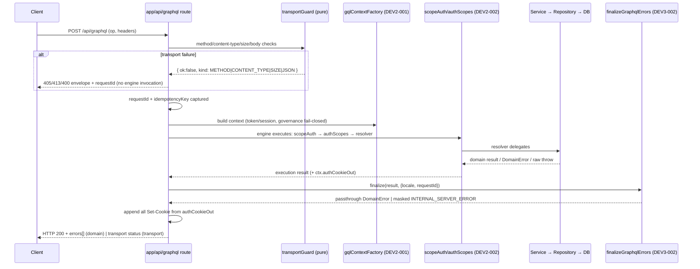

# Technical Architecture & Implementation Design: DEV3-003 — API Gateway & Routing Skeleton

> **Plan of record:** `ai/plans/dev3-003-api-gateway-routing-skeleton/`
> **Specs:** `specs.md` REQ-001..REQ-083
> **Canonical refs:** `docs/graphql/error-response-contract.md` (DEV3-002), `docs/auth/jwt-authentication-service.md` (DEV2-001/002), `docs/graphql/domain-error-extensions-code.md`, `docs/IDEMPOTENCY.md`, `docs/auth/user-registration.md`, `docs/auth/qiraah-selection-and-c5.md`, `docs/DATABASE_MIGRATIONS.md`, `docs/graphql/dataloader-batching.md`

---

## 1. System Overview & Architecture Diagram

### 1.1 Scope Statement

DEV3-003 hardens and formalizes the **single GraphQL-over-HTTP entry point** as the platform gateway. There is no REST route tree for domain traffic. The "middleware chain" is realized as a fixed seven-step pipeline inside `app/api/graphql/route.ts`, and "route registration" is the domain-module registration contract (`backend/graphql/{query,mutation,pothos}/<domain>/` side-effect modules) that all three streams must follow. The ticket adds exactly **one new GraphQL surface** (`_health`) and **one new HTTP surface** (`/api/health`), plus the **default-deny public-operation allowlist** enforced by a blocking schema-coverage gate.

### 1.2 Canonical Request Pipeline (the "middleware chain")

```
┌──────────────────────────────────────────── CLIENT ────────────────────────────────────────────┐
│  Browser / Mobile / CI probe / Load balancer                                                   │
└──────────────────────────────────────────────┬─────────────────────────────────────────────────┘
                                               │ HTTP(S)
                                               ▼
┌──────────────────  app/api/graphql/route.ts  (THE GATEWAY — pure composition) ─────────────────┐
│                                                                                                 │
│  STEP 1  transportGuard(request)                      ── pure, no I/O ──                        │
│            ├─ method ∈ {POST} (GET only if explicitly env-gated)      → 405 + Allow: POST       │
│            ├─ content-type ⊇ application/json                         → 400 envelope          │
│            ├─ content-length ≤ MAX_GRAPHQL_BODY_BYTES                 → 413 envelope          │
│            └─ body parses as JSON                                     → 400 envelope          │
│  STEP 2  requestId = resolveRequestId(headers)          (DEV3-002: honor X-Request-Id or UUID)  │
│  STEP 3  idempotencyKey = headers["X-Idempotency-Key"]  (propagation only — docs/IDEMPOTENCY)   │
│  STEP 4  ctx = gqlContextFactory(request)               (DEV2-001: token/session verify,        │
│            governance fail-closed, comes back with ctx.authCookieOut: string[])                 │
│  STEP 5  GraphQL validate → Pothos scopeAuth (401) → authScopes role/permission/superAdmin/     │
│          notImpersonating (403)                         (DEV2-002 — runs INSIDE engine,         │
│                                                          per-field, fail-closed)                │
│  STEP 6  resolver → Service → Repository → PostgreSQL   (resolvers: argument mapping only)      │
│  STEP 7  a) finalizeGraphqlErrors(result, {locale, requestId})   (DEV3-002 mask/passthrough)    │
│          b) headers.append("Set-Cookie", c) for each c ∈ ctx.authCookieOut   (multi-cookie)     │
│          c) JSON response — domain errors ride HTTP 200 (Apollo convention)                     │
└──────────────────────────────────────────────┬─────────────────────────────────────────────────┘
                                               ▼
┌──────────────────  SECOND SANCTIONED PROBE (no GraphQL parsing) ───────────────────────────────┐
│  GET /api/health  →  apiSuccessResponse({ status:"ok", service:"kottaby", version, timestamp }) │
│                      200  { data: {...}, requestId }            (DEV3-002 envelope helper)     │
└─────────────────────────────────────────────────────────────────────────────────────────────────┘

┌──────────────────  SCHEMA REGISTRATION (build-time, once — never per request) ─────────────────┐
│  backend/graphql/query/index.ts      ← side-effect imports per domain (`./health.query`, ...)  │
│  backend/graphql/mutation/index.ts   ← side-effect imports per domain                          │
│  backend/graphql/pothos/shared/health.pothos.ts  → HealthCheckPothosObject (canonical type)    │
│  backend/graphql/pothos/shared/enum.pothos.ts    → all enums registered exactly once           │
└─────────────────────────────────────────────────────────────────────────────────────────────────┘
```

### 1.3 Request Lifecycle Sequence



### 1.4 Key Design Decisions Table

| # | Decision | Options Considered | Pros / Cons | Rationale (Maintainability, Scalability, Reliability) |
|---|---|---|---|---|
| D1 | **The gateway IS the Next.js route handler + context factory + Pothos scope stack.** No REST router, no separate framework. | (a) Introduce a generic route registry (`registerRoute(method, path, handler)`) (b) Formalize the existing GraphQL entry as the gateway (c) tRPC/Hono layer | (a) Invented REST tree contradicts the canonical stack; every stream would maintain two API surfaces. (b) Zero new infrastructure; the "chain" already exists implicitly — this ticket makes it explicit and test-locked. (c) Adds a second HTTP framework to a Next.js app. | (b). Specs REQ-018/kickoff note: the 9 existing/future stream contracts (TEAM_ALLOCATION §Contract 1–6) all target GraphQL. One execution boundary = one place where masking, RBAC, and cookie rules provably hold. |
| D2 | **Two sanctioned health probes, and only two:** in-band GraphQL `_health` query (canonical) + `/api/health` HTTP route (LB-grade, no GraphQL parsing). | (a) GraphQL-only (b) HTTP-only (c) both | (a) LBs/proxies would have to POST JSON — hostile to health-check configuration. (b) CI/smoke clients of the GraphQL contract would need an HTTP-only probe anyway; dual-surface risks drift unless both are built from one service (they are — D3). | (c) with a **single producer** (`HealthCheckService.getHealthStatus`) so the payloads are identical by construction. No readiness (DB-backed) probe — deferred with owner (REQ-012 tail). |
| D3 | **Default-deny via `PUBLIC_OPERATIONS` constant + blocking schema-coverage test.** | (a) Allow-any public schema (b) Per-resolver `public: true` flag (c) Closed allowlist constant | (a) Any forgotten `authScopes` becomes a public op silently. (b) Disperses the security posture into N files; no single audit point. (c) One constant = one diff to review; the test fails when the schema's unscoped set drifts from the constant in either direction. | (c). Formalizes DEV2-002's D3 as a blocking gate (REQ-072). BFLA defense is structural: a future mutation cannot accidentally ship public. |
| D4 | **`HealthCheck` object lives in `pothos/shared/` and is Apollo `keyFields: false`.** | (a) `pothos/shared/` + embedded-type policy (b) a `pothos/gateway/` subdir (c) inline objectRef in the query file | (a) HealthCheck is a cross-cutting surface, matching the `shared/` convention used by enum registration; the shape is scalar-only with no identity, so the embedded-type normalization policy applies. (b) A one-file domain dir violates the "sub-dirs mirror real domains" convention. (c) Violates the single canonical object-type rule (backend/graphql/AGENTS.md). | (a). `keyFields: false` in `frontend/providers/apollo/apolloCache.ts` prevents "Cache data may be lost" warnings when any consumer selects the object (frontend/graphql/AGENTS.md embedded-type policy). |
| D5 | **Transport guards are pure result-returning helpers** — `TransportResult = { ok: true, body: unknown } \| { ok: false, kind: TransportErrorKind }`; the route handler maps the kind to the DEV3-002 envelope. | (a) throw DomainError (b) discriminated-union result (c) Next.js default 405 (unexported methods) | (a) Transport failures are not domain failures; conflating them muddies the taxonomy (DEV3-002 REQ-016) and would force a fake resolver context before the engine exists. (b) No throw-as-control-flow; trivially unit-testable to 100% branch coverage, no try/catch needed. (c) Loses the envelope, the `requestId`, and the `Allow: POST` header contract (REQ-015). | (b). Guarantees that transport failures carry `requestId` and a localized generic message while never touching the GraphQL engine (REQ-010 step 1, REQ-014/015). |
| D6 | **Introspection is env-explicit:** `introspection: NODE_ENV !== "production"` written as a code-level constant, never ambient default. | (a) Apollo default (b) explicit env gate (c) auth-gated introspection in prod | (a) Ambient defaults vary by server version — un-auditable. (b) One line, test-locked (prod-config probe test). (c) Adds schema-level auth machinery for an operator tool — overkill for MVP; documented as an option for a hardening ticket. | (b) (REQ-036). Test harness (`frontend/graphql/test/`) is the documented non-prod introspection consumer; codegen runs build-time and is unaffected. |
| D7 | **GET transport default-denied (405 + `Allow: POST`).** Opt-in only via a documented env flag for non-prod interactive tooling; mutations-over-GET forbidden in every environment. | (a) enable GET freely (b) GET disabled, env-gated escape hatch, POST canonical (c) GET for `_health` specially | (a) CSRF surface + cache-poisoning risk on GET GraphQL. (b) `/api/health` (D2) already covers the GET-needing probe use case, so no special ladder. (c) Special-casing one query creates a precedent exception. | (b) (REQ-016). Idempotent-read temptation resolved by D2's HTTP probe; canonical domain path stays POST-only. |
| D8 | **No CORS headers; same-origin-first.** Existing ambient behavior documented as-is; wildcard `Access-Control-Allow-Origin` must never appear on authenticated surfaces. | (a) wildcard CORS (b) no-op/document (c) full CORS matrix now | (a) Cookies are `sameSite: strict` (DEV2-001); wildcard CORS on credentialed surfaces is an anti-pattern. (c) No cross-origin consumer exists yet (mobile shares origin in MVP). | (b) (REQ-053). Preflight probe test asserts no wildcard; the matrix is a forward document contract, not code. |
| D9 | **Static assertions via file-content scans** (bun:test, no parser dependency) for the REQ-073 rules (no `await import(` in resolver files, no `values: [` enum literals in `*.pothos.ts`, no `console.` in gateway modules, route inventory classified). | (a) AST parsing via ts-morph (b) regex/content scans (c) lint-rule development | (a) New dependency + maintenance surface. (b) The targeted violations are lexical and stable; the same approach was proven in DEV2-003's `contracts.static-assertions.test.ts`. (c) Custom ESLint rule development exceeds a 3-SP ticket; can follow later. | (b). Zero new dependencies, deterministic, runs inside the existing test stacks and the DEV3-001 CI `tests` stage. |
| D10 | **Extend substrate in place, fork never.** All edits land in `gqlContextFactory.ts`, `app/api/graphql/route.ts`, DEV3-002's lib modules; no parallel gateway/context helpers. | (a) new `backend/lib/gateway-v2/` (b) extend in place | (a) Duplicated context/context-adjacent helpers is the documented failure class (REQ-004; jwt-authentication-service.md "What NOT to Do"). (b) Single source of truth preserved; diff-auditable. | (b) (REQ-004). Any discovered substrate defect → `deferred-items.md` ❌ + owning stream, not a local workaround. |

---

## 2. Data Models & Database Schema

### 2.1 Existing Schema Verification — **Zero Drift (REQ-044)**

This ticket introduces **no tables, columns, enums, indexes, triggers, or migrations**. `HealthCheck`, `PUBLIC_OPERATIONS`, and transport guards are pure TypeScript.

| Gate | Expected result |
|---|---|
| `bun validate:dbml` | GREEN, byte-identical `db/schema.dbml` |
| `git diff` on `backend/db/schema/**`, `backend/db/migration/**`, `backend/drizzle*/**` | empty |
| `bun run db push` | NOT run (no schema change exists to push) |

Any discovered schema gap is escalated via `deferred-items.md` ❌ and owned by DEV1-001 — never patched inline.

### 2.2 Canonical Types (NEW — `backend/types/gateway/`)

All types follow `backend/types/AGENTS.md`: no runtime logic in `.types.ts`, barrel `backend/types/gateway/index.ts` uses `./` relative `export *`, and root `backend/types/index.ts` gains `export * from "./gateway";`. These are transport-contract types, not DB-row types, so `{Entity}SelectType`/`InsertType` naming does not apply (same precedent as DEV3-002's `backend/types/errors/`).

**`backend/types/gateway/health-check.types.ts`:**

```typescript
/** Operator-facing liveness payload. Machine-readable constants; i18n-exempt (REQ-002 exemption). */
export interface HealthCheckReturnType {
  readonly status: "ok";
  readonly service: "kottaby";
  readonly version: string;     // resolveAppVersion(): APP_VERSION ?? npm_package_version ?? "dev"
  readonly timestamp: string;   // ISO-8601, generated per request
}
```

**`backend/types/gateway/gateway-context.types.ts`:**

```typescript
/** Request-scoped metadata the gateway guarantees on every GraphQL request.
 *  Documentary contract over BaseContext — no runtime construction here. */
export interface GatewayRequestMetadata {
  readonly requestId: string;            // DEV3-002 resolveRequestId contract
  readonly idempotencyKey: string | null; // X-Idempotency-Key, propagation-only (docs/IDEMPOTENCY.md)
}

export type TransportErrorKind = "METHOD_NOT_ALLOWED" | "UNSUPPORTED_CONTENT_TYPE" | "PAYLOAD_TOO_LARGE" | "MALFORMED_JSON";

export type TransportGuardResult =
  | { readonly ok: true; readonly body: unknown }
  | { readonly ok: false; readonly kind: TransportErrorKind };
```

**`backend/types/gateway/index.ts`:** `export * from "./health-check.types";` / `export * from "./gateway-context.types.ts";` (one `/` per path, `./` relative).

### 2.3 Enums

**None.** Health payload fields are scalars; `TransportErrorKind` is a TS string-union (transport metadata, never persisted, never GraphQL-exposed) — the DEV3-002 D3 precedent applies. `backend/enum/**` and `backend/db/schema/enums.ts` untouched; no Pothos enum registration.

---

## 3. API Contracts & Pothos Resolvers

### 3.1 GraphQL Schema Additions (exactly one operation — REQ-060)

```graphql
type HealthCheck {
  status: String!      # "ok"
  service: String!     # "kottaby"
  version: String!     # app version (build id / package version)
  timestamp: String!   # ISO-8601 server time
}

extend type Query {
  _health: HealthCheck!   # public — no authScope (allowlisted)
}
```

**Pothos definition:**
- `backend/graphql/pothos/shared/health.pothos.ts` — `export const HealthCheckPothosObject = gqlSchemaBuilder.objectRef<HealthCheckReturnType>("HealthCheck").implement({ fields: t => ({ status: t.exposeString("status"), service: t.exposeString("service"), version: t.exposeString("version"), timestamp: t.exposeString("timestamp") }) });` Canonical-type-backed (`@/backend/types`), no local type literals (CRITICAL RULE), no `id` (scalar embedded value object; Apollo `keyFields: false` per REQ-061).
- `backend/graphql/query/health.query.ts` — `gqlSchemaBuilder.queryField("_health", t => t.field({ type: HealthCheckPothosObject, resolve: () => HealthCheckService.getHealthStatus() }));` No `authScopes` key (deliberate; allowlisted). No DB. No ctx reads. No DataLoader (no sub-selections requiring batching).
- Registered via side-effect import in `backend/graphql/query/index.ts` (existing barrel convention).
- After changes: `bun run generate:gqlSchema && bun codegen` in the same commit set; diff review proves only `_health`/`HealthCheck` added and every existing surface byte-identical (REQ-060 gate).

### 3.2 Transport Failure Matrix (REQ-014/015/016 — test-locked)

| Condition | HTTP | Body | Detail |
|---|---|---|---|
| Method ∉ allowed set (`PUT`/`DELETE`/`PATCH`; `GET` when not env-enabled) | **405** | envelope `{ error: { code: "BAD_REQUEST", message, requestId } }` | `Allow: POST` header mandatory |
| Missing/wrong `Content-Type` | **400** | envelope, `code: "BAD_REQUEST"` | engine never invoked |
| `Content-Length` > `MAX_GRAPHQL_BODY_BYTES` | **413** | envelope, `code: "BAD_REQUEST"` | limit constant documented in canonical doc |
| Body unparsable as JSON | **400** | envelope, `code: "BAD_REQUEST"` | localized generic message (`errors.badRequest`) |
| Unknown GraphQL field/operation | **400** (Apollo validation convention) | GraphQL `errors[]` | never 404, never unmasked 500 |
| Non-existent path under `app/api/**` | **404** (Next.js not-found semantics) | Next default | GraphQL engine never executes |
| Domain failure inside resolver | **200** (Apollo convention) | `errors[].extensions.code` per DEV3-002 taxonomy | masked iff non-DomainError |

### 3.3 Public-Operation Allowlist (REQ-017 — closed constant)

**`backend/lib/gateway/public-operations.ts`** (non-`.types` runtime module):

```typescript
export const PUBLIC_OPERATION_NAMES = [
  "login", "refreshToken", "logout",       // DEV2-001 auth surface (logout clears cookies even when token expired)
  "registerUser",                          // DEV1-002 (RegisterPublicRole excludes admin at schema layer — BFLA)
  "recitationReadings",                    // DEV1-003 public catalog (static-safe, read-only)
  "_health",                               // D2/D3 liveness
] as const;

export type PublicOperationName = (typeof PUBLIC_OPERATION_NAMES)[number];
export const PUBLIC_OPERATIONS: ReadonlySet<string> = new Set(PUBLIC_OPERATION_NAMES);
export function isPublicOperation(name: string): name is PublicOperationName { return PUBLIC_OPERATIONS.has(name); }
```

- `demoLogin` is permitted **only** because its resolver self-gates on the existing env flag (`IS_DEMO`); implementation must verify that gate, and record the verification in the outcome. If the flag gate is absent/broken → fix via owning path, ❌ ledger row until resolved.
- Adding an entry requires: schema change + constant change + rationale line in the canonical doc + green coverage suite, in one commit set.

### 3.4 Permission Matrix (gateway-level behavior by caller)

| Interaction | Anonymous | Student | Parent | Teacher (Applicant/Certified) | Supervisor | Super Admin |
|---|---|---|---|---|---|---|
| `_health` (GraphQL) / `GET /api/health` | ✅ | ✅ | ✅ | ✅ | ✅ | ✅ |
| `login`, `refreshToken`, `logout`, `registerUser`, `recitationReadings` | ✅ (allowlisted; `registerUser` still schema-blocked for `admin`) | ✅ | ✅ | ✅ | ✅ | ✅ |
| Protected query (e.g., `me`), no session | `UNAUTHORIZED` | — | — | — | — | — |
| Role-gated mutation, role mismatch | `UNAUTHORIZED` | `FORBIDDEN` | `FORBIDDEN` | `FORBIDDEN` | perm-gated | allowed |
| Governed account (deleted/blocked suspended-active login) | generic invalid-credentials `UNAUTHORIZED` (DEV2-001 oracle equality) | — | — | — | — | — |
| Introspection, production config | denied (env gate) | denied | denied | denied | denied | denied (D6 — de-provisioning is the base case) |
| Introspection, non-production | allowed (documented) | ✅ | ✅ | ✅ | ✅ | ✅ |
| Transport violation (400/405/413) | same envelope for all roles — no identity derived from violation | ✅ same | ✅ same | ✅ same | ✅ same | ✅ same |
| Privilege-elevation mutation pattern (`grantRole*`/`assignRole*`/`elevate*`) | — | **does not exist** (coverage test proof) | same | same | same | same |

### 3.5 Non-GraphQL Route Inventory (REQ-019 — canonical doc table, registry cross-checked by REQ-073 test)

| Route | Surface | Envelope state |
|---|---|---|
| `app/api/graphql/route.ts` | The gateway | This ticket's core; envelope via engine + transport guards |
| `app/api/health/route.ts` | NEW LB probe | Envelope-adopted (`apiSuccessResponse`) |
| `app/api/webhooks/whatsapp/route.ts` | Provider webhook | **Formally exempted** per DEV3-002 REQ-019 (GET verify + POST 200-ack; HMAC + timingSafeEqual handled by the owning module); correlated logs still required |
| `app/api/logs/route.ts` | Client log ingest | Classified in doc; envelope adoption — deferred item ⚠️→ owner: observability ticket (non-blocking) |
| `app/api/cron/ticker`, `app/api/cron/execute` | Internal cron | Classified in doc; internal-secret gating; envelope adoption — deferred item ⚠️→ owner: cron-service ticket (non-blocking) |
| `app/api/set-locale/route.ts` | Locale cookie setter | Classified in doc; envelope adoption — deferred item ⚠️→ owner: i18n ticket (non-blocking) |

**Rule:** any `app/api/**/route.ts` discovered at implementation time but absent from this table MUST be appended to the doc + registry before close (the REQ-073 suite fails otherwise). No route may remain unclassified.

---

## 4. Backend Services, Repositories & Concurrency Model

### 4.1 Module Inventory

| File | Kind | Responsibility |
|---|---|---|
| `backend/types/gateway/health-check.types.ts` (+ `gateway-context.types.ts`, `index.ts`, root barrel) | NEW | Canonical contract types (§2.2) |
| `backend/services/gateway/health-check.service.ts` | NEW | `HealthCheckService.getHealthStatus(): HealthCheckReturnType` — pure: `{ status: "ok", service: "kottaby", version: resolveAppVersion(), timestamp: new Date().toISOString() }`. No DB, no env secrets, no ctx. Domain namespace per `backend/services/AGENTS.md`. |
| `backend/lib/gateway/version.ts` | NEW | `resolveAppVersion()` — reads `process.env.APP_VERSION ?? process.env.npm_package_version ?? "dev"`; if env-config registry (`env-config-keys.ts`) requires registration, the key is registered per the env-config semantic rule. |
| `backend/lib/gateway/public-operations.ts` | NEW | Allowlist constant + `isPublicOperation` guard (§3.3). |
| `backend/lib/gateway/transport-guard.ts` | NEW | Pure helpers: `assertAllowedMethod(method, getEnabled)`, `assertJsonContentType(headers)`, `assertWithinBodyLimit(headers, MAX_GRAPHQL_BODY_BYTES)`, combination `guardTransport(request): Promise<TransportGuardResult>` — result-union, no throws (D5). |
| `backend/lib/gateway/index.ts` | NEW | Barrel, `./` relative `export *` only. |
| `backend/graphql/pothos/shared/health.pothos.ts` | NEW (+shared barrel re-export) | `HealthCheckPothosObject` (§3.1). |
| `backend/graphql/query/health.query.ts` | NEW (+`query/index.ts` side-effect import) | `_health` public field. |
| `app/api/graphql/route.ts` | MODIFY | Seven-step ordering (REQ-010): transport guard → requestId (+idempotencyKey capture) → context factory → engine → finalize → cookie merge via `headers.append` (never `headers.set`). Explicit handlers for disallowed methods returning the 405 envelope. Introspection env-gate at server config (D6). |
| `backend/graphql/gqlContextFactory.ts` | MODIFY (minimal) | Add `ctx.requestId` (if DEV3-002 did not land it) and `ctx.idempotencyKey` capture into the returned context — extend in place, no fork (REQ-004). |
| `app/api/health/route.ts` | NEW | `GET` only → `return apiSuccessResponse(HealthCheckService.getHealthStatus(), { requestId: resolveRequestId(request.headers) })`. No auth, no GraphQL parse, no DB. |
| `frontend/providers/apollo/apolloCache.ts` | MODIFY (one line) | `typePolicies` gains `HealthCheck: { keyFields: false }` + policy-list comment entry (embedded-type policy). |
| `backend/lib/gateway/static-assertions.test.ts` | NEW (bun:test) | REQ-073 scans (§4.4). |
| `frontend/graphql/test/gateway/**` | NEW | REQ-071 integration matrix, REQ-072 allowlist coverage, REQ-074 chaos probes via `setupTestServerLifecycle` + `testClient`. |

**Repositories:** none added, none modified. The gateway performs **zero DB access** (REQ-020 purity, DEV3-002 REQ-040).

### 4.2 Service / Repository Conventions

- `HealthCheckService` is pure: deterministic shape, fresh `timestamp` per call, no I/O, no module-level mutable state.
- No permission gating on health (public); no rate-limit behavior change anywhere (REQ-035: fail-open stub posture untouched).
- Resolvers contain only argument mapping + delegation; `_health` has no args and one delegation call.
- No `await import(` anywhere in resolver/Pothos files (Bun ESM limitation); top-level static imports only — scanned by REQ-073.
- Errors: `_health` cannot throw under normal operation; an unexpected throw flows through the finalize boundary and is masked with `INTERNAL_SERVER_ERROR` + requestId logging (REQ-050). Transport guard failures never throw (D5).

### 4.3 Concurrency & Race Condition Assessment

The gateway is **stateless by construction**: no mutable rows, quotas, balances, locks, or caches. No `SELECT FOR UPDATE`, no advisory lock, no Redis, no `SET NX EX` is introduced (REQ-041).

| Scenario | Actors | Risk | Mitigation |
|---|---|---|---|
| Two concurrent requests (different users, both setting auth cookies) | 2 clients × one route handler | Cookie cross-contamination between responses | Each request gets its own context object, and `ctx.authCookieOut` is a **per-context array** allocated by the context factory per call. The route merges that array into the response for the same request only. REQ-074 test: two concurrent logins (A and B) → response A carries only A's three cookies; response B carries only B's. |
| `_health` request storm | N parallel clients/probes | Timing skew, stampede | No shared state read or written; `Promise.allSettled` storm test proves all return 200 with a fresh ISO timestamp. |
| Idempotent client retry with identical `X-Idempotency-Key` | flake-prone mobile client | Double execution vs classification drift | Gateway obligation stops at propagation: identical headers → identical context payload → identical allowlist/RBAC/transport path. Storage/duplicate-blocking stays in the mutation's service transaction (`docs/IDEMPOTENCY.md`). REQ-043 test asserts header→context propagation. |
| Refresh-rotation race (parallel tabs, stale JTI) | same user, 2 tabs | Divergent session state | **Unchanged by this ticket** — DEV2-001's stale-JTI honor/rotation contract preserved verbatim; chaos probe re-verifies convergence. |
| requestId collision | N requests | Correlation failure | `crypto.randomUUID()` per request inside `resolveRequestId`; inbound `X-Request-Id` honored; no shared counter. |
| Schema assembly race | module load vs request | Partially-built schema | Assembly happens once at module init (side-effect imports), synchronously, before the first request is served; never per request (REQ-040). |
| TOCTOU on anything | — | — | **Null by construction.** The gateway holds no check-then-act state (REQ-041). The only check-then-act in the platform (e.g., registration uniqueness) is enforced by DB constraints upstream (DEV1-002 pattern), unreachable from gateway code. |
| Error-path cookie loss (e.g., `logout` that also errors) | logout resolver + finalize boundary | User stuck with cookies (loop risk) | Cookie merge runs **after** finalize, unconditionally (REQ-042); logout's `clearAuthCookies` entries land even if the resolver body failed. Test-locked. |

### 4.4 Static Assertion Suite (REQ-073 — `backend/lib/gateway/static-assertions.test.ts`, bun:test, no server)

| Assertion | Scan target | Rule |
|---|---|---|
| A1 | `backend/graphql/{query,mutation,pothos}/**` | No `await import(` substring inside any resolver/Pothos file |
| A2 | `backend/graphql/pothos/**/*.pothos.ts` | No `values: [` literal-array enum registration (enum registration belongs to `shared/enum.pothos.ts`, enum-object form only) |
| A3 | `backend/lib/gateway/**`, `app/api/graphql/route.ts`, `app/api/health/route.ts`, `backend/services/gateway/**` | No `console.` call sites |
| A4 | `app/api/**/route.ts` | Every discovered route appears in the inventory registry exported from `backend/lib/gateway/route-inventory.ts` (a small classifying constant: `{ path, classification: "gateway" \| "envelope" \| "provider-ack-exempt" \| "deferred" }`) — the doc table and registry are one source |
| A5 | `backend/types/gateway/**` | No i18n/other-layer imports beyond allowed (`@/shared` not needed here at all); `.types.ts` files contain zero runtime exports |

---

## 5. Frontend UX & Navigation Specification

This ticket ships **no user-facing UI**. Sections are completed for template compliance and to pin the forward integration contract.

### 5.1 Routes & URLs Table

| Path | Purpose | Required Permission | Allowed Roles |
|---|---|---|---|
| `POST /api/graphql` (existing) | Domain API gateway | operation-specific (default-deny + allowlist) | per operation |
| `GET /api/health` (NEW) | LB/probe liveness | none | all (incl. anonymous) |
| `/api/webhooks/...`, `/api/cron/...`, `/api/logs`, `/api/set-locale` (existing) | non-GraphQL surfaces | per owning module | classified under REQ-019 |

No page routes are added, removed, or modified. No `page.tsx`, layout, or `withPageAuth` change.

### 5.2 Sidebar & Navigation Integration

None. No navigation group, item, order, or mobile bottom-nav change. Recorded explicitly to satisfy the navigation checklist.

### 5.3 Per-Audience Rendering

| Audience | Differences |
|---|---|
| Student | None |
| Parent | None |
| Teacher (Applicant/Certified) | None |
| Supervisor | None |
| Admin/Staff | None (audit surfaces consume the gateway transparently via normal GraphQL operations) |
| Anonymous | `_health`/`/api/health` reachable; everything else follows REQ-017 default-deny |

### 5.4 Apollo GraphQL Documents & UI Components

- **Optional document:** `healthCheckQueryDocument` — `frontend/graphql/sharedDocuments/shared/health.documents.ts` (or existing shared subdomain), `TypedDocumentNode<HealthCheckQuery>`, no variables (no-arg query → omit second type param per sharedDocuments rules), imported `gql` from `@apollo/client`, registered in the subdomain barrel. **Deferrable per REQ-062**: if no consumer exists at close, omit it and record a ledger entry (non-blocking, owner: first consumer — expected DEV3-001 CI smoke or observability tooling). The GraphQL surface + integration test are mandatory regardless.
- **Apollo cache policy (mandatory):** `HealthCheck` is registered with `keyFields: false` in `frontend/providers/apollo/apolloCache.ts` (REQ-061) so any future document selecting it is normalization-safe from day one.
- **No new components, hooks, or stores.** No MUI surface; `sx`-only / `*Outlined` / theme-palette rules apply to any incidental touch; none is planned (REQ-063).

### 5.5 Visual Design & Responsive Specifications

- **Breakpoints (1440 / 768 / 375):** N/A — no visual surface. Any future health-status badge/tooling UI must follow the standard responsive matrix; the forward note lives in the canonical doc, not in code.
- **Multi-language & RTL:** N/A — health payloads are operator-facing machine constants (`ok`, `kottaby`, version, ISO timestamp); i18n exemption recorded (REQ-002). All other gateway-emitted client-visible strings (transport envelope messages) come from the compile-time `errors` namespace with `ar`+`en` parity (REQ-051), so any UI that renders them is RTL-safe by construction.
- **Visual State Matrix:** None applicable (no rendering). Error rendering contract for consumers of the gateway remains DEV3-002's errorLink mapping (`FORBIDDEN` → `PermissionDeniedFallback`, validation → RHF fields, etc.) — unchanged by this ticket.

### 5.6 Agent-Browser / Tooling Verification Protocol (REQ-071 targets an automated harness)

Endpoint and workflow checklist for verification (curl/agent or the GraphQL test client):

1. `GET /api/health` → `200`, body `{ data: { status:"ok", service:"kottaby", version, timestamp }, requestId }`.
2. `POST /api/graphql` with `{ "query": "{ _health { status service version timestamp } }" }`, no auth → `200`, full payload on `data._health`.
3. `POST /api/graphql` with **malformed JSON** → `400` envelope containing `requestId`; GraphQL engine logs show no execution.
4. `PUT /api/graphql` (and `DELETE`, `PATCH`) → `405`, `Allow: POST` present.
5. `GET /api/graphql` (GET not env-enabled) → `405`; with the documented non-prod flag enabled, a **query** may pass while a **mutation-over-GET** is always rejected.
6. `POST /api/graphql` oversized body (`Content-Length` > limit) → `413` envelope.
7. Unauthenticated `{ me { id } }` → HTTP 200, `errors[].extensions.code = "UNAUTHORIZED"`.
8. Authenticated low-privilege caller on a role-gated op → `FORBIDDEN`, resolver side-effects provably absent.
9. Synthetic resolver fault probe (raw non-DomainError throw behind a test-only field, or a forced failure fixture) → masked `INTERNAL_SERVER_ERROR`, client payload contains no stack/SQL/env/path; captured log contains the original error + same `requestId`.
10. `login` happy path → response carries **three** `Set-Cookie` headers (`session_id`, `refresh_token`, `access_token`) with the DEV2-001 matrix flags.
11. `logout` with a forced failure injected after cookie clearing → three `Set-Cookie` clearing headers still present (REQ-042).
12. `X-Request-Id: <fixed>` inbound → same id echoed in error `requestId` and log correlation (REQ-034/071(h)).
13. Two concurrent logins for distinct users → per-response cookie isolation (Section 4.3 row 1).
14. Unknown path (`GET /api/definitely-not-a-route`) → 404 and no GraphQL engine activity.
15. Production-config introspection query → denied (D6); non-prod introspection → works (documented harness consumer).

---

## 6. Security, Authorization & Tenancy Mitigations

### 6.1 BOLA / IDOR (REQ-030)

- Identity is sourced **exclusively** from verified token/session resolution inside `gqlContextFactory` (`ctx.user.id`). The gateway propagates exactly two client headers — `X-Request-Id` and `X-Idempotency-Key` — and neither can influence identity or authorization decisions.
- The gateway never maps request metadata, arguments, or headers into identity-bearing context fields. The transport guards run before any context construction and cannot mutate identity.
- Governance (A.7/INV-U3): deleted/blocked accounts produce **no usable context** from the fail-closed factory; there is no gateway-side secondary check that could diverge (REQ-033 chain preserved).

### 6.2 BOPLA (REQ-031)

- Context assembly copies a fixed whitelist (`requestId`, `idempotencyKey`, `locale`, auth artifacts). No `...request`-style spread into context, services, or any DB write.
- The gateway performs **zero DB writes**; mass-assignment exposure is structurally impossible at this layer — only consumed domain operations have write paths (their own BOPLA whitelists from DEV1-002/DEV1-003 apply).

### 6.3 BFLA (REQ-032)

- Default-deny (D3) is the structural defense: a resolver without `authScopes` that is not in `PUBLIC_OPERATIONS` fails the REQ-072 blocking gate at CI.
- `registerUser`'s schema-layer `RegisterPublicRole` gate (excludes `admin`, DEV1-002) is unchanged; the gateway does not weaken or bypass it. Transport-tamper variants (raw HTTP crafted roles) still hit the service-layer runtime gate.
- The allowlist constant contains **no write-capable privileged operation**: `login`/`refreshToken`/`logout` (auth lifecycle), `registerUser` (ungoverned self-service, role-constrained), `recitationReadings` (read-only static catalog), `_health` (read-only constants).
- No `grantRole*`/`assignRole*`/`elevate*`-shaped mutation exists under any non-admin scope — asserted by the coverage test (DEV2-002 REQ-074 preserved).

### 6.4 401-vs-403 Exclusivity (REQ-033)

- `scopeAuth` (no verified context) → `UNAUTHORIZED`; `authScopes` miss (verified context, insufficient role/permission) → `FORBIDDEN`. The gateway performs **no error-code remapping** at the route layer; the DEV3-002 finalize boundary passes DomainError codes through untouched. REQ-071(e)/(f) lock the pair behaviorally.
- Governed-account rejects (deleted/blocked/active-suspension) reuse the single generic invalid-credentials path at login and the fail-closed context path elsewhere — no gateway-visible distinction (no oracle).

### 6.5 Input Sanitization & Injection

- The gateway never constructs queries from user text; no LIKE/ILIKE surface exists here, so `escapeLikeWildcards` is **not applicable** — recorded in the canonical doc so it is not mistaken for an omission. Consumer tickets with search (DEV3-008/009) must apply it (forward contract).
- Body parsing is bounded (`MAX_GRAPHQL_BODY_BYTES`), typed JSON only; GraphQL query text is validated by the engine — any oversized/malformed input dies before context creation (REQ-015).
- `graphql-parse`-time bombs (deep query/circular complexity) are depth-limited at the consumer/configuration level on a later hardening ticket; this ticket records the posture and gates nothing new (deferral is documented, owner: Sprint-4 hardening).

### 6.6 Information Disclosure (REQ-034/036)

- Production: no stack traces, SQL text, parameter values, env names/values, or filesystem paths in any response — enforced by the DEV3-002 masking boundary on the GraphQL path and by the envelope helpers on the transport path. The REQ-071(g) probe forces a raw failure and scans the payload for leakage markers.
- `_health`/`/api/health` expose exactly four fields (status/service/version/timestamp). No runtime internals, no dependency versions, no region/instance identifiers.
- Introspection is environment-explicit (D6); the prod-config test proves denial; the non-prod consumer (`frontend/graphql/test/` + build-time codegen) is documented.
- `requestId` appears in every access/error log line for gateway traffic; logging uses `logger` / `logger.logDomainError` from `@/backend/lib/logger` only — zero `console.*` (A3 scan).

### 6.7 Tenancy & Statelessness (REQ-037)

- Single-tenant schema; the gateway threads tenancy only via ctx-derived identity from verified context — never from arguments/headers.
- No module-level mutable state (no Maps/Sets/counters/registries mutated at runtime). The only module-level constants are frozen (`PUBLIC_OPERATIONS`, inventory registry, body-limit constant); REQ-040 and the semantic-review checklist (bounded-state rule) enforce this.

### 6.8 Rate-Limit Posture (REQ-035)

- Unchanged by construction: the existing fail-open stub at the login/registration seam keeps its posture (fail-open on transient limiter errors; real enforcement owned by the DEV2 chain). No new public surface is added that requires additional limiting (health probes are trivially cacheable constants and are exempt by posture; abuse is bounded by the body-limit + method gates).
- HTTP-layer per-IP throttling is a **deferral** — ledger entry ⚠️ with owner: production-hardening/Sprint-4 ticket.

---

## 7. Deliverable Artifacts Checklist (traceability to specs.md)

| Deliverable | REQs |
|---|---|
| Phase-0 baseline + `deferred-items.md` + `outcome/phase0-baseline-outcome.md` | REQ-001, REQ-082 |
| `backend/types/gateway/*` + barrels | REQ-003 |
| `HealthCheckService` + `resolveAppVersion` (+ env-config registration if required) | REQ-012, REQ-003 |
| `HealthCheckPothosObject` + `_health` query + codegen commit | REQ-012, REQ-060, REQ-061; D4 |
| `app/api/health/route.ts` via DEV3-002 envelope | REQ-013 |
| `app/api/graphql/route.ts` seven-step ordering restructure + method/content/size guards | REQ-010, REQ-014, REQ-015, REQ-016, REQ-020; D1, D5, D7 |
| `gqlContextFactory` requestId/idempotencyKey context additions (in-place) | REQ-010, REQ-004, REQ-030, REQ-043 |
| Cookie-merge hardening (append-all, error-path-safe) | REQ-011, REQ-042 |
| `backend/lib/gateway/public-operations.ts` + route inventory registry | REQ-017, REQ-019; D3 |
| Introspection env-gate at server config | REQ-036; D6 |
| CORS posture documentation + preflight probe | REQ-053; D8 |
| `frontend/providers/apollo/apolloCache.ts` `keyFields: false` (+ optional `healthCheckQueryDocument`) | REQ-061, REQ-062 |
| GraphQL integration matrix suite | REQ-070, REQ-071, REQ-074 |
| Allowlist schema-coverage gate (blocking, runs in `test:graphql` + DEV3-001 `tests` stage) | REQ-072; D3 |
| Static assertion suite (`static-assertions.test.ts`) | REQ-073; D9 |
| i18n `errors` key verification for any new transport messages (ar+en parity) | REQ-002, REQ-051 |
| `bun validate:dbml` + schema/codegen drift evidence | REQ-044, REQ-060, REQ-076 |
| Per-file `sub-loop.ts --lifecycle duplicates` exit 0 | REQ-076 |
| Canonical doc `docs/graphql/api-gateway-and-routing.md` (processing order, transport matrix, allowlist rules, probes, registration contract, route inventory, CORS/method/introspection policy, N/A affirmations) | REQ-080, REQ-018 |
| AGENTS.md propagation: `backend/graphql/AGENTS.md` (gateway/registration rule line), `app/AGENTS.md` (`app/api/**` conventions pointer), root `AGENTS.md` Important References one-liner | REQ-081 |
| Outcome files per task + plan-review gate outcome (`plan-review-R1.md`) | REQ-082 |
| Deferred gate: `grep -c "❌\|⚠️" deferred-items.md` = 0 (pre-seeded entries — HTTP throttling [REQ-035], readiness probe [REQ-012 tail], optional health document [REQ-062 tail], `/api/logs` + cron + set-locale envelope adoption [REQ-019] — each carries an owner + targeted status) | REQ-083 |

**Non-negotiable invariants for implementation:** zero DB/schema drift; no REST route registry; no dynamic `await import(` in GraphQL modules; no `console.*`; no new enums (TS union only); no `headers.set("Set-Cookie", ...)` (append only); no string-literal enum values anywhere; Apollo-convention HTTP 200 for all GraphQL domain errors; the allowlist constant and the schema's unscoped field set must be exactly equal; and `bun run generate:gqlSchema && bun codegen` diffs limited to the `_health`/`HealthCheck` surface.
