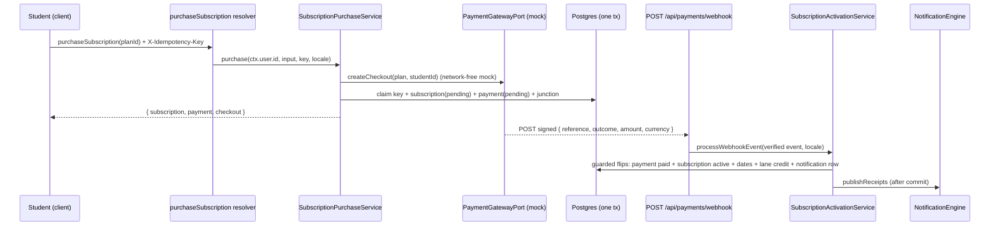
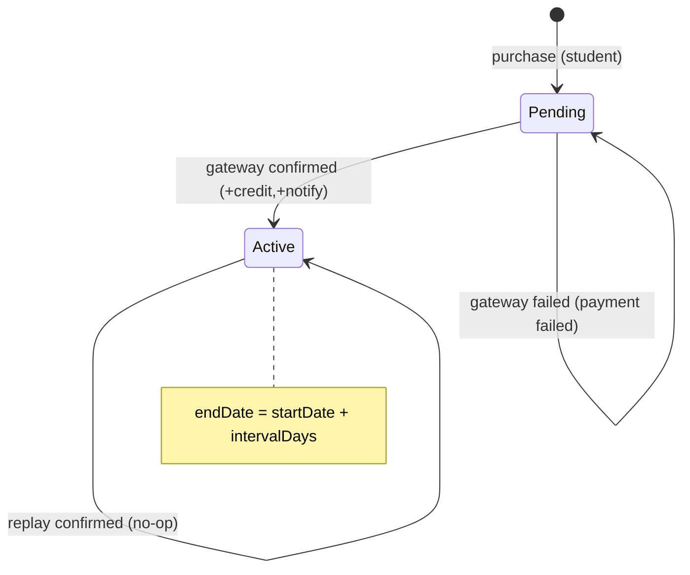

# Technical Architecture & Implementation Design: DEV1-006 — Subscription Purchase via Payment Gateway

**Plan directory:** `ai/plans/sprint_1/DEV1-006-subscription-purchase-payment-gateway/`
**Specs:** `ai/plans/sprint_1/DEV1-006-subscription-purchase-payment-gateway/specs.md`
**Tasks:** `ai/plans/sprint_1/DEV1-006-subscription-purchase-payment-gateway/tasks.md`
**Deferred-items ledger:** `ai/plans/sprint_1/DEV1-006-subscription-purchase-payment-gateway/deferred-items.md`

## Document Information

- **Feature Name**: Subscription Purchase via Payment Gateway
- **Ticket**: DEV1-006 (Sprint 1, 5 pts) — `docs/planning/TICKETS.md:449-493`
- **Version**: 1.0 · **Date**: 2026-09-06
- **Related Documents**: `docs/billing/plan-catalog.md` (DEV1-005), `docs/IDEMPOTENCY.md`, `docs/notifications/realtime-engine.md`, `docs/graphql/error-handling-contract.md`, `docs/specs/state-machine-invariants.md`, `docs/specs/open-decisions-and-gaps.md`, `docs/planning/SPRINT_PLAN.md`

## 1. System Overview & Architecture

### 1.1 What this is
A GraphQL-driven purchase flow backed by a provider-agnostic payment-gateway port. Sprint 1 ships the MOCK provider (`docs/planning/SPRINT_PLAN.md:161`): the full domain flow (purchase → pending pair → signature-verified webhook → guarded atomic activation → lane credit + notification) is real; only the "gateway" is simulated. Sprint 2 swaps in a real adapter with zero domain/service changes.

### 1.2 Interaction diagram



### 1.3 Key Design Decisions

| # | Decision | Rationale | Alternatives rejected |
|---|---|---|---|
| D1 | Mock provider behind `PaymentGatewayPort` (`backend/types/billing/payment-gateway.types.ts` types + `backend/services/billing/payment-gateway/` runtime) | SPRINT_PLAN:161 mandates mock-for-dev; port + factory mirrors meeting-provider doctrine | Hardcoding a real SDK (no credentials exist), inline "if mock" branches |
| D2 | Amend `prevent_student_payments_update` trigger: allow ONLY `pending→paid|failed` with financial columns frozen | Ticket AC flips `student_payments.status`; INV-PAY2 correction-ban preserved as column-freeze | Compensating-row ledger (breaks unique read model, double-booking risk), dropping the trigger (loses INV-PAY2) |
| D3 | Stage activation crediting on `subscriptions`, not a separate event table | `subscriptions.status` guarded transition IS the idempotency arbiter (zero-row replay); no extra infra | New `processed_webhook_events` table (unneeded second source of truth) |
| D4 | New `plans.balance_lane` column (`subscription_credit_lane` pgEnum: hifz/tajweed/reviews), fail-closed purchase when NULL | Nothing in tree encodes plan→lane (verified); title-parsing is forbidden heuristic; FR-2.4/INV-B2 requires a lane at activation | Title heuristics; deferring to DEV1-007 (would break DEV1-006 AC "credit on activation") |
| D5 | Add `mock` member to `payment_gateway` pgEnum + TS enum | Audit honesty (INV-PAY4): mock payments must be distinguishable from `other` | Mapping to `other` (loses attribution in auditor queries) |
| D6 | Purchase idempotency via NEW `subscription_purchase_idempotency` claim table (fate-sharing insert-in-tx) | Mirrors exact session-claim precedent (`session_request_idempotency`); `docs/IDEMPOTENCY.md` mandates keys for Payment creation | Unique constraint on `(user_id,plan_id)` (would block legitimate renewals) |
| D7 | lane credit via new `StudentRepository.creditLaneBalance(studentId, lane, amount, tx)` using a FROZEN credit-lane column map (3 lanes incl. reviews) | Existing `LANE_BALANCE_COLUMNS` deliberately excludes reviews (holds vocabulary); crediting needs all three | Reusing `HeldBalanceLane` (would smuggle `reviews` into hold vocabulary) |
| D8 | NO student purchase UI; admin plan form gains lane select only | Sprint-2 real-gateway UX; mutation is the Sprint-1 contract | Placeholder checkout page (throwaway work, false UX signal) |
| D9 | Webhook route: bare-404-when-disabled + HMAC over raw body + masked envelopes | Direct copy of cron route security posture (`app/api/cron/sweep-sessions/route.ts`) | GraphQL mutation for callbacks (gateway can't bear our auth) |
| D10 | Amount/currency mismatch → quarantine (no write, error log, 200) | Settlement integrity > liveness; retry storms create duplicate-credit noise without the guard doing its job | Hard-failing 4xx (gateways retry forever), silent upgrade |

## 2. Data Models & Database Schema

### 2.1 Existing schema verification (read-only facts)

| Table | Key columns | Notes for this ticket |
|---|---|---|
| `plans` (`backend/db/schema/billing/plans.ts:14-36`) | `id`, `title`, `sessionCount`, `price` decimal(10,2), `currency` char(3) default EGP, `intervalDays`, `isActive`, `deactivatedAt` | CHECKs `session_count>0`, `price>=0`, `interval_days>0`; EXTEND with `balance_lane` |
| `subscriptions` (`backend/db/schema/billing/subscriptions.ts:19-42`) | `userId`→users restrict, `planId`→plans restrict, `status` default `pending`, `startDate/endDate`, `paymentMethod`, `paymentReference`, `paymentVerifiedAt` | EXTEND: partial unique index on `payment_reference` |
| `student_payments` (`backend/db/schema/billing/student-payments.ts:23-48`) | `studentId`→students restrict, `subscriptionId` set-null, `amount`, `currency`, `paymentGateway`, `status` default `pending` | Trigger blocks UPDATE/DELETE (see D2) |
| `student_subscriptions` (`backend/db/schema/billing/student-subscriptions.ts:20-35`) | composite PK `(student_id, subscription_id)`, cascade FKs, `enrolledAt` | Inserted at purchase |
| `students` (`backend/db/schema/students/students.ts:18-47`) | `id`≡`users.id`, `balanceHifz/Reviews/Tajweed` (nullable, default 0), `balanceTrial` NOT NULL, CHECK ≥ 0 on all | Credit target |

### 2.2 Schema deltas (CREATE/EXTEND — all Drizzle-declared, applied via `bun run db` push; custom trigger SQL via migration folder)

| Artifact | Kind | Definition |
|---|---|---|
| `subscription_credit_lane` pgEnum | CREATE | `enums.ts`: `["hifz", "tajweed", "reviews"]`; TS mirror `SubscriptionCreditLane` at `backend/enum/billing/subscription-credit-lane.enum.ts` |
| `plans.balance_lane` | EXTEND | `balanceLane: subscriptionCreditLane("balance_lane")` — **nullable** (backward-compatible rows); purchase fails closed on NULL (REQ-050 `PLAN_LANE_UNCONFIGURED`) |
| `payment_gateway` pgEnum | EXTEND | add member `"mock"` (enum ALTER via regeneration; INV-PAY4 addendum) |
| `subscription_purchase_idempotency` table | CREATE (`backend/db/schema/billing/subscription-purchase-idempotency.ts`) | `id` identity PK, `idempotencyKey varchar(128)` UNIQUE, `userId` → users cascade, `subscriptionId` → subscriptions set-null, `createdAt`; mirrors `session-request-idempotency.ts` shape |
| `subscriptions_payment_reference_unique` | EXTEND | partial unique index `WHERE payment_reference IS NOT NULL` (REQ-033) |
| Trigger amendment | MIGRATION (custom SQL) | `CREATE OR REPLACE FUNCTION prevent_student_payments_update()` in NEW files `backend/db/migration/4-student-payments-status-transition.sql` + `4-student-payments-status-transition-sqlite.sql`; allowed iff `OLD.status='pending' AND NEW.status IN ('paid','failed')` AND `student_id, subscription_id, amount, currency, payment_gateway, created_at` unchanged |

### 2.3 Canonical types (`backend/types/billing/`)

| Type | File | Definition rule |
|---|---|---|
| `SubscriptionReturnType` | `subscription.types.ts` (EXTEND) | `SubscriptionSelectType` with `status: SubscriptionStatus`, `paymentMethod: PaymentGateway \| null` — enums strongly typed |
| `PurchaseSubscriptionInput` | `subscription.types.ts` (EXTEND) | `{ readonly planId: number }` — the ONLY client-supplied field |
| `PurchaseSubscriptionReturnType` | `subscription.types.ts` (EXTEND) | `{ subscription, payment, checkout }` composition (no spreads) |
| `StudentPaymentReturnType` | `student-payment.types.ts` (EXTEND) | select type with `status: PaymentStatus`, `paymentGateway: PaymentGateway` |
| `SubscriptionPurchaseIdempotencySelectType/InsertType` | NEW `subscription-purchase-idempotency.types.ts` | `$inferSelect`/`$inferInsert` |
| `PaymentGatewayPort`, `PaymentCheckoutInput`, `PaymentCheckoutSession`, `PaymentWebhookEvent` (`{ reference, outcome: "confirmed"\|"failed", amount: string, currency: string }`) | NEW `payment-gateway.types.ts` | provider-agnostic port types; money as string |

## 3. API Contracts & Pothos Resolvers

### 3.1 Wire surface (SDL sketch)

```graphql
mutation purchaseSubscription(input: PurchaseSubscriptionInput!): PurchaseSubscriptionPayload!
input PurchaseSubscriptionInput { planId: ID! }
type PurchaseSubscriptionPayload {
  subscription: Subscription!
  payment: StudentPayment!
  checkout: PaymentCheckout!
}
type PaymentCheckout { provider: PaymentGateway! providerReference: String! checkoutUrl: String }
type Subscription {
  id: ID!
  planId: Int!
  status: SubscriptionStatus!
  startDate: String
  endDate: String
  paymentMethod: PaymentGateway
  paymentReference: String
  paymentVerifiedAt: String
  createdAt: String!  updatedAt: String!
}
type StudentPayment {
  id: ID!
  subscriptionId: Int
  amount: String!      # decimal string — never number
  currency: String!
  paymentGateway: PaymentGateway!
  status: PaymentStatus!
  createdAt: String!  updatedAt: String!
}
query mySubscriptions: [Subscription!]!
extend type Plan { balanceLane: SubscriptionCreditLane }
enum SubscriptionCreditLane { HIFZ TAJWEED REVIEWS }
```

### 3.2 Resolver shape & authScopes

| Operation | authScopes | Identity rule | Delegation |
|---|---|---|---|
| `purchaseSubscription` | `{ $all: { authenticated: true, role: [UserRole.Student] } }` | `ctx.user.id` only (shared-PK student); NO input identity | `SubscriptionPurchaseService.purchase(ctx.user.id, coercePlanId(args.input.planId, ctx.locale), ctx.idempotencyKey, ctx.locale)` |
| `mySubscriptions` | `{ $all: { authenticated: true, role: [UserRole.Student] } }` | `ctx.user.id` | `SubscriptionPurchaseService.listOwn(ctx.user.id)` |
| `Plan.balanceLane` field | inherits field parent scopes | — | plain exposure |

- `PurchaseSubscriptionInput.planId` coerced via the EXISTING `PlanCatalogService.coercePlanId(rawId, locale)` (`plan-catalog.service.ts:213`).
- No public/anonymous exposure: the default-deny gateway allowlist (`backend/lib/gateway/public-operations.ts`) is untouched.
- New enum registrations in `backend/graphql/pothos/shared/enum.pothos.ts` (verified absent today): `PaymentGatewayPothosEnum`, `PaymentStatusPothosEnum`, `SubscriptionStatusPothosEnum`, `SubscriptionCreditLanePothosEnum` — value-object form ONLY (CRITICAL RULE).

### 3.3 Permission matrix

| Principal | purchaseSubscription | mySubscriptions | /api/payments/webhook | admin plan lane field |
|---|---|---|---|---|
| Anonymous | 401 | 401 | verified signature or 401; 404 when disabled | 403 |
| STUDENT | ✅ own | ✅ own | — | 403 |
| PARENT / TEACHER / SUPERVISOR | 403 | 403 | — | 403 |
| ADMIN (non-super) | 403 (role-gated; admin completes purchases via DEV1-009 surfaces) | 403 | — | ✅ (existing catalog gate) |

### 3.4 Webhook REST contract

`POST /api/payments/webhook` (`app/api/payments/webhook/route.ts`):

| Aspect | Contract |
|---|---|
| Disabled (`PAYMENT_WEBHOOK_ENABLED !== "true"`) | bare `404` (no envelope, no body) |
| Route registration (MANDATORY) | `backend/lib/gateway/route-inventory.ts` `ROUTE_INVENTORY` gains `{ path: "/api/payments/webhook", classification: "provider-ack-exempt" }` — the static completeness assertion fails otherwise; exemptions register row added to `docs/graphql/error-handling-contract.md` |
| Body | read ONCE via `request.text()`, cap `MAX_PAYMENT_WEBHOOK_BODY_BYTES = 64_000`, over-cap → masked 400-family envelope |
| Auth | header `x-payment-signature` = hex HMAC-SHA256(secret, rawBody); digest-compare via `createHash`+`timingSafeEqual` (cron idiom) |
| Success success | `{ data: { processed: true }, requestId }` (replay also 200, `replayed: true`) |
| Verified-but-unknown reference / mismatch | `{ data: { processed: false }, requestId }` 200 |
| All failures | `apiErrorResponse` masked envelope + `resolveRequestId` correlation (parity with cron route) |

## 4. Backend Services, Repositories & Concurrency

### 4.1 Service & repository surface (exact signatures)

**`backend/db/repo/billing/subscription.repository.ts`** (CREATE — namespace `SubscriptionRepository`):
- `insertSubscription(insert: SubscriptionInsertType, tx?: DBTransaction): Promise<SubscriptionSelectType>`
- `findById(id: number, tx?: DBQueryExecutor): Promise<SubscriptionSelectType | null>`
- `findByPaymentReference(reference: string, tx?: DBQueryExecutor): Promise<SubscriptionSelectType | null>`
- `activatePendingOnce(id: number, patch: { startDate: Date; endDate: Date; paymentVerifiedAt: Date }, tx?: DBTransaction): Promise<SubscriptionSelectType | null>` — `WHERE id AND status = 'pending' … RETURNING`
- `listByUserId(userId: number, tx?: DBQueryExecutor): Promise<SubscriptionSelectType[]>` — `createdAt DESC`

**`backend/db/repo/billing/student-payment.repository.ts`** (CREATE — namespace `StudentPaymentRepository`):
- `insertPayment(insert: StudentPaymentInsertType, tx?: DBTransaction): Promise<StudentPaymentSelectType>`
- `findBySubscriptionId(subscriptionId: number, tx?: DBQueryExecutor): Promise<StudentPaymentSelectType | null>`
- `markPaidOnce(subscriptionId: number, tx?: DBTransaction): Promise<StudentPaymentSelectType | null>` — `WHERE subscription_id AND status = 'pending' SET status='paid', updated_at=now()` (trigger-permitted per amended guard)
- `markFailedOnce(subscriptionId: number, tx?: DBTransaction): Promise<StudentPaymentSelectType | null>` — same guard for `failed`

**`backend/db/repo/billing/subscription-purchase-idempotency.repository.ts`** (CREATE — mirrors `SessionRequestIdempotencyRepository`):
- `insertClaim(insert, tx?)` (23505 NOT caught inside repo), `findByKey(key, tx?)`, `updateClaimSubscriptionId(claimId, subscriptionId, tx?)`

**`backend/db/repo/billing/plan.repository.ts`** (EXTEND):
- `findActiveById(id: number, tx?: DBQueryExecutor): Promise<PlanSelectType | null>` — `WHERE id AND is_active = true` (fulfills the DEV1-005 REQ-044 read predicate)

**`backend/db/repo/students/student.repository.ts`** (EXTEND):
- `creditLaneBalance(studentId: number, lane: SubscriptionCreditLane, amount: number, tx?: DBTransaction): Promise<StudentSelectType | null>` — single guarded `SET balance_x = balance_x + amount WHERE id`; frozen `CREDIT_LANE_BALANCE_COLUMNS` map (hifz/tajweed/reviews)

**`backend/services/billing/subscription-purchase.service.ts`** (CREATE — namespace `SubscriptionPurchaseService`):
- `purchase(studentUserId: number, input: PurchaseSubscriptionInput, idempotencyKey: string | null, locale: string, outerTx?: DBTransaction): Promise<PurchaseSubscriptionReturnType>`
- `listOwn(studentUserId: number, locale?: string, tx?: DBQueryExecutor): Promise<SubscriptionReturnType[]>`

**`backend/services/billing/subscription-activation.service.ts`** (CREATE — namespace `SubscriptionActivationService`):
- `processWebhookEvent(event: PaymentWebhookEvent, locale: string): Promise<{ processed: boolean; replayed?: boolean }>` — internal `confirmPayment` / `failPayment` private paths

**`backend/services/billing/payment-gateway/`** (CREATE — port runtime):
- `mock-payment-gateway.adapter.ts` — `createCheckout(input: PaymentCheckoutInput): Promise<PaymentCheckoutSession>` (`mock_<uuid>` reference, `checkoutUrl: null`), `parseWebhookEvent(rawBody: string): PaymentWebhookEvent`
- `payment-gateway.factory.ts` — `getPaymentGateway()` lazy singleton keyed on `resolveEnvConfig("PAYMENT_GATEWAY_PROVIDER")` (default `"mock"`); `resetPaymentGateway()` invalidates ALL resolved keys
- `webhook-signature.helpers.ts` — `verifyWebhookSignature(rawBody: string, signatureHeader: string | null, secret: string): boolean` (pure, unit-testable)

### 4.2 Concurrency & race-condition assessment

| Race | Guard | Test proof |
|---|---|---|
| Double webhook delivery (confirmed ×2) | `activatePendingOnce` zero-row on second run; second iteration replays with NO credit | Tier-3 `Promise.allSettled` chaos test |
| Double `failed`/`confirmed` cross-delivery | payment guard requires `pending`; `failed` then `confirmed` rejected & logged (REQ-053) | trigger + service tests |
| Double-click purchase (same key) | claim-table unique key → 23505 → `DUPLICATE_REQUEST` | GraphQL replay test |
| Double-click purchase (different keys) | two pending pairs possible → client MUST reuse keys (`docs/IDEMPOTENCY.md`); accepted by decision (renewal semantics allow multiple pendings) | documented |
| Plan deactivated mid-checkout | `findActiveById` inside the purchase tx (REQ-044) | concurrency test with concurrent deactivation |
| TOCTOU on reference | partial unique index (REQ-033) | duplicate-reference insert test |
| Notification fan-out failure | persist-first, publish-after-commit; publish failure never rolls back | journey test with spied transport |

### 4.3 Cross-actor journey design (from specs §3)

**Shared-entity state machine (`subscriptions` ↔ `student_payments`):**

| Current state | Trigger (actor) | Next state | Guard (predicate is the lock) |
|---|---|---|---|
| — (none) | Student purchases | `pending` / `pending` | role gate + active-plan + claim insert |
| `pending` | Gateway `confirmed` | `active` / `paid` | `status='pending'` on BOTH rows, same tx |
| `pending` | Gateway `failed` | `pending` / `failed` | `status='pending'` on payment row |
| `active` | Gateway `confirmed` replay | `active` (no-op) | zero-row guard ⇒ replayed ack |
| `pending` w/ `failed` payment | late `confirmed` | REJECTED (logged) | payment guard excludes `failed` |
| any | Parent/Teacher/Admin purchase | — | forbidden at scope |
| any | foreign idempotency key | — | oracle-safe 404-channel |



**Side-effect matrix (per transition):**

| Transition | Rows | Notification | Idempotency |
|---|---|---|---|
| purchase → pending | `subscriptions`, `student_payments`, `student_subscriptions`, `subscription_purchase_idempotency` | none (pending is silent) | `X-Idempotency-Key` claim row |
| → active | guarded UPDATE ×2 + students lane credit | `NotificationType.PaymentConfirmation` → purchaser (in-tx persist, post-commit publish) | zero-row guard on transition |
| → failed payment | guarded UPDATE ×1 | none this ticket (DEV1-009 follow-up) | same guard |

**Cross-Actor visibility:**

| State | Student A sees | Student B sees | Admin sees |
|---|---|---|---|
| pending | pending sub + payment via `mySubscriptions` | nothing | existing catalog only (subscriber views: DEV1-009) |
| active | active sub + dates; bigger balance | nothing | unchanged this ticket |
| failed payment | pending sub + failed payment | nothing | unchanged |

## 5. Frontend UX & Navigation Specification

- **New routes:** NONE for students. One new API route: `POST /api/payments/webhook`. Admin plan form (existing `/[locale]/admin/plans/…`) gains ONE select.
- **Sidebar / navigation:** UNCHANGED. No new items, no bottom-nav changes.
- **Role-based access matrix:** identical to specs §4 table — purchase/mine queries are Student-only; webhook unsessioned; admin lane select behind the existing catalog gate.
- **Per-audience rendering:** Students/Parents/Teachers—no rendering delta this ticket; Admins see a "Balance lane" select in the plan create/edit dialogs (EXTEND `frontend/views/admin/plans/` form components; keep `frontend/COMPONENT_PATTERNS.md` shared-scaffold conventions; extend `plans` namespace keys in `shared/locale/types/plans*` + en + ar leaves).
- **Permission mapping:** admin UI stays behind the existing `requirePermissionForPage`/role gate of the catalog page (no new permission string); GraphQL ops per §3.3.
- **Explicit no-purchase-UI ruling:** REQ-064; the real-gateway Sprint-2 ticket owns the purchase funnel.

## 6. Security, Authorization & Tenancy Mitigations

| Threat | Mitigation | REQ |
|---|---|---|
| Forged webhook | HMAC over raw body + constant-time compare + disabled-by-default 404 | REQ-021, REQ-043 |
| Replay = double credit | guarded transitions + unique reference index | REQ-024, REQ-033 |
| Identity spoofing in purchase | identity only from `ctx.user`; BOPLA-strict DTO | REQ-041, REQ-042 |
| Cross-tenant reads | single owner-scoped query; no id-addressed read | REQ-041 |
| Secret leakage | no payload/secret logging; masked envelopes | REQ-044 |
| Enum drift / silent widening | enum registration rules + PG-side enum validity | REQ-061 |
| Ledger tampering | trigger column-freeze (D2) preserves INV-PAY2 | REQ-027 |
| Unconfigured lane purchase | fail-closed `PLAN_LANE_UNCONFIGURED` | REQ-050 |

## 7. Components & Interfaces (implementation level)

### Component: Schema & migration set (Task 2)
- `backend/db/schema/enums.ts` (EXTEND: `subscriptionCreditLane`, `paymentGateway + mock`), `backend/db/schema/billing/plans.ts` (EXTEND `balanceLane`), `backend/db/schema/billing/subscription-purchase-idempotency.ts` (CREATE + barrel), `backend/db/schema/billing/subscriptions.ts` (EXTEND partial unique index), migration SQL pair (D2 trigger).
### Component: Types & enums (Task 3)
- `backend/enum/billing/subscription-credit-lane.enum.ts` (CREATE + barrel); `backend/enum/billing/payment-gateway.enum.ts` (EXTEND `Mock = "mock"`); `backend/types/billing/` EXTEND/CREATE per §2.3.
### Component: Repositories (Task 4)
- three new billing repos + two repo extensions per §4.1.
### Component: Payment-gateway port & mock (Task 5)
- `backend/types/billing/payment-gateway.types.ts`, `backend/services/billing/payment-gateway/*` per §4.1; env keys registered in `backend/lib/env.ts` registry.
### Component: Purchase service (Task 6)
- per §4.1; claim-then-insert fate-sharing; checkout BEFORE tx; all localized errors.
### Component: Activation service + notification (Task 7)
- per §4.1; quarantine paths; `publishReceipts` post-commit.
### Component: Webhook route (Task 8)
- `app/api/payments/webhook/route.ts` thin shell per §3.4.
### Component: GraphQL surface (Task 9)
- `backend/graphql/pothos/billing/subscription.pothos.ts`, `student-payment.pothos.ts`, `purchase-checkout.pothos.ts` (wrapper), `backend/graphql/mutation/subscription-purchase.mutation.ts`, `backend/graphql/query/subscription.query.ts`, enum registrations, `Plan` type/input extension, side-effect registration per existing mutation/query index wiring; `bun run generate:gqlSchema && bun codegen`.
### Component: Catalog lane propagation (Task 10)
- `PlanSubmitInput`/`PlanUpdateInput` + service validation + admin form select + namespace keys; seeds updated with lanes.
### Component: Journey + test harness (Tasks 4–12 suites)
- per REQ-070..075.

## 8. Error Handling & Error Contract Detail

| Situation | Class | `extensions.code` | HTTP (via taxonomy) |
|---|---|---|---|
| Unauthenticated | `UnauthorizedError` | `UNAUTHORIZED` | 401 |
| Wrong role | scope gate | `FORBIDDEN` | 403 |
| Plan missing/inactive | `NotFoundError("PLAN", …)` | `PLAN_NOT_FOUND` | 404 |
| Plan lane NULL | `ValidationError` custom | `PLAN_LANE_UNCONFIGURED` | 422 |
| Missing idempotency key | `ValidationError` | `VALIDATION` | 422 |
| Replay same key | `ConflictError("DUPLICATE_REQUEST", …)` | `DUPLICATE_REQUEST` | 409 |
| Reference collision | `ConflictError` | `CONFLICT` | 409 |
`23505/23514` `Error.cause` translation per REQ-052; webhook route never throws domain codes at clients — masked envelopes only.

## 9. Testing Strategy (layered)

| Layer | Location | Tool | Scope |
|---|---|---|---|
| Repo | `backend/db/test/logic/billing/*.test.ts` | `run-test.ts`, `runInRollback`+tx | REQ-070 incl. trigger transitions |
| Service | `backend/services/billing/*.test.ts` | `run-test.ts` | REQ-071 4-tier; gateway mocked via factory seam |
| GraphQL | `backend/graphql/test/subscription-purchase.*.test.ts` | `testClient` + `setupTestServerLifecycle` | REQ-074 |
| Webhook helper | `backend/services/billing/payment-gateway/__tests__` colocated or suite within service tests | `run-test.ts` | REQ-072 signature shell |
| Journey | `test/workflows/billing/subscription-purchase.journey.test.ts` | `run-test.ts` | REQ-073; committed fixtures + zero-residue cleanup |

## 10. Deployment, Migration & Compatibility

- **Schema application:** Drizzle changes via `bun run db` (generate → push; per policy `push` for schema, `migrate` for custom SQL — the trigger amendment pair ships as new custom migration files and flows into the `combined_custom_logic` folder).
- **Enum ALTER:** `payment_gateway` gains `mock`; `subscription_credit_lane` is created fresh. Regenerate via the db pipeline; PG `ALTER TYPE … ADD VALUE` semantics handled by the generated migration inside the transactional migrator (no CONCURRENTLY constructs allowed — `docs/DATABASE_MIGRATIONS.md`).
- **Seeds:** `seed-plans.ts` entries gain lanes; re-running seeds stays idempotent per existing seed conventions.
- **Backward compatibility:** `plans.balance_lane` nullable ⇒ existing rows survive; catalog APIs keep working when lane is NULL; purchase fail-closed until lane set.
- **Kill switch:** unset `PAYMENT_WEBHOOK_ENABLED` ⇒ webhook returns bare 404; mock provider never enabled in production config (deployment checklist item).
- **Rollback:** disable webhook + leave schema in place (additive-only deltas; trigger amendment is forward-compatible with older code paths since writes yet to exist elsewhere).

## Appendix — Governing rule files (read at execution per task)

- Root `AGENTS.md`; `backend/AGENTS.md`; `backend/db/schema/AGENTS.md`; `backend/db/repo/AGENTS.md`; `backend/services/AGENTS.md`; `backend/types/AGENTS.md`; `backend/enum/AGENTS.md`; `backend/graphql/AGENTS.md`; `app/AGENTS.md`; `shared/AGENTS.md`; `shared/locale/AGENTS.md`; `test/workflows/AGENTS.md`; `frontend/views/AGENTS.md`; `frontend/AGENTS.md`.
- Instruction files auto-discovered by `sub-loop.ts` per file (`.github/instructions/backend.instructions.md`, `frontend.instructions.md`, `tests.instructions.md`).
