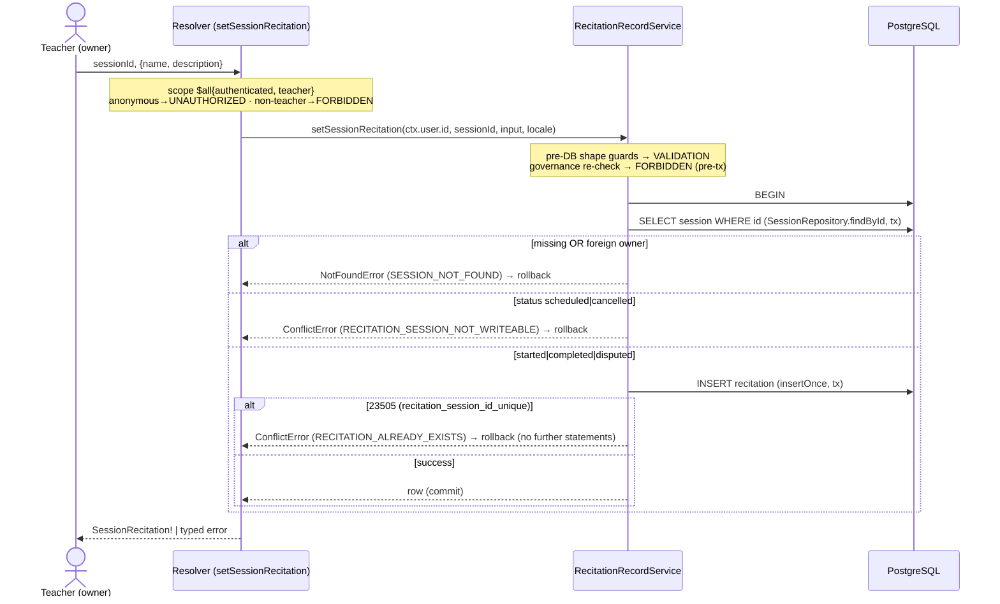

# Technical Architecture & Implementation Design: Recitation Record per Session (1:1)

**Plan directory (verbatim — all artifacts, ledger paths, and self-references in this plan use exactly this string):** `ai/plans/sprint_1/dev3-007-recitation-record-per-session-11`
**Ticket:** this ticket · Sprint 1 · Dev 3 · 2 SP · Blocked-By satisfied (the Session Creation & Lifecycle ticket shipped — `docs/sessions/session-lifecycle.md`)
**Binding anchors:** Decision **C.5** (`docs/specs/open-decisions-and-gaps.md`), session-domain oracle ruling (`docs/sessions/session-lifecycle.md` §7), permanent-retention rule (`docs/workflows/05-admin-governance-override.md` §8), Qira'ah non-resurrection guard (`docs/auth/qiraah-selection-and-c5.md` §6.1).

---

## 1. System Overview & Architecture Diagram

### 1.1 What this ticket ships

The `recitation` table **already exists and already enforces the 1:1 contract at rest** (`backend/db/schema/classes/recitation.ts:1-19` — `sessionId` NOT NULL FK `session.id` ON DELETE CASCADE, `recitation_session_id_unique`, content columns `name varchar(255) NOT NULL` + `description text NULL`, audit timestamps). What does not exist is any **behavioral surface**: no repository, no service, no GraphQL field, no read path, no document. This ticket ships the single-writer / participant-only-reader seam — and nothing else.

| Shipped | NOT shipped (negative registry) |
|---|---|
| `RecitationRepository` (closed 2-method namespace) | update / delete / list methods — recitation is write-once (retention rule) |
| `RecitationRecordService.setSessionRecitation` (write pipeline) | no admin override surface (owns) |
| `RecitationRecordService.getSessionRecitation` (collapse read) | no parent read surface (owns portal projection) |
| Mutation `setSessionRecitation` + Query `sessionRecitation` | no UI page/form/nav (non-goal 3); no notification rows; no audit rows |
| Two typed shared documents + barrels | no `apolloCache.ts` change (frozen policy surface at `frontend/providers/apollo/apolloCache.test.ts:95-106`) |
| i18n: 2 flat error keys (`recitationAlreadyExists`, `recitationSessionNotWriteable`) | no dispatcher/error-map row (RECITATION_* codes are adopted locally by future forms) |
| Journey + wire + service + repo + SDL test tiers | no `X-Idempotency-Key` requirement (constraint arbiters; outside `docs/IDEMPOTENCY.md` mandated set) |
| Canonical doc `docs/sessions/recitation-record.md` | no schema change (`bun run db push` diff MUST be empty) |

### 1.2 Layered flow

```text
WRITE (teacher)                                    READ (participant)
─────────────────                                  ─────────────────
React form (future) Any participant view (future consumers)
        │                                                  │
        ▼                                                  ▼
setSessionRecitationMutationDocument          sessionRecitationQueryDocument
(frontend/graphql/sharedDocuments/            (id-first selection; nullable payload)
 scheduling/recitation.documents.ts)
        │                                                  │
        ▼ Apollo (POST /api/graphql)                       ▼
setSessionRecitation(sessionId, input)          sessionRecitation(sessionId)
$all{ authenticated, role:[Teacher] }           { authenticated }
        │                                                  │
        ▼ resolver (thin, field-by-field)                  ▼ resolver (thin)
RecitationRecordService.setSessionRecitation    RecitationRecordService.getSessionRecitation
guards → governance (pre-tx) → withTransaction  malformed→null; findById; participant gate;
  → findById → ownership → status → insert      → findBySessionId → row | null
        │                                                  │
        ▼                                                  ▼
RecitationRepository.insertOnce (tx)            RecitationRepository.findBySessionId
        │ 23505 → ConflictError(RECITATION_ALREADY_EXISTS) │
        ▼                                                  ▼
   PostgreSQL  recitation  (recitation_session_id_unique is the write-once arbiter)
```

### 1.3 Write-path sequence (mermaid)



### 1.4 Key Design Decisions

| # | Decision | Options Considered | Pros / Cons | Rationale (Maintainability · Scalability · Reliability) |
|---|---|---|---|---|
| 1 | **DB unique constraint IS the write-once arbiter**; `23505` decoded via cause-chain → `ConflictError("RECITATION_ALREADY_EXISTS", …)` | (a) constraint arbiter · (b) pre-check `findBySessionId` then insert · (c) upsert | (a) atomic, race-proof, zero TOCTOU / (b) raw TOCTOU hole — rejected · (c) silently rewrites — violates write-once permanence (Workflow 05 §8) | Single-statement insertion failure IS the race arbiter; mirrors the certified-teacher insert `23505`→`TEACHER_ALREADY_CERTIFIED` precedent (`backend/services/admin/cold-start-certification.service.ts:44-57`, `docs/admin/cold-start-certification.md` §2.7). Reliable by construction. |
| 2 | **Two-statement in-tx pipeline** (read session → insert) — NOT a fused `INSERT…SELECT … FROM session WHERE owner∧status` | two-statement vs fused single statement | fused is atomic but its zero-row RETURNING cannot distinguish {missing, foreign, not-writeable} without a follow-on probe, AND the probe must never feed a write (lifecycle rule) / two-statement is classifiable and honest | Ownership key (`session.teacher_id`) is immutable so the only window is STATUS flips — a post-decision transition is domain-coherent (the record honestly reflects decision-time reality; a cancelled-after-write session legitimately retains its record per retention law). Window documented, accepted. |
| 3 | **Read collapses to `null`** for {malformed id, nonexistent id, foreign caller} — never an error | null vs `SESSION_NOT_FOUND` error | null: no existence oracle, identical bytes; error would re-open the session enumeration channel | Direct inheritance of the sessions-are-sensitive ruling (`docs/sessions/session-lifecycle.md` §7 — "foreign ≡ nonexistent") and the precedent `SessionLifecycleService.getSessionById` return-null shape (`backend/services/classes/session-lifecycle.service.ts:178-194`). |
| 4 | **Status admissibility window = `started | completed | disputed`** | include scheduled? include cancelled? | scheduled = nothing happened yet → deny; cancelled = nothing happened / aborted → deny; disputed = happened, evidence needed (B.18) → admit | A recitation documents an occurred session. `disputed` retention supports arbitration evidence (docs/specs/state-machine-invariants.md INV posture + Workflow 03). |
| 5 | **NO `X-Idempotency-Key` requirement**; repeat write = typed conflict | key-bearing vs constraint-only | key adds a claim table + replay machinery for zero marginal safety (the unique index already serializes concurrency) vs conflict replay is free and honest | Recitation writes are outside the mandated key set of `docs/IDEMPOTENCY.md` (Student/Invoice/Class Instance/Payment). Mirrors the cold-start ruling: "conflict, not keys" (`docs/admin/cold-start-certification.md` §2.8). |
| 6 | **Reuse session-lifecycle guard/governance helpers verbatim** — `assertPositiveSafeSessionId`, `isPositiveSafeSessionId`, `assertActorGovernanceClean` | reuse vs rewrite twins | rewrite forks the REQ-054 proven guards; twins drift | Import from `backend/services/classes/session-lifecycle.guards.ts:111-135` and `…governance.ts:39-62`. Single source; existing suites keep pinning them. |
| 7 | **Mutation = teacher `$all` scope; Query = `authenticated` only, service-owned tenancy** | role-gate the query too? | role-gating the query would need a multi-role `$all` variant (`student`+`teacher`) — but parent/admin must also evaluate (to null); simplest honest wall is authenticated + service-side participant predicate | The query's whole contract is "collapse via participant predicate from the DB row" — the scope map only keeps anonymous callers out (401). Proven identical to `sessionById` (`backend/graphql/query/classes/session-lifecycle.query.ts:43-60`). |
| 8 | **GraphQL object named `SessionRecitation`** (not `Recitation`) | `Recitation` vs `SessionRecitation` | bare `Recitation` collides conceptually with the Qira'ah vocabulary (`RecitationReading`, `docs/auth/qiraah-selection-and-c5.md`) — future readers WILL conflate them | Names away from the Qira'ah domain. Payload fields `name`/`description` stay free text; NO recitation-reading linkage ever (C.5 is session-linkage; the Qira'ah doc §6.1 prohibition on user-linked rows stands). |
| 9 | **Zero notifications + zero audit rows in this slice**; enforced by source-pin + oracle tests | emit parent wave here? | parent-completion wave is emitter; audit logs admin actions only (A.5) — a teacher authoring a record is not an admin action | Single-writer engine discipline (`docs/notifications/realtime-engine.md` REQ-010). The service source NEVER imports `NotificationEngine` or `AuditService` — pinned by a static test (pattern at `backend/services/classes/session-lifecycle.service.test.ts:957-1054`). |
| 10 | **Repository namespace is CLOSED at two methods** (`insertOnce`, `findBySessionId`) — no update/delete/list | ship `update` "just in case"? | a correction surface is a future audited, separately-designed ticket (deferred D1); the static namespace-key lock makes drift a failing test | Permanent retention + write-once is the domain rule; the cheapest correct enforcement is structural absence + a runtime key-set pin. |

**REQ cross-walk (plan section map):** REQ-001/002/003 → §1 scope + §2 types + §6 i18n · REQ-010-018 → §2 + §4 · REQ-030-035 → §3 + §6 · REQ-040-043 → §4 concurrency · REQ-050-053 → §3 error contract + §6 · REQ-060-065 → §3 + §5 · REQ-070-074 → §4.7 test surfaces · REQ-080/081 → §1 registry + knowledge-propagation note (§5.7/§7 of tasks phase).

---

## 2. Data Models & Database Schema

### 2.1 Existing schema verification (NO changes — verified against the bundled Drizzle schema, the sole structural ground truth)

`backend/db/schema/classes/recitation.ts` (lines 1-19) ALREADY defines:

| Column | Type / Nullability | Constraint role |
|---|---|---|
| `id` | `integer` PK `generatedAlwaysAsIdentity()` | row identity |
| `sessionId` (`session_id`) | `integer` NOT NULL, `.references(() => session.id, { onDelete: "cascade" })` | FK to owning session (C.5 — renamed from `user_id` historically) |
| `name` | `varchar(255)` NOT NULL | content column 1 |
| `description` | `text` NULL | content column 2 |
| `createdAt` / `updatedAt` | `timestamp` defaults + `.$onUpdate(() => new Date())` | audit stamps |
| — | `unique("recitation_session_id_unique").on(t.sessionId)` | **the 1:1 arbiter (23505 source)** |
| — | `index("recitation_session_id_idx").on(t.sessionId)` | read-path index |

Verification pins for the implementation phase: the unique constraint name in error chains is readable via the existing helper `constraintNameOf` (`backend/db/test/test-utils.ts:34-49`) → repo tests assert `constraintNameOf(err) === "recitation_session_id_unique"` alongside the `23505` code.

**Zero schema work (REQ-010):** NO migration files, NO `backend/db/schema/**` edits. Acceptance gate: `bun run db push` on this branch produces an EMPTY diff; `docs/DATABASE_MIGRATIONS.md` push-vs-migrate discipline applies (no custom SQL either — nothing to migrate).

**Retention semantics note:** the FK is `onDelete: "cascade"` but the session lifecycle exposes NO session delete path (INV-U1 lineage) — the cascade is dormant by policy. Recitation rows are perpetual (Workflow 05 §8 permanent-retention rule).

### 2.2 Canonical types — additive extension only

`backend/types/classes/recitation.types.ts` currently contains ONLY:

```ts
export type RecitationSelectType = typeof recitation.$inferSelect;
export type RecitationInsertType = typeof recitation.$inferInsert;
```

This ticket EXTENDS it (in place) to the exact four-member shape (no new file, no service-layer `.types.ts` — prohibited; no barrel edit needed — `backend/types/classes/index.ts:4` already re-exports `./recitation.types` and `backend/types/index.ts:5` already re-exports `./classes`):

```ts
export type RecitationSelectType = typeof recitation.$inferSelect;   // EXISTS — untouched
export type RecitationInsertType = typeof recitation.$inferInsert;   // EXISTS — untouched
export type RecitationReturnType = typeof recitation.$inferSelect;   // NEW (mirrors session.types.ts:6)
export interface SessionRecitationSubmitInput {                      // NEW — closed BOPLA whitelist
  readonly name: string;
  readonly description: string | null;
}
```

Static-assertion discipline mirrors `backend/types/classes/session.types.static-assertions.test.ts`: derivation never re-declared, no `any`, no `console`/`logger`, no spreads, no plan-artifact references in comments. A conformance `.test-d.ts` proves (a) `RecitationReturnType ≡ RecitationSelectType` parity, (b) `SessionRecitationSubmitInput` keys EXACTLY `{name, description}`, (c) `@ts-expect-error` negative cases: `sessionId`, `id`, `createdAt` can never be submitted (BOPLA), `description: undefined` is not assignable (it's `string | null`).

**No enum changes:** `backend/db/schema/enums.ts`, `backend/enum/**`, and the Pothos enum registry (`backend/graphql/pothos/shared/enum.pothos.ts`) are byte-identical after this ticket.

---

## 3. API Contracts & Pothos Resolvers

### 3.1 SDL additions (EXACT — pinned verbatim by the SDL test tier)

```graphql
# Mutation
setSessionRecitation(input: SessionRecitationInput!, sessionId: ID!): SessionRecitation!
# Query
sessionRecitation(sessionId: ID!): SessionRecitation   # nullable — the collapse channel

type SessionRecitation {
  createdAt: DateTime!
  description: String
  id: ID!
  name: String!
  sessionId: ID!
  updatedAt: DateTime!
}

input SessionRecitationInput {
  name: String!
  description: String
}
```

> Arg order above is the post-`lexicographicSortSchema` print order (`input` < `sessionId`) — the SDL assertions pin strings in THAT sorted form, matching how the existing committed SDL is generated (`backend/graphql/test/schema-surface.test.ts:898-936`).

### 3.2 Pothos definitions (NEW module — exact contract)

`backend/graphql/pothos/classes/recitation.pothos.ts` (CREATE):

```ts
export const SessionRecitationInput = gqlSchemaBuilder.inputType("SessionRecitationInput", {
  fields: t => ({
    name: t.string({ required: true }),
    description: t.string({ required: false }),
  }),
});
export const SessionRecitationPothosObject = gqlSchemaBuilder
  .objectRef<RecitationReturnType>("SessionRecitation")
  .implement({
    fields: t => ({
      id: t.exposeID("id"),                    // FIRST — Apollo normalization convention
      sessionId: t.exposeID("sessionId"),
      name: t.exposeString("name"),
      description: t.exposeString("description", { nullable: true }),
      createdAt: t.expose("createdAt", { type: "DateTime" }),  // registered scalar — never toISOString-into-String
      updatedAt: t.expose("updatedAt", { type: "DateTime" }),
    }),
  });
```

Conventions honored: `t.exposeID` shape proven at `backend/graphql/pothos/classes/session.pothos.ts:53-55`; `DateTime` usage mirrors `session.pothos.ts:76-79` (scalar registered once, `backend/graphql/pothos/shared/scalar.pothos.ts`; builder `Scalars` slot at `backend/graphql/pothos/builder.ts:16-18`). NO new scalar; NO new Pothos enum.

### 3.3 Mutation resolver

`backend/graphql/mutation/classes/recitation.mutation.ts` (CREATE); barrel edit `backend/graphql/mutation/classes/index.ts` (add `import "./recitation.mutation"` — registration-import convention for mutation layers). Exact contract:

```ts
gqlSchemaBuilder.mutationField("setSessionRecitation", (t) =>
  t.field({
    type: SessionRecitationPothosObject,
    nullable: false, // a successful call ALWAYS returns the created row
    authScopes: { $all: { authenticated: true, role: [UserRole.Teacher] } }, // $all is load-bearing (ANY-semantics if plain map)
    args: {
      sessionId: t.arg.id({ required: true }),
      input: t.arg({ type: SessionRecitationInput, required: true }),
    },
    resolve: (_root, args, ctx) =>
      // THIN resolver: field-by-field mapping ONLY (BOPLA whitelist) — NEVER { ...args.input }
      RecitationRecordService.setSessionRecitation(
        ctx.user.id,                       // sole identity source — never args-bound
        Number(args.sessionId),
        {
          name: args.input.name,
          description: args.input.description ?? null,
        } satisfies SessionRecitationSubmitInput,
        ctx.locale,                        // service owns localized DomainError copy
        undefined,                         // wire path owns its top-level transaction (REQ-017)
      ),
  }),
);
```

Rules: `UserRole` is a VALUE import from `@/backend/enum` (`UserRole.Teacher` in a runtime array — never `import type`); `Number(args.sessionId)` is the ONLY coercion at the boundary (GraphQL `ID!` arrives as string; service's `assertPositiveSafeSessionId` re-validates — `Number("0x1F")`, `NaN`, fractional, and out-of-range inputs all collapse to `VALIDATION` pre-DB). NO error-code literals in the resolver — the service owns the code taxonomy (REQ-052).

### 3.4 Query resolver

`backend/graphql/query/classes/recitation.query.ts` (CREATE); barrel edit `backend/graphql/query/classes/index.ts` (registration import). Exact contract:

```ts
gqlSchemaBuilder.queryField("sessionRecitation", (t) =>
  t.field({
    type: SessionRecitationPothosObject,
    nullable: true, // the collapse channel — null is a FIRST-CLASS response (REQ-014)
    authScopes: { authenticated: true }, // scope wall vs anonymous ONLY; tenancy is service-owned
    args: { sessionId: t.arg.id({ required: true }) },
    resolve: (_root, args, ctx) =>
      RecitationRecordService.getSessionRecitation(ctx.user.id, Number(args.sessionId)),
  }),
);
```

NO try/catch, NO error mapping in the resolver — the service never throws for this path by contract (malformed/nonexistent/foreign/absent-record all return `null`).

### 3.5 Error mapping table (service throws → wire `extensions.code`)

| Where raised | Condition | Thrown | `extensions.code` | HTTP (envelope) |
|---|---|---|---|---|
| Scope plugin (pre-resolver) | anonymous on either op | auth plugin | `UNAUTHORIZED` | 200 + `errors[]` |
| Scope plugin (pre-resolver) | non-teacher on mutation | auth plugin | `FORBIDDEN` | 200 + `errors[]` |
| Service, pre-DB | malformed `sessionId` / payload guards | `ValidationError` | `VALIDATION` + `fields[]` projection | 200 + `errors[]` |
| Service, pre-tx | governed/absent caller | `ForbiddenError` | `FORBIDDEN` | 200 + `errors[]` |
| Service, in-tx | session missing OR non-owned | `NotFoundError("SESSION", …)` | `SESSION_NOT_FOUND` (byte-identical for both) | 200 + `errors[]` |
| Service, in-tx | status `scheduled`/`cancelled` | `ConflictError` | `RECITATION_SESSION_NOT_WRITEABLE` | 200 + `errors[]` |
| Service, in-tx | `23505` from `recitation_session_id_unique` | `ConflictError` | `RECITATION_ALREADY_EXISTS` | 200 + `errors[]` |
| Boundary finalizer | any non-domain escape | masked | `INTERNAL_SERVER_ERROR` + correlated `requestId` | 200 + `errors[]` |
| Query | any no-result variant | — (no error) | — | 200 + `data.sessionRecitation: null` |

### 3.6 Caller permission matrix

| Caller | `setSessionRecitation` | `sessionRecitation` |
|---|---|---|
| Anonymous | `UNAUTHORIZED` (pre-resolver) | `UNAUTHORIZED` (pre-resolver) |
| Teacher, session owner, admissible status, first write | row | row (or null pre-write) |
| Teacher, session owner, repeat write | `RECITATION_ALREADY_EXISTS` | row |
| Teacher, owner, `scheduled`/`cancelled` session | `RECITATION_SESSION_NOT_WRITEABLE` | null (existing ruling unchanged) |
| Teacher, foreign session | `SESSION_NOT_FOUND` (≡ nonexistent) | `null` |
| Teacher, governed (suspended/blocked/deleted/absent) | `FORBIDDEN` (service re-check, pre-tx) | service read has no governance gate (historical records stay readable — INV-U5) |
| Student, own session | `FORBIDDEN` (scope) | row or `null` |
| Student, foreign session | `FORBIDDEN` (scope) | `null` |
| Parent (any session) | `FORBIDDEN` (scope) | `null` (portal read =, out of scope) |
| Admin (non-participant) | `FORBIDDEN` (scope) | `null` (admin review surface =, out of scope) |

---

## 4. Backend Services & Repositories

### 4.1 Repository — closed namespace (two methods, terminating in tx LAST)

`backend/db/repo/classes/recitation.repository.ts` (CREATE):

```ts
export namespace RecitationRepository {
  // Raw-23505 propagation: NO translation here (service owns decoding) — mirrors
  // TeacherRepository.insertColdStartCertified (backend/db/repo/teachers/teacher.repository.ts:40-57)
  export function insertOnce(insert: RecitationInsertType, tx?: DBTransaction): Promise<RecitationSelectType>;

  // Dual-executor branch: Drizzle when tx provided, parameterized queryDb cold path otherwise —
  // mirrors SessionRepository.findById (backend/db/repo/classes/session.repository.ts:24-26)
  export function findBySessionId(sessionId: number, tx?: DBQueryExecutor): Promise<RecitationSelectType | null>;
}
```

Namespace closure is enforced by a source-pin test asserting `Object.keys(RecitationRepository).sort()` equals `["findBySessionId", "insertOnce"]` (REQ-015; Decision 10). Cold path uses Drizzle Prepared Statements 2.0 discipline (`sql.placeholder(...)`; NO inline `--` comments in `sql` templates — `docs/drizzle/prepared-statements.md`).

### 4.2 Service — pipeline order is the contract

`backend/services/classes/recitation.service.ts` (CREATE):

```ts
export namespace RecitationRecordService {
  export function setSessionRecitation(
    teacherUserId: number,
    sessionId: number,
    input: SessionRecitationSubmitInput,
    locale: string,                       // passed to getServerTranslations(locale).errorsTranslations
    outerTx?: DBTransaction,             // FINAL parameter (REQ-017 composition seam)
  ): Promise<RecitationReturnType>;

  export function getSessionRecitation(
    callerUserId: number,
    sessionId: number,
    tx?: DBQueryExecutor,
  ): Promise<RecitationReturnType | null>;
}
```

**Write pipeline (in order — REQ-012):**
1. Pre-DB shape guards: `assertPositiveSafeSessionId(sessionId)`; payload: `name` trimmed non-empty ≤255; `description` null-or-trimmed ≤2000 (empty-after-trim → `null`). Violations → `ValidationError` with `fields: ApiFieldErrorType[]`.
2. Governance re-check: `const t = getServerTranslations(locale).errorsTranslations; await assertActorGovernanceClean(teacherUserId, t, outerTx)` → `ForbiddenError` pre-tx (REQ-031; the GraphQL context is NOT fail-closed; helper signature at `backend/services/classes/session-lifecycle.governance.ts:39-62`).
3. ONE `withTransaction(outerTx, async (tx) => …)`:
   a. `SessionRepository.findById(sessionId, tx)` → miss OR `session.teacherId !== teacherUserId` → `NotFoundError("SESSION", …)` (byte-identical collapse).
   b. `session.status ∈ {scheduled, cancelled}` → `ConflictError("RECITATION_SESSION_NOT_WRITEABLE", …)`; admissible set `{started, completed, disputed}` (B.18).
   c. `RecitationRepository.insertOnce({ sessionId, name, description }, tx)` → return row.
4. Catch around the tx block: `isUniqueViolation(err)` cause-chain ONLY → `ConflictError("RECITATION_ALREADY_EXISTS", localized)`; EVERYTHING else rethrown untouched (no blanket masking).

**Read pipeline:** malformed id → `null` pre-DB; `SessionRepository.findById(sessionId, tx)`; miss or (`teacherId !== caller && studentId !== caller`) → `null`; participant → `RecitationRepository.findBySessionId(sessionId, tx)` → row | `null`. NO error on any read path.

**Purity invariants (source-asserted):** service file NEVER imports `NotificationEngine` or `AuditService` (REQ-018); writes target the `recitation` table ONLY (REQ-016); exactly ONE `logger.logDomainError` per denial with bounded context `{ code, entity, entityId, locale }` — never payload content, never counterparty PII (REQ-035).

### 4.3 Concurrency & Race Condition Assessment

| Race / hazard | Assessment | Mitigation |
|---|---|---|
| Two concurrent owner writes on one session | DB unique constraint serializes: exactly one INSERT commits; loser receives `23505` in-tx and translates to `RECITATION_ALREADY_EXISTS` (REQ-042) | Unique constraint is the arbiter — NO `SELECT … FOR UPDATE`, NO advisory lock needed (single-statement insert, no read-then-write across statements inside the loser) |
| TOCTOU on session status (scheduled → started flip between findById and insert) | Accepted & documented (Decision 2): the record honestly reflects decision-time reality; a post-decision transition does not invalidate the decision. Window is one statement-long and domain-coherent | No lock — lifecycle owns session state transitions (INV-S family); recitation never writes session rows |
| TOCTOU on ownership | Impossible: `session.teacher_id`/`session.student_id` are immutable post-creation (INV-S4) | Predicate from the in-tx `findById` row |
| Cross-table partial state on failure | Single-tx unit: any thrown error rolls the whole unit back; zero residual rows (REQ-040) | Row-count oracles pinned in service Tier-3 tests |
| Replay/retry by client (double-submit, network retry) | Repeat write deterministically surfaces `RECITATION_ALREADY_EXISTS` — no idempotency key required (REQ-043; outside `docs/IDEMPOTENCY.md` mandated key set) | Constraint arbiter |
| Governance flip mid-flight (suspend during write) | Pre-tx re-check (`assertActorGovernanceClean`) — bounded staleness window equals the request lifetime; documented governance-window posture (realtime §3.10 / lifecycle §2.3) | Service-layer re-read, never trust context claims alone |

### 4.4 Cross-Actor Journey Design (maps specs §2.9 → `test/workflows/sessions/recitation-record.journey.test.ts`)

**Shared entity:** `recitation` row keyed by `session_id`. **State machine (the row):**

```text
ABSENT ──(owning teacher write on started|completed|disputed session)──▶ PRESENT
ABSENT ──(any other write attempt)──▶ ABSENT (denied: VALIDATION | FORBIDDEN | SESSION_NOT_FOUND | RECITATION_SESSION_NOT_WRITEABLE)
PRESENT ──(repeat write by owner)──▶ PRESENT (unchanged; RECITATION_ALREADY_EXISTS to caller)
PRESENT ──(update/delete)──▶ ∅ (no such surface exists — retention-permanent)
```

| Transition | DB rows | Notifications | Audit | Idempotency |
|---|---|---|---|---|
| ABSENT → PRESENT | +1 `recitation` | NONE | NONE | n/a (constraint-arbiter) |
| PRESENT → PRESENT (repeat) | 0 (rollback) | NONE | NONE | replay ≡ typed conflict |
| anything → denial | 0 | NONE | NONE | n/a |

**Visibility matrix (post-transition state visible to whom):**

| Observer | After write | Before any write | Foreign session | Governance-flipped teacher's historical record |
|---|---|---|---|---|
| Owning teacher | full row | `null` | `null` | own historical rows readable (INV-U5) |
| Student participant | full row | `null` | `null` | readable |
| Foreign teacher / student | `null` | `null` | `null` | `null` |
| Parent | `null` (this surface) | `null` | `null` | `null` |
| Admin | `null` (this surface) | `null` | `null` | `null` |

---

## 5. Frontend UX & Navigation Specification

**Scope ruling (non-goal 3, REQ-065): this ticket ships ZERO UI.** The section tables below record the negative contract explicitly so no reviewer or consumer assumes otherwise.

### 5.1 Routes table

| Route | Purpose | Permission | Status |
|---|---|---|---|
| — none — | — | — | No new routes; no page, form, or dialog ships |

### 5.2 Navigation integration

| Surface | Change | Evidence |
|---|---|---|
| `frontend/views/dashboard/navItems.ts` | **Byte-identical** — no entry added; no coming-soon item retargeted | diff-empty assertion in Phase 5 |
| Mobile (MUI temporary Drawer) | No change (no bottom-nav component exists in this codebase) | — |
| Role redirection (`roleDashboardPath`) | Unchanged | — |

### 5.3 Role-based access & per-audience rendering

No route exists; the access matrix is carried entirely by the API surface (§3.6). The future authoring form (consumers) and future observer surfaces (parent portal, admin review) are the tickets that own UX/breakpoint/RTL matrices.

### 5.4 Frontend artifact contract (the ONLY frontend changes)

| Artifact | Change |
|---|---|
| `frontend/graphql/sharedDocuments/scheduling/recitation.documents.ts` | CREATE — `sessionRecitationQueryDocument` + `setSessionRecitationMutationDocument` as `TypedDocumentNode`s; `id` selected FIRST in selections |
| `frontend/graphql/sharedDocuments/scheduling/index.ts` | UPDATE barrel (`export *`) |
| `frontend/graphql/sharedDocuments/index.ts` | UPDATE top-level barrel |
| `frontend/providers/apollo/apolloCache.ts` | **MUST NOT be touched** — `SessionRecitation` is id-bearing; default normalization applies; frozen policy surface stays pinned |
| Error dispatcher / mutation error maps | **No new row** — `RECITATION_*` codes are adopted locally by future consumer forms (REQ-043) |
| `frontend/graphql/generated/**` | Regenerated via `bun codegen` in the same commit (REQ-064) |

Visual-state matrix (empty/loading/error), responsive breakpoints (1440/768/375), and RTL states: **N/A by construction** — no rendered surface exists; the ruling is recorded here and in `outcome/4.1-outcome.md`.

---

## 6. Security & Tenancy Mitigations

| Threat | Mitigation | Requirement |
|---|---|---|
| **BOLA / IDOR** (cross-tenancy session read/write) | Foreign ≡ nonexistent collapse: write → byte-identical `SESSION_NOT_FOUND`; read → `null`. Participant predicate evaluates from the DB row (`teacherId`/`studentId`), never from caller-supplied identity (no identity arg exists beyond `sessionId`) | REQ-032 |
| **BOPLA / mass assignment** | `SessionRecitationInput` is a closed 2-field whitelist; resolver maps field-by-field (`name`, `description ?? null`); server-controlled fields (id, sessionId, timestamps) are never input-bound; smuggled wire fields die as `GRAPHQL_VALIDATION_FAILED`; ZERO spread into Drizzle | REQ-033; Decision table row — closed input interface in types |
| **BFLA / function-level abuse** | Mutation scope `$all: { authenticated: true, role: [UserRole.Teacher] }` (conjunction is load-bearing); service-side governance re-check (`assertActorGovernanceClean`) denies suspended/blocked/deleted/absent callers pre-tx | REQ-030, REQ-031 |
| **Existence/enumeration oracle** | Collapse rulings on both directions; error messages localized but byte-identical in shape; wire tier asserts payload equality of "foreign" vs "nonexistent" | REQ-032, REQ-072 |
| **LIKE/ILIKE wildcard injection** | **N/A by construction** — the surface builds NO pattern queries; the only predicate is parameterized equality on `session_id`. Recorded deliberately (no `escapeLikeWildcards` import) | REQ-034 |
| **Error disclosure / content leak** | Non-domain errors masked to localized `INTERNAL_SERVER_ERROR` with correlated `requestId`; recitation content and driver internals never cross the boundary | REQ-053 |
| **Log-hygiene leak (PII/content in logs)** | Exactly one bounded `logger.logDomainError` per denial — context `{ code, entity, entityId, locale }` only; payload text and counterparty identity NEVER logged; happy/collapse paths log nothing | REQ-035 |
| **Replay/double-submit** | Unique constraint arbiter; repeat write = deterministic typed conflict; no idempotency key required | REQ-042, REQ-043 |
| **Broken session predicate via stale context claims** | Ownership/tenancy always re-read from DB inside the tx; context supplies only `ctx.user.id` | REQ-012, REQ-032 |
| **Race → double row** | `recitation_session_id_unique` serializes concurrent inserts; loser translated via `isUniqueViolation` cause chain (never message sniffing) | REQ-041, REQ-042 |
