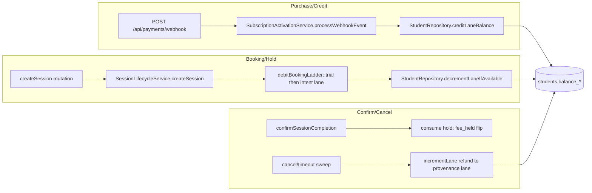

# Technical Architecture & Implementation Design: Segregated Session Balance Crediting

**Plan directory:** `ai/plans/sprint_1/Segregated Session Balance-crediting/`
**Specs:** `ai/plans/sprint_1/Segregated Session Balance-crediting/specs.md`
**Tasks:** `ai/plans/sprint_1/Segregated Session Balance-crediting/tasks.md`
**Deferred items:** `ai/plans/sprint_1/Segregated Session Balance-crediting/deferred-items.md`
**Outcome directory:** `ai/plans/sprint_1/Segregated Session Balance-crediting/outcome/`

## Document Information

- **Feature Name**: Segregated Session Balance Crediting (DEV1-007, Sprint 1, 5 SP)
- **Ticket**: `docs/planning/TICKETS.md:496-536` — Decision refs FR-2.5, INV-B1, INV-B2, INV-B4, INV-B5
- **Plan nature**: verification + gap-closure + ratification plan (the substrate shipped with DEV1-006 / DEV3-004 / DEV3-012)
- **Version**: 1.0 · **Date**: 2026-09-11 · **Author**: Spec Plan Generator (research-swarm assisted)
- **Reviewers**: Dev 1 stream owner; Dev 3 stream (session-lifecycle contract consumer)

---

## 1. System Overview

### 1.1 What this design covers

Every money-unit-of-attendance in Kottaby lives in exactly one of four **segregated balance lanes** on the `students` row: `balance_hifz`, `balance_tajweed`, `balance_reviews`, `balance_trial`. Two vocabularies govern their motion, and this plan keeps them strictly separated:

- **Credit vocabulary** — `SubscriptionCreditLane { Hifz, Tajweed, Reviews }` (`backend/enum/billing/subscription-credit-lane.enum.ts:9-13`), stored on `plans.balance_lane`; the activation path adds `plan.sessionCount` to the designated lane.
- **Hold vocabulary** — `HeldBalanceLane { Trial, Hifz, Tajweed }` (`backend/enum/scheduling/held-balance-lane.enum.ts:17-31`), recorded on `sessions.held_balance_lane`; the booking path removes one unit, trial lane first (INV-B8).

The ticket's four ACs resolve to: credit on activation (shipped), consume on attended session (shipped as hold-at-request + consume-at-confirmation), deny when empty (shipped), non-negative storage (shipped). This design binds each AC to that evidence and defines the four gap closures.

### 1.2 Interaction diagram



### 1.3 Key Design Decisions

**D1 — Ratify hold-as-debit timing (REQ-024).**
*Context:* Ticket AC says "decrement on attending (dual confirmation)"; shipped code debits at request time.
*Options:* (a) refactor to debit-at-confirmation (reintroduces the double-booking race the escrow killed); (b) ratify shipped timing and re-word acceptance.
*Decision:* **(b)**. Net effect per attended session is exactly −1 on the funding lane; holds make the zero-balance denial atomic. Anchored by `docs/sessions/session-lifecycle.md` §4–§5 and the single-writer discipline that binds this state machine to `SessionLifecycleService` (`backend/services/AGENTS.md`).

**D2 — Reviews lane is credit-only this sprint (REQ-025).**
*Context:* INV-B5 lists reviews among dec(rement)able lanes; no review-session booking flow exists.
*Decision:* keep `reviews` in the credit vocabulary, keep it OUT of `HeldBalanceLane`, record the future decrement obligation (guarded debit on the reviews lane) as a forward item for the review-session ticket.

**D3 — "422" means the VALIDATION family, custom code preserved (REQ-020/021).**
*Context:* `INSUFFICIENT_BALANCE` is a custom code; over GraphQL the envelope is HTTP 200 with `errors[].extensions.code`, and the canonical mapping `VALIDATION → 422` applies (`backend/lib/errors/error-code-taxonomy.ts:41-51`).
*Decision:* acceptance is "422 VALIDATION-class + `extensions.code = INSUFFICIENT_BALANCE` + localized message"; a GraphQL pin test makes the transport contract executable.

**D4 — Trial-first eligibility is the eligibility rule (REQ-026).**
The ticket's plain `balance_hifz = 0 ⇒ reject` applies only when the trial lane is also empty (INV-B4 as extended, INV-B8 order). No code change — ratification only.

### 1.4 Outcome & Knowledge Transfer Protocol

- BEFORE any task: read ALL files in `ai/plans/sprint_1/Segregated Session Balance-crediting/outcome/`.
- AFTER any task: write `outcome/<task-id>-outcome.md` with evidence and carry-over points.
- PROGRESS: flip task checkboxes `[ ]` → `[x]` in `tasks.md`.

### 1.5 UX/Navigation Specification (explicit no-UI ruling)

- **New routes/pages**: none. Ticket carries zero UI acceptance criteria; the shipped surface is backend + admin read views.
- **Sidebar/nav changes**: none. The pre-existing `/subscriptions` nav entry (`frontend/views/dashboard/nav/navItems.ts:117-124`) still resolves to the catch-all ComingSoon page and is untouched.
- **Role visibility of balances**: students have no balance read surface today; admins see all four lanes (`admin-students.pothos.ts:49-52`); teachers see none (money lives on the teacher wallet, a different domain).
- **Mobile bottom nav**: no changes.
- If a future UX ticket adds student-visible balances, it consumes the same single-writer lanes read-only — nothing here blocks that.

---

## 2. Data Models & Schema

### 2.1 Existing-schema verification (structural ground truth: `backend/db/schema/`)

| Table.Column | Type / Constraint | State | Evidence |
|---|---|---|---|
| `students.balance_hifz` | integer, default 0, nullable; CHECK `>= 0` | EXIST — no change | `backend/db/schema/students/students.ts:24,42` |
| `students.balance_reviews` | integer, default 0, nullable; CHECK `>= 0` | EXIST — no change | `students.ts:25,43` |
| `students.balance_tajweed` | integer, default 0, nullable; CHECK `>= 0` | EXIST — no change | `students.ts:26,44` |
| `students.balance_trial` | integer, notNull, default 0; CHECK `>= 0` | EXIST — no change | `students.ts:27,45` |
| `students.trial_granted_at` | timestamp, nullable | EXIST — no change | `students.ts:28` |
| `plans.session_count` | int notNull, CHECK `> 0` | EXIST — no change | `backend/db/schema/billing/plans.ts:25,39` |
| `plans.balance_lane` | pgEnum `subscription_credit_lane`, nullable | EXIST — no change | `plans.ts:29`; `backend/db/schema/enums.ts:65` |
| `subscriptions.status` | pgEnum `subscription_status`, default `pending` | EXIST — no change | `backend/db/schema/billing/subscriptions.ts:38`; enum `backend/enum/billing/subscription-status.enum.ts:6-12` |
| `sessions.held_balance_lane` | varchar(20) `HeldBalanceLane \| null` | EXIST — no change | `backend/db/schema/classes/session.ts:63-65` |

### 2.2 Schema deltas

**None in Drizzle schema.** No new tables, columns, indexes, or enum members. `bun run db push` is NOT required by this plan.
Docs-only delta: sync `db/schema.dbml` (students trial columns + 4 CHECKs, `plans.balance_lane`, `subscriptions_payment_reference_unique`) — REQ-028.

### 2.3 Canonical types (`backend/types/`)

| Type | File | Note |
|---|---|---|
| `StudentSelectType` | `backend/types/students/student.types.ts:4` | read model incl. all four lanes |
| `SubscriptionSelectType` / `SubscriptionInsertType` / `SubscriptionReturnType` | `backend/types/billing/subscription.types.ts:7-8,22` | used by services |
| `PlanSelectType` / `PlanReturnType` / `PlanSubmitInput` | `backend/types/billing/plan.types.ts:4-30` | `balanceLane?: SubscriptionCreditLane \| null` at `:19` |
| `SessionSelectType` / `SessionReturnType` | `backend/types/classes/session.types.ts:5-75` | includes `heldBalanceLane` |

No new canonical types; no local type definitions may be added anywhere (single-canonical-type rule).

---

## 3. API Contracts & GraphQL

### 3.1 SDL (existing surface this ticket touches — NO new fields)

```graphql
enum SubscriptionCreditLane { Hifz Tajweed Reviews }   # backend/graphql/pothos/shared/enum.pothos.ts:228-240

# Plan { id: ID! sessionCount: Int! balanceLane: SubscriptionCreditLane /* ... */ } — plan.pothos.ts:52-97
# StudentSubscription { id: ID! status: SubscriptionStatus! /* ... no balance fields */ } — subscription.pothos.ts:40-89

# Mutation.purchaseSubscription(input: ...): ...  # student-only
# Mutation.createSession(input: CreateSessionInput!): Session!     # student-only; may error INSUFFICIENT_BALANCE
# Mutation.confirmSessionCompletion(id: ID!): Session!             # participant-gated service-side
# Query.mySubscriptions: [StudentSubscription!]!                    # student-only
```

### 3.2 Permission matrix (authScopes — `$all` conjunction per repo pattern)

| Operation (file) | Scope | Effect |
|---|---|---|
| `purchaseSubscription` (`backend/graphql/mutation/subscription-purchase.mutation.ts:51-86`) | `$all { authenticated, role: [student] }` + idempotency header | creates pending subscription + payment; NULL-lane plan ⇒ `PLAN_LANE_UNCONFIGURED` |
| `mySubscriptions` (`backend/graphql/query/subscription.query.ts:42-65`) | `$all { authenticated, role: [student] }` | purchaser reads own subscriptions |
| `createSession` (`backend/graphql/mutation/classes/session-lifecycle.mutation.ts:87-141`) | `$all { authenticated, role: [student] }` | hold-as-debit; zero-balance ⇒ `INSUFFICIENT_BALANCE` |
| `confirmSessionCompletion` (`session-lifecycle.mutation.ts:293-320`) | `authenticated` only, participation predicate service-side | participants only; consumes hold |
| `planCatalog` (`backend/graphql/query/plan-catalog.query.ts:18-40`) | `authenticated` | plan browsing; lane visible |
| `adminPlans` (same file) | admin-scoped | plan CRUD incl. `balanceLane` |
| Balance reads (`backend/graphql/pothos/admin/admin-students.pothos.ts:49-52`) | admin-scoped | ONLY read surface exposing the four lanes |

### 3.3 REST contract (existing webhook)

`POST /api/payments/webhook` (`app/api/payments/webhook/route.ts`) — provider-signed; delegates settlement to `SubscriptionActivationService.processWebhookEvent`; kill switch + bounded body + HMAC verification remain the DEV1-006/paymob surfaces. This plan changes nothing here.

---

## 4. Services, Repositories & Concurrency

### 4.1 Exact signatures (verified — reused, never forked)

| Primitive | Signature | File |
|---|---|---|
| Activation entry | `processWebhookEvent(...)` → settle → credit | `backend/services/billing/subscription-activation.service.ts:486` (entry), credit call `:393-400` |
| Lane mapper (fail-closed) | `subscriptionCreditLaneOf(lane, correlation): SubscriptionCreditLane` | `subscription-activation.service.ts:224-242` |
| Credit write | `creditLaneBalance(studentId: number, lane: SubscriptionCreditLane, amount: number, tx?: DBTransaction): Promise<StudentSelectType \| null>` | `backend/db/repo/students/student.repository.credit-lane.helpers.ts:108-120` (wrapper `student.repository.ts:531-538`) |
| Guarded hold debit | `decrementLaneIfAvailable(studentId: number, lane: HeldBalanceLane, tx?: DBTransaction): Promise<boolean>` | `student.repository.ts:478-493` |
| Refund | `incrementLane(studentId, lane: HeldBalanceLane, tx?): Promise<void>` | `student.repository.ts:507-516` |
| Booking ladder | `debitBookingLadder(studentId, intent, tx, t): Promise<HeldBalanceLane>` | `backend/services/classes/session-lifecycle.booking.ts:95-116` |
| Public booking entry | `createSession(studentId, input: SessionSubmitInput, idempotencyKey, locale, outerTx?): Promise<SessionReturnType>` | `session-lifecycle.service.ts:196-215` |
| Hold consumption | `confirmCompletionInTx` → `fee_held` flip (no student debit) | `session-lifecycle.confirmation.ts:112-138` |
| Refund to provenance | `refundHeldLaneToProvenance` | `session-lifecycle.transitions.ts:222-237` |

### 4.2 Concurrency & race assessment

| Scenario | Mechanism (existing) | Proof |
|---|---|---|
| Duplicate webhook credit | Single-statement `activatePendingOnce` (zero rows ⇒ replay) | service tests `:380-404,861-885` |
| Two webhooks race one subscription | Same arbiter; chaos path documented (`subscription-activation.service.test.ts:44-53`) | replay proof + concurrency note |
| Two bookings for one last unit | Guarded `UPDATE … WHERE balance > 0` row-lock serialization | `session-lifecycle.service.test.ts:2314-2334` |
| Negative balance write | Guarded predicate + 4 CHECK constraints as DB backstop | `student.repository.test.ts:428-460` |
| NULL-lane credit | Fail-closed quarantine, zero mutation | `subscription-activation.service.test.ts:450-482` |
| Cancel racing confirm | Single-writer service owns session state machine; same-lane refund reads stored provenance | `session-lifecycle.transitions.ts:222-237` |

No read-then-write anywhere in the balance paths; no advisory locks needed (INV-B7 predicate-atomicity argument applies to every lane primitive).

### 4.3 Cross-actor journey design (assertion sets for `test/workflows/`)

**Subscription state machine (credit side):** `pending → active` (paid webhook, exact-once) / `pending → pending` (failed webhook) / `active` terminal for this scope.

| Transition | Rows written | Balance effect | Notification |
|---|---|---|---|
| pending → active | subscriptions.status flip, student_payments flip | `+sessionCount` once on plan lane | payment confirmation (existing engine) |
| replay of same event | none | none | none |
| failed event | payment `failed` only | none | purchase-failed copy |

**Session hold state machine (debit side):** `request(funded) → scheduled(held) → completed(consume)`; `scheduled → cancelled(refund)`; `scheduled → timed-out(refund)`.

| Transition | Balance effect | Visibility |
|---|---|---|
| request hit (trial first, then intent) | −1 on funding lane; `held_balance_lane` recorded | student: booking succeeds; others: nothing |
| request miss | zero writes; `INSUFFICIENT_BALANCE` | student: localized rejection |
| dual confirmation | none on student lanes (hold consumed; teacher wallet dealt by DEV3-012) | student/teacher: completed |
| cancel / timeout | +1 to provenance lane | student: unit restored |

These matrices ARE the journey assertion checklists (J1–J4 in specs §3); new legs (Tajweed) plug into J1.

---

## 5. Frontend UX

No frontend work (see §1.5 ruling). The only client-relevant contract is the error-code convention for a future booking UI: match `errors[].extensions.code === "INSUFFICIENT_BALANCE"` and surface the localized `insufficientBalance` copy — the existing precedent is the wallet flow (`frontend/views/teacher/wallet/useTeacherWalletWithdraw.ts:82-93`); the Apollo error-link mapper returns `null` for custom codes (`frontend/providers/apollo/error-link.map.ts:350`), so the future consumer matches codes itself. No code is written for this in this plan.

---

## 6. Security & Tenancy Audit Design

- **BOLA/IDOR**: actor identity comes from session context; `createSession` pins `studentId` server-side from the authenticated user (never from input); `purchaseSubscription` likewise. Denial journeys assert foreign-actor probes leave all state byte-identical.
- **BOPLA**: mutation inputs never spread into balance writes — amounts are plan-defined (`sessionCount`) or constant 1; the session insert sets server-computed columns field-by-field (`session-lifecycle.booking.ts:118-124`).
- **BFLA**: balance-mutating surface is effectively non-existent for clients (no mutation takes amounts); admin balance reads stay admin-scoped; student-only mutations use `$all { authenticated, role: [student] }`.
- **Webhook auth**: provider signature verification precedes any credit; quarantine path cannot be reached with attacker-chosen lane values (closed enum + fail-closed mapper).
- **Input sanitization**: no LIKE-based search anywhere on these paths; nothing to escape.
- **Panics**: every fail-closed path logs `logDomainError` with correlation before throwing.

---

## 7. Components & Interfaces per Task

| Task | Component | Files (exact) | Type |
|---|---|---|---|
| 1 | Substrate verification audit | reads only; produces `outcome/1.1-substrate-verification-outcome.md` | VERIFY |
| 2 | Tajweed service-level credit test | `backend/services/billing/subscription-activation.service.test.ts` (+1 test) | UPDATE |
| 3 | Tajweed purchase journey leg | `test/workflows/billing/subscription-purchase.journey.test.ts` (extend) | UPDATE |
| 4 | GraphQL `INSUFFICIENT_BALANCE` pin | new `backend/graphql/test/session-booking-balance.test.ts` | CREATE |
| 5 | DBML parity sync | `db/schema.dbml` (docs-only) | UPDATE |
| 6 | Readiness evidence + canonical doc | `docs/planning/PRODUCTION_READINESS.md` (§5.3 checkboxes), `docs/billing/segregated-session-balance.md` (new) | UPDATE + CREATE |
| 7 | Review wave + closeout | outcome reports | VERIFY |

Interface note: NO new runtime interfaces are introduced; every touched file is test- or documentation-tier except none-product-code.

## 8. Error Handling

| Code | Class (canonical) | HTTP family | Surface |
|---|---|---|---|
| `INSUFFICIENT_BALANCE` | ValidationError → VALIDATION | 422 semantic; GraphQL `extensions.code` on 200 envelope | `createSession` rejection copy (en `shared/locale/en/errors/index.ts:85`, ar `:84`) |
| `PLAN_LANE_UNCONFIGURED` | ValidationError → VALIDATION | same | purchase rejection |
| NOT_FOUND / FORBIDDEN / UNAUTHORIZED | taxonomy pins | per `ERROR_CODE_HTTP_STATUS` (`backend/lib/errors/error-code-taxonomy.ts:41-51`) | unchanged |

Logging: all domain rejections use `logger.logDomainError` (`@/backend/lib/logger` on backend) with `{ code, entity, entityId }` correlation; activation failures quarantine loudly. Numeric status literals never appear outside the taxonomy (grep-gated repo rule).

## 9. Testing Strategy (layered)

| Layer | Existing coverage (verify + cite) | New this plan |
|---|---|---|
| Repo (`backend/db/test/`) | `student.repository.test.ts:351-483` credit all three lanes; NULL-coalesce; CHECK-rejects | none |
| Repo adjacent | `backend/db/repo/students/__tests__/student-lane-debit.test.ts` debit ladder + concurrency | none |
| Service | activation happy/replay/quarantine; booking denial + chaos | **Tajweed credit test (REQ-017)** |
| GraphQL integration | `session-lifecycle-mutations.test.ts` incl. 422-family comment `:594` | **`INSUFFICIENT_BALANCE` pin (REQ-021)** |
| Journeys | purchase J1 (hifz, reviews), lifecycle J2, denials J3, refund J4 | **Tajweed leg in J1 (REQ-018)** |
| Checklists | — | PRODUCTION_READINESS §5.3 ticked with evidence (REQ-033) |

Discipline: `runInRollback` + `tx` + `expectRepoError` for db tier; committed fixtures + tracked cleanup for journeys; `testClient` for GraphQL; run via `bun run test/scripts/run-test.ts` (journeys & db) and `bun run test:graphql`.

## 10. Deployment / Migration / Rollback

- No Drizzle schema change ⇒ no `bun run db push`, no migration, no seed change.
- DBML file is documentation-only — no runtime impact; rollback = git revert.
- Test additions are additive; rollback = revert commits. No data migration risk whatsoever.

---

## Appendix — Governing rule files for this plan

- Root `AGENTS.md` (quality gates, sub-loop, i18n summary)
- `backend/AGENTS.md`, `backend/services/AGENTS.md`, `backend/db/schema/AGENTS.md`, `backend/db/repo/AGENTS.md`, `backend/graphql/AGENTS.md`, `backend/db/test/AGENTS.md` (+ `backend/db/test/logic/AGENTS.md`)
- `shared/AGENTS.md`, `shared/locale/AGENTS.md`
- `test/workflows/AGENTS.md`
- `.agents/instructions/backend.instructions.md`, `.agents/instructions/tests.instructions.md`
- Canon: `docs/billing/subscription-purchase.md`, `docs/sessions/session-lifecycle.md`, `docs/students/free-trial-provisioning.md`, `docs/specs/state-machine-invariants.md` §4.2, `docs/specs/functional-requirements.md` §2
