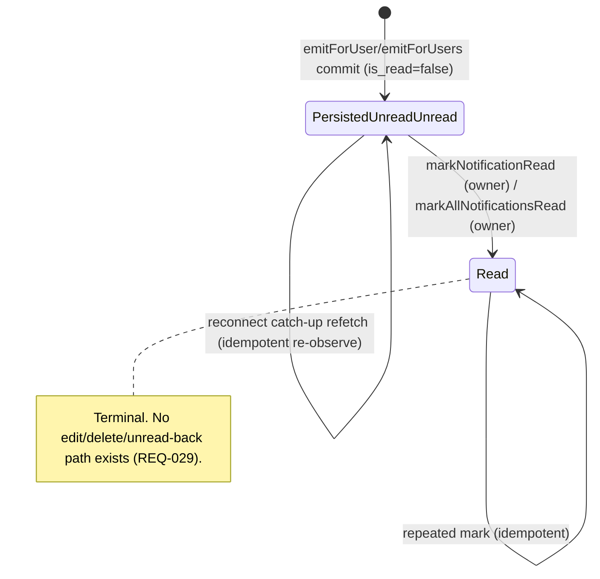

# Technical Architecture & Implementation Design: DEV3-010 — Real-Time Notification Engine (WebSocket)

> **Plan of record:** `ai/plans/dev3-010-realtime-notification-engine/`
> **Specs:** `specs.md` REQ-001..REQ-083, cross-actor journeys J1/J2 (§2.9)
> **Canonical refs:** `docs/specs/open-decisions-and-gaps.md` (A.4, A.1/A.2, B.10, B.12–B.14), `docs/specs/state-machine-invariants.md` (INV-P2/P3, INV-U family), `docs/workflows/02-on-demand-matching-workflow.md`, `docs/workflows/04-parent-supervision-handshake.md`, `docs/graphql/domain-error-extensions-code.md`, `docs/graphql/error-handling-contract.md`, `docs/graphql/api-gateway-and-routing.md`, `docs/auth/jwt-authentication-service.md` (authScopes contract, cookie matrix), `docs/auth/user-registration.md` (tx composition precedent), `docs/IDEMPOTENCY.md`, `docs/backend/cross-stream-contracts.md` (Contract 5), `docs/DATABASE_MIGRATIONS.md`, plus the guarded-update/extend-in-place precedents of `ai/plans/sprint_0/dev1-004-free-trial-session-provisioning/plan.md` and `ai/plans/sprint_1/dev3-005-session-status-state-machine-enforcement/plan.md`

---

## 1. System Overview & Architecture Diagram

### 1.1 Scope Statement

DEV3-010 ships the platform's **in-app notification engine**: a single write path (`NotificationEngine.emit*`) into the existing A.4 `notifications` table, a recipient-scoped GraphQL inbox (list / unread count / mark-one / mark-all), a **Bun-native WebSocket sidecar process** for sub-second fan-out, and a client realtime hook with refetch-based self-healing. No GraphQL mutation can create a notification; emit is server-internal and consumed by future domain tickets through the shipped contract.

**Transport topology reconciliation (binding):** Next.js 16 App Router route handlers cannot hold WebSocket connections and the deployment lineage is serverless-first. The realtime lane therefore lives in a **separate Bun process** (`bun run ws`, its own port) that is *not* an `app/api/**` route: it never enters `ROUTE_INVENTORY` (its process-internal health/ingress surface is governed by this plan, not by `docs/graphql/api-gateway-and-routing.md` Rule 3). The Next.js app process publishes fan-out events to the sidecar through a **transport port** with two adapters (Redis pub/sub default, in-process for tests/single-process harnesses).

### 1.2 Write Path — Emit (persist-first, publish-after-commit)

```
┌── FUTURE EMITTER (DEV3-011 / DEV1-017 / DEV3-022d …; TEST-ONLY for this ticket) ─┐
│  calls NotificationEngine.emitForUser(input, locale, tx?)                        │
│  or  NotificationEngine.emitForUsers(batch, locale, tx?)   (server-internal)     │
└──────────────────────────────────────┬───────────────────────────────────────────┘
                                       ▼
┌─────────────────────────────────────────────────────────────────────────────────┐
│ NotificationEngine (backend/services/notifications/notification-engine.service) │
│  1. validate emit input (enum guard, title ≤255 non-empty, entityRef pairing,    │
│     ID-channel guard) — BEFORE any DB access            (REQ-015, REQ-054)       │
│  2. idempotency claim (optional emitter key): cache SET-NX-EX                    │
│     `notif:emit:<sha256(userId:type:key)>` 24h TTL                               │
│     ├─ duplicate → return prior receipt, NO insert, NO publish  (REQ-016)        │
│     └─ cache outage → FAIL OPEN + structured warn log (documented deviation)     │
│  3. tx unit (own commit OR caller's outerTx, SAVEPOINT-aware):                   │
│     INSERT … RETURNING (single row / single multi-row INSERT for batch)          │
│     (REQ-013 — one created_at per batch; REQ-047)                                │
│  4. WITH outer tx → return receipts, DO NOT publish (REQ-012/REQ-042)            │
│  5. OWN commit   → NotificationFanoutTransport.publishFanout(userIds, payload)   │
│     ├─ success → done                                                            │
│     └─ failure → logger.logDomainError(delivery-degraded) — NEVER throws         │
│                  (REQ-011: persisted row is truth; push is best-effort)          │
└──────────────────────────────────────┬───────────────────────────────────────────┘
                                       ▼
┌── NotificationRepository (backend/db/repo/notifications/notification.repository) ┐
│ createReturning(payload, tx?) · createManyReturning(payloads, tx?)               │
│ listForUser(...) · countUnread(userId, tx?) · countForUser(filters, tx?)         │
│ markReadOnce(id, userId, tx?)  [guarded UPDATE … WHERE id AND user_id RETURNING] │
│ markAllReadForUser(userId, type?, tx?)            [single set-based UPDATE]      │
└──────────────────────────────────────┬───────────────────────────────────────────┘
                                       ▼
┌── PostgreSQL — `notifications` (A.4 — ZERO schema drift, REQ-048) ──────────────┐
│  id PK · user_id FK · type notification_type · title · body · is_read            │
│  related_entity_type · related_entity_id · created_at                            │
│  indexes: notifications_user_id_idx · notifications_user_id_is_read_idx          │
└──────────────────────────────────────────────────────────────────────────────────┘
```

### 1.3 Realtime Path — Sidecar, Backplane, Clients

```
Next.js app process                              WS sidecar process (bun run ws)
─────────────────────                            ─────────────────────────────────
NotificationEngine                               backend/ws/notification-ws-server.ts
  └─ transport: RedisPubSubTransport ──▶ Redis   ├─ subscribe channel
       channel "kottaby:notifications:fanout"    │  "kottaby:notifications" ─┐
       payload = FanoutEnvelope { userIds,       │  (validated by runtime    │
                                 notification }  │   guard pre-delivery)     ▼
(in-process adapter used by tests)        ConnectionRegistry (bounded, REQ-023)
                                                 ├─ Map<connId, {userId, ws}>
                                                 ├─ per-user cap → evict oldest (4009)
                                                 ├─ global cap → reject (1013)
                                                 └─ 30s ping / 2-miss → terminate
                                                          │
                                       WS push { v:1, kind:"notification",
                                                 data:{ id,type,title,body,
                                                        relatedEntityType,
                                                        relatedEntityId,
                                                        createdAt } }  (REQ-021)
                                                          ▼
Client (per tab, one socket): useNotificationRealtime
  handshake: WS connect w/ httpOnly access_token cookie + Origin allowlist
  ├─ cookie verify via verifyAccessToken (DEV2-001) ─ null → close 4401 (REQ-022)
  ├─ Origin mismatch → reject (CSWSH) · burst → 4429 (bucket throttle, REQ-033)
  ├─ on message → Apollo cache merge by id (dedupe) + localized toast
  └─ on reconnect → backoff (1s→2s→…30s + jitter) → CATCH-UP:
     refetch myNotifications (page 1) + myUnreadNotificationCount (REQ-025)
     graceful floor: existing 120s polling posture unchanged (REQ-064)
```

### 1.4 Key Design Decisions Table

| # | Decision | Options Considered | Pros / Cons | Rationale (Maintainability, Scalability, Reliability) |
|---|---|---|---|---|
| D1 | **Realtime lane lives in a Bun-native WS sidecar process** (`bun run ws`), not in Next.js route handlers | (a) WebSocket route in `app/api/ws/route.ts`; (b) Bun sidecar process; (c) third-party realtime SaaS (Pusher-class) | (a) Pros: single process. Cons: structurally impossible — App Router route handlers cannot host upgraded connections in Next.js 16; serverless instances have no stable process for sockets. (b) Pros: real `Bun.serve` upgrade support; horizontal separation from the request lifecycle; independently deployable/scalable. Cons: second process to operate (D3 deferred item covers provisioning). (c) Pros: zero ops. Cons: new vendor, cost, latency boundary, and a fan-out contract foreign to the codebase's self-hosted posture — premature at this milestone. | **(b).** The ticket prose says "WebSocket push," and the gateway's documented posture is HTTP request/response only (`docs/graphql/api-gateway-and-routing.md` Rule 9). The sidecar honors the ticket intent without perverting the gateway; the reconciliation is recorded in specs §2.9 style and §6 traceability. |
| D2 | **Persist-first, push-second; durable inbox is the only truth** | (a) fire-and-forget WS with ephemeral payload only; (b) DB-first always | (a) Pros: lowest latency. Cons: offline users lose events forever — violates AC #2 of the ticket outright; no auditability. (b) Pros: correctness under disconnection, self-healing catch-up, testable without sockets; WS becomes a latency optimization layer, never a correctness dependency. Cons: one DB write per event is mandatory even when the user is offline (acceptable — writes are cheap, single-statement). | **(b).** REQ-011. The engine treats the socket layer as always-suspect infrastructure; correctness lives in `notifications`. This makes the entire realtime layer degradable without data loss (REQ-064). |
| D3 | **Publish-after-commit; receipt-consumption pattern for tx-owning callers** — emit inside caller `tx` returns receipts; caller calls `publishReceipts(receipts)` *after* its transaction resolves | (a) engine always publishes immediately after insert; (b) outbox table polled by a sweeper; (c) two-phase API: persist-in-tx + separate publish | (a) **Broken** under caller transactions: a ghost push observes a row that later rolls back. (b) Pros: bulletproof at-least-once-ability. Cons: schema drift (a table) + new sweeper process for a best-effort channel — massive over-engineering relative to the self-heal catch-up the client already runs. (c) Pros: exact invariant with zero extra infra; matches DEV1-002/DEV3-004's `withTransaction(outerTx)` SAVEPOINT composition. Cons: consumers must remember to publish — enshrined in the canonical doc consumption guide. | **(c).** REQ-012/REQ-042. Ghost pushes are test-proven impossible (forced-rollback test observes zero rows AND zero publishes). The outbox is rejected as an incorrect use of a durable mechanism on a best-effort channel. |
| D4 | **Backplane behind a port** (`NotificationFanoutTransport`) with Redis pub/sub (default) + in-process (test/harness) adapters | (a) direct Redis coupling in the engine; (b) port + two adapters; (c) DB LISTEN/NOTIFY | (a) Cons: untestable offline, hard-couples unit suites to a Redis dependency, today violates `backend/services/AGENTS.md` mock-adapter discipline. (b) Pros: sidecar is transport-agnostic; tests use in-process and still prove publish-after-commit + payload validation end-to-end. (c) Pros: zero new infra. Cons: Postgres connections as a message bus do not survive serverless topology and conflate durable DB health with ephemeral delivery. | **(b).** REQ-024. Future swap to a managed stream (e.g. larger fan-out scale) touches one adapter, not the engine. |
| D5 | **Emit idempotency = best-effort, fail-OPEN on cache outage** | (a) fail-closed like booking mutations; (b) fail-open with structured warn | (a) Cons: a Redis blip would block *session completion*, *payment confirmation* etc. — turning a notification-dedupe nicety into a domain outage. (b) Pros: domain events are never hostage to cache health; worst case is a duplicate row the user dismisses — recoverable noise. Cons: permits rare duplicates. | **(b).** REQ-016. Deliberate, documented deviation from `docs/IDEMPOTENCY.md`'s fail-closed posture for booking-class mutations; notification emission is outside that doc's mandated key set (Student/Invoice/Class/Payment). The ruling is recorded in the canonical doc + decisions addendum (REQ-081). |
| D6 | **All inbox operations are self-scoped by construction**: identity = `ctx.user.id` exclusively; no identity input exists on any operation; `markNotificationRead` guards with `WHERE id AND user_id` | (a) accept `userId` input for admin convenience; (b) context-only identity | (a) Cons: instant BOLA surface on a sensitive per-user datastore (IDOR by parameter). (b) Pros: foreign targeting is *structurally impossible* — the cheapest, strongest defense; oracle-safe: foreign/nonexistent id → identical `NOTIFICATION_NOT_FOUND`. | **(b).** REQ-030. Parent/parent-of-child lateral reads are deliberately impossible at this layer — parents see child events only via rows emitted *to the parent* (INV-P2/P3 boundary, Journey J1 step 8). |
| D7 | **Offset pagination with composite ordering** (`createdAt DESC, id DESC`), `limit ≤ 50` cap, one round trip returning `{ items, totalCount, hasMore }` | (a) cursor pagination; (b) offset; (c) unbounded list | (a) Pros: stable under interleaving inserts. Cons: more complex args/cursors for a feed whose page 1 is 95% of reads; catch-up only needs page 1. (b) Pros: simplest correct contract for a self-scoped inbox; `totalCount`+`hasMore` enable the UI pager directly; deterministic tiebreak on `id`. Cons: unbounded offsets are clamped by the cap+count anyway. (c) Cons: read-cost bomb (REQ-036). | **(b).** REQ-017/026. The same predicate feeds list and count so `totalCount` cannot diverge (REQ-026 coherence rule). |
| D8 | **No DataLoader, no subscriptions, no SSE** | (a) GraphQL subscriptions; (b) DataLoader on `Notification`; (c) plain fields + sidecar push | (a) Cons: requires long-lived GraphQL transport — contradicts D1/serverless posture. (b) Cons: nothing to batch — flat single-table reads by PK/owner; adding loaders here would be cargo cult (documented so absence isn't mistaken for omission, REQ-017 note). | REQ-069. Payload is flat scalars/enum; list is bounded; there is no N+1 surface. |
| D9 | **Module-level mutable state allowed ONLY in the sidecar, and ONLY bounded**: connection registry with global + per-user caps, eviction `4009`, ping/pong liveness, graceful `1001` shutdown | (a) in-memory per the general rule ban; (b) unbounded registry; (c) bounded registry + external state nowhere else | (a)/(b) Cons: general codebase rule and unbounded growth → memory DoS. (c) Pros: a socket server *is* a stateful process — the rule's exception must be explicit, bounded, and test-proven; every cap has a documented policy code. | REQ-023/046. The sanctioned exception is carved out and test-locked (caps, eviction order, miss-2 termination), so "bounded" is an assertion, not a promise. |
| D10 | **Engine never translates; emitters own localized copy** — the engine stores `title`/`body` verbatim (bounded), never renders templates, never touched by locale resolution | (a) engine-localized copy by recipient locale; (b) emitter-localized | (a) Cons: requires per-recipient locale knowledge at emit time — a `users.locale` column does not exist (deferred schema gap D2, must NOT be patched inline); templates in the engine would entangle i18n with fan-out batch semantics. (b) Pros: the PORT-definition says emitters already know their domain context+locale; single-writer simplicity; `SessionEventNotificationContract` already treats title/body as opaque strings. | **(b).** REQ-015/028; the schema-gap ruling (recipient-locale persistence) is deferred to D2 with explicit ownership, never inline-patched (REQ-048). |
| D11 | **Frontend truth = Apollo cache + refetch-on-reconnect; WS frames only MERGE into cache (dedupe by id)** | (a) WS-only live feed; (b) cache-merge with catch-up refetch; (c) Zustand feed store | (a) Cons: dropped push = permanent divergence (unacceptable). (b) Pros: divergence is mathematically bounded by the next refetch; no new state container; `id`-normalized `Notification` objects make merge trivial. (c) Cons: second source of truth vs Apollo; `frontend/stores` rules would also reject socket handle persistence. | **(b).** REQ-025/063. "Toast is ephemeral; the badge and page are authoritative" — reconnects refetch, duplicates self-dismiss by id dedupe. |
| D12 | **`test/workflows/` journey layer is scaffolded by this ticket** with committed fixtures (no `runInRollback`), tracked teardown, spied transports | (a) force journeys into `runInRollback` logic suites; (b) scaffold the layer per rules | (a) Cons: services own their transactions in journey scenarios — rollback would forbid committed cross-service flows; the new layer exists precisely because of this mismatch. (b) Pros: reusable cross-actor harness for this and future tickets (DEV1-016/DEV2-016/DEV3-012 will all need it); spec-mandated (Section 2.9 of specs). | **(b).** REQ-077. The layer ships with `AGENTS.md`, `TrackedFixtures`, actor-context factory, and spied-transport conventions so every future journey suite inherits honest-permission discipline. |

---

## 2. Data Models & Database Schema

### 2.1 Existing Schema Verification (READ-ONLY — zero drift, REQ-048)

All structures exist from DEV1-001 (Decision A.4). `git diff` on `backend/db/schema/**` and `backend/db/migration/**` MUST be empty at completion.

| Contract dependency | Existing implementation | Verified at |
|---|---|---|
| `notifications` table | `id` (identity PK), `user_id` NOT NULL FK→`users` (cascade), `type notification_type` NOT NULL, `title varchar(255)` NOT NULL, `body text` NULL, `is_read boolean` DEFAULT false, `related_entity_type varchar(100)` NULL, `related_entity_id integer` NULL, `created_at` NOT NULL default now | `backend/db/schema/notifications/notifications.ts` |
| Read indexes | `notifications_user_id_idx` (user_id), `notifications_user_id_is_read_idx` (user_id, is_read) — covers inbox list + unread count | same file |
| `notification_type` enum parity | pgEnum `notificationType` in `backend/db/schema/enums.ts` and TS mirror `NotificationType` in `backend/enum/notifications/notification-type.enum.ts` — BOTH carry exactly: `session_request`, `session_completion`, `session_cancellation`, `parent_link_request`, `system_broadcast`, `payment_confirmation`, `evaluation_result` | both files; REQ-004 static byte-parity test |
| Canonical types | `NotificationSelectType`/`NotificationInsertType` (`$infer*`) | `backend/types/notifications/notification.types.ts` |
| Contract substrate (consumed, not redefined) | `SessionEventNotificationContract`, `SessionEventNotificationType`, `SessionEventNotificationEntityRef` | `backend/types/contracts/session-notification.contract.types.ts` |

**Prohibited by construction:** no new tables/columns/enums/indexes; no `bun run db push`; no custom SQL under `backend/db/migration/`; `db reset`/`cleanGenerate` remain permanently disabled (`docs/DATABASE_MIGRATIONS.md`). Discovered structural wants (e.g., `read_at`, per-recipient locale, delivery-channel columns) are logged to `deferred-items.md` only.

### 2.2 Canonical Types — `backend/types/notifications/notification.types.ts` (EXTEND, additive only)

```typescript
// existing (UNCHANGED)
export type NotificationSelectType = typeof notifications.$inferSelect;
export type NotificationInsertType = typeof notifications.$inferInsert;

// NEW (REQ-003) — GraphQL binding anchor. No forbidden fields exist on this table;
// the alias is deliberate so Pothos binds a service/API type, not a schema type.
export type NotificationReturnType = NotificationSelectType;

// NEW — emit contracts (server-internal; NEVER a GraphQL input)
export interface NotificationEmitInput {
  readonly userId: number;                                  // positive safe int
  readonly type: NotificationType;                          // enum member, value import
  readonly title: string;                                   // non-empty, ≤255 chars
  readonly body: string | null;
  readonly relatedEntityType: string | null;
  readonly relatedEntityId: number | null;                  // co-presence enforced
  readonly idempotencyKey?: string;                         // optional (≤128 chars)
}
export interface NotificationEmitBatchInput {
  readonly userIds: readonly number[];                      // non-empty, each safe int
  readonly type: NotificationType;
  readonly title: string;
  readonly body: string | null;
  readonly relatedEntityType: string | null;
  readonly relatedEntityId: number | null;
  readonly idempotencyKey?: string;
}

// NEW — publish-after-commit receipt (returned when caller owns the tx)
export interface NotificationDeliveryReceipt {
  readonly notifications: readonly NotificationReturnType[]; // inserted rows, RETURNING *
  readonly recipientUserIds: readonly number[];
}

// NEW — inbox reads
export interface NotificationListFilterInput {
  readonly type?: NotificationType | null;
  readonly isRead?: boolean | null;
  readonly limit: number;                                   // 1..50 (validated)
  readonly offset: number;                                  // ≥0 safe int
}
export interface NotificationListPageReturnType {
  readonly items: readonly NotificationReturnType[];
  readonly totalCount: number;
  readonly hasMore: boolean;
}

// NEW — realtime envelope (sidecar + client consume; NOT persisted)
export interface RealtimeNotificationPayload {
  readonly v: 1;
  readonly kind: "notification";
  readonly data: Pick<
    NotificationReturnType,
    "id" | "type" | "title" | "body" | "relatedEntityType" | "relatedEntityId" | "createdAt"
  >;
}
```

Rules compliance: no service-layer `.types.ts`; `DBTransaction` imported from `@/backend/types`; `NotificationType` used at runtime is a **value import** from `@/backend/enum/notifications/notification-type.enum`; the `SessionEventNotificationContract` vocabulary is mapped field-by-field INTO `NotificationEmitInput` by consumers (no re-declaration, no spread). Barrel `backend/types/notifications/index.ts` already re-exports `./notification.types` — zero barrel changes.

### 2.3 Enums

**No new enums.** `NotificationType` stays canonical in `backend/enum/notifications/notification-type.enum.ts`. A fail-closed guard is added alongside it (same file pattern as `isApplicantStatus` precedent):

```typescript
export function isNotificationType(value: unknown): value is NotificationType {
  return typeof value === "string" && (Object.values(NotificationType) as string[]).includes(value);
}
```

Pothos exposure registers the enum ONCE in `backend/graphql/pothos/shared/enum.pothos.ts` via the enum-object form (`gqlSchemaBuilder.enumType(NotificationType, { name: "NotificationType" })`) — literal-array registration or re-registration in domain files is PROHIBITED (`backend/graphql/AGENTS.md` CRITICAL RULE). After registration: `bun run generate:gqlSchema && bun codegen`, artifacts committed in the same change set (REQ-061).

### 2.4 i18n — two namespaces

**(a) `errors` namespace extension (REQ-051):**

| File | Change |
|---|---|
| `shared/locale/types/errors/index.ts` | Add `notifications: { notificationNotFound: string; }` grouping to the errors MessageSchema interface |
| `shared/locale/en/errors/index.ts` | `"The notification was not found."` |
| `shared/locale/ar/errors/index.ts` | `"لم يتم العثور على الإشعار."` |

Consumers resolve via `getServerTranslations(locale, "errors")` → `t.notifications.notificationNotFound` (property access, never `t('…')`); resolvers use `ctx.t("errors")`. Validation failures reuse existing generic `validation` keys — NO near-duplicate keys (per `shared/AGENTS.md` errors-namespace policy).

**(b) NEW `notifications` UI namespace (REQ-052)** — full registration per `shared/locale/AGENTS.md` five-step procedure (types interface → `en` + `ar` implementations → `MessageSchema` entry → namespace-path registration → `defineNamespace("notifications", …)` handle). Contents: feed title, empty state, load error state, filter labels (`all`, `unread` + per-type labels for all 7 `NotificationType` values), mark-as-read / mark-all-as-read labels + confirm copy, unread-badge aria label **pluralization function** (`unreadCount: (count: number) => string` per compile-time pluralization rules), realtime toast title, and quiet reconnect affordance copy. Client consumption: `useAppTranslation(Translation.Notifications)`; server page shell: `await getTranslations(locale)`.

---

## 3. API Contracts & Pothos Resolvers

### 3.1 GraphQL Schema Additions (exact SDL contract — REQ-060)

```graphql
enum NotificationType {
  session_request
  session_completion
  session_cancellation
  parent_link_request
  system_broadcast
  payment_confirmation
  evaluation_result
}

type Notification {
  id: ID!
  type: NotificationType!
  title: String!
  body: String
  isRead: Boolean!
  relatedEntityType: String
  relatedEntityId: Int
  createdAt: DateTime!
}

type NotificationListPage {
  items: [Notification!]!
  totalCount: Int!
  hasMore: Boolean!
}

input MyNotificationsFilterInput {
  type: NotificationType
  isRead: Boolean
  limit: Int
  offset: Int
}

extend type Query {
  myNotifications(filter: MyNotificationsFilterInput): NotificationListPage!
  myUnreadNotificationCount: Int!
}

extend type Mutation {
  markNotificationRead(id: ID!): Notification!
  markAllNotificationsRead(type: NotificationType): Int!
}
```

**Hard negative assertion (REQ-032):** there is ZERO create/update/delete surface for notification rows — post-codegen a static assertion greps the generated `schema.graphql` for `createNotification`/`deleteNotification`/`updateNotification`(s) and fails if present. The public-operation allowlist (`backend/lib/gateway/public-operations.ts`) remains byte-unchanged — all four operations carry scopes (default-deny preserved per gateway Rule 4).

### 3.2 Pothos Definition Details

**New files (placement per gateway Rule 8 / `backend/graphql/AGENTS.md` conventions):**

| File | Contents |
|---|---|
| `backend/graphql/pothos/notifications/notification.pothos.ts` | Single canonical `NotificationPothosObject` = `gqlSchemaBuilder.objectRef<NotificationReturnType>("Notification").implement({...})`; `id` exposed FIRST (Apollo normalization, CRITICAL rule); `createdAt` exposed via the repo's existing DateTime scalar convention. No second notification-shaped object. No local type defs. |
| `backend/graphql/pothos/notifications/notification-list-page.pothos.ts` | `NotificationListPage` wrapper object (allowed list/pagination wrapper per single-canonical-type exception policy) backed by `NotificationListPageReturnType`. |
| `backend/graphql/pothos/shared/enum.pothos.ts` | ADD `NotificationTypePothosEnum` (enum-object form, one registration). |
| `backend/graphql/query/notifications/notification.query.ts` | `myNotifications` + `myUnreadNotificationCount` field definitions. |
| `backend/graphql/mutation/notifications/notification.mutation.ts` | `markNotificationRead` + `markAllNotificationsRead`. |
| Domain barrels | Side-effect registration per the domain query/mutation barrel conventions + `pothos/index.ts` domain export (gateway Rule 8 registration recipe). |

**Resolver rules (REQ-060/061):**

- Bodies are thin: bound i18n (`ctx.t("errors")` when needed), delegate to `NotificationEngine` service methods with `ctx.user.id` + `ctx.locale` — NO business logic, NO repository imports, NO `await import()` (Bun ESM rule — top-level static imports only; gate A1 scanned).
- Input hardening at the service boundary (REQ-054): `limit` ∈ [1,50] (default 20 when `null`), `offset` ≥ 0 safe-int, `id` positive safe-int via type guard (no `as number`), `type` defensively run through `isNotificationType` even though the GraphQL enum layer already constrains it (defense-in-depth against non-schema transports).
- `authScopes` per REQ-032: EXACTLY `{ authenticated: true }` on all four operations — `scopeAuth` throws `UnauthorizedError` (401 semantics) on missing `ctx.user`; every authenticated role sees only its own inbox. NO `role`, NO `superAdmin`, NO `permission` scope — the engine's Brotherhood is orthogonal to role.

### 3.3 Error Code Mapping (REQ-050/053)

| Condition | Producer | `extensions.code` | HTTP-style semantic |
|---|---|---|---|
| Anonymous caller | `scopeAuth` (authenticated scope) | `UNAUTHORIZED` | 401 |
| `limit`/`offset`/`id`/`type`/emit-shape violations | `ValidationError` | `VALIDATION` | 422 |
| Foreign or nonexistent `id` on mark-one (identical response class) | `NotFoundError("NOTIFICATION", …)` | `NOTIFICATION_NOT_FOUND` | 404-class, oracle-safe |
| Unexpected driver/service failure | boundary masking (DEV3-002) | `INTERNAL_SERVER_ERROR` | 500, `extensions.requestId` attached |
| WS handshake failures | **Never GraphQL.** Socket close codes: `4401` unauthenticated · `4429` handshake throttle · `4009` per-user cap eviction · `1013` global capacity · `1001` server shutdown | n/a | policy codes documented in canonical doc |

`NotFoundError` receives the entity name `"NOTIFICATION"` (never the full code — double-suffix rule, `docs/graphql/domain-error-extensions-code.md`).

### 3.4 Permission Matrix (REQ-032/§3 operating rule)

| Operation | Anonymous | Student | Parent | Teacher (applicant) | Teacher (certified) | Super Admin |
|---|---|---|---|---|---|---|
| `myNotifications` | 401 `UNAUTHORIZED` | ✅ own inbox only | ✅ own inbox only | ✅ own inbox only | ✅ own inbox only | ✅ own inbox only |
| `myUnreadNotificationCount` | 401 | ✅ own count | ✅ own count | ✅ own count | ✅ own count | ✅ own count |
| `markNotificationRead` | 401 | own row → ✅; foreign row → `NOTIFICATION_NOT_FOUND` | same | same | same | same |
| `markAllNotificationsRead` | 401 | ✅ own rows only | same | same | same | same |
| ANY emit path (no GraphQL op) | 401 / unavailable | impossible — no surface | impossible | impossible | impossible | impossible (BFLA by construction) |
| WS handshake | close `4401` | ✅ handshake + self-scoped pushes | same | same | same | same |

Parents are **read-only + self-latch**: they view/mark their OWN rows — never the child's (INV-P2 honored; INV-P3 hydration flows through emitters that write to the parent's own inbox in later tickets).

---

## 4. Backend Services, Repositories & Concurrency Model

### 4.1 New Service — `backend/services/notifications/notification-engine.service.ts`

Namespace `NotificationEngine`. No types live here (`backend/services/AGENTS.md`); all shapes come from `@/backend/types`. Every method takes `tx?: DBTransaction` last and composes the DEV1-002 `withTransaction(outerTx)` SAVEPOINT-aware pattern.

```typescript
// EMIT (server-internal; never wired to a resolver — grep-enforced)
emitForUser(input: NotificationEmitInput, locale: string, tx?: DBTransaction)
  : Promise<NotificationReturnType | NotificationDeliveryReceipt>
emitForUsers(input: NotificationEmitBatchInput, locale: string, tx?: DBTransaction)
  : Promise<NotificationDeliveryReceipt>
publishReceipts(receipts: readonly NotificationDeliveryReceipt[], locale: string)
  : Promise<void>      // transport publish + swallow-with-duLog degradation (REQ-011)

// INBOX (GraphQL-consumed)
listMyNotifications(userId: number, filter: NotificationListFilterInput, locale: string)
  : Promise<NotificationListPageReturnType>
getMyUnreadCount(userId: number, locale: string): Promise<number>
markRead(callerUserId: number, notificationId: number, locale: string)
  : Promise<NotificationReturnType>
markAllRead(callerUserId: number, type: NotificationType | null, locale: string)
  : Promise<number>
```

**Method contracts:**

- **Emit validation (pre-DB, REQ-015/054):** title trimmed non-empty ≤255; `body` nullable; `relatedEntityType`/`relatedEntityId` co-presence (both or neither → else `ValidationError`); ids positive safe integers; `type` via `isNotificationType`; optional `idempotencyKey` non-empty ≤128 when supplied.
- **Emit idempotency (REQ-016/D5):** when a key is supplied, claim `notif:emit:<sha256(userId:type:key)>` via atomic cache SET-NX-EX (24h TTL, per `docs/IDEMPOTENCY.md` window). Duplicate claim → return the prior receipt (no insert, no publish). Cache unavailable → **fail open**: proceed with write, one structured warn log. The cache adapter is INJECTED at module seam and mocked in service tests (REQ-078); no module-level shared state (stateless pure claim helper).
- **`emitForUsers` batch atomicity (REQ-013):** all inserts in ONE multi-row `INSERT … RETURNING` inside one Drizzle commit; one `now` per batch captured once for ordering determinism (REQ-047 — rows also order deterministically by `id` desc); publish is ONE `publishFanout(userIds, payload)` call carrying the full recipient set.
- **Publish-after-commit (REQ-012/042):** `tx === undefined` → engine wraps insert+publish in own unit: commit happens first, then publish (single call). `tx` provided → engine inserts within the caller's unit and returns receipts WITHOUT publishing; `publishReceipts` is the callers' post-commit step (documented consumption rule). Publish failure at this point logs `logger.logDomainError` with `{ code: "NOTIFICATION_DELIVERY_DEGRADED", entity: "notifications" }` and resolves — never throws.
- **Reads (REQ-017/018/026):** `listForUser` and `countForUser` share ONE predicate builder (module-scope helper) — conjunctive filters (`type?`, `isRead?`) + mandatory `userId`; ordering `createdAt DESC, id DESC`; `hasMore = offset + items.length < totalCount`.
- **Mark-single (REQ-019):** guarded single `UPDATE notifications SET is_read = true WHERE id = ? AND user_id = ? RETURNING *`; zero rows → `NotFoundError("NOTIFICATION", t.notifications.notificationNotFound)`. Already-read rows match and return unchanged (idempotent).
- **Mark-all (REQ-020):** single set-based `UPDATE … WHERE user_id = ? AND is_read = false [AND type = ?]`; returns Drizzle affected-row count; empty reads return `0` (no error).
- **Logging discipline (REQ-037/053/055):** expected rejections → `logger.logDomainError` with `{ code, entity: "notifications", entityId? }`; delivery degradation → warn-tier logger call; NEVER `console.*`; log context carries ids/codes only (no titles/bodies/recipient payloads).

### 4.2 Repository — `backend/db/repo/notifications/notification.repository.ts` (EXISTING namespace, additive only)

Per `backend/db/repo/AGENTS.md`: pure data access, no business logic, no translations, every method's LAST parameter is `tx?: DBTransaction`; non-transactional reads use the `queryDb(tx)` Neon-HTTP-eligible pattern.

| Method | Signature essence | Notes |
|---|---|---|
| `createReturning` | `(insert: NotificationInsertType, tx?) → NotificationSelectType` | one `INSERT … RETURNING *` |
| `createManyReturning` | `(inserts: readonly NotificationInsertType[], tx?) → NotificationSelectType[]` | ONE multi-row insert (REQ-013) |
| `countUnread` | `(userId: number, tx?) → number` | `WHERE user_id AND is_read=false` — uses the composite index (REQ-018) |
| `countForUser` | `(userId, filters, tx?) → number` | SAME predicate family as list (REQ-026 coherence) |
| `listForUser` | `(userId, filters, limit, offset, tx?) → NotificationSelectType[]` | conjunctive optional filters, `ORDER BY created_at DESC, id DESC` |
| `markReadOnce` | `(id, userId, tx?) → NotificationSelectType \| null` | **guarded conditional UPDATE** — single statement; null on zero rows |
| `markAllReadForUser` | `(userId, type: NotificationType \| null, tx?) → number` | set-based; `AND is_read = false` keeps idempotent double-calls cheap |

No `inArray` anywhere → prepared-statement/`inArray` prohibition not triggered; writes are never prepared-statement candidates (`docs/drizzle/prepared-statements.md`); no `sql` template with `--` inline comments (parameter-binding rule). REQ-004(c) guard: existing methods are extended in place — never re-implemented/bypassed.

### 4.3 Realtime Substrate

**Transport port — `backend/services/notifications/realtime/fanout-transport.ts` (module, not a type file):**

```typescript
export interface NotificationFanoutTransport {
  publishFanout(userIds: readonly number[], payload: RealtimeNotificationPayload): Promise<void>;
}
```

- `RedisPubSubTransport` — channel `kottaby:notifications:fanout`, JSON envelope (recipient ids + payload); selected when Redis connection env config exists.
- `InProcessTransport` — direct in-memory tap; the ONLY transport legal in tests/harnesses and single-process dev.
- Selection via registered env key `NOTIFICATION_FANOUT_TRANSPORT` with typed default (REQ-049). Sidecar subscription side is symmetric (Redis subscribe / in-process tap registration), validating every received envelope with a runtime shape guard BEFORE touching any connection (malformed → drop + structured warn, never crash the socket loop, REQ-045).

**Sidecar — `backend/ws/notification-ws-server.ts` (+ engine entry `scripts/start-notification-ws.ts`; package script `bun run ws`):**

- `Bun.serve` upgrade handling; handshake pipeline order is FIXED: Origin allowlist check (`WS_ALLOWED_ORIGINS`, dev defaults localhost) → per-IP handshake token bucket (exceed → `4429`) → cookie header read (`access_token` only) → `verifyAccessToken` (null → `4401`) → userId = `sub` claim (positive int coerce) → register connection.
- **Connection registry (REQ-023/046, sanctioned bounded exception):** `Map<connId, ConnState>`; global cap → reject `1013`; per-user cap → evict OLDEST with policy code `4009`; 30 s ping cadence; two consecutive missed pongs → terminate; graceful shutdown closes with `1001` + final close frame. All caps are module constants, asserted in tests.
- **Push routing:** envelope `userIds` → socket set intersection; outbound frame = `RealtimeNotificationPayload` JSON (REQ-021 shape — `id` always present for client dedupe). Client frames other than close/pong are ignored; repeated malformed inbound → policy close (REQ-034).
- **Logging:** connection lifecycle logs carry `connId` + `userId` ONLY (no tokens, no IPs beyond aggregate counters, no payload content, REQ-037).

### 4.4 Concurrency & Race Condition Assessment

| Scenario | Actors | Risk | Mitigation |
|---|---|---|---|
| Duplicate emission for one domain event (emitter retry/double-invoke) | emitter × 2 | two rows, two pushes | Optional-key SET-NX-EX claim → second emission returns the prior receipt, NO insert/publish (REQ-016). Keyless emissions are documented as emitter's obligation. |
| Cache outage during emit claim | emitter vs Redis | blocked domain events or silent dupes | FAIL OPEN + structured warn (D5); row still persists (REQ-011). Correctness-of-record never depends on the cache. |
| Ghost push for rolled-back rows | engine + caller tx | user sees a throwaway event | Publish-after-commit (D3); forced-rollback test: zero rows AND zero publishes (REQ-042/072). |
| Concurrent mark-one on same row (two tabs) | same user ×2 | waste writes / error | Both guarded UPDATEs converge to `is_read=true`; second returns row idempotently (REQ-019/044). |
| Mark-one foreign id | attacker user B → target of user A | leakage of inbox existence/state | Single guarded statement keyed `(id, user_id)` → zero rows → `NOTIFICATION_NOT_FOUND` — indistinguishable from nonexistent (REQ-030/035). |
| Concurrent mark-all + emit interleave | user actions vs emitter | nondeterminism concerns | Read latch is one-directional (`is_read: false→true`); set-based update is atomic; newly inserted row during mark-all may remain unread — SAFE: newest event staying unread is the user-favorable direction (documented in canonical doc). |
| Emit batch partially failing inside its own tx | engine | partial fan-out rows/volatile observability | ONE INSERT; failure → whole tx rolls back → zero rows, no publish (REQ-013/043). |
| Publish failure post-commit | engine vs transport | user never gets realtime | Inbox row persists; catch-up refetch self-heals (REQ-011/025); degradation logged once per failure. |
| Socket storm / reconnect flicker | client instability | duplicated toasts, registry churn | Backoff with jitter (1s→30s cap), per-user cap evicts oldest (`4009`), frame dedupe by `id` in cache merge (REQ-025/067). |
| Handshake abuse (bad Origin, query tokens, header soup, brute-force connects) | hostile peers | CSWSH, credential leak via querystrings, CPU hammering | Envelope: Origin allowlist FIRST; query-string tokens REFUSED by construction (never read); cookie verify fail-closed `4401`; per-IP token bucket `4429` (REQ-033). |
| Sidecar Redis subscriber outage mid-run | transport | lost realtime events | Transport failure degrades to persisted-only (REQ-011); reconnect resumes subscription; payloads malformed post-reconnect are guarded/dropped (REQ-045). |
| Module-level unbounded growth (anywhere) | platform processes | memory DoS | Registry is capped + evicting (REQ-023/046); transport subscribers hold no growing buffers; shutdown drains with cap. Static + runtime bounds assertions. |

**TOCTOU summary:** all engine writes are single-statement; every concurrency-sensitive read is either a count/list (statistical, no follow-on write; no window) or a guarded conditional UPDATE (window = 0). **No `SELECT FOR UPDATE` anywhere in this ticket** — nothing read is mutated on a second statement. **Redis ops are atomic SET-NX-EX only**; no GET+SET pairs. **No advisory locks.** **No module-level mutable state outside the sanctioned bounded sidecar registry.**

### 4.5 Cross-Actor Journey Design (MANDATORY — specs §2.9)

Journeys run in the NEW `test/workflows/` layer (REQ-077): services called directly with real actor identity, real test DB, committed fixtures in `beforeAll`, tracked hard-delete cleanup in `afterAll`, NO `runInRollback`, transports/cache-injection mocked or spied (publish side effects are SPIED, never delivered over network), permissions honest through real user fixtures.

**Shared-entity state machine (per journey):** the observed entity is a `notifications` row per intended recipient; it has no lifecycle beyond the one-way read latch:



**Actors & authority table (specs §2.9, binding):**

| Actor | Can drive transition | Cannot |
|---|---|---|
| Engine emitter (service-only; test-invoked) | [*] → PersistedUnread (per target userId) | read-flag mutation; GraphQL exposure (BFLA) |
| Row owner (any authenticated role) | PersistedUnread → Read; observe own rows | read/mutate foreign rows |
| Non-owner (parent outsider, sibling student…) | — | any read/mutation (oracle-safe `NOTIFICATION_NOT_FOUND`) |
| Anonymous | — | every operation (`UNAUTHORIZED`); WS handshake (`4401`) |

**Journey J1 — Targeted Single-Recipient Delivery (teacher request notification):**

| # | Step (actor → action) | Shared-state assertion | Side effects | Visibility matrix (post-step) |
|---|---|---|---|---|
| 1 | System: commit fixtures — student + certified teacher | both inboxes empty | tracked fixture ids registered | teacher: empty; student: empty; parent-outsider: n/a |
| 2 | Teacher: `myNotifications`, `myUnreadNotificationCount` | page empty, count 0 | — | teacher sees zero state |
| 3 | Emitter (test): `emitForUser(teacher, session_request, entityRef session:id)` | EXACTLY one row for teacher, `is_read=false` | **spied** transport observed ONE publish whose `userIds` = [teacher]; payload payload-shape valid | teacher: 1 unread; student: 0; parent-outsider: no change |
| 4 | Teacher: reads list page 1 | row present, correct type/title/entityRef, ids intact | — | teacher can see; NO ONE else can (inv-P2 subscriber denial held) |
| 5 | Student (denial): own inbox unread count | still 0 — zero accidental fan-out | — | isolation proven |
| 6 | Teacher: `markNotificationRead(id)` | `is_read=true`; count 0 | — | owner state flipped |
| 7 | Teacher: repeat mark | idempotent success, identical row returned | — | state stable |
| 8 | Parent-outsider: `markNotificationRead(teacherRowId)` | `NOTIFICATION_NOT_FOUND`; teacher row byte-identical after | — | oracle-safe denial (REQ-J4) |
| 9 | Teacher: simulated drop → catch-up refetch | identical list, no duplication, no loss | — | self-heal invariant (REQ-025) |

**Journey J2 — Cohort Broadcast Fan-Out + Offline Persistence (`system_broadcast` to parents):**

| # | Step | Shared-state assertion | Side effects | Visibility matrix |
|---|---|---|---|---|
| 1 | System: commit fixtures — parents A/B + teacher | empty inboxes | ids tracked | — |
| 2 | Emitter: `emitForUsers([A,B], system_broadcast, …, key)` | EXACTLY 2 rows, one transaction, identical `createdAt` per batch | spied publish ONCE carrying BOTH ids | A: 1 unread; B: 1 unread (persisted); teacher: 0 |
| 3 | Parent A online (spied socket path) | payload shape valid; ONLY A's copy addressable | — | A realtime; B persisted-only |
| 4 | Parent B offline | NO push delivered; row persisted `is_read=false` | — | B: unread until read later (REQ-011) |
| 5 | B later: list → unread=1 → `markAllNotificationsRead(system_broadcast)` | returned count = 1; badge 0 | — | B's self-state flipped only |
| 6 | Teacher (denial): inbox stays empty; cannot read/mark any A/B row | `NOTIFICATION_NOT_FOUND` probes fail safely | — | REQ-J4 |
| 7 | Emitter replays SAME idempotency key | ZERO new rows; ZERO new pushes (J3 invariant) | none | A/B inboxes stable |
| 8 | Emitter replays with DIFFERENT key | fresh 2 rows emitted | one new publish | idempotency boundary pinned |
| 9 | Anonymous: all four GraphQL ops | `UNAUTHORIZED` on each, constant response shapes | — | REQ-032 |

**Cross-actor invariant assertions (REQ-J1..J5):** broadcast writes never cross tenants (teacher's inbox proved empty after a parent-targeted cohort emit and vice versa); oracle safety (denial class identical for foreign vs nonexistent ids); catch-up convergence (re-read after replays/reconnects equals the DB listing exactly); teardown honesty (`afterAll` hard-deletes tracked fixtures; existence checks assert zero residue).

---

## 5. Frontend UX & Navigation Specification

### 5.1 Routes & URLs Table

| Path | Purpose | Required permission | Allowed roles |
|---|---|---|---|
| `/notifications` (`app/(dashboard)/notifications/page.tsx`) | Inbox feed: list + filters + mark-read + mark-all | Server guard: authenticated posture via `withPageAuth(null)`-class wrapper (auth-only, NO role restriction — every role has an inbox) | student, parent, teacher (applicant + certified), super admin |
| `/api/graphql` | Hosts the 4 new operations | per §3.4 | — |

NO role-specific routes; NO admin-only notification page (admin's inbox arrives through the same surface). The WS sidecar has NO HTTP page route.

### 5.2 Sidebar & Navigation Integration

- **Group:** the existing per-role dashboard nav groups are reused; NO new sidebar group is created.
- **Entry points:** (a) app-bar notification bell icon with unread badge (existing app-bar conventions), linked to `/notifications`; (b) optional sidebar item "Notifications" under the existing general group per current nav config — positioned after dashboard/home entry in each role's nav model, icon `NotificationsOutlined` (`*Outlined` naming).
- **Mobile bottom nav:** bell/badge entry permitted on roles whose bottom nav already includes a notifications affordance; otherwise reachable via app-bar icon only (follows existing nav conventions; no new bottom-nav slot is introduced by this ticket).

### 5.3 Per-Audience Rendering (REQ-065)

| Audience | What they see |
|---|---|
| Student | Own inbox; session/payment-related entries as emitted to them (future tickets); filters; mark controls |
| Teacher (applicant) | Same surface; future `evaluation_result` events (DEV2-016/017 emitters) will land here |
| Teacher (certified) | Same surface; future `session_request`/`session_cancellation` entries |
| Parent | Same surface, READ-ONLY content + own mark-read controls (INV-P2); child events arrive as rows addressed to the parent (INV-P3 via emitters, not via child inbox access) |
| Super Admin | Same surface; future `system_broadcast` receipts (received, not composed — broadcast composition surface is DEV3-022d) |
| Anonymous | Never reach the page (server-side redirect to `/login` via page auth) and every GraphQL op 401s |

### 5.4 Apollo GraphQL Documents & UI Components

**Documents — `frontend/graphql/sharedDocuments/notifications/notification.documents.ts` (NEW; + sub-barrel `index.ts` line; top-level barrel already re-exports `notifications/`):**

| Document const | Operation | Type |
|---|---|---|
| `myNotificationsQueryDocument` | `query MyNotifications($filter: MyNotificationsFilterInput)` | `TypedDocumentNode<MyNotificationsQuery, MyNotificationsQueryVariables>` |
| `myUnreadNotificationCountQueryDocument` | `query MyUnreadNotificationCount` | `TypedDocumentNode<MyUnreadNotificationCountQuery>` (no-arg form) |
| `markNotificationReadMutationDocument` | `mutation MarkNotificationRead($id: ID!)` | `TypedDocumentNode<MarkNotificationReadMutation, MarkNotificationReadMutationVariables>` |
| `markAllNotificationsReadMutationDocument` | `mutation MarkAllNotificationsRead($type: NotificationType)` | `TypedDocumentNode<…>` |

Rules (REQ-062): `gql` + `TypedDocumentNode` from `@apollo/client` (never `/core`); codegen types from `@/frontend/graphql/generated/gql/graphql` ONLY (no inline literals, no mapping layers, no indexed-access workarounds); `id` in EVERY `Notification` selection (Apollo normalization); hooks from `@apollo/client/react`; `useQuery` stateful ONLY (`useLazyQuery` banned); codegen run + artifacts committed in the same change set.

**Component tree (client) + server shell:**

```
app/(dashboard)/notifications/page.tsx               (Server Component)
  → server auth guard (withPageAuth pattern — auth-only)
  → getTranslations(locale) → shell labels as props
  → <NotificationsFeedContainer labels={...} />      (client)

frontend/views/notifications/
  NotificationsFeedContainer.tsx
    ├─ useAppTranslation(Translation.Notifications)   (enum handle, property access)
    ├─ useQuery(myNotificationsQueryDocument, { variables: { filter } })
    ├─ useQuery(myUnreadNotificationCountQueryDocument, { pollInterval: conventional 120s posture })
    ├─ useNotificationRealtime({ onNotification: mergeIntoCache + toast })
    ├─ NotificationFilterChips (type enum chips + read/unread toggle)
    ├─ NotificationList / NotificationRow (mark-one button per row)
    ├─ MarkAllButton (confirm affordance, type-aware when a type chip is active)
    ├─ EmptyState / Skeleton rows / error surface
    └─ Pagination controls (limit/offset state in local React state)
  useNotificationRealtime.ts  (frontend/hooks or views-adjacent hook location per conventions)
    ├─ opens ONE WebSocket per mounted authenticated shell (REQ-067)
    ├─ backoff 1s→2s→4s…30s + jitter; ABORT retry on 4401/4009 policy closes
    ├─ message handler: JSON-guard → RealtimeNotificationPayload → dedupe by data.id
    │    → cache.write/update + localized toast via existing toast conventions
    └─ on unmount/close codes → deterministic close(1000); NO toasts on clean close
```

- **State management:** NO new Zustand store. `NO persist` involvement (socket handles are non-serializable — `frontend/stores/AGENTS.md` prohibition honored). Feed truth = Apollo cache; filter/pagination = local component state; socket = `useRef`-class lifetime management inside the hook.
- **MUI v9 discipline (REQ-063):** ALL spacing/color/typography via `sx`; colors from `theme.palette.*` via theme-callback ONLY (zero hex/rgb/color-name anywhere); status/read weighting via theme tokens (e.g., `theme.palette.action.selected` for unread); icons `*Outlined` exclusively; submission events typed `React.SubmitEvent` / `React.SyntheticEvent<HTMLFormElement>` where forms exist; error TextFields (n/a to this read-mostly surface) keep `aria-invalid` discipline where inputs appear (filters use chips, not text fields).
- **Accessibility:** per-row mark-read buttons carry translated `aria-label` with row title context; badge aria uses the namespace pluralization function; skeletons announce politely (`aria-busy` on the list region, `<Box component="output">` semantics per frontend AGENTS); permission/error fallback uses `PermissionDeniedFallback`-family rendering (never bare `null`);
- **XSS defense (REQ-028):** notification content renders as TEXT nodes through MUI `Typography`; `dangerouslySetInnerHTML` is PROHIBITED anywhere in `frontend/views/notifications/**` — static-assertion test scans the subtree.
- **Errors (REQ-068):** GraphQL failures branch on `extensions.code` ONLY via `mapGraphQLErrorByCode`/errorLink contract; masked `INTERNAL_SERVER_ERROR` renders generic toast with request-id correlation guidance; `UNAUTHORIZED` flows through the existing auth-recovery path; field-level projection utilities are N/A (no form submission), recorded so reviewers don't flag absence.

### 5.5 Visual Design & Responsive Specifications (REQ-066)

**Breakpoints:**

- **Desktop (1440px):** full-width feed within dashboard content area; filter chips row inline at top; per-row actions inline-secondary; timestamps + type chips in stable columns via `Grid`.
- **Tablet (768px):** filter chips wrap; row actions collapse into an overflow icon button (`MoreVertOutlined` → menu) to preserve touch targets.
- **Mobile (375px):** list-first single column; filters behind a `FilterListOutlined` toggle row; mark-all as a full-width secondary button; toast renders anchored bottom-center through existing snackbar-host conventions.

**Multi-Language & RTL Layout:**

- Full bidirectional mirroring with logical properties ONLY (`marginInlineStart/End`, `paddingInline*`, `text-align: start`); row icon → content → action ordering mirrors in `ar`; Arabic labels come from the SAME keys (MessageSchema compile-parity gate); Arabic copy sized generously (min chip heights honored to avoid vertical clipping with taller Arabic glyphs).
- dates use the shared locale-aware datetime formatting (server timestamps arrive as `createdAt`; client renders with existing locale formatters — never manual string surgery).

**Visual State Matrix:**

| State | Rendering |
|---|---|
| Empty inbox | Localized empty-state (icon + translated empty title/body) centered; no actions except filters disabled |
| Loading | Skeleton rows matching final row geometry; filters visible but disabled |
| Query error | Localized inline error notice + retry button (existing `RetryableNotice` seam posture); page remains interactive |
| FORBIDDEN/UNAUTHORIZED | handed to existing auth/errorLink flows (no bespoke handling) |
| Unread rows | Theme-token tinted row + unread dot chip; aria distinguishes read/unread |
| Mark-one success | Row restyles to read; badge count recomputes from Apollo cache (no refetch spam) |
| Mark-all success | Affected count surfaced via localized snackbar; filters stay as-is |
| Realtime arrival | Localized toast (type label + title); cache merges row deduped by `id`; badge +1 without refetch |
| Sidecar unreachable | SILENT degradation — existing polling refresh continues; NO alarm UI (REQ-064), only log-level client warn |
| Reconnecting | Quiet linear progression / subtle badge-scale affordance only if the design system already owns one; otherwise invisible |

**Agent-Browser Verification Protocol (URL + workflow targets):**

1. Anonymous: `GET /notifications` → redirect to `/login?redirect=/notifications` (visual capture at 375/768/1440 in both locales).
2. Login as student fixture → `/notifications` renders; empty state in EN and AR (screenshot pair).
3. Fixture seeding path (test-only emit via service harness): one row created → page shows row + badge count increments; row mark-read transitions visually (RTL mirror captured).
4. Filter chips: unread-only and a type filter render the filtered set (DOM assertion against translation-driven matchers — zero hardcoded strings; runtime screenshots in both locales).
5. Realtime hook functional check via mocked WS event in the browser harness (or dev-sidecar live with `bun run ws` in the dev env): toast appears once; dedupe on replay (same `id`).
6. Reconnect drill: close socket → observe no toast storm, no duplicate listeners after remount; catch-up refetch produces identical feed.
7. Screenshot discipline: image ReviewMediaFile usage is sequential/one-at-a-time (never batch-loaded).

---

## 6. Security, Authorization & Tenancy Mitigations

### 6.1 BOLA / IDOR

- Identity derives EXCLUSIVELY from `ctx.user.id` (DEV2-001 verified-context pipeline). `myNotifications`/`myUnreadNotificationCount` accept NO identity args; `markNotificationRead` takes only `id`; `markAllNotificationsRead` takes only `type` (REQ-030).
- `markNotificationRead` guards at the row layer with `WHERE id AND user_id` → foreign targeting returns `NOTIFICATION_NOT_FOUND`, byte-identical in shape to a nonexistent id — no existence oracle (REQ-035/039). Response shapes across denial branches stay constant.
- Parent→child and sibling-tenant cross-reads are structurally impossible at this surface; the ONLY parent pathway is an emitter writing to the parent's OWN userId (INV-P2/P3 honored; Journey J1 step 8 proves it).
- Emit-side fan-out recipient lists are explicit caller inputs to a server-internal function; no client can ever invoke it (BFLA §6.3).

### 6.2 BOPLA (Mass Assignment)

- GraphQL input surfaces whitelist exactly `{ type, isRead, limit, offset }`, `{ id }`, `{ type }`. Service mapping to Drizzle predicates is field-by-field; **zero `{ ...input }` spreads** anywhere in the diff (grep-verified static assertion, REQ-031).
- Emit contracts (`NotificationEmitInput`/`Batch`) are never expressible as GraphQL inputs — server-only type-level containment; client-supplied `userId`/`type` override attempts have no operation to land on.
- WS payloads are never deserialized into DB calls — sidecar reads bus envelopes only through a shape guard, and client→server WS application frames are ignored by protocol (REQ-034).

### 6.3 BFLA (Function-Level)

- All four GraphQL ops = `authScopes: { authenticated: true }` — anonymous → 401 `UNAUTHORIZED` before resolvers execute (REQ-032); NO role/permission/superAdmin scope (every role owns an inbox — no privilege tier exists in read paths).
- **Zero notification-CUD operations GraphQL-side** — static schema assertion greps for `create|delete|updateNotification*` and fails on presence (REQ-032/060).
- Emit primitives are imported by ZERO resolver files — static scan proves `emitForUser`/`emitForUsers` never appear in `backend/graphql/**` (only services/tests). The bulk primitive reserved for DEV3-022d cannot be exercised now by construction (REQ-027).
- WS handshake surface accepts no GraphQL operations at all; governance-blocked accounts (deleted/blocked/suspended) are denied upstream at context creation (DEV2-001/002 fail-closed); the socket does not re-verify governance continuously — documented trade-off (existing rows already emitted remain readable; NO new emit authorization advantage is granted) recorded in the canonical doc (REQ-038).

### 6.4 Injection & Sanitization

- All queries parameterized via Drizzle (dynamic conjunctive `and(...)` built from guarded enums/booleans/ints only). NO LIKE/ILIKE search input exists in this slice → `escapeLikeWildcards` explicitly N/A (documented so Phase-review doesn't flag its absence, REQ-036/§specs 2.4).
- ID channel: `sessionId`-class guards pattern — positive-safe-integer type guard on `id`/emit ids; never `as number` narrowing (REQ-054).
- Emit `title`/`body` stored VERBATIM after length/emptiness checks; XSS safety lives at render (text-node MUI; no `dangerouslySetInnerHTML` scan enforced). Malicious unicode/RTL/control characters in titles/bodies round-trip as inert text — component tests assert literal rendering.
- Redis envelope payloads pass a runtime shape guard; corruption drops + warns, never crashes a socket loop (REQ-045).
- GraphQL depth/complexity: flat one-level object + bounded list (cap 50) — no recursion, no batching-abuse surface (REQ-069).

### 6.5 Rate Limiting & Abuse

- GraphQL inbox ops inherit the platform's existing global/fail-open limiter posture (precedent per DEV1-002/DEV2-002 — REQ-036); pagination cap 50 bounds read cost. `myUnreadNotificationCount` is the existing badge-polling consumer's path; no change to `NOTIFICATION_COUNT_POLL_INTERVAL_MS` posture.
- WS handshake per-IP token bucket closes bursts with `4429` (REQ-033); reconnected clients bypass GraphQL rate limiters entirely (no loop-amplification on the HTTP layer).

### 6.6 Error Disclosure, Logging & Hygiene

- Client-visible messages are localized generic copy (errors namespace); `NOTIFICATION_NOT_FOUND` reveals nothing about other users' rows; masked 500s surface ONLY generic copy + `requestId` correlation (REQ-035; DEV3-002 boundary).
- Logs: expected rejects → `logger.logDomainError` `{ code, entity: "notifications", entityId? }`; degradation (publish failure, transport outage) → single warn-tier entry per occurrence (not per-row spam); unexpected → `logger.error`. **NEVER `console.*`** anywhere in the diff; log context carries ids/codes — no titles, no bodies, no tokens, no cookies (REQ-037).
- WS close codes are the entire socket error vocabulary and are documented (`4401/4429/4009/1013/1001`) — no information-bearing payload ever rides a close reason string beyond the policy code.

### 6.7 Environment & Configuration Registry Discipline (REQ-049)

New keys — `WS_PORT`, `WS_HOST`, `WS_ALLOWED_ORIGINS`, `NOTIFICATION_FANOUT_TRANSPORT`, Redis connection knobs reused/registered as needed, connection caps (`WS_MAX_CONNECTIONS`, `WS_MAX_CONNECTIONS_PER_USER`) — ALL registered in the env-config keys registry with typed dev/test defaults; every `reset*`-style cache-invalidation path covers every key read (semantic-review checklist item enforced per task; boot harness asserts registry inclusion).

### 6.8 Verification Anchors (tie-ins used by tasks)

- `git diff` on `backend/db/schema/**` + `backend/db/migration/**` EMPTY (REQ-048); enum byte-parity static test for pgEnum ↔ TS mirror (REQ-004).
- `bun run generate:gqlSchema && bun codegen` — generated artifacts committed in the same change set; static schema assertion for zero notification-CUD ops + `id` present on `Notification` (REQ-060/061/032).
- `bun run scripts/health/sub-loop.ts <file> --lifecycle duplicates` exit 0 per created/modified file; baseline delta = 0 (REQ-001/078).
- Test suites: repo/service (runInRollback, `tx` propagation, `entity-setup.ts`-created fixtures, `expectRepoError` try/catch with translated substrings, runner `bun run scripts/run-test/run-test.ts`); WS sidecar suite on ephemeral ports with native `WebSocket` clients (handshake matrix, caps, heartbeat, shutdown, routing isolation); GraphQL integration via `setupTestServerLifecycle` + `testClient` (role/caller matrix + `extensions.code` assertions via `expectMutationError`); component tier (Happy DOM + `translation-preload.ts` + `readTranslation(handle, locale)` + `TestWrapper locale`, zero hardcoded strings); chaos tier (REQ-076: mark storms via `Promise.allSettled`, flicker storms, fuzz on ids/titles/types); journey suites per §4.5 in the NEW `test/workflows/` layer (REQ-077).
- Coverage: 100% statement/branch on every NEW module (repo methods, engine service, guard helpers, WS server module, transports, realtime hook logic) with `bun test --coverage` evidence recorded in outcomes (REQ-070); journey + WS suites pass deterministically across two consecutive runs (REQ-078).
- Knowledge propagation outputs: canonical `docs/notifications/realtime-engine.md` (REQ-080); decisions addendum to `docs/specs/open-decisions-and-gaps.md` (WS sidecar topology, emit fail-open idempotency divergence, locale-at-emitter ruling + `users.locale` gap) (REQ-081); rule-only one-liners in `backend/services/AGENTS.md` (engine single-writer rule), `backend/db/repo/AGENTS.md` (guarded self-scope note), NEW `test/workflows/AGENTS.md` (journey layer rules: committed fixtures, tracked teardown, spied side effects, honest permissions, no runInRollback); root `AGENTS.md` Important References one-liner (REQ-082); deferred-items ledger pre-seeded D1–D4 non-blocking with owning tickets; final gate `grep -c "❌\|⚠️"` = 0 excluding pre-seeded D1–D4 (REQ-083).
