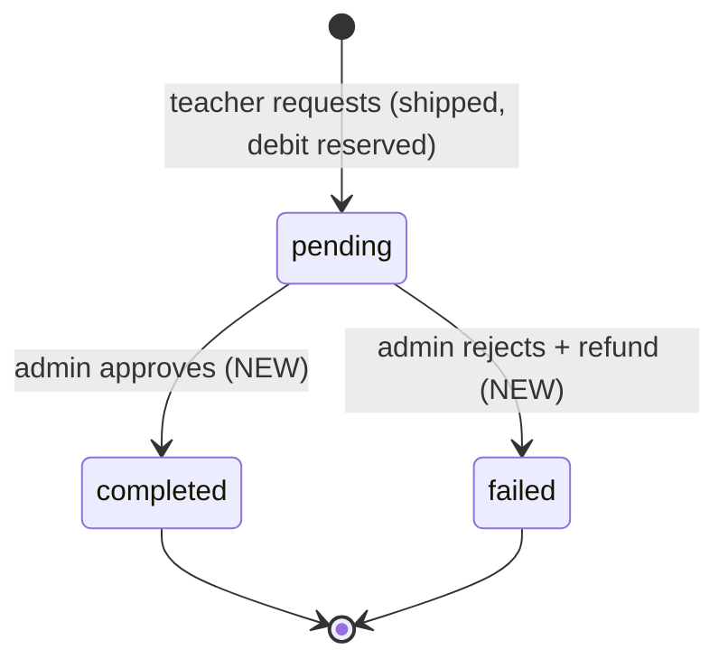
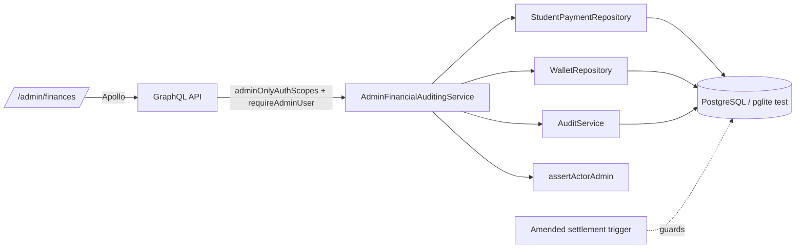

# Design — Admin Financial Auditing (Payments, Wallets, Withdrawal Approval)

<!-- Plan Directory: ai/plans/sprint_3/admin-financial-auditing-payments-wallet/ -->
<!-- Outcome Directory: ai/plans/sprint_3/admin-financial-auditing-payments-wallet/outcome/ -->
<!-- Related: specs.md · tasks.md · deferred-items.md -->

## Document Information

- **Feature Name**: Admin Financial Auditing (Payments, Wallets, Withdrawal Approval)
- **Target Directory**: `ai/plans/sprint_3/admin-financial-auditing-payments-wallet/`
- **Outcome Directory**: `ai/plans/sprint_3/admin-financial-auditing-payments-wallet/outcome/`
- **Version**: 1.0
- **Date**: 2026-09-11
- **Related Documents**: `specs.md` (same dir) · `docs/planning/TICKETS.md:2564-2615` · `docs/specs/functional-requirements.md:269-274` (FR-10.4/FR-10.5) · `docs/specs/state-machine-invariants.md:179-180` (INV-W5/W6)

## Overview

This design adds the admin control room over the two money ledgers (`student_payments`, `teacher_transaction`) that shipped in Sprints 1–3. Everything is additive EXCEPT one deliberate amendment: a narrow exception in the `teacher_transaction` immutability trigger so a pending withdrawal can settle (INV-W5). The read surfaces are pure projections (no new tables, no new columns); the write surfaces are three admin mutations that combine a guarded ledger/wallet write with an audit insert in one transaction. Layer flow stays canonical: Next.js page → Apollo hook → Pothos resolver (scope gate) → service (admin re-assertion + orchestration) → repository (single-statement guarded writes) → PostgreSQL.

### Design Goals
- Settle the withdrawal lifecycle (INV-W5) without weakening financial immutability (INV-W6).
- Make every admin financial decision reconstructible from `audit_logs` (A.5).
- Reuse — never reinvent — the shipped wallet primitives and audit/pagination patterns.
- Keep money as decimal strings end-to-end (never floats).

### Key Design Decisions
- **D-1** Withdrawal economics = *reserve at request, settle at decision* (reconciles shipped debit-on-request with ticket gherkin).
- **D-2** Settlement via a narrow trigger amendment (mirrors the `student_payments` precedent), NOT compensating-row pairs.
- **D-3** Adjustment directions ride the EXISTING `transaction_type` vocabulary (`bonus` = credit, `withdrawal`+marker = debit) — no pgEnum change.
- **D-4** Audit action mapping: settle → `override`; adjust → `adjust` (ticket-pinned).
- **D-5** Admin read surfaces are dedicated paginated queries — the teacher-facing capped ledger (50-row `WalletViewType`) is NOT reused.

### Decision: D-1 — Reserve-at-request, settle-at-decision
**Context:** Shipped `requestWithdrawal` (`backend/services/billing/wallet.service.ts:213-257`) already debits `wallet.balance` when the teacher files the request (insert `pending` row + guarded `balance >= amount` decrement, one tx). The ticket gherkin (TICKETS.md:2588-2593) reads "approve → status=completed AND wallet.balance is decremented", implying a debit-at-approval model.
**Options Considered:**
1. *Debit at approval* (literal gherkin) — Pros: matches letter of ticket. Cons: requires REMOVING shipped debit-on-request (regression: pending requests stop reserving funds → pending queue could overdraw the wallet; dual money-movement paths).
2. *Reserve at request; approve flips status only; reject flips + restores* — Pros: zero regression to shipped behavior; INV-W5 satisfied exactly (pending → completed/failed); balance invariant `balance = Σcompleted earnings + Σcompleted bonuses − Σcompleted withdrawals` (TICKETS.md:3014 generalized to bonuses) holds at every settled instant; reserved funds prevent double-spend while pending. Cons: gherkin's "decremented on approve" is honored at request time instead — documented interpretation.
**Decision:** Option 2.
**Rationale:** The shipped behavior is the financially safer one and INV-W5/non-negativity stay true under concurrency (see Concurrency section).

### Decision: D-2 — Trigger amendment for settlement (not compensating rows)
**Context:** `prevent_teacher_transaction_update()` raises on ANY update (`backend/db/migration/3-immutability-triggers.sql` + `backend/drizzle/20260904084152_custom_3-immutability-triggers/migration.sql`). INV-W5 requires a status flip on the SAME row.
**Options Considered:**
1. *Compensating rows only* (sibling dispute plan D-5 approach) — approve never flips the pending row. Cons: permanent `pending` residue breaks the shipped analytics counter (`platform-analytics.repository.ts:427-434` counts `type=withdrawal ∧ status=pending` as the backlog), pollutes the queue, and INV-W5 literally demands a transition.
2. *Trigger amendment* mirroring `4-student-payments-status-transition.sql`: permit ONLY `OLD.status='pending' AND OLD.type='withdrawal' AND NEW.status IN ('completed','failed')` with ALL other columns frozen (null-safe `IS NOT DISTINCT FROM`).
**Decision:** Option 2.
**Rationale:** Precedent exists and is battle-tested in this repo; the ledger remains append-preserved for every OTHER column; analytics and queue semantics stay honest.
**Mechanics:** `backend/db/migration/5-teacher-transaction-settlement.sql` applied via the custom-migration path (`bun db migrate`). **Dialect truth (verified in review R1):** pglite test DBs run the **PG-dialect** pipeline (`backend/db/scripts/migrate.ts:24-54`) and support PL/pgSQL triggers (`backend/db/pglite-pool.ts:19-23`) — the PG file covers both real PG and tests. The `-sqlite.sql` variant of the `3-*`/`4-*` precedents exists for the LEGACY libsql dialect (`backend/drizzle-sqlite/`, absent from the repo); a matching `5-teacher-transaction-settlement-sqlite.sql` is authored for parity only AND MUST be registered in `EXCLUDED_FILES` (`backend/db/scripts/applyCustomMigrations.ts:58-68`) or it gets bundled into the PG pipeline and aborts migration. New drizzle custom folder: `custom_5-teacher-transaction-settlement` — the duplicate `custom_4-student-payments-status-transition` dirs (`20260907182426_…` / `20260908103411_…`) were verified payload-identical during plan review R1 (formal confirmation lands in Task 2.1's outcome; ledger D1).

### Decision: D-3 — Adjustment direction via existing `transaction_type` vocabulary
**Context:** Ticket AC: manual adjustment creates `type='bonus'` row and adjusts balance "(credit or deduction)". `teacher_transaction.amount` has CHECK `amount >= 0` — no signed amounts. Direction must live somewhere non-numeric.
**Options Considered:**
1. New pgEnum member (e.g. `adjustment`) — Cons: `{ ts enum + pgEnum + Pothos enum + exhaustive-mapping guards (`toTransactionType` in `wallet.pothos.ts` is fail-closed) }` all churn; ticket pins `bonus`; analytics/teaching-earnings semantics blur.
2. Credit = `bonus/completed`; Debit = `withdrawal/completed` + description marker `"Manual adjustment (debit): <reason>"` — Pros: zero schema/enum change; precedents exist (re-evaluation deduction uses `type='withdrawal'`, TICKETS.md:2153-2159; dispute arbitration debit uses `withdrawal/completed`, sibling plan D-5); ledger math stays derivable: `balance = Σcompleted earnings + Σcompleted bonuses − Σcompleted withdrawals`.
**Decision:** Option 2.
**Rationale:** Follows the codebase's own financial-recording convention; the audit `details.direction` carries the machine-readable direction; the description marker + audit row disambiguate debits from payout-withdrawals in the ledger view (and payout-pending analytics count only `status='pending'`, which manual debits never are).
**Invariant note:** `totalEarning` NEVER moves on adjustments (bonus ≠ teaching earnings; debit ≠ un-earning).

### Decision: D-4 — Audit action vocabulary
- Approve withdrawal → `AuditActionType.Override`, details `{action:"withdrawal_approved", transactionId, walletId, teacherId, amount}`.
- Reject withdrawal → `AuditActionType.Override`, details `{action:"withdrawal_rejected", …, reasonPresent:true}` (raw reason text NOT persisted; reason is validated+normalized at intake).
- Adjustment → `AuditActionType.Adjust` (ticket-pins `action_type='adjust'`), details `{action:"wallet_adjustment", direction, transactionId, walletId, teacherId, amount, balanceAfter, reasonPresent:true}`.
- `entityType: "teacher_transaction"`, `entityId: <row id>`; single writer `AuditService.createAuditLog(contract, tx)` (`backend/services/admin/audit.service.ts:82-90`); details truncated ≤2000 by the writer; same-tx commit fate.

### Decision: D-5 — Dedicated admin read surfaces (no teacher-view reuse)
Admin pages need true pagination + joins (student/teacher display names) — the shipped teacher wallet view caps its ledger at 50 rows (`WALLET_LEDGER_PAGE_LIMIT`, `wallet.service.ts:51`). Admin surfaces get their own repository list/count pairs, the audit-trail pagination contract (`{items,totalCount,page,pageSize}`, `resolvePageBounds`), and their own Pothos wrapper types.

## UX/Navigation Specification (REQUIRED)

### New Routes & URLs
| Route | Purpose | Guard | Roles |
|-------|---------|-------|-------|
| `/admin/finances` | Financial auditing console (tabbed: Payments / Withdrawals / Wallets; tab via `?tab=`) | `withPageAuth({ roles: [UserRole.Admin] })` | `admin` only |
| `/admin/finances?tab=wallets&teacherId=<n>` deep link | Wallet inspector pre-scoped to a teacher | same | `admin` only |

### Sidebar Navigation Integration
- **Group**: existing `UserRole.Admin` bucket in `NAV_ITEMS_BY_ROLE` (`frontend/views/dashboard/nav/navItems.ts:140-164`) — insert `{ route: "/admin/finances", labelKey: "finances", Icon: <finance icon> }` after `/admin/plans` (billing adjacency).
- **Labels**: new `finances` key in the en/ar dashboard label leaves (next to existing `disputes`, `sessionGovernance`).
- **Mobile**: same drawer-based nav; NO bottom-nav additions (repo convention: no bottom-nav).

### Role-Based Access Matrix (verified role model: `backend/enum/users/user-role.enum.ts` — exactly 4 roles)

| Role | `/admin/finances` | `adminStudentPayments` | `adminTeacherWallet` | `adminPendingWithdrawals` | `approveWithdrawal` / `rejectWithdrawal` / `adjustTeacherWallet` |
|------|-------------------|------------------------|----------------------|---------------------------|------------------------------------------------------------------|
| Admin (`admin`) | ✅ | ✅ | ✅ | ✅ | ✅ |
| Teacher (`teacher`) | ❌ | ❌ 403 | ❌ 403 | ❌ 403 | ❌ 403 |
| Student (`student`) | ❌ | ❌ 403 | ❌ 403 | ❌ 403 | ❌ 403 |
| Parent (`parent`) | ❌ | ❌ 403 | ❌ 403 | ❌ 403 | ❌ 403 |
| Anonymous | ❌ redirect /login | ❌ 401 | ❌ 401 | ❌ 401 | ❌ 401 |

### Per-Audience Rendering
| Audience | Prominent Content |
|----------|-------------------|
| Admin | Payments table (student, amount, currency, gateway, status, subscription id, date) + filter bar; Withdrawal queue (teacher, amount, requested-at, current balance) + approve/reject dialogs; Wallet inspector (teacher picker, balance/totalEarning cards, filterable transaction table) |
| Teacher | Unchanged own-wallet page (`frontend/views/teacher/wallet/`); sees settled rows appear there |
| Student/Parent | Nothing new |

### Permission Mapping (verified gates)
| Surface | Gate (exact) | Source |
|---------|--------------|--------|
| `/admin/finances` page | `withPageAuth({ roles: [UserRole.Admin], redirectTo: "/admin/finances" })` | helper `frontend/lib/auth/withPageAuth.ts` (precedent `app/(dashboard)/admin/users/page.tsx:30-33`) |
| All GraphQL fields | `authScopes: adminOnlyAuthScopes` (`$all:{authenticated, role:[Admin]}`) + `requireAdminUser(ctx)` TS belt | `backend/graphql/shared/admin-prelude.ts:24-37` |
| All service entry points | `assertActorAdmin(actorId, locale, tx)` — re-loads actor row (fail-closed on deleted/blocked) | `backend/services/admin/admin-gate.helpers.ts:114` |

### Translation System Requirements (verified against the SHIPPED system)

- New namespace `adminFinance` — 5 touchpoints: `shared/locale/types/adminFinance/index.ts` (labels interface), `shared/locale/en/adminFinance/index.ts`, `shared/locale/ar/adminFinance/index.ts`, handle `shared/locale/namespaces/adminFinance/adminFinance.namespace.ts` (`defineNamespace("<id>", t => t.adminFinanceTranslations)`, pattern at `shared/locale/namespaces/adminSessionGovernance/adminSessionGovernance.namespace.ts:4-7`), registry entry in `shared/locale/namespaces/registry.ts`, and both `shared/locale/{en,ar}/messages.ts` trees. Parity test `shared/locale/adminFinance-namespace.parity.test.ts` mirrors the sibling parity tests.
- Client: `useAppTranslation(AdminFinance)` → property access. Server (page metadata): `await getTranslations(locale)` → `t.adminFinanceTranslations.*` (single-arg — `shared/locale/server.ts:15`). Resolvers/services: `ctx.t("errorsTranslations")` / `getServerTranslations(locale)`.
- New error keys (en + ar, `errors` namespace — mirrors `sessionNotFound` style, final names verified at implementation): `withdrawalRequestNotFound`, `withdrawalNotPending`, `invalidAdjustmentAmount`, `adjustmentReasonRequired`; REUSE existing `insufficientBalance` (`shared/locale/*/errors/`).

**Forbidden (verified):** `Translation.*` enum (absent); two-arg `getTranslations`; string-literal namespaces; `t('key')`; `next-intl`; `@/frontend/utils/logger`; invented `AppDataGrid`.

## Cross-Actor Journey Design (REQUIRED — withdrawal lifecycle spans teacher + admin)

### Shared-Entity State Machine: `teacher_transaction` (withdrawal rows)

| Current State | Trigger (actor) | Next State | Guard |
|---------------|-----------------|------------|-------|
| — | teacher `requestWithdrawal` (SHIPPED) | `pending` | pre-DB amount grammar; guarded `balance >= amount` debit in same tx |
| `pending` | admin `approveWithdrawal` | `completed` | guarded UPDATE `WHERE id=? AND type='withdrawal' AND status='pending'`; trigger amendment permits ONLY this flip (cols frozen) |
| `pending` | admin `rejectWithdrawal` | `failed` | same guarded UPDATE + balance restore `+amount` in same tx |
| `completed` / `failed` | any update/delete attempt | — (raises) | trigger keeps every other mutation path closed (INV-W6) |
| — | admin `adjustTeacherWallet` | inserts directly at `completed` | bonus credit: unguarded increment; manual debit: guarded `balance >= amount` |



### Side-Effect Matrix (per transition)

| Transition | Rows Created/Updated | Audit (same tx) | Notifications | Idempotency / Once-guard |
|------------|----------------------|-----------------|---------------|--------------------------|
| request (shipped) | `teacher_transaction(pending)` insert; `wallet.balance −= amount` | none (self-service) | none (shipped contract) | guarded debit predicate |
| approve | `status→completed` only | 1 × `override` row | none (ticket silent; deferred D-scope note) | guarded UPDATE on `status='pending'` |
| reject | `status→failed`; `wallet.balance += amount` | 1 × `override` row | none | same guard |
| adjust (credit) | `bonus/completed` insert; `balance += amount` | 1 × `adjust` row | none | no guard needed (pure increment); audit row = record |
| adjust (debit) | `withdrawal/completed` insert (marker desc); `balance −= amount` | 1 × `adjust` row | none | guarded `balance >= amount`; miss → `insufficientBalance` |

### Cross-Actor Visibility

| State | Admin sees | Teacher sees | Student/Parent see |
|-------|------------|--------------|--------------------|
| pending withdrawal | queue row + wallet inspector row | own ledger `pending` | nothing |
| approved | ledger `completed`; audit row; analytics backlog decrements | own ledger `completed` | nothing |
| rejected | ledger `failed`; audit row | own ledger `failed`; restored balance | nothing |
| adjustment | wallet inspector row; audit row | ledger row (bonus/debit marker) | nothing |
| payments audit | full `student_payments` list w/ filters | nothing (student's own views unchanged) | own history unchanged |

## Architecture

### System Context



### Components and Interfaces

#### Component 1: Repository primitives (NEW methods, both repos)

`backend/db/repo/billing/student-payment.repository.ts` (extends existing):
- `listForAdminAudit(filters: NormalizedAdminPaymentFilters, limit: number, offset: number, tx?): Promise<AdminStudentPaymentRow[]>` — joins `students`→`users` for display name + email; filters `{studentId?, studentNameSearch?, status?, paymentGateway?, from?, to?}`; newest-first; ILIKE only via `escapeLikeWildcards`.

**Repo-layer directive (backend AGENTS bare-read rule):** every new READ method above follows the shipped dual-branch idiom — Drizzle select on `tx` when supplied, raw parameterized SQL via `queryDb(tx)` when not (precedent `student-payment.repository.ts:113-134`); write primitives stay statement-atomic with `RETURNING` and `tx`-as-last-param.
- `countForAdminAudit(filters, tx?): Promise<number>` — same predicates, no join needed unless name search is set.

`backend/db/repo/billing/wallet.repository.ts` (extends existing):
- `findAdminWalletProbe(teacherId: number, tx?): Promise<AdminTeacherWalletProbe | null>` — wallet row + teacher display identity in one joined read (null when no wallet).
- `listTransactionsForAdmin(walletId, filters {type?, status?, from?, to?}, limit, offset, tx?): Promise<TeacherTransactionSelectType[]>` + `countTransactionsForAdmin(walletId, filters, tx?)` — newest-first.
- `listPendingWithdrawals(limit, offset, tx?): Promise<AdminWithdrawalQueueRow[]>` + `countPendingWithdrawals(tx?)` — joins wallet→teacher→user; EXACT predicate parity with the analytics counter (`type=withdrawal ∧ status=pending`).
- `findSettlementProbe(transactionId, tx?): Promise<WithdrawalSettlementProbe | null>` — `{ id, walletId, amount, type, status }`.
- `settleWithdrawalOnce({ transactionId, nextStatus: "completed"|"failed" }, tx?): Promise<TeacherTransactionSelectType | null>` — guarded single UPDATE: `SET status=?, updated_at=now() WHERE id=? AND type='withdrawal' AND status='pending'`; null on miss.
- `restoreWithdrawalDebitOnce({ walletId, amount }, tx?): Promise<void>` — single `UPDATE wallet SET balance = balance + ? WHERE id = ?` (addition cannot violate the ≥0 CHECK; no lower guard).
- `creditBonusOnce({ walletId, amount, description }, tx?): Promise<TeacherTransactionSelectType>` — INSERT `bonus/completed` + guarded balance increment in the same flow (mirrors `creditEarningOnce` :64 minus `totalEarning`).
- `debitAdjustmentOnce({ walletId, amount, description }, tx?): Promise<TeacherTransactionSelectType | null>` — INSERT `withdrawal/completed` (marker desc) + guarded `UPDATE … WHERE balance >= amount`; null on insufficient funds (mirrors `debitForWithdrawalOnce` :145 null-miss idiom).

#### Component 2: `AdminFinancialAuditingService` (NEW)

- **File**: `backend/services/billing/admin-financial-auditing.service.ts` (+ `.helpers.ts` for contract builders / normalizers).
- **Signatures** (service style: `locale: string`, `outerTx?: DBTransaction`, `withTransaction` from `@/backend/lib/db/with-transaction`):
  - `listStudentPaymentsForAdmin(actorUserId: number, filters: AdminStudentPaymentsFilterInput, page: number | null, pageSize: number | null, locale: string, outerTx?: DBTransaction): Promise<AdminStudentPaymentPageReturnType>`
  - `getTeacherWalletForAdmin(actorUserId: number, teacherId: number, txFilters: AdminWalletTransactionFilterInput, page, pageSize, locale, outerTx?): Promise<AdminTeacherWalletReturnType>` (wallet fields nullable inside → honest empty state; teacher identity resolves from the probe when a wallet exists, else via a teacher→user lookup fallback — the inspector header must render the teacher's name even when no wallet row exists)
  - `listPendingWithdrawalsForAdmin(actorUserId, page, pageSize, locale, outerTx?): Promise<AdminWithdrawalQueuePageReturnType>`
  - `approveWithdrawal(actorUserId: number, transactionId: number, locale: string, outerTx?): Promise<TeacherTransactionSelectType>`
  - `rejectWithdrawal(actorUserId: number, transactionId: number, reason: string, locale, outerTx?): Promise<TeacherTransactionSelectType>`
  - `adjustTeacherWallet(actorUserId: number, input: AdminWalletAdjustmentSubmitInput, locale, outerTx?): Promise<TeacherTransactionSelectType>`
- Every method: `assertActorAdmin(actorUserId, t, tx)` FIRST inside the tx; mutations then run their guarded repo primitives; audit contract built by helpers (`buildWithdrawalSettleAuditContract`, `buildWalletAdjustmentAuditContract`) and written via `AuditService.createAuditLog`.
- Pagination via `resolvePageBounds` (`user-management.helpers.ts:298`); count+page in ONE repeatable-read tx for list endpoints (audit-trail precedent).

#### Component 3: GraphQL surface (NEW files, side-effect registration)

- Pothos/inputs (in `backend/graphql/pothos/billing/` + `pothos/admin/` per placement convention — page wrappers/inputs follow the precedent of `AdminAuditLogPagePothosObject` at `backend/graphql/pothos/admin/audit-trail.pothos.ts:56` and `AdminAuditLogFiltersInput` at :79): `AdminStudentPaymentPage` (items: payment + `studentName`), `AdminTeacherWallet` (FLAT wallet summary — `balance`/`totalEarning`/`currency` nullable + teacher identity + tx page; do NOT embed the `Wallet` object — it is bound to the teacher-capped `WalletViewType`, the very surface D-5 forbids reusing), `AdminWithdrawalQueuePage`, inputs `AdminStudentPaymentsFilterInput`, `AdminWalletTransactionFilterInput`, `AdjustTeacherWalletInput`; REUSE `TeacherTransactionPothosObject` for mutation payloads (canonical object rule) — NOTE: that object is currently module-private (`backend/graphql/pothos/billing/wallet.pothos.ts:86`, plain `const`); a one-line `export` addition is part of this task (barrel stays untouched — wallet objects register resolver-transitively by convention).
- Enum: `WalletAdjustmentDirection` TS enum in `backend/enum/billing/wallet-adjustment-direction.enum.ts` (`Credit`/`Debit`) registered once in `backend/graphql/pothos/shared/enum.pothos.ts` — SDL members render as the TS member NAMES (`Credit`/`Debit`, same as `TransactionType { Bonus Earning Withdrawal }`).
- Queries: `backend/graphql/query/admin/admin-finance.query.ts` (3 fields) — `authScopes: adminOnlyAuthScopes`, `requireAdminUser`, closed filter copy (never spread wire args), locale propagation via `ctx.locale`.
- Mutations: `backend/graphql/mutation/admin/admin-finance.mutation.ts` (3 fields) — same gates.
- Barrels: add `import "./admin-finance.query";` / `import "./admin-finance.mutation";` to the admin sub-barrels (`backend/graphql/query/admin/index.ts`, `backend/graphql/mutation/admin/index.ts`).
- **Two schema-facing registries MUST move with this surface** (both are CI-pinned):
  1. `backend/graphql/test/schema-surface.test.ts` — frozen inventory gains 3 queries + 3 mutations + 1 enum + the new object/input types.
  2. `test/workflows/admin/audit-completeness.catalog.ts` — the deferred row `"(future) adminAdjustWallet / withdrawal approval"` (currently `kind:"deferred"`, ref `D-002`) is replaced by three `wired` rows (`approveWithdrawal`/`rejectWithdrawal` → `override` on `teacher_transaction`; `adjustTeacherWallet` → `adjust`), `ACTION_TYPE_COVERAGE.Adjust` flips `fixture`→`wired`, and the producer lanes in `test/workflows/admin/audit-completeness.journey.test.ts` gain execution lanes for the new rows (enforced by `backend/db/test/logic/audit/audit-census-drift.test.ts`).
- After edits: `bun run generate:gqlSchema && bun codegen` — generated SDL/TS committed.

#### Component 4: Frontend console (NEW)

- Route shell: `app/(dashboard)/admin/finances/page.tsx` — thin server component: `withPageAuth` + metadata from `getTranslations(locale).adminFinanceTranslations` + `<AdminFinancesContainer>`.
- Views: `frontend/views/admin/finances/` — `AdminFinancesContainer.tsx` (tab switcher via searchParams), `PaymentsAuditPanel.tsx` (+ `PaymentsFilterBar.tsx`, hand-rolled MUI table per `DirectoryTableScaffold`), `WithdrawalQueuePanel.tsx` (+ `ApproveWithdrawalDialog.tsx`, `RejectWithdrawalDialog.tsx` with reason field), `WalletInspectorPanel.tsx` (teacher picker using the shipped `adminTeachers` query, summary cards, `WalletTransactionsTable.tsx`), hooks `useAdminFinanceQueries.ts`.
- Documents: `frontend/graphql/sharedDocuments/admin/admin-finance.documents.ts` + `.documents.test.ts`; export via the admin barrel; `id` first on every selection (Apollo normalization). Hooks import from `@apollo/client/react` (no `useLazyQuery`).
- Apollo cache: the id-less wrapper types (`AdminStudentPaymentPage`, `AdminTeacherWallet`, `AdminWithdrawalQueueRow`, `AdminWithdrawalQueuePage`) get `keyFields: false` entries in `frontend/providers/apollo/apolloCache.ts` (precedent: `AdminAuditLogPage` there) — omission leaks normalization warnings.
- Nav: add `finances` item + label keys (en/ar dashboard leaves).

## Data Models

**No new tables. No new columns. No new pgEnum members.** One trigger-function amendment ONLY.

### Trigger amendment (D-2) — `backend/db/migration/5-teacher-transaction-settlement.sql`

```sql
CREATE OR REPLACE FUNCTION prevent_teacher_transaction_update()
RETURNS trigger AS $$
BEGIN
    IF OLD.status = 'pending'
       AND OLD.type = 'withdrawal'
       AND NEW.status IN ('completed', 'failed')
       AND NEW.wallet_id  IS NOT DISTINCT FROM OLD.wallet_id
       AND NEW.session_id IS NOT DISTINCT FROM OLD.session_id
       AND NEW.amount     IS NOT DISTINCT FROM OLD.amount
       AND NEW.type       IS NOT DISTINCT FROM OLD.type
       AND NEW.description IS NOT DISTINCT FROM OLD.description
       AND NEW.created_at IS NOT DISTINCT FROM OLD.created_at
    THEN
        RETURN NEW;
    END IF;
    RAISE EXCEPTION 'teacher_transaction is immutable — UPDATE is permitted only to settle a pending withdrawal (status -> completed|failed) with all other columns unchanged';
END;
$$ LANGUAGE plpgsql;
```
(Plus the `-sqlite.sql` parity variant per the `4-…-sqlite.sql` precedent; both idempotent `CREATE OR REPLACE`.)

### New canonical types — `backend/types/billing/admin-finance.types.ts`

```typescript
// Shapes are implementation-faithful; final names verified at Task 2.2.
export interface NormalizedAdminPaymentFilters {
  studentId: number | null; studentNameSearch: string | null;
  status: PaymentStatus | null; paymentGateway: PaymentGateway | null;
  from: Date | null; to: Date | null;
}
export interface AdminStudentPaymentRow extends StudentPaymentSelectType {
  studentName: string; studentEmail: string;
}
export interface AdminStudentPaymentPageReturnType {
  items: readonly AdminStudentPaymentRow[]; totalCount: number; page: number; pageSize: number;
}
export interface AdminWalletTransactionFilters {
  type: TransactionType | null; status: TransactionStatus | null; from: Date | null; to: Date | null;
}
export interface AdminTeacherWalletReturnType {
  balance: string | null; totalEarning: string | null;   // null pair = teacher has no wallet row yet
  teacherId: number; teacherName: string;
  transactions: readonly TeacherTransactionSelectType[]; totalCount: number; page: number; pageSize: number;
}
export interface AdminWithdrawalQueueRow {
  transaction: TeacherTransactionSelectType; teacherName: string; walletBalance: string;
}
export interface AdminWithdrawalQueuePageReturnType {
  items: readonly AdminWithdrawalQueueRow[]; totalCount: number; page: number; pageSize: number;
}
export interface WithdrawalSettlementProbe { id: number; walletId: number; amount: string; type: TransactionType; status: TransactionStatus; }
export interface AdminTeacherWalletProbe { wallet: WalletSelectType; teacherName: string; teacherEmail: string; }
export interface AdminWalletAdjustmentSubmitInput {
  teacherId: number; amount: string; direction: WalletAdjustmentDirection; reason: string;
}
```

### New TS enum — `backend/enum/billing/wallet-adjustment-direction.enum.ts`
`Credit = "credit"`, `Debit = "debit"` (service-layer vocabulary only; NOT a pgEnum, NOT persisted as a column). Exported through the enum barrels; registered as `WalletAdjustmentDirectionPothosEnum` in `pothos/shared/enum.pothos.ts`.

## API Design (GraphQL)

### SDL delta (authoritative after `bun run generate:gqlSchema` in Task 3.x)

```graphql
enum WalletAdjustmentDirection {
  Credit
  Debit
}

input AdminStudentPaymentsFilterInput {
  studentId: ID
  studentName: String        # ILIKE search, wildcards escaped server-side
  status: PaymentStatus
  paymentGateway: PaymentGateway
  from: DateTime
  to: DateTime
}

type AdminStudentPayment {
  id: ID!
  studentId: ID!
  studentName: String!
  subscriptionId: ID
  amount: String!
  currency: String!
  paymentGateway: PaymentGateway!
  status: PaymentStatus!
  createdAt: DateTime!
}

type AdminStudentPaymentPage { items: [AdminStudentPayment!]! totalCount: Int! page: Int! pageSize: Int! }

input AdminWalletTransactionFilterInput { type: TransactionType, status: TransactionStatus, from: DateTime, to: DateTime }

type AdminTeacherWallet {
  balance: String            # null pair (with totalEarning) = no wallet row yet → honest empty state
  totalEarning: String
  currency: String!          # constant EGP render label (wallet has no currency column)
  teacherId: ID!
  teacherName: String!
  transactions: [TeacherTransaction!]!
  totalCount: Int!
  page: Int!
  pageSize: Int!
}

type AdminWithdrawalQueueRow { transaction: TeacherTransaction! teacherName: String! walletBalance: String! }
type AdminWithdrawalQueuePage { items: [AdminWithdrawalQueueRow!]! totalCount: Int! page: Int! pageSize: Int! }

input AdjustTeacherWalletInput { teacherId: ID! amount: String! direction: WalletAdjustmentDirection! reason: String! }

extend type Query {
  adminStudentPayments(filters: AdminStudentPaymentsFilterInput, page: Int, pageSize: Int): AdminStudentPaymentPage!
  adminTeacherWallet(teacherId: ID!, filters: AdminWalletTransactionFilterInput, page: Int, pageSize: Int): AdminTeacherWallet!
  adminPendingWithdrawals(page: Int, pageSize: Int): AdminWithdrawalQueuePage!
}

extend type Mutation {
  approveWithdrawal(transactionId: ID!): TeacherTransaction!
  rejectWithdrawal(transactionId: ID!, reason: String!): TeacherTransaction!
  adjustTeacherWallet(input: AdjustTeacherWalletInput!): TeacherTransaction!
}
```

### Error & permission matrix

| Operation | Actor | Success | Denials |
|-----------|-------|---------|---------|
| `adminStudentPayments` / `adminTeacherWallet` / `adminPendingWithdrawals` | admin | page payload | anon → 401 UNAUTHORIZED; non-admin → 403 FORBIDDEN (scope) + service belt |
| `approveWithdrawal` | admin | settled row | anon 401 / non-admin 403 / unknown-or-non-withdrawal id → `withdrawalRequestNotFound`; not `pending` → `withdrawalNotPending` (409 conflict) |
| `rejectWithdrawal` | admin | failed row + refunded balance | same as approve + `validation` on bad reason |
| `adjustTeacherWallet` | admin | new ledger row | same authz; unknown teacher → not-found; bad amount → `invalidAdjustmentAmount`; empty/oversize reason → `adjustmentReasonRequired` (validation); debit > balance → `insufficientBalance` conflict |

### Migration & generation flow
1. Author `5-teacher-transaction-settlement.sql` + sqlite variant → apply via custom-migration path (`bun db migrate`); verify against BOTH the PG journal and pglite bootstrapping.
2. Pothos + enum/TS edits → `bun run generate:gqlSchema && bun codegen`.
3. Any Drizzle-schema shape change (none planned) would be `bun run db push` — the trigger is custom SQL, NOT a `db push` concern.

## Concurrency & Race Condition Assessment (CONDITIONAL — applies: shared financial state)

| Scenario | Actors | Risk | Mitigation |
|----------|--------|------|------------|
| Double settle (approve/approve, approve/reject) | 2 admins | double audit / phantom refund | guarded UPDATE predicate `status='pending'` — loser misses → `withdrawalNotPending` conflict; row-lock serialization |
| Reject refund racing a NEW request debit | admin + teacher | balance thrash | both are single statement-atomic UPDATEs on the wallet row; PG row lock serializes; CHECK `balance >= 0` + `balance >= amount` guard hold at all times (INV-W1) |
| Debit adjustment vs concurrent settle | 2 admins | overdraft | guarded `balance >= amount` miss → `insufficientBalance`; statement-atomic |
| Stale queue row action | admin UI stale row | friendly error | miss → conflict error surfaced; UI refetches |

**TOCTOU windows:** none unguarded — every write predicate re-asserts the state it read (single-statement guarded writes; probe reads exist only for human-readable errors and are never trusted for the write decision).

**SELECT FOR UPDATE usage:** none required — guarded single statements are the repo's locking idiom (`wallet.repository.ts` docs, lines 9-12).

## Drizzle SQL Template Anti-Patterns (CRITICAL reminder)
No inline `--` comments inside `` sql`` ` templates (parameter-shift hazard); no free text concatenated into SQL; ILIKE inputs always pass through `escapeLikeWildcards` (`backend/lib/db/escape-like-wildcards.ts:37`).

## Security Considerations

### Authentication / Authorization
- GraphQL scope gates (`adminOnlyAuthScopes`, `$all` conjunction) + `requireAdminUser` TS belt (`backend/graphql/shared/admin-prelude.ts:24-37`) + service-level `assertActorAdmin(actorId, locale, tx)` (DB re-read; deleted/blocked admins fail closed) — three-layer defense per shipped admin surfaces.

### BOLA / IDOR / BOPLA / BFLA mitigations
- **BFLA**: every field here is admin-only; teacher/student/parent tokens get 403 at the scope gate AND the service belt.
- **BOLA/IDOR**: object ids (`transactionId`, `teacherId`) are admin-scoped references — non-admin callers can never reach them; a foreign/nonexistent id on `approveWithdrawal` resolves to the same not-found/not-pending family (no oracle distinction between "not yours" and "doesn't exist" is needed because ALL ids are admin-visible by design).
- **BOPLA**: resolvers map wire args onto strict service DTOs field-by-field (closed-input whitelist copy — audit-trail query precedent); repositories enumerate SET/INSERT columns explicitly; NO `{ ...input }` spreads anywhere.
- **Input sanitization**: amounts validated by the decimal grammar (`^\d{1,7}(\.\d{1,2})?$` + nonzero check) before SQL; reasons normalized and capped (mirroring `normalizeRequiredReasonText` conventions); name searches wildcard-escaped.
- **Financial abuse**: one settle per row lifecycle (pending predicate); adjustments always reason-bearing and audit-stamped; no surface can mutate a posted (completed/failed) row.

## Error Handling

| Category | extensions.code | i18n key (`errors` ns) | When |
|----------|-----------------|------------------------|------|
| Auth | `UNAUTHORIZED` | framework | anonymous |
| Authz | `FORBIDDEN` | framework | non-admin |
| Not found | `NOT_FOUND` | `withdrawalRequestNotFound` (NEW) | unknown/non-withdrawal transaction id; unknown teacherId |
| Conflict | `CONFLICT` | `withdrawalNotPending` (NEW) | settle attempt on non-pending row (incl. lost race) |
| Conflict | `CONFLICT` | `insufficientBalance` (EXISTING) | debit adjustment over balance |
| Validation | `BAD_USER_INPUT`/`VALIDATION` | `invalidAdjustmentAmount`, `adjustmentReasonRequired` (NEW) | grammar/positivity/reason violations |

Logging: expected rejections via `logger.logDomainError` (debug in test mode, warn in prod); unexpected throws bubble to `graphqlErrorsFinalizer` masking.

## Testing Strategy

- **Repo layer** (NEW `backend/db/test/repo/billing/` suites — the directory does not exist yet; zero wallet/student-payment repo tests ship today): 100% branch coverage over the new list/count/settle/credit/debit primitives — happy paths, filter matrix, wrong-state misses, guarded-debit miss, trigger freeze proofs (attempt to flip with a changed amount must raise). `runInRollback` + `tx` everywhere; `expectRepoError`-style try/catch helpers (NEVER `expect.rejects` inside rollback); fixtures from `backend/db/test/entity-setup.ts` (`createTestWallet`:450, `createTestTeacherTransaction`:486, `createTestStudentPayment`:262, `createTestAdmin`:167). Run via `bun run test/scripts/run-test.ts <path>`.
- **Trigger amendment proof**: dedicated migration-behavior test asserting (a) permitted settle passes, (b) settled row re-touch raises, (c) column-freeze violations raise, (d) earning/bonus rows still raise on any update — mirror the audit-immutability test's approach; guard for pglite-vs-pg capability divergence as the existing immutability tests do (`withAuditDeleteTriggersSuspended` precedent shows the shape).
- **Service layer** (`backend/services/billing/admin-financial-auditing.service.test.ts`): admin gate matrix, settle/reject/adjust flows with audit-row assertions, DTO/validation matrix, rollback integrity, `Promise.allSettled` double-settle race.
- **GraphQL layer**: `frontend/graphql/test/admin/admin-finance.integration.test.ts` via `setupTestServerLifecycle` + `testClient` — scope denials (anon/non-admin per field), SDL surface pinning, happy paths, cleanup in `afterAll`.
- **Workflow journey**: `test/workflows/billing/admin-financial-auditing.journey.test.ts` — J-W1/J-W2/J-ADJ + denials + concurrency race; `journeyPrefix("billing")` (`jrn_billing_<8hex>`); committed fixtures + tracked `afterAll` cleanup; NO `runInRollback`; run via `bun run test/scripts/run-test.ts`. **Immutable-ledger teardown regime (review-pinned):** `teacher_transaction` rows created by the journey are DELETE-blocked too — they are hard-deleted FIRST inside `withImmutabilityTriggersSuspended(["teacher_transaction"])` (helper at `test/helpers/db-cleanup.ts`, same idiom as `withAuditDeleteTriggersSuspended:83` for `audit_logs`), and NEVER registered in the tracked-fixture registry — mirroring the shipped `subscription-purchase` journey's payment cleanup.
- **Audit census (CI-pinned)**: the three mutations flip `test/workflows/admin/audit-completeness.catalog.ts` D-002's deferred row into `wired` rows and `ACTION_TYPE_COVERAGE.Adjust` to `wired`; producer lanes are added to `audit-completeness.journey.test.ts` (guard: `backend/db/test/logic/audit/audit-census-drift.test.ts`).
- **UI**: `test/ui/components/admin/AdminFinances*.test.tsx` (flat placement, mirroring `PlatformAnalyticsContainer.test.tsx`) — Happy-DOM suites (both locales; loading/403/error/empty/populated matrix; dialog mutation-variable assertions through mocked Apollo).
- **Locale parity**: `shared/locale/adminFinance-namespace.parity.test.ts` + errors parity stay green.

## Deployment / Compatibility

- DB delta = trigger-function replacement only (`CREATE OR REPLACE`; idempotent; safe to re-run; both fresh + existing DBs converge in filename-alphabetical custom-SQL order).
- Dialects: PG and pglite test DBs both consume the PG file (the pglite pool runs PL/pgSQL); the `-sqlite.sql` parity variant targets ONLY the legacy libsql dialect and MUST be listed in `EXCLUDED_FILES` (`backend/db/scripts/applyCustomMigrations.ts:58-68`) so it never reaches the PG pipeline.
- Rollback: `CREATE OR REPLACE` back to the strict-raise function; no data migration involved.
- Backward compatibility: additive GraphQL fields; teacher wallet view unchanged; analytics counter semantics PRESERVED (they count pending — exactly the queue this feature drains).

## Outcome & Knowledge Transfer Protocol

- BEFORE execution: read ALL files under `ai/plans/sprint_3/admin-financial-auditing-payments-wallet/outcome/`.
- AFTER each task: write `outcome/<task-id>-outcome.md`; flip the task checkbox in `tasks.md`.
- Knowledge propagation target: `docs/billing/admin-financial-auditing.md` (Task 6.2).
