# Technical Architecture & Implementation Design: DEV1-013 — Student Handshake Code Generation

> **Plan of record:** `ai/plans/dev1-013-student-handshake-code-generation/`
> **Specs:** `specs.md` REQ-001..REQ-083 (incl. REQ-J1..J5)
> **Canonical refs:** `docs/auth/user-registration.md` §2 (existing generation contract), `docs/teachers/applicant-lifecycle.md` (DEV2-004 verify-plus-additive precedent + `$all` authScope lesson), `docs/specs/open-decisions-and-gaps.md` (A.2, A.3, B.12, B.13, B.14), `docs/specs/state-machine-invariants.md` (INV-P1..P4, INV-U1/U4/U5), `docs/workflows/04-parent-supervision-handshake.md`, `docs/graphql/domain-error-extensions-code.md`, `docs/graphql/error-handling-contract.md`, `docs/auth/jwt-authentication-service.md`, `frontend/graphql/AGENTS.md` (embedded type normalization policy)

---

## 1. System Overview & Architecture Diagram

### 1.1 Scope Statement

DEV1-013 is a **mostly-verification + small-additive ticket** (the DEV2-004 precedent). The handshake-code generation path (`generateHandshakeCode()` → `KSB-<8 uppercase hex>` → bounded in-transaction 23505 retry) shipped in DEV1-002 and is structurally correct; the DB uniqueness (`students_handshake_code_unique`) and NOT NULL constraints shipped in DEV1-001. This ticket's net-new surface is exactly four things:

1. **Permanent test locks** on format, uniqueness, nullability, immutability, and rollback purity of the existing generation path (no production-code change).
2. **Student self-read**: zero-argument `myHandshakeCode: String!` query, `role: [student]`.
3. **Parent discovery read**: `findStudentByHandshakeCode(code: String!): HandshakeCodeLookup` returning the deliberately minimal payload `{ maskedName, linkable }` (Workflow 04 §4.2), `role: [parent]`.
4. **Two thin presentation surfaces**: a "Your Handshake Code" card on the existing student profile surface and a new `/parent/handshake` discovery page — plus the **cross-actor journey harness** (`test/workflows/`) that permanently proves the REQ-J1..J5 observer invariants.

There are **zero** writes, **zero** mutations, **zero** schema changes, and **zero** notification/audit side effects in this ticket (REQ-013/023/045).

### 1.2 Layer Flow — Both Reads

```
┌── STUDENT SELF-READ ────────────────────────────────────────────────────────┐
│ /student/<profile> card (client, useQuery)                                  │
│   myHandshakeCodeQueryDocument                                              │
└──────────────┬──────────────────────────────────────────────────────────────┘
               ▼
backend/graphql/query/students/handshake-code.query.ts
  authScopes: { $all: { authenticated: true, role: [UserRole.Student] } }
    scopeAuth: !ctx.user → UNAUTHORIZED(401) | role miss → FORBIDDEN(403)
  resolve: StudentHandshakeService.getMyHandshakeCode(ctx.user.id, ctx.locale)
               ▼
backend/services/students/student-handshake.service.ts
  StudentRepository.findHandshakeCodeByStudentId(ctx.user.id, tx?)   [queryDb]
    ├─ null row → NotFoundError("STUDENT", errors.handshakeCode.studentHandshakeNotFound)
    └─ code    → return verbatim

┌── PARENT DISCOVERY ─────────────────────────────────────────────────────────┐
│ /parent/handshake page (client, useQuery gated by validated-code state)     │
│   findStudentByHandshakeCodeQueryDocument                                   │
└──────────────┬──────────────────────────────────────────────────────────────┘
               ▼
backend/graphql/query/students/handshake-code.query.ts
  authScopes: { $all: { authenticated: true, role: [UserRole.Parent] } }
  resolve: StudentHandshakeService.findStudentByHandshakeCode(args.code, ctx.locale)
               ▼
StudentHandshakeService.findStudentByHandshakeCode
  1. normalized = normalizeHandshakeCode(code)          [trim → toUpperCase]
  2. isHandshakeCode(normalized) ? — NO → ValidationError(VALIDATION)  [PRE-DB]
  3. StudentRepository.findDiscoveryByHandshakeCode(normalized, tx?)  [queryDb]
     SELECT s.parent_id, u.full_name, u.is_deleted, u.is_blocked,
            u.suspended, u.suspended_at, u.suspended_period_days
       FROM students s JOIN users u ON u.id = s.id
      WHERE s.handshake_code = $1                       [parameterized equality]
  4. null row → return null                              [not-found state]
  5. isGovernanceExcluded(governance fields, now) → true → return null
     (deleted / blocked / actively-suspended collapse to "never existed")
  6. return { maskedName: maskFullName(fullName), linkable: parentId === null }
               ▼
PostgreSQL  (NO writes; NO locks; NO cache)
```

### 1.3 Key Design Decisions Table

| # | Decision | Options Considered | Pros / Cons | Rationale (Maintainability, Scalability, Reliability) |
|---|----------|--------------------|-------------|--------------------------------------------------------|
| D1 | **Generation is verify-only** — lock the DEV1-002 path with permanent tests; no production-code change to registration | (a) re-plan generation in this ticket; (b) lock tests only | (a) Cons: violates Existing Codebase State rule; re-litigates a proven path. (b) Pros: zero regression risk; locks become CI gates. | REQ-010/040. The `backend/db/schema/` ground truth and `docs/auth/user-registration.md` §2 define the contract; this ticket's job is making regressions impossible, not re-implementation. |
| D2 | **Canonical pattern + guards in `shared/constants/handshake-code.constants.ts`** (`HANDSHAKE_CODE_PREFIX`, `HANDSHAKE_CODE_PATTERN = /^KSB-[0-9A-F]{8}$/`, `isHandshakeCode`, `normalizeHandshakeCode`) | (a) backend-only regex in service; (b) shared constants module | (a) Cons: frontend validation copy duplicates the pattern → drift. (b) Pros: one regex, one normalization, importable by both layers; shared-layer purity preserved (zero `@/backend`/... imports). | REQ-011. Shared-layer isolation is enforced by ESLint `no-restricted-imports`; the module is dependency-free by construction. |
| D3 | **Masking as a pure total helper `maskFullName` in `shared/lib/mask-full-name.ts`** — first grapheme of each whitespace-separated part + fixed mask cluster; `Intl.Segmenter` grapheme granularity | (a) server-only string slicing by code units; (b) grapheme-aware segmentation in shared lib | (a) Cons: splits surrogate pairs / combining marks → corrupt Arabic & emoji names; throws on width assumptions. (b) Pros: deterministic (same input → same mask, locale-independent), total (never throws — empty input returns a fixed placeholder), 100% branch-coverable. | REQ-017/054. Grapheme correctness is a hard correctness property for Arabic RTL names; purity keeps it service-resolver-and-frontend reusable without I/O. |
| D4 | **Not-found is a nullable payload, never an error** (`findStudentByHandshakeCode → null`) | (a) throw `STUDENT_NOT_FOUND`; (b) return null | (a) Cons: weaponizes the error channel into an existence oracle signal; forces UI to branch on exceptions for a first-class UI state. (b) Pros: DEV2-004 precedence (`myApplicantProfile` null = certified); discovery misses render as a normal inline state. | REQ-016. Also collapses governance-excluded children into the SAME null channel, so no observer can distinguish "never existed" from "deleted/blocked/suspended" (REQ-021/033). |
| D5 | **Governance exclusion evaluated service-side over fetched governance columns** (not a SQL `WHERE` filter) | (a) SQL predicate `WHERE NOT is_deleted AND NOT is_blocked AND NOT suspended-window`; (b) fetch governance fields + pure predicate in service | (a) Cons: duplicates the suspension-window math (`suspended_at + days > now`) as SQL and as app code — drift risk; harder to unit-fuzz. (b) Pros: one pure function, exact match to the fail-closed semantics of the pending `assertNotSuspended` contract; four boundary fixtures trivially testable. Cons: one extra column read (trivial). | REQ-021. The suspension window math is a product rule; keeping it in TS keeps the DB query a trivial parameterized equality and makes fail-closed behavior reviewable in one function. |
| D6 | **`linkable = parentId IS NULL` computed server-side; raw `parentId` never in payload** | (a) expose `parentId` and let client derive; (b) derive server-side | (a) Cons: leaks the incumbent parent's FK (the very identity B.12 confidentiality denies); invites client-side trust of a raceable value. (b) Pros: the read-side B.12 signal without identity disclosure. | REQ-018/019/033; REQ-J2 locks "second parent never learns WHICH parent is linked". |
| D7 | **`HandshakeCodeLookup` carries NO `id`; Apollo registers it as embedded (`keyFields: false`)** | (a) expose `id` for normalization; (b) id-free value object + `keyFields: false` | (a) Cons: defeats REQ-019 (no DB identity in payload) — the entire minimal-payload ruling. (b) Pros: cache warning eliminated structurally; the lookup result is joinable only by re-submitting the code (capability-by-code). | REQ-019/061. Follows the existing `AdminNoteInfo`/`OnlineMeetingInfo` embedded-type precedent in `frontend/providers/apollo/apolloCache.ts`. |
| D8 | **authScopes use the `$all` conjunction shape**: `{ $all: { authenticated: true, role: [UserRole.X] } }` | (a) `{ authenticated: true, role: [...] }` without `$all`; (b) `$all` | (a) Cons: Pothos scope-auth combines sibling keys with ANY semantics — an authenticated wrong-role caller could pass; and anonymous now maps to FORBIDDEN instead of UNAUTHORIZED (proven live during DEV2-004). (b) Pros: 401/403 semantics exactly per the authScopes contract. | REQ-031. The lesson is documented in `docs/teachers/applicant-lifecycle.md` §3 and is binding here. |
| D9 | **Normalize-then-validate input**: `trim → toUpperCase → regex` before ANY DB read; lowercase variants of a real code resolve; structural garbage fails `VALIDATION` pre-DB | (a) exact-case equality only; (b) normalize-then-validate | (a) Cons: parents typing `ksb-…` from a printed card fail unnecessarily — poor UX at zero security gain (the keyspace is case-normalized by definition: the alphabet contains no letters that differ by case in meaning). (b) Pros: canonical acceptance surface; the regex remains the single gate. | REQ-020. Case is presentation, not entropy: normalization preserves collision-freedom because generation emits uppercase only. |
| D10 | **No caching at all — including no negative caching** | (a) cache misses/hits; (b) zero cache | (a) Cons: negative-cache staleness breaks "code created after first miss must be findable immediately" (REQ-044); governance changes would go stale. (b) Pros: every lookup reads live state; single-scalar equality on a unique index is O(log n). | REQ-044. At catalog-of-codes scale this is free; a future rate limiter (D2 ledger) owns abuse resistance instead. |
| D11 | **Log hygiene: the submitted code is never logged** | (a) log raw input in domain errors; (b) elide the code entirely from log context | (a) Cons: the code is a bearer-ish capability (possession = masked-identity discovery); logging it leaks the capability to log readers; attacker fuzz strings flood logs. (b) Pros: bounded `{ code, entity, locale }` context only. | REQ-052 strengthens to elision. Spec allows logging "after validation success"; this design documents the stricter elision as the shipped posture. |
| D12 | **TWO surfaces, minimal footprint**: additive student card on the existing profile surface; ONE new route `/parent/handshake` | (a) dedicated student route; (b) card reuse + single parent page | (a) Cons: navigation churn for a single code display. (b) Pros: student UX touches zero routing; parent journey gets a clean bookmarkable entry that DEV1-014 extends (the "send link request" CTA slot). | REQ-064. Sidebar adds ONE parent item; mobile bottom nav unchanged. |
| D13 | **Journey harness scaffolded under `test/workflows/`** (helpers + `AGENTS.md`) with committed fixtures, tracked-ID teardown, and no `runInRollback` | (a) reuse `runInRollback` logic tests only; (b) scaffold journeys | (a) Cons: services spawn their own transactions — rollback wrappers deadlock the journey. (b) Pros: REQ-077 mandate; becomes the permanent substrate for DEV1-014/015 handshake journeys. | Requested feature has ≥2 actors over shared state: journey tests are mandatory per project rule 10. |

---

## 2. Data Models & Database Schema

### 2.1 Existing Schema Verification (READ-ONLY — zero drift, REQ-045)

`backend/db/schema/` is the sole structural ground truth. All required structures exist from DEV1-001 (+ DEV1-002 write path):

| Contract dependency | Existing implementation | Verified at |
|---|---|---|
| `students.handshake_code` | `varchar(50) NOT NULL`, `unique("students_handshake_code_unique")` | `backend/db/schema/students/students.ts` |
| `students.parent_id` | `integer` FK → `users.id` ON DELETE SET NULL, nullable (= unlinked default) | same file |
| `users` governance fields | `is_deleted`, `is_blocked`, `suspended`, `suspended_at`, `suspended_period_days` (A.7) | `backend/db/schema/users/users.ts` |
| Shared-PK inheritance | `students.id = users.id` ON DELETE CASCADE | both files |
| Generation write path | `RegistrationService` bounded retry (limit 5) → `StudentRepository.createForRegistration(userId, code, tx)` | `docs/auth/user-registration.md` §2 (verify-only) |

**Prohibited by construction:** no new tables/columns/enums/indexes; no `bun run db push`; no custom SQL; `db reset`/`cleanGenerate` remain disabled (`docs/DATABASE_MIGRATIONS.md`). Gate: `git diff backend/db/schema/** backend/db/migration/**` MUST be empty at completion.

### 2.2 Canonical Types — `backend/types/students/student.types.ts` (EXTENDED additive-only, REQ-003)

```ts
// existing exports unchanged: StudentSelectType, StudentInsertType

/** The ONLY payload a parent-facing handshake lookup may return.
 *  BOLA-minimal by construction: no database identity, no contacts, no governance state. */
export interface HandshakeCodeLookupReturnType {
  readonly maskedName: string;
  readonly linkable: boolean;
}

/** Internal discovery row shape — composed exclusively from canonical select
 *  types via indexed access (no re-derived column shapes), never leaves services. */
export type HandshakeDiscoveryRowType = Pick<StudentSelectType, "parentId"> &
  Pick<
    UserSelectType,
    "fullName" | "isDeleted" | "isBlocked" | "suspended" | "suspendedAt" | "suspendedPeriodDays"
  >;
```

- `UserSelectType` is imported from `@/backend/types` (users domain); the `Pick` composition means any schema-side type change propagates with zero manual sync.
- Barrel: `backend/types/students/index.ts` already re-exports `./student.types` — no barrel edit.
- **No** local Pothos types; **no** service-layer `.types.ts`; `DBTransaction` imported from `@/backend/types`.

### 2.3 Shared Constants — `shared/constants/handshake-code.constants.ts` (NEW) + barrel

```ts
export const HANDSHAKE_CODE_PREFIX = "KSB-";
export const HANDSHAKE_CODE_PATTERN = /^KSB-[0-9A-F]{8}$/;

export function isHandshakeCode(value: unknown): value is string {
  return typeof value === "string" && HANDSHAKE_CODE_PATTERN.test(value);
}

/** Canonical input acceptance: trim surrounding whitespace, fold to the
 *  generation casing. Validation ALWAYS happens post-normalization. */
export function normalizeHandshakeCode(value: string): string {
  return value.trim().toUpperCase();
}
```

- Shared-layer purity: this file imports NOTHING (REQ-011; the shared-layer ESLint ban on `@/backend|frontend|app` trivially holds).
- `shared/constants/index.ts` gains exactly one line: `export * from "./handshake-code.constants";`.

### 2.4 Shared Pure Helper — `shared/lib/mask-full-name.ts` (NEW)

Contract (REQ-017/054):

```
maskFullName(fullName: string): string
  trim; if empty → return MASK_EMPTY_PLACEHOLDER ("***")
  parts = split on /\s+/u
  for each part → firstGrapheme(part) + MASK_CLUSTER
  join with single spaces

  firstGrapheme: Intl.Segmenter(locale-free, granularity "grapheme") — first
  segment. Fallback when Segmenter is unavailable: Array.from(part)[0]
  (code-point fallback — handles surrogate pairs, still never throws).

  MASK_CLUSTER = "***"; MASK_EMPTY_PLACEHOLDER = "***"
  Result for "أحمد محمد" → "أ*** م***"; for "Yusuf" → "Y***".
```

- **Total function**: no throw paths; no I/O; no locale; deterministic.
- Lives in shared so the future DEV1-015 pending-request review UI can mask server-side OR reuse client-side preview without duplication.

### 2.5 i18n — two surfaces (REQ-051)

**(a) `errors` namespace — new `handshakeCode` grouping** (namespace already registered; three-file contract edit only):

| File | Change |
|---|---|
| `shared/locale/types/errors/index.ts` | Add `handshakeCode: { handshakeCodeInvalid: string; studentHandshakeNotFound: string; }` to the errors MessageSchema interface |
| `shared/locale/en/errors/index.ts` | `handshakeCodeInvalid: "Handshake codes look like KSB-XXXXXXXX (8 hexadecimal characters)."`, `studentHandshakeNotFound: "Student record not found."` |
| `shared/locale/ar/errors/index.ts` | Arabic implementations (natural RTL phrasing) |

Compile-time serializable parity is the gate — a missing key fails `tsgo`.

**(b) new UI namespace `handshakeCode`** — full registration per `shared/locale/AGENTS.md` (types + `en` + `ar` implementations, `MessageSchema` entry, namespace-path registration):

| Key group | Keys |
|---|---|
| Student card | `yourCodeTitle`, `yourCodeDescription`, `copyCode`, `codeCopied`, `copyFailed` |
| Parent discovery page | `pageTitle`, `pageDescription`, `inputLabel`, `searchAction`, `invalidFormat`, `notFoundTitle`, `notFoundDescription`, `foundTitle`, `canLinkDescription`, `alreadyLinkedTitle`, `alreadyLinkedDescription` |

All consumers use enum-property access (`t.pageTitle`), never function-call `t('...')`.

---

## 3. API Contracts & Pothos Resolvers

### 3.1 GraphQL Schema Additions (exact surface, REQ-060)

```graphql
extend type Query {
  myHandshakeCode: String!
  findStudentByHandshakeCode(code: String!): HandshakeCodeLookup
}

type HandshakeCodeLookup {
  maskedName: String!
  linkable: Boolean!
}
```

- **No mutations.** **No enums.** **No existing operation modified.** No `id` on `HandshakeCodeLookup` BY DESIGN (REQ-019/D7).
- Pipeline registration follows `docs/graphql/api-gateway-and-routing.md` §8: files land in the sanctioned query subtree, registered via side-effect barrel imports, **top-level static imports only** (Bun ESM rule — no `await import()` in resolver trees), codegen artifacts (`bun run generate:gqlSchema && bun codegen`) committed in the same change set (REQ-062). The public-operation allowlist is NOT touched (both queries are scoped).

### 3.2 Pothos Definition Details

| Aspect | Rule |
|---|---|
| Object type | `backend/graphql/pothos/students/handshake-code.pothos.ts` (NEW + subdir barrel if absent): `gqlSchemaBuilder.objectRef<HandshakeCodeLookupReturnType>("HandshakeCodeLookup")` with `t.exposeString("maskedName")`, `t.exposeBoolean("linkable")` |
| Query module | `backend/graphql/query/students/handshake-code.query.ts` (NEW + barrel wiring): two query fields |
| authScopes | `myHandshakeCode`: `{ $all: { authenticated: true, role: [UserRole.Student] } }` · `findStudentByHandshakeCode`: `{ $all: { authenticated: true, role: [UserRole.Parent] } }` — **D8 shape mandatory**; `UserRole` is a VALUE import from `@/backend/enum/users/user-role.enum` |
| Resolver bodies | Thin: delegate to `StudentHandshakeService` with `ctx.user.id` + `ctx.locale`; no try/catch swallowing; DomainErrors propagate to the masking boundary unchanged (boundary-only finalizer per the error contract) |
| Rate limiting | unchanged platform posture (fail-open stub; real limiting owned by DEV2-002 — deferred note D2; REQ-034) |

### 3.3 Error Mapping (`extensions.code`)

| Condition | Class | `extensions.code` | Semantics |
|---|---|---|---|
| Anonymous | `UnauthorizedError` (scopeAuth) | `UNAUTHORIZED` | 401 |
| Authenticated wrong role (incl. sibling-role on each query) | Pothos scopeAuth | `FORBIDDEN` | 403 |
| Malformed/empty code (post-normalization) | `ValidationError` | `VALIDATION` | 422, pre-DB |
| Caller has no `students` row (`myHandshakeCode`) | `NotFoundError("STUDENT", msg)` — entity-name form | `STUDENT_NOT_FOUND` | 404-class |
| No matching student / governance-excluded child | — | *(no error — `null` payload)* | D4/D5 collapse |
| Unexpected driver failure | masked at boundary | `INTERNAL_SERVER_ERROR` | 500 |

`logger.logDomainError` for expected rejections (bounded context `{ code, entity: "students", locale }` — **never the submitted code**, D11); `logger.error` for unexpected; `console.*` prohibited.

### 3.4 Permission Matrix (REQ-031/065)

| Caller | `myHandshakeCode` | `findStudentByHandshakeCode` | `/parent/handshake` page | student profile card |
|---|---|---|---|---|
| Anonymous | `UNAUTHORIZED` | `UNAUTHORIZED` | redirect → `/login?redirect=/parent/handshake` | redirect → `/login` |
| Student | ✅ own code only (ctx-bound) | `FORBIDDEN` | redirect → `/dashboard` | ✅ renders |
| Parent | `FORBIDDEN` | ✅ discovery payload | ✅ renders | n/a |
| Teacher (applicant or certified) | `FORBIDDEN` | `FORBIDDEN` | redirect → `/dashboard` | n/a |
| Supervisor (permission-group identity; underlying `users.role` ≠ student/parent) | `FORBIDDEN` | `FORBIDDEN` | redirect → `/dashboard` | n/a |
| Super Admin | `FORBIDDEN` | `FORBIDDEN` | redirect → `/dashboard` (admin CRUD surfaces belong to DEV3-016-era tickets) | n/a |

---

## 4. Backend Services, Repositories & Concurrency Model

### 4.1 Service — `backend/services/students/student-handshake.service.ts` (NEW)

```ts
export namespace StudentHandshakeService {
  getMyHandshakeCode(studentUserId: number, locale: string): Promise<string>;
  // Precondition resolved at GraphQL layer: caller role = student.

  findStudentByHandshakeCode(
    code: string,
    locale: string,
    tx?: DBTransaction,
  ): Promise<HandshakeCodeLookupReturnType | null>;
  // 1. normalize → validate (ValidationError pre-DB)
  // 2. repo lookup (tx propagated)
  // 3. governance-collapse → null
  // 4. { maskedName: maskFullName(fullName), linkable: parentId === null }
}
```

Contract rules:

- All user-facing errors via `getServerTranslations(locale, "errors")` — property access only.
- `getMyHandshakeCode` derives identity **only** from its argument (the resolver passes `ctx.user.id`); the query is zero-argument by GraphQL construction (REQ-030).
- The governance predicate is a pure helper in `backend/services/students/student-handshake.helpers.ts` (runtime file; not `.types`):

```ts
/** Fail-closed: any governed state excludes the child from discovery by
 *  collapsing the lookup to "does not exist". Lapsed suspensions do NOT exclude. */
export function isGovernanceExcludedFromDiscovery(
  governance: Pick<UserSelectType, "isDeleted" | "isBlocked" | "suspended" | "suspendedAt" | "suspendedPeriodDays">,
  now: Date,
): boolean {
  if (governance.isDeleted || governance.isBlocked) return true;
  if (!governance.suspended) return false;
  if (!governance.suspendedAt || governance.suspendedPeriodDays == null) return true; // fail-closed
  const endsAt = new Date(governance.suspendedAt.getTime() + governance.suspendedPeriodDays * 86_400_000);
  return endsAt.getTime() > now.getTime();
}
```

### 4.2 Repository — `backend/db/repo/students/student.repository.ts` (ADDITIVE methods only)

| Method | Signature | Notes |
|---|---|---|
| `findHandshakeCodeByStudentId` | `(studentId: number, tx?: DBTransaction): Promise<string | null>` | Single-column read via `queryDb(tx)` Neon-HTTP-eligible pattern; `tx` optional-last |
| `findDiscoveryByHandshakeCode` | `(code: string, tx?: DBTransaction): Promise<HandshakeDiscoveryRowType | null>` | Students⋈users join selecting exactly the `Pick`'d columns; parameterized equality `eq(students.handshakeCode, code)`; no LIKE, no `inArray`, no `sql` templates |

- Both are reads: no prepared-statement misuse (`queryDb(tx)` branch chosen), no `inArray`+placeholder hazard (`backend/db/repo/AGENTS.md`).
- Repos contain zero business rules, zero log strings, zero i18n imports.

### 4.3 Concurrency & Race Condition Assessment

| Scenario | Actors | Risk | Mitigation |
|---|---|---|---|
| Two registrations collide on the same generated code | 2 registration transactions | Duplicate code row | DB unique constraint is the arbiter; the DEV1-002 bounded in-transaction retry (≤5) absorbs it; concurrent-collision suite proves exactly one commit wins, loser retries a fresh code (REQ-041/072) |
| Parent searches WHILE registration is committing | parent + registration tx | Half-visible student | Reads see committed state only; the `students` row is invisible pre-commit — no partial observation possible |
| `linkable` read races a future link write | parent read vs DEV1-014 mutation (future) | Stale `linkable: true` shown just as link lands | **Documented advisory read**: REQ-019's forward contract REQUIRES DEV1-014 to re-resolve by code and re-check `parentId IS NULL` inside its OWN transaction. This ticket ships no write path, so no TOCTOU window exists here. |
| Governance flip mid-lookup | admin flip vs parent read | Child disappears between check and any follow-up | Each lookup evaluates one row snapshot against one captured `now`; next lookup re-reads live state (no cache, D10) |
| Repeated invalid-code probing | abuser parent token | Cheap oracle probing | Pre-DB regex rejection costs ~µs; role gate + minimal payload + D2 forward rate-limit note bound residual risk (REQ-034) |
| Negative-cache staleness | infra | Code created after a miss never found | No caching layer exists anywhere on this surface (REQ-044) |

**Locking summary:** no `SELECT FOR UPDATE`, no advisory locks, no Redis — every operation is a pure read against committed state. **TOCTOU guarantee:** this ticket performs zero writes, hence zero write-side TOCTOU windows; the only advisory window (`linkable`) is explicitly owned forward by DEV1-014. No module-level mutable state in any new module.

### 4.4 Cross-Actor Journey Design (MANDATORY — specs §2.9)

**Shared entity:** the `students` row (+ linked `users` governance columns). The handshake code is the capability key; discovery is the only cross-actor read.

```mermaid
stateDiagram-v2
  [*] --> Nonexistent
  Nonexistent --> ActiveUnlinked: System(registerUser role=student) — code generated, parentId NULL
  ActiveUnlinked --> ActiveLinked: DEV1-014 link mutation (OUT OF SCOPE; journey emulates via fixture)
  ActiveUnlinked --> GovernedExcluded: Admin governance — isDeleted / isBlocked / active suspension
  ActiveLinked --> GovernedExcluded: Admin governance flip — parent visibility ends INSTANTLY
  GovernedExcluded --> ActiveUnlinked: Admin reactivation (governance cleared; linkage absent)
  ActiveLinked --> [*]: DEV1-016/017 monitoring era (not this ticket)
```



**Transition → driver → visibility mapping:**

| # | Transition | Driving actor/permission | Observable after transition |
|---|---|---|---|
| T1 | Nonexistent → ActiveUnlinked | System (registration service; no human) | Student sees own code; any parent with the code sees masked identity + `linkable: true` |
| T2 | ActiveUnlinked → ActiveLinked | DEV1-014 (student-confirmed link; emulated by fixture here) | Parents see same masked identity + `linkable: false`; incumbent parent identity NEVER disclosed |
| T3 | any → GovernedExcluded | Admin governance write (fixture here) | Parents see `null` — byte-identical to "code never existed" |
| T4 | GovernedExcluded → ActiveUnlinked | Admin reactivation (fixture) | Discovery restores exactly (code unchanged — immutability REQ-013) |

**Side-effect matrix (this ticket's surfaces only):**

| Flow | Rows written | Notifications (channel → recipient) | Idempotency |
|---|---|---|---|
| Registration (T1) | `users` +1, `students` +1 with `handshakeCode` (existing DEV1-002 behavior — verified, not modified) | none added by this ticket | `users.email` 23505 → localized ConflictError (existing) |
| `myHandshakeCode` | none | none | read-only; no key needed |
| `findStudentByHandshakeCode` | none | none | read-only; no key needed |
| Audit rows | none in this ticket | — | — |

**Cross-actor visibility after each journey step (assertion anchors for REQ-J1..J5):**

| After step | Student | Parent (code-holder) | Second parent | Teacher/Admin/Supervisor | Anonymous |
|---|---|---|---|---|---|
| 1 · registration | sees own code | masked + linkable | masked + linkable | no surface | no surface |
| 2 · self-read | own code verbatim | — | — | `FORBIDDEN` (GraphQL) | `UNAUTHORIZED` (GraphQL) |
| 3 · discovery | unchanged | `{maskedName ≠ raw, linkable: true}` | identical | — | — |
| 4 · normalization & garbage | — | lowercase resolves; garbage → `VALIDATION`; valid-missing → `null` | same | — | — |
| 5 · linked fixture | unchanged | `linkable: false`, no parent identity | same | — | — |
| 6 · governance fixtures | (context-level denial upstream — noted) | `null` ≡ nonexistent | same | — | — |
| 7 · teardown | all fixture rows hard-deleted by tracked ids | — | — | — | — |

**Journey harness (NEW, scaffolded per REQ-077 — `test/workflows/` does not exist):**

- `test/workflows/AGENTS.md` — journey rules: committed fixtures in `beforeAll`, tracked-ID hard-delete in `afterAll`, `runInRollback` FORBIDDEN (services spawn own transactions), actor-attributed steps calling REAL services, no monkey-patched permissions, side effects (none today) must remain absent.
- `test/workflows/helpers/journey-fixtures.ts` — fixture builders (register real student via `RegistrationService.registerUser`, register real parent, governance flippers via repositories, tracked-ID registry + hard-delete teardown).
- `test/workflows/parents/handshake-discovery.test.ts` — sequential steps 1→8 above calling `RegistrationService` / `StudentHandshakeService` directly; role-matrix denials are asserted by the GraphQL integration tier (REQ-074), which the journey suite cross-references rather than duplicates (journeys have no HTTP layer by design).

---

## 5. Frontend UX & Navigation Specification

### 5.1 Routes & URLs Table

| Path | Purpose | Required permission | Allowed roles |
|---|---|---|---|
| `/parent/handshake` (NEW) | Parent discovery by handshake code | `withPageAuth({ roles: [UserRole.Parent], redirectTo: "/parent/handshake" })` (SSR boundary) | Parent only |
| `/student/<existing profile surface>` (MODIFIED — additive card) | Student views + copies own code | existing student page guard (unchanged) | Student only |

No other routes; `/admin`, `/teacher`, supervisor surfaces untouched.

### 5.2 Sidebar & Navigation Integration

- **Group:** parent dashboard navigation (existing parent group).
- **New item:** "Link my child" (translated label from the `handshakeCode` namespace), ordered after the parent's existing dashboard entries; icon `LinkOutlined` (`*Outlined` naming rule).
- **Mobile bottom nav:** unchanged unless the parent's existing nav contract already reserves a slot for linking (verified at implementation; default = unchanged).
- **Student:** no new nav item (the card lives inside the existing profile surface).

### 5.3 Per-Audience Rendering Table

| Audience | Student code card | `/parent/handshake` |
|---|---|---|
| Student | ✅ code in `KSB-XXXXXXXX` + copy affordance + localized copy | SSR redirect → `/dashboard` (never renders) |
| Parent | not on parent's routes | ✅ search form + outcome states |
| Teacher / Supervisor / Super Admin | n/a | SSR redirect → `/dashboard` |
| Anonymous | n/a | SSR redirect → `/login?redirect=/parent/handshake` |

### 5.4 Apollo GraphQL Documents & UI Components

**Documents — `frontend/graphql/sharedDocuments/students/handshake-code.documents.ts` (NEW; barrel via `students/index.ts`):**

```ts
myHandshakeCodeQueryDocument              // query MyHandshakeCode — TypedDocumentNode<MyHandshakeCodeQuery>
findStudentByHandshakeCodeQueryDocument   // query FindStudentByHandshakeCode($code: String!)
```

Rules: `gql` + `TypedDocumentNode` from `@apollo/client` (never `/core`); codegen types from `@/frontend/graphql/generated/gql/graphql` only; hooks from `@apollo/client/react`; NO `useLazyQuery` (the search field is a stateful `useQuery` gated by `{ skip: !isValid }` over a validated-code state variable, per REQ-063). Neither document selects `id` on `HandshakeCodeLookup` (embedded value type).

**Apollo cache:** `HandshakeCodeLookup: { keyFields: false }` added to `typePolicies` in `frontend/providers/apollo/apolloCache.ts`; the embedded-types list in `frontend/graphql/AGENTS.md` gains the entry (knowledge propagation).

**Component tree:**

```
app/(dashboard)/parent/handshake/page.tsx            (Server Component)
  → withPageAuth({ roles: [UserRole.Parent], redirectTo: "/parent/handshake" })
  → getTranslations(locale)                          → shell labels as props
  → <HandshakeDiscoveryContainer />

frontend/views/parent/handshake/HandshakeDiscoveryContainer.tsx   (client)
  → useAppTranslation(Translation.<HandshakeCodeNs>)
  → state: codeInput → validatedCode (normalizeHandshakeCode + isHandshakeCode)
  → HandshakeCodeSearchForm    (input + submit; aria-invalid on error)
  → states: idle | invalid | searching (skeleton) | notFound | found(linkable?)
  → HandshakeCodeResultCard (masked name + linkable-driven copy; NO CTA — D1 ledger)

existing student profile container (existing)
  → <HandshakeCodeCard />   (NEW client card)
      → useQuery(myHandshakeCodeQueryDocument)
      → code display (tabular/mono-safe presentation) + copy button
      → navigator.clipboard w/ graceful fallback + localized "copied" confirmation
```

**MUI v9 / React 19 discipline (REQ-066):** all spacing/typography/layout inside `sx` only; colors via theme-callback `sx={(theme) => ...}`; `*Outlined` icons; `React.SubmitEvent`/`React.SyntheticEvent<HTMLFormElement>` for the search form (never `FormEvent`); `aria-invalid={!!error}` on the field; page-level denial is SSR-owned — container-level denial surfaces use the existing `PermissionDeniedFallback` pattern (never bare null). No Zustand store is introduced (server state lives in Apollo cache; input state is local React state).

### 5.5 Visual Design & Responsive Specifications

- **Desktop (1440px):** parent page = centered content column (max content width per dashboard conventions); result card below the form; student card sits in the profile surface's card grid.
- **Tablet (768px):** single-column stack; form full-width; masks render untouched.
- **Mobile (375px):** full-bleed card, large tap targets (≥44px), code displayed in a fixed-pitch-safe font treatment with generous letter spacing for readability; copy button full-width-capable.
- **RTL (Arabic):** logical properties only (`marginInlineStart/End`, `text-align: start`); the CODE itself stays LTR atoms (`direction: ltr` + `unicode-bidi: isolate` on the code chip) inside RTL layout; masked names render naturally RTL; Arabic line-height tokens respected on dense copy.
- **Visual State Matrix:**

| State | Student card | Parent page |
|---|---|---|
| Loading | skeleton card (title + code line + button) | result skeleton only while `searching` |
| Empty/idle | n/a | localized page description + empty result region |
| Invalid input | n/a | inline field helper (`invalidFormat` key), `aria-invalid` |
| Not found (`null`) | n/a | inline neutral state (`notFoundTitle/Description`) — NOT styled as an error |
| Found, linkable | n/a | masked-name card + can-link copy, NO CTA yet (D1) |
| Found, already-linked | n/a | masked-name card + "already linked" explanation (`alreadyLinkedTitle/Description`) |
| `FORBIDDEN`/`VALIDATION` from server | toast/`PermissionDeniedFallback` per error contract | same |
| Copy success / failure | localized transient confirmation / failure notice | — |

- **Agent-Browser Verification Protocol:**
  1. Anonymous `GET /parent/handshake` → redirect to `/login?redirect=/parent/handshake` (screenshots 375/768/1440, ar+en).
  2. Student-login → `/parent/handshake` → redirect to `/dashboard`; → student profile → card renders real code from GraphQL (en+ar screenshots).
  3. Teacher-login → `/parent/handshake` → `/dashboard` redirect (DOM assertion, no render flash).
  4. Parent-login → `/parent/handshake`: type garbage (`KSB-1`, unicode, `%`) → inline helper, NO network call (skip-gate); type lowercase of a real fixture code → resolves and renders masked card; type a valid-format-but-missing code → not-found state (NOT error styling); already-linked fixture → "already linked" copy.
  5. Copy affordance: click copies exact code (clipboard read) + localized confirmation.
  6. All assertions translation-driven via `readTranslation(handle, locale)` / `getDefaultTranslations()` — zero hardcoded strings.

---

## 6. Security, Authorization & Tenancy Mitigations

### 6.1 BOLA / IDOR (REQ-030)

- `myHandshakeCode` accepts **zero arguments** — identity is solely `ctx.user.id`; there is structurally no parameter surface to target another student. Cross-fixture self-identity is proven (second student never sees first's code) in REQ-074.
- `findStudentByHandshakeCode` treats the code as the deliberate out-of-band capability (the parent legitimately obtained it from the child). Mitigations making this safe: parent-role gate upstairs, payload minimalism (D6/D7), governance collapse (D5), no negative caching.
- Session/related multi-tenancy: the lookup joins only `students`↔`users` on shared PK; no `tenantId` concept applies (single-tenant); the read can never cross any ownership boundary because the result contains no owner-identifying keys at all.

### 6.2 BOPLA (REQ-032)

- The entire client input surface is one scalar string. `HandshakeCodeLookupReturnType` is a closed readonly interface; service mapping writes nothing; grep-verifiable "zero `{ ...input }` spreads" in the diff. Client-supplied `parentId`, `maskedName`, `linkable`, `isDeleted`, etc., cannot influence anything (there is no write path to receive them).

### 6.3 BFLA (REQ-031)

- Exact `$all`-conjunction scopes per D8: anonymous → 401 semantics; every wrong role (including the sibling role on each surface) → 403 semantics — evaluated before any resolver body runs.
- No admin/supervisor read bypass is added; no `grantRole*`/`elevate*`-class surface exists anywhere near this ticket.
- Governance-blocked/deleted callers are denied fail-closed at the DEV2-001/002 context boundary before reaching either resolver.

### 6.4 Injection / Sanitization (REQ-022/035)

- The only query is a parameterized Drizzle equality on a unique-indexed column. **No LIKE/ILIKE** exists — `escapeLikeWildcards` is documented as not applicable by construction.
- The regex gate runs pre-DB, so LIKE wildcards (`%`, `_`, `\`), unicode/RTL payloads, and oversized strings never touch the driver. No `sql` templates are used in this slice (zero inline-comment parameter-binding hazards).

### 6.5 Error Disclosure Confidentiality (REQ-033/052)

- Discovery returns exactly three public outcomes: `VALIDATION` (bad shape), `null` (no findable child), or `{maskedName, linkable}`. Governance state, balances, session history, contacts, ids, and the incumbent parent's identity are unobservable — including the absence of any timing/difference channel between "nonexistent" and "governed" (same query path, same payload channel).
- `maskedName` leaks only leading graphemes — the documented Workflow-04 §4.2 "limited matching information" ruling; `linkable: false` is the minimal B.12 signal (never WHICH parent).
- Logs carry machine codes + entity ids only; the submitted code is elided entirely (D11); unexpected failures mask to `INTERNAL_SERVER_ERROR` at the boundary with redacted log context per the error-handling contract.

---

## 7. Verification Anchors (tie-ins consumed by tasks.md)

- **Quality:** `bun run scripts/health/sub-loop.ts <file> --lifecycle duplicates` exit 0 per created/modified file; final `bun tsgo`/`biome:check`/lint delta = 0 vs the REQ-001 baseline.
- **Schema/codegen discipline:** empty `git diff` on `backend/db/schema/**` + `backend/db/migration/**` (REQ-045); `bun run generate:gqlSchema && bun codegen` diff contains ONLY this ticket's additions, committed in the same change set (REQ-062).
- **Test tiers:** shared-helper suites (guard fuzz + mask 4-tier incl. RTL/emoji/combining/empty branches) → 100% branch coverage; DB lock suite (`runInRollback` + `expectRepoError` + `entity-setup.ts` only, via `bun run scripts/run-test/run-test.ts`); service matrix (REQ-073); GraphQL integration matrix via `setupTestServerLifecycle` + `testClient` (REQ-074, incl. forbidden-key payload scans and the full role matrix); component suites via `test/ui` component runner (REQ-075); journey suite `test/workflows/parents/handshake-discovery.test.ts` (REQ-077).
- **Immutability scan (REQ-013):** static assertion that no write path targets `handshakeCode` outside the registration insert path.
- **Knowledge propagation outputs:** canonical `docs/parents/handshake-code-discovery.md`; one-line cross-reference into `docs/auth/user-registration.md` (handshake section) and `docs/workflows/04-parent-supervision-handshake.md`; rule-only one-liners in `backend/services/AGENTS.md`, `backend/db/repo/AGENTS.md`, `frontend/graphql/AGENTS.md` (embedded-type list entry), and root `AGENTS.md` Important References.
- **Deferred-items ledger pre-seeded (non-blocking, per template):** **D1** link-request CTA wire-up → DEV1-014; **D2** real per-parent rate limiting → DEV2-002 stream; **D3** direct-onboarding code-generation reuse via the shared generator contract → DEV3-019. Final gate: `grep -c "❌\|⚠️" ai/plans/dev1-013-student-handshake-code-generation/deferred-items.md` = 0 excluding D1–D3.
