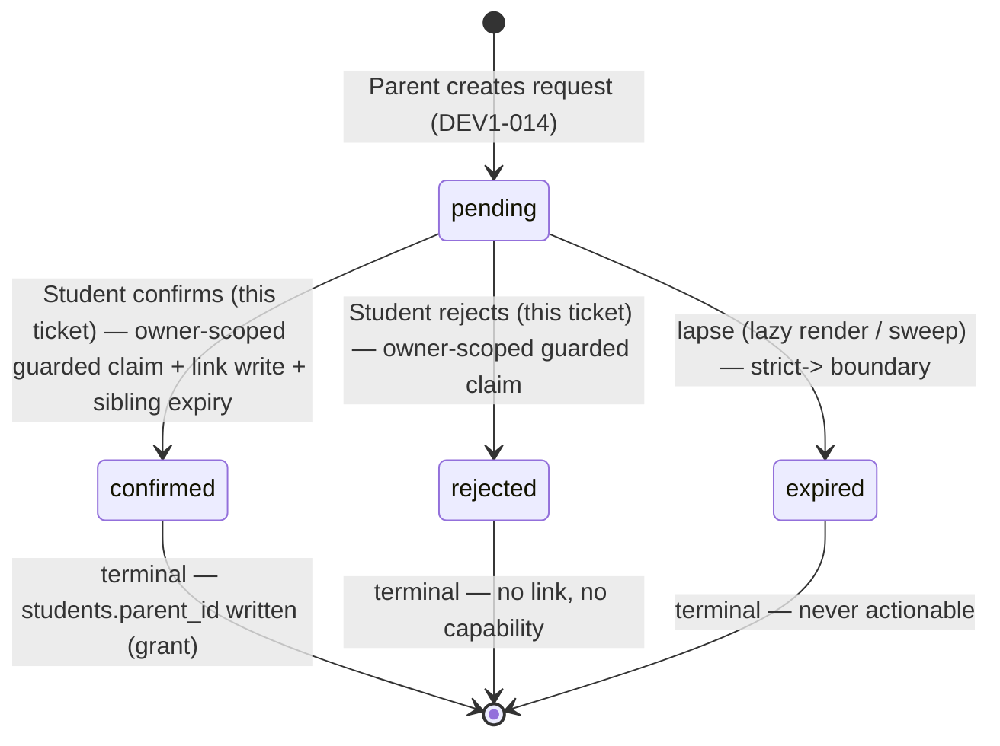

# Technical Architecture & Implementation Design: DEV1-015 — Student Confirmation of Parent Link

**Plan directory (verbatim):** `ai/plans/sprint_3/dev1-015-student-confirmation-of-parent-link`
**Specs (approved):** `ai/plans/sprint_3/dev1-015-student-confirmation-of-parent-link/specs.md`
**Deferred-items ledger (to be created at Task 0):** `ai/plans/sprint_3/dev1-015-student-confirmation-of-parent-link/deferred-items.md`
**Outcome directory:** `ai/plans/sprint_3/dev1-015-student-confirmation-of-parent-link/outcome/`
**Governing docs:** `docs/parents/parent-link-request.md` (DEV1-014 canonical, status "Implemented and verified"), `docs/parents/handshake-code-discovery.md`, `docs/workflows/04-parent-supervision-handshake.md` (§4.4), `docs/specs/state-machine-invariants.md` (INV-P1..P4), `docs/specs/open-decisions-and-gaps.md` (A.2/A.3/A.4/B.12/B.13/B.14), `docs/notifications/realtime-engine.md` (§3.1/3.2), `docs/testing/workflow-journey-tests.md`.

---

## Document Information

- **Feature Name**: DEV1-015 — Student Confirmation of Parent Link
- **Target Directory**: `ai/plans/sprint_3/dev1-015-student-confirmation-of-parent-link/`
- **Outcome Directory**: `ai/plans/sprint_3/dev1-015-student-confirmation-of-parent-link/outcome/`
- **Version**: 1.0 · **Date**: 2026-09-05
- **Author**: Copilot CLI (spec-driven-development)
- **Reviewers**: @plan-review skill gate (Phase 1.5), post-implementation review waves (tasks Phase 6)
- **Related Documents**: `specs.md` (requirements), `tasks.md` (execution), `docs/parents/parent-link-request.md` (canonical domain doc), `ai/plans/sprint_3/dev1-014-*/` (substrate outcome)


## 1. System Overview & Architecture Diagram

### 1.1 What this ticket is (and is not)

DEV1-015 is the **student-side decision half** of Workflow 04 §4.4, shipped as a **closure + discoverability slice on top of the already-verified DEV1-014 substrate**. The bundled code confirms the entire authorizing stack exists:

- **Service:** `ParentLinkRequestService.respondToLinkRequest` / `listMyIncoming` — `backend/services/parents/parent-link-request.service.ts`
- **Helpers:** `classifyUnclaimableRequest`, `raiseUnclaimableDenial`, `requireActor`, `mapIncoming`, `toCanonicalLinkStatus` — `backend/services/parents/parent-link-request.helpers.ts`
- **Repositories:** `respondToPendingForStudent`, `expireSiblingPendingsForStudent`, `markExpiredIfPending`, `listIncomingForStudent`, `findIncomingRowById` — `backend/db/repo/parents/parent-link-request.repository.ts`; `StudentRepository.linkParentIfUnlinked` (the single writer of `students.parent_id`) — `backend/db/repo/students/student.repository.ts`
- **GraphQL:** `respondToParentLinkRequest` mutation — `backend/graphql/mutation/parents/parent-link.mutation.ts`; `myIncomingParentLinkRequests` query — `backend/graphql/query/parents/parent-link.query.ts`; objects — `backend/graphql/pothos/parents/parent-link-request.pothos.ts`
- **Canonical types:** `backend/types/parents/parent-link-request.types.ts` (`ParentLinkRequestSelectType`, `IncomingParentLinkRequestReturnType`, `OutgoingParentLinkRequestReturnType`)
- **Frontend documents + helpers:** `frontend/graphql/sharedDocuments/parents/parent-link.documents.ts`, `frontend/lib/parent-link-request-status.ts` (`isLinkRequestActionable` / `displayLinkRequestStatus` / `parentLinkStatusChipSpec`), `frontend/lib/parent-link-denials.ts` (`resolveParentLinkDenialCopy`)

Therefore this ticket **ships zero new GraphQL root fields, zero schema/migration drift, zero new notification types, zero new service write paths**. Its delta is:

1. **Dashboard discoverability card (NEW UI)** — the one genuinely missing activation element (a pending request the student never sees expires silently per B.14).
2. **Notification → decision-route deep-link convergence (verify-and-close)** — REQ-011 consumption seam.
3. **Nav retargeting (verify-and-fix)** — if the student "link requests" nav entry still targets the `[feature]` catch-all ComingSoon page, retarget it to the real student route (no duplicates).
4. **Test-first journey + regression cells** — REQ-062/063/064/065.

### 1.2 Interaction diagram

```text
Parent (DEV1-014 surfaces)                  Student (this ticket)                 Parent (observer)
─────────────────────────                   ──────────────────────────            ──────────────────
requestLink(code) ──┐
                    ▼
        Pothos: requestParentChildLink
                    ▼
        ParentLinkRequestService.requestLink
        (guarded insert, partial-unique arbiter,
         in-tx emit → student, publish AFTER commit)
                    │
                    ▼                    ┌─────────────────────────────────────────────┐
        notifications row (student)      │  Student Dashboard                          │
        relatedEntityType=               │  PendingParentLinkRequestsCard (NEW)        │
        "parent_link_request" ──────────▶│  useQuery(myIncomingParentLinkRequests…)    │
                                         │  → CTA → /student link-requests route       │
                                         └──────────────────┬──────────────────────────┘
                                                            │ click Confirm / Reject
                                                            ▼
                              Apollo mutation respondToParentLinkRequest(requestId, accept)
                                                            ▼
                              Pothos scope: $all{authenticated, role:[Student]}
                                                            ▼
                              ParentLinkRequestService.respondToLinkRequest
                              ONE withTransaction unit:
                                1. guarded claim UPDATE … WHERE id AND student_id=caller
                                   AND status='pending' AND expires_at > now() RETURNING
                                2a. accept: linkParentIfUnlinked (guarded) +
                                    expireSiblingPendingsForStudent
                                2b. reject: claim only
                                3. in-tx emit → PARENT (parent's persisted locale)
                                                            ▼ commit
                              NotificationEngine.publishReceipts (post-commit ONLY)
                                                            │
                                                            ▼
                                          Parent inbox: exactly ONE outcome notification
```

### 1.3 Key Design Decisions Table

| # | Decision | Options Considered | Pros / Cons | Rationale (Maintainability, Scalability, Reliability) |
|---|---|---|---|---|
| D1 | **Reuse DEV1-014's `respondToLinkRequest` verbatim; zero backend logic delta** | A: Reuse existing service (chosen). B: Add a thin `confirmStudentSelfLink` wrapper | A: single transition authority, one chaos-proven code path, byte-parity with the DEV1-014 chaos suite. B: harmless but forks the decision seam, doubles the test surface, risks divergence | The single-writer + guarded-claim choreography is chaos-proven (`backend/services/parents/parent-link-request.chaos.test.ts` two-parent race, expiry-race cells). INV-P1's grant has exactly one producer by design |
| D2 | **Dashboard card reads the SAME `myIncomingParentLinkRequestsQueryDocument` via client `useQuery`; "actionable" computed by `isLinkRequestActionable`/`displayLinkRequestStatus`** | A: Shared list document (chosen). B: New `myPendingParentLinkCount` query. C: Server-component fetch | A: one normalized Apollo cache truth (id-first rows), card disappears on refetch/write-back with zero bespoke invalidation; CTA lands on a warm cache. C: duplicates the read path (server components must not hit GraphQL; would need direct service calls and break the shared cache). B: unbounded surface growth | REQ-051. Read purity (REQ-014) — no reads perform writes; expiry renders computationally via the DEV1-014 mapping |
| D3 | **New journey file `test/workflows/parents/student-confirmation-of-link.journey.test.ts` (test-first), complementing the existing DEV1-014 journey** | A: New focused journey (chosen). B: Extend DEV1-014 journey in place | A: test-first mandate (REQ-062), clean actor-cast locality, no churn on a green verified suite. B: risks destabilizing an approved journey, muddies ownership | `docs/testing/workflow-journey-tests.md`: one journey file per cross-actor workflow; the DEV1-014 journey owns the request leg; this owns the confirmation leg |
| D4 | **Notification deep-link: reuse the EXISTING drawer resolution; close only a verified gap** (no new notification type, no new route params) | A: Verify + minimally extend existing resolution (chosen). B: Add action metadata to the realtime payload | A: engine payload stays closed (`docs/notifications/realtime-engine.md` §3 "closed payload"). B: explicitly forbidden there | The row already carries `relatedEntityType="parent_link_request"` + `relatedEntityId=requestId`; routing is UI-derivable. Verification gate (REQ-011) precedes any edit |
| D5 | **Nav reality: retarget, never duplicate** | A: conditional retarget of the existing student entry in `frontend/views/dashboard/nav/navItems.ts` (chosen). B: add a second item | A: honors invariant #12; B: sidebar duplication defect | Verification-first: `navItems.ts` imports `LinkOutlined as LinkChildIcon` — the route it targets is verified at implementation; if it points at the `[feature]` catch-all, retarget; else no-op and record the proof |
| D6 | **Dashboard slot composition: extend `resolveStatusSlot` in `frontend/views/dashboard/home/RoleDashboardPage.tsx`** (student branch renders `HandshakeCodeCard` + the new card) | A: compose in the existing status slot (chosen). B: embed in `DashboardView` body | A: `HandshakeCodeCard` already renders there via `frontend/views/students/dashboard` — colocated sibling; zero layout churn for other roles. B: changes shared layout for all roles | Least blast radius; `DashboardView.statusSlot` contract unchanged |
| D7 | **Error code taxonomy: closed — zero new `extensions.code` values** | A: reuse DEV1-014 denial vocabulary (chosen). B: introduce UI-domain codes | A: REQ-041; codes map bijectively to flat `ErrorsLabels` keys already shipped. B: forces taxonomy registration + client mapping churn for zero user gain | `resolveParentLinkDenialCopy` already maps the denial family client-side |
| D8 | **Concurrency posture: guarded single-statement claims + DB arbiters only — NO `SELECT FOR UPDATE`, no advisory locks, no Redis on this surface** | A: guarded-UPDATE pattern (chosen). B: row locking | A: predicate+mutation in one statement = zero TOCTOU; loser's 23505/zero-row collapses into existing typed conflicts. B: adds deadlock surface against sibling writes (the DEV1-014 chaos suite proves claim→link write ordering) | Identical ruling to `docs/admin/cold-start-certification.md` §2.7 and the DEV1-014 R3 pair arbiter |

---

## 2. Data Models & Database Schema

### 2.1 Existing schema verification (Drizzle = sole structural ground truth)

| Element | Location | Verification | Reuse |
|---|---|---|---|
| `parent_link_requests` (physical `ln`) — `parent_id`, `student_id`, `status` (link_status pgEnum), `created_at`, `expires_at`, `responded_at`, `reminder_sent_at` | `backend/db/schema/parents/parent-link-requests.ts` | imports `linkStatus` from `backend/db/schema/enums.ts`; partial unique index `parent_link_requests_pending_pair_unique` | REUSE — no column changes |
| `LinkStatus` enum (`pending/confirmed/rejected/expired`) | `backend/enum/shared/link-status.enum.ts` (+ `isLinkStatus` guard) | enum-object registration in `backend/graphql/pothos/shared/enum.pothos.ts` (`LinkStatusPothosEnum`) | REUSE |
| `students.parent_id` FK (one-parent-per-student, B.12) | `backend/db/schema/students/students.ts` | single writer is `linkParentIfUnlinked` (scan-locked by `backend/services/parents/parent-link.static-locks.test.ts`) | REUSE |
| `notifications` table + `NotificationType.ParentLinkRequest` | `backend/db/schema/notifications/notifications.ts`; `backend/enum/notifications/notification-type.enum.ts` | single writer = NotificationEngine | REUSE |
| Constants | `PARENT_LINK_REQUEST_MS` — `shared/constants/parent-link-request.constants.ts` | 7-day expiry (B.14) | REUSE |

### 2.2 Canonical types (all exist — zero additions)

| Type | File | Role here |
|---|---|---|
| `ParentLinkRequestSelectType` / `ParentLinkRequestInsertType` | `backend/types/parents/parent-link-request.types.ts` | Service/repo signatures |
| `IncomingParentLinkRequestReturnType` (`id, status, parentFullName, createdAt, expiresAt, respondedAt`) | same | Wire row consumed by dashboard card + decision view |
| `OutgoingParentLinkRequestReturnType` | same | Parent-side (observer journeys only) |
| `DBTransaction`, `DBQueryExecutor` | `backend/types/db.types.ts` | ALL repo/service txs |

**Schema-drift contract (REQ-050/053):** this ticket MUST result in `git diff -- backend/db/schema/** backend/db/migration/**` = empty. `bun run db push` is a no-op confirmation, never a change vehicle here.

---

## 3. API Contracts & Pothos Resolvers

### 3.1 Wire surface (existing — exact signatures verified at implementation against the bundled files, REQ-050)

```graphql
type IncomingParentLinkRequest {
  id: ID!
  status: LinkStatus!
  parentFullName: String!
  createdAt: DateTime!
  expiresAt: DateTime!
  respondedAt: DateTime
}

extend type Query {
  myIncomingParentLinkRequests: [IncomingParentLinkRequest!]!
}

extend type Mutation {
  respondToParentLinkRequest(requestId: ID!, accept: Boolean!): IncomingParentLinkRequest!
}
```

- Objects: `backend/graphql/pothos/parents/parent-link-request.pothos.ts` (`IncomingParentLinkRequestPothosObject`, `OutgoingParentLinkRequestPothosObject`) — pure structural passthrough over the canonical return types; **`id` is exposed first** (Apollo normalization); timestamps use the registered `DateTime` scalar (`backend/graphql/pothos/shared/scalar.pothos.ts`) — no `toISOString()` into `String`.
- Documents (existing, typed, `id`-first): `myIncomingParentLinkRequestsQueryDocument`, `respondToParentLinkRequestMutationDocument` (plus parent-side documents) in `frontend/graphql/sharedDocuments/parents/parent-link.documents.ts`; wire-parity lock: its sibling `parent-link.documents.test.ts`.
- **Zero new root fields.** `backend/graphql/test/schema-surface.test.ts` baseline inventory MUST remain byte-identical; if any Pothos edit is forced (none expected), the baseline is updated in the same change-set per invariant #11, and that deviation is recorded in the deferred-items ledger with the reason.

### 3.2 authScopes & resolver shape

Both fields carry the explicit conjunction (verified against `backend/graphql/query/parents/parent-link.query.ts` / `mutation/parents/parent-link.mutation.ts` at implementation; the sibling handshake surface `backend/graphql/query/students/handshake-code.query.ts` is the proven pattern):

```ts
authScopes: { $all: { authenticated: true, role: [UserRole.Student] } }
```

Anonymous → `UNAUTHORIZED`; authenticated non-student → `FORBIDDEN` — **pre-resolver** (Pothos scope-auth; the plain-map ANY-semantics form is forbidden per `docs/teachers/applicant-lifecycle.md` §3). Resolvers are thin: `!ctx.user` narrowing → `parseLinkRequestIdArg`-style positive-safe-int parse → field-by-field hand-off (never spread). The mutation's parser + verified id path (`requireVerifiedRequestId`) already exist in `parent-link.mutation.ts`.

### 3.3 Permission matrix

| Operation | Anonymous | Student (owner) | Student (foreign id) | Parent | Teacher | Admin |
|---|---|---|---|---|---|---|
| `myIncomingParentLinkRequests` | 401 `UNAUTHORIZED` | 200 own rows only | n/a (self-scoped; no id input) | 403 `FORBIDDEN` | 403 `FORBIDDEN` | 403 `FORBIDDEN` |
| `respondToParentLinkRequest` | 401 `UNAUTHORIZED` | 200 decision applied | constant NOT_FOUND-shaped denial (no oracle) | 403 `FORBIDDEN` | 403 `FORBIDDEN` | 403 `FORBIDDEN` |
| `myOutgoingParentLinkRequests` / `requestParentChildLink` / `cancelParentLinkRequest` (context) | 401 | 403 | n/a | 200 (parent ops — DEV1-014) | 403 | 403 |

Envelope/discipline: single-error envelope, `extensions.code` passthrough, boundary masking per `docs/graphql/error-handling-contract.md`; per-op `path` set; identical extensions key set across denial classes (no per-role disclosure — pinned by `backend/graphql/test/parent-link.wire.test.ts`, extended only where REQ-063 identifies a genuinely missing cell).

---

## 4. Backend Services, Repositories & Concurrency Model

### 4.1 Service/repository surface (verify-then-pin; NOTHING re-implemented)

| Symbol | File | Signature (bundled) | Role in DEV1-015 |
|---|---|---|---|
| `respondToLinkRequest` | `backend/services/parents/parent-link-request.service.ts` | `(requestId, accept, studentActorId, locale, outerTx?, options?)` | THE decision entry (REQ-012/013) |
| `listMyIncoming` | same | `(studentActorId, locale, tx?)` | list read (REQ-010); render-time expiry mapping |
| `classifyUnclaimableRequest` / `raiseUnclaimableDenial` | `backend/services/parents/parent-link-request.helpers.ts` | `(requestId, actorId, "student", tx)` / classification → typed denial | zero-row classification (REQ-031) |
| `requireActor` | same | fresh actor re-check (identity+role+governance, constant-copy governed denials) | REQ-022 (invoked BEFORE the tx opens per DEV1-014's recorded D9a divergence) |
| `respondToPendingForStudent` | `backend/db/repo/parents/parent-link-request.repository.ts` | `(requestId, studentId, target: Confirmed|Rejected, now, tx)` | guarded claim (`id ∧ student_id ∧ status='pending' ∧ expires_at > now` → RETURNING) |
| `expireSiblingPendingsForStudent` | same | `(studentId, winnerRequestId, tx)` | confirm choreography |
| `linkParentIfUnlinked` | `backend/db/repo/students/student.repository.ts` | `(studentId, parentId, tx)` | the ONLY non-null writer of `students.parent_id` (INV-P1, B.12) |
| `findIncomingRowById` / `listIncomingForStudent` | repo | post-claim refresh + list rows | return-row assembly |
| NotificationEngine `emitForUser` / `publishReceipts` | `backend/services/notifications/notification-engine.service.ts` | engine is the single writer; receipts published post-commit | outcome notify in parent's persisted locale |

Denial taxonomy (closed, REQ-041 — verified against helpers at implementation): constant NOT_FOUND shape for foreign/absent ids (`NotFoundError`), typed conflict for already-resolved/expired classes via the `ConflictError(code, message)` overload contract used across the parent-link suites (`backend/services/parents/parent-link-request.service.test.ts`'s `expectConflict(fn, code, translatedCopy)`), `ValidationError` for shape failures (`isPositiveSafeInt`).

### 4.2 Concurrency & Race Condition Assessment

| Scenario | Actors | Risk | Mitigation (existing mechanism — pinned, not re-litigated) |
|---|---|---|---|
| Two parents' pendings confirmed concurrently (same student) | Student × ParentA/ParentB decisions racing | Double link / overlapping terminal states | Confirm = claim + `linkParentIfUnlinked` guarded UPDATE (`parent_id IS NULL` fused predicate) in ONE tx; loser's zero-row → abort → already-resolved typed conflict; sibling sweep expires the other pending in the winner's tx. Chaos-proven (`parent-link-request.chaos.test.ts` two-parent race cell) |
| Double-click / retry on the same requestId | Student | Double transition, duplicate parent notification | Second claim matches zero rows (row no longer pending) → classified already-resolved conflict; the loser's in-tx emit rolls back → zero duplicate notification rows, zero duplicate publish |
| Respond at exactly `expiresAt == now` | Student vs clock | Boundary ambiguity | Strict-`>` liveness in the claim predicate and in `isLinkRequestActionable`; boundary instant = expired on BOTH the write and render paths (REQ-014) |
| Respond ⟷ sweep/expiry materialization race | Student vs sweeper | Competing terminal writes | `markExpiredIfPending` / claim both guarded on `status='pending'`; exactly one wins under the row lock; chaos expiry-race cell pins convergence to exactly one terminal state (`expired`/`confirmed`/`rejected`) |
| Respond ⟷ parent cancel race | Student vs Parent | Confirm of a cancelled request | Both claims are owner-scoped guards on `pending`; one wins, the loser classifies to already-resolved. Winner determines terminal state deterministically |
| Governed student mid-flight (suspended after token minted) | Student | Decision by governed actor | Service-tier fresh `requireActor` re-check BEFORE the transaction opens (DEV1-014 D9a ordering): constant `ForbiddenError` copy, zero reads past the gate, zero writes (REQ-022). NOTE per invariant #7: the GraphQL context boundary is NOT fail-closed for governed users — this service re-check IS the request-time governance defense |

**Locking posture (explicit non-usage):** NO `SELECT FOR UPDATE`, NO advisory locks, NO Redis locking on this surface. Every contested write carries its precondition in the same SQL statement (guarded UPDATEs) or is arbitrated by the partial unique index (`parent_link_requests_pending_pair_unique`, 23505 arbiter). TOCTOU window = 0 by construction. This matches the recorded ruling in `docs/parents/parent-link-request.md` (R2/R3) — assert by extending, not re-proving.

### 4.3 Cross-Actor Journey Design (mandatory — specs §2.9)

**Shared-entity state machine** (`parent_link_requests` row — the DEV1-014 vocabulary, unchanged):



| Transition | Driving actor (+ permission) | Guard predicate (fused in ONE statement) | Forbidden for |
|---|---|---|---|
| → pending | Parent (`UserRole.Parent`, POST-create surface, DEV1-014) | pair arbiter + discovery/governance collapse | student/teacher/admin |
| pending → confirmed | Student (`UserRole.Student`, actorId = `ctx.user.id`) | `id ∧ student_id=caller ∧ status='pending' ∧ expires_at > now` + `parent_id IS NULL` link guard | parent (any), other students, teacher, admin |
| pending → rejected | Student (same) | same claim predicate | same |
| pending → expired | System (lazy/sweep) | `status='pending'` | — |

**Side-effect matrix (per transition):**

| Transition | Rows written (all in ONE tx) | Notification (channel → recipient, locale) | Idempotency/dedupe |
|---|---|---|---|
| → pending (context step) | `parent_link_requests` insert; ONE `notifications` row to the **student** (`type=parent_link_request`, `relatedEntityType="parent_link_request"`, `relatedEntityId=requestId`) | in-app inbox + post-commit fanout → student, student's persisted locale | pair-unique arbiter; engine claim when caller passes a key |
| pending → confirmed | claim row (`status=confirmed`, `responded_at`); `students.parent_id` via `linkParentIfUnlinked`; ALL sibling pendings → `expired`; ONE `notifications` row to the **parent** | in-app + post-commit publish → parent, parent's persisted locale | zero-row loser aborts whole unit (no ghost notification/publish) |
| pending → rejected | claim row only (`status=rejected`, `responded_at`); siblings untouched; `students.parent_id` untouched; ONE `notifications` row to the parent | same channel invariants | second respond classify → conflict, no dup notify |
| pending → expired | (read renders computationally; sweep materializes) | NOTHING at/after expiry (R13 posture) | sweep guarded statement, idempotent by predicate |
| ANY denial | **ZERO rows anywhere incl. zero `audit_logs`** (R10) | NONE | — |

**Cross-actor visibility table (after each step):**

| State reached | Student sees | Parent sees | Other students / teacher / admin see |
|---|---|---|---|
| pending | incoming row with parent's FULL name (sanctioned decision identity), expiry, Confirm/Reject; dashboard card + count; notification in drawer deep-linking to the decision route | outgoing row with the student's MASKED name (`maskFullName`, R9 — masked forever incl. post-confirm) | nothing (no surface) |
| confirmed | row rests as confirmed; card disappears when no actionable pending remains | outgoing row → `confirmed` + ONE acceptance notification — still masked student name | nothing |
| rejected | row rests as rejected | outgoing row → `rejected` + ONE rejection notification; **no monitoring capability (INV-P1)** | nothing |
| expired | row rendered `Expired`, actions hidden (no affordance) | outgoing row rendered `Expired` | nothing |

Journey test (REQ-062, test-first) asserts this matrix end-to-end at `test/workflows/parents/student-confirmation-of-link.journey.test.ts` against real services + real DB: committed fixtures in `beforeAll` (UUID-prefixed cast: ≥2 parents, ≥1 student without link, 1 already-linked student, 1 governed student), tracked hard-delete in `afterAll` in FK-safe order (notifications → parent_link_requests → students → parents → users), ZERO `runInRollback`, honest role resolution, fanout spied via the existing `SpiedFanoutTransport` seam from `@/test/workflows/helpers` + `NotificationEngineCallOptions` injection (the pattern used by the DEV1-014 chaos/service suites). Steps: spec §2.9 steps 1–9, with negative denial cells J-REQ-03/04 and the winner/loser race (J-REQ-05) executed via cross-connection settle (`Promise.allSettled` on two `respondToLinkRequest` calls over distinct committed pendings), reusing the committed-fixture discipline of `parent-link-request.chaos.test.ts` (`isPgliteProvider` wholesale-skip guard preserved for true races).

---

## 5. Frontend UX & Navigation Specification

### 5.1 Routes & URLs

| Path | Purpose | Required permission | Allowed roles | Redirect on mismatch |
|---|---|---|---|---|
| `/student/dashboard` | Landing; hosts the NEW pending-link card in the status slot | authenticated + role | Student | `roleDashboardPath(ctx.role)` (never bare `/dashboard`) |
| Student link-requests route (**verify at implementation**: locate via `rg "myIncomingParentLinkRequests" app/ frontend/views/students/` — expected an `app/(dashboard)/student/**` page rendering the DEV1-014 `frontend/views/students/link-requests/**` container) | Decision surface (list + Confirm/Reject) | authenticated + role | Student | same |

Page guard pattern (existing convention): `withPageAuth({ roles: [UserRole.Student], redirectTo: <the student route> })` — `frontend/lib/auth/withPageAuth.ts`.

### 5.2 Sidebar & navigation integration (verify-first, retarget-if-needed — invariant #12)

- Inspect `frontend/views/dashboard/nav/navItems.ts` (`getNavItemsForRole`, the student section — the file already imports `LinkOutlined as LinkChildIcon`) and its lock `navItems.test.ts`.
- **If** the student link-requests entry points at the `[feature]` catch-all (`ComingSoonView`, `frontend/views/dashboard/layout/ComingSoonView.tsx`): RETARGET its `route` to the verified student link-requests route and update `navItems.test.ts` expectations.
- **If** it already targets the real route: no change; record parity proof in the task outcome.
- No duplicate entries; NO mobile bottom-nav work (mobile nav is the temporary MUI `Drawer` — `DashboardSidebar`).

### 5.3 Per-audience rendering

| Audience | What renders |
|---|---|
| Student | Dashboard: HandshakeCodeCard + **PendingParentLinkRequestsCard** (conditional); link-requests page: full decision list |
| Parent | No slice of this surface (their faces are the outgoing list/notifications — DEV1-014) |
| Teacher / Admin | None — FORBIDDEN at the scope layer pre-resolver; pages redirect to their role dashboards |
| Anonymous | Redirect to login via page guard |

### 5.4 NEW component: dashboard discoverability card (the ticket's only new UI surface)

**Placement:** extend `resolveStatusSlot` in `frontend/views/dashboard/home/RoleDashboardPage.tsx` — the student branch already renders `HandshakeCodeCard` (imported from `@/frontend/views/students/dashboard`); render the new card alongside it inside a `Stack` (sibling, same slot). New files (co-located):

```
frontend/views/students/dashboard/PendingParentLinkRequestsCard.tsx   (client)
frontend/views/students/dashboard/pending-parent-link-requests.ts      (pure helpers: derive actionable count + latest parent name)
```

**Data & logic (REQ-051/052):**
- `useQuery(myIncomingParentLinkRequestsQueryDocument)` (Apollo hook — same normalized list the decision page uses; id-first rows).
- Actionable derivation: `displayLinkRequestStatus(row.status, row.expiresAt, nowMs) === LinkStatus.Pending` AND `isLinkRequestActionable(...)` — reuse `frontend/lib/parent-link-request-status.ts` verbatim (no fork).
- Render contract:
  - **Absent (zero actionable):** return `null` — no empty-state scar (REQ-015).
  - **Present:** Card → `PendingActionsOutlined`-class icon (`*Outlined` naming only) + title (localized), count chip (localized plural-safe), latest requester line = the most recent actionable row's `parentFullName` (FULL parent name — sanctioned incoming disclosure), ONE CTA `Button`/`Link` (`≥44px` target, `focusVisibleRingSx` from `frontend/components/ui/focusRing.ts`) to the student link-requests route.
  - **Loading:** `aria-busy` skeleton (Skeleton rows inside the card frame) — never flash content/disappear thrash; query errors render ONE localized inline `Alert` with retry via `refetch` (follow `RetryableNotice`/error seams conventions; map codes via `resolveParentLinkDenialCopy` + `mapGraphQLErrorByCode` family behavior — never render raw server message for masked classes).
- **MUI v9 discipline:** `sx` only (no direct style props), `theme.palette.*` tokens (no hex), `Stack`/`Box`/`Typography` via `sx`, RTL-safe logical properties (no physical `left/right`; rely on the appbar/drawer precedent).
- **i18n:** extend the existing `parentLink` namespace (types + `en` + `ar` + parity suite), handles via `useAppTranslation(ParentLink)` (namespace handle const, per bundled `frontend/lib/parent-link-request-status.ts`'s `ParentLinkLabels` import from `@/shared/locale/types/parentLink`); registration checklist per `shared/AGENTS.md`. **No new namespace** unless the parity audit shows the card copy cannot live under `parentLink` — then route through the standard checklist and ledger the deviation.
- **Cache convergence (REQ-016):** after Confirm/Reject the decision page performs id-first write-back + list refetch (DEV1-014 behavior); the card disappears automatically on its next `useQuery` evaluation after document-level cache update / drawer badge refresh — no bespoke invalidation bus.

**Deep-link convergence (REQ-011):** inspect `frontend/components/ui/NotificationDrawerBody.tsx` / `useNotificationDrawerActions.ts` (`handleOpenNotification`) for the `relatedEntityType === "parent_link_request"` branch.
- If it already routes to the student decision route → pin with a component/contract test only.
- If it does not → add the minimal mapping inside the drawer's existing route-resolution seam (a plain `Record`/switch keyed by entity type), sharing ONE exported route constant with the card's CTA and nav item target so the three can never drift.

### 5.5 Visual design & responsive specifications

- **Breakpoints:** Desktop 1440px — card spans the status slot grid cell (same footing as `HandshakeCodeCard`); Tablet 768px — cards stack vertically, CTA keeps ≥44px height; Mobile 375px — full-bleed card, wrap count chip above requester line, CTA full-width. No bottom-nav assumptions; mobile nav = Drawer.
- **RTL (ar) / LTR (en) mirroring:** logical props only (`marginInlineStart` via `sx`), icon/trailing chevron flips under RTL through the existing stylis-plugin-rtl pipeline (`frontend/lib/emotion-cache.tsx`); any mixed-direction names render with `dir="auto"` and the existing `isolateBidi` helper (`shared/lib/isolate-bidi.ts`) where a name abuts localized chrome — the pattern DEV1-014 polished in D8. Arabic line-height: inherit theme body defaults; do not set explicit line-height.
- **Visual state matrix (card):**

| State | Rendering |
|---|---|
| Loading | Skeleton (title bar + one line + CTA block), `aria-busy`, zero layout shift target |
| No actionable requests | `null` (card unmounts) |
| 1 actionable | Title + "1" count + requester name + CTA |
| N>1 actionable | Title + count N + MOST RECENT requester + CTA (no per-request list on the dashboard) |
| Query error | Inline localized Alert + retry; card frame stays stable |
| Post-decision | list refetch/write-back → actionable count 0 → card unmounts |

- **Decision page states (existing — regression-pinned, not redesigned):** expired rows render the `Expired` chip with affordances hidden via `parentLinkStatusChipSpec` + `isLinkRequestActionable`; deny flows surface typed copy via `resolveParentLinkDenialCopy`.

### 5.6 Agent-Browser verification protocol

Automated real-browser pass (the D8-compensating control from DEV1-004/014 — Happy-DOM portal-input limits apply to dialog textareas only; this surface has none):

1. Seed/login a student fixture with ONE pending incoming request (service-level fixture or the seeded demo pair if present); open `/student/dashboard` at 1440/768/375 × en/ar → screenshot the card in all six cells.
2. Click the card CTA → lands on the student link-requests route → the pending row shows the parent's FULL name, expiry line, Confirm/Reject.
3. Click **Reject** → row shows rejected chip; the parent's outgoing view (login as parent) shows `rejected` + ONE new notification, student name STILL masked; dashboard card disappears.
4. Repeat with **Confirm** on a fresh pending → `students.parent_id` set (assert via parent outgoing view state + subsequent portal eligibility, DEV1-016-adjacent read-only), sibling pendings (seed two parents) render `Expired`, card disappears.
5. Notification route: open the drawer, click the link-request notification → lands on the decision route (deep-link proof).
6. RTL pass on `/student/dashboard` (ar): mirroring + `dir="auto"` on names verified visually.
7. Wrong-role probes: teacher/parent hitting the student route → role-dashboard redirect; anonymous → login redirect.

---

## 6. Security, Authorization & Tenancy Mitigations

- **BOLA / IDOR:** `respondToParentLinkRequest` identity derives EXCLUSIVELY from `ctx.user.id`; the claim predicate fuses `student_id = caller`; foreign/nonexistent requestIds collapse to the constant NOT_FOUND-shaped denial — byte-identical code/message/envelope (no existence oracle; pinned by the wire suite's "foreign ≡ absent" cells). Reads (`listMyIncoming`) are self-scoped by construction.
- **BOPLA / mass assignment:** wire input = exactly `{ requestId, accept }` (closed Pothos input shape; smuggled fields die as `GRAPHQL_VALIDATION_FAILED` pre-resolver). All DB writes are field-by-field DTO projections inside the guarded repo statements — zero `{ ...input }` spread into any Drizzle `set()`/`values()`. Error payloads likewise built explicitly (no input echo), including any `fields[]` payloads per `docs/graphql/error-handling-contract.md` §3.
- **BFLA:** `$all{ authenticated, role:[Student] }` on both fields (pre-resolver) + fresh service-tier `requireActor` re-check. No admin/supervisor override exists on this decision surface BY DESIGN (the only sanctioned non-handshake `students.parent_id` writer is DEV3-019 direct onboarding, outside this flow — recorded in Workflow 04 §8 / DEV1-014 §3 exception).
- **Governance at request time:** `createGraphQLContext` is NOT fail-closed for governed users (acknowledged platform posture); the service's pre-tx `requireActor` re-check (identity + role + governance) IS this surface's request-time defense (REQ-022) — governed student → constant `ForbiddenError` copy, zero writes/reads past the gate.
- **Injection / wildcard sanitization:** N/A for this surface — the decision path consumes integer ids only (`isPositiveSafeInt`), and the handshake-code discovery surface (single parameterized equality, no LIKE/ILIKE) is untouched. If any future searchable field is added here, the canonical `escapeLikeWildcards` helper MUST be created/imported per `docs/admin/user-management.md` (single-sanitizer rule) — not needed now.
- **Error disclosure:** closed denial taxonomy (REQ-041); no branch disclosure (missing vs governed vs foreign vs resolved are never distinguishable beyond the sanctioned conflict shapes); masked internal errors only at the boundary; `DateTime` scalar — no hand-serialization leaks.
- **Log hygiene (REQ-024):** at most ONE bounded `logger.logDomainError` per denial with `{ code, entity: "parent_link_requests", entityId, locale }` — never handshake codes, never party names; happy paths log NOTHING; happy-path fanout failures degrade via the engine's documented `NOTIFICATION_DELIVERY_DEGRADED` channel (`docs/notifications/realtime-engine.md` §3.1). `console.*` forbidden; the existing scan lock `backend/services/parents/parent-link.static-locks.test.ts` stays green (extend its corpus ONLY if a new backend file under its scanned roots is added — none expected).
- **INV-P1 closure (REQ-017/065):** negative probes assert `students.parent_id` is NULL before confirmation, unchanged after rejection, and that no parent-side read of student data exists anywhere in this surface (parent portal is DEV1-016's scope and reads ONLY `students.parent_id`).

---

## Test & rollout plan (summary of coverage obligations for tasks.md)

| Layer | File(s) | Notes |
|---|---|---|
| Journey (test-first) | `test/workflows/parents/student-confirmation-of-link.journey.test.ts` | §4.3 assertion set; committed fixtures; spied fanout; no `runInRollback`; PGLite-skip for true races |
| Wire (extension-only) | `backend/graphql/test/parent-link.wire.test.ts` | add ONLY genuinely missing decision-leg cells (e.g., expired-claim denial on the wire); everything else pinned green |
| Service/Repo (extend, never rewrite) | `backend/services/parents/parent-link-request.service.test.ts` / `.chaos.test.ts` | add pinned regression cases ONLY where the ticket's acceptance criteria lack a cell (e.g., dashboard-visibility adjacency assertions are journey-level); otherwise reference, don't duplicate |
| Frontend documents/contract | `frontend/graphql/sharedDocuments/parents/parent-link.documents.test.ts`, `documents.contract.test.ts` | unchanged documents; parity suites stay green; codegen drift = 0 |
| Component suites (NEW) | `test/ui/components/students/PendingParentLinkRequestsCard.test.tsx` | REQ-064 matrix: loading / absent / present(count+name+CTA) / error-retry / post-decision disappearance / RTL, both locales |
| Nav pin | `frontend/views/dashboard/nav/navItems.test.ts` | retarget expectation (only if D5 fires) |
| Notification deep-link | component/contract test on the drawer resolution | REQ-011 pin (post-verification) |
| Schema surface | `backend/graphql/test/schema-surface.test.ts` | byte-identical baseline (zero new schema surface) |
| Static locks | `parent-link.static-locks.test.ts` | stays green; corpus extension only if a new scanned file is created |
| Docs | amend `docs/parents/parent-link-request.md` (DEV1-015 closure section) | REQ-070 — no new canonical doc, no edits to spec/invariant numbering |
| Baseline/ledger | Task 0 + `deferred-items.md` ledger under the plan dir | REQ-001/002; final gate: zero ❌/⚠️ |

---

## 7. Components & Interfaces (Implementation-Level)

### Component: `respondToLinkRequest` (Service — EXISTING, regression-pinned)
- **Purpose**: Execute the student's confirm/reject decision against a `PENDING` link request atomically.
- **Responsibilities**: actor resolution (`actorUserId`), governance (`requireActor` pre-tx), single guarded transition (`PENDING`→`APPROVED`|`REJECTED`), denylist co-write on `REJECTED`, `REJECTION` notification emission after commit.
- **Input**: `{ requestId: string, decision: "APPROVED" | "REJECTED" }` + actor context. **Output**: updated request DTO (`ParentLinkRequest` GraphQL type).
- **Dependencies**: `ParentLinkRequestRepository`, denylist repository, notification engine, `requireActor` helper, `withTransaction`.
- **Implementation notes**: verify-then-pin ONLY. Any behavioral change = STOP + deferred ledger.

### Component: `listMyIncoming` (Service — EXISTING)
- **Purpose**: Return caller's incoming `PENDING` requests, newest first, stable pagination.
- **Input**: `actorUserId` (+ optional limit). **Output**: `ParentLinkRequest[]` (canonical type).
- **Dependencies**: `ParentLinkRequestRepository.findIncomingForStudent(...)` joining parent profile fields allowed by the payload contract.

### Component: Denylist repository (EXISTING)
- **Purpose**: Co-write denylist entry on rejection; expose existence check used by request creation guard.
- **Interface**: `addDenylistEntry({ studentId, parentUserId }, tx?)`, `isDenied(studentId, parentUserId, tx?)`.

### Component: Dashboard discoverability card (NEW, frontend)
- **Purpose**: Surface pending link requests on `/student/dashboard`.
- **Responsibilities**: Query `myIncomingLinkRequests`, render up to N items, confirm/reject actions wired to `respondToLinkRequest` mutation, empty/loading/error states.
- **Interfaces**: Props — none (self-contained hook container). Apollo document — `MyIncomingLinkRequestsQueryDocument` + mutation document (both pre-pinned by DEV1-016; verify).
- **Dependencies**: `useAppTranslation` namespace handle, `StatusBadge`/theme palette, `MetricCard`-style scaffold conventions.

## 8. Error Handling & Error Contract Detail

| Code (`extensions.code`) | HTTP-equivalent | Trigger | Localized via |
|---|---|---|---|
| `UNAUTHENTICATED` | 401 | No session | `ctx.t("errors")` |
| `FORBIDDEN` | 403 | Non-student actor, governed/suspended actor, non-addressed student | `ctx.t("errors")` |
| `NOT_FOUND` | 404 | Request id unknown (constant-denial shape shared with forbidden) | — |
| `CONFLICT` | 409 | Request already resolved (responded/expired) | `ctx.t("errors")` |
| `VALIDATION_ERROR` | 400 | Malformed decision/id | `ctx.t("errors")` |

Rules: no oracle leakage (not-found vs forbidden constant), no request/actor PII in error messages, correlation `requestId` propagated per `docs/graphql/error-handling-contract.md`.

## 9. Testing Strategy (Layered)

| Tier | Layer | Harness | Scope |
|---|---|---|---|
| Repo unit | `backend/db/test/repo/` | `runInRollback`, `tx` propagation | Denylist + request repo guards, ordering |
| Service | `backend/services/parents/*.test.ts` + chaos | `runInRollback`, mocked adapters | Branch/header tables REQ-040..049 |
| GraphQL | `frontend/graphql/test/` | `setupTestServerLifecycle` + `testClient` | authScopes, error extensions, documents |
| Journey | `test/workflows/parents/parent-link-request.journey.test.ts` | Real DB, committed fixtures, `afterAll` cleanup | J-REQ-01 full loop |
| UI component | `test/ui/components/` | Happy DOM + Apollo MockedProvider | Card/inbox rendering states |
| E2E/browser | agent-browser | Dev server | Dimension/locale/RTL/state matrix |

## 10. Deployment, Migration & Compatibility

- **Schema migration**: NONE — zero-schema ticket (proof recorded in outcome). No `bun db push`/`migrate` required.
- **Code generation**: after any document/resolver verification edit → `bun run generate:gqlSchema` + `bun codegen`.
- **Backward compatibility**: additive-only GraphQL surface; no breaking input changes; existing DEV1-014 consumers unaffected.
- **Rollback**: revert commits; feature is behind existing role guards — no flags needed, no data migration, no backfill.
