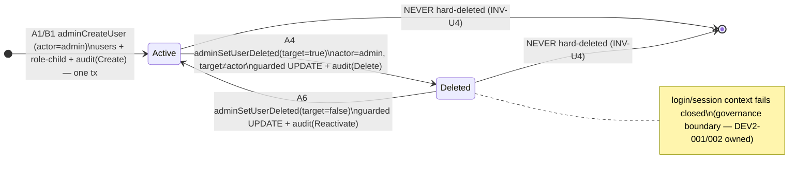

# Technical Architecture & Implementation Design: DEV3-016 — Admin CRUD: Users, Teachers, Students, Parents

> **Plan of record:** `ai/plans/sprint_3/dev3-016-admin-user-crud/`
> **Specs:** `specs.md` REQ-001..REQ-083, Journeys §2.9 (A/B/C, JR-A-1, JR-A-2, JR-B-1, JR-C-1)
> **Canonical refs:** `docs/auth/user-registration.md` (atomicity, handshake retry, 23505→ConflictError), `docs/auth/jwt-authentication-service.md` (authScopes contract, `$all` conjunction semantics, governance fail-closed context), `docs/teachers/applicant-lifecycle.md` (`authScopes: { $all: { … } }` verified pattern, `ApplicantProfileReturnType`, `isApplicantStatus`), `docs/graphql/domain-error-extensions-code.md`, `docs/graphql/error-handling-contract.md`, `docs/backend/cross-stream-contracts.md` (`AuditLogWriteContract`, composition-only rule, forbidden-field registry), `docs/specs/open-decisions-and-gaps.md` (A.1–C.5), `docs/specs/state-machine-invariants.md` (INV-U1..U5, INV-TV1, INV-B/W/PAY families), `docs/workflows/05-admin-governance-override.md`, `docs/DATABASE_MIGRATIONS.md`, `docs/IDEMPOTENCY.md`

---

## 1. System Overview & Architecture Diagram

### 1.1 Scope Statement

DEV3-016 ships the **identity-and-governance core of Workflow 05**: one admin user directory, one admin user detail surface, and three mutations (create / update / soft-delete-reactivate) with transactional audit emission. It deliberately does **not** ship plan CRUD (DEV1-005, shipped), session governance (DEV3-021), financial auditing (DEV3-022b), audit browsing (DEV3-020), cold-start certification (DEV3-018), or direct student onboarding (DEV3-019). Because `teachers`/`students`/`parents`/`applicants` are shared-PK role children of `users` (FR-1.2), "CRUD over teachers/students/parents" is realized as **role-aware projections over the one `users` directory** — no parallel per-role CRUD surface is created.

### 1.2 Write Path (create / update / setDeleted)

```
┌─────────────────────────────────────────────────────────────────────────────┐
│ CLIENT: /admin/users  (frontend/views/admin/users/* — client containers)    │
│   useMutation(adminCreateUserMutationDocument | adminUpdateUserMutation… |  │
│               adminSetUserDeletedMutationDocument)      @apollo/client/react │
└──────────────────────────────────┬──────────────────────────────────────────┘
                                   ▼
┌─────────────────────────────────────────────────────────────────────────────┐
│ GraphQL API (Pothos) — backend/graphql/mutation/admin/admin-users.mutation  │
│   authScopes: { $all: { authenticated: true, role: [UserRole.Admin] } }     │
│     • anonymous   → UnauthorizedError  → UNAUTHORIZED (401 semantics)       │
│     • non-admin   → role scope false   → FORBIDDEN (403)                    │
│   (verified DEV2-004 semantics: plain key-map = ANY-semantics — WRONG;      │
│    $all conjunction is the REQUIRED shape. Docs: applicant-lifecycle §3)    │
└──────────────────────────────────┬──────────────────────────────────────────┘
                                   ▼
┌─────────────────────────────────────────────────────────────────────────────┐
│ AdminUserManagementService (backend/services/admin/user-management.svc) NEW │
│   createUser(input, actorId, locale, outerTx?)                              │
│     withTransaction(outerTx) {                                              │
│       1. role guard (≠ admin → ADMIN_ROLE_CREATION_FORBIDDEN)               │
│       2. boundary validation (fields whitelist, pre-DB)                     │
│       3. UserRepository.create(insert, tx)        ← DEV1-002 reuse          │
│       4. role child: students(+handshake retry + trial via DEV1-004 entry)  │
│                      applicants (NEVER teacher row — B.7) / parents         │
│       5. AuditService.createAuditLog(AuditLogWriteContract, tx)             │
│       6. getUserDetail(id, locale, tx)  → RETURNING-equivalent detail       │
│     }                                                                       │
│   updateUser(id, patch, actorId, locale, outerTx?)                          │
│     tx { updateProfileFields (guarded list) → audit(update) → detail }      │
│   setUserDeleted(id, deleted, actorId, locale, outerTx?)                    │
│     tx {                                                                 │
│       self-protection (id === actorId → USER_SELF_DEACTIVATION_FORBIDDEN,   │
│                        zero writes, zero audit — JR-C-1)                    │
│       setDeletedOnce(id, target, tx)   ← guarded single UPDATE … RETURNING  │
│         0 rows → existsById probe → USER_NOT_FOUND | USER_ALREADY_DELETED / │
│                                          USER_NOT_DELETED                   │
│       audit(delete|reactivate) → detail                                     │
│     }                                                                       │
└──────────────────────────────────┬──────────────────────────────────────────┘
                                   ▼
┌─────────────────────────────────────────────────────────────────────────────┐
│ REPOSITORIES (all accept tx?: DBTransaction — optional-last)                │
│   UserRepository.create                        (EXISTING — DEV1-002 reuse)  │
│   StudentRepository.createForRegistration      (EXISTING)                   │
│   ApplicantRepository.create / ParentRepository.createForRegistration       │
│   StudentTrialService.grantFreeTrial           (DEV1-004 entry — verify)    │
│   AuditService.createAuditLog                  (EXISTING — verify name)     │
│   AdminUserRepository  (NEW — backend/db/repo/admin/)                       │
│     listDirectory(filters, offset, limit, tx?)                              │
│     countDirectory(filters, tx?)                                            │
│     findDetailById(id, tx?)                                                 │
│     updateProfileFields(id, whitelistedPatch, tx?)                          │
│     setDeletedOnce(id, target, tx?)      ← null-safe guarded UPDATE         │
│     existsById(id, tx?)                                                   │
└──────────────────────────────────┬──────────────────────────────────────────┘
                                   ▼
┌─────────────────────────────────────────────────────────────────────────────┐
│ PostgreSQL — ZERO schema drift (REQ-022/044). All required tables/columns   │
│ pre-exist: users(+A.7 governance), admin, teacher, applicants, students,    │
│ parents, subscriptions, audit_logs(+A.5).                                   │
└─────────────────────────────────────────────────────────────────────────────┘
```

### 1.3 Read Path (directory + detail)

```
adminUsers(filters, page, pageSize)                       adminUserDetail(id)
  authScopes $all{authenticated, role:[Admin]}              authScopes $all{…Admin}
  → boundary validation (enums/page bounds/ID guard)        → ID guard (positive safe int, pre-DB)
  → AdminUserRepository.listDirectory:                      → findDetailById:
      FROM users                                             users ⋈ applicants? ⋈ teacher?
        LEFT JOIN applicants/teacher/students (share-PK)      ⋈ students? ⋈ parents?
        + scalar subselects:                                  + linkedChildrenCount (count subquery)
          linkedChildrenCount                                 + hasActiveSubscription (exists…)
          hasActiveSubscription                             → role-child snapshot assembly
        WHERE <ANDed filters incl. escaped ilike>               (isApplicantStatus fail-closed)
        ORDER BY created_at ASC, id ASC                       → ⊘ row → USER_NOT_FOUND
        LIMIT/OFFSET                                        (oracle ruling: admin surface —
      + countDirectory (same WHERE, no joins)                 NOT_FOUND not FORBIDDEN, DEV1-005)
```

### 1.4 Key Design Decisions Table

| # | Decision | Options Considered | Pros / Cons | Rationale (Maintainability, Scalability, Reliability) |
|---|---|---|---|---|
| D1 | **Scope = identity core only**: no plan/session/financial/audit-browsing/parent-link/cold-start surfaces | (a) full Workflow-05 build in one ticket; (b) identity core only | (a) Cons: 30+ SP, unreviewable, collides with DEV3-017..022b ownership. (b) Pros: satisfies Sprint-3 dependency graph, ships the substrate every later ticket imports. | The specs §1 scope ruling + TICKETS/SPRINT_PLAN dependency graph. Non-goals are contractual, verified by static scans (REQ-021/075). |
| D2 | **One `users` directory with role-child projections via LEFT JOINs + scalar subselects** (single round trip) | (a) per-role separate queries/tabs; (b) one joined query; (c) DataLoader fan-out | (a) Cons: four surfaces to secure/test; paging across role tabs is incoherent. (b) Pros: one permission boundary, one page order, M:N fan-out avoided by scalar subqueries (counts/exists never join-multiply). (c) Cons: list latency dominated by one query anyway; DataLoader solves N+1 per-parent resolution that doesn't exist here (REQ-060 note; docs/graphql/dataloader-batching.md forward contract). | FR-10.1 "directory of all users"; projections are 1:1 shared-PK joins. Deterministic single-query plan is trivially EXPLAIN-able (PROD-READINESS 6.4). |
| D3 | **Soft-delete/reactivate via single guarded conditional `UPDATE … WHERE id=? AND <null-safe inverse-state guard> … RETURNING *`; empty result → cold-path `existsById` probe → USER_NOT_FOUND vs typed CONFLICT** | (a) SELECT-then-UPDATE; (b) advisory lock; (c) guarded UPDATE | (a) TOCTOU — two concurrent deletes both read `false` and both "succeed" (REQ-043a violated). (b) serialization without need. (c) predicate evaluated under PostgreSQL row lock ⇒ race window = 0; loser gets typed conflict. | DEV1-004 (`grantFreeTrialOnce`) + DEV1-005 (`setActiveStatusOnce`) proven precedent, reused verbatim in spirit (REQ-017/018/040/041). |
| D4 | **Null-safe state guards**: delete guard = `is_deleted = false OR is_deleted IS NULL`; reactivate guard = `is_deleted = true` | (a) naive `= <bool>`; (b) null-aware predicate | (a) `NULL IS NOT FALSE` in SQL — a legacy NULL row would be un-deletable forever (silent bug). (b) correct under the nullable-with-default column shape (DEV1-001). | `$inferSelect` yields `boolean \| null` for the governance columns; guards must respect three-valued logic. Test-locked by REQ-074 (fixture inserted with explicit NULL proves guard). |
| D5 | **Creation composes DEV1-002 primitives** (`UserRepository.create`, role-child repos, handshake retry, 23505→ConflictError cause-chain) inside `withTransaction(outerTx)`; trial grant via DEV1-004's single provisioning entry point WHEN present | (a) fork an admin-specific registration pipeline; (b) compose existing | (a) two registration truths → INV-U/B invariants diverge. (b) one atomicity pattern, one handshake algorithm, one duplicate-email translation. | REQ-014/040 + `docs/auth/user-registration.md` §3. If DEV1-004's entry point is absent, the trial grant registers as a ❌/targeted deferred dependency (REQ-004), never re-implemented. |
| D6 | **Admin-role creation blocked twice**: `RegisterPublicRole` input enum structurally excludes admin (schema layer), and the service re-guards (`ADMIN_ROLE_CREATION_FORBIDDEN`) for transport tamper | (a) enum only; (b) service only; (c) both | (a) fails hand-crafted HTTP bodies bypassing schema validation. (b) fails future schema drift. (c) defense in depth. | REQ-015 + DEV1-002 §5 BFLA layering precedent. The service-only `createAdminUser` path stays unwired to GraphQL (grep-proven). |
| D7 | **Every successful mutation appends exactly one `audit_logs` row INSIDE the same tx, composed via `AuditLogWriteContract`; denials write ZERO audit rows** | (a) post-commit audit side effect; (b) in-tx via contract; (c) audit on denials too | (a) Cons: crash between write and audit loses the trail. (b) Pros: audit and mutation share fate (commit or roll back together); contract composition-only rule satisfies DEV2-003 governance. (c) Cons: denial noise pollutes the append-only trail; JR-C-1 forbids it. | A.5 + FR-10.5 + contract §5 actor discipline (`actorId` from `ctx.user.id` always). Rollback test proves zero residual rows in all three tables on failure (REQ-040). |
| D8 | **Page-based pagination, bounded (`page ≥ 1`, `pageSize ∈ 1..100`, default 25), stable order `(created_at ASC, id ASC)`** | (a) keyset/cursor; (b) offset page-based | (a) Pros: drift-proof under concurrent inserts. Cons: complexity unjustified for a sparse admin directory (dozens–hundreds). (b) Pros: simple, honest `totalCount`, empty-page (not error, not clamped) on overflow per REQ-012. | REQ-012/046; keyset recorded as a documented future refinement, not shipped (documented in canonical doc). |
| D9 | **Directory search: `escapeLikeWildcards` + parameterized `ilike` on `fullName`/`email`; filters ANDed; unknown/empty filters drop to unfiltered; malformed enums/pagination fail VALIDATION pre-DB** | (a) raw pattern interpolation; (b) escaped + parameterized | (a) wildcard injection lets `%` enumerate everything regardless of intent. (b) literal-match semantics provable by fuzz (REQ-034/072/075). | Only injection-sensitive input surface in the ticket — the canonical doc mandates the same for any future admin search. |
| D10 | **`authScopes: { $all: { authenticated: true, role: [UserRole.Admin] } }` on ALL five operations** | (a) plain `{ authenticated, role }` map; (b) `$all`; (c) `superAdmin: true` | (a) WRONG: Pothos scope-auth combines one map's keys with ANY semantics — any authenticated caller passes `authenticated` alone (verified in DEV2-004). (b) correct conjunction: anonymous → 401 via thrown `UnauthorizedError`; authed non-admin → 403. (c) equivalent outcome here but conflates axes (jwt-authentication-service §3.3); role-axis chosen for dev-annotation clarity & future group decoupling. | REQ-030/062 + `docs/teachers/applicant-lifecycle.md` §3 verified semantics. |
| D11 | **Missing/unknown user id on admin surfaces → `USER_NOT_FOUND`, NOT `FORBIDDEN`** | (a) FORBIDDEN; (b) NOT_FOUND | (a) wrongly implies the id exists but is off-limits — an oracle-ish lie and wrong semantics. (b) Admin is the full-governance actor; user existence is non-sensitive to him (DEV1-005 REQ-032 ruling). | REQ-013/032. Canonical doc carries the warning: this ruling MUST NOT be copy-pasted to non-admin surfaces. |
| D12 | **Journey tests at `test/workflows/` tier** (real services, real DB, committed fixtures, hard-delete teardown, NO runInRollback, actor-attributed steps) | (a) GraphQL e2e only; (b) runInRollback integration only; (c) locked workflow tier | (a) spikes HTTP noise, misses actor-attribution assertions. (b) services spawn own transactions; rollback wrapper deadlocks/false-passes. (c) matches specs §2.9 1:1 and REQ-078 rules. | Cross-actor journey invariant (Section 4.5 → assertion set). Scaffold `test/workflows/` if absent (helpers + AGENTS.md). |

---

## 2. Data Models & Database Schema

### 2.1 Existing Schema Verification (READ-ONLY — zero drift, REQ-022/044)

All structures pre-exist. `git diff -- backend/db/schema/** backend/db/migration/**` MUST be empty at completion. The Drizzle schema in `backend/db/schema/` is the sole structural ground truth.

| Contract dependency | Existing implementation | Verified at |
|---|---|---|
| `users` base + governance (A.7) | `id` identity PK; `fullName`, `email` (unique, 23505), `phone`, `passwordHash`, `role user_role`, `dateOfBirth`, `gender`, `country`, `isDeleted`/`deletedAt`/`suspended`/`suspendedAt`/`suspendedPeriodDays`/`isBlocked`/`blockedAt`, `lastActiveAt`, timestamps | `backend/db/schema/users/users.ts` |
| `user_role` enum | `["admin","teacher","student","parent"]` (C.1) | `backend/db/schema/enums.ts` |
| Shared-PK role children | `admin`, `teacher` (`is_approved`, `is_evaluator`, `is_online`, `average_rating`, `subjects`, `request_preference`), `students` (balances, `handshake_code` unique, `parent_id`, languages), `parents`, `applicants` (`verification_attempts`, `last_attempt_at`, `cooldown_until`, `status varchar(50)`) | `backend/db/schema/{users,teachers,students,parents}/*` |
| Subscription headline source | `subscriptions.user_id`/`plan_id`, `status subscription_status`, `start_date`, `end_date` | `backend/db/schema/billing/subscriptions.ts` |
| Audit append-only target (A.5) | `audit_logs` (`actorId`, `actionType audit_action_type`, `entityType`, `entityId`, `details varchar(2000)`, `createdAt`) | `backend/db/schema/audit/audit-logs.ts` |
| DEV1-004 trial lane (conditional) | `students.balance_trial`, `trial_granted_at` + CHECK | `backend/db/schema/students/students.ts` (verify presence; else deferred-dependency note per REQ-004) |

**Prohibited by construction:** no new tables/columns/enums; no `bun run db push`; no custom SQL in `backend/db/migration/`; `db reset`/`cleanGenerate` remain permanently disabled (`docs/DATABASE_MIGRATIONS.md`).

### 2.2 Canonical Types — NEW sub-directory `backend/types/admin/`

New `backend/types/admin/admin-user.types.ts` + `backend/types/admin/index.ts` (`export * from "./admin-user.types"`) + one barrel line in `backend/types/index.ts` (`export * from "./admin";`). No service-layer `.types.ts`; no Pothos-local types (CRITICAL rules).

```typescript
import type { ApplicantProfileReturnType } from "@/backend/types/teachers/applicant.types";
import type { Gender } from "@/backend/enum/users/gender.enum";
import type { UserRole } from "@/backend/enum/users/user-role.enum";
import type { RegisterPublicRole } from "@/backend/types/users/registration.types";
import type { UserSelectType } from "@/backend/types/users/user.types";

/** passwordHash NEVER appears on any projection (DEV2-003 forbidden-field registry). */
export type AdminUserSafeSelect = Omit<UserSelectType, "passwordHash">;

/** Directory row — one users row + role-child headline projection (REQ-010). */
export interface AdminUserListItemReturnType {
  readonly id: number;
  readonly fullName: string;
  readonly email: string;
  readonly phone: string | null;
  readonly role: UserRole;                        // fail-closed via toUserRole at map time
  readonly country: string | null;
  readonly isDeleted: boolean;                    // null-coalesced from nullable column
  readonly suspended: boolean;
  readonly isBlocked: boolean;
  readonly lastActiveAt: Date | null;
  readonly createdAt: Date;
  // teacher-role headline (null unless/else):
  readonly applicantStatus: ApplicantProfileReturnType["status"] | null; // via isApplicantStatus
  readonly teacherIsApproved: boolean | null;
  readonly teacherIsEvaluator: boolean | null;
  // student-role headline:
  readonly studentHasParentLink: boolean | null;
  readonly studentHasActiveSubscription: boolean | null;  // exists(active) subquery
  // parent-role headline:
  readonly parentLinkedChildrenCount: number | null;
}

export interface AdminUserPageReturnType {
  readonly items: AdminUserListItemReturnType[];
  readonly totalCount: number;
  readonly page: number;
  readonly pageSize: number;
}

export interface AdminTeacherSnapshotReturnType {
  readonly isApproved: boolean;
  readonly isEvaluator: boolean;
  readonly isOnline: boolean;
  readonly averageRating: string | null;          // decimal(3,2) inferred as string
}
export interface AdminStudentSnapshotReturnType {
  readonly handshakeCode: string;
  readonly parentId: number | null;
  readonly primaryLanguage: string | null;
  readonly anotherLanguage: string | null;
  readonly hasParentLink: boolean;
  readonly hasActiveSubscription: boolean;
  readonly balanceHifz: number | null;
  readonly balanceTajweed: number | null;
  readonly balanceReviews: number | null;
  readonly balanceTrial: number | null;           // present iff DEV1-004 lane landed
  readonly trialGrantedAt: Date | null;
}
export interface AdminParentSnapshotReturnType {
  readonly linkedChildrenCount: number;
}

export interface AdminUserDetailReturnType extends AdminUserSafeSelect {
  readonly applicant: ApplicantProfileReturnType | null;    // DEV2-004 canonical reuse
  readonly teacher: AdminTeacherSnapshotReturnType | null;
  readonly student: AdminStudentSnapshotReturnType | null;
  readonly parent: AdminParentSnapshotReturnType | null;
}

/** Create input whitelist (BOPLA). Server-controlled fields structurally absent. */
export interface AdminCreateUserSubmitInput {
  readonly fullName: string;
  readonly email: string;
  readonly phone: string;
  readonly password: string;
  readonly gender?: Gender;
  readonly country: string;
  readonly role: RegisterPublicRole;              // 'student' | 'teacher' | 'parent' — never 'admin'
}

/** Update patch whitelist — EXACTLY these five keys (REQ-016). */
export interface AdminUpdateUserPatchInput {
  readonly fullName?: string;
  readonly phone?: string;
  readonly country?: string;
  readonly gender?: Gender;
  readonly dateOfBirth?: Date;
}

/** Filter input (REQ-011). Empty/absent members drop out — never error. */
export interface AdminUserFiltersSubmitInput {
  readonly role?: UserRole | null;
  readonly governance?: AdminUserGovernanceFilter | null;
  readonly country?: string | null;
  readonly search?: string | null;
}

/** Repo-internal whitelisted patch shape for the guarded profile update. */
export type AdminUserUpdateDbPatch = Partial<Pick<
  UserSelectType, "fullName" | "phone" | "country" | "gender" | "dateOfBirth"
>>;
```

### 2.3 Enums — NEW filter enum + verify-first registrations

**New TS enum** (the ONLY new enum in this ticket — vocabulary for a filter, not DB state):

```typescript
// backend/enum/users/admin-user-governance-filter.enum.ts (NEW)
export enum AdminUserGovernanceFilter {
  Active = "active",
  Suspended = "suspended",
  Blocked = "blocked",
  Deleted = "deleted",
}
export function isAdminUserGovernanceFilter(v: unknown): v is AdminUserGovernanceFilter {
  return typeof v === "string" &&
    (Object.values(AdminUserGovernanceFilter) as string[]).includes(v);
}
```

Barrels: `backend/enum/users/index.ts` += `export * from "./admin-user-governance-filter.enum";` (top-level barrel `backend/enum/index.ts` already re-exports `./users`).

**Pothos registrations** (`backend/graphql/pothos/shared/enum.pothos.ts`), all verify-first against existing registrations (re-registration is a runtime error — CRITICAL rule):

| Enum | Action |
|---|---|
| `AdminUserGovernance` ← `AdminUserGovernanceFilter` | NEW registration, enum-object form |
| `UserRole` / `RegisterPublicRole` / `Gender` / `ApplicantStatus` | verify existing registration; register the missing ones via enum-object form ONLY if absent |

### 2.4 i18n Additions

**(a) `errors` namespace — new `adminUsers` grouping (REQ-051):**

| File | Change |
|---|---|
| `shared/locale/types/errors/index.ts` | `adminUsers: { userNotFound: string; userAlreadyDeleted: string; userNotDeleted: string; userSelfDeactivationForbidden: string; adminRoleCreationForbidden: string; userPatchEmpty: string; }` (interface only) |
| `shared/locale/en/errors/index.ts` | English implementations |
| `shared/locale/ar/errors/index.ts` | Arabic implementations (natural RTL phrasing) |

Reuse (NEVER near-duplicate): `emailAlreadyExists` (auth), `validation`, `notFound`, `forbidden`, `internalServerError` from existing `errors` keys. Compile-time `MessageSchema` parity is the gate (missing key = `tsgo` failure).

**(b) NEW `adminUsers` UI namespace (REQ-066)** — full registration procedure per `shared/locale/AGENTS.md`: `types/` interface + `en` + `ar` implementations + `MessageSchema` entry + namespace-path registration + `LocaleProvider` wiring if SSR-consumed. Keys cover: page title, table headers (name/email/role/country/status/lastActive/createdAt), status badge labels (Active/Suspended/Blocked/Deleted), role labels (via existing role labels if present), filter labels (role/governance/country/search), empty state, error state, create dialog (field labels, submit/cancel), edit dialog, delete/reactivate confirm copy + consequences text, detail sections (profile/governance/applicant/teacher/student/parent), "yes/no" shared extras, self-protection error surfacing.

---

## 3. API Contracts & Pothos Resolvers

### 3.1 GraphQL Schema Additions (exact surface, REQ-060)

```graphql
enum AdminUserGovernance { ACTIVE SUSPENDED BLOCKED DELETED }

input AdminUserFiltersInput {
  role: UserRole
  governance: AdminUserGovernance
  country: String
  search: String
}

type AdminUserListItem {
  id: ID!
  fullName: String!
  email: String!
  phone: String
  role: UserRole!
  country: String
  isDeleted: Boolean!
  suspended: Boolean!
  isBlocked: Boolean!
  lastActiveAt: DateTime
  createdAt: DateTime!
  applicantStatus: ApplicantStatus
  teacherIsApproved: Boolean
  teacherIsEvaluator: Boolean
  studentHasParentLink: Boolean
  studentHasActiveSubscription: Boolean
  parentLinkedChildrenCount: Int
}

type AdminUserPage {
  items: [AdminUserListItem!]!
  totalCount: Int!
  page: Int!
  pageSize: Int!
}

type AdminTeacherSnapshot { isApproved: Boolean!; isEvaluator: Boolean!; isOnline: Boolean!; averageRating: String }
type AdminStudentSnapshot {
  handshakeCode: String!; parentId: ID; primaryLanguage: String; anotherLanguage: String;
  hasParentLink: Boolean!; hasActiveSubscription: Boolean!;
  balanceHifz: Int; balanceTajweed: Int; balanceReviews: Int; balanceTrial: Int;
  trialGrantedAt: DateTime
}
type AdminParentSnapshot { linkedChildrenCount: Int! }

type AdminUserDetail {
  id: ID!                        # FIRST — Apollo cache normalization (CRITICAL)
  fullName: String!; email: String!; phone: String
  role: UserRole!
  dateOfBirth: DateTime; gender: Gender; country: String
  isDeleted: Boolean!; deletedAt: DateTime
  suspended: Boolean!; suspendedAt: DateTime; suspendedPeriodDays: Int
  isBlocked: Boolean!; blockedAt: DateTime
  lastActiveAt: DateTime; createdAt: DateTime!; updatedAt: DateTime!
  applicant: ApplicantProfile    # DEV2-004 object reuse — no ApplicantDetail re-declaration
  teacher: AdminTeacherSnapshot
  student: AdminStudentSnapshot
  parent: AdminParentSnapshot
}

input AdminCreateUserInput {
  fullName: String!; email: String!; phone: String!; password: String!
  gender: Gender; country: String!; role: RegisterPublicRole!   # admin structurally excluded
}
input AdminUpdateUserInput { fullName: String; phone: String; country: String; gender: Gender; dateOfBirth: DateTime }

extend type Query {
  adminUsers(filters: AdminUserFiltersInput, page: Int = 1, pageSize: Int = 25): AdminUserPage!
  adminUserDetail(id: ID!): AdminUserDetail!
}
extend type Mutation {
  adminCreateUser(input: AdminCreateUserInput!): AdminUserDetail!
  adminUpdateUser(id: ID!, input: AdminUpdateUserInput!): AdminUserDetail!
  adminSetUserDeleted(id: ID!, deleted: Boolean!): AdminUserDetail!
}
```

### 3.2 Pothos Definition Details

| Concern | Contract |
|---|---|
| Object files | `backend/graphql/pothos/admin/index.ts` (NEW barrel) + `admin-user.pothos.ts`. Single canonical objects backed by canonical types: `objectRef<AdminUserDetailReturnType>("AdminUserDetail")`, `objectRef<AdminUserListItemReturnType>("AdminUserListItem")`, `objectRef<AdminUserPageReturnType>("AdminUserPage")`, snapshot objects backed by their `backend/types/admin/` types. NO local type definitions. |
| Query/mutation files | `backend/graphql/query/admin/admin-users.query.ts` (2 queries) + `backend/graphql/mutation/admin/admin-users.mutation.ts` (3 mutations) + barrels per gateway registration contract (`docs/graphql/api-gateway-and-routing.md` Rule 8 — side-effect imports, NO `await import` — gate A1). |
| Resolver discipline | Thin bodies only: ID arg → positive-safe-integer guard (no `as number`) → `UserRole` value import for scope typing → `AdminUserManagementService.<m>(…, ctx.user.id, ctx.locale)` → return. Resolvers throw NOTHING directly; service DomainErrors propagate `extensions.code` per `docs/graphql/domain-error-extensions-code.md` and are masked at the shared boundary. `ctx.locale` propagation mandatory. |
| authScopes (EXACT) | `{ $all: { authenticated: true, role: [UserRole.Admin] } }` on ALL five operations (D10). Anonymous → `UNAUTHORIZED`; authenticated non-admin → `FORBIDDEN`. |
| Rate limiting | Inherits platform posture unchanged (REQ-036); no new public surface; no limiter additions. |
| Public allowlist | `backend/lib/gateway/public-operations.ts` UNTOUCHED — the 1:1 allowlist-coverage gate must stay green (REQ-062). |
| No-delete-surface gate | Post-codegen grep assertions on generated `schema.graphql`: NO `deleteUser`/`hardDelete*`/`suspendUser`/`blockUser` operations (hard delete + suspend/block governance windows are structurally absent — REQ-021, INV-U4, DEV3-017 ownership). |
| Codegen | `bun run generate:gqlSchema && bun codegen`; generated artifacts committed in the same change set (REQ-061). |
| ROAD/route inventory | NO new `app/api/**` route — all traffic flows through `/api/graphql`; `ROUTE_INVENTORY` unchanged (A4 gate stays green). |

### 3.3 Error → `extensions.code` Map (REQ-050)

| Condition | Class | Code |
|---|---|---|
| Anonymous | scopeAuth `UnauthorizedError` | `UNAUTHORIZED` |
| Authenticated non-admin | role scope `false` | `FORBIDDEN` |
| Unknown id (detail/update/delete/reactivate) | `NotFoundError("USER", …)` | `USER_NOT_FOUND` (entity name, never full code — double-suffix rule) |
| Empty/invalid patch, bad id shape, bad enum, out-of-range pagination | `ValidationError` (+ `extensions.fields[]` where field-mappable) | `VALIDATION` / custom code |
| Delete already-deleted / Reactivate active | `ConflictError` | `USER_ALREADY_DELETED` / `USER_NOT_DELETED` |
| Self-deletion attempt | `ConflictError` (pre-write, no audit) | `USER_SELF_DEACTIVATION_FORBIDDEN` |
| Create with `role=admin` (tampered) | `ValidationError` custom code | `ADMIN_ROLE_CREATION_FORBIDDEN` |
| Duplicate email at create | cause-chain 23505 → `ConflictError` | `CONFLICT` (`emailAlreadyExists` key) |
| Unexpected driver failure | boundary-masked | `INTERNAL_SERVER_ERROR` |

### 3.4 Permission Matrix (REQ-030, REQ-064)

| Operation | Anonymous | Student | Parent | Teacher (applicant or certified) | Super Admin |
|---|---|---|---|---|---|
| `adminUsers` | `UNAUTHORIZED` | `FORBIDDEN` | `FORBIDDEN` | `FORBIDDEN` | ✅ |
| `adminUserDetail` | `UNAUTHORIZED` | `FORBIDDEN` | `FORBIDDEN` | `FORBIDDEN` | ✅ |
| `adminCreateUser` (student/teacher/parent roles) | `UNAUTHORIZED` | `FORBIDDEN` | `FORBIDDEN` | `FORBIDDEN` | ✅ |
| `adminCreateUser` with tampered `role=admin` | `UNAUTHORIZED` | `FORBIDDEN` | `FORBIDDEN` | `FORBIDDEN` | `ADMIN_ROLE_CREATION_FORBIDDEN` |
| `adminUpdateUser` | `UNAUTHORIZED` | `FORBIDDEN` | `FORBIDDEN` | `FORBIDDEN` | ✅ (whitelist only) |
| `adminSetUserDeleted` (target = other) | `UNAUTHORIZED` | `FORBIDDEN` | `FORBIDDEN` | `FORBIDDEN` | ✅ |
| `adminSetUserDeleted` (target = self) | `UNAUTHORIZED` | — | — | — | `USER_SELF_DEACTIVATION_FORBIDDEN`, zero writes, zero audit |
| `/admin/users`, `/admin/users/[id]` (SSR) | redirect `/login?redirect=…` | redirect `/dashboard` | redirect `/dashboard` | redirect `/dashboard` | ✅ renders |

---

## 4. Backend Services, Repositories & Concurrency Model

### 4.1 Service — `backend/services/admin/user-management.service.ts` (NEW) + barrel

```typescript
export namespace AdminUserManagementService {
  listDirectory(
    filters: AdminUserFiltersSubmitInput, page: number, pageSize: number,
    locale: string, tx?: DBTransaction
  ): Promise<AdminUserPageReturnType>;

  getUserDetail(userId: number, locale: string, tx?: DBTransaction): Promise<AdminUserDetailReturnType>;

  createUser(
    input: AdminCreateUserSubmitInput, actorId: number, locale: string, outerTx?: DBTransaction
  ): Promise<AdminUserDetailReturnType>;

  updateUser(
    id: number, patch: AdminUpdateUserPatchInput, actorId: number, locale: string, outerTx?: DBTransaction
  ): Promise<AdminUserDetailReturnType>;

  setUserDeleted(
    id: number, deleted: boolean, actorId: number, locale: string, outerTx?: DBTransaction
  ): Promise<AdminUserDetailReturnType>;
}
```

Method contracts:

- **`listDirectory`** — validate pagination bounds pre-DB (`VALIDATION` on breach); drop empty/unknown filter members silently (REQ-011); escape `search` via `escapeLikeWildcards` then wrap as `%…%` parameterized `ilike` across `fullName`/`email` (REQ-034); call `listDirectory` + `countDirectory`; out-of-range page → empty `items` + honest `totalCount` (REQ-012); projection mapping null-coalesces governance booleans (`?? false`) and fail-closes stored applicant status through `isApplicantStatus` (corrupt value → `ValidationError("APPLICANT_STATUS_CORRUPT"…)` — reuse DEV2-004 key/behavior where present; otherwise the directory path documents the reuse and the DEV2-004 error code/key is imported, NEVER re-invented).
- **`getUserDetail`** — ID already validated by resolver guard is re-asserted defensively (pure, cheap); `⊘ row` → `NotFoundError("USER", tErrors.adminUsers.userNotFound)`; assemble role-child snapshots in the same tx (null per absent child table row). Student snapshot queries `subscriptions` for `status='active'` existence only (REQ-010 headline semantics; balances are pure reads).
- **`createUser`** — order: role pre-guard (`input.role` admin → `ADMIN_ROLE_CREATION_FORBIDDEN`); field validation (name/phone/country bounds, email shape — reuse DEV1-002 validator helpers if exported, else local module-scope helpers); password hashing via the existing auth password helper; then `withTransaction(outerTx)`: `UserRepository.create` → role child create (`StudentRepository.createForRegistration` incl. its handshake collision retry per `docs/auth/user-registration.md` §2; `ApplicantRepository.create` ONLY for teacher — **never** a `teacher` row (B.7/INV-TV1); `ParentRepository.createForRegistration`) → trial grant via `StudentTrialService.grantFreeTrial(userId, locale, tx)` **iff** the DEV1-004 entry point exists (else record the gap in `deferred-items.md` targeting DEV1-004 contract — REQ-014's conditional path) → `AuditService.createAuditLog({ actorId, actionType: AuditActionType.Create, entityType: "user", entityId: newId, details: <PII-minimal JSON ≤2000 chars> }, tx)` → return `getUserDetail(newId, locale, tx)`. 23505 on email → existing cause-chain traversal → `ConflictError(tErrors.auth.emailAlreadyExists)`.
- **`updateUser`** — pre-DB: reject empty patch (`VALIDATION` + `userPatchEmpty`); validate each supplied field; build `AdminUserUpdateDbPatch` **key-by-key** (no `{ ...input }` anywhere — grep-gate); tx: `updateProfileFields(id, patch + server `updatedAt`, tx)` → `null` row → `USER_NOT_FOUND`; audit `Update` with `details = {"changedFields": [...]}` (field NAMES only — never values for contact-PII classes, REQ-052); return detail. Runtime re-verification: the patch type structurally omits `role`/`email`/`passwordHash`/governance columns; a static assertion additionally proves the service file literally cannot reference them in a `.set()` (REQ-015 BFLA defense-in-depth).
- **`setUserDeleted`** — tx: self-protection check FIRST (`id === actorId` → `ConflictError(USER_SELF_DEACTIVATION_FORBIDDEN)`, zero writes — JR-C-1/REQ-019 guard position is load-bearing for the no-audit-on-denial rule); guarded `setDeletedOnce(id, deleted, tx)` → null → `existsById` probe: `false` → `USER_NOT_FOUND`; `true` → `USER_ALREADY_DELETED` or `USER_NOT_DELETED` (per target); success → audit (`Delete` | `Reactivate`) → `getUserDetail`.
- **Logging discipline (REQ-052/053)** — expected rejections via `logger.logDomainError` with `{ code, entity: "user", entityId }` (ids + codes only — no PII payloads, no emails); unexpected → `logger.error`; **never `console.*`**. Audit `details` JSON is production-capped to ≤ 2000 chars with safe truncation that NEVER fails the mutation (the varchar(2000) column ceiling).

### 4.2 Repository — `backend/db/repo/admin/admin-user.repository.ts` (NEW) + barrels

All methods `tx?: DBTransaction` optional-last; read paths use the `queryDb(tx)` pattern per `backend/db/repo/AGENTS.md` / `docs/drizzle/neon-http-client.md`. NO prepared statements with `inArray` (none used; filters are scalar AND chains). Writes are never prepared-statement candidates (`docs/drizzle/prepared-statements.md`).

```typescript
export namespace AdminUserRepository {
  listDirectory(filters: NormalizedAdminUserFilters, limit: number, offset: number, tx?: DBTransaction)
    : Promise<AdminUserDirectoryRow[]>;
  countDirectory(filters: NormalizedAdminUserFilters, tx?: DBTransaction): Promise<number>;
  findDetailById(id: number, tx?: DBTransaction): Promise<AdminUserDetailRow | null>;
  updateProfileFields(id: number, patch: AdminUserUpdateDbPatch, tx?: DBTransaction)
    : Promise<AdminUserSafeSelect | null>;          // .set({...patch, updatedAt}) // whitelisted patch only
  setDeletedOnce(id: number, target: boolean, tx?: DBTransaction)
    : Promise<AdminUserSafeSelect | null>;          // guarded, null-safe (D4), RETURNING
  existsById(id: number, tx?: DBTransaction): Promise<boolean>;
}
```

- **`listDirectory`** — single query: `FROM users LEFT JOIN applicants (id) LEFT JOIN teacher (id) LEFT JOIN students (id)`, PLUS scalar subselects for `parentLinkedChildrenCount` (`(SELECT count(*)::int FROM students s WHERE s.parent_id = users.id)`) and `studentHasActiveSubscription` (`EXISTS(SELECT 1 FROM subscriptions sub WHERE sub.user_id = users.id AND sub.status = 'active' AND now() >= coalesce(sub.start_date, now()) AND (sub.end_date IS NULL OR now() < sub.end_date))`). `WHERE` = ANDed filter chain; `ORDER BY created_at ASC, id ASC`; `LIMIT/OFFSET`. Scalar subselects prevent 1:M row fan-out; no `t.loadable()` (list fields rule).
- **`findDetailById`** — same projection minus list-only columns, single-row. (Application-level snapshot assembly in the service keeps the repository shape flat and typed.)
- **`setDeletedOnce`** — the guarded statement (no inline `--` comments in ANY `sql` template; fully Drizzle-parameterized):

```typescript
.where(
  and(
    eq(users.id, id),
    target
      ? or(eq(users.isDeleted, false), isNull(users.isDeleted))   // null-safe guard (D4)
      : eq(users.isDeleted, true)
  )
)
.set({ isDeleted: target, deletedAt: target ? new Date() : null, updatedAt: new Date() })
.returning();
```

- Repository content rules: no business logic, no permission checks, no localized strings, no logging beyond what repo conventions allow.

### 4.3 Concurrency & Race Condition Assessment

| Scenario | Actors | Risk | Mitigation |
|---|---|---|---|
| Double soft-delete | 2 admin mutations | duplicate transition attempts | Guarded UPDATE row-locks; loser empty-matches → probe → `USER_ALREADY_DELETED` (REQ-043a; `Promise.allSettled` proof — exactly one success + one conflict, final state flipped once). |
| Delete ⚡ Reactivate | 2 admins | divergent state | Single-statement guards serialize; winner's outcome is the final state; loser gets typed conflict (REQ-043b). |
| Concurrent profile patches | 2 admins | divergent final row | Last-write-wins per documented ruling (low-frequency admin surface; no version column — recorded, REQ-043c). No partial patch applies — each is one statement in its own tx. |
| Double-create same email (double-click / retry storm) | admin + client UI | duplicate account | `users.email` unique 23505 → `ConflictError` via cause-chain traversal; UI also disables submit in-flight (REQ-043d, REQ-065; `docs/IDEMPOTENCY.md` scope analysis: admin user creation is OUTSIDE the mandated key set — Student/Invoice/Class/Payment, ruling documented in canonical doc). |
| Forced failure mid-create (child insert or audit fails) | service tx | residual partial account | One Drizzle tx discards users+child+audit atomically; `runInRollback`-style forced-failure test asserts zero residual rows (REQ-040/043e). |
| Directory scan pagination drift (rows inserted mid-pagination) | admin readers + admin writer | duplicate/gap across pages | Mitigated to "static-anchor" level by `(created_at ASC, id ASC)` stable order (REQ-046); full immunity requires keyset — documented future refinement. |
| TOCTOU on existence probe after guard miss | post-guard probe | NotFound-vs-Conflict misclassification | Users are never hard-deleted (INV-U4) — probe classification is stable (D3/DEV1-005 D3 argument); NULL-boolean edge closed by D4. |
| Corrupt stored `applicants.status` (out-of-band write) | ops script | renderer crash/loose typing | `isApplicantStatus` fail-closed in service mapping (D2/REQ-002; DEV2-004 contract). |

**Locking summary:** NO `SELECT FOR UPDATE`, NO advisory locks, NO Redis — every mutable-state touch is a single guarded statement or a fresh row inside one tx. **TOCTOU window = 0** on all writes (predicate + mutation share the statement). **No module-level mutable state** anywhere in the new modules (REQ-045; static scan asserts zero module-level `Map`/`Set`/`[]` state).

### 4.4 Cross-Actor Journey Design (MANDATORY — specs §2.9)

**Shared-entity state machine (the `users` governance lane this ticket owns and projects):**



| Transition guard | Driving actor & permission |
|---|---|
| `[*] → Active` | Super Admin only (`$all{authenticated, role:[Admin]}`); role ∈ {student, teacher, parent} |
| `Active → Deleted` | Super Admin; target ≠ actor (self-protection); current state not-deleted (incl. NULL) |
| `Deleted → Active` | Super Admin; current state deleted=true |
| any → suspend/block | **NOT this ticket** (DEV3-017) — no surface exists |

**Side-effect matrix per journey step (assertion set):**

| Journey step | Actor → action | Rows created/updated (atomic tx) | Audit row | Notifications dispatched | Post-state |
|---|---|---|---|---|---|
| A1 | admin → `adminCreateUser(role=student)` | `users` +1; `students` +1 (zeroed balances, unique handshake; trial via DEV1-004 entry iff landed) | exactly one, `Create`, actorId=admin | **none** | Active student; directory-visible |
| A2 | admin → `adminUsers(role=student)` | none | none | none | new row observable, projection correct |
| A3 | student → `login` (existing flow) | none | none | none | login SUCCEEDS (governance clean) |
| A4 | admin → `adminSetUserDeleted(id, true)` | `users.is_deleted=true`, `deleted_at=now`, `updated_at=now` | `Delete` | none | login now fails |
| A5 | student → `login` | none | none | none | DENIED at governance gate (localized `FORBIDDEN`-family) |
| A6 | admin → `adminSetUserDeleted(id, false)` | `is_deleted=false`, `deleted_at=NULL` | `Reactivate` | none | login restored |
| A7 | admin → `adminSetUserDeleted(ownId, true)` | **ZERO writes** | **ZERO rows (JR-C-1)** | none | unchanged, typed conflict returned |
| B1 | admin → `adminCreateUser(role=teacher)` | `users` +1; `applicants` +1 (pending/0/NULL); **`teacher` +0 (B.7)** | `Create` | none | truthful applicant identity |
| B2 | admin → `adminUserDetail(id)` | none | none | none | applicant projection pending |
| B3 | applicant → `myApplicantProfile` (existing DEV2-004 surface) | none | none | none | sees `pending` truthfully (JR-B-1) |
| B4 | admin → `adminUpdateUser(id, {fullName})` | `users.fullName`+`updated_at` only | `Update` (`changedFields:["fullName"]`) | none | applicant row byte-identical |
| B5 | applicant → `adminUsers` | none | none | none | `FORBIDDEN` pre-resolver |
| C1 | anonymous → any op | none | none | none | `UNAUTHORIZED` |
| C2 | student/parent/teacher(opposing fixture roles) → any of 5 ops | none | **zero audit rows (count-delta assertion)** | none | `FORBIDDEN` |
| C3 | admin → `adminCreateUser(role=admin)` | none | none | none | `ADMIN_ROLE_CREATION_FORBIDDEN` |

**Cross-actor visibility table:**

| After step | Super Admin sees | Target user sees/experiences | Other roles see |
|---|---|---|---|
| A1 | new directory row incl. student headline | own profile via `me`; can log in | nothing (no surface) |
| A4 | row renders "Deleted" badge | governance denial on next login | nothing |
| A6 | badge cleared | login restored | nothing |
| B1 | applicant detail (pending, attempts=0, cooldown=NULL); NO `isApproved` artifact anywhere | truthful pending via `myApplicantProfile` | nothing |
| C-series | typed denies only | — | nothing; no audit trail pollution (JR-C-1) |

### 4.5 Journey Test Harness Rules (REQ-078)

- Location: `test/workflows/admin/admin-user-lifecycle.journey.test.ts` (Journey A) + `test/workflows/admin/admin-user-denials.journey.test.ts` (Journeys B/C).
- **If `test/workflows/` is absent in the tree, scaffold FIRST**: `test/workflows/AGENTS.md` (commit-fixtures/hard-delete-teardown/actor-attribution/no-transaction-rollback rules) + `test/workflows/helpers/` (`journey-fixtures.ts` with tracked-ID registry, `journey-cleanup.ts` hard-delete teardown honoring FK order children→users).
- Fixtures: committed in `beforeAll` via REAL services called with explicit `actorUserId`; hard-deleted in `afterAll`. NO `runInRollback` (services spawn their own transactions). Permissions resolve honestly via real role contexts — NO monkey-patching, NO scope stubbing. External side effects (none external here — no notification dispatch exists in this ticket; audit writes are REAL and asserted, not spied). Steps are sequential and actor-attributed in test names (`Journey A — step 4: admin soft-deletes student`).

---

## 5. Frontend UX & Navigation Specification

### 5.1 Routes & URLs Table

| Path | Purpose | Required permission | Allowed roles |
|---|---|---|---|
| `/admin/users` | User directory: filter/search/paginate; create/edit/delete/reactivate actions | `withPageAuth({ roles: [UserRole.Admin], redirectTo: "/admin/users" })` | Super Admin only |
| `/admin/users/[id]` | User detail: profile + governance + role-child snapshots; edit/delete actions | `withPageAuth({ roles: [UserRole.Admin], redirectTo: "/admin/users/<id>" })` | Super Admin only |

No other routes. Anonymous → `/login?redirect=…`; authenticated non-admin → `/dashboard` (the docs/app/with-page-auth.md canonical contract).

### 5.2 Sidebar & Navigation Integration

- **Group:** existing Admin navigation group (per current sidebar config).
- **Item:** "Users" (translated via the `adminUsers` namespace), placed with the admin items; icon per `*Outlined` naming rule (e.g., `GroupOutlined`-class icon via MUI icons).
- **Mobile bottom nav:** NOT added (admin-only desktop-first surface).

### 5.3 Per-Audience Rendering

| Audience | Sees |
|---|---|
| Super Admin | Full directory (table + filters + pagination + actions) and full detail incl. governance dates + role-child snapshots |
| Student / Parent / Teacher (any) | Never reach the pages — SSR redirect precedes any client render; the documents are never issued by their bundles above the shared client |
| Anonymous | `/login?redirect=/admin/users` |

### 5.4 Apollo GraphQL Documents & UI Components

**Documents — `frontend/graphql/sharedDocuments/admin/admin-users.documents.ts` (NEW subdir + `index.ts` barrel + top-level barrel line):**

| Document const | Operation |
|---|---|
| `adminUsersQueryDocument` | `query AdminUsers($filters, $page, $pageSize)` — `TypedDocumentNode<AdminUsersQuery, AdminUsersQueryVariables>` |
| `adminUserDetailQueryDocument` | `query AdminUserDetail($id: ID!)` |
| `adminCreateUserMutationDocument` | `mutation AdminCreateUser($input: AdminCreateUserInput!)` |
| `adminUpdateUserMutationDocument` | `mutation AdminUpdateUser($id: ID!, $input: AdminUpdateUserInput!)` |
| `adminSetUserDeletedMutationDocument` | `mutation AdminSetUserDeleted($id: ID!, $deleted: Boolean!)` |

Rules: `gql` + `TypedDocumentNode` from `@apollo/client`; codegen-generated types only (no inline literals, no mapping layers, no indexed-access workarounds — use `{OperationName}_{field}` extracted names); `id` in EVERY object selection; hooks from `@apollo/client/react`; NO `useLazyQuery`. Run `bun run generate:gqlSchema && bun codegen`; commit artifacts in the same change set.

**Component tree:**

```
app/(dashboard)/admin/users/page.tsx                     (Server Component)
  withPageAuth({ roles: [UserRole.Admin], redirectTo: "/admin/users" })
  getTranslations(locale) → labels → <AdminUsersDirectoryContainer labels={…}/>
    └── frontend/views/admin/users/AdminUsersDirectoryContainer.tsx   (client)
        useAppTranslation(Translation.AdminUsers)      // enum, not string
        useQuery(adminUsersQueryDocument, { variables }) // stateful only
        ├── AdminUsersFilterBar (role/governance selects, country, debounced search)
        ├── AppDataGrid-based table (chips per governance/role-child headline)
        ├── Apagination controls (page/pageSize from GraphQL args echo)
        ├── <AdminUserCreateDialog> / <AdminUserEditDialog>
        │     VALIDATION extensions.fields[] → mutationFieldErrors seam → RHF setError
        └── <AdminUserDeleteConfirmDialog>   // localized; submit disabled in-flight

app/(dashboard)/admin/users/[id]/page.tsx                (Server Component)
  withPageAuth({ roles: [UserRole.Admin], redirectTo to this path })
  → <AdminUserDetailContainer />     (client)
      ├── UserProfileCard (all non-sensitive columns, governance timestamps)
      ├── ApplicantSnapshotCard | TeacherSnapshotCard
      │     | StudentSnapshotCard handshake/parent-link/subscription/balances (read-only)
      │     | ParentSnapshotCard (linkedChildrenCount) — per role branch
      └── Edit button (dialog reuse), Delete/Reactivate button (confirm dialog reuse)
```

### 5.5 Visual Design & Responsive Specifications

**Breakpoints:**

- **Desktop (1440px):** full table layout (name/email/role/country/status/last-active/created + actions); filters inline above the table; create button at table header end.
- **Tablet (768px):** metadata columns (`lastActiveAt`, `createdAt`) collapse into a per-row expandable region; filter bar wraps to two rows.
- **Mobile (375px):** table switches to stacked cards (name + role chip + status chip + actions menu); dialogs become full-width sheets; submit buttons full-width with ≥44px touch targets. Detail page sections stack vertically.

**Multi-Language & RTL Layout:**

- Full bidirectional mirroring via logical properties only (`marginInlineStart/End`, `text-align: start`); action column at inline-end in both directions; Arabic copy sourced from the same `adminUsers` keys (parity gate via `MessageSchema` compile); dialog content sized to content with min/max bounds so longer Arabic strings never truncate or overflow; Arabic table line-heights follow the shared typography tokens.
- Admin-authored DATA (names/emails) renders verbatim — never translated, never mirrored into different ordering beyond RTL container behavior.

**Visual State Matrix:**

| State | Rendering |
|---|---|
| Empty directory / empty filtered result | Localized empty state inside table body (icon + text + create CTA) |
| Skeleton/loading | Table skeleton rows per existing dashboard scaffold conventions; dialogs never skeleton |
| Field error (`VALIDATION` + `fields[]`) | MUI `TextField error` + localized `helperText`, `aria-invalid={!!error}` |
| Self-deactivation conflict | Localized inline `Alert` (warning severity, `theme.palette` tokens) in the delete dialog |
| Duplicate email (`CONFLICT`/`emailAlreadyExists`) | Localized alert under the email field or dialog-level alert |
| `USER_NOT_FOUND` (stale detail link) | Localized not-found page section + back-to-directory CTA |
| `FORBIDDEN` slip-through (defense in depth) | `PermissionDeniedFallback` (`LockOutlined` + `role="alert"`) — never bare `null` |
| Mutation pending | Submit disabled + spinner adornment (REQ-043d UX mitigation); row action buttons disabled during their own in-flight transition |
| Success | Localized snackbar; rows update in place via the `AdminUserDetail!` RETURNING-equivalent payload (Apollo cache normalization by `id`) |
| Deleted rows | Visible in the admin directory with the "Deleted" chip; governance filter selects them explicitly |

**Agent-Browser Verification Protocol:**

1. `GET /admin/users` anonymous → redirect to `/login?redirect=/admin/users` (screenshots 375/768/1440 × en/ar).
2. Login as student + parent + teacher fixtures → each `/admin/users` hit redirects to `/dashboard` (no table render).
3. Login as admin → directory loads; create a student via the dialog → row appears (AdminUserDetail payload updates cache without refetch); duplicate email → localized conflict.
4. Validation run: empty name / over-long phone / empty patch → localized field errors (screenshot RTL + LTR).
5. Soft-delete the fixture → confirm dialog copy → row shows Deleted chip; reactivate → chip clears.
6. Self-deletion attempt on own admin account → typed conflict alert + NO row change (functional assertion).
7. Teacher-role create → detail page shows applicant snapshot pending, NO certified artifact (JR-B-1 UI branch).
8. All assertions use translation-driven matchers (`getDefaultTranslations()` for E2E/server-side; `readTranslation(handle, locale)` for component tests) — ZERO hardcoded strings.

---

## 6. Security, Authorization & Tenancy Mitigations

### 6.1 BOLA / IDOR

- Actor identity is ALWAYS `ctx.user.id` from the verified DEV2-001/002 context — never from input (no `actorId`-shaped input exists anywhere; REQ-030/032).
- Target user ids are legitimate admin-managed parameters; the response for unknown/cross-missing ids is `USER_NOT_FOUND` (D11 ruling) — safe because the surface is role-gated to full-governance admin and user existence is non-sensitive to him. Canonical doc carries the DO-NOT-COPY-PASTE warning (DEV1-005 REQ-032 precedent).
- DataLoader is not used on this surface; any future per-parent field resolution on `AdminUserDetail` MUST use `t.loadable()` + batch repos with tenancy filtering per `docs/graphql/dataloader-batching.md` (forward note).

### 6.2 BOPLA (Mass Assignment)

- Create whitelist = `{fullName, email, phone, password, gender?, country, role}`; update whitelist = `{fullName?, phone?, country?, gender?, dateOfBirth?}` — both closed interfaces (`AdminCreateUserSubmitInput`, `AdminUpdateUserPatchInput`). Server-controlled fields (`id`, governance columns, timestamps, `lastActiveAt`, balances, handshake, `parentId`, `subscription` fields, `passwordHash`, `role` on update) are **structurally unreachable**.
- Service→repo mapping is field-by-field into `AdminUserUpdateDbPatch`; a static/grep assertion verifies zero `{ ...input }` spreads in ALL new files (REQ-031).
- Transport-tampered extra properties are ignored by construction AND by explicit mapping (double-layer mirror of DEV1-002 §4).

### 6.3 BFLA (Function-Level)

- All five operations gated via `$all{authenticated, role:[UserRole.Admin]}` (D10); non-admin tokens are denied pre-resolver (REQ-076 matrix proves every §3.4 cell via `expectMutationError(…, expectedCode)`).
- No `grantRole*`/`assignRole*`/`elevate*` operation exists by construction; no admin-creation surface (D6 double block); no certification-attributing write (INV-TV1 — only DEV3-018/the verification loop may create `teacher` rows); no suspend/block write (DEV3-017); no parent-link write (B.12/13/14 surfaces live elsewhere).
- `createAdminUser` (DEV1-002 service-only path) stays UNWIRED from GraphQL — grep gate proves no resolver imports/calls it (REQ-015).

### 6.4 Injection / Input Sanitization

- Only user-driven search surface: directory `search`. ALWAYS routed through `escapeLikeWildcards` BEFORE `ilike` pattern assembly (REQ-034); wildcard fuzz (`%`, `_`, `\`, unicode/RTL, control chars) asserts literal-match semantics (REQ-072/075).
- All queries are Drizzle-parameterized; no raw concatenated SQL; NO inline `--` comments inside any `sql` template (parameter-binding rule).
- ID channel: positive-safe-integer guard before any DB read (`VALIDATION` pre-DB, no `as number` anywhere — DEV3-004 pattern).

### 6.5 Error Disclosure & Logging Hygiene

- `passwordHash` structurally absent from every projection/type (`Omit<UserSelectType,"passwordHash">` + DEV2-003 forbidden-field discipline); a conformance static assertion verifies no new contract/type reintroduces it.
- Governance state of OTHER users is visible to admin BY DESIGN (that's the feature); errors never echo internals (constraint names, SQL, driver text) — masked boundary per `docs/graphql/error-handling-contract.md`.
- Logs: expected rejections via `logger.logDomainError` with code/entity/entityId only; audit `details` carries field NAMES and metadata (never contact-PII values, never credentials), capped ≤2000 chars with truncation that never fails the write (REQ-052); NO `console.*` anywhere (grep gate).

### 6.6 Tenancy & Data-Integrity Guarantees

- Single-tenant platform — no tenant discrimination required; every directory predicate is platform-wide BY DESIGN and admin-gated.
- Cross-entity purity (REQ-035): static scans + fixture tests prove NO write occurs in this ticket to `subscriptions`, `student_subscriptions`, `student_payments`, `wallet`, `teacher_transaction`, `session`, `reports`, `evaluations`, `home_work`, `progress`, OR any balance column (INV-B/W/PAY/S families untouched by construction); INV-U1/U5 fixture byte-identity proof: another user's balances/subscriptions/applicant row stay bit-identical after every admin operation.

### 6.7 Verification Anchors (tie-ins consumed by `tasks.md`)

- Zero schema diff: `git diff backend/db/schema/** backend/db/migration/**` empty (REQ-044); no `bun run db` action executed for schema.
- `bun run generate:gqlSchema && bun codegen` artifacts committed; generated-SDL grep assertions for: NO hard-delete/suspend/block mutations (INV-U4/REQ-021), no `createAdminUser` exposure.
- Test suites: 100% statement/branch coverage on new service + repo modules (`bun test --coverage`); `backend/db/test/logic/admin/` suites (directory filter matrix REQ-072, detail projections REQ-073, mutation matrix + fixture immutability REQ-074, rollback proof REQ-040); service tests with external-free adapters (`bun run test:services` tier rules); chaos suite REQ-043(a–e) via `Promise.allSettled`; GraphQL role matrix via `setupTestServerLifecycle` + `testClient` (REQ-076 = permission-matrix evidence); journey suites `test/workflows/admin/*` per §4.4/§4.5 (REQ-078); component suites Happy DOM + `translation-preload.ts` + `readTranslation` + `TestWrapper locale` (REQ-077).
- All DB tests: `runInRollback` + `tx` everywhere (param positions verified) + `entity-setup.ts`-only fixtures + `expectRepoError` substring assertions (never raw keys) + executed via `bun run scripts/run-test/run-test.ts`.
- Quality gates: `bun run scripts/health/sub-loop.ts <file> --lifecycle duplicates` exit 0 per file; baseline delta zero vs REQ-001 baseline (REQ-079); codegen no-unrelated-drift.
- Documentation outputs: `docs/admin/user-management.md` canonical doc (Why → Pattern → Rules → What NOT to Do → Rollout Summary → Related Documents; carries the scope-split record, the NOT_FOUND-ruling warning, and the consumer obligations for DEV3-017/018/019/020/021/022b); layer AGENTS one-liners in `backend/services/AGENTS.md` (audit-emission rule) + root `AGENTS.md` Important References (REQ-080..082); `deferred-items.md` seeds D1–D4 (audit browsing→DEV3-020, onboarding→DEV3-019, suspend/block→DEV3-017, cold-start→DEV3-018) as non-blocking, owner-referenced; final gate `grep -c "❌\|⚠️"` = 0 except D1–D4 (REQ-083).

---

**Traceability note for consumers (binding):** DEV3-017 (governance windows), DEV3-018 (cold-start), DEV3-019 (direct onboarding), DEV3-020 (audit browsing), DEV3-021 (session governance), DEV3-022b (financial auditing) SHALL import this ticket's directory/projection substrate, guarded governance primitives, and the audit-write contract by reference; SHALL NOT fork the user-creation atomicity pattern, the null-safe guarded state transition, the search-sanitization discipline, or the `$all{authenticated, role:[Admin]}` gating contract; plan-review (Phase 1.5) on those tickets verifies citation of this plan's REQ ranges.
