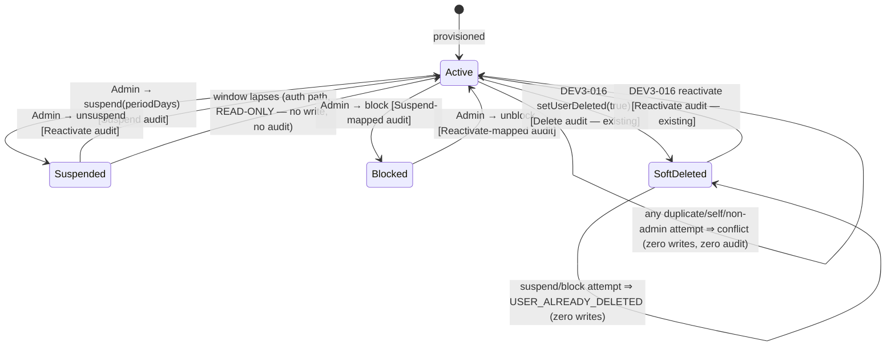

# Technical Architecture & Implementation Design: DEV3-017 — Account Soft-Delete Governance (users.is_deleted)

> **Plan directory (verbatim — every header, ledger path, and self-reference in this plan uses exactly this string):** `ai/plans/sprint_3/dev3-017-account-soft-delete-governance-usersis-d`
> **Specs of record:** `ai/plans/sprint_3/dev3-017-account-soft-delete-governance-usersis-d/specs.md` (REQ-001..REQ-095)
> **Canonical refs:** `docs/admin/user-management.md` (DEV3-016 substrate + §6 scope-split row this ticket ships), `docs/auth/jwt-authentication-service.md` §5.3/§5.7 (the deferred window helper this ticket RESOLVES on the auth side), `docs/workflows/05-admin-governance-override.md` §5, `docs/specs/state-machine-invariants.md` (INV-U1..U5, INV-U3), `docs/specs/open-decisions-and-gaps.md` (A.5, A.7, B.15), `docs/graphql/domain-error-extensions-code.md`, `docs/IDEMPOTENCY.md` (out-of-set ruling), `docs/testing/workflow-journey-tests.md`

---

## 1. System Overview & Architecture Diagram

### 1.1 Scope Statement

DEV3-017's TITLE says "soft-delete" but its CONTENT (per the DEV3-016 scope-split row it owns — `docs/admin/user-management.md` §6) is the **suspend / block governance windows**. Immutable boundaries:

1. **Two new admin mutations** (`adminSetUserSuspended`, `adminSetUserBlocked`) — guarded single-statement transitions over the A.7 columns, ONE in-tx audit row per commit (`Suspend`/`Reactivate` vocabulary — zero enum drift), self/state/deleted-target protections, and the post-write `AdminUserDetail` re-composition.
2. **Window-honest auth**: ONE shared fail-closed predicate (`isSuspensionActive`) extracted from the handshake helper, consumed by `assertUserActive` (login + refresh) AND `getServerUserContext` (SSR) — a LAPSED suspension restores access with ZERO writes; a BLOCKED or DELETED account never lapses.
3. **A strict window-aware active-actor guard** on the new mutations only (DEV3-016's existing mutations keep their relaxed guard untouched).
4. **INV-U4 grep-locks** (no hard-delete writer, no hard-delete GraphQL field).
5. **Governance UI** on the EXISTING detail page (verify-first — the container EXISTS on disk at `frontend/views/admin/users/AdminUserDetailContainer.tsx`; verify its internals BEFORE editing) + the journey.

Zero schema drift, zero schema-surface enums, zero notifications, zero context-factory changes, zero new routes/nav.

### 1.2 Data Flow

```text
┌── CLIENT (React 19 / MUI v9 / Apollo 4) ──────────────────────────────────────┐
│ app/(dashboard)/admin/users/[id]/page.tsx (EXISTING — verified on disk)       │
│   └─ AdminUserDetailContainer (EXISTING — verify internals BEFORE editing)    │
│        └─ <GovernanceActionsSection /> (NEW client component)                 │
│             Suspend dialog (periodDays field) · Unsuspend · Block · Unblock   │
│             useMutation(adminSetUserSuspendedMutationDocument)                │
│             useMutation(adminSetUserBlockedMutationDocument)                  │
└──────────────────────────────────┬────────────────────────────────────────────┘
▼ Apollo → POST /api/graphql
┌── POTHOSE ────────────────────────────────────────────────────────────────────┐
│ backend/graphql/mutation/admin/admin-governance.mutation.ts (NEW)             │
│   adminSetUserSuspended(id, suspended, periodDays): AdminUserDetail!          │
│   adminSetUserBlocked(id, blocked): AdminUserDetail!                          │
│   authScopes: { $all: { authenticated: true, role: [UserRole.Admin] } }       │
│   thin resolvers: localized ctx.user guard → delegate → NO try/catch          │
└──────────────────────────────────┬────────────────────────────────────────────┘
▼
┌── SERVICE (EXTEND EXISTING — never fork) ─────────────────────────────────────┐
│ AdminUserManagementService (backend/services/admin/user-management.service.ts)│
│   + setUserSuspended(id, suspended, periodDays, actorId, locale, outerTx?)    │
│   + setUserBlocked(id, blocked, actorId, locale, outerTx?)                    │
│   1. assertActiveActorAdmin(actorId, …)  ← STRICT window-aware guard          │
│      (shared helper: backend/services/admin/admin-guards.helpers.ts)          │
│   2. id + periodDays validation (fields[] payload, PRE-DB)                    │
│   3. withTransaction(outerTx):                                                │
│      self-check → guarded UPDATE → null ⇒ classifier probe →                  │
│      ONE AuditService.createAuditLog(…, tx) → getUserDetail(…, tx)            │
└──────────────────────────────────┬────────────────────────────────────────────┘
▼
┌── REPOSITORY (EXTEND EXISTING) ───────────────────────────────────────────────┐
│ AdminUserRepository (backend/db/repo/admin/admin-user.repository.ts)          │
│   + setSuspendedOnce(id, target, periodDays, tx)   guarded UPDATE RETURNING   │
│   + setBlockedOnce(id, target, tx)                 guarded UPDATE RETURNING   │
│   + findGovernanceState(id, tx?)                   5-column classifier probe  │
└──────────────────────────────────┬────────────────────────────────────────────┘
▼
┌── AUTH BOUNDARY CONSUMPTION (window honesty) ─────────────────────────────────┐
│ NEW backend/lib/auth/suspension-window.ts → isSuspensionActive(state, now)    │
│   consumed by: assertUserActive (login + refreshToken, auth.service.ts)       │
│                getServerUserContext (SSR, server-auth.ts:99-106)              │
│   AND (refactor-consumed) by student-handshake.helpers.ts (regression net)    │
└──────────────────────────────────┬────────────────────────────────────────────┘
▼
┌── POSTGRESQL ─────────────────────────────────────────────────────────────────┐
│ users       (suspended/suspended_at/suspended_period_days/is_blocked/         │
│              blocked_at — A.7 columns; the ONLY mutation targets)             │
│ audit_logs  (ONE row per committed transition — Suspend/Reactivate mapping)   │
│ ZERO writes to: notifications, students, applicants, teacher, parents,        │
│ subscriptions, payments, sessions, evaluations, wallet                        │
└───────────────────────────────────────────────────────────────────────────────┘
```

### 1.3 Key Design Decisions Table

| # | Decision | Options Considered | Pros / Cons | Rationale (Maintainability, Scalability, Reliability) |
|---|---|---|---|---|
| D1 | New service methods land INSIDE `AdminUserManagementService`; repo methods INSIDE `AdminUserRepository` | (a) new `AdminGovernanceService` + repo file; (b) extend in place | (a) forks the closure scope that owns `buildAuditContract`, `getUserDetail` composition, and the admin-write surface home — two writers for one domain drift. (b) the DEV3-016 file IS the governance-mutations home; its private helpers are consumed, never duplicated. | (b). Scope-split fidelity: DEV3-016 owns the users-mutation surface; this ticket ships a ROW of Workflow 05 §5 on it. DEV3-016's shipped soft-delete methods stay byte-untouched (REQ-020). |
| D2 | Block/unblock audit rows map onto `Suspend`/`Reactivate` with honest `details.changedFields` | (a) extend `audit_action_type` with `block`; (b) mapping + honest details | (a) REQUIRES a pgEnum migration — forbidden by REQ-045 (zero schema drift). (b) zero drift; DEV3-020's browser distinguishes via `details.changedFields`. | (b). REQ-011's recorded ruling; `AuditActionType.Suspend`/`Reactivate` already exist (`backend/enum/audit/audit-action-type.enum.ts:12-13`). Vocabulary widening is a separate governed decision (ledger D6). |
| D3 | ONE canonical window predicate at `backend/lib/auth/suspension-window.ts`; handshake helper refactor-consumes it | (a) duplicate the math at the auth layer; (b) extract + consume | (a) two diverging lapses computations — a replay of the redirect-loop defect class. (b) one math, two consumers; the handshake suite (`student-handshake.service.test.ts`) is the byte-green regression net. | (b). REQ-017. The predicate is EXACTLY the `isGovernanceExcludedFromDiscovery` suspended-branch math (`student-handshake.helpers.ts:39-59`): fail-closed on missing/corrupt window data; STRICT `>` lapse boundary. |
| D4 | Auth consumption changes ONLY the suspended branch: `assertUserActive` + `getServerUserContext` swap `suspended` → `isSuspensionActive(...)`; denial copy channel unchanged (`t.accountBlocked`) | (a) new error codes per governance state; (b) shape-constant FORBIDDEN | (a) breaks the governed-tier wire-shape constancy pinned by `notification-integration.matrix.test.ts:1159-1188` (constant denial shape across suspended/blocked/deleted). (b) zero wire drift; the crash-course matters on the `login` POST path. | (b). REQ-018. The change is SEMANTIC (lapsed suspension no longer denies), never presentational. `createGraphQLContext` (`backend/graphql/gqlContextFactory.ts:167-239`) stays UNTOUCHED — this plan claims NO context-level governance gate (documented window honesty, REQ-035). |
| D5 | STRICT, window-AWARE actor guard on the NEW mutations only; DEV3-016 mutations keep the relaxed guard; shared helper is create-or-consume conditional | (a) fork a private strict guard; (b) extract-if-absent / consume-if-present | (a) two admin gates = BFLA drift. (b) one canonical home for the double-line rule; sibling DEV3-018's guard consumption converges on the same module. | (b). REQ-030/031. Governance writes are high-blast-radius — they may NOT ride the documented context governance window. The strict variant denies in deterministic order `accountDeleted → accountBlocked → accountSuspended` (existing flat keys, `shared/locale/en/errors/index.ts:17-19`). |
| D6 | Guarded `UPDATE … RETURNING` + zero-row CLASSIFIER probe (`findGovernanceState` — 5 columns) inside the same tx | (a) SELECT-then-UPDATE; (b) guarded write + classifier | (a) TOCTOU hole (concurrent double-suspend both "succeed" → double audit rows). (b) single statement serializes at the row lock; classifier disambiguates not-found / deleted / axis-conflict honestly. | (b). REQ-013/042 — the DEV3-016 `setDeletedOnce` precedent (`admin-user.repository.ts:627-647`) + `existsById`-style cold-path probe, extended to carry the axis states needed for honest classification. |
| D7 | `periodDays` mandatory ONLY on the suspend direction, validated `1..3650` with a `fields[]` payload; unsuspend direction IGNORES it | (a) nullable-anywhere; (b) direction-gated mandatory | A silent `NULL` window would mint a corrupt suspension that the predicate denies FOREVER (fail-closed on missing period) — an accidental permanent lockout. The unsuspend direction never consumes the field (BOPLA hygiene: ignored, never re-mixed). | (b). REQ-010. `1..3650` caps both under-entry and absurd windows; client mirrors the rule but the server is authoritative. |
| D8 | Both mutations return the EXISTING `AdminUserDetail` object; frontend documents reuse the `AdminUserDetailFields` fragment | (a) bespoke payload type; (b) reuse | (a) duplicates the snapshot assembly. (b) Apollo merges the response into the SAME normalized `AdminUserDetail:<id>` entry — the detail page re-renders WITHOUT a refetch. | (b). REQ-060/062. Zero new output types; the object already exposes `suspended/suspendedAt/suspendedPeriodDays/isBlocked/blockedAt` (`admin-user.pothos.ts:253-265`). The pre-scalar `String` timestamp shape of this legacy object is inherited AS-IS (no DateTime widening on this surface — REQ-060's explicit carve-out). |
| D9 | ZERO notifications, ZERO context changes, ZERO new routes/nav, ZERO cookie/auth-infra changes | — | The DEV3-016 delete path notifies nobody; governance-notify is forward-recorded, not invented. | REQ-036/065. Consistency + smallest honest footprint. |
| D10 | Frozen schema-surface baselines are reconciled-to-live FIRST, then extended with the two fields — ONE documented changeset, never a silent flip | (a) silent baseline edit; (b) reconcile-then-extend | The bundled `schema-surface.test.ts:100-112` + `sdl-static-assertions.test.ts:66-75` predate the shipped DEV3-016 admin surface (the live mutation root already carries `adminCreateUser`/`adminUpdateUser`/`adminSetUserDeleted`, verified at `admin-users.mutation.ts:58,94,127`). | (b). REQ-061. IF a sibling (DEV3-018/020/022d) already reconciled, this ticket extends ONLY its two fields. Sorted insertion: `adminSetUserBlocked` < `adminSetUserDeleted` < `adminSetUserSuspended` < `adminUpdateUser`. |
| D11 | Login/refresh governance proofs run on COMMITTED fixtures (service committed-fixture block + journey), NEVER inside `runInRollback` | (a) runInRollback service tests; (b) committed-fixture tier | `AuthService.login` reads via the GLOBAL `db` (`UserRepository.findByEmail` without tx, `auth.service.ts:132`) and fires `touchLastActiveAt` against global `db` (fire-and-forget, `auth.service.ts:163-176`) — inside an outer rollback tx the row is invisible AND the fire-and-forget update would hit a lock-wait hazard. | (b). Journey-harness pattern (committed `beforeAll` + tracked `afterAll`), mirrored from `user-management.chaos.test.ts:122-147`'s committed-fixture lifecycle. |
| D12 | Journey side-effect proof is ROW-COUNT-based (zero notifications emitted); no `SpiedFanoutTransport` wiring | (a) spy the engine seam; (b) count oracles | This surface never imports the engine — spying would test a phantom boundary. | (b). REQ-036. The journey asserts `notifications` row-count invariance for every fixture user; the audit rows it DOES produce are asserted by count + content. |

---

## 2. Data Models & Database Schema

### 2.1 Existing Schema Verification (READ-ONLY — zero drift gate, REQ-045)

| Element | Verified anchor (bundled code) | Role in this ticket |
|---|---|---|
| `users` governance columns: `isDeleted`/`deletedAt`/`suspended`/`suspendedAt`/`suspendedPeriodDays`/`isBlocked`/`blockedAt` | `backend/db/schema/users/users.ts:30-36` | WRITE targets of the four transitions (the ONLY tables touched) + classifier/auth READS |
| `audit_logs` (append-only) | `backend/db/schema/audit/audit-logs.ts:30-47` | ONE insert per committed transition |
| `AuditActionType.Suspend = "suspend"` · `Reactivate = "reactivate"` | `backend/enum/audit/audit-action-type.enum.ts:12-13` | writer vocabulary (first writer of `Suspend`) |
| `audit_action_type` pgEnum (7 values) | `backend/db/schema/enums.ts:66-74` | byte-stable — NO new member |
| `teacher` / `students` / `applicants` / `parents` | schema tree | NEVER written (INV-U1/U5 fixture-immutability probes) |

**Zero-drift gate:** `git diff -- backend/db/schema/** backend/db/migration/**` MUST be empty at completion. No `bun run db` is ever invoked for this ticket.

### 2.2 Canonical Types — One Additive Type (REQ-003)

**`backend/types/admin/admin-user.types.ts`** (EXISTING — extend; the barrel `backend/types/admin/index.ts:1` already re-exports it):

```typescript
export interface GovernanceProbeRowType {
  readonly isDeleted: boolean | null;
  readonly suspended: boolean | null;
  readonly suspendedAt: Date | null;
  readonly suspendedPeriodDays: number | null;
  readonly isBlocked: boolean | null;
}
```

NO suspend/block input types (the service signatures are primitive-based — see §4.2); NO new ReturnType (the service returns the EXISTING `AdminUserDetailReturnType`, `backend/types/admin/admin-user.types.ts:192-197`); NO local types in Pothos/resolvers; NO service-layer `.types.ts`.

### 2.3 New Pure Predicate (auth lib — NOT a types file)

**NEW `backend/lib/auth/suspension-window.ts`** (runtime module; imports NOTHING but the type-shape inline — shared-layer purity is trivially satisfied since it imports no `frontend`/`app` code):

```typescript
const MS_PER_DAY = 86_400_000;
export function isSuspensionActive(
  state: { readonly suspended: boolean | null; readonly suspendedAt: Date | null; readonly suspendedPeriodDays: number | null },
  now: Date
): boolean
```

Semantics (EXACT — extracted from `student-handshake.helpers.ts:39-59`):

| Input state | Result |
|---|---|
| `suspended` falsy (false/null) | `false` |
| `suspendedAt` missing OR `suspendedPeriodDays` missing OR `≤ 0` | `true` (fail-CLOSED — corrupt window data never widens access) |
| otherwise | `suspendedAt.getTime() + periodDays × MS_PER_DAY > now.getTime()` — STRICT `>`; an expiry landing exactly on `now` has LAPSED |

**Refactor-consume:** `backend/services/students/student-handshake.helpers.ts` replaces its inline `suspendedAt + suspendedPeriodDays * MS_PER_DAY` computation with a call into this predicate (keeping its own isDeleted/isBlocked pre-checks). Behavior-preserving; `backend/services/students/student-handshake.service.test.ts` MUST stay byte-green (it IS the regression net).

---

## 3. API Contracts & Pothos Resolvers

### 3.1 GraphQL SDL Additions (net-new surface — REQ-060)

```graphql
extend type Mutation {
  adminSetUserSuspended(id: Int!, suspended: Boolean!, periodDays: Int): AdminUserDetail!
  adminSetUserBlocked(id: Int!, blocked: Boolean!): AdminUserDetail!
}
```

- NO new object types, NO new input types, NO new enums. The return type reuses `AdminUserDetailPothosObject` (`backend/graphql/pothos/admin/admin-user.pothos.ts:235-300`) — its governance fields (`suspended`, `suspendedAt`, `suspendedPeriodDays`, `isBlocked`, `blockedAt` at lines 253-265) already render post-write state.
- There is NO `id` smuggling surface beyond the declared `id: Int!` arg — smuggled fields die as `GRAPHQL_VALIDATION_FAILED` (REQ-032 probe).

### 3.2 Pothos Registration

| File | Change |
|---|---|
| `backend/graphql/mutation/admin/admin-governance.mutation.ts` | NEW — registers BOTH fields; `authScopes: { $all: { authenticated: true, role: [UserRole.Admin] } }` on each (the `$all` conjunction is load-bearing — pattern proven at `backend/graphql/test/handshake-code-surface.test.ts:125-157`); thin resolvers: `if (!ctx.user) throw new UnauthorizedError((await ctx.t("errorsTranslations")).unauthorized)`; delegate `AdminUserManagementService.setUserSuspended(requirePositiveIntId(args.id, "id"), args.suspended, args.periodDays ?? null, ctx.user.id, ctx.locale)` / `…setUserBlocked(requirePositiveIntId(args.id, "id"), args.blocked, ctx.user.id, ctx.locale)`; NO try/catch (DomainErrors propagate to the finalizer) |
| `backend/graphql/mutation/admin/index.ts` | ADD side-effect import `import "./admin-governance.mutation";` to the existing barrel (currently `import "./admin-users.mutation";`) |
| Codegen | `bun run generate:gqlSchema && bun codegen` in the SAME changeset; commit `frontend/graphql/generated/**`; the committed-SDL↔live-SDL normalized-parity test (`backend/graphql/test/plan-catalog.schema.test.ts:67-73`) stays GREEN |
| `PUBLIC_OPERATIONS` | UNTOUCHED (`backend/lib/gateway/public-operations.ts:36-46` frozen six) — scope-gated, never anonymous (REQ-033) |

### 3.3 Baseline Reconcile-Then-Extend (REQ-061 — documented, conditional)

The bundled freeze suites predate the shipped DEV3-016 surface. In ONE documented changeset:

1. **Reconcile (only if still stale at implementation start — IF DEV3-018/020/022d landed first and reconciled, this step reduces to a no-op verify):** `backend/graphql/test/schema-surface.test.ts` and `backend/graphql/test/sdl-static-assertions.test.ts` expected inventories are re-anchored to the LIVE built schema, verified empirically via a `printSchema(lexicographicSortSchema(graphQLSchema))` probe — Mutation root today ≡ `adminCreateUser, adminSetUserDeleted, adminUpdateUser, createPlan, login, logout, markAllNotificationsRead, markNotificationRead, refreshToken, registerUser, setPlanActiveStatus, updateMyLocale, updatePlan`; Query root ≡ `_health, adminPlans, adminUserActivity, adminUserDetail, adminUserStats, adminUsers, findStudentByHandshakeCode, me, myApplicantProfile, myHandshakeCode, myNotifications, myUnreadNotificationCount, planCatalog, recitationReadings`; plus the DEV3-016 type inventory (`Admin*User*` objects/inputs, snapshots, `AdminUserGovernanceFilter`, `AuditActionType` enum pins).
2. **Extend:** append `adminSetUserBlocked` and `adminSetUserSuspended` at their sorted positions (`adminCreateUser` < `adminSetUserBlocked` < `adminSetUserDeleted` < `adminSetUserSuspended` < `adminUpdateUser`) and pin the exact arg shapes (`id: Int!, suspended: Boolean!, periodDays: Int` / `id: Int!, blocked: Boolean!`) + the `$all` authScopes declaration.

Both steps AND their rationale are recorded in the task outcome file with the probe evidence.

### 3.4 Permission Matrix

| Caller | `adminSetUserSuspended` / `adminSetUserBlocked` | Notes |
|---|---|---|
| Anonymous | `UNAUTHORIZED` (401 semantics, pre-resolver) | `$all.authenticated` throws BEFORE role evaluation |
| Student / Parent / Teacher | `FORBIDDEN` (403, pre-resolver) | role scope → canonical localized `ForbiddenError` |
| Admin (governed — deleted / blocked / actively suspended) | `FORBIDDEN` (service-layer strict re-check, D5) | the ONLY new 403 producer below the scope line; zero writes, zero audit |
| Admin (lapsed suspension) | ✅ executes | window-aware guard — the lapse restores operator access (REQ-017 semantics) |
| Admin (active) | ✅ executes | `actorId = ctx.user.id` exclusively |
| Supervisor | n/a | no such role exists (`backend/enum/users/user-role.enum.ts:6-9`) |

---

## 4. Backend Services, Repositories & Concurrency Model

### 4.1 Shared Guard Module — Create-or-Consume (REQ-031, conditional)

**Target module:** `backend/services/admin/admin-guards.helpers.ts`.

- **IF ABSENT at implementation start (sibling DEV3-018 not yet landed):** CREATE via behavior-preserving extraction of the private `assertActorAdmin` (`user-management.service.ts:240-271`) AND add the strict variant. `user-management.service.ts` deletes its private copy and imports the helper (its EXISTING tests = the byte-equivalence regression net; DEV3-016's methods keep the RELAXED guard — no silent semantics change).
- **IF PRESENT:** consume it. IF its `assertActiveActorAdmin` evaluates `suspended` as a PLAIN flag, UPGRADE it to the window-aware `isSuspensionActive` form in the SAME changeset (the divergence only matters for lapsed suspensions; sibling suites are the net) — recorded in the outcome, never silent.

```typescript
export async function assertActorAdmin(actorId: number, locale: string, outerTx?: DBTransaction): Promise<void>;
// EXACT extraction — identical behavior

export async function assertActiveActorAdmin(actorId: number, locale: string, outerTx?: DBTransaction): Promise<void>;
// composes the base check, then rejects governance on the SAME fetched actor row (no second query):
//   isDeleted   → ForbiddenError(tErrors.accountDeleted)
//   isBlocked   → ForbiddenError(tErrors.accountBlocked)
//   isSuspensionActive({…}, new Date()) → ForbiddenError(tErrors.accountSuspended)
// deterministic order: deleted → blocked → suspended; ONE logger.logDomainError per denial ({ code: "FORBIDDEN", entity: "user", entityId });
// ZERO writes, ZERO audit rows.
```

### 4.2 Service — NEW methods on `AdminUserManagementService` (EXTEND `backend/services/admin/user-management.service.ts`)

```typescript
export async function setUserSuspended(
  id: number,
  suspended: boolean,
  periodDays: number | null,
  actorId: number,
  locale: string,
  outerTx?: DBTransaction
): Promise<AdminUserDetailReturnType>;

export async function setUserBlocked(
  id: number,
  blocked: boolean,
  actorId: number,
  locale: string,
  outerTx?: DBTransaction
): Promise<AdminUserDetailReturnType>;
```

**Ordered pipeline (suspend shown; block mirrors with its own axis/codes):**

1. `await assertActiveActorAdmin(actorId, locale, outerTx)` — PRE-transaction when `outerTx` absent (denials never open a write scope).
2. `id` positive-safe-int re-assertion → `ValidationError(tErrors.validation)` (private guard mirroring `user-management.service.ts:181-183`).
3. IF `suspended === true`: `periodDays` MUST be an integer in `1..3650` → else `ValidationError(tErrors.adminUsers.suspensionPeriodInvalid, [{ field: "periodDays", code: "SUSPENSION_PERIOD_INVALID", message: tErrors.adminUsers.suspensionPeriodInvalid }])` — the `(message, fields)` overload (`errors.ts:78-81`), PRE-DB. IF `suspended === false`: `periodDays` is IGNORED (never validated, never forwarded).
4. `withTransaction(outerTx, async tx => { … })` body:
   - `id === actorId` → `ConflictError("USER_SELF_SUSPENSION_FORBIDDEN", tErrors.adminUsers.userSelfSuspensionForbidden)` BEFORE any write (inside-tx placement mirrors `setUserDeleted`'s self-check at `user-management.service.ts:988-996`); block direction → `USER_SELF_BLOCK_FORBIDDEN`.
   - `AdminUserRepository.setSuspendedOnce(id, suspended, suspended ? periodDays : null, tx)` → row → proceed.
   - `null` → classifier: `AdminUserRepository.findGovernanceState(id, tx)` →
     - `null` → `NotFoundError("USER", tErrors.adminUsers.userNotFound)` (`USER_NOT_FOUND` — admin-surface-only oracle ruling, `docs/admin/user-management.md` §4; the doc forbids copying it to non-admin surfaces);
     - `isDeleted === true` → `ConflictError("USER_ALREADY_DELETED", tErrors.adminUsers.userAlreadyDeleted)` (uniform rule — governance holds are placed ONLY on live accounts);
     - suspend direction + `suspended === true` → `ConflictError("USER_ALREADY_SUSPENDED", …)`; unsuspend direction + `suspended !== true` → `ConflictError("USER_NOT_SUSPENDED", …)`; block direction + `isBlocked === true` → `USER_ALREADY_BLOCKED`; unblock + `isBlocked !== true` → `USER_NOT_BLOCKED`. `ConflictError(code, message)` overload verified at `backend/lib/errors.ts:170-182`.
   - ONE audit row, in-tx, via the service's EXISTING private `buildAuditContract` (composition-only — the same closure `createUser`/`setUserDeleted` use):
     - suspend → `{ actorId, actionType: AuditActionType.Suspend, entityType: "user", entityId: id, details: JSON.stringify({ changedFields: ["suspended","suspendedAt","suspendedPeriodDays"], suspended: true, suspendedPeriodDays: periodDays }) }`
     - unsuspend → `AuditActionType.Reactivate`, `details: { changedFields: ["suspended","suspendedAt","suspendedPeriodDays"], suspended: false }`
     - block → `AuditActionType.Suspend`, `details: { changedFields: ["isBlocked","blockedAt"], blocked: true }`
     - unblock → `AuditActionType.Reactivate`, `details: { changedFields: ["isBlocked","blockedAt"], blocked: false }`
   - `return getUserDetail(id, locale, actorId, tx)` (composition reuse; its internal relaxed `assertActorAdmin` re-check passes — the actor was already proven an ACTIVE admin; documented reviewer note).
5. EVERY denial path: exactly ONE `logger.logDomainError` with `{ code, entity: "user", entityId: id, locale }`; ZERO audit rows; ZERO notifications rows (JR-C-1, REQ-052). Happy path: silent — no `logDomainError` fires (REQ-053).

Export list: the namespace grows; `backend/services/admin/index.ts` already re-exports `./user-management.service` (barrel unchanged).

### 4.3 Repository — EXTEND `backend/db/repo/admin/admin-user.repository.ts`

```typescript
export async function setSuspendedOnce(
  id: number,
  target: boolean,
  periodDays: number | null,
  tx: DBTransaction
): Promise<AdminUserSafeSelect | null>;

export async function setBlockedOnce(id: number, target: boolean, tx: DBTransaction): Promise<AdminUserSafeSelect | null>;

export async function findGovernanceState(id: number, tx?: DBQueryExecutor): Promise<GovernanceProbeRowType | null>;
```

**Guarded statements (mirroring `setDeletedOnce`'s NULL-safe inverse-state guard, `admin-user.repository.ts:627-647`):**

```text
suspend:   UPDATE users SET suspended = true,  suspended_at = now, suspended_period_days = <periodDays>, updated_at = now
           WHERE id = $1 AND (suspended = false OR suspended IS NULL) AND (is_deleted = false OR is_deleted IS NULL)
           RETURNING <SAFE_USER_SELECT>
unsuspend: UPDATE users SET suspended = false, suspended_at = NULL, suspended_period_days = NULL, updated_at = now
           WHERE id = $1 AND suspended = true AND (is_deleted = false OR is_deleted IS NULL) RETURNING …
block:     UPDATE users SET is_blocked = true,  blocked_at = now, updated_at = now
           WHERE id = $1 AND (is_blocked = false OR is_blocked IS NULL) AND (is_deleted = false OR is_deleted IS NULL) RETURNING …
unblock:   UPDATE users SET is_blocked = false, blocked_at = NULL, updated_at = now
           WHERE id = $1 AND is_blocked = true AND (is_deleted = false OR is_deleted IS NULL) RETURNING …
```

Drizzle form with `and(eq(users.id, id), <axis guard>, or(eq(users.isDeleted, false), isNull(users.isDeleted)) ?? sql`false`)` — value imports for nothing else; NO prepared statements on writes; NO inline `--` comments inside `sql` templates. `findGovernanceState` probes ONLY the five `GovernanceProbeRowType` columns (never `passwordHash`).

### 4.4 Auth Boundary Consumption (REQ-018)

| File | Change |
|---|---|
| `backend/lib/auth/suspension-window.ts` | NEW predicate (§2.3) |
| `backend/services/auth/auth.service.ts` | `assertUserActive` (lines 91-98) — signature's input type widens to include `{ suspendedAt, suspendedPeriodDays }`; the condition becomes `user.isDeleted \|\| user.isBlocked \|\| isSuspensionActive(user, new Date())`. Call sites (`login` line 156, `refreshToken` line 244) pass the SAME fetched row — zero signature churn at call sites. Denial copy channel UNCHANGED (`t.accountBlocked`). |
| `backend/lib/auth/server-auth.ts` | `getServerUserContext`'s governance gate (lines 99-106): `if (fetched.isDeleted \|\| fetched.isBlocked \|\| isSuspensionActive(fetched, new Date()))` — the SSR gate stays one condition; the existing domain log line is unchanged. |
| `backend/services/students/student-handshake.helpers.ts` | refactor-consumes the predicate (§2.3) — its isDeleted/isBlocked pre-checks stay; ONLY the window math is replaced. |

**Precedent-proof of wire constancy:** `notification-integration.matrix.test.ts:514-533`'s `applyGovernanceState` sets `suspended: true` + `suspendedAt: now` WITHOUT a period — under the fail-closed predicate that still denies login, so the governed-tier matrix (lines 1139-1272) stays GREEN unchanged.

### 4.5 Concurrency & Race Condition Assessment

| Scenario | Actors | Risk | Mitigation |
|---|---|---|---|
| Concurrent double-suspend / double-block (double-click or two admins) | 2 admin requests, same target | duplicate audit rows; double writes | The guarded UPDATE serializes at the PK row lock: winner updates; loser's predicate re-evaluates to zero rows → classifier → `USER_ALREADY_SUSPENDED` / `USER_ALREADY_BLOCKED` BEFORE any audit write. `Promise.allSettled` chaos proof: exactly ONE winner + ONE audit row (REQ-043); SKIP under `isPgliteProvider()` (`test/helpers/skip-when-pglite.ts:48-50`). |
| Suspend ⚡ unsuspend race | 2 admins, opposing directions | incoherent final state | EXACTLY ONE wins (the loser's axis predicate fails post-lock); final state ≡ winner's direction; audit row count = 1. Chaos-proven. |
| Loser conflicts on a winner whose tx LATER rolls back | — | phantom conflict | Classifier re-reads INSIDE the same tx under READ COMMITTED — only committed state is visible; documented ordering: conflict ⇒ probe ⇒ branch honestly. |
| Governance flag flips mid-flight between intake read and guarded write | DEV3-016 `setUserDeleted` racing `setUserSuspended` | a suspension lands on a just-deleted user | The guarded write's `is_deleted`-or-NULL predicate is evaluated UNDER the row lock — a concurrent committed soft-delete serializes BEFORE our write and fails our guard → classifier → `USER_ALREADY_DELETED`. NO `SELECT FOR UPDATE` needed: the write's own guard IS the re-check. |
| Actor governance flips between scope check and service check | governance writer × governance caller | stale-privilege write window | The strict service re-check (D5) shrinks the window to request time; the residual sub-request window is the documented one; NO context-level claim is made (REQ-035). |
| Re-suspend after lapse | admin flow | silent extension | Impossible by construction: `suspended = true` (even lapsed) answers `USER_ALREADY_SUSPENDED` (REQ-016). Extension = audited unsuspend-then-suspend PAIR. |

**TOCTOU guarantee:** the ONLY mutable-state read→write chain is the guarded single statement (no TOCTOU by construction); the classifier is read-only post-hoc disambiguation. NO advisory locks, NO Redis `SET NX EX`, NO `SELECT FOR UPDATE` on this surface.

**Idempotency-class ruling (REQ-044):** guarded transitions + strict conflicts ARE the replay protection — these admin ops are NOT in the `docs/IDEMPOTENCY.md` mandated key set (DEV3-016 §2.5 ruling carried forward); the UI disables confirm buttons in-flight.

### 4.6 Cross-Actor Journey Design (MANDATORY — specs §2.9)

**Shared-entity state machine (per user, per axis):**



**Side-effect matrix:**

| Transition (actor → action) | Rows written | Audit (type ∈ entityType "user") | Notifications | Idempotency |
|---|---|---|---|---|
| suspend(S, p) | users: suspended/at/periodDays | 1 × `Suspend` (`changedFields: [suspended, suspendedAt, suspendedPeriodDays]`, periodDays metadata) | NONE | guarded statement |
| unsuspend(S) | users: 3 columns cleared | 1 × `Reactivate` | NONE | guarded statement |
| block(S) | users: isBlocked/blockedAt | 1 × `Suspend` (`changedFields: [isBlocked, blockedAt]`) | NONE | guarded statement |
| unblock(S) | users: cleared | 1 × `Reactivate` | NONE | guarded statement |
| lapse(S) observed at login | NONE (REQ-019 — columns byte-identical) | NONE | NONE | n/a (read-only) |
| EVERY denial | NONE | NONE (JR-C-1) | NONE | — |

**Cross-actor visibility (per journey step):**

| After step | Admin A (actor) | Admin B (observer) | Student S (target) | Teacher T (control) | Governed Admin G |
|---|---|---|---|---|---|
| 2 — suspend S | detail re-renders suspended | detail + ONE audit row attributed to A | NEXT login denied (FORBIDDEN) | byte-identical | — |
| 3 — S login denied | — | — | `ForbiddenError` via real `AuthService.login` | untouched | — |
| 4 — unsuspend S | columns cleared | +1 `Reactivate` row | login SUCCEEDS | untouched | — |
| 5 — block S | blocked/at set | +1 `Suspend`-mapped row | login denied — NO lapse semantics | untouched | — |
| 6 — unblock S | cleared | +1 `Reactivate` row | login succeeds | untouched | — |
| 7 — soft-delete S (EXISTING path) → suspend S denied | `USER_ALREADY_DELETED`, zero new audit | delete row only; no governance ghost rows | login denied pre + post | untouched | — |
| 8 — lapse arc: fixture-write lapsed suspension | — | detail STILL shows window fields until release | login succeeds; columns byte-identical | untouched | — |
| 9 — denial battery | per-code conflicts | ZERO phantom rows | (non-admin caller) `ForbiddenError` | untouched | strict-guard `ForbiddenError` |
| 10 — control immutability | — | — | — | users+applicants byte-identical | — |

**Journey harness contract:** `test/workflows/admin/account-governance.journey.test.ts` — TEST-FIRST; committed fixtures in `beforeAll` via ONE `db.transaction` (Admin A/B via `createTestUser`+`createTestAdmin`; Teacher T via the REAL `RegistrationService.registerUser` teacher branch; Governed Admin G = admin + `isBlocked: true`; Student S via REAL `registerUser` with a recorded password — committed); tracked teardown in `afterAll` (audit rows via `withAuditDeleteTriggersSuspended`, `test/helpers/db-cleanup.ts:83-109`; user teardown via `deleteUsersByIds`, lines 123-140) with residue re-probes = 0; unique `jrn_gov_<uuid8>` prefix; ZERO `runInRollback`; honest roles; notification side effects = row-count oracles ONLY (this surface emits none).

---

## 5. Frontend UX & Navigation Specification

### 5.1 Routes & URLs Table

| Path | Purpose | Required permission | Allowed roles |
|---|---|---|---|
| `/admin/users/[id]` | EXISTING detail page — HOSTS the governance actions (on-disk verified — `app/(dashboard)/admin/users/[id]/page.tsx` + `frontend/views/admin/users/AdminUserDetailContainer.tsx` exist, matching `docs/admin/user-management.md:157-159`; verify the container's internal structure BEFORE editing) | admin role (`withPageAuth({ roles: [UserRole.Admin] })`, `frontend/lib/auth/withPageAuth.ts:34-47`) | Admin |

NO new route; NO new nav item (`frontend/views/dashboard/navItems.ts:126-135` untouched); NO bottom-nav work (mobile nav = the existing temporary MUI `Drawer` in `DashboardSidebar.tsx:100-116`).

### 5.2 Sidebar & Navigation Integration

None. Actions are contextual on the detail page's governance card (which ALREADY renders the governance fields read-only per DEV3-016).

### 5.3 Per-Audience Rendering

| Audience | Rendering |
|---|---|
| Admin, target `suspended === false` | **Suspend** action (opens dialog WITH required `periodDays` field); Unsuspend hidden |
| Admin, target `suspended === true` | **Unsuspend** action; Suspend hidden (a lapsed-but-flagged target unsuspends cleanly — the only release path) |
| Admin, target `isBlocked === false / true` | **Block** / **Unblock** symmetric pair |
| Admin, target `isDeleted === true` | governance actions DISABLED with the conflict outcome explaining `USER_ALREADY_DELETED` if attempted |
| Non-admin | never reaches the surface (page guard → `roleDashboardPath(role)`, `frontend/lib/auth/roleDashboardRoute.ts:52-65`; bare `/dashboard` NEVER targeted) |

### 5.4 Apollo Documents & Component Tree

**`frontend/graphql/sharedDocuments/admin/admin-users.documents.ts`** (EXISTING — extend):

```graphql
mutation AdminSetUserSuspended($id: Int!, $suspended: Boolean!, $periodDays: Int) {
  adminSetUserSuspended(id: $id, suspended: $suspended, periodDays: $periodDays) {
    ...AdminUserDetailFields
  }
}
mutation AdminSetUserBlocked($id: Int!, $blocked: Boolean!) {
  adminSetUserBlocked(id: $id, blocked: $blocked) {
    ...AdminUserDetailFields
  }
}
```

- `adminSetUserSuspendedMutationDocument: TypedDocumentNode<AdminSetUserSuspendedMutation, AdminSetUserSuspendedMutationVariables>` + block analog; BOTH reuse the EXISTING `AdminUserDetailFields` fragment (`admin-users.documents.ts:50-103`) whose `id` is selected FIRST → the response merges into the SAME `AdminUserDetail:<id>` normalized cache entry (zero refetch). NO `useLazyQuery`; hooks from `@apollo/client/react`.
- **Apollo cache:** NO new `typePolicies` — `AdminUserDetail` carries `id` (default normalization). `apolloCache.test.ts` frozen policy inventory (`frontend/providers/apollo/apolloCache.test.ts:176-185`) stays UNTOUCHED.
- **Documents contract test:** verify `frontend/graphql/sharedDocuments/admin/` for an existing documents test — CREATE `admin-users.documents.test.ts` IF ABSENT (naming/variables/`id`-first pins, barrel-identity), EXTEND it if a sibling ticket created it; do NOT touch the unrelated `documents.contract.test.ts` baseline table.

**Component tree:**

```text
app/(dashboard)/admin/users/[id]/page.tsx       (EXISTING — verify at implementation)
└─ AdminUserDetailContainer                     (EXISTING — verify; minimal insertion point)
   └─ <GovernanceActionsSection />              (NEW — client component)
        ├─ Suspend Button (ShieldOutlined) → Dialog
        │     required periodDays TextField (client-mirrored 1..3650 integer gate)
        │     confirm → useMutation(adminSetUserSuspendedMutationDocument)
        ├─ Unsuspend / Block / Unblock confirm Dialogs
        ├─ in-flight: confirm disabled (REQ-044)
        ├─ success: localized snackbar; detail re-renders from cache merge
        └─ conflict codes → inline Alert in-dialog carrying the SERVER-localized
           message (extractErrorCode / extractErrorMessage,
           frontend/lib/graphql-error-utils.ts)
```

**i18n (REQ-064):** the EXISTING `AdminUsers` namespace gains ONE group `governanceActions` with EXACTLY 20 slots — `suspendAction`, `unsuspendAction`, `blockAction`, `unblockAction`, `suspendDialogTitle`, `suspendDialogMessage`, `suspendPeriodLabel`, `suspendPeriodHelper`, `unsuspendDialogTitle`, `unsuspendDialogMessage`, `blockDialogTitle`, `blockDialogMessage`, `unblockDialogTitle`, `unblockDialogMessage`, `confirm`, `cancel`, `suspendSuccessToast`, `unsuspendSuccessToast`, `blockSuccessToast`, `unblockSuccessToast` — in `shared/locale/types/adminUsers/index.ts` + BOTH `en`/`ar` leaves (Arabic slots carry Arabic script); typed-leaf parity is free via `AdminUsersLabels`. The stale `detail.governanceNote` copy ("managed in the Governance module", `shared/locale/en/adminUsers/index.ts:145` + ar twin) is UPDATED in both locales to describe inline management, and any component assertion referencing it is updated in the SAME changeset.

**Error-copy source of truth on the wire:** the seven new `errorsTranslations.adminUsers` keys (`userAlreadySuspended`, `userNotSuspended`, `userAlreadyBlocked`, `userNotBlocked`, `userSelfSuspensionForbidden`, `userSelfBlockForbidden`, `suspensionPeriodInvalid`) in `shared/locale/types/errors/index.ts:67-87`'s group + both locale implementations. Machine code ↔ key bijection holds; actor-governance denials REUSE the existing flat `accountDeleted/accountBlocked/accountSuspended` (`en/errors/index.ts:17-19`).

**MUI v9 discipline:** `sx`-only styling; `theme.palette.*` only; `*Outlined` icons; `focusVisibleRingSx` (`frontend/components/ui/focusRing.ts`) on all interactive elements; ≥44px touch targets; `React.SubmitEvent`/`React.SyntheticEvent` for any form wrapper; number input via TextField with `inputProps`-free v9 slots discipline.

### 5.5 Visual Design & Responsive Specifications

- **Breakpoints:** Desktop 1440px — actions row inside the governance card; dialogs `maxWidth: 480` centered. Tablet 768px — full-width margins. Mobile 375px — dialogs full-width minus 16px gutters; fields + actions stack vertically; ≥44px targets.
- **RTL/Arabic:** logical properties only (`marginInlineStart`, `textAlign: "start"`); bidirectional mirroring via the existing emotion RTL pipeline (`frontend/lib/emotion-cache.tsx`); Arabic line-heights per design system; dialog copy wraps without truncation in `ar`.
- **Visual State Matrix:**

| State | Render |
|---|---|
| Eligible target | axis-appropriate action button(s) enabled |
| Suspend dialog open | required `periodDays` field + helper copy; confirm disabled until client validation passes |
| In-flight | confirm disabled + `CircularProgress size={20}`; cancel disabled |
| Success | dialog closes; localized snackbar; detail re-renders with new governance chips |
| `USER_ALREADY_*` / `USER_NOT_*` conflicts | inline `Alert severity="info"` with the server-localized message |
| `USER_ALREADY_DELETED` | inline `Alert severity="warning"` |
| `FORBIDDEN` (stale/governed admin session) | existing `GraphQLErrorSurfaceHost` toast path (mutation context, `frontend/providers/apollo/error-link.map.ts:219-235`) |
| `VALIDATION` (periodDays) | field-level error on the dialog's `periodDays` input via the `fields[]` projection (`frontend/components/ui/fieldError.ts`) |

- **Agent-Browser Verification Protocol:** `bun run scripts/browser-login.ts --inject` (admin session) → open a `role=student` fixture user's `/admin/users/[id]` → DOM-first assertions (`agent-browser snapshot`) that action visibility tracks the governance state → execute suspend with a period → assert snackbar + chip state flip → assert lapse-disabled and deleted-target-disabled branches. Screenshot capture (if any) goes through a short-lived visual-inspection subagent — NEVER `ReadMediaFile` in the orchestrating session (`test/ui/AGENTS.md`).

---

## 6. Security, Authorization & Tenancy Mitigations

| Threat class | Mitigation (concrete, anchored) |
|---|---|
| **BFLA (function-level)** | Double line: `authScopes: { $all: { authenticated: true, role: [UserRole.Admin] } }` (pre-resolver 401/403 — `$all` conjunction load-bearing per `handshake-code-surface.test.ts:125-157`) + service-side STRICT `assertActiveActorAdmin` (D5). No supervisor/delegate alternate path exists. |
| **Governance-window honesty (REQ-035)** | `createGraphQLContext` applies NO governance filter (`backend/graphql/gqlContextFactory.ts:167-239`) — this plan NEVER claims it is fail-closed. The NEW mutations close the window FOR THEMSELVES via the strict service re-check; the documented window for OTHER surfaces is unaffected and referenced, not silently hardened. |
| **BOLA / IDOR** | `actorId` derives EXCLUSIVELY from `ctx.user.id`; target `id` is a legitimate admin-controlled parameter → nonexistent id answers `USER_NOT_FOUND` (admin-surface-only oracle ruling, `docs/admin/user-management.md` §4 — the doc forbids copying it to non-admin surfaces). |
| **BOPLA (mass assignment)** | Mutations take scalar args ONLY (no input object); service builds write payloads field-by-field; repo `set` maps are closed literals. `{ ...input }` appears NOWHERE. Smuggled fields/args die as `GRAPHQL_VALIDATION_FAILED` (wire probes). |
| **Self-target / deleted-target oracles** | `USER_SELF_*_FORBIDDEN` and `USER_ALREADY_DELETED` are constant-envelope single-error denials; denial messages never leak sibling state (classifier probe feeds ONLY the internal branch selection; the wire message is the generic localized slot). |
| **Permanent-lockout safety (availability)** | The `1..3650` bound + fail-closed predicate + mandatory periodDays make an accidental FOREVER suspension structurally impossible; a stored corrupt window denies (fail-closed) until an admin releases it — the release path (unsuspend / unblock) is ALWAYS available for any non-deleted row regardless of window data health. |
| **Audit-trail integrity (A.5 / JR-C-1)** | EXACTLY ONE `audit_logs` row per committed transition, in the SAME tx (fate-shared; rollback ⇒ zero audit rows). `details` = field names + metadata only — NEVER names/emails/phones, NEVER the raw input. DENIALS append ZERO audit rows (count-probed in service, chaos, journey tiers). |
| **Auth-boundary write purity (REQ-019)** | Lapse is READ-ONLY: login/refresh/SSR perform ZERO governance writes and ZERO audit rows for a lapsed user (byte-identical columns proof in the journey). |
| **Hard-delete prohibition (INV-U4)** | Static lock: zero `.delete(users`/`.delete(students`/`.delete(teacher`/`.delete(parents`/`.delete(applicants` writers in production code (`backend/db/repo/**`, `backend/services/**` — tests + journey-janitorial whitelist honored), and ZERO `hardDelete*`/`deleteUser`-shaped Mutation fields on the built schema (inventory-pinned). |
| **Cross-role containment (REQ-015)** | Transitions write ONLY their axis columns (+`updated_at`) on `users` + ONE audit row; journey + service tiers carry byte-identical immutability oracles over `students`/`applicants`/`teacher`/`parents`/balances/subs/payments of an untouched control fixture. |
| **Logging hygiene** | ZERO `console.*`; ONE `logger.logDomainError` per expected denial (`{ code, entity: "user", entityId, locale }`); happy path silent; unexpected internals bubble UNCAUGHT to the finalizer's masked boundary (`docs/graphql/error-handling-contract.md`). |
| **LIKE/search sanitization** | N/A BY CONSTRUCTION — no search/text surface exists; no `escapeLikeWildcards` obligation arises (recorded so it is never re-litigated). |

---

## Deferred-Items Ledger Pointers (initial content for `ai/plans/sprint_3/dev3-017-account-soft-delete-governance-usersis-d/deferred-items.md`)

| ID | Item | Target | Status |
|---|---|---|---|
| D1 | Lapsed-suspension sweep / clear-on-release batch (columns persist until audited release) | future governance-polish ticket | resolved-pointer |
| D2 | Session-creation consumption of `isSuspensionActive` (INV-U2's write-side gating) | session-creation owning stream | resolved-pointer |
| D3 | Notification to the governed user on suspend/block | future governance-notify ticket | resolved-pointer (DEV3-016 delete path notifies nobody — consistency) |
| D4 | DEV3-016 strict-guard backport onto its EXISTING mutations | governance-context hardening owner | resolved-pointer (referenced, never changed here) |
| D5 | Request-time governance at the GraphQL CONTEXT boundary (the documented window) | governance-context gate ticket | resolved-pointer |
| D6 | `audit_action_type` vocabulary widening (dedicated block/unblock members) for cleaner DEV3-020 browsing | future governed schema decision | resolved-pointer |
| D7 | SSR predicate-consumption unit seam IF `next/headers` `cookies()` gains a test seam | test-infra stream | resolved-pointer (wire + journey proofs carry the behavior today) |

Final gate: `grep -c "❌\|⚠️" ai/plans/sprint_3/dev3-017-account-soft-delete-governance-usersis-d/deferred-items.md` = 0 at completion (REQ-075).

---

## Verification Anchors (consumed by trackable-tasks.md)

1. `git diff -- backend/db/schema/** backend/db/migration/**` EMPTY at completion (REQ-045); `bun run db` NEVER invoked.
2. `bun run generate:gqlSchema && bun codegen` regenerated artifacts committed in the SAME changeset; committed-SDL↔live-SDL normalized parity green (trim-normalized equality, `backend/graphql/test/plan-catalog.schema.test.ts:67-73`).
3. Freeze suites (`schema-surface.test.ts` + `sdl-static-assertions.test.ts`) show the documented reconcile-then-extend (§3.3) with the two fields at their SORTED positions.
4. Predicate: `backend/lib/auth/suspension-window.test.ts` covers EVERY branch (not-suspended; missing `suspendedAt`; missing/zero/negative `periodDays`; active; exact-boundary lapse; lapsed) + source pins proving BOTH `auth.service.ts` and `server-auth.ts` consume `isSuspensionActive`; `backend/services/students/student-handshake.service.test.ts` stays byte-green post-refactor.
5. Repo tier (`backend/db/test/logic/admin/`): both directions of both guarded transitions, NULL-safe legacy-null branches, not-deleted guard, classifier's FOUR outcomes per axis, `runInRollback` + `tx` propagation + `expectRepoError` (NEVER `rejects.toThrow()`); 100% statement/branch on new repo code.
6. Service tier (`backend/services/admin/user-governance.service.test.ts` — NEW): `runInRollback` mutation tiers (happy paths incl. `getUserDetail` re-composition, ALL REQ-012/013 conflicts, `periodDays` matrix `null/0/-3/1.5/3651`→VALIDATION + `1/3650` accepted, zero-write/zero-audit count probes, repo-failure unmasked propagation) + a COMMITTED-fixture block (D11) proving `AuthService.login` denies ACTIVE suspension / ALLOWS lapsed (columns byte-identical) / denies blocked / denies deleted + `assertActiveActorAdmin` govern-denials (deleted→blocked→suspended order).
7. Chaos: `Promise.allSettled` suspend×2 / suspend⚡unsuspend / block×2 → exactly one winner + one conflict + one audit row (SKIP under `isPgliteProvider()`); forced post-write failure → ZERO residual users/audit drift.
8. Wire tier (`backend/graphql/test/admin-governance.matrix.test.ts` — NEW, `setupTestServerLifecycle` + `testClient`/`fetch`): 401/403 per role, wire ≡ DB-oracle payloads, id/periodDays hostilities, conflict codes, smuggled args → `GRAPHQL_VALIDATION_FAILED`, `$all` scope declaration pins, HTTP governed-login probes (active-suspended → single-error `FORBIDDEN`; lapsed → SUCCESS) — mirroring `notification-integration.matrix.test.ts` patterns.
9. Journey (`test/workflows/admin/account-governance.journey.test.ts` — TEST-FIRST): steps 1–11 of specs §2.9; the §4.6 visibility + side-effect matrices ARE the assertions; teardown residue re-probes = 0.
10. Frontend: admin documents contract test (create-if-absent); Happy DOM component tier for `GovernanceActionsSection` (state-gated visibility, dialog validation gating, in-flight disable, conflict alerts, success snackbars, RTL pass) under the EXISTING `bun run test:ui:components` harness discipline; ZERO hardcoded ar/en strings (translation-handle reads only).
11. Static locks: INV-U4 no-hard-delete scan + no-`hardDelete*`/`deleteUser` Mutation field pin.
12. Baseline gates: `bun tsgo` / `bun biome:check` / lint counts ≡ REQ-001 baseline + ZERO new errors; `bun run scripts/health/sub-loop.ts <file> --lifecycle duplicates` exit 0 for every created/modified file; docs propagation per REQ-080..082 (`docs/admin/account-governance.md`, the DEV3-016 scope-split row flip, the `jwt-authentication-service.md` §5.3/§5.7 predicate-now-exists note, the handshake-doc pointer, AGENTS one-liners).
