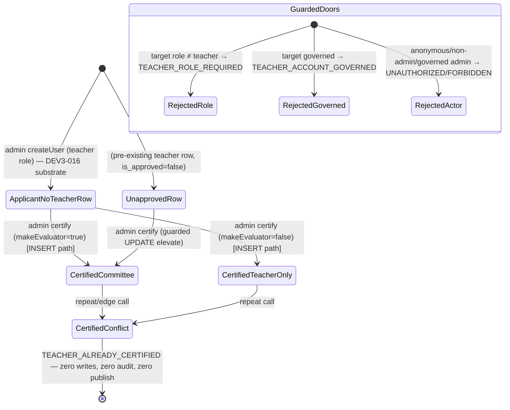

# Technical Architecture & Implementation Design: DEV3-018 — Cold-Start Bootstrapping (Direct Sheikh Certification)

> **Plan of record:** `ai/plans/sprint_3/dev3-018-cold-start-bootstrapping-direct-sheikh-c/`
> **Specs:** `ai/plans/sprint_3/dev3-018-cold-start-bootstrapping-direct-sheikh-c/specs.md` (REQ-001..REQ-083, journey J-1)
> **Canonical refs:** `docs/admin/user-management.md` (DEV3-016 substrate + scope-split), `docs/teachers/applicant-lifecycle.md` (lifecycle finalize rule), `docs/workflows/05-admin-governance-override.md` §3 (owner workflow), `docs/specs/open-decisions-and-gaps.md` (A.4/A.4.3, A.5, A.7, B.6/B.7), `docs/specs/state-machine-invariants.md` (INV-TV1..TV7, INV-U1..U5), `docs/notifications/realtime-engine.md` (single-writer + publish-after-commit), `docs/graphql/api-gateway-and-routing.md`, `docs/graphql/error-handling-contract.md`, `docs/testing/workflow-journey-tests.md`, `test/workflows/AGENTS.md`
> **Blocking dependency:** DEV3-016 (Admin User Management — SHIPPED; verified in-tree)
> **Ledger:** `ai/plans/sprint_3/dev3-018-cold-start-bootstrapping-direct-sheikh-c/deferred-items.md` (initialized in Task 0)

---

## 1. System Overview & Architecture Diagram

### 1.1 Scope Statement

DEV3-018 is a **single-mutation, service-centered ticket**: one admin-gated GraphQL mutation (`adminCertifyTeacherColdStart`) driving ONE transaction that (a) inserts or guarded-elevates the `teacher` row into the certified state, (b) finalizes the `applicants` row when present, (c) appends exactly ONE `audit_logs` (`override`) row, (d) emits ONE `evaluation_result` notification through the existing engine, and (e) publishes the receipt strictly after commit. The return payload is the refreshed `AdminUserDetail` composed through the EXISTING `AdminUserManagementService.getUserDetail` (no forked assembler).

Net-new surface:

1. **`TeacherRepository`** (NEW repo — proven ABSENT: `backend/db/repo/teachers/index.ts:1` exports only `./applicant.repository`).
2. **`ApplicantRepository.finalizeOnCertification`** (additive method on the existing repo).
3. **`admin-gate.helpers.ts`** (NEW shared service helper — extracted `assertActorAdmin` + NEW governance-extended `assertActorAdminActive`; first-lander rule per the REQ-004 extraction-collision note with DEV3-022c/022d).
4. **`ColdStartCertificationService`** (NEW orchestrator).
5. **`adminCertifyTeacherColdStart`** mutation + frontend document + i18n keys + baseline re-pins.
6. **Journey test** proving the cross-actor certification workflow end-to-end.

**Zero schema drift** (REQ-045), **zero UI** (REQ-063 — honest deferral: the admin views layer exists (users/plans surfaces), but no certification affordance exists on any admin surface yet), **zero new Pothos object/input types** (return type reuses `AdminUserDetailPothosObject` at `backend/graphql/pothos/admin/admin-user.pothos.ts:235-300`).

### 1.2 Data Flow

```text
┌── CLIENT (React 19 / Apollo 4) ───────────────────────────────────────────────┐
│ (FUTURE consumer — D-UI; this ticket ships ONLY the typed document)            │
│   useMutation(adminCertifyTeacherColdStartMutationDocument)                    │
└──────────────────────────────────┬─────────────────────────────────────────────┘
▼  Apollo → POST /api/graphql
┌── POTHOOS MUTATION ────────────────────────────────────────────────────────────┐
│ backend/graphql/mutation/admin/admin-teachers.mutation.ts  (NEW)               │
│   adminCertifyTeacherColdStart(userId: Int!, makeEvaluator: Boolean = true)    │
│     authScopes: { $all: { authenticated: true, role: [UserRole.Admin] } }      │
│     type: AdminUserDetailPothosObject (REUSED — zero new Pothos types)         │
│     thin resolver: ctx.user guard → field-by-field map → service               │
└──────────────────────────────────┬─────────────────────────────────────────────┘
▼
┌── SERVICE (NEW) ───────────────────────────────────────────────────────────────┐
│ ColdStartCertificationService.certifyTeacherColdStart(                         │
│     actorId, input, locale, options?, outerTx?)                                │
│   1. assertActorAdminActive(actorId, locale)      — role + governance, pre-tx  │
│   2. userId shape validation (positive safe int)  — pre-DB                     │
│   3. withTransaction(outerTx, tx => {                                          │
│        target  = UserRepository.findById(userId, tx)       (else USER_NOT_FOUND)
│        role check ≠ teacher → ConflictError(TEACHER_ROLE_REQUIRED)             │
│        governance check     → ConflictError(TEACHER_ACCOUNT_GOVERNED)          │
│        row = TeacherRepository.findById(userId, tx)                            │
│        ├─ row null            → insertColdStartCertified (23505 → conflict)    │
│        ├─ row.isApproved      → ConflictError(TEACHER_ALREADY_CERTIFIED)       │
│        └─ row unapproved      → elevateToCertified (guarded UPDATE;            │
│                                 zero-row → re-read → conflict)                 │
│        finalized = ApplicantRepository.finalizeOnCertification(userId, tx)     │
│        AuditService.createAuditLog({Override, "teacher", userId, details}, tx) │
│        receipt = NotificationEngine.emitForUser({…EvaluationResult…}, loc, tx, │
│                   options)                                                     │
│        detail  = AdminUserManagementService.getUserDetail(userId, locale,      │
│                    actorId, tx)   ← same-tx refreshed read (REQ-018)           │
│        return { detail, receipt }                                              │
│     })                                                                         │
│   4. POST-COMMIT ONLY: NotificationEngine.publishReceipts([receipt], …)        │
└──────────────────────────────────┬─────────────────────────────────────────────┘
▼
┌── REPOSITORIES / SHARED SUBSTRATE ─────────────────────────────────────────────┐
│ TeacherRepository (NEW)    ApplicantRepository (+finalizeOnCertification)      │
│ UserRepository.findById    AuditService.createAuditLog    (EXISTING writer)    │
│ AdminUserManagementService.getUserDetail                (EXISTING read-back)   │
│ NotificationEngine.emitForUser / publishReceipts        (EXISTING engine)      │
└──────────────────────────────────┬─────────────────────────────────────────────┘
▼
┌── POSTGRESQL ──────────────────────────────────────────────────────────────────┐
│ teacher (INSERT or guarded UPDATE) · applicants (finalize UPDATE)              │
│ audit_logs (ONE insert, in-tx) · notifications (ONE insert, in-tx)             │
│ users/wallet/subscriptions/plans/session — READ-ONLY here (REQ-020)            │
└────────────────────────────────────────────────────────────────────────────────┘
▼  (post-commit, best-effort)
Fanout transport (in-process | Redis pub/sub) → WS sidecar → certified teacher
```

### 1.3 Key Design Decisions Table

| # | Decision | Options Considered | Pros / Cons | Rationale (Maintainability, Scalability, Reliability) |
|---|---|---|---|---|
| D1 | **Service-layer actor gate WITH governance re-check** (`assertActorAdminActive`: role + `isDeleted/isBlocked/suspended`) | (a) reuse role-only `assertActorAdmin` verbatim; (b) add governance clause | (a) leaves the documented context window open — `createGraphQLContext` applies NO governance filter (`backend/graphql/gqlContextFactory.ts:167-238`, no-governance evidence at `:203-224`); a suspended admin with a live token could mint certified Shuyukh. (b) closes the blast radius at the only layer journey tests can honestly exercise | REQ-031. Deliberate divergence from the DEV3-016 role-only gate (request-time governance re-check), mirroring the DEV3-022d D5 ruling; divergence is recorded in the canonical doc |
| D2 | **Two guarded write shapes** — plain INSERT (row-absent) + guarded UPDATE `… WHERE id = ? AND is_approved = false … RETURNING` (elevation) | (a) `INSERT … ON CONFLICT DO UPDATE` upsert; (b) SELECT-then-branch-only; (c) two guarded shapes | (a) cannot distinguish "already certified" (must conflict, REQ-013) from "elevate" — the ON CONFLICT arm would silently overwrite flags, breaking JR-C-1 audit purity. (b) pure read-then-write is a raw TOCTOU hole. (c) every write's guard is atomic; zero-row outcomes route to typed conflicts | REQ-010/011/013/042. The PK unique constraint (insert path) and the predicate lock (elevate path) are the ONLY concurrency mechanisms — no `SELECT FOR UPDATE`, no advisory locks |
| D3 | **Applicants finalization is unconditional when the row exists** (`status = 'passed'`, `cooldownUntil = NULL`) | (a) finalize only when status ∈ {failed, pending}; (b) unconditional | (a) re-litigates the lifecycle's own rule — a pass clears cooldown (`docs/teachers/applicant-lifecycle.md` §1/§6) — and strand `failed`+future-cooldown rows. (b) INV-TV1(b) supreme-authority reading; idempotent on `passed` | REQ-012. `verificationAttempts`/`lastAttemptAt` are NEVER touched; the row is NEVER deleted (INV-U1/U4 history preservation) |
| D4 | **Notification via the engine's caller-tx receipt composition** — `emitForUser(…, tx, options)` inside the tx, `publishReceipts` strictly after commit | (a) engine own-commit path (no tx); (b) direct `NotificationRepository` write; (c) receipt composition | (a) a crash between commit and publish loses the push; worse, a mid-tx failure after the engine's own commit leaves a ghost row. (b) violates the single-writer rule (`docs/notifications/realtime-engine.md` §4). (c) is the engine's sanctioned composition (`notification-engine.service.ts:352-357` prove unreachable pre-commit publish) | REQ-016/041. Structural publish-after-commit; rollback ⇒ zero rows, zero pushes |
| D5 | **Return = refreshed `AdminUserManagementService.getUserDetail(userId, locale, actorId, tx)` inside the SAME tx** | (a) hand-assemble a small payload; (b) reuse | (a) forks the projection (two detail truths diverge). (b) the teacher/applicant snapshots are already resolved correctly by the DEV3-016 assembler (`assembleDetail` at `user-management.service.ts:503-580`, teacher snapshot 537-545) | REQ-018. Composition over fork; the join inside the tx sees uncommitted writes (same snapshot) so the response is truthful |
| D6 | **Shared admin gate extraction — first-lander semantics** | (a) copy `assertActorAdmin` into the new service; (b) extract to `backend/services/admin/admin-gate.helpers.ts` | (a) two gates diverge silently over time on a security boundary. (b) one site; byte-equivalence proven by the 61 service + 3 chaos existing DEV3-016 suites | REQ-004. The extraction is mechanical: move `user-management.service.ts:240-271` verbatim, re-import it there, add the NEW `assertActorAdminActive` beside it. If DEV3-022c/022d landed it first, consume-and-extend — never fork |
| D7 | **`makeEvaluator` defaults to `true` at BOTH layers** | (a) Pothos arg default only; (b) service-only; (c) both | FR-3.9: the cold-start cohort IS the Evaluation Committee (Workflow 05 §3). Layered defense: `t.arg({ type: "Boolean", defaultValue: true })` AND the service coalesces `input.makeEvaluator ?? true` so direct service callers (journey) get identical semantics | REQ-019. Committee default is the product intent, not an accident of the wire |
| D8 | **Audit `details` = fixed 3-field JSON** `{ makeEvaluator, applicantRow: "finalized"\|"absent", elevation: "created"\|"elevated" }` | (a) richer payload (names, prior status); (b) fixed triple | (a) violates the write contract's PII-minimal rule (field NAMES + metadata only — `docs/admin/user-management.md` §2.4). (b) exactly reconstructs WHO/WHAT/HOW for DEV3-020's trail browser | REQ-017. `entityType = "teacher"` follows the lowercase label vocabulary; `entityId` = target user id (non-null — NO dependency on the DEV3-022d contract widening) |
| D9 | **UI honestly deferred; document-only frontend lane** | (a) invent a page/`frontend/views/admin/**` scaffold; (b) ship the typed document, defer the view (D-UI) | (a) the admin views layer is already live (users + plans surfaces behind `/admin/users` and `/admin/plans`), but inventing a NEW teacher-certification surface here would strand an untested page and pre-empt the owning surface ticket. (b) the wire contract lands consumable; the owning surface ticket renders it | REQ-062/063. `navItems.ts` untouched; `/teachers` keeps its target; no ComingSoon regression |
| D10 | **Repeat-call safety = conflict, not idempotency keys** | (a) wire `ctx.idempotencyKey`; (b) conflict-answers-replay | This mutation is OUTSIDE the mandated `docs/IDEMPOTENCY.md` key set; the second call structurally resolves to `TEACHER_ALREADY_CERTIFIED` BEFORE any write/notify (REQ-043), mirroring the DEV3-016 admin-ops idempotency ruling (`docs/admin/user-management.md` §2.5) | REQ-043. No claim cache, no key derivation, no replay machinery |
| D11 | **Custom conflict codes ride the verified `ConflictError(code, message)` overload** | (a) new error subclasses; (b) `DomainError(code, …)` direct; (c) the overload | `backend/lib/errors.ts:170-182` ships the two-arg overload; no new class files, taxonomy stays closed | REQ-050. Codes: `TEACHER_ALREADY_CERTIFIED`, `TEACHER_ROLE_REQUIRED`, `TEACHER_ACCOUNT_GOVERNED` — SCREAMING_SNAKE per `docs/graphql/domain-error-extensions-code.md` |
| D12 | **Certification copy composed in the ADMIN's locale** (emitter-locale rule A.4.3) | (a) admin locale; (b) target's `users.locale` | Per-recipient localization is the engine's deferred D2 — never patched inline here. The engine stores title/body VERBATIM; `emitForUser` only uses locale for its own validation messages | REQ-016. Documented divergence boundary; D-LOCALE-ROUTING lands as a resolved-reference ledger entry |

---

## 2. Data Models & Database Schema

### 2.1 Existing Schema Verification (READ-ONLY — zero drift gate REQ-045)

| Element | Verified location (bundle anchor) | Columns consumed |
|---|---|---|
| `teacher` | `backend/db/schema/teachers/teacher.ts:19-38` | `id` (shared PK → `users.id`, cascade), `isApproved` (default false), `isEvaluator` (default false), `averageRating` (nullable, CHECK 0–5), `isOnline` (default false), `subjects`, `requestPreference` (default `queue`), timestamps |
| `applicants` | `backend/db/schema/teachers/applicants.ts:17-30` | `id` (shared PK), `status` (`varchar(50)` default `'pending'` — NO pgEnum), `verificationAttempts`, `lastAttemptAt`, `cooldownUntil` |
| `users` governance | `backend/db/schema/users/users.ts:30-36` | `isDeleted`, `deletedAt`, `suspended`, `suspendedAt`, `suspendedPeriodDays`, `isBlocked`, `blockedAt` |
| `audit_logs` | `backend/db/schema/audit/audit-logs.ts:30-47` | `actorId` (FK restrict), `actionType` pgEnum, `entityType` varchar(100), `entityId` **nullable int**, `details` varchar(2000), indexes `audit_logs_actor_id_idx` / `audit_logs_entity_type_entity_id_idx` |
| `notifications` | `backend/db/schema/notifications/notifications.ts:27-46` | `userId` FK cascade, `type` pgEnum (contains `evaluation_result`), `title` varchar(255), `body` text, `isRead`, `relatedEntityType/Id`, `createdAt` |
| `audit_action_type` pgEnum (7 values incl. `override`) | `backend/db/schema/enums.ts:66-74` | TS mirror `backend/enum/audit/audit-action-type.enum.ts:6-14` |
| `notification_type` pgEnum (7 values incl. `evaluation_result`) | `backend/db/schema/enums.ts:56-64` | TS mirror `backend/enum/notifications/notification-type.enum.ts:5-13` |

**Completion gate:** `git diff -- backend/db/schema/** backend/db/migration/**` MUST be EMPTY. No `bun run db push`, no new `pgEnum`, no custom SQL migration (the audit immutability-trigger question belongs to DEV3-020's REQ-018, NOT this ticket).

### 2.2 Canonical Types (NEW members only — canonical-file placement)

**UPDATE `backend/types/teachers/teacher.types.ts`** (currently only `TeacherSelectType`/`TeacherInsertType` — bundle lines 1-4, types at 3-4):

```typescript
// backend/types/teachers/teacher.types.ts (additive)
export interface TeacherColdStartCertificationInput {
  readonly userId: number;          // target user id — admin-controlled parameter
  readonly makeEvaluator: boolean;  // committee membership flag (FR-3.9); default true at layer boundaries
}
```

Barrel: `backend/types/teachers/index.ts:1-4` ALREADY re-exports `./teacher.types` — no barrel edit needed.

Consumed-verbatim (never re-declared): `TeacherSelectType`, `ApplicantSelectType`, `AdminUserDetailReturnType` (`backend/types/admin/admin-user.types.ts:192-197`), `AuditLogWriteContract` (`backend/types/contracts/admin-audit.contract.types.ts:22-30` — `entityId: number` suffices; this ticket never writes `entityId: null`), `DBTransaction` (`backend/types/db.types.ts:23`).

### 2.3 Enums consumed (value imports ONLY)

| Enum | Source (bundle anchor) | Members consumed |
|---|---|---|
| `UserRole` | `backend/enum/users/user-role.enum.ts:5-10` | `Admin`, `Teacher` |
| `AuditActionType` | `backend/enum/audit/audit-action-type.enum.ts:6-14` | `Override` |
| `ApplicantStatus` | `backend/enum/teachers/applicant-status.enum.ts:12-17` | `Passed` |
| `NotificationType` | `backend/enum/notifications/notification-type.enum.ts:5-13` | `EvaluationResult` |

**None are new. None require Pothos re-registration** (`ApplicantStatusPothosEnum`, `AuditActionTypePothosEnum`, etc. already registered at `backend/graphql/pothos/shared/enum.pothos.ts:37-129`; `ApplicantStatus` at 87-89, `AuditActionType` at 112-114).

---

## 3. API Contracts & Pothos Resolvers

### 3.1 SDL Addition (exact — REQ-060)

```graphql
extend type Mutation {
adminCertifyTeacherColdStart(userId: Int!, makeEvaluator: Boolean = true): AdminUserDetail!
}
```

- **NO new Pothos object/input types.** Return type = the existing `AdminUserDetailPothosObject` (`backend/graphql/pothos/admin/admin-user.pothos.ts:235-300`).
- **NO mutation touching `teacher` beyond this field; NO audit-mutating fields; NO additions to `PUBLIC_OPERATIONS`** (`backend/lib/gateway/public-operations.ts:36-59` stays the frozen six — its members: login, refreshToken, logout, registerUser, recitationReadings, _health — default-deny posture per `docs/graphql/api-gateway-and-routing.md` Rule 4).

### 3.2 Pothos Registration

| Layer | File | Content |
|---|---|---|
| Mutation (CREATE) | `backend/graphql/mutation/admin/admin-teachers.mutation.ts` | One `gqlSchemaBuilder.mutationField("adminCertifyTeacherColdStart", …)`. `authScopes: { $all: { authenticated: true, role: [UserRole.Admin] } }` — the load-bearing conjunction (ANY-semantics hazard documented at `docs/teachers/applicant-lifecycle.md` §3; verified precedent `backend/graphql/mutation/admin/admin-users.mutation.ts:64-66`). |
| Barrel (UPDATE) | `backend/graphql/mutation/admin/index.ts` | gains ONE line: `import "./admin-teachers.mutation";` (currently `import "./admin-users.mutation";` — line 11, still the barrel's only import) |

Resolver body (thin — field-by-field BOPLA mapping, NO `{ ...input }`, NO try/catch — DomainErrors propagate to the single finalizer per `docs/graphql/error-handling-contract.md`):

```typescript
gqlSchemaBuilder.mutationField("adminCertifyTeacherColdStart", t =>
  t.field({
    type: AdminUserDetailPothosObject,
    args: {
      userId: t.arg({ type: "Int", required: true }),
      makeEvaluator: t.arg({ type: "Boolean", required: false, defaultValue: true }),
    },
    description:
      "Admin-only cold-start certification (INV-TV1(b) / FR-3.9): promotes an existing teacher-role user to a certified founding Sheikh — inserts or elevates the teacher row (is_approved=true, is_evaluator per flag), finalizes any applicants row (passed, cooldown cleared), appends one override audit row, and notifies the teacher. Repeat calls answer TEACHER_ALREADY_CERTIFIED.",
    authScopes: { $all: { authenticated: true, role: [UserRole.Admin] } },
    resolve: async (_root, args, ctx) => {
      if (!ctx.user) {
        const tErrors = await ctx.t("errorsTranslations");
        throw new UnauthorizedError(tErrors.unauthorized);
      }
      return ColdStartCertificationService.certifyTeacherColdStart(
        ctx.user.id,
        { userId: args.userId, makeEvaluator: args.makeEvaluator },
        ctx.locale
      );
    },
  })
);
```

`ctx.t("errorsTranslations")` is the verified resolver-localization pattern (`backend/graphql/mutation/notifications/notification.mutation.ts:115-116`).

### 3.3 Error Mapping (`extensions.code`)

| Scenario | Class | `extensions.code` | Emission point |
|---|---|---|---|
| Anonymous caller | scope `$all.authenticated` throws `UnauthorizedError` | `UNAUTHORIZED` | pre-resolver (builder at `backend/graphql/pothos/builder.ts:127-132`) |
| Authenticated non-admin | scope `role` false → mapped `ForbiddenError` | `FORBIDDEN` | pre-resolver |
| Service-tier: `actorId = 0` or actor row missing | `UnauthorizedError` / `ForbiddenError` | `UNAUTHORIZED` / `FORBIDDEN` | `assertActorAdminActive` |
| Service-tier: governed admin (`isDeleted`/`isBlocked`/`suspended`) | `ForbiddenError` (deterministic order: deleted → blocked → suspended) | `FORBIDDEN` | service, pre-tx (REQ-031) |
| Malformed `userId` (0 / negative / fractional / NaN / > MAX_SAFE_INTEGER) | `ValidationError` (default code; `(message)` ctor branch) | `VALIDATION` | service, pre-tx |
| Absent target id | `NotFoundError("USER", …)` | `USER_NOT_FOUND` | in-tx, pre-write |
| Target role ≠ teacher | `ConflictError("TEACHER_ROLE_REQUIRED", …)` | `TEACHER_ROLE_REQUIRED` | in-tx, pre-write |
| Target governed | `ConflictError("TEACHER_ACCOUNT_GOVERNED", …)` | `TEACHER_ACCOUNT_GOVERNED` | in-tx, pre-write |
| Already certified (approved row / 23505 / elevate zero-row + re-read) | `ConflictError("TEACHER_ALREADY_CERTIFIED", …)` | `TEACHER_ALREADY_CERTIFIED` | in-tx |
| Unexpected internals | masked once at the boundary | `INTERNAL_SERVER_ERROR` | `finalizeGraphqlErrors` (defined at `backend/lib/errors/error-masking.ts:870`, re-exported through `@/backend/lib/errors`; applied by the `createGraphqlErrorsFinalizerPlugin` Apollo wrapper in `backend/graphql/graphqlErrorsFinalizer.ts`, which imports it at line 61) |

### 3.4 Permission Matrix

| Caller | `adminCertifyTeacherColdStart` | Notes |
|---|---|---|
| Anonymous | ❌ `UNAUTHORIZED` (401 semantics, pre-resolver) | allowlist untouched |
| Student / Parent / Teacher (authenticated) | ❌ `FORBIDDEN` (403, pre-resolver; ALSO denied service-side if ever reached) | journey step 6 |
| Admin (active) | ✅ full | the only authorized certifier |
| Admin (governed: suspended/blocked/deleted, live token) | ❌ `FORBIDDEN` at the SERVICE tier (D1/REQ-031) | closes the documented governance window for THIS high-blast mutation |
| Supervisor | N/A — no such `UserRole` exists (`backend/enum/users/user-role.enum.ts:5-10`) | — |

### 3.5 Schema-Baseline Updates (SAME change set — REQ-061)

| File | Update |
|---|---|
| `backend/graphql/test/sdl-static-assertions.test.ts` | `FROZEN_MUTATION_FIELDS` gains `"adminCertifyTeacherColdStart"` ((sorted; current list at lines 67-75) |
| `backend/graphql/test/schema-surface.test.ts` | `PRE_3_1_MUTATION_FIELDS` gains `"adminCertifyTeacherColdStart"` (sorted — ascends first: `"adminCertifyTeacherColdStart" < "createPlan"`). **Verification-first reconciliation rule:** the bundle's frozen arrays visibly lag the live tree — `sdl-static-assertions.test.ts` `FROZEN_MUTATION_FIELDS` omits the already-shipped `adminCreateUser`/`adminUpdateUser`/`adminSetUserDeleted` AND `createPlan`/`updatePlan`/`setPlanActiveStatus`, its `FROZEN_QUERY_FIELDS` omits the shipped admin queries, and `schema-surface.test.ts` `PRE_3_1_MUTATION_FIELDS` omits the three admin mutations as well; at implementation time the baseline lists are re-pinned to the CURRENT live inventory PLUS the new field in the same changeset — never shrink-wrapped to the stale bundle view |
| `frontend/graphql/generated/**` | `bun run generate:gqlSchema && bun codegen`; committed in the change set; committed-vs-live SDL byte-parity (`backend/graphql/test/plan-catalog.schema.test.ts:67-73` precedent) stays green |
| `backend/graphql/test/handshake-code-surface.test.ts:276-290` | UNCHANGED — frozen-six public allowlist stays green untouched (this op is NOT public) |

---

## 4. Backend Services, Repositories & Concurrency Model

### 4.1 Shared Gate Module — `backend/services/admin/admin-gate.helpers.ts` (CREATE, first-lander)

```typescript
// EXTRACTED VERBATIM from backend/services/admin/user-management.service.ts:240-271
export async function assertActorAdmin(
  actorId: number,
  locale: string,
  outerTx?: DBTransaction
): Promise<void>;

// NEW — role gate PLUS governance fail-close (REQ-031, deterministic order):
// isDeleted → ForbiddenError(t.accountDeleted); isBlocked → ForbiddenError(t.accountBlocked);
// suspended → ForbiddenError(t.accountSuspended)
export async function assertActorAdminActive(
  actorId: number,
  locale: string,
  outerTx?: DBTransaction
): Promise<void>;
```

- **UPDATE** `backend/services/admin/user-management.service.ts`: delete the private `assertActorAdmin` copy, import from the helper. ZERO behavior drift — its suites (`user-management.service.test.ts` 61 tests + `user-management.chaos.test.ts` 3 tests) are the byte-parity regression lock.
- Governance copy reuses EXISTING flat `errors` keys (`accountDeleted`/`accountBlocked`/`accountSuspended` — `shared/locale/en/errors/index.ts:17-19`); no new denial keys minted for the actor lane.
- Barrel: `backend/services/admin/index.ts` gains `export * from "./admin-gate.helpers";` (currently lines 9-10 export `./audit.service` + `./user-management.service`).
- Every denial = ONE `logger.logDomainError` with `{ code, entity: "user", entityId: actorId, locale }`, ZERO reads/writes past the gate (JR-C-1 parity).

### 4.2 Repository — `backend/db/repo/teachers/teacher.repository.ts` (CREATE)

Namespace `TeacherRepository`; every method accepts `tx?: DBTransaction` LAST; executor discipline `(tx ?? db)`.

| Method | Signature | Semantics |
|---|---|---|
| `findById` | `(id: number, tx?: DBTransaction) => Promise<TeacherSelectType \| null>` | plain PK read (Drizzle builder; verification-first: the `tx ?? db` branch mirrors the first `tx ?? db` site at `admin-user.repository.ts:399`; the pattern recurs throughout the file) |
| `insertColdStartCertified` | `(id: number, makeEvaluator: boolean, tx: DBTransaction) => Promise<TeacherSelectType>` | plain `INSERT` with `id`, `isApproved: true`, `isEvaluator: makeEvaluator` — schema defaults carry `averageRating: null`, `isOnline: false`, `subjects: null`, `requestPreference: "queue"` (`backend/db/schema/teachers/teacher.ts:25-30`). A duplicate PK surfaces the raw 23505 —translation is the SERVICE's concern. |
| `elevateToCertified` | `(id: number, makeEvaluator: boolean, tx: DBTransaction) => Promise<TeacherSelectType \| null>` | SINGLE guarded `UPDATE teacher SET isApproved = true, isEvaluator = <flag>, updatedAt = now() WHERE id = ? AND isApproved = false RETURNING *` — predicate evaluated under the PG row lock; zero rows ⇒ the row is absent or already approved (service disambiguates) |

Barrel: `backend/db/repo/teachers/index.ts` gains `export * from "./teacher.repository";` (currently line 1 only).

**Repository rules honored:** no prepared statements on writes (`docs/drizzle/prepared-statements.md`); no `inArray` + placeholder combos; NO inline `--` comments inside any `sql` template; field-by-field insert values (never spread).

### 4.3 Repository — `ApplicantRepository.finalizeOnCertification` (ADDITIVE — `backend/db/repo/teachers/applicant.repository.ts`)

```typescript
export async function finalizeOnCertification(
  userId: number,
  tx?: DBTransaction
): Promise<boolean>;
```

SINGLE `UPDATE applicants SET status = ${ApplicantStatus.Passed}, cooldownUntil = null, updatedAt = now() WHERE id = ? RETURNING id` — returns `true` iff a row was finalized. Unconditional by design (REQ-012): prior status (`pending`/`in_evaluation`/`failed`) and any active cooldown are superseded; `verificationAttempts`/`lastAttemptAt` untouched; the row is NEVER deleted.

### 4.4 Service — `backend/services/admin/cold-start-certification.service.ts` (CREATE)

```typescript
export namespace ColdStartCertificationService {
  export async function certifyTeacherColdStart(
    actorId: number,
    input: TeacherColdStartCertificationInput,
    locale: string,
    options?: NotificationEngineCallOptions,   // engine injection seam (transport/cache)
    outerTx?: DBTransaction
  ): Promise<AdminUserDetailReturnType>;
}
```

Pipeline (strict order = REQ-052 denial precedence):

1. **Gate (pre-tx, pre-DB):** `await assertActorAdminActive(actorId, locale)` (D1).
2. **Shape validation (pre-tx):** `input.userId` must be a positive safe integer (`Number.isInteger && > 0 && <= MAX_SAFE_INTEGER`) else `ValidationError(t.validation)`. `makeEvaluator = input.makeEvaluator ?? true` coalesced here (D7).
3. **Transaction** via `withTransaction(outerTx, async tx => { … })` (imported from `@/backend/lib/db/with-transaction` at `user-management.service.ts:67`; call sites `:881, 946, 987`):
   - `target = await UserRepository.findById(userId, tx)` (`backend/db/repo/users/user.repository.ts:75-95` — its `tx` param is `DBQueryExecutor`); `null` → `logDomainError` + `NotFoundError("USER", t.adminUsers.userNotFound)` (admin-surface oracle ruling — `docs/admin/user-management.md` REQ-032/§4).
   - `toUserRole(target.role) !== UserRole.Teacher` → `ConflictError("TEACHER_ROLE_REQUIRED", t.teacherRoleRequired)` (value imports; never coerce `users.role`).
   - `target.isDeleted || target.isBlocked || target.suspended` → `ConflictError("TEACHER_ACCOUNT_GOVERNED", t.teacherAccountGoverned)` (NULL-safe reads; no suspension-window hysteresis — mirrors the SSR hard-stop at `backend/lib/auth/server-auth.ts:97-106`; REQ-015).
   - `existing = await TeacherRepository.findById(userId, tx)`.
   - Row assembly (D2):
     - `existing === null` → `elevation = "created"`; `await TeacherRepository.insertColdStartCertified(userId, makeEvaluator, tx)` — wrap in the cause-chain translator: 23505 → `ConflictError("TEACHER_ALREADY_CERTIFIED", t.teacherAlreadyCertified)` (cause-chain traversal parity with `translateDbError` at `backend/lib/errors.ts:200-208` and `isUniqueViolation` at `backend/services/shared/user-provisioning.helpers.ts:74`; everything else rethrows).
     - `existing.isApproved === true` → `ConflictError("TEACHER_ALREADY_CERTIFIED", t.teacherAlreadyCertified)` (REQ-013; zero writes).
     - else → `elevated = await TeacherRepository.elevateToCertified(userId, makeEvaluator, tx)`; `elevated === null` → cold-path re-read: `reRead = await TeacherRepository.findById(userId, tx)`; `reRead?.isApproved === true` → `ConflictError("TEACHER_ALREADY_CERTIFIED", …)`; otherwise rethrow the masked-lane error (unexpected internal).
   - `applicantFinalized = await ApplicantRepository.finalizeOnCertification(userId, tx)`.
   - Audit (same tx, exactly once — REQ-017): `await AuditService.createAuditLog({ actorId, actionType: AuditActionType.Override, entityType: "teacher", entityId: userId, details: JSON.stringify({ makeEvaluator, applicantRow: applicantFinalized ? "finalized" : "absent", elevation }) }, tx)` (D8 shape; ≤2000 chars by construction — the writer's `truncateDetailsSafely` at `audit.service.ts:51-63` is the belt).
   - Notification (same tx — REQ-016): copy composed from `getServerTranslations(locale).applicantTranslations.coldStartCertifiedTitle/coldStartCertifiedBody` (ADMIN locale — D12); `receipt = await NotificationEngine.emitForUser({ userId, type: NotificationType.EvaluationResult, title, body, relatedEntityType: "teacher", relatedEntityId: userId }, locale, tx, options)` (engine signature verified at `notification-engine.service.ts:327-369`).
   - `detail = await AdminUserManagementService.getUserDetail(userId, locale, actorId, tx)` (REQ-018 — same-tx refreshed read; its internal `assertActorAdmin` re-runs against the now-shared helper).
   - Return `{ detail, receipt }` (internal bridge shape — receipt stripped before the service returns).
4. **Post-commit ONLY:** `await NotificationEngine.publishReceipts([receipt], locale, options)` (D4); publish failure degrades to engine-owned `NOTIFICATION_DELIVERY_DEGRADED` — rows stay committed.
5. Return `detail`.

**Log hygiene (REQ-034):** denials log ONCE each with bounded `{ code, entity: "users" | "teacher", entityId, locale }`; NEVER target email/name, NEVER the details payload, NEVER tokens; happy path emits ZERO domain logs (silent-success parity).

### 4.5 Concurrency & Race Condition Assessment

| Scenario | Actors | Risk | Mitigation |
|---|---|---|---|
| Concurrent certify ×2, NO pre-existing `teacher` row | admin A × admin B, same target | double insert | PK unique constraint: loser gets 23505 → `TEACHER_ALREADY_CERTIFIED`; the loser's `withTransaction` aborts ⇒ ZERO residual teacher/applicants/audit/notification rows and ZERO publishes (publish is structurally unreachable pre-commit — `notification-engine.service.ts:352-357` proof pattern). Chaos test proves exactly one audit row + one notification row TOTAL (REQ-072a) |
| Concurrent certify ×2, EXISTING unapproved row | admin A × admin B | double elevate | Guarded `UPDATE … WHERE is_approved = false` serializes under the PG row lock; the loser's predicate re-evaluates false post-lock → zero rows → cold-path re-read → conflict. Exactly one commit; loser leaves zero residue (REQ-042) |
| Certify racing DEV3-016 `createUser` of the same target | admin × admin | target row half-visible | `UserRepository.findById` inside OUR tx sees only committed rows — a not-yet-committed user reads as `USER_NOT_FOUND` (honest, retryable). A committed-user/uncommitted-applicant interleave yields `applicantRow: "absent"` truthfully. No lock needed — documented |
| Target governed mid-transaction (suspended between our governance read and the insert) | governance writer × certifier | a concurrently-governed target gets certified | Accepted TOCTOU window: eligibility is an as-of-snapshot property inside our tx; a later suspension is a separate admin action. FK (`teacher.id → users.id`) guarantees no orphan. Documented; NO `SELECT FOR UPDATE` (no shared mutable balance/flag warrants blocking sibling governance writes) |
| Mid-stage forced failure (finalize stage throws) | infra | partial certification | REQ-041: `withTransaction` aborts → zero `teacher`/`applicants`/`audit_logs`/`notifications` residue; publish unreachable. Journey + chaos tier prove it via spy-injected repo failure |
| Double-submit (UI retry / double-click) | one admin | duplicate certify | REQ-043: repeat resolves to `TEACHER_ALREADY_CERTIFIED` BEFORE any second notification/audit row |
| Reads interleaved with the write | Admin B observer | torn snapshot | Observer reads run after our commit or before it — both honest; no intra-snapshot tearing because ALL of our writes share ONE tx |
| 25-way parallel certify storm over DISTINCT targets | many admins | contention | Independent transactions; append-only sinks (`audit_logs`, `notifications`); no shared row → all-fulfilled, per-target correctness (`skip-when-pglite` honored) |

**Explicit non-usage (documented so future tickets don't re-litigate):** NO `SELECT FOR UPDATE`, NO advisory locks, NO Redis `SET NX EX`, NO optimistic versioning — correctness derives from the PK unique constraint + the guarded UPDATE predicate + insert-only ledger semantics.

### 4.6 Cross-Actor Journey Design (MANDATORY — specs §2.9)

**Shared-entity state machine (target `teacher` certification):**



**Side-effect matrix (per successful transition):**

| Transition (actor → action) | Rows created/updated (ALL in ONE tx) | Notification (channel → recipient) | Audit row | Publish |
|---|---|---|---|---|
| ApplicantNoTeacherRow → Certified* (Admin A → `certifyTeacherColdStart`, makeEvaluator=true) | `teacher` INSERT `{isApproved:true, isEvaluator:true}`; `applicants` UPDATE `{status:'passed', cooldown_until:null}` | ONE `notifications` row (`evaluation_result`, userId=target, `relatedEntityType:"teacher"`) — in-tx via engine | ONE row: `Override`, `entityType:"teacher"`, entityId=target, `details={makeEvaluator:true, applicantRow:"finalized", elevation:"created"}` | ONE envelope → `[target]` (post-commit) |
| UnapprovedRow → Certified* (Admin A, makeEvaluator=false) | `teacher` guarded UPDATE `{isApproved:true, isEvaluator:false}`; `applicants` finalize (if row exists) | same shape | `details={makeEvaluator:false, applicantRow:"absent"|"finalized", elevation:"elevated"}` | ONE envelope |
| Any denial/conflict path | ZERO writes | ZERO rows | ZERO rows (JR-C-1) | ZERO envelopes |

**Cross-Actor Visibility Matrix (post-step):**

| After step | Admin A (author) | Admin B (observer) | Founding Sheikh (target) | Student/other roles |
|---|---|---|---|---|
| Step 2 (createUser) | detail + own Create audit row | same via existing reads | — (no notify from create) | no access |
| Step 3 (certify commits) | detail shows `teacher{approved,evaluator}` + `applicant{passed}` | **observes the SAME state cross-actor** via `getUserDetail` + BOTH audit entries (Create + Override) newest-first via `getUserActivity`, attributed to Admin A | ONE `evaluation_result` row in OWN inbox (`listMyNotifications`); verdict copy in admin-locale | denied — `FORBIDDEN` server-side |
| Step 4 (notifications read) | — | — | inbox contains the certification | foreign inboxes byte-identical |
| Steps 6–9 (denial probes) | zero state movement | zero state movement | zero state movement | zero state movement |
| Step 10 (repeat conflict) | `TEACHER_ALREADY_CERTIFIED`; audit count for target stays EXACTLY 2 | observer sees unchanged trail | NO second notification | — |
| Step 11 (cooldown supersession) | succeeded despite future `cooldownUntil`; applicant row ends `passed` + null cooldown | observer sees the finalized lifecycle | notified | — |
| Step 13 (teardown) | baseline restored; re-probes prove zero residue | — | — | — |

**Journey harness obligations (REQ-075):** `test/workflows/admin/cold-start-certification.journey.test.ts` — TEST-FIRST before the service surface lands; `runInRollback` FORBIDDEN; committed fixtures in ONE `db.transaction` in `beforeAll`; actors via `provisionAdminActor`/`provisionStudentActor` (REAL users + role-child rows — defined at `test/workflows/helpers/actor-context.ts:136` and `:88`, documented in `test/workflows/AGENTS.md`; `SpiedFanoutTransport` is pinned by `backend/services/notifications/realtime/fanout-transport.test.ts` — doc comment :5-7, import :25); service calls carry honest actor ids; fan-out spied via the service's `options` seam using `SpiedFanoutTransport`; tracked teardown in FK-safe order with `TrackedFixtures` semantics — notification rows by recipient ids, audit rows through `withAuditDeleteTriggersSuspended` (`test/helpers/db-cleanup.ts:83`, JSDoc 72-82), then re-probe zero-residue; unique prefix `jrn_cold_<uuid8>`; run via `bun run test/scripts/run-test.ts test/workflows/admin/cold-start-certification.journey.test.ts`.

---

## 5. Frontend UX & Navigation Specification

### 5.1 Routes & URLs Table

| Path | Purpose | Required permission | Allowed roles |
|---|---|---|---|
| *(none — NO new route in this ticket)* | — | — | — |

This ticket ships a **mutation + typed document only** (D9 / REQ-063). The admin certification affordance (a button on a future admin teacher/user surface) is ledger item **D-UI** owned by the admin teacher-management surface ticket.

### 5.2 Sidebar & Navigation Integration

**UNTOUCHED.** `frontend/views/dashboard/navItems.ts` is NOT edited; the admin `/teachers` nav item keeps its current target; there is NO mobile bottom-nav component (mobile uses the existing temporary MUI `Drawer` in `DashboardSidebar.tsx`) — no slot work exists here.

### 5.3 Per-Audience Rendering

| Audience | Render |
|---|---|
| Admin | (future) the D-UI affordance on the admin teacher surface |
| Student / Teacher / Parent | nothing — no surface exists for them; the mutation denies them pre-resolver |
| Certified teacher (post-certification) | observes ONE `evaluation_result` notification in the EXISTING inbox surface (badge/drawer — zero recipient-side UI changes; DEV3-010 substrate consumes the new rows unchanged) |

### 5.4 Apollo Document (CREATE — REQ-062)

**CREATE `frontend/graphql/sharedDocuments/admin/teacher-certification.documents.ts`:**

```typescript
import { gql, type TypedDocumentNode } from "@apollo/client";
import type {
  AdminCertifyTeacherColdStartMutation,
  AdminCertifyTeacherColdStartMutationVariables,
} from "@/frontend/graphql/generated/gql/graphql";

export const adminCertifyTeacherColdStartMutationDocument: TypedDocumentNode<
  AdminCertifyTeacherColdStartMutation,
  AdminCertifyTeacherColdStartMutationVariables
> = gql`
  mutation AdminCertifyTeacherColdStart($userId: Int!, $makeEvaluator: Boolean = true) {
    adminCertifyTeacherColdStart(userId: $userId, makeEvaluator: $makeEvaluator) {
      id
      role
      isDeleted
      suspended
      isBlocked
      applicant {
        id
        status
      }
      teacher {
        isApproved
        isEvaluator
        isOnline
        averageRating
      }
    }
  }
`;
```

- `id` selected FIRST (Apollo normalization — `AdminUserDetail` is an IDENTITY type, so NO `keyFields: false` entry is added; `frontend/providers/apollo/apolloCache.ts` untouched).
- Barrel: `frontend/graphql/sharedDocuments/admin/index.ts` gains `export * from "./teacher-certification.documents";` (currently line 9 re-exports `./admin-users.documents`; lines 1-8 are the file JSDoc); top-level barrel already re-exports `./admin` (`frontend/graphql/sharedDocuments/index.ts:1`).
- Hooks (for the future consumer): `useMutation` from `@apollo/client/react` ONLY; `useLazyQuery` is banned.
- **Documents contract test (CREATE):** `frontend/graphql/sharedDocuments/admin/teacher-certification.documents.test.ts` mirroring `plan-catalog.documents.test.ts` — named operation `AdminCertifyTeacherColdStart`, exact variable set `{userId, makeEvaluator}`, `id`-first selection pin, barrel-identity pin (top-level barrel re-exports the SAME instance — cache-key safety precedent at `sharedDocuments/documents.contract.test.ts`).

### 5.5 Visual Design & Responsive Specifications

**No markup ships.** The forward constraint (REQ-064) binds the D-UI follow-up: when the affordance lands it MUST obey MUI v9 discipline — `sx`-only styling, `theme.palette.*` tokens, `*Outlined` icons, ≥44px touch targets, RTL mirroring via logical properties, `React.SubmitEvent` discipline, denial surfacing through `PermissionDeniedFallback`/the container's local inline alert — and its confirm dialog MUST name the committee effect (makeEvaluator semantics) before the admin commits.

**Agent-Browser Verification Protocol (deferred with D-UI):** the follow-up's verification will run the sanctioned browser flow (`test/ui/AGENTS.md` — `bun run scripts/browser-login.ts --inject`), visiting the admin teacher surface at 1440/768/375 in both `en` (LTR) and `ar` (RTL) with subagent-isolated screenshot inspection.

---

## 6. Security, Authorization & Tenancy Mitigations

| Threat Class | Mitigation (load-bearing, test-pinned) |
|---|---|
| **BFLA** | `$all: { authenticated: true, role: [UserRole.Admin] }` at the schema tier (ANY-semantics hazard closed); service-tier re-verification via `assertActorAdminActive` — anonymous id `0` → `UnauthorizedError`; resolvable non-admin → `ForbiddenError`; governed admin → `ForbiddenError` with the governance deny (deleted → blocked → suspended order) — ALL pre-DB, ZERO writes, ZERO audit rows (JR-C-1). `PUBLIC_OPERATIONS` untouched (frozen six). |
| **Governance window (honest ruling)** | `createGraphQLContext` applies NO governance filter (`gqlContextFactory.ts:167-238`) and `UserRepository.findById` applies none — this ticket does NOT pretend the context boundary is fail-closed. For this high-blast mutation the window is CLOSED locally at the service layer (D1); the divergence and rationale are recorded in `docs/admin/cold-start-certification.md`. |
| **BOLA / IDOR** | `actorId` is ALWAYS `ctx.user.id` (never input). `userId` is a legitimate admin-controlled target parameter; the `USER_NOT_FOUND` existence-oracle ruling applies ONLY because this is an admin-gated surface (`docs/admin/user-management.md` §4) and MUST NOT be exported to non-admin surfaces. Reads/writes never join across tenant boundaries (none exist on this admin-global surface). |
| **BOPLA (mass assignment)** | Resolver maps `{ userId, makeEvaluator }` field-by-field; the service builds insert/update payloads field-by-field; `{ ...input }` never reaches a repo. Smuggled fields (`role`, `isApproved`, `status`, `id`, extra root args) die at `GRAPHQL_VALIDATION_FAILED` before any resolver — wire-probe pinned. Server-owned values (`id`, flags, timestamps) are structurally unreachable through input. |
| **Certification-integrity (INV-TV1)** | The ONLY paths minting `teacher` rows remain: this admin mutation, and the (future) aggregation flow. The service NEVER touches `is_approved=false → true` outside the guarded UPDATE; `requestPreference`/`subjects`/rating are never coerced by this flow. |
| **History preservation (INV-U1/U4/U5)** | ZERO deletes anywhere; the `applicants` row survives (only `status`/`cooldownUntil`/`updatedAt` change); users/wallet/subscription/financial rows are never written (REQ-020 oracle tests). |
| **SQL injection / wildcards** | No LIKE/ILIKE surface exists (no search input) — the `escapeLikeWildcards` obligation is N/A BY CONSTRUCTION here. All values are Drizzle-bound parameters; no string concatenation; NO inline `--` comments inside `sql` templates (parameter-binding hazard); no prepared statements on writes; no `inArray`+placeholder. |
| **PII / content hygiene** | Audit `details` = fixed 3-field JSON (flags only — never names/emails/content, D8); actor disclosure on the trail remains `actorId`+actor-name resolution as per DEV3-016. Denial messages come from compile-time i18n only; no error path discloses anything beyond the closed code set. |
| **Log hygiene** | `logger.logDomainError` with bounded `{ code, entity, entityId, locale }` context; NEVER target contact PII, NEVER the details payload, NEVER tokens; `console.*` FORBIDDEN (`@/backend/lib/logger` / `@/frontend/lib/logger` only); happy path silent (REQ-034/053). |
| **Error disclosure / masking** | Closed error-class set (REQ-050); unexpected internals mask ONCE at the finalizer (`finalizeGraphqlErrors`, defined at `backend/lib/errors/error-masking.ts:870` and re-exported through `@/backend/lib/errors`, applied by the `createGraphqlErrorsFinalizerPlugin` Apollo wrapper in `backend/graphql/graphqlErrorsFinalizer.ts`) to `INTERNAL_SERVER_ERROR` with stack/driver detail stripped; resolvers carry NO try/catch. |
| **Rate limiting** | Unchanged posture (existing fail-open stub per `docs/parents/handshake-code-discovery.md` R6); a bespoke certification limiter is a recorded forward item for the rate-limiting hardening stream — NOT built here (REQ-035). |
| **Idempotency posture** | Out of the mandated key set; repeat-call safety = the `TEACHER_ALREADY_CERTIFIED` conflict BEFORE any side effect (D10 / REQ-043) — documented, not key-wired. |

---

## Deferred items (pre-registered in `ai/plans/sprint_3/dev3-018-cold-start-bootstrapping-direct-sheikh-c/deferred-items.md` at Task 0 — resolved-as-reference entries only)

| ID | Item | Owning direction | Status at plan time |
|---|---|---|---|
| D-UI | Admin "Certify (cold-start)" affordance (page/button on the future admin teacher surface) | the admin teacher-management surface ticket | ✅ reference |
| D-EVALUATOR-ELEVATION | Elevating `is_evaluator` on an ALREADY-certified teacher | separate governance mutation ticket | ✅ reference |
| D-LOCALE-ROUTING | Per-recipient notification localization (target's `users.locale`) | engine D2 lineage (`docs/notifications/realtime-engine.md` §3.3) | ✅ reference |
| D-RATE-LIMIT | Bespoke certification mutation rate limiter | rate-limiting hardening stream | ✅ reference |
| D-GATE-SHARING | If DEV3-022c/022d land the gate module first, consume-and-extend instead of creating | cross-ticket coordination (REQ-004) | ✅ reference |

**End-state gates (REQ-076/083):** `grep -c "❌\|⚠️" ai/plans/sprint_3/dev3-018-cold-start-bootstrapping-direct-sheikh-c/deferred-items.md` MUST equal 0; `@plan-review` passes with zero violations BEFORE any implementation (`outcome/plan-review-R1.md` exists); baseline deltas (tsgo/biome/lint) = ZERO new errors; `git diff -- backend/db/schema/** backend/db/migration/**` EMPTY; canonical doc `docs/admin/cold-start-certification.md` exists; AGENTS propagation (§2.8: `backend/services/AGENTS.md` single-writer rule line, `backend/db/repo/AGENTS.md` TeacherRepository line, root `AGENTS.md` Important References line, plus the one-line SHIPPED pointers in `docs/admin/user-management.md` §6 and `docs/teachers/applicant-lifecycle.md` §6) lands before closure.
