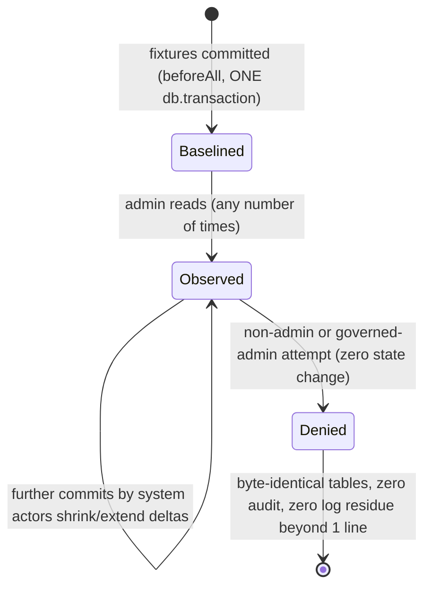

```markdown
# Technical Architecture & Implementation Design: DEV3-022c — Platform Analytics Dashboard

> **Plan of record:** `ai/plans/sprint_3/dev3-022c-platform-analytics-dashboard`
> **Specs:** `ai/plans/sprint_3/dev3-022c-platform-analytics-dashboard/specs.md` REQ-001..REQ-083
> **Canonical refs:** `docs/admin/user-management.md`, `docs/notifications/realtime-engine.md`, `docs/graphql/api-gateway-and-routing.md`, `docs/graphql/error-handling-contract.md`, `docs/graphql/domain-error-extensions-code.md`, `docs/drizzle/prepared-statements.md`, `docs/graphql/dataloader-batching.md`, `docs/specs/open-decisions-and-gaps.md` (A.5, A.7, A.9, B.9, B.15, B.6/B.7), `docs/specs/state-machine-invariants.md` (INV-S*/B*/W*/E*/PAY* — read-only consumption), `docs/workflows/05-admin-governance-override.md` (hosting workflow — audit posture §7.2), `docs/specs/functional-requirements.md:276` (FR-10.6), `docs/scenarios/user-story-map.md:142` ("Platform Analytics"), `docs/testing/workflow-journey-tests.md`
> **Blocking dependency:** DEV3-016 (admin user-management substrate incl. `AdminUserRepository.getStats`) — shipped and test-locked.

---

## 1. System Overview & Architecture Diagram

### 1.1 Scope Statement

DEV3-022c is a **read-only aggregate surface**: one admin-gated snapshot query composing user counters (reused verbatim), session lifecycle counters, revenue aggregates, subscription distribution, teacher presence, rating aggregates, operational health indicators, and two 30-day zero-filled trend series. Net-new work:

1. **Analytics aggregate repository** — NEW `PlatformAnalyticsRepository` (`backend/db/repo/admin/platform-analytics.repository.ts`): set-oriented aggregate reads over `session`, `student_payments`, `subscriptions`, `teacher`, `reports`, `evaluations`, `teacher_transaction`, and one users-domain read (`recentlyActive24h`).
2. **Snapshot service** — `PlatformAnalyticsService.getPlatformAnalytics(actorId, locale, outerTx?)`: actor re-verification WITH governance guard (divergence from role-only `assertActorAdmin`, justified by the documented non-fail-closed GraphQL context), ONE captured `now`, ONE `withTransaction`, silent happy path.
3. **Zero-argument admin query** — `adminPlatformAnalytics: PlatformAnalytics!` with the load-bearing `$all` scope.
4. **Admin page** — `app/(dashboard)/admin/analytics/page.tsx` + `PlatformAnalyticsContainer` (cards + two `recharts` charts + polling).
5. **Permanent test locks** — repo 4-tier, service denial matrix, GraphQL wire matrix, journey suite (`test/workflows/admin/platform-analytics.journey.test.ts`, TEST-FIRST), documents/cache/nav/i18n suites.
6. **Fixture helpers** — `backend/db/test/entity-setup.ts` gains subscription/payment/session/report/evaluation/wallet/teacher-transaction factories (NONE exist today — verified gap against the full `backend/db/test/entity-setup.ts` inventory — the file is 174 lines; eight fixture factories are confirmed ABSENT).

Zero schema changes: `git diff` on `backend/db/schema/**` and `backend/db/migration/**` MUST remain empty (REQ-043). No new enums (session/subscription counters are plain `Int` fields — the SDL gains no enum). No error taxonomy changes (`errors` namespace untouched).

### 1.2 Data Flow

```text
┌── CLIENT (React 19 / Apollo 4) ──────────────────────────────────────────────┐
│ app/(dashboard)/admin/analytics/page.tsx  (Server Component, withPageAuth)     │
│   └─ <PlatformAnalyticsContainer />  ("use client")                            │
│        useQuery(adminPlatformAnalyticsQueryDocument, { pollInterval: 120000 }) │
└──────────────────────────────────┬─────────────────────────────────────────────┘
▼ Apollo POST /api/graphql
┌── POTHOES QUERY ─────────────────────────────────────────────────────────────┐
│ backend/graphql/query/admin/platform-analytics.query.ts                        │
│   authScopes: { $all: { authenticated: true, role: [UserRole.Admin] } }        │
│   ZERO args · thin resolver: ctx.user.id + ctx.locale → service                │
└──────────────────────────────────┬─────────────────────────────────────────────┘
▼
┌── SERVICE (NEW) ─────────────────────────────────────────────────────────────┐
│ PlatformAnalyticsService.getPlatformAnalytics(actorId, locale, outerTx?)       │
│   1. actor re-check (findById → role=admin → governance deleted→blocked→       │
│      suspended) — PRE-TX, zero reads beyond the actor row                      │
│   2. withTransaction(outerTx):                                                 │
│        const now = new Date()   ← captured ONCE                                │
│        AdminUserRepository.getStats(tx)                         (REUSE)        │
│        PlatformAnalyticsRepository.{countRecentlyActiveUsers,                  │
│          getSessionStats, getSessionDailyTrend, getRevenueStats,               │
│          getRevenueDailyTrend, getSubscriptionStats, getTeacherPresenceStats,  │
│          getRatingStats, getHealthIndicators}(now, tx)                         │
│   3. pure assembly: trend skeleton zero-fill + money-as-string passthrough     │
└──────────────────────────────────┬─────────────────────────────────────────────┘
▼
┌── REPOSITORIES ──────────────────────────────────────────────────────────────┐
│ AdminUserRepository.getStats (UNTOUCHED — verify-only)                        │
│ PlatformAnalyticsRepository (NEW — dynamic aggregate reads only)               │
└──────────────────────────────────┬─────────────────────────────────────────────┘
▼
┌── POSTGRESQL (READ-ONLY) ────────────────────────────────────────────────────┐
│ users · session · student_payments · subscriptions · teacher · reports ·       │
│ evaluations · teacher_transaction — every table byte-identical pre/post read   │
└───────────────────────────────────────────────────────────────────────────────┘
```

### 1.3 Key Design Decisions Table

| # | Decision | Options Considered | Pros / Cons | Rationale (Maintainability, Scalability, Reliability) |
|---|---|---|---|---|
| D1 | `recentlyActive24h` lives in the NEW `PlatformAnalyticsRepository`, NOT as an edit to `AdminUserRepository` | (a) extend `AdminUserRepository.getStats`; (b) new repo method | (a) keeps the users payload monolithic but churns the DEV3-016 test-locked repo and its service-tier lock suite. (b) zero blast radius on shipped code; the service composes `getStats` + the new count at the type level via intersection. | (b). REQ-002 reuse-not-rebuild + REQ-004's mandated intersection type (`AdminUserStatsReturnType & { recentlyActive24h }`) — composition over modification. |
| D2 | ONE captured `now: Date` is bound as a **parameter** into every window predicate (no SQL `now()`) | (a) SQL `now()` per statement; (b) captured `new Date()` bound parameters | (a) is the proven subquery's shape (`admin-user.repository.ts:337-346` semantics) but drifts per-statement and is un-injectable in tests. (b) satisfies REQ-011/REA-026 verbatim and keeps repos pure. | (b). Deterministic testability + single-instant coherence within the request. The ACTIVE-window *semantics* are mirrored; only the clock source changes (bound param). |
| D3 | Money crosses the stack as **exact decimal strings** (`sum(...)::text`, `::numeric` preserved) — never JS `number` | (a) `Number(sum)`; (b) `::text` strings on the wire (`String!`) | (a) floats drift (0.1+0.2 class) and PG numeric→number coercion is lossy at scale. (b) exact; SDL field type is `String!`; the container formats for display only. | (b). REQ-014 hard rule. Mirrors the plan catalog's `price: String!` precedent (`backend/graphql/pothos/billing/plan.pothos.ts:26-28`). |
| D4 | Offline activations are a **separate counter**, never folded into revenue | (a) merge into revenue totals; (b) `offlineActivationsCount` standalone | (a) fabricates money the gateway never processed (INV-PAY5/B.9 — offline bypasses `student_payments`). (b) honest. | (b). REQ-015. The canonical doc states the exclusion verbatim. |
| D5 | Rating averages exposed as **nullable `Float`**, rounded in SQL (`round(avg(...)::numeric, 2)::float8`), `null` on empty tables | (a) JS-side rounding; (b) SQL rounding + null passthrough | (a) re-introduces float drift at the exact presentation boundary. (b) PG rounds the exact numeric, then float8 is presentational only. | (b). REQ-018 honest-emptiness + exact 2-decimal pin; REQ-060 nullable-Float SDL. |
| D6 | Trend zero-fill assembly lives in the **service** (pure function over a 30-day skeleton); repos return sparse rows | (a) SQL `generate_series` left-join; (b) sparse rows + TS assembly | (a) is more SQL surface (CTE + join + timezone choreography) for a bounded 30-cell merge. (b) is trivially unit-testable without the DB and keeps repo reads dumb. | (b). Deterministic pure assembly; the repo stays a thin parameterized read (repo-AGENTS separation-of-concerns). |
| D7 | The SDL gains **no new enum** — status distributions are five named `Int!` fields per section | (a) expose `[{ status, count }]` with enums; (b) fixed named counters | (a) costs two new Pothos enum registrations + codegen churn for zero render value. (b) the SDL inventory delta is typed objects only. | (b). Smaller frozen-surface delta; the section renderers want named fields anyway. |
| D8 | Service-tier **governance guard** (deleted→blocked→suspended) beyond role-only `assertActorAdmin` | (a) copy `assertActorAdmin` verbatim; (b) role + governance | (a) leaves the documented non-fail-closed GraphQL context window open on a whole-platform read. (b) closes it at the only layer journey tests exercise honestly. | (b). REQ-032; divergence recorded in the canonical doc (same shape as DEV3-022d D5). |
| D9 | **No caching layer, no module state**; client polls at 120s | (a) server memoization; (b) fresh read per request | (a) creates staleness bugs the freshness journey (C) exists to forbid. (b) the aggregate SQL is cheap and bounded (30-day windows). | (b). REQ-021 freshness is a correctness contract; REQ-045 asserts zero shared mutable module state. |
| D10 | ALL new GraphQL returns are **embedded value objects** (`keyFields: false`, no `id`) | (a) mint synthetic ids; (b) id-less embedded types | (a) fabricates identity over non-entities. (b) matches `HandshakeCodeLookup`/`HealthCheck`/`NotificationListPage` precedent (`frontend/providers/apollo/apolloCache.ts:35-58`). | (b). Frontend AGENTS embedded-type policy; REQ-060/062. |
| D11 | Statement-level snapshot (default isolation); `REPEATABLE READ` **rejected** | (a) upgrade isolation; (b) document per-statement visibility | (a) locks nothing, buys a longer snapshot a monitoring page doesn't need. (b) honest semantics documented. | (b). REQ-041; a dashboard is not a ledger. |
| D12 | Directories `frontend/views/admin/analytics/`, `app/(dashboard)/admin/analytics/`, and `test/ui/components/admin/` are **CREATEd** | — | `frontend/views/admin/`, `app/(dashboard)/admin/`, and `test/workflows/admin/` ALREADY exist (shipped admin views/routes and the DEV3-016 journey suites) — only the `analytics` subdirectories and `test/ui/components/admin/` are net-new. No "extend" claims. | Honest grounding per the verification-first gate; REQ-063's scoping note. |
| D13 | Stale baseline repair in `sdl-static-assertions.test.ts` / `schema-surface.test.ts` is recomputed against the LIVE schema in the same change set | (a) hand-add only new names; (b) full recompute | The bundled `FROZEN_QUERY_FIELDS` (`sdl-static-assertions.test.ts:78-85`) omits shipped admin users queries — the assertion exact-equality would already drift; the sibling `FROZEN_MUTATION_FIELDS` inventory is stale the same way, and `schema-surface.test.ts`'s post-3.1 additions assertions use exact `toEqual` (not just "contains") and likewise omit the shipped admin surface; REQ-061 mandates recomputing verbatim at implementation time. | (b). One honest regeneration, zero carried fiction. |

---

## 2. Data Models & Database Schema

### 2.1 Existing Schema Verification (READ-ONLY — no edits permitted)

| Element | Verified location | Contract used |
|---|---|---|
| `users` governance fields (`isDeleted`, `deletedAt`, `suspended`, `suspendedAt`, `suspendedPeriodDays`, `isBlocked`, `blockedAt`, `lastActiveAt`) | `backend/db/schema/users/users.ts:30-37` | Eligibility exclusion + governed-reader guard (A.7) + B.15 `recentlyActive24h` source |
| `session` (`status`, `createdAt`, `confirmedByStudentAt`) | `backend/db/schema/classes/session.ts:32-56` | Sessions section + session trend + `pendingDisputes` + `awaitingConfirmation` |
| `student_payments` (`status`, `amount` decimal, `currency`, `createdAt`) | `backend/db/schema/billing/student-payments.ts:23-48` | Gateway revenue + revenue trend (paid only) |
| `subscriptions` (`status`, `startDate`, `endDate`, `paymentMethod`) | `backend/db/schema/billing/subscriptions.ts:19-42` | Subscriptions section + offline-activations counter |
| `teacher` (`isApproved`, `isEvaluator`, `isOnline`) | `backend/db/schema/teachers/teacher.ts:19-38` | Teacher presence (B.6/B.7 — applicants never appear) |
| `reports.studentRatingByTeacher` (0–5 CHECK) | `backend/db/schema/classes/reports.ts:29,36-41` | `averageSessionRating` |
| `evaluations` (`score` 0–100 CHECK, `isDeleted` soft-delete) | `backend/db/schema/teachers/evaluations.ts:32,34,43` | `averageEvaluationScore` (deleted rows excluded) |
| `teacher_transaction` (`type`, `status`) | `backend/db/schema/billing/teacher-transaction.ts:26-49` | `pendingWithdrawals` |
| Enum mirrors: `SessionStatus`, `SubscriptionStatus`, `PaymentStatus`, `TransactionStatus`, `TransactionType`, `PaymentGateway` | `backend/enum/scheduling/*`, `backend/enum/billing/*`; pg mirrors at `backend/db/schema/enums.ts:9-114` | Status predicates via VALUE imports only |

**Schema-drift prohibition (REQ-043):** `git diff -- backend/db/schema/** backend/db/migration/**` MUST be empty at completion. No new index is introduced — reads are bounded aggregates covered by existing indexes (`session_teacher_id_idx`, `student_payments_student_id_idx`, `subscriptions_user_id_idx`, etc.); the 30-day trend scans are window-bounded and acceptable at dev/CI scale (performance posture documented, not index-tuned — a covering index is a deferred-ledger forward item if production telemetry demands it).

### 2.2 Canonical Types — CREATE `backend/types/admin/platform-analytics.types.ts`

Barrel: `backend/types/admin/index.ts` gains `export * from "./platform-analytics.types";`.

```ts
import type { AdminUserStatsReturnType } from "@/backend/types/admin/admin-user.types";

/** Users section — the existing ten counters verbatim + the B.15 presence counter. */
export type PlatformAnalyticsUsersReturnType = AdminUserStatsReturnType & {
  readonly recentlyActive24h: number;
};

export interface PlatformAnalyticsSessionsReturnType {
  readonly total: number;
  readonly today: number;
  readonly thisWeek: number;
  readonly thisMonth: number;
  readonly scheduled: number;
  readonly started: number;
  readonly completed: number;
  readonly cancelled: number;
  readonly disputed: number;
  readonly awaitingConfirmation: number;
}

export interface PlatformAnalyticsCurrencyRevenueReturnType {
  readonly currency: string;
  readonly totalAmount: string;             // exact decimal string — NEVER number
  readonly last30DaysAmount: string;        // exact decimal string — NEVER number
  readonly paidPaymentsCount: number;
}

export interface PlatformAnalyticsRevenueReturnType {
  readonly gatewayRevenueByCurrency: readonly PlatformAnalyticsCurrencyRevenueReturnType[];
  readonly offlineActivationsCount: number; // B.9 / INV-PAY5 honesty counter
}

export interface PlatformAnalyticsSubscriptionsReturnType {
  readonly total: number;
  readonly active: number;
  readonly pending: number;
  readonly expired: number;
  readonly cancelled: number;
  readonly suspended: number;
  readonly activeInWindowNow: number;
}

export interface PlatformAnalyticsTeachersReturnType {
  readonly certifiedCount: number;
  readonly evaluatorCount: number;
  readonly onlineNowCount: number;
}

export interface PlatformAnalyticsRatingsReturnType {
  readonly averageSessionRating: number | null;   // 0–5 band; null when no rows
  readonly sessionRatingsCount: number;
  readonly averageEvaluationScore: number | null; // 0–100 band; null when no rows
  readonly evaluationScoresCount: number;
}

export interface PlatformAnalyticsHealthReturnType {
  readonly pendingDisputes: number;
  readonly pendingWithdrawals: number;
}

export interface PlatformAnalyticsSessionTrendPointReturnType {
  readonly bucketStart: Date;   // midnight-UTC instant — exposed via DateTime scalar
  readonly sessionCount: number;
}

export interface PlatformAnalyticsRevenueTrendPointReturnType {
  readonly bucketStart: Date;
  readonly currency: string;
  readonly amount: string;      // exact decimal string
}

export interface PlatformAnalyticsReturnType {
  readonly generatedAt: Date;   // the single captured now — DateTime scalar
  readonly users: PlatformAnalyticsUsersReturnType;
  readonly sessions: PlatformAnalyticsSessionsReturnType;
  readonly revenue: PlatformAnalyticsRevenueReturnType;
  readonly subscriptions: PlatformAnalyticsSubscriptionsReturnType;
  readonly teachers: PlatformAnalyticsTeachersReturnType;
  readonly ratings: PlatformAnalyticsRatingsReturnType;
  readonly health: PlatformAnalyticsHealthReturnType;
  readonly sessionTrendDaily: readonly PlatformAnalyticsSessionTrendPointReturnType[];
  readonly revenueTrendDaily: readonly PlatformAnalyticsRevenueTrendPointReturnType[];
}
```

NO service-layer `.types.ts`; NO local types in Pothos/resolvers; `DBTransaction` from `@/backend/types`.

### 2.3 Consumed (verify-only) Types

`AdminUserStatsReturnType` (`backend/types/admin/admin-user.types.ts:91-102`), `DBTransaction`, `DBQueryExecutor` — imported, never re-declared.

---

## 3. API Contracts & Pothos Resolvers

### 3.1 GraphQL Schema Additions (exact surface)

```graphql
type PlatformAnalytics {
  generatedAt: DateTime!
  users: PlatformAnalyticsUsers!
  sessions: PlatformAnalyticsSessions!
  revenue: PlatformAnalyticsRevenue!
  subscriptions: PlatformAnalyticsSubscriptions!
  teachers: PlatformAnalyticsTeachers!
  ratings: PlatformAnalyticsRatings!
  health: PlatformAnalyticsHealth!
  sessionTrendDaily: [PlatformAnalyticsSessionTrendPoint!]!
  revenueTrendDaily: [PlatformAnalyticsRevenueTrendPoint!]!
}

type PlatformAnalyticsUsers {
  totalCount: Int!
  activeCount: Int!
  suspendedCount: Int!
  blockedCount: Int!
  deletedCount: Int!
  adminsCount: Int!
  teachersCount: Int!
  studentsCount: Int!
  parentsCount: Int!
  newThisWeekCount: Int!
  recentlyActive24h: Int!
}

type PlatformAnalyticsSessions {
  total: Int!
  today: Int!
  thisWeek: Int!
  thisMonth: Int!
  scheduled: Int!
  started: Int!
  completed: Int!
  cancelled: Int!
  disputed: Int!
  awaitingConfirmation: Int!
}

type PlatformAnalyticsRevenue {
  gatewayRevenueByCurrency: [PlatformAnalyticsCurrencyRevenue!]!
  offlineActivationsCount: Int!
}

type PlatformAnalyticsCurrencyRevenue {
  currency: String!
  totalAmount: String!
  last30DaysAmount: String!
  paidPaymentsCount: Int!
}

type PlatformAnalyticsSubscriptions {
  total: Int!
  active: Int!
  pending: Int!
  expired: Int!
  cancelled: Int!
  suspended: Int!
  activeInWindowNow: Int!
}

type PlatformAnalyticsTeachers {
  certifiedCount: Int!
  evaluatorCount: Int!
  onlineNowCount: Int!
}

type PlatformAnalyticsRatings {
  averageSessionRating: Float
  sessionRatingsCount: Int!
  averageEvaluationScore: Float
  evaluationScoresCount: Int!
}

type PlatformAnalyticsHealth {
  pendingDisputes: Int!
  pendingWithdrawals: Int!
}

type PlatformAnalyticsSessionTrendPoint {
  bucketStart: DateTime!
  sessionCount: Int!
}

type PlatformAnalyticsRevenueTrendPoint {
  bucketStart: DateTime!
  currency: String!
  amount: String!
}

extend type Query {
  adminPlatformAnalytics: PlatformAnalytics!
}
```

NO input types. NO new enum. NO mutation. `generatedAt`/`bucketStart` use the registered `DateTime` scalar (`backend/graphql/pothos/shared/scalar.pothos.ts:28`; builder `Scalars` slot at `backend/graphql/pothos/builder.ts:76-82`; codegen maps to `string` — `codegen.ts:21-30`). Hand-serializing via `.toISOString()` into `String` fields is PROHIBITED on every new field (REQ-068).

### 3.2 Pothos Registration

**CREATE `backend/graphql/pothos/admin/platform-analytics.pothos.ts`** (exported from `backend/graphql/pothos/admin/index.ts`, which today re-exports only `admin-user.pothos`):

- One `objectRef<…>(…).implement({ fields: t => ({ … }) })` per section type, backed by the canonical types from `@/backend/types` — `t.exposeInt` for counters, `t.exposeString` for money, `t.expose("generatedAt", { type: "DateTime" })` / `t.expose("bucketStart", { type: "DateTime" })`, `t.exposeFloat("averageSessionRating", { nullable: true })` / `t.exposeFloat("averageEvaluationScore", { nullable: true })` (REQ-060 honest-null).
- NO `id` exposed anywhere in the subtree (embedded-value contract).
- NO local types (canonical imports only).

**CREATE `backend/graphql/query/admin/platform-analytics.query.ts`** + side-effect import appended to `backend/graphql/query/admin/index.ts` (currently `import "./admin-users.query";`):

```ts
gqlSchemaBuilder.queryField("adminPlatformAnalytics", t =>
  t.field({
    type: PlatformAnalyticsPothosObject,
    description:
      "Admin-only whole-platform analytics snapshot (users, sessions, revenue by currency, subscriptions, teacher presence, ratings, health indicators, 30-day daily trends). Zero arguments — the read scope is the closed contract. Governed admins are denied at the service tier.",
    authScopes: { $all: { authenticated: true, role: [UserRole.Admin] } },
    resolve: async (_root, _args, ctx) => {
      if (!ctx.user) {
        const tErrors = await ctx.t("errorsTranslations");
        throw new UnauthorizedError(tErrors.unauthorized);
      }
      return PlatformAnalyticsService.getPlatformAnalytics(ctx.user.id, ctx.locale);
    },
  })
);
```

Resolver discipline: NO try/catch (DomainErrors propagate to the single finalizer), NO args, `ctx.user.id` + `ctx.locale` only.

### 3.3 Error Code Map

| Scenario | `extensions.code` | Producer |
|---|---|---|
| anonymous caller | `UNAUTHORIZED` | `$all` authenticated scope (pre-resolver) |
| authenticated non-admin | `FORBIDDEN` | role scope (pre-resolver) |
| any argument on the query | `GRAPHQL_VALIDATION_FAILED` | schema validation (pre-resolver) |
| service-tier: `actorId ≤ 0` / row absent | `UNAUTHORIZED` | service actor re-check (`t.unauthorized`) |
| service-tier: non-admin actor | `FORBIDDEN` | service role check (`t.forbidden`) |
| governed admin (deleted/blocked/suspended) | `FORBIDDEN` | service governance guard (`t.accountDeleted`/`accountBlocked`/`accountSuspended`) |
| unexpected internals | `INTERNAL_SERVER_ERROR` (masked) | single finalizer (`docs/graphql/error-handling-contract.md`) |

**Zero new error codes** (REQ-050/051) — every message resolves from the EXISTING `errors` namespace (`shared/locale/types/errors/index.ts:21-100`), whose key set gains NOTHING.

### 3.4 Permission Matrix

| Caller | `adminPlatformAnalytics` | Notes |
|---|---|---|
| Anonymous | ❌ `UNAUTHORIZED` (401 semantics, pre-resolver) | allowlist untouched — frozen six (`backend/lib/gateway/public-operations.ts:36-46`) |
| Student / Teacher / Parent | ❌ `FORBIDDEN` (403, pre-resolver); direct service call → `ForbiddenError` | journey D proofs |
| Admin (active) | ✅ full snapshot | only authorized reader |
| Admin (governed, live token) | ❌ `FORBIDDEN` at the SERVICE tier (D8/REQ-032) | exceeds role-only `assertActorAdmin` deliberately — the documented context window |
| Supervisor | n/a — no such `UserRole` member today (`backend/enum/users/user-role.enum.ts:5-10`) | N/A |

### 3.5 Schema-Baseline Updates (SAME change set — REQ-061)

| File | Update |
|---|---|
| `backend/graphql/test/sdl-static-assertions.test.ts:78-85` | `FROZEN_QUERY_FIELDS` gains `"adminPlatformAnalytics"` — **and the reconciliation covers BOTH `FROZEN_QUERY_FIELDS` and `FROZEN_MUTATION_FIELDS`** against the full live set (both bundled inventories omit shipped admin users surfaces; recompute verbatim per D13) + per-type SDL field pins for every new object |
| `backend/graphql/test/schema-surface.test.ts` | `PRE_3_1_QUERY_FIELDS`/`PRE_3_1_TYPE_NAMES` keep their `toContain` (contains) posture, while the post-3.1 additions inventories use exact `toEqual`; the additions assertions gain `adminPlatformAnalytics` + the eleven new type names (sorted) and MUST be recomputed literally verbatim at implementation time (they also omit the shipped admin surface — D13); no new enum joins `PRE_3_1_ENUMS` (D7) |
| `backend/graphql/test/handshake-code-surface.test.ts` | UNCHANGED — frozen-six public allowlist stays green |
| `frontend/graphql/generated/**` | regenerated via `bun run generate:gqlSchema && bun codegen`, committed in-set; `plan-catalog.schema.test.ts` committed-vs-live SDL equality stays green |

---

## 4. Backend Services, Repositories & Concurrency Model

### 4.1 Repository — CREATE `backend/db/repo/admin/platform-analytics.repository.ts`

Namespace `PlatformAnalyticsRepository`; every method takes an explicit `now` where windowed plus trailing `tx?: DBTransaction` (executor `tx ?? db`). Repo row interfaces are declared in-file (the sanctioned repo-row-shape allowance; service maps them to canonical types). Dynamic aggregate reads only — NO prepared statements (`docs/drizzle/prepared-statements.md`), NO `inArray`-placeholder, NO inline `--` comments inside any `sql` template, NO LIKE/ILIKE (no `escapeLikeWildcards` obligation — REQ-035).

| Method | Semantics (all predicates parameterized; `count(*)::int`) |
|---|---|
| `countRecentlyActiveUsers(now, tx?)` | users where `lastActiveAt > now − 24h` AND non-governed (NULL-safe `isDeleted`/`suspended`/`isBlocked` false — the `or(eq(col,false), isNull(col))` chain shape at `admin-user.repository.ts:127-131`) |
| `getSessionStats(now, tx?)` | single-row aggregate over `session`: `total`, `today` (`createdAt ≥ todayStart`), `thisWeek` (`≥ isoMondayStart`), `thisMonth` (`≥ monthStart`), five status counters (`SessionStatus.*` members bound as params), `awaitingConfirmation` (`status=completed AND confirmedByStudentAt IS NULL`). Boundaries computed from `now` in pure helpers (`utcDayStart`, `isoWeekStart`, `utcMonthStart`) — UTC-only (REQ-024) |
| `getSessionDailyTrend(now, tx?)` | sparse rows `{ bucketStart: date_trunc('day', created_at), count }` where `createdAt ≥ now−30d`, grouped + ordered by day asc |
| `getRevenueStats(now, tx?)` | `student_payments` where `status='paid'` (`PaymentStatus.Paid` param), grouped by `currency`, ordered by currency asc: `totalAmount = coalesce(sum(amount),0)::text`, `last30DaysAmount = coalesce(sum(amount) filter (where created_at ≥ now−30d),0)::text`, `paidPaymentsCount` |
| `getRevenueDailyTrend(now, tx?)` | `student_payments` paid rows where `createdAt ≥ now−30d`, grouped by `(date_trunc('day', created_at), currency)`: `{ bucketStart, currency, amount: sum(amount)::text }` |
| `getSubscriptionStats(now, tx?)` | single-row aggregate over `subscriptions`: `total`, five status counters (`SubscriptionStatus.*` params), `activeInWindowNow` filter = `status='active' AND startDate coalesce ≤ now AND (endDate IS NULL OR now < endDate)` — ACTIVE-window semantics mirrored from `admin-user.repository.ts:337-346` with the captured `now` BOUND as parameter (D2) |
| `countOfflineActivations(tx?)` | `subscriptions` where `paymentMethod IN (offline_cash, bank_transfer, scholarship)` — enum-member params (`PaymentGateway.OfflineCash | BankTransfer | Scholarship`); folded into the revenue return by the service |
| `getTeacherPresenceStats(tx?)` | single-row aggregate over `teacher`: `certifiedCount` (isApproved), `evaluatorCount` (isEvaluator), `onlineNowCount` (isApproved AND isOnline) |
| `getRatingStats(tx?)` | two single-row reads: `reports` → `averageSessionRating = round(avg(studentRatingByTeacher)::numeric, 2)::float8` + count (non-null only); `evaluations` → same over `score` with `isDeleted=false` NULL-safe exclusion + count |
| `getHealthIndicators(tx?)` | `pendingDisputes` = sessions `status='disputed'`; `pendingWithdrawals` = `teacher_transaction` `type='withdrawal' AND status='pending'` (enum-member params) |

### 4.2 Service — CREATE `backend/services/admin/platform-analytics.service.ts`

Exported from `backend/services/admin/index.ts` (currently re-exports `audit.service` + `user-management.service`).

```ts
export namespace PlatformAnalyticsService {
  export async function getPlatformAnalytics(
    actorId: number,
    locale: string,
    outerTx?: DBTransaction
  ): Promise<PlatformAnalyticsReturnType>;
}
```

Pipeline (strict order — REQ-054 denial precedence):

1. **Actor re-verification WITH governance (PRE-TX; D8).** `actorId ≤ 0` / non-integer → `UnauthorizedError(t.unauthorized)`. `UserRepository.findById(actorId)` → absent → `UnauthorizedError`. `toUserRole(row.role) !== UserRole.Admin` → `ForbiddenError(t.forbidden)`. Governance in deterministic order: `isDeleted` → `ForbiddenError(t.accountDeleted)`; `isBlocked` → `ForbiddenError(t.accountBlocked)`; `suspended` → `ForbiddenError(t.accountSuspended)`. EACH denial = exactly ONE `logger.logDomainError` with `{ code, entity: "users", entityId: actorId, locale }`, ZERO reads beyond the actor row, ZERO writes.
2. **Snapshot** via `withTransaction(outerTx, async tx => { … })` (existence anchored by its import at `backend/services/admin/user-management.service.ts:67`):
   - `const now = new Date();` — captured ONCE (REQ-011).
   - Compose in one `Promise.all` over the SAME `tx` (precedent: `listDirectory` parallel reads under one `outerTx`, `user-management.service.ts:679-682`): `AdminUserRepository.getStats(tx)` (REUSE — verify-only) + every new repo method with `(now, tx)`.
   - Assemble: users = `{ ...getStatsResult, recentlyActive24h }`; trends = `buildDailySkeleton(now)` (30 consecutive UTC-midnight dates ending at `now`'s day) merged with sparse repo rows — sessions zero-filled always; revenue expanded per (day, currency) over the currency set discovered in the window, `amount: "0"` for absent pairs, EMPTY array when no currency exists in the window (REQ-020).
   - Return `{ generatedAt: now, … }`.
3. **Silent success** — ZERO `logDomainError` on the happy path (parity with `ApplicantLifecycleService.getMyApplicantProfile` posture, REQ-022/052). ZERO writes / ZERO audit / ZERO notifications — there is no write call anywhere in the pipeline by construction (read purity is asserted structurally AND by fixture byte-identity tests).

`buildDailySkeleton` / trend merge helpers live as pure module-scope functions in the service file (runtime-only — no types there).

### 4.3 Concurrency & Race Condition Assessment

| Scenario | Actors | Risk | Mitigation |
|---|---|---|---|
| Many admins poll concurrently | N admin readers | none structural — independent read transactions | No shared mutable module state anywhere (REQ-045 asserted); all reads are set-oriented |
| A session/payment lands BETWEEN two aggregate statements of one request | writer × admin reader | counters from adjacent statements differ by the interleaved row | ACCEPTED + documented statement-level visibility (REQ-041, D11); never a correctness violation for a monitoring surface |
| Governed admin with a live token | governed admin | whole-platform aggregate disclosure | Service-tier governance guard (D8) — pre-tx, one denial log, zero reads |
| Trend skeleton clock skew | service runtime | misaligned buckets | ONE captured `now` feeds skeleton AND repo bounds (D2) — skew is structurally impossible |
| FK/unique violations during read | — | n/a | reads never write; no lock, no `SELECT FOR UPDATE`, no advisory lock — there is no mutable row in play |
| Float drift in revenue | engine | wrong totals | money never crosses JS `number` — `::text` at SQL, `String!` on the wire (D3) |

**Explicit non-usage:** NO `SELECT FOR UPDATE`, NO advisory locks, NO Redis/`SET NX EX` — the surface writes nothing and reads only. The TOCTOU topic reduces to the documented statement-snapshot ruling.

### 4.4 Cross-Actor Journey Design (MANDATORY — specs §2.9)

**Shared-entity state machine:** this surface mints NO state machine — it is a pure observation layer over OTHER actors' committed state (students pay, teachers serve, parents exist). The design contract is therefore the **fixture-driven visibility model**, not a transition graph:



**Side-effect matrix (per transition):**

| Transition | Rows created/updated | Notifications | Audit rows | Idempotency key |
|---|---|---|---|---|
| Admin reads | NONE | NONE | NONE | n/a (surface creates nothing; `docs/IDEMPOTENCY.md` N/A recorded) |
| Non-admin / governed-admin attempt | NONE | NONE | NONE | n/a |
| System commits activity BETWEEN two reads | fixture rows only | NONE | NONE | next read reflects the exact delta (freshness proof) |

**Per-journey assertion set (this IS the journey contract):**

| Journey (specs §2.9) | Setup | Asserted observation | Forbidden observation |
|---|---|---|---|
| A — cold platform honesty | admin-only cast | every journey-touched counter == pre-suite baseline + 0; both trends fully populated (sessions: 30 zero-filled points; revenue: empty or skeleton-consistent); BOTH rating averages `null` | no fabricated zero-averages; no phantom currency row |
| B — full cast observation | student + ACTIVE-window paid subscriptions (EGP + USD paid today), certified teacher online + second offline, sessions: 1 completed-confirmed / 1 completed-unconfirmed / 1 disputed / 1 scheduled / 1 cancelled, 1 pending withdrawal, 1 report, 1 evaluation, 1 governed student | every counter == baseline + exact fixture delta (`sessions.today=+4`, `awaitingConfirmation=+1`, `pendingDisputes=+1`, `pendingWithdrawals=+1`, `onlineNowCount=+1`, revenue = TWO separate currency rows with exact sums, session trend last bucket `+4`) | currencies NEVER merge; governed student excluded from active counters; non-admin actors see nothing (denials) |
| C — freshness evolution | admin read t1 → system commits +1 paid payment (EGP, today) + 1 completed session (today) → admin read t2 | t2 deltas exactly +1/+amount, EGP row ascends within the same currency bucket, `generatedAt(t2) > generatedAt(t1)` | NO cached answer (second read MUST differ) |
| D — denial & purity matrix | anonymous (`actorId=0`) → `UnauthorizedError`; student/teacher/parent direct service calls → `ForbiddenError`; suspended admin → `ForbiddenError` | every denial is pre-DB (repo spy zero calls) and writes nothing | EVERY table byte-identical before/after the whole journey; ZERO `audit_logs` rows attributable; ZERO notifications |

**Journey harness obligations:** `test/workflows/admin/platform-analytics.journey.test.ts` — TEST-FIRST, before the service surface exists. Fixtures committed in `beforeAll` inside ONE committing `db.transaction` (rule 2, `test/workflows/AGENTS.md`); actors via the `actor-context` factory (`provisionAdminActor` / `provisionStudentActor` / `provisionCertifiedTeacherActor` / `provisionParentActor` — barrel `@/test/workflows/helpers`, existence anchored by the `SpiedFanoutTransport` import at `backend/services/notifications/realtime/fanout-transport.test.ts:25` — imported as `@/test/workflows/helpers/spied-transport` (imported by path; re-exported via the `@/test/workflows/helpers` barrel)); tracked teardown in `afterAll` (FK-safe order incl. journey-created `session`/`student_payments`/`subscriptions`/`reports`/`evaluations`/`wallet`/`teacher_transaction` rows — `deleteUsersByIds` + `withAuditDeleteTriggersSuspended` helpers at `test/helpers/db-cleanup.ts:83-140`); NO `runInRollback`; denial steps throw through REAL role resolution; all fixture timestamps RELATIVE to the service-captured `now` pattern (never absolute dates — REQ-026). Analytics has NO external channel — there is nothing to spy on; the purity assertions (byte-identity + zero audit) ARE the seam proof.

---

## 5. Frontend UX & Navigation Specification

### 5.1 Routes & URLs

| Route | Purpose | Required permission | Roles with access |
|---|---|---|---|
| `/admin/analytics` | Platform analytics dashboard | admin role (server guard) | Admin only |

- **Page:** CREATE `app/(dashboard)/admin/analytics/page.tsx` — Server Component, `withPageAuth({ roles: [UserRole.Admin], redirectTo: "/admin/analytics" })` (signature anchored at `frontend/lib/auth/withPageAuth.ts:34-47`); wrong-role fallback rides `roleDashboardPath(ctx.role)` (`frontend/lib/auth/roleDashboardRoute.ts:52-65`) — bare `/dashboard` is NEVER a target. `generateMetadata` resolves `getTranslations(locale).analyticsTranslations.metaTitle` with locale from `getLocaleFromCookie()` (`shared/locale/server-cookies.ts:6-13`).
- CREATE `frontend/views/admin/analytics/PlatformAnalyticsContainer.tsx` (directories net-new — D12).

### 5.2 Sidebar & Navigation Integration

- UPDATE `frontend/views/dashboard/navItems.ts` — admin block (anchored at `navItems.ts:126-135`) gains ONE entry after `/audit`: `{ route: "/admin/analytics", labelKey: "analytics", Icon: InsightsOutlined }` (`InsightsOutlined` from `@mui/icons-material` — *Outlined discipline).
- `labelKey: "analytics"` requires the NEW leaf on `DashboardLabels` (`shared/locale/types/dashboard/index.ts`) with BOTH `shared/locale/en/dashboard/index.ts` and `shared/locale/ar/dashboard/index.ts` implementations. The label is owned by the dashboard bundle — the ownership-exclusivity assertion in `navItems.test.ts:46-59` stays green (key exists on exactly ONE bundle).
- NO mobile bottom-nav component exists — mobile nav is the temporary MUI `Drawer` (`DashboardSidebar.tsx`); no bottom-nav work.

### 5.3 Per-Audience Rendering

| Audience | Experience |
|---|---|
| Admin | full dashboard (cards + trends + polling) |
| Student / Parent / Teacher | route unreachable (server guard → role dashboard redirect); sidebar item absent (nav is role-filtered) |
| Anonymous | `/login` redirect |
| Governed admin | server guard may render the shell, but the query denies at the service tier → container renders the denied localized notice (REQ-053) |

### 5.4 Apollo GraphQL Documents & Components

- CREATE `frontend/graphql/sharedDocuments/admin/platform-analytics.documents.ts`:

```ts
export const adminPlatformAnalyticsQueryDocument: TypedDocumentNode<AdminPlatformAnalyticsQuery> = gql`
  query AdminPlatformAnalytics {
    adminPlatformAnalytics {
      generatedAt
      users { totalCount activeCount suspendedCount blockedCount deletedCount adminsCount teachersCount studentsCount parentsCount newThisWeekCount recentlyActive24h }
      sessions { total today thisWeek thisMonth scheduled started completed cancelled disputed awaitingConfirmation }
      revenue { offlineActivationsCount gatewayRevenueByCurrency { currency totalAmount last30DaysAmount paidPaymentsCount } }
      subscriptions { total active pending expired cancelled suspended activeInWindowNow }
      teachers { certifiedCount evaluatorCount onlineNowCount }
      ratings { averageSessionRating sessionRatingsCount averageEvaluationScore evaluationScoresCount }
      health { pendingDisputes pendingWithdrawals }
      sessionTrendDaily { bucketStart sessionCount }
      revenueTrendDaily { bucketStart currency amount }
    }
  }
`;
```

ZERO variables, ZERO `id` selections (embedded-only subtree). Barrel: `frontend/graphql/sharedDocuments/admin/index.ts` gains `export * from "./platform-analytics.documents";`. Companion contract test `platform-analytics.documents.test.ts` mirrors `notification.documents.test.ts` (named operation, zero variables, barrel-identity pin, `TypedDocumentNode` typing).

- UPDATE `frontend/providers/apollo/apolloCache.ts` — register EVERY new embedded type with `keyFields: false`: `PlatformAnalytics`, `PlatformAnalyticsUsers`, `PlatformAnalyticsSessions`, `PlatformAnalyticsRevenue`, `PlatformAnalyticsCurrencyRevenue`, `PlatformAnalyticsSubscriptions`, `PlatformAnalyticsTeachers`, `PlatformAnalyticsRatings`, `PlatformAnalyticsHealth`, `PlatformAnalyticsSessionTrendPoint`, `PlatformAnalyticsRevenueTrendPoint` (11 entries). The pinned inventory assertion at `apolloCache.test.ts:176-185` is first RECONCILED to the real six — `apolloCache.ts` currently registers six type policies (the `AdminDashboardScheduleResult` merge policy plus five `keyFields: false` entries `AdminNoteInfo`, `HandshakeCodeLookup`, `HealthCheck`, `NotificationListPage`, `OnlineMeetingInfo`, and the stale pinned list omits the registered `NotificationListPage`) — then gains the eleven new embedded types (→ seventeen) in the same change set; `frontend/graphql/AGENTS.md`'s embedded-type list gains the documented rows.
- `PlatformAnalyticsContainer` composition:
  - `useQuery(adminPlatformAnalyticsQueryDocument, { pollInterval: 120_000, notifyOnNetworkStatusChange: true })` — 120s cadence mirrors `NOTIFICATION_COUNT_POLL_INTERVAL_MS` (`frontend/components/ui/NotificationUnreadBadge.tsx:18`); NO `useLazyQuery`.
  - Sections: seven MUI `Card` metric groups + two charts; manual Refresh action (`refreshFailed` inline alert posture reuse) + in-flight refresh indicator that KEEPS stale data on screen.
  - Errors: `extractErrorCode` → query-context `FORBIDDEN` renders the localized denied notice IN the container; masked `INTERNAL_SERVER_ERROR` renders the generic error state with retry CTA; NEVER renders raw server `message` text.
  - Money rendering: amounts arrive as strings — formatted for display only (never parsed to float for math; a locale-aware decimal display is presentational).

### 5.5 i18n Namespace — `analytics` (full registration, REQ-066)

| File | Change |
|---|---|
| `shared/locale/types/analytics/index.ts` | CREATE `AnalyticsLabels` |
| `shared/locale/en/analytics/index.ts` | CREATE `analyticsEn` |
| `shared/locale/ar/analytics/index.ts` | CREATE `analyticsAr` (Arabic-script every leaf) |
| `shared/locale/namespaces/analytics/analytics.namespace.ts` | CREATE — `export const Analytics = defineNamespace<AnalyticsLabels>("analytics.analytics", t => t.analyticsTranslations);` |
| `shared/locale/namespaces/analytics/index.ts` + `namespaces/index.ts` | registry wiring (registry object + `export * from "./analytics"`) |
| `shared/locale/types/message.ts` | `Translations` gains `analyticsTranslations: AnalyticsLabels` |
| `shared/locale/en/messages.ts` / `ar/messages.ts` | bundle wiring |
| `shared/locale/types/dashboard/index.ts` + both dashboard bundles | `analytics` leaf (nav label) |
| `shared/locale/analytics-namespace.parity.test.ts` | parity suite modeled on `shared/locale/notifications-namespace.parity.test.ts` (key-set identity, non-empty leaves, Arabic-script assertions, registry + bundle resolution on both trees) |

Minimum `AnalyticsLabels` surface: `metaTitle`, `metaDescription`, `title`, `subtitle`, section titles (`usersSection`, `sessionsSection`, `revenueSection`, `subscriptionsSection`, `teachersSection`, `ratingsSection`, `healthSection`), every metric label (incl. `recentlyActive24hLabel`, `awaitingConfirmationLabel`, `offlineActivationsLabel`, per-currency table headers, `noRevenueYet`, `noRatingsYet`), trend chart titles + axis/series labels (`sessionTrendTitle`, `revenueTrendTitle`, `sessionsSeriesLabel`, `dailyLabel`), `refreshAction`, `refreshingLabel`, `lastUpdatedLabel: (at: string) => string` (function leaf, mirroring plural/function precedent), error/denied/empty states (`loadErrorTitle`, `loadErrorBody`, `deniedTitle`, `deniedBody`, `retryAction`).

### 5.6 Visual Design & Responsive Specifications

- **Breakpoints:** Desktop (1440px): 4-column metric card grid, charts side-by-side; Tablet (768px): 2-column cards, stacked charts; Mobile (375px): single column, cards full-width, charts horizontally scrollable with min-width preserved; every actionable control ≥ 44px touch target.
- **RTL/Arabic:** logical MUI props only (`marginInlineStart/End`, `start`/`end`); bidirectional mirroring via the existing `EmotionCacheProvider` RTL pipeline (`frontend/lib/emotion-cache.tsx`); Arabic copy relies on theme typography line-height — never hardcoded.
- **Visual State Matrix:**

| State | Render |
|---|---|
| initial / first load | per-section MUI `Skeleton` placeholders (card-shaped) + `component="output" aria-busy` wrapper |
| populated | seven cards + two charts populated |
| polling refresh | stale data retained + small top-row spinner/`refreshingLabel` chip (`aria-busy` on the region) |
| load error | inline `Alert severity="error"` with `loadErrorTitle/Body` + Retry CTA |
| denied (query-context FORBIDDEN) | localized denied notice in-container (`deniedTitle`/`deniedBody`) — page-level guard already redirects; this covers the governed-reader edge honestly |
| empty revenue history | `noRevenueYet` empty-state copy in the revenue card (NOT a fabricated zero-currency row) |
| empty ratings | `noRatingsYet` copy; averages render `—` (honest null), never `0.00` |

- **MUI v9 discipline (enforced):** styling ONLY via `sx` (NO direct `fontWeight`/`mb`/`p`/`display` props on Typography/Box/Stack/Grid); `theme.palette.*` tokens only (NO hex/rgb/color names); `*Outlined` icon names (`InsightsOutlined`, `BarChartOutlined`, `TrendingUpOutlined`); NO `FormEvent` (`React.SubmitEvent`/`React.SyntheticEvent<HTMLFormElement>`); NO `useLazyQuery`; NO container-level page gating (server guard is the boundary).
- **Charts (REQ-067):** `recharts` (installed — `package.json` dependencies) used behind the container's client boundary; ALL series/axis colors resolved from `theme.palette.*` via `useTheme()`; date axis labels formatted via the existing `frontend/lib/i18n/format-date.ts` helper (reuse, never fork); no new chart dependency.
- **Agent-Browser Verification Protocol:** `/admin/analytics` as admin in `en` (LTR) and `ar` (RTL) — full mirroring; all sections populated against fixture data; wrong-role user redirected to their role dashboard; a new payment landed between polls appears after refresh; screenshot capture at 1440/768/375 in both locales delegated to a short-lived visual-inspection subagent per `test/ui/AGENTS.md` (context-isolation rule: no `ReadMediaFile` in the orchestrator context).

---

## 6. Security, Authorization & Tenancy Mitigations

| Threat Class | Mitigation |
|---|---|
| **BFLA** | `$all: { authenticated: true, role: [UserRole.Admin] }` at the schema tier (load-bearing conjunction — the ANY-semantics hazard documented at `docs/teachers/applicant-lifecycle.md` §3; anchor `backend/graphql/query/admin/admin-users.query.ts:74-79`); service-tier re-verification (`findById` → role → governance) as defense-in-depth for non-GraphQL callers and journey honesty (REQ-031/032). Anonymous → 401-semantic `UNAUTHORIZED`; non-admin → 403-semantic `FORBIDDEN`; governed admin → localized `FORBIDDEN` before ANY aggregate read. |
| **BOLA / IDOR** | The surface carries ZERO arguments (REQ-033) — no `userId`, no filters, no date range; a client cannot steer the read past the closed contract. Aggregate anonymity holds by construction: only counts/sums/averages are exposed — no per-entity rows ever leave the service. |
| **BOPLA (mass assignment)** | There is NO input type at all — nothing client-controlled reaches a Drizzle call (REQ-034); wire probes asserting `adminPlatformAnalytics(filter: …)` dies as `GRAPHQL_VALIDATION_FAILED` pre-resolver are part of the matrix. Output contracts are closed `readonly` shapes. |
| **Governance window (reader)** | `createGraphQLContext` (`backend/graphql/gqlContextFactory.ts:167-239`) applies NO request-time governance filter (documented window) — a suspended-but-tokened admin would otherwise read whole-platform aggregates. This ticket closes the gap LOCALLY via the service governance guard (D8); divergence + rationale recorded in `docs/admin/platform-analytics.md`. |
| **SQL / injection / LIKE** | Equality + aggregate predicates only; parameterized Drizzle/`sql` bindings; NO string interpolation of any value into SQL text; NO inline `--` comments in any `sql` template; NO LIKE/ILIKE surface ⇒ NO `escapeLikeWildcards` obligation arises (REQ-035 — recorded so future drill-down tickets re-evaluate). The canonical sanitizer (`backend/lib/db/escape-like-wildcards.ts`) remains the sole home if a future search surface ever appears. |
| **Log hygiene** | Exactly ONE `logger.logDomainError` per denial with `{ code, entity: "users", entityId, locale }` — NEVER metric payloads, NEVER SQL text, NEVER cohort copies. Happy path logs NOTHING (REQ-052). NO `console.*` — backend uses `@/backend/lib/logger`, frontend `@/frontend/lib/logger`. |
| **Money integrity** | Revenue is exact decimal strings end-to-end; cross-currency sums are structurally impossible (no total field — REQ-023); offline activations counted separately (REQ-015, B.9/INV-PAY5). |
| **Error-oracle discipline** | Denials disclose only canonical localized copy; the query is all-or-nothing (no partial aggregate leak on denial paths — REQ-037). `errors` namespace gains ZERO keys (REQ-051). |
| **Read purity** | ZERO writes to ANY table on any path, ZERO `audit_logs`, ZERO notifications — proved by fixture byte-identity + row-count probes in the journey (REQ-022/042), not assumed. |
| **Tenancy** | Admin-only surface; no tenant parameter exists. Aggregate data crosses roles deliberately and ONLY as numbers (a tenant id can never be addressed through this read). |
| **Rate limiting** | Inherits the platform's existing fail-open posture; a bespoke analytics limiter is a deferred-ledger forward item owned by the rate-limiting hardening stream (REQ-038) — NOT built here. |

---

## 7. Verification Anchors & Documentation Gates

1. **Surface baselines in the SAME change set:** `bun run generate:gqlSchema && bun codegen`; `sdl-static-assertions.test.ts` + `schema-surface.test.ts` inventories updated per §3.5 (incl. the D13 stale-baseline reconciliation, literals recomputed verbatim); public-operations frozen-six pins stay green untouched; committed-SDL parity green.
2. **Test suite map:** repo 4-tier (`backend/db/repo/admin/__tests__/platform-analytics.repository.test.ts` — `runInRollback`, `tx` everywhere, BOTH executor branches, every window boundary incl. 1ms-before-today exclusion, ISO-Monday + month-start oracles, currency split, zero-fill assembly hooks, empty-table null averages); service tier (`backend/services/admin/platform-analytics.service.test.ts` — denial matrix with pre-DB repo-spy zero-call proof, silent happy path, single-`now` propagation spy pins, byte-identity purity); GraphQL wire matrix (`backend/graphql/test/platform-analytics.query.test.ts` — in-process 401/403/`GRAPHQL_VALIDATION_FAILED` pins + closed-shape assertion, plus the HTTP tier via the `setupTestServerLifecycle` precedent when the port window allows); journey suite (`test/workflows/admin/platform-analytics.journey.test.ts` — TEST-FIRST per §4.4); component tier (`test/ui/components/admin/PlatformAnalyticsContainer.test.tsx` — loading/populated/error/denied/refreshing states via translation preload conventions, assertions keyed to labels only); documents + cache + nav + i18n parity suites green.
3. **Fixture helpers (same change set):** `backend/db/test/entity-setup.ts` gains `createTestSubscription`, `createTestStudentPayment`, `createTestSession`, `createTestSessionReport`, `createTestEvaluation`, `createTestWallet`, `createTestTeacherTransaction`, `createTestTeacherRow` (verify signature-evolution carefully — existing helpers' parameter ORDER is per the full `backend/db/test/entity-setup.ts` inventory, new helpers follow the `(tx, …ids, overrides?)` convention).
4. **Ledger & gates:** `ai/plans/sprint_3/dev3-022c-platform-analytics-dashboard/deferred-items.md` tracks as FORWARD-OWNED entries (never ❌/⚠️ debt): (D-1) server-side metric caching variant → future performance ticket; (D-2) drill-down/detail pages + CSV export → future UX ticket; (D-3) bespoke analytics rate limiter → rate-limiting hardening stream; (D-4) trend covering index → deferred until production telemetry demands it. Final gate: zero ❌/⚠️; `bun tsgo` / `bun run biome:check` / lint counts equal baseline.
5. **Knowledge propagation:** CREATE `docs/admin/platform-analytics.md` (metric definitions table — every field → exact SQL semantics; single-`now` snapshot contract; UTC boundary rulings day/ISO-week/month/24h/30d; money-as-string + currency containment; offline-activation honesty note; read-purity/no-audit rule; governed-admin service-tier divergence; statement-level snapshot ruling; the "what NOT to do" list — no caching, no new error codes, no per-entity drill-downs here, no cross-currency sums, no `id` on value types); `backend/services/AGENTS.md` gains the analytics read-model rule (fresh per request, never cached, never audited); `frontend/graphql/AGENTS.md` embedded-type list gains the eleven new types; root `AGENTS.md` Important References gains the canonical doc line; `docs/admin/user-management.md` stays substantively untouched (at most ONE consumer-pointer line about `getStats` reuse — REQ-081); `shared/AGENTS.md` untouched.
```
