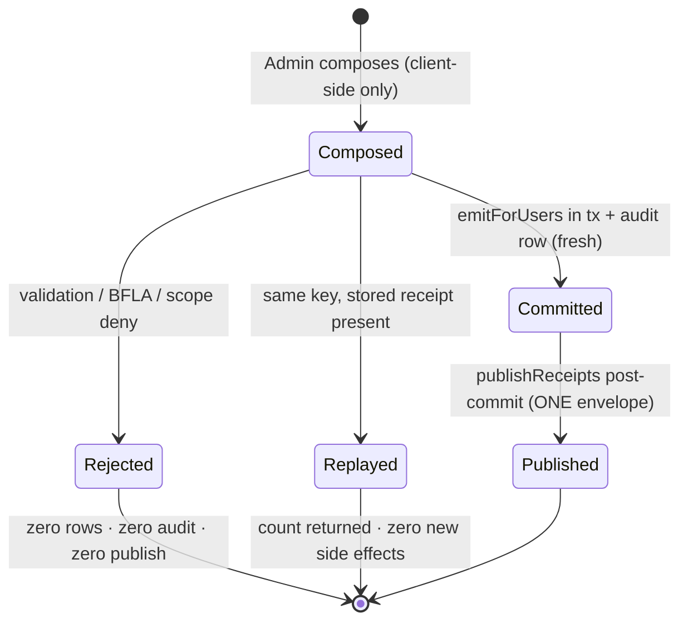

# Technical Architecture & Implementation Design: DEV3-022d — Broadcast Notifications (System-Wide & Targeted)

> **Plan of record:** `ai/plans/sprint_3/dev3-022d-broadcast-notifications-system-wide-targ/`
> **Specs:** `specs.md` REQ-001..REQ-082, journeys §2.9, decisions DB-1..DB-6
> **Canonical refs:** `docs/notifications/realtime-engine.md` (§3.2 emitter contract — this ticket IS the DEV3-022d row), `docs/admin/user-management.md` (guarded patterns, JR-C-1), `docs/graphql/api-gateway-and-routing.md` (REQ-018), `docs/specs/open-decisions-and-gaps.md` (A.4, A.4.1–A.4.3, A.5, A.7, B.8/C.2), `docs/workflows/05-admin-governance-override.md` (§2 `Notification_Broadcast`, §7.2)

---

## 1. System Overview & Architecture Diagram

### 1.1 Scope Statement

DEV3-022d is a **composition ticket on shipped substrate**. The notification engine (DEV3-010) already provides every durable-delivery primitive: `emitForUsers` (batch insert inside a caller `tx`, no publish), `publishReceipts` (post-commit fan-out), the claim-cache port (`SET NX EX` claim + stored-receipt replay), and the fan-out transports. The admin user-management vertical (DEV3-016) ships the admin-actor re-verification discipline (`assertActorAdmin`), the in-tx audit writer (`AuditService.createAuditLog`), and the canonical active-subscription predicate. What does NOT exist anywhere in the tree: cohort resolution (who receives what), the admin compose mutation, the `RedisClaimCache` adapter for the engine's injected port, and the admin UI. This ticket's net-new work is exactly and only that gap.

Nothing is modified in the engine, inbox queries/mutations, transports, or WS sidecar; `git diff` on `backend/db/schema/**` and `backend/db/migration/**` is empty (REQ-044).

### 1.2 Data Flow — Write Path (the whole feature)

```text
┌── CLIENT (Admin compose page, React 19 / Apollo v4) ─────────────────────────┐
│ /admin/broadcasts  →  BroadcastComposeContainer                               │
│   useMutation(adminBroadcastNotificationMutationDocument, {                   │
│     context: { headers: { "x-idempotency-key": composeSessionKey } }          │
│   })   ← key minted ONCE per compose session (crypto.randomUUID())            │
└──────────────────────────────┬───────────────────────────────────────────────┘
                               ▼ POST /api/graphql  (guardTransport → context)
┌── GATEWAY / CONTEXT ─────────────────────────────────────────────────────────┐
│ gqlContextFactory: ctx.user (verified JWT), ctx.locale, ctx.idempotencyKey   │
│   ← captured EXACTLY ONCE from X-Idempotency-Key (propagation-only)          │
└──────────────────────────────┬───────────────────────────────────────────────┘
                               ▼
┌── POTHOES (scope-auth, pre-resolver) ────────────────────────────────────────┐
│ mutation adminBroadcastNotification(input): Int!                              │
│   authScopes: { $all: { authenticated: true, role: [UserRole.Admin] } }       │
│   anonymous → UNAUTHORIZED · non-admin → FORBIDDEN (before resolver body)     │
└──────────────────────────────┬───────────────────────────────────────────────┘
                               ▼
┌── SERVICE: AdminBroadcastService.broadcast(input, actorId, locale, opts?) ───┐
│ 1. assertActorAdmin(actorId)          (defense-in-depth re-check, pre-tx)     │
│ 2. validate copy + audience coherence (fail-closed, PRE-DB)                   │
│ 3. resolve cohort ids (BroadcastAudienceRepository — DISTINCT, id ASC)        │
│ 4. empty → BROADCAST_AUDIENCE_EMPTY · >5000 → BROADCAST_AUDIENCE_TOO_LARGE    │
│ 5. withTransaction(tx):                                                       │
│      receipt = NotificationEngine.emitForUsers({...insert, idempotencyKey},   │
│                  locale, tx, { transport, cache })   ← SAVEPOINT insert,      │
│                                                        NO publish inside      │
│      if replay (key + cache + receipt.emitClaimKey === undefined):            │
│          → RETURN count · ZERO audit · ZERO publish                           │
│      AuditService.createAuditLog({ actorId, Create, "notification_broadcast", │
│          entityId: null, details: metadataOnly }, tx)                         │
│ 6. after commit: NotificationEngine.publishReceipts([receipt], locale, opts)  │
│      → stores receipt (claim key) → ONE fan-out envelope (full id list)        │
└──────────────────────────────┬───────────────────────────────────────────────┘
                               ▼
┌── FAN-OUT (existing DEV3-010 substrate — untouched) ─────────────────────────┐
│ transport.publishFanout(recipientIds, projectedPayload) → WS sidecar → toast  │
└──────────────────────────────────────────────────────────────────────────────┘
```

### 1.3 Read/Observability Path (unchanged consumers)

Recipients observe rows exclusively through the pre-existing self-scoped inbox (`myNotifications`, `myUnreadNotificationCount`, `markRead*`) and the WS sidecar toast lane. ZERO changes to those consumers; ZERO new read surfaces.

### 1.4 Key Design Decisions Table

| # | Decision | Options Considered | Pros / Cons | Rationale (Maintainability, Scalability, Reliability) |
|---|----------|--------------------|-------------|--------------------------------------------------------|
| D1 | Cohort taxonomy frozen at four kinds: `all` / `role` / `country` / `plan` via a TS-only enum `BroadcastAudienceType` (precedent: `AdminUserGovernanceFilter` — `backend/enum/users/admin-user-governance-filter.enum.ts`, no pgEnum) | (a) pgEnum + column; (b) TS enum + fail-closed guard; (c) free strings | (a) needs schema drift — violates REQ-044 and the enum is transport-level, never stored. (b) zero migration, guard-tested, registry-clean. (c) unguarded input surface | (b). The selector is request-scoped, never persisted — a DB enum buys nothing and costs a migration |
| D2 | Cohort resolution in a dedicated repository (`BroadcastAudienceRepository`) with deterministic `DISTINCT … ORDER BY id ASC` output | (a) inline SQL in service; (b) repo namespace | (a) violates layer law and is untestable under `runInRollback` conventions. (b) testable in isolation, reusable by future emitters | (b). Engine REQ-027 ("never resolve roles in the engine") assigns cohort composition to THIS ticket — a repo keeps it honest |
| D3 | Governance exclusion: exclude `is_deleted`/`is_blocked` (NULL-safe), INCLUDE suspended users | (a) exclude suspended too; (b) include | (a) would silently drop users whose suspension lapses mid-notice (INV-U2 gates session requests, not inbox) | (b) per spec REQ-015 — parked rows self-heal on lapsing; deleted/blocked never accessible (INV-U1/U4) |
| D4 | Fail-closed recipient cap `BROADCAST_MAX_RECIPIENTS = 5000`, chunked mode deferred | (a) chunk-loop; (b) cap + defer | (a) spreads one mutation across N transactions — weakens the single-atomic-unit + single-fan-out contract (engine REQ-013) | (b) per spec DB-4. One batch insert stays far under PG's 65 535-param ceiling; chunking joins `deferred-items.md` with an owner |
| D5 | Emission via engine caller-tx receipt composition: `emitForUsers(…, tx)` → commit → `publishReceipts([receipt])` | (a) engine own-commit path (no tx); (b) caller-tx | (a) audit row would live in a SECOND transaction — a crash between them orphans audit or insert. (b) publishes nothing pre-commit (engine REQ-042 provable) | (b) mandated by REQ-021/022: inserts + audit share ONE tx; the receipt crosses the boundary; publish is structurally post-commit |
| D6 | Idempotency: `X-Idempotency-Key` header → `ctx.idempotencyKey` → engine `idempotencyKey`; production claim cache = NEW `RedisClaimCache` (ioredis) behind `resolveBroadcastClaimCache()`; replay detection via `receipt.emitClaimKey === undefined` under (key ∧ cache) | (a) no idempotency; (b) claim + stored receipt replay | (a) a double-click on a 5 000-user cohort writes twice — unacceptable for an admin broadcast. (b) engine already ships the exact port; replay returns the stored receipt with ZERO writes | (b) per specs REQ-023 and decision A.4.2 (fail-open deviation honored: no Redis ⇒ engine warn + proceed) |
| D7 | Audit: exactly ONE `audit_logs` row per accepted broadcast, in-tx, `entityType: "notification_broadcast"`, `entityId: null` — widening `AuditLogWriteContract.entityId` to `number \| null` | (a) drop audit; (b) widen contract | (a) violates Workflow 05 §7.2 ("Notification Broadcast" is audit-listed). (b) additive; `audit_logs.entity_id` is ALREADY nullable (`backend/db/schema/audit/audit-logs.ts:39: entityId: integer("entity_id")` — no `.notNull()`) | (b) per spec DB-5. Additive widening breaks no consumer; conformance suites pin the shape |
| D8 | Admin gate is DOUBLE-WALLED: Pothos `$all: { authenticated, role: [Admin] }` AND service-layer actor re-check via an extracted shared `assertActorAdmin` | (a) scope only; (b) both walls | Auth scopes alone are the transport boundary; the service must not trust it when invoked from future non-GraphQL callers | (b) per REQ-030, mirroring `user-management.service.ts:240-271` (`assertActorAdmin`) — extracted to a shared module to avoid a forked copy |
| D9 | Broadcast copy is admin-authored free text stored VERBATIM (engine never translates); no per-recipient localization | (a) templated per-locale copy; (b) verbatim | (a) invents a per-recipient fan-out the engine deliberately defers (its D2). (b) matches localization-at-emitter (A.4.3): there is nothing to translate | (b). REQ-020 / DB-3. `dir="auto"` covers RTL rendering client-side |
| D10 | Frontend: dedicated `/admin/broadcasts` page (server-guarded) + per-request header delivery via Apollo operation context; `createAuthLink` gains an additive merge of `operation.getContext().headers` | (a) key in the input DTO; (b) header via context | (a) pollutes the closed input surface with a transport concern (BOPLA-adjacent). (b) matches the gateway contract (key lives where it lives — a header) | (b) REQ-023 + REQ-060. The authLink merge is additive: existing writers (token, preflight, operation name) are unchanged; absent context headers are a no-op |

---

## 2. Data Models & Database Schema

### 2.1 Existing Schema Verification (READ-ONLY — verified against bundled Drizzle sources)

| Element | Ground truth (bundled anchor) | Status |
|---|---|---|
| `notifications` table (`id`, `userId` FK cascade, `type` notificationType enum, `title varchar(255)`, `body text`, `isRead`, `relatedEntityType varchar(100)`, `relatedEntityId int`, `createdAt`) | `backend/db/schema/notifications/notifications.ts:27-46` | REUSE — zero columns touched |
| `system_broadcast` enum value exists in `notification_type` | `backend/db/schema/enums.ts:61` (inside the 56-64 `notificationType` pgEnum) | REUSE — no enum migration |
| `users` governance + cohort columns: `role` (userRole pgEnum), `country varchar(100)`, `isDeleted`, `isBlocked`, `suspended` (+ window fields) | `backend/db/schema/users/users.ts:11-45` | READ only |
| `subscriptions`: `userId` (generic owner FK — decision B.8/C.2), `planId`, `status`, `startDate`, `endDate` | `backend/db/schema/billing/subscriptions.ts:19-42` | READ only |
| `plans.id` (existence probe target) | `backend/db/schema/billing/plans.ts:14-36` | READ only |
| `audit_logs.entityId` nullable | `backend/db/schema/audit/audit-logs.ts:39` (`entityId: integer("entity_id")`) | READ only — no column change needed for the `null` audit entity id |

**Schema-drift gate (REQ-044):** `git diff -- backend/db/schema/** backend/db/migration/**` MUST be empty. `bun run db push` / `db migrate` are NEVER invoked by this ticket. The `BroadcastAudienceType` enum is TS-only — NO `pgEnum` entry in `backend/db/schema/enums.ts`.

### 2.2 Canonical Types (NEW — `backend/types/notifications/broadcast.types.ts`)

```typescript
import type { BroadcastAudienceType } from "@/backend/enum/notifications/broadcast-audience-type.enum";
import type { UserRole } from "@/backend/enum/users/user-role.enum";

/** Type-discriminated cohort selector (wire + service input). Readonly, closed. */
export interface BroadcastAudienceSelector {
  readonly type: BroadcastAudienceType;
  readonly role?: UserRole | null;       // required iff type === Role
  readonly country?: string | null;      // required iff type === Country
  readonly planId?: number | null;       // required iff type === Plan
}

export interface BroadcastNotificationSubmitInput {
  readonly title: string;
  readonly body: string | null;
  readonly audience: BroadcastAudienceSelector;
}
```

Add `export * from "./broadcast.types";` to `backend/types/notifications/index.ts`. Note `AuditLogWriteContract.entityId` widens to `AuditLogSelectType["entityId"]` (already `number | null`) in `backend/types/contracts/admin-audit.contract.types.ts` (UPDATE — the widening rides the schema-derived column type so it can never re-diverge); no other contract shape changes.

### 2.3 Canonical Enum (NEW — TS-only)

`backend/enum/notifications/broadcast-audience-type.enum.ts`:

```typescript
export enum BroadcastAudienceType {
  All = "all",
  Role = "role",
  Country = "country",
  Plan = "plan",
}
export function isBroadcastAudienceType(value: unknown): value is BroadcastAudienceType {
  return typeof value === "string" && (Object.values(BroadcastAudienceType) as string[]).includes(value);
}
```

`backend/enum/notifications/index.ts` gains `export * from "./broadcast-audience-type.enum";` (top-level barrel already re-exports `./notifications`). Mirroring the `notification-type.enum.ts` + guard + 4-tier fuzz test pattern (`backend/enum/notifications/notification-type.enum.test.ts`).

---

## 3. API Contracts & Pothos Resolvers

### 3.1 GraphQL Schema Additions (exact surface — REQ-060)

```graphql
enum BroadcastAudienceType { All, Role, Country, Plan }   # wire names = TS member names (UserRole precedent)

input BroadcastAudienceInput {
  type: BroadcastAudienceType!
  role: UserRole
  country: String
  planId: Int
}

input AdminBroadcastNotificationInput {
  title: String!
  body: String
  audience: BroadcastAudienceInput!
}

extend type Mutation {
  adminBroadcastNotification(input: AdminBroadcastNotificationInput!): Int!
}
```

### 3.2 Pothos Registration Details

| Artifact | File | Detail |
|---|---|---|
| Enum registration | `backend/graphql/pothos/shared/enum.pothos.ts` (UPDATE) | `export const BroadcastAudienceTypePothosEnum = gqlSchemaBuilder.enumType(BroadcastAudienceType, { name: "BroadcastAudienceType" });` — enum-OBJECT form ONLY (literal `values: [...]` fails gate A2 of `backend/lib/gateway/static-assertions.test.ts`) |
| Input types | `backend/graphql/pothos/notifications/admin-broadcast.pothos.ts` (CREATE) | `BroadcastAudienceInput` + `AdminBroadcastNotificationInput` via `gqlSchemaBuilder.inputType`; `role: t.field({ type: UserRolePothosEnum, required: false })`, `planId: t.int({ required: false })` |
| Barrel | `backend/graphql/pothos/notifications/index.ts` (UPDATE) | add `export * from "./admin-broadcast.pothos";` |
| Mutation | `backend/graphql/mutation/notifications/admin-broadcast.mutation.ts` (CREATE) | side-effect module; `authScopes: { $all: { authenticated: true, role: [UserRole.Admin] } }`; resolver: `if (!ctx.user) { const tErrors = await ctx.t("errorsTranslations"); throw new UnauthorizedError(tErrors.unauthorized); }` then delegate to `AdminBroadcastService.broadcast({ title, body, audience }, ctx.user.id, ctx.locale, ctx.idempotencyKey ?? undefined, { })` |
| Barrel | `backend/graphql/mutation/notifications/index.ts` (UPDATE) | `import "./admin-broadcast.mutation";` |
| Codegen | — | `bun run generate:gqlSchema && bun codegen` in the SAME change set; commit `frontend/graphql/generated/**` |

The public-operations allowlist (`backend/lib/gateway/public-operations.ts`) is UNTOUCHED (deployed default-deny; this op is admin-scoped, never public).

### 3.3 Frozen-Baseline Updates (REQ-062 — sanctioned, enumerated)

| File | Change |
|---|---|
| `backend/graphql/test/sdl-static-assertions.test.ts` | `FROZEN_MUTATION_FIELDS` gains `"adminBroadcastNotification"` (alphabetical position — first); ADD assertion block pinning `BroadcastAudienceInput` field set `{type, role, country, planId}` and `AdminBroadcastNotificationInput` `{title, body, audience}`; existing notification-family assertions unchanged |
| `backend/graphql/test/schema-surface.test.ts` | `PRE_3_1_ENUMS` gains `"BroadcastAudienceType"`; `PRE_3_1_TYPE_NAMES` gains `"AdminBroadcastNotificationInput"`, `"BroadcastAudienceInput"`, `"BroadcastAudienceType"`; `PRE_3_1_MUTATION_FIELDS` unchanged (its `additions` block already tolerates growth only via the named `additions` assertion — EXTEND that list with the new mutation name so the freeze stays honest) |
| `frontend/graphql/generated/schema.graphql` + `graphql.ts` | regenerated artifacts, committed in set |

### 3.4 Error Mapping (`extensions.code`)

| Scenario | Code | Producer |
|---|---|---|
| Anonymous | `UNAUTHORIZED` | scope `authenticated` (pre-resolver) |
| Authenticated non-admin | `FORBIDDEN` | scope `role` (pre-resolver) OR service re-check |
| Bad title (empty after trim / >255) | `BROADCAST_TITLE_INVALID` (`ValidationError(code, message)` overload) | service, pre-DB |
| Audience incoherent (missing/mismatched companion, unknown type) | `BROADCAST_AUDIENCE_INVALID` | service, pre-DB |
| Malformed `planId` | `BROADCAST_AUDIENCE_INVALID` | service, pre-DB |
| Unknown plan | `PLAN_NOT_FOUND` (`NotFoundError("PLAN", tErrors.planCatalog.planNotFound)`) | service |
| Zero-size cohort | `BROADCAST_AUDIENCE_EMPTY` | service, pre-write |
| > 5000 cohort | `BROADCAST_AUDIENCE_TOO_LARGE` | service, pre-write |
| Publish outage post-commit | `NOTIFICATION_DELIVERY_DEGRADED` (structured log, mutation still succeeds) | engine (`publishReceipts`) |
| Cache absent/degraded | `NOTIFICATION_IDEMPOTENCY_DEGRADED` (structured log, emit proceeds) | engine |

### 3.5 Permission Matrix

| Caller | `adminBroadcastNotification` | Recipient of broadcasts |
|---|---|---|
| Anonymous | ❌ `UNAUTHORIZED` | n/a (never resolvable — no row) |
| Student | ❌ `FORBIDDEN` | ✅ own inbox only (`all` / matching cohorts) |
| Parent | ❌ `FORBIDDEN` | ✅ own inbox only |
| Teacher (applicant or certified) | ❌ `FORBIDDEN` | ✅ own inbox only |
| Super Admin (real `admin` row) | ✅ | ✅ (administrators receive `all`/`role:admin` broadcasts) |
| Governed (`isDeleted`/`isBlocked`) | ❌ (SSR/login already fail-closed; scope layer also 401/403 on missing identity) | ❌ EXCLUDED from every cohort (REQ-015) |

---

## 4. Backend Services, Repositories & Concurrency Model

### 4.1 Service — `backend/services/notifications/admin-broadcast.service.ts` (CREATE)

```typescript
export namespace AdminBroadcastService {
  export async function broadcast(
    input: BroadcastNotificationSubmitInput,      // closed whitelist; mapped field-by-field by resolver
    actorId: number,                              // ctx.user.id — NEVER input
    locale: string,
    idempotencyKey?: string,                      // ctx.idempotencyKey ?? undefined — propagation-only
    options?: NotificationEngineCallOptions,      // injection seam { transport?, cache? } (REQ-024)
    outerTx?: DBTransaction                        // journey/test seam (committed-fixture flows pass none)
  ): Promise<number>;                             // persisted recipient count (mutation's Int!)
}
```

**Flow (strict order):**

1. `assertActorAdmin(actorId, locale, outerTx)` — shared extraction (§4.3). Anonymous (`actorId === 0`) → `UnauthorizedError(tErrors.unauthorized)`; missing/non-admin row → `ForbiddenError(tErrors.forbidden)`. BOTH pre-transaction, zero writes, zero audit (JR-C-1), one `logger.logDomainError` with `{ code, entity: "notifications", entityId: actorId, locale }`.
2. `validateBroadcastCopyAndAudience(input, locale)` — pure, fail-closed, PRE-DB:
   - `title`: trim → non-empty, ≤255 (engine ceiling) → else `ValidationError("BROADCAST_TITLE_INVALID", t.broadcastTitleInvalid)`.
   - `body`: `null` or string (pass-through; engine bounds it).
   - audience: `isBroadcastAudienceType(type)` MUST hold; companion coherence: `Role ⇒ toUserRole(role) !== null && country/planId absent`, `Country ⇒ country trimmed non-empty ≤100 && role/planId absent`, `Plan ⇒ isPositiveSafeInt(planId) && role/country absent`, `All ⇒ all companions absent`. Any violation → `ValidationError("BROADCAST_AUDIENCE_INVALID", t.broadcastAudienceInvalid)`.
3. Resolve cohort: `BroadcastAudienceRepository.resolveAudienceIds(selector, readTx)` where `readTx = outerTx` when supplied (tx-propagation rule REQ-042) else plain read. Plan cohort: `PlanRepository.existsById(planId, tx)` FIRST → miss ⇒ `NotFoundError("PLAN", t.planCatalog.planNotFound)` (admin-scope oracle ruling, REQ-033).
4. Empty cohort → `ValidationError("BROADCAST_AUDIENCE_EMPTY", t.broadcastAudienceEmpty)`; `> BROADCAST_MAX_RECIPIENTS (5000)` → `ValidationError("BROADCAST_AUDIENCE_TOO_LARGE", t.broadcastAudienceTooLarge)`. Zero writes on both.
5. `withTransaction(outerTx, async tx => { … })`:
   - `const receipt = await NotificationEngine.emitForUsers({ userIds: ids, type: NotificationType.SystemBroadcast, title, body, relatedEntityType: null, relatedEntityId: null, idempotencyKey }, locale, tx, options)` — the engine validates (`validateEmitBatchInput`), claims the key (when cache injected), inserts via `NotificationRepository.createManyReturning` inside the SAVEPOINT, returns receipt WITHOUT publishing.
   - Replay detection (REQ-023): `const isReplay = idempotencyKey !== undefined && options?.cache !== undefined && receipt.emitClaimKey === undefined;` → return `receipt.recipientUserIds.length` from the tx callback with NO audit write.
   - Fresh: `AuditService.createAuditLog({ actorId, actionType: AuditActionType.Create, entityType: "notification_broadcast", entityId: null, details: <metadata JSON> }, tx)` where details = capped (≤2000) `JSON.stringify({ scope, role?, country?, planId?, recipientCount })` — NEVER copy text.
   - Return `receipt.recipientUserIds.length`.
6. Post-commit (only when the unit committed): fresh ⇒ `await NotificationEngine.publishReceipts([receipt], locale, options)` (stores the receipt under the claim key, then ONE fan-out envelope carrying the full id list); replay ⇒ NOTHING.
7. Return the count.

### 4.2 Claim Cache — `backend/services/notifications/redis-claim-cache.ts` (CREATE)

```typescript
export class RedisClaimCache implements NotificationIdempotencyClaimCache {
  constructor(redis: RedisFanoutClientLike) {}                       // ioredis instance type
  async claim(key: string, ttlSeconds: number): Promise<boolean> {
    // SET key "1" NX EX ttl  →  "OK" (won) | null (held)
  }
  store(key: string, value: string, ttlSeconds: number): Promise<void>;   // SET key value EX ttl
  get(key: string): Promise<string | null>;                                // GET key
}
export function resolveBroadcastClaimCache(): NotificationIdempotencyClaimCache | undefined;
```

`resolveBroadcastClaimCache()` is stateless (mirrors `resolveFanoutTransport`, `backend/services/notifications/realtime/fanout-transport.factory.ts:44`): no `REDIS_URL` ⇒ `undefined` (hermetic default; the engine then logs its single `NOTIFICATION_IDEMPOTENCY_DEGRADED` warn and emits anyway — documented fail-open, A.4.2). The fanout-transport factory is documented STATELESS (no memoization, no module-level mutable state; its only laziness is a lazy `await import` of ioredis when Redis is configured) — the new cache module likewise keeps no eager module state: the `ioredis` client is constructed lazily via the same `await import` pattern on first configured use. The client is created `lazyConnect: true`; any command failure surfaces to the engine's fail-open handlers, never to the caller.

### 4.3 Shared Admin Guard — `backend/services/admin/assert-actor-admin.ts` (CREATE) + `user-management.service.ts` (UPDATE, dedupe)

The `assertActorAdmin` logic currently private at `user-management.service.ts:240-271` moves VERBATIM (errors, logging shape, `ANONYMOUS_ACTOR_ID = 0` rule) into the shared module; `AdminUserManagementService` imports it (its 8 chaos/service tests keep passing unchanged — the extraction is behavior-identical). `backend/services/admin/index.ts` gains the export. `AdminBroadcastService` consumes the same function — ONE canonical admin-actor gate.

### 4.4 Repository — `backend/db/repo/notifications/broadcast-audience.repository.ts` (CREATE)

```typescript
export namespace BroadcastAudienceRepository {
  export function resolveAudienceIds(
    selector: BroadcastAudienceSelector,                     // already validated upstream
    tx?: DBQueryExecutor
  ): Promise<number[]>;          // DISTINCT, ORDER BY id ASC, governance-filtered
}
```

Four SQL shapes (parameterized; non-tx branch via `queryDb` with numbered `$n` params — the `notification.repository.ts` `buildUserScopedPredicate` convention):

- **all:** `SELECT id FROM users WHERE coalesce(is_deleted,false)=false AND coalesce(is_blocked,false)=false ORDER BY id ASC`
- **role:** same + `AND role = $1`
- **country:** same + `AND country = $1` (exact `eq`, country already trimmed — NO LIKE anywhere; the `escapeLikeWildcards` mandate is N/A by construction, documented)
- **plan (join + DISTINCT):** `SELECT DISTINCT u.id FROM users u JOIN subscriptions s ON s.user_id = u.id WHERE s.plan_id = $1 AND s.status = 'active' AND now() >= coalesce(s.start_date, now()) AND (s.end_date IS NULL OR now() < s.end_date) AND coalesce(u.is_deleted,false)=false AND coalesce(u.is_blocked,false)=false ORDER BY u.id ASC` — the active-window predicate is byte-equivalent to the canonical one (`backend/db/repo/admin/admin-user.repository.ts:337-346`), and the owner FK is `subscriptions.user_id` (B.8/C.2 — a verification-plan subscriber counts).

tx-branch per method uses the equivalent Drizzle builder (`eq`, `and`, `or`, `isNull`, `sql`) with `(tx)` executor; no `inArray`, no prepared statements, no inline `--` comments inside `sql` templates. Add `export * from "./broadcast-audience.repository";` to `backend/db/repo/notifications/index.ts`.

### 4.5 Concurrency & Race Condition Assessment

| Scenario | Actors | Risk | Mitigation |
|---|---|---|---|
| Double-submit same key, sequential | Admin client | duplicate N-row insert + duplicate audit + duplicate fan-out | Engine claim (`SET NX EX`) + stored receipt → second call returns prior receipt → service replay branch writes/audits/publishes NOTHING (REQ-023; journey step 2) |
| Concurrent same-key race (true parallel) | 2 admin requests | loser claims false before receipts stored | Engine documented posture: held-no-receipt ⇒ FAIL-OPEN insert + one warn (A.4.2); worst case a duplicate dismissed row. Asserted as-specified in chaos tests |
| Two different keys, same cohort | 2 admins | two legitimate broadcasts | Allowed — distinct operations; both audited (each with own `actorId`) |
| Crash post-commit / pre-`publishReceipts` | runtime | claim held, receipt never stored → next submit re-inserts | Documented residual (engine §3.6); rows committed, fan-out lane silent; catch-up refetch heals clients. Logged as deferred-items ledger entry |
| User registers DURING cohort resolution | new user | new user misses/lands in broadcast nondeterministically | Append-only target table; timing acceptable — documented (no locking needed; recipients are a snapshot by design) |
| Recipient cap blow-out | admin input | single mega-insert beyond param ceiling | Fail-closed pre-DB `BROADCAST_AUDIENCE_TOO_LARGE` (REQ-017) |
| `planId` probing | authenticated non-admin | plan existence oracle | Non-admins never reach the service (double wall REQ-030); admin-scoped `PLAN_NOT_FOUND` is legitimate on an admin surface (REQ-033) |

**TOCTOU windows:** none on mutable shared state. Cohort resolution is a read snapshot of append-only intent; notification rows and the audit row are created (never mutated) inside one tx — there is no read-then-write pattern at all. **No `SELECT FOR UPDATE`, no advisory locks** (nothing contended). The ONLY mutually-exclusive surface is the Redis `SET key NX EX` claim, which IS the atomic primitive (per `docs/IDEMPOTENCY.md`'s 24h TTL via `NOTIFICATION_EMIT_CLAIM_TTL_SECONDS = 86_400`, `emit-idempotency.ts:30`).

### 4.6 Cross-Actor Journey Design (specs §2.9 → journey assertion set)

**Shared-entity state machine (the broadcast as an entity):**



| Transition | Actor / permission | Rows created/updated | Notifications channel → recipient | Idempotency key |
|---|---|---|---|---|
| Composed → Committed | Admin (double wall) | N× `notifications` (is_read=false, type=`system_broadcast`, relatedEntity*=null) + 1× `audit_logs` | none yet (publish deferred) | engine claim `notif:emit:sha256(sortedIds:type:key)` |
| Committed → Published | system (service, post-commit) | receipt stored under claim key | WS fan-out envelope → FULL recipient list | same claim (receipt value) |
| Composed → Replayed | same admin, same key | NONE | NONE | held claim short-circuits |
| Composed → Rejected (validation/role/empty/oversized) | any | NONE | NONE | never claimed (validation precedes claim) |

**Cross-actor visibility table (per specs §2.9 cohorts):**

| Step outcome | Admin A | Teacher T | Student S (EG, plan P active) | Parent Pa | Student S2 (US, no sub) | Governed G |
|---|---|---|---|---|---|---|
| `all` broadcast | sees own row | sees row | sees row | sees row | sees row | NOTHING (byte-identical inbox) |
| `role:teacher` | unchanged | sees row | unchanged | unchanged | unchanged | unchanged |
| `country:"EG"` | unchanged | unchanged | sees row | unchanged | unchanged | unchanged |
| `plan:P` | unchanged | unchanged | sees row | unchanged | unchanged; an EXPIRED-P subscriber also unchanged | unchanged |
| replay of any step | count returned | NO new row anywhere | — | — | — | — |
| denial (non-admin/anon/invalid) | — | — | — | — | — | — (nothing exists) |

**Journey test (TEST-FIRST):** `test/workflows/notifications/admin-broadcast.journey.test.ts` — committed fixture cast via `test/workflows/helpers` (`provisionAdminActor`, `provisionCertifiedTeacherActor`, `provisionStudentActor`, `provisionParentActor`; an `is_deleted` governed user), `TrackedFixtures` teardown (reverse-order hard delete INCLUDING `notifications` + `audit_logs` via `withAuditDeleteTriggersSuspended` from `test/helpers/db-cleanup.ts`), `SpiedFanoutTransport` injected as `options.transport`, scripted in-memory claim cache injected as `options.cache` (implements `NotificationIdempotencyClaimCache`). NO `runInRollback` (services own their transactions). Steps 1–10 of specs §2.9 map 1:1 onto sequential actor-attributed assertions; recipient observation via `NotificationEngine.listMyNotifications(recipientId, { limit: 50, offset: 0 }, "en")`; fan-out asserted via `spied.calls` (exactly ONE envelope per fresh broadcast, zero on replay/denial, full recipient id list on the envelope).

---

## 5. Frontend UX & Navigation Specification

### 5.1 Routes & URLs

| Path | Purpose | Required permission | Allowed roles |
|---|---|---|---|
| `/admin/broadcasts` | Compose + fire system-wide/targeted broadcasts | `withPageAuth({ roles: [UserRole.Admin], redirectTo: "/admin/broadcasts" })` at `app/(dashboard)/admin/broadcasts/page.tsx` (Server Component; pattern per `frontend/lib/auth/withPageAuth.ts`) | Admin only — non-admin roles redirect via `roleDashboardPath(ctx.role)` (NEVER bare `/dashboard`) |

### 5.2 Sidebar & Navigation Integration

`frontend/views/dashboard/navItems.ts` (UPDATE — verified absence: `:126-135` admin list contains dashboard/notifications/users/teachers/students/plans/audit/profile only — this is an ADD, not a retarget):

```typescript
{ route: "/admin/broadcasts", labelKey: "broadcasts", Icon: CampaignOutlined }
```

inserted after the `audit` item in the Admin list. `broadcasts: string` is added to `DashboardLabels` (`shared/locale/types/dashboard/index.ts`) + both locale maps (`shared/locale/en/dashboard/index.ts`, `shared/locale/ar/dashboard/index.ts`) — the key lands in the DASHBOARD bundle only, so the existing one-owner ownership test in `navItems.test.ts` keeps passing. Mobile uses the existing temporary `Drawer` (`DashboardSidebar`) — NO bottom-nav work. `navItems.test.ts` gains: admin list contains `/admin/broadcasts`; all non-admin roles lack it; label resolves non-empty in both locales from the dashboard bundle.

### 5.3 Per-Audience Rendering

| Audience | Rendering |
|---|---|
| Admin | Full compose form: title, body, audience selector, companion slot, confirm dialog, success toast |
| Student / Teacher / Parent | Never reach the page (server redirect to role dashboard); no nav item |
| Anonymous | `/login?redirect=/admin/broadcasts` redirect |
| Governed admin | SSR guard (`getServerUserContext` governance fail-closed) → login redirect |

### 5.4 Apollo Documents & Components

- `frontend/graphql/sharedDocuments/notifications/broadcast.documents.ts` (CREATE): `adminBroadcastNotificationMutationDocument: TypedDocumentNode<AdminBroadcastNotificationMutation, AdminBroadcastNotificationMutationVariables>` — `mutation AdminBroadcastNotification($input: AdminBroadcastNotificationInput!) { adminBroadcastNotification(input: $input) }` (bare `Int!`; nothing to normalize).
- Barrel: add `export * from "./broadcast.documents";` in `frontend/graphql/sharedDocuments/notifications/index.ts`. Doc test (CREATE or extend `notification.documents.test.ts`): operation name/channel/variables pin (`input` only — ZERO identity variables), barrel identity.
- `frontend/providers/apollo/utils.ts` (UPDATE, additive only): `createAuthLink` merges `operation.getContext().headers` into the outgoing header map BEFORE/around the fixed keys (token, preflight, op-name); absent context headers ⇒ byte-identical behavior (existing tests green).
- `frontend/views/admin/broadcasts/BroadcastComposeContainer.tsx` (CREATE, `"use client"`):
  - `useAppTranslation(AdminBroadcasts)` + `useAppTranslation(Common)`; `useQuery(adminPlansQueryDocument, { skip: audienceType !== Plan })` for the plan select (REUSE existing document).
  - `useMutation(adminBroadcastNotificationMutationDocument)` with `context: { headers: { "x-idempotency-key": composeKeyRef.current } }`; `composeKeyRef = useRef(randomUUID())`; regenerate ONLY after success (post-success = new compose session).
  - VALIDATION errors: `projectMutationFieldErrors(error)` (existing `frontend/lib/mutationFieldErrors.ts`) → inline field errors via `fieldError.ts` helpers — never a bespoke renderer; global host owns toasts for non-field errors.
  - Success: local `Snackbar` with `t.successToast(count)` (plural function; Arabic branch precedent `notificationsAr.markAllResult`).
  - Submit disabled while `loading` (double-submit belt ON TOP of the idempotent suspenders).

### 5.5 New i18n Namespace — `AdminBroadcasts`

`shared/locale/types/adminBroadcasts/index.ts` (`AdminBroadcastsLabels`), `shared/locale/{en,ar}/adminBroadcasts/index.ts`, `shared/locale/namespaces/adminBroadcasts/adminBroadcasts.namespace.ts` (`defineNamespace<AdminBroadcastsLabels>("adminBroadcasts.adminBroadcasts", t => t.adminBroadcastsTranslations)`), registry entry in `shared/locale/namespaces/index.ts`, `adminBroadcastsTranslations` added to `Translations` (`shared/locale/types/message.ts`) and BOTH `messages.ts` bundles, plus `shared/locale/adminBroadcasts-namespace.parity.test.ts` (mirror key-set + placeholder/pointer parity + Arabic-script presence pins, modeled on `notifications-namespace.parity.test.ts`).

Key set: `pageTitle`, `pageSubtitle`, `titleLabel`, `titlePlaceholder`, `titleRequired`, `bodyLabel`, `bodyPlaceholder`, `audienceLabel`, `audienceAll`, `audienceRole`, `audienceCountry`, `audiencePlan`, `roleLabel`, `countryLabel`, `countryPlaceholder`, `countryHelperText`, `planLabel`, `planLoading`, `previewDisclaimer` ("recipients are resolved at send time"), `confirmTitle`, `confirmBody`, `confirmAction`, `cancelAction`, `sendAction`, `sendingAction`, `successToast(count: number)` (pluralized branches), `errorTitle` (generic send failure).

Errors namespace (flat, domain-prefixed keys alongside the sanctioned `planCatalog`/`adminUsers` groups — the `ErrorsLabels` shape): `broadcastTitleInvalid`, `broadcastAudienceInvalid`, `broadcastAudienceEmpty`, `broadcastAudienceTooLarge` added to `shared/locale/types/errors/index.ts` + `en/errors` + `ar/errors` (existing parity walkers then enforce presence in both).

### 5.6 Visual Design & Responsive Specifications

- **Breakpoints:** Desktop 1440px — form max-width 720 centered in content column; Tablet 768px — full-width card within padding; Mobile 375px — single-column, companion fields stack vertically; all action buttons ≥44px min-height; radios/selects ≥44px touch rows.
- **RTL/i18n:** full bidirectional mirroring (existing RTL emotion cache via `EmotionCacheProvider`); logical spacing only (`marginInline*`, `ps/pe`, no `ml/mr` shorthands in `sx`); user-authored preview/copy surfaces carry `dir="auto"`; Arabic label line-heights per shared typography.
- **MUI v9 discipline:** ALL styling through `sx` with `theme.palette.*` tokens (no direct style props, no hardcoded colors); icons `Outlined` variants (`CampaignOutlined`, `SendOutlined`); `focusVisibleRingSx` on every interactive element; `Box component="output" aria-busy` for the skeleton/sending state; never `FormEvent` (form submit typed `React.SubmitEvent`).
- **Visual State Matrix:** initial loading (plans query) → MUI `Skeleton` rows; empty plans list → disabled plan option with helper copy; invalid title → inline field error; confirm open → dialog with static audience summary; sending → spinner + disabled submit + `aria-busy`; success → Snackbar + form reset + NEW compose key; server VALIDATION → mapped inline; FORBIDDEN/UNAUTHORIZED never render inline (server guard owns them).

### 5.7 Agent-Browser Verification Protocol

| Step | Endpoint / workflow | Expected evidence |
|---|---|---|
| 1 | `POST /login` as seeded admin → `GET /admin/broadcasts` | compose form renders; nav item present & active |
| 2 | Compose `all` broadcast (title+body) → confirm → send | success toast shows count; DB probe shows N rows `system_broadcast`; exactly ONE audit row |
| 3 | Re-submit identical payload with SAME key (page re-issue path uses a new key — verify REPLAY via two `fetch` GraphQL calls sharing the header) | second call returns same count, zero new rows |
| 4 | `role:teacher` broadcast | only teacher fixtures gain a row (DB oracle) |
| 5 | Non-admin session → direct URL | redirect to role dashboard |
| 6 | Screenshots 1440/768/375 × en/ar (LTR/RTL mirror check) | layout matrix archive under `outcome/` |

---

## 6. Security, Authorization & Tenancy Mitigations

- **BFLA (function-level):** double wall — Pothos `$all: { authenticated: true, role: [UserRole.Admin] }` (pre-resolver, extension-introspection-pinned mirroring `handshake-code-surface.test.ts`) AND service-layer `assertActorAdmin` re-verification against the live `users` row (`UserRepository.findById` + `toUserRole`). Anonymous → `UNAUTHORIZED` (401 semantics); non-admin → `FORBIDDEN` (403 semantics); both with ZERO writes and ZERO audit rows (JR-C-1).
- **BOLA / IDOR:** the mutation carries NO identity arguments — recipients derive exclusively from the audience selector evaluated server-side; the client cannot name a single user. Recipients' later reads run through the pre-existing self-scoped inbox guards (e.g. `markReadOnce` ownership predicate, `notification.repository.ts:269-280`) — unchanged.
- **BOPLA (mass assignment):** `AdminBroadcastNotificationInput` is a closed Pothos input (`GRAPHQL_VALIDATION_FAILED` on any smuggled field — before resolvers); the service maps field-by-field (`title`, `body`, `audience.type/role/country/planId`) into the emit input — NO `{ ...input }` spread anywhere; governance fields, ids, timestamps, and `userId` lists are structurally unreachable from the client.
- **Oracle hygiene:** no pre-send recipient-count preview endpoint exists BY DESIGN (REQ-033/DB-6 — the count is only ever returned AFTER the write). `PLAN_NOT_FOUND` is confined to this admin-gated surface (per `docs/admin/user-management.md` D11 — this ruling is NOT exported to non-admin surfaces). Validation denials on cohort size/visibility never enumerate matching users.
- **Injection:** all cohort SQL is parameterized (`$n` bindings / Drizzle `eq`); country matching is exact equality — NO LIKE/ILIKE surface exists, so wildcard escaping is out-of-scope by construction (documented for review). External copy (`title`/`body`) is stored verbatim and rendered inertly (React-escaped output; `dir="auto"`); engine property tests pin hostile-text storage as inert.
- **Secrets / PII in logs:** `logger.logDomainError` contexts carry `{ code, entity, entityId?, locale }` only — never recipient lists, copy bodies, or raw idempotency keys (only the SHA-256 claim digest is ever persisted, `emit-idempotency.ts:67-71`); ZERO `console.*` (gateway static-assertion A3 posture extends to the new module).
- **Error disclosure:** masked-boundary rules untouched — service `DomainError` subclasses propagate to `extensions.code`; unexpected internals bubble uncaught to the single finalizer plugin (no resolver `try/catch`).

---

## Deferred-Items Ledger Seeds & Knowledge Gates (summary for tasks phase)

- **Ledger seed (`deferred-items.md`):** D1 chunked mega-broadcast (>5000 cohorts) → future scale ticket (engine already supports multi-emit patterns); D2 crash-between-commit-and-`publishReceipts` double-insert residual (engine §3.6 document-locked posture) → engine hardening stream.
- **Canonical doc:** `docs/notifications/broadcast-notifications.md` (REQ-080) — cohort taxonomy, governance-exclusion ruling, header-key/replay contract, cap + deferred chunking, audit contract (`notification_broadcast` entity + contract widening), consumption rules for future emitters (import-by-reference from engine §3.2 table).
- **Knowledge propagation (REQ-081):** `backend/services/AGENTS.md` broadcast-service one-liner; `docs/notifications/realtime-engine.md` §3.2 DEV3-022d row marked shipped; `backend/db/repo/AGENTS.md` audience-repository convention line; root `AGENTS.md` Important References gains the canonical doc entry; outcome files under `ai/plans/sprint_3/dev3-022d-broadcast-notifications-system-wide-targ/outcome/` per task.
