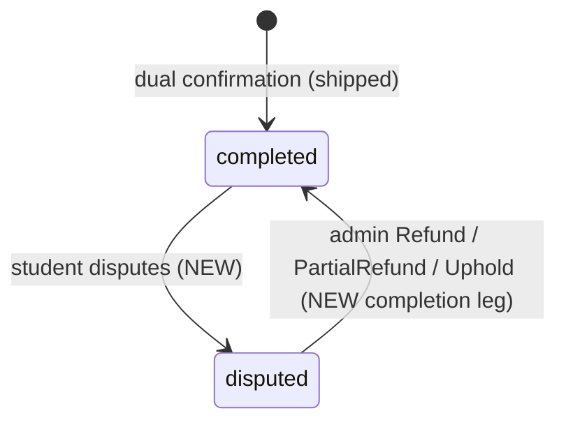

# Design — Dispute Resolution with Admin Arbitration

<!-- Plan Directory: ai/plans/sprint_3/dispute-resolution-with-admin-arbitration/ -->
<!-- Input: specs.md (REQ-0 … REQ-10) · Ticket: docs/planning/TICKETS.md:2509-2561 (Sprint 3, Dev 3, 5 pts) -->

## Document Information

- **Feature Name**: Dispute Resolution with Admin Arbitration
- **Target Directory**: `ai/plans/sprint_3/dispute-resolution-with-admin-arbitration/`
- **Outcome Directory**: `ai/plans/sprint_3/dispute-resolution-with-admin-arbitration/outcome/`
- **Version**: 1.0 · **Date**: 2026-09-11
- **Related Documents**: `specs.md`, `tasks.md`, `deferred-items.md`

## Overview

This design adds the **post-confirmation** dispute path to the already-shipped dispute machinery: a student may dispute a dual-confirmed (`completed`, escrow consumed, wallet credited) session, moving it into `disputed`; an admin then arbitrates with a binding outcome — **Refund**, **Partial Refund**, or **Uphold** — executed as one atomic transaction that reverses teacher wallet value via a compensating ledger row, restores the student's session credit, writes exactly one `override` audit row, and fans out notifications after commit. The shipped pre-completion path (`scheduled|started → disputed → cancelled|completed` on held escrow) remains byte-stable.

The design is deliberately additive: one enum extension (`DisputeResolution` gains three members), one pgEnum extension (`notification_type` gains two members), one new service module (`session-arbitration.service.ts`), one guarded wallet debit primitive, one admin case-read query, one new mutation + one extended mutation input, and targeted UI extensions to the existing `/disputes` console and student sessions row.

### Design Goals

- **Single arbitration surface** — preserve the canonical boundary: one write path exits `disputed` rows (`docs/admin/admin-session-governance.md:96-103`).
- **Financial honesty** — every money/ledger effect is guarded, in-tx, append-only, audit-row-bound, and race-safe (INV-W1/W2/W6/W8, INV-B1).
- **Zero regression surface** — pre-completion dispute behavior, its tests, and its denial splits stay byte-identical.
- **Verified-grounding** — every extension hooks an existing primitive (no parallel money paths).

### Key Design Decisions

| ID | Decision | Rationale |
|----|----------|-----------|
| D-1 | Two-entry, two-generations model: keep shipped open/resolve; ADD post-confirmation open + 3-outcome arbitration, discriminated by `fee_held` | DEV3-012 D-2 explicitly deferred this surface (`ai/finished_plans/sprint_2/dual-confirmation-completion-handshake/plan.md:23` D-2); `fee_held` is the persisted discriminator |
| D-2 | Extend `DisputeResolution` (TS-only enum, `backend/enum/scheduling/dispute-resolution.enum.ts`) with `Refund` / `PartialRefund` / `Uphold` | One vocabulary on one mutation; Pothos enum at `backend/graphql/pothos/shared/enum.pothos.ts:136` derives members from the enum — schema regen only |
| D-3 | New student-only mutation `openPostConfirmationDispute(id, reason)` | Keeps `openSessionDispute` denial bytes and shipped tests untouched |
| D-4 | Student refund unit = ONE session credit to the provenance lane for Refund AND PartialRefund; the partial quantum moves only on the teacher's money ledger | INV-B1 integer lanes cannot represent a fractional credit; documented arbitration-economics ruling, recorded per row in the audit trail |
| D-5 | Teacher reversal = compensating `teacher_transaction` `{type: withdrawal, status: completed, sessionId, amount}` + guarded `balance` decrement, in one tx | INV-W6 (immutable ledger, corrections via new rows), INV-W8 (amount ≥ 0); precedent: Admin-Ordered Re-Evaluation uses `withdrawal` for forced debits (TICKETS `docs/planning/TICKETS.md:2143-2180`) |
| D-6 | `wallet.total_earning` is NOT decremented by reversals | It is a gross lifetime counter (INV-W2 ≥ 0); spendable truth is `balance` |
| D-7 | Admin case review = new admin-gated `adminDisputeCase` query composing existing repo primitives + `AuditTrailService.listAuditTrail` | No participant-oracle leaks; evaluation surface limited to the shipped `reports.studentRatingByTeacher` (student-rates-teacher lands under its own sprint-3 ticket) |
| D-8 | Notifications only for the post-confirmation flow; 2 new `NotificationType` members; claim keys `session:<id>:dispute-opened|dispute-resolved` | Honors the shipped zero-notification ruling for held disputes (`docs/sessions/session-lifecycle.md:159`); audience = all admins via `BroadcastAudienceRepository.resolveAudienceIds` |
| D-9 | No dispute time-window | No source doc defines one; deferred (deferred-items.md) |
| D-10 | Auditing keeps `action_type='override'`; details carry amounts + `notePresent`, never note content | 7-member enum pinned (`docs/admin/audit-trail.md:117`); content-forward convention at `session-lifecycle.transitions.ts:299` |

### Decision: D-4 — Quantized student refund (detailed ruling)

**Context:** Ticket AC says "a partial fee is refunded to the student." Student balances are integer session-credit lanes (`balance_hifz/tajweed/reviews/trial`, INV-B1, `docs/specs/state-machine-invariants.md:145`); `session.fee` is the platform-set MONEY amount (decimal) that priced the one credit the student spent.

**Options Considered:**
1. Credit a fractional session — Impossible (integer lanes + DB CHECKs).
2. Partial refund credits nothing to the student — Violates ticket AC; students get nothing for a partial win.
3. Student always restored one full credit when any refund is awarded; the partial fraction scales only the teacher's monetary reversal — ticket-faithful in effect (student compensated), ledger-possible, audit-recorded.

**Decision:** Option 3.
**Rationale:** The only student-facing refund unit in the domain is the session credit. The arbitration-economics consequence (platform absorbs `fee − partialAmount` worth of restored credit) is logged per row in the audit details for financial review, and the Admin Financial Auditing ticket owns platform-level reconciliation.

### Decision: D-5 — Wallet reversal primitive (detailed)

**Context:** INV-W6 forbids mutating financial rows; INV-W8 forbids negative amounts; `TransactionType` has no `reversal` member.

**Options Considered:**
1. Extend pgEnum `transaction_type` with `reversal` — a Postgres enum migration on a pinned vocabulary; analytics surfaces (e.g. withdrawal counters) and the enum's doc-cited shape change; higher risk.
2. Compensating row with existing `withdrawal` type + `completed` status + distinguishing description (`"Dispute refund reversal — Session #<id>"`) — zero schema migration; exact precedent exists (re-eval wallet deduction, `docs/planning/TICKETS.md:2143-2180` uses `type='withdrawal'`).

**Decision:** Option 2.
**Rationale:** Append-only correctness without migrating a governance-pinned enum; the `session_id` FK keeps full traceability, and audit details carry the resolution vocabulary.

## UX/Navigation Specification (REQUIRED)

### New Routes & URLs
None. All work extends existing surfaces:

| Route (existing) | Change |
|------------------|--------|
| `app/(dashboard)/disputes/page.tsx` | Resolve dialog becomes classification-aware; gains partial-amount field + case-review dialog |
| Student sessions list (`frontend/views/student/sessions/…`, `SessionRowLifecycleCtas.tsx`) | Dispute CTA eligible on dual-confirmed completed rows |

### Sidebar Navigation Integration
- **Group/entry**: existing admin nav item `dashboard.disputes` (`frontend/views/dashboard/nav/navItems.ts:140-164`, labels `shared/locale/{en,ar}/dashboard/index.ts:19`) — unchanged.
- **Mobile**: same drawer-based nav; NO bottom-nav items added.

### Role-Based Access Matrix (verified role model: `UserRole` enum only)

| Role | `/disputes` | `openPostConfirmationDispute` | `resolveSessionDispute` | `adminDisputeCase` |
|------|-------------|-------------------------------|-------------------------|--------------------|
| Admin (`admin`) | ✅ full console | ❌ | ✅ (disputed rows) | ✅ |
| Student (`student`) | ❌ | ✅ own dual-confirmed completed rows | ❌ | ❌ |
| Teacher (`teacher`) | ❌ | ❌ (teacher keeps pre-completion path only) | ❌ | ❌ |
| Parent (`parent`) | ❌ | ❌ | ❌ | ❌ |

### Per-Audience Rendering

| Audience | Prominent Content |
|----------|-------------------|
| Admin | Queue rows w/ `fee`, `feeHeld`, `disputedAt`, `disputeReason`; outcome dialog (Cancel/Complete for held rows, Refund/PartialRefund/Uphold for consumed rows); case-review dialog (report, homework, recitation, audit trail) |
| Student | Own sessions; Dispute CTA only on `completed ∧ confirmedByStudentAt ≠ null` rows; dispute-opened confirmation + resolution notification |
| Teacher | Unchanged sessions UI; resolution notification only |
| Parent | Nothing |

### Permission Mapping (verified gates)

| Surface | Gate (exact) | Source |
|---------|--------------|--------|
| `/disputes` page | `withPageAuth({ roles: [UserRole.Admin], redirectTo: "/disputes" })` | `app/(dashboard)/disputes/page.tsx:38`; helper `frontend/lib/auth/withPageAuth.ts:67` |
| `adminDisputedSessions` / new case query | `adminOnlyAuthScopes` = `$all:{authenticated, role:[Admin]}` | `backend/graphql/shared/admin-prelude.ts:24` |
| Arbitration mutations (service-level belt) | `assertAdminGovernanceClean(actorUserId, t, tx)` | `backend/services/classes/session-lifecycle.governance.ts:112` |
| Post-confirmation open (dispute) | `$all:{authenticated:true}` + service predicate `student_id = ctx.user.id …` | matches `session-lifecycle.mutation.ts:237-239` style |

### Translation System Requirements (verified against shipped system)

- Namespace trio pattern: `shared/locale/{types,en,ar}/sessions/` + handle `shared/locale/namespaces/sessions/sessions.namespace.ts`, registry `shared/locale/namespaces/registry.ts:27-47`, parity test `shared/locale/sessions-namespace.parity.test.ts`.
- New keys land in the EXISTING `sessions` namespace (dispute keys already live there: `shared/locale/en/sessions/labels.ts:24-73`) and the `errors` namespace (`shared/locale/types/errors/labels.ts`) — **no `Translation` enum exists; do not use one.**
- Client: `useAppTranslation(Sessions)` (handle imported from `@/shared/locale`) → property access. Server: `await getTranslations(locale)` → `t.sessionsTranslations.*`. Resolvers: `ctx.t("errorsTranslations")`.
- New error keys: `partialRefundAmountInvalid`, `disputeResolutionMismatch` (+ their en/ar strings, e.g. en: "Partial refund amount must be greater than 0 and less than the session fee.").

**Forbidden (verified anti-patterns):** string-literal namespaces; `t('key')` calls; two-arg `getTranslations`; `next-intl`/`getBackendTranslations`; `@/frontend/utils/logger` (real module is `@/frontend/lib/logger`); `import type` on runtime-used enums.

## Cross-Actor Journey Design (REQUIRED)

### Shared-Entity State Machine (additions in **bold**)

| Current State | Trigger (actor) | Next State | Guard / Classifier |
|---------------|-----------------|------------|--------------------|
| `scheduled`, `started` | participant opens dispute (SHIPPED) | `disputed` | participant predicate, exactly-once (`session.repository.ts:248`) |
| **`completed`** | **student opens post-confirmation dispute** | **`disputed`** | **status=completed ∧ confirmedByStudentAt≠null ∧ feeHeld=false ∧ student_id=caller** |
| `disputed` (held) | admin `Cancel` (SHIPPED) | `cancelled` | same-lane hold refund (`:280`) |
| `disputed` (held) | admin `Complete` (SHIPPED) | `completed` | requires `startedAt≠null`; hold consumed (`:313`) |
| **`disputed` (consumed)** | **admin `Refund` / `PartialRefund` / `Uphold`** | **`completed`** | **status=disputed ∧ feeHeld=false; financial side effects per D-4/D-5** |



### Side-Effect Matrix (post-confirmation transitions)

| Transition | Rows Created/Updated | Notifications (post-commit) | Idempotency / Once-guard |
|------------|----------------------|-----------------------------|--------------------------|
| open post-confirmation dispute | `session`: status=disputed, disputeReason, disputedAt | `session_dispute_opened` → all admins | Guarded single UPDATE (state predicate); claim key `session:<id>:dispute-opened` |
| arbitrate `Refund` | `session`→completed; `teacher_transaction` (+compensating row, amount=fee); `wallet.balance` −=fee; student lane +1 | `session_dispute_resolved` → student+teacher (outcome) | Guarded `status=disputed` write + guarded `balance >= amount` debit; claim key `session:<id>:dispute-resolved`; 1 audit row |
| arbitrate `PartialRefund` | same as Refund with `partialAmount` | same | same; amount validated 0<amt<fee |
| arbitrate `Uphold` | `session`→completed only | same | same; zero financial writes; 1 audit row |

### Cross-Actor Visibility

| State | Student sees | Teacher sees | Admin sees | Parent |
|-------|--------------|--------------|------------|--------|
| disputed (open) | own dispute pending | session flagged disputed | queue row + case review | nothing |
| resolved Refund/Partial | credit restored + notice | wallet debit + notice (+transaction row) | audit row + completed session | nothing |
| resolved Uphold | uphold notice | uphold notice | audit row + completed session | nothing |

## Architecture

### System Context

```mermaid
graph LR
    StudentUI -->|openPostConfirmationDispute| GQL[GraphQL API]
    AdminUI[/disputes/] -->|open/dispute queue, resolve, case| GQL
    GQL --> Arb[SessionArbitrationService]
    Arb --> Repo[SessionRepository / WalletRepository / StudentRepository]
    Arb --> Audit[AuditService]
    Arb --> Notif[SessionDisputeNotificationService → NotificationEngine]
    Repo --> DB[(PostgreSQL)]
    Audit --> DB
    Notif --> DB
    Notif --> WS[WebSocket sidecar (post-commit publish)]
```

### Components and Interfaces

#### Component 1: SessionArbitrationService (NEW)
- **File**: `backend/services/classes/session-arbitration.service.ts` (+ `.helpers.ts`)
- **Purpose**: post-confirmation dispute entry, 3-outcome arbitration orchestration, case-review read.
- **Interfaces** (exact signatures — service layer):
  - `openPostConfirmationDispute(callerUserId: number, sessionId: number, reason: string, locale: string, outerTx?: DBTransaction): Promise<SessionReturnType>`
  - `arbitrateDispute(adminId: number, sessionId: number, resolution: DisputeResolution, note: string | null, partialAmount: string | null, locale: string, outerTx?: DBTransaction): Promise<SessionReturnType>`
  - `getAdminDisputeCase(adminId: number, sessionId: number, locale: string, tx?: DBTransaction): Promise<AdminDisputeCaseReturnType>` (new type in `backend/types/classes/session-arbitration.types.ts`)
- **Dependencies**: SessionRepository primitives below; WalletRepository.debitForArbitrationOnce (new); StudentRepository.incrementLane (:507); AuditService.createAuditLog (:82); SessionDisputeNotificationService.

#### Component 2: Repository primitives (NEW, guarded, single-statement)
- `SessionRepository.openPostConfirmationDisputeOnce(sessionId: number, studentId: number, reason: string, tx?): Promise<SessionSelectType | null>` — `WHERE id=? ∧ status='completed' ∧ confirmed_by_student_at IS NOT NULL ∧ fee_held=false ∧ student_id=?`; SET status/disputeReason/disputedAt/updatedAt.
- `SessionRepository.resolveConsumedDisputeOnce(sessionId: number, resolutionNote: string | null, tx?): Promise<SessionArbitrationProbeType | null>` — `WHERE id=? ∧ status='disputed' ∧ fee_held=false`; SET status=completed, resolutionNote, resolvedAt, updatedAt.
- `SessionRepository.findArbitrationProbe(sessionId, tx?): Promise<SessionArbitrationProbeType | null>` — projection `id,status,studentId,teacherId,fee,feeHeld,heldBalanceLane,confirmedByStudentAt` (extends the shipped `findTransitionProbe` pattern at `backend/db/repo/classes/session.repository.ts:346`).
- `WalletRepository.debitForArbitrationOnce({ walletId, sessionId, amount, description }, tx?): Promise<TeacherTransaction | null>` — mirrors `debitForWithdrawalOnce` (`backend/db/repo/billing/wallet.repository.ts:145`): INSERT compensating row `{type:'withdrawal', status:'completed', sessionId, amount}` AND guarded `UPDATE wallet SET balance = balance - amount WHERE id=? ∧ balance >= amount`; null on insufficient funds.

#### Component 3: SessionDisputeNotificationService (NEW)
- **File**: `backend/services/classes/session-dispute-notification.service.ts`
- **Purpose**: dispute notification waves (admins on open; participants on resolve), following the shipped wave style of `session-request-notification.service.ts:219-358`.
- **Interfaces**:
  - `notifyAdminsOfDisputeOpened(sessionId: number, openerUserId: number, locale: string, tx): Promise<readonly NotificationDeliveryReceipt[]>`
  - `notifyParticipantsOfDisputeResolved(sessionId: number, studentId: number, teacherId: number, resolution: DisputeResolution, locale: string, tx): Promise<readonly NotificationDeliveryReceipt[]>`
- **Mechanics**: recipients via `BroadcastAudienceRepository.resolveAudienceIds({type: Role, role: UserRole.Admin})` (`backend/db/repo/notifications/broadcast-audience.repository.ts:285`); emit in-tx via `NotificationEngine.emitForUsers` (`backend/services/notifications/notification-engine.service.ts:79`); caller publishes via `publishReceipts` **after commit** (realtime-engine contract, `docs/notifications/realtime-engine.md:93,109`); claim keys `session:<id>:dispute-opened|dispute-resolved`.

#### Component 4: GraphQL + Frontend extensions
- Mutations: `openPostConfirmationDispute` (new field), `resolveSessionDispute` (extended input `partialAmount: String`) — resolver dispatches Cancel/Complete to the shipped service and Refund/PartialRefund/Uphold to `arbitrateDispute`.
- Query: `adminDisputeCase(id: ID!): AdminDisputeCase` (new object type).
- Documents: extend `frontend/graphql/sharedDocuments/scheduling/session-disputes.documents.ts` (existing pattern lines 47/85/122) + case document; regenerate `bun run generate:gqlSchema && bun codegen`.
- UI: extend `frontend/views/admin/disputes/` and student row actions. Verified integration details (from Phase 1.5 review):
  - `ResolveDisputeOptionGroup` currently hardcodes Cancel/Complete and its change handler collapses anything non-`Complete` to `Cancel` (`frontend/views/admin/disputes/ResolveDisputeOptionGroup.tsx:40-48,60-88`) → make the option list + handler prop-driven by escrow class.
  - `ResolveDisputeDialog` receives only `sessionId` + callbacks (`ResolveDisputeDialog.tsx:42-61`) → thread `fee` + `feeHeld` from the container's existing query data (`adminDisputedSessionsQueryDocument` already selects them).
  - `AdminDisputeCaseDialog` (new) consuming `adminDisputeCase` with honest nulls.
  - Student eligibility is role-aware: `SessionRow` is shared by teacher rows too (`frontend/views/student/sessions/sessionBodyBranches.tsx:104-133`), so add a role-scoped predicate (e.g. `isDisputable(session, role)` supplied by the student container) — do NOT widen the shared `DISPUTABLE_STATUSES` set.
  - `SessionDisputeConfirmDialog` hardwires `openSessionDisputeMutationDocument` (`SessionDisputeConfirmDialog.tsx:82,88-100`) → parameterize the mutation document + result accessor as props (building on `SessionConfirmDialogLayout`, which is already fully prop-driven at `:116-133`).

## Data Models

**No new tables. No new columns.** One pgEnum value-set extension (`notification_type` += `session_dispute_opened`, `session_dispute_resolved` — `backend/db/schema/enums.ts:69` + TS mirror `backend/enum/notifications/notification-type.enum.ts:6-12`), via `bun run db push` (schema-direction) and any required index/check review stays absent: no custom SQL migration needed.

| Entity (existing) | Columns touched by this feature | File evidence |
|-------------------|--------------------------------|---------------|
| `session` | READS fee/fee_held/held_balance_lane/confirmed_by_student_at; WRITES status/dispute_reason/disputed_at/resolution_note/resolved_at | `backend/db/schema/classes/session.ts:63-75` |
| `wallet` | Guarded decrement `balance` (never `total_earning`) | `backend/db/schema/billing/wallet.ts:17-37` |
| `teacher_transaction` | INSERT compensating withdrawal-type completed rows | `backend/db/schema/billing/teacher-transaction.ts:26-49` |
| `students` | `incrementLane` +1 provenance lane | `backend/db/schema/students/students.ts:18-47` |
| `audit_logs` | INSERT one `override` row per arbitration | `backend/db/schema/audit/audit-logs.ts:30` |
| `notifications` | INSERT per recipient receipt rows | `backend/db/schema/notifications/notifications.ts:34` |

### New canonical types (`backend/types/classes/session-arbitration.types.ts`)
```typescript
// Provisional shapes (implementation-faithful; final names verified at Task 2.2):
export interface SessionArbitrationProbeType {
  id: number; status: SessionStatus; studentId: number; teacherId: number;
  fee: string | null; feeHeld: boolean; heldBalanceLane: string | null;
  confirmedByStudentAt: Date | null;
}
export interface AdminDisputeCaseReturnType {
  session: SessionReturnType;
  report: ReportReturnType | null;
  homework: HomeWorkReturnType | null;
  recitation: RecitationReturnType | null;   // backend/types/classes/recitation.types.ts:15
  auditTrail: AdminAuditLogEntryReturnType[];
}
```
(Only if the composed types exist as named ReturnTypes in `backend/types`; otherwise project minimal inline shapes per layer AGENTS.md rules — verified at implementation time per REQ-0.5.)

## API Design (GraphQL)

### SDL delta (authoritative after `bun run generate:gqlSchema` in Task 3.x)

```graphql
extend enum DisputeResolution {
  Cancel
  Complete
  Refund          # NEW — consumed-dispute only
  PartialRefund   # NEW — requires partialAmount
  Uphold          # NEW
}

extend enum NotificationType {
  # ... existing members
  SESSION_DISPUTE_OPENED     # NEW (runtime value 'session_dispute_opened')
  SESSION_DISPUTE_RESOLVED   # NEW
}

extend type Mutation {
  openPostConfirmationDispute(sessionId: ID!, reason: String!): Session!  # NEW — student only
  resolveSessionDispute(
    sessionId: ID!
    resolution: DisputeResolution!
    note: String
    partialAmount: String        # NEW — decimal string; required iff resolution = PartialRefund
  ): Session!
}

extend type Query {
  adminDisputeCase(sessionId: ID!): AdminDisputeCase!  # NEW — admin only
}

type AdminDisputeCase {
  session: Session!
  report: SessionReport
  homework: SessionHomeWork
  recitation: SessionRecitation
  auditTrail: [AdminAuditLogEntry!]!
}
```

(Registered object type names verified: `SessionReport` at `backend/graphql/pothos/classes/report.pothos.ts:33`, `SessionHomeWork` at `backend/graphql/pothos/classes/home-work.pothos.ts:137`, `SessionRecitation` at `backend/graphql/pothos/classes/recitation.pothos.ts:55`, `AdminAuditLogEntry` at `backend/graphql/pothos/admin/audit-trail.pothos.ts:34` — single canonical object type per entity.)

> Field-name fidelity note: the shipped mutation is registered as `resolveSessionDispute(id: ID!, ...)` at `backend/graphql/mutation/classes/session-lifecycle.mutation.ts:255`; implementation KEEPS the existing arg names (`id`, `resolution`, `note`) and only APPENDS `partialAmount`. The SDL above uses `sessionId` illustratively; the generated schema is the source of truth.

### Error & permission matrix

| Operation | Actor | Success | Denials |
|-----------|-------|---------|---------|
| `openPostConfirmationDispute` | Student | `Session!` (disputed) | anon → UNAUTHORIZED; non-student-caller on that row → `SESSION_NOT_FOUND`; wrong state → `SESSION_INVALID_TRANSITION`; bad reason → `VALIDATION` |
| `resolveSessionDispute` (any family) | Admin | `Session!` (terminal) | anon → 401; non-admin → 403 (`adminOnlyAuthScopes` + `assertAdminGovernanceClean`); wrong family for escrow class → `disputeResolutionMismatch`; double-resolve → state conflict; wallet shortfall → `WALLET_INSUFFICIENT_FUNDS`; bad amount → `partialRefundAmountInvalid` |
| `adminDisputeCase` | Admin | case payload, honest nulls | anon 401 / non-admin 403; unknown id → not-found (`sessionNotFound`) |

### Migration & generation flow
1. Edit enum mirrors + pgEnum lists.
2. `bun run db push` (Drizzle applies the enum extension; schema change, no custom SQL).
3. `bun run generate:gqlSchema && bun codegen` after Pothos edits.

## Concurrency & Race Condition Assessment (CONDITIONAL — applies: shared financial state)

| Scenario | Actors | Risk | Mitigation |
|----------|--------|------|------------|
| Double arbitration | 2 admins | double wallet debit | single guarded `UPDATE ... WHERE status='disputed'`; loser classified (race precedent: `session-state-machine.journey.test.ts:443-461`) |
| Open-vs-resolve interleave | student + admin | state flip mid-arbitration | open requires `status='completed'`; resolve requires `status='disputed'` — guards serialize |
| Wallet overspend | concurrent refund + withdrawal | negative balance | `WHERE balance >= amount` guarded UPDATE (INV-W1) — loser gets null → mapped to `WALLET_INSUFFICIENT_FUNDS` |
| Double student submit | same student | two dispute writes | one guarded UPDATE wins; loser gets state-conflict |
| Retry notification storm | resolver retries | duplicate pushes | deterministic claim keys + fail-open idempotency (`docs/notifications/realtime-engine.md:147-151`) |

**TOCTOU windows**: classification (held vs consumed) is derived from the probe read INSIDE the arbitration transaction; the write predicates re-assert the same classification (`status='disputed' ∧ fee_held=...`), so a drifted classification cannot pass the write.

**SELECT FOR UPDATE usage:** none required — all mutations are single guarded statements; the wallet debit is statement-atomic.

## Drizzle SQL Template Anti-Patterns (CRITICAL reminder)
No inline `--` comments inside `` sql`` ` templates (parameter-shift hazard); free-text never concatenated into SQL; LIKE/ILIKE inputs escape wildcards via the shared helper (`docs/admin/user-management.md` §directory contract) — the case query has no free-text filters.

## Security Considerations

### Authentication / Authorization
- GraphQL scope gates + service-level re-assertion (defense-in-depth per shipped pattern): `adminOnlyAuthScopes` (`backend/graphql/shared/admin-prelude.ts:24`) then `assertAdminGovernanceClean(actorUserId, t, tx)` (`backend/services/classes/session-lifecycle.governance.ts:112`) which re-loads the DB user row (deleted/blocked/suspended since login → fail closed).

### BOLA / IDOR / BOPLA / BFLA mitigations
- **BOLA**: student identity from `ctx.user.id` inside the guarded UPDATE predicate (`student_id = caller`); non-participant disputes classified to `SESSION_NOT_FOUND` (oracle-collapsed, per `rejectTransitionMiss`, `session-lifecycle.transitions.ts:166-174`).
- **BFLA**: arbitration accepts only the Admin role; low-privilege tokens rejected at scope gate AND service belt.
- **BOPLA**: arbitration inputs are a strict DTO (`resolution`, `note`, `partialAmount`); repository SET clauses enumerate columns explicitly — no `{ ...input }` spread.
- **Input sanitization**: `partialAmount` parsed with a strict decimal validator (`^\d+(\.\d{1,2})?$`, range 0<amt<fee); reasons/notes go through `normalizeRequiredReasonText` / `normalizeOptionalReasonText` (500-char caps).
- **Mass financial abuse**: one arbitration per row lifecycle via `status='disputed'` predicate; re-resolution impossible post-completion.

## Error Handling

| Category | Code (extensions.code) | i18n key (errors namespace) | When |
|----------|------------------------|-----------------------------|------|
| Auth | `UNAUTHENTICATED`/`UNAUTHORIZED` | framework | anonymous |
| Authz | `FORBIDDEN` | framework | non-admin on admin surfaces |
| Not found | `SESSION_NOT_FOUND` | `sessionNotFound` (:162) | unknown id / oracle collapse |
| State conflict | `SESSION_INVALID_TRANSITION` | `sessionInvalidTransition` (:164) | wrong state, double resolve/open |
| Validation | `VALIDATION` | `validation` | empty/oversized reason or note |
| Classification | `VALIDATION` | `disputeResolutionMismatch` (NEW) | resolution family ≠ escrow class |
| Amount | `VALIDATION` | `partialRefundAmountInvalid` (NEW) | missing/out-of-range/over-precision partial |
| Funds | `WALLET_INSUFFICIENT_FUNDS` | `insufficientBalance` (:174) | teacher balance < debit |

Logging: `logger.logDomainError` for expected rejections; unexpected throws bubble as 500-equivalent with the shared redaction pipeline (`docs/graphql/error-handling-contract.md`).

## Testing Strategy

- **Repo layer** (`backend/db/test/repo/classes/session.repository.test.ts` + new arbitration sections; wallet repo test file): 100% branch coverage on new primitives via `runInRollback` + `tx`, `try/catch` error helper (NEVER `expect.rejects` inside rollback), entity-setup fixtures only.
- **Service layer** (`backend/services/classes/session-arbitration.service.test.ts`): full probe-chain matrix, D-4/D-5/D-10 invariants, audit assertions, notification-emit assertions (engine spied — never real channels).
- **GraphQL layer** (`backend/graphql/test/`): SDL surface pinning (`schema-surface.test.ts` style), denial split byte-identity, dispatch correctness per family.
- **Workflow journeys** (`test/workflows/sessions/post-confirmation-dispute.journey.test.ts`): J1/J2/J3 + denials + concurrency race; committed fixtures + tracked `afterAll` cleanup; NO `runInRollback`; run via `bun run test/scripts/run-test.ts`.
- **UI**: component tests under `test/ui/components/` for the extended dialogs (Happy DOM, mocked Apollo).
- **Locale parity**: existing `*-namespace.parity.test.ts` must stay green with the new keys.

## Deployment / Compatibility

- Schema delta = pgEnum value additions only (`db push`); no data migration, no backfill (existing rows all have `fee_held` set already by construction).
- Backward compatibility: pre-completion dispute flows, shipped mutations, and UI bytes unchanged; older clients ignore the new enum members/fields safely.
- Rollback: revert code; the enum extension is additive and leaves shipped members untouched.

## Outcome & Knowledge Transfer Protocol

- BEFORE execution: read ALL files under `ai/plans/sprint_3/dispute-resolution-with-admin-arbitration/outcome/`.
- AFTER each task: write `outcome/<task-id>-outcome.md`; flip the task checkbox in `tasks.md`.
