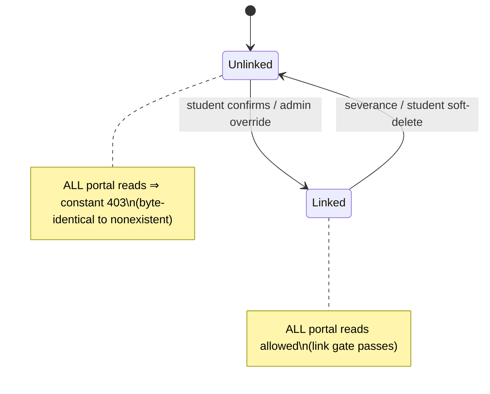

# Technical Architecture & Implementation Design: Parent Read-Only Monitoring Portal

**Plan directory (verbatim):** `ai/plans/sprint_3/parent-read-only-monitoring-portal`
**Plan path:** `ai/plans/sprint_3/parent-read-only-monitoring-portal/plan.md`
**Specs:** `ai/plans/sprint_3/parent-read-only-monitoring-portal/specs.md`
**Tasks:** `ai/plans/sprint_3/parent-read-only-monitoring-portal/tasks.md`
**Deferred-items ledger:** `ai/plans/sprint_3/parent-read-only-monitoring-portal/deferred-items.md`
**Outcome directory:** `ai/plans/sprint_3/parent-read-only-monitoring-portal/outcome/`

---

## Document Information

- **Feature Name**: Parent Read-Only Monitoring Portal
- **Target Directory**: `ai/plans/sprint_3/parent-read-only-monitoring-portal`
- **Outcome Directory**: `ai/plans/sprint_3/parent-read-only-monitoring-portal/outcome`
- **Version**: 1.0
- **Date**: 2026-09-11
- **Author**: Design author (planning wave) — all `path:line` citations below re-verified against the live tree on 2026-09-11 before being written
- **Requirements**: `ai/plans/sprint_3/parent-read-only-monitoring-portal/specs.md` (28 REQs: 001-002 protocol, 010-016 reads, 020-024 authz, 030-031 GraphQL, 040-043 UX/i18n, 050-054 testing, 060-062 gates; journeys J1-J4)
- **Research basis**: `ai/plans/sprint_3/parent-read-only-monitoring-portal/outcome/research-00-planning-basis.md` (rulings R-A..R-J — binding; this plan fleshes them out, never re-opens them)

### Related Documents

- Ticket: `docs/planning/TICKETS.md:1988-2036` (Sprint 3, Dev 1, 8 SP)
- `docs/parents/parent-link-request.md:119-123` — authorization-reads-`students.parentId`-only consumer contract (R-A)
- `docs/parents/handshake-code-discovery.md` — handshake code + link payload contracts (producers of the grant)
- `docs/workflows/04-parent-supervision-handshake.md:108-122,:164-166` — monitoring scope, restrictions, severance rule, admin-override exception
- `docs/sessions/session-report-homework.md` §2.5 (oracle-collapse reads) + the "Never widen the read authScope" / "Parent portal" rulings (~:80,:90) — the ruling this plan ANSWERS (R-E)
- `docs/specs/state-machine-invariants.md:236-238` — INV-P1 / INV-P2 (the ticket's INV-P3 citation is a documented discrepancy, specs §6.2)
- `docs/notifications/realtime-engine.md` — WS substrate; `notifySessionReportReady` already emits to the linked parent

---

## 1. Overview

The portal is a **read-only vertical slice**: five new parent-scoped GraphQL queries over four existing read models (`session`, `reports`, `home_work`, `progress`), one new service (`ParentMonitoringService`) guarded by one new gate (`requireLinkedChild`), one new i18n namespace (`parentMonitoring`), and two App Router routes (one ComingSoon-stub replacement + one new `[studentId]` detail segment) on the parent dashboard. Zero schema changes, zero new mutations, zero writes of any kind. Every REQ (010..043) traces to a repo read + service method + root query field + view tab; every invariant (INV-P1 link gate, INV-P2 read-only) is enforced at a named code seam.

### Design Goals

1. **Authorization by construction** — the grant is `students.parentId` and nothing else (R-A); the gate is a single helper every portal read funnels through (INV-P1).
2. **Derived, not duplicated** — attendance is derived from `session.status` (R-B); "teacher evaluations of the child" is the `reports` row (R-C); progress is row-count + latest homework position (R-D). No new tables (R-J).
3. **Oracle-safe denials** — unlinked/foreign/nonexistent/severed all yield ONE constant localized 403 shape (REQ-022), distinct from the participant-only `null`-collapse which stays untouched (R-E).
4. **URL is the state** — `?student=` / `?tab=` carry selection; no Zustand (package absent), so deep links and DEV1-017 notification targets work by construction (R-G, R-I).
5. **En/ar parity from the start** — one `parentMonitoring` namespace, compile-time typed, parity-tested (REQ-002/043).

### 1.1 Key Design Decisions (log D1..D12)

**D1 — Attendance is a derived read over `session` (R-B).**
- *Context:* Ticket asks for "attendance history (sessions attended, cancelled)"; no attendance table exists.
- *Options:* (a) CREATE `attendance` table + writers; (b) derive from `session.status`/`startedAt`/`endedAt`.
- *Decision:* (b). Mapping: `completed`→attended, `cancelled`→cancelled, `disputed`→disputed (surfaced), `scheduled`/`started`→upcoming/in-progress.
- *Rationale:* R-B ratified; zero new schema (R-J); classification is presentational, owned by the service's read projection.

**D2 — "Teacher evaluations" = per-session `reports` data, NOT the `evaluations` table (R-C).**
- *Context:* Ticket's "teacher evaluations (scores, notes)" vs live schema where `evaluations` (`backend/db/schema/teachers/evaluations.ts:21`) is sheikh→teacher-candidate orientation with no child scope.
- *Options:* (a) new authz analysis to surface `evaluations` (leaks unrelated people); (b) serve `reports.studentRatingByTeacher` + `teacherNotes` per session.
- *Decision:* (b), plus an explicit grep-guard: portal code MUST NOT import `evaluations`.
- *Rationale:* R-C; product intent (how the TEACHER evaluates MY CHILD) is fully satisfied; the alternative violates least-exposure.

**D3 — Progress = `progress` row count + latest `home_work` position per track (R-D).**
- *Context:* `progress` (`backend/db/schema/classes/progress.ts:19-33`) and `lessons` (`backend/db/schema/classes/lessons.ts:17-29`) are skeletons: no writers, no scores, no completion semantics.
- *Options:* (a) invent curriculum-traversal math over skeletons (fabrication); (b) honest reads: row count + latest Jadid (`currentSurahJuz`, `currentFromAyah`, `currentToAyah`) and Madi (`revision*`) positions via `HomeWorkRepository.findLatestByStudentId` (`backend/db/repo/classes/home-work.repository.ts:122`).
- *Decision:* (b). Deep traversal stats → deferred-items ledger (future curriculum ticket).
- *Rationale:* R-D; an honest `0` position display beats a fabricated percentage.

**D4 — NEW parent-scoped queries; participant-only queries stay untouched (R-E).**
- *Context:* `sessionReport`/`sessionHomework` return indistinguishable `null` to parents today; `docs/sessions/session-report-homework.md` rules "a parent read surface is a NEW ruling with its own oracle posture, not a scope tweak" (~:80-95) and its oracle-collapse section (~:46) must not regress.
- *Options:* (a) widen participant gates to include linked parents (oracle-posture regression — specs REQ-031 AC3 requires plan-review rejection of such diffs); (b) mint new root query fields with explicit parent role scopes + the new link gate, and a NEW oracle posture: constant 403 (not null) on link mismatch.
- *Decision:* (b). Query names pinned in §3.1.
- *Rationale:* R-E ratified; the diff surface on the existing queries is provably zero.

**D5 — Link grant source is `students.parentId` ONLY (R-A).**
- *Decision:* `requireLinkedChild` reads `StudentRepository.findById` (`backend/db/repo/students/student.repository.ts:356`) + a governance read on the child's `users` row; it NEVER touches `parent_link_requests` (history table) — per the binding consumer contract `docs/parents/parent-link-request.md:121-122`. A post-implementation grep-lock (REQ-061) proves zero `parent_link_requests` imports in portal code.
- *Rationale:* the student row IS the grant; admin-direct onboarding grants (workflow :166) then fall out for free (provenance-blind, REQ-021.4).

**D6 — URL-param child switcher; NO Zustand (R-G).**
- *Context:* specs REQ-011/041; `zustand` is absent from `package.json`; `frontend/stores/` holds only AGENTS.md.
- *Decision:* `?student=<id>` and `?tab=<attendance|reports|homework|evaluations|progress>` as the only cross-view state; Apollo `useQuery` variables re-keyed on `studentId` (precedent `frontend/views/teacher/sessions/TeacherSessionsContainer.tsx`). Transient UI (tab focus, dialog open) is component-local `useState`.
- *Rationale:* refresh/sharing/deep-linking work for free; adds no dependency the repo does not run. The unmasked-`fullName` ruling on linked-child payloads anchors to the shipped precedent `backend/services/classes/session-report-notification.service.ts:191` (the completion notification already emits the full name to the linked parent); R9 masking (`docs/parents/parent-link-request.md:139`) scopes to pre-confirmation surfaces only.

**D7 — Zero schema changes (R-J).**
- *Decision:* no `pgTable` edits, no migrations, `drizzle-kit push/generate` NOT run. Tasks still assert schema-parity (the `bun run generate:gqlSchema` + `bun codegen` pair is for GRAPHQL codegen only).
- *Rationale:* R-J ratified; every needed column exists (verified §2.1).

**D8 — One new namespace `parentMonitoring`, full ceremony (specs REQ-043).**
- *Decision:* camelCase handle following the `parentLink`/`handshakeCode` precedent; 7-artifact ceremony enumerated in §5.7; Jadid/Madi labels live here with en/ar pluralization functions where counts render.
- *Rationale:* REQ-002 discipline — the alternative (scattering keys into `dashboard`/`sessions`) breaks single-owner parity testing.

**D9 — Collapse reports+evaluations reads onto ONE query (specs REQ-030 "may collapse").**
- *Context:* REQ-013 (reports) and REQ-015 (evaluations) read the SAME `reports` rows through the same gate; two near-identical paginated fields would double repo and test surface.
- *Decision:* ONE query `parentChildReports`; the Evaluations tab renders the same rows through an evaluations lens (rating + notes only) client-side. The wire stays honest: both tabs are views of the report record.
- *Rationale:* zero information loss; keeps the GraphQL surface minimal (REQ-023 read-only breadth control).

**D10 — 403 (not null) as the portal's oracle posture (specs REQ-022).**
- *Context:* new per-D4 posture choice vs. the existing `null`-collapse. Ticket AC demands 403.
- *Decision:* constant `ForbiddenError` (extensions.code `FORBIDDEN`, copy from `errorsTranslations.forbidden` — the same key every existing 403 uses, so no new denial copy is introduced) with ZERO rows and ONE bounded `logDomainError` per denial. The enumeration trade-off (403 admits "some parent surface exists") is inherent to the authenticated API and mitigated by: constant copy across all mismatch causes, no per-cause timing/log divergence observable to the caller, and zero data in denial responses.
- *Rationale:* ticket AC is explicit and ratified (REQ-022); the copy constant-ness is what makes the oracle close.

**D11 — Gate+read inside ONE read-only transaction (TOCTOU ruling, §4.3).**
- *Decision:* every portal service method runs `withTransaction` (the `@/backend/lib/db/with-transaction` helper used by `parent-link-request.helpers.ts:29`); the link gate and the data reads share one snapshot.
- *Rationale:* a revocation landing between the gate and the read cannot leak rows within a single response; cross-request staleness is nonexistent by construction (no authz cache).

**D12 — Parent-shaped Pothos objects, NOT reuse of `Session`/`SessionReport`/`SessionHomeWork`.**
- *Context:* `SessionPothosObject` exposes billing/dispute internals (`fee` :170, `cancelReason` :190, `disputeReason` :191, confirmation stamps :181-183); `SessionReportPothosObject` coerces nullable rating/notes to `0`/`""` (`report.pothos.ts:46-55`), which violates REQ-013.2 ("not rated yet" must stay honest, never render as `0`).
- *Decision:* new `{Parent*}PothosObject` types backed by new closed `...ReturnType`s (§2.3). Existing participant objects untouched (D4).
- *Rationale:* BOPLA — the parent's property envelope is narrower than the participants'; the canonical-type rule (single object type per ENTITY projection) is honored because these ARE new projections, and the old projections remain single-owner.

### 1.2 Architecture & System Context

```mermaid
graph LR
    P[Parent browser] -->|cookie auth + ?student= param| R[app/(dashboard)/parent/children]
    R --> V[frontend/views/parent/monitoring containers]
    V -->|Apollo useQuery, typed documents| Q[root Query fields: myLinkedChildren, parentChildSessions, parentChildReports, parentChildHomework, parentChildProgress]
    Q -->|authScopes $all parent| S[ParentMonitoringService]
    S --> G[requireLinkedChild gate → students.parentId]
    S --> RP[StudentRepository / SessionRepository / ReportRepository / HomeWorkRepository / ProgressRepository]
    RP --> DB[(PostgreSQL: students, session, reports, home_work, progress)]
```

Existing notification emitter (`SessionReportNotificationService.notifySessionReportReady`, `backend/services/classes/session-report-notification.service.ts:147`) is OUT of the read path; it already fires on report submission and will deep-link into the portal's report view (R-I).

### Technology Stack

| Layer | Technology | Rationale |
|---|---|---|
| Frontend | React 19 + MUI v9 + Apollo Client v4 (existing) | Portal views consume `useQuery` statefully; no new deps |
| Backend | Pothos + existing scope-auth plugin (`backend/graphql/pothos/builder.ts:111-142`) | `$all` conjunction carries REQ-020 |
| Database | PostgreSQL via Drizzle (existing tables only) | R-J — zero schema change |
| i18n | Compile-time locale system (`shared/locale/`) | REQ-002/043 ceremony |
| Testing | Bun runner via `bun run test/scripts/run-test.ts`; Happy DOM for component lane | REQ-050..054 |

---

## 2. Data Models & Database Schema

### 2.1 Existing-Schema Verification (re-verified 2026-09-11)

| Table | Columns the portal reads | Evidence (live tree) |
|---|---|---|
|`students`| `id` (shared PK :21-23), `parentId` nullable FK `onDelete: "set null"` (:32), `createdAt` (:33) — the ONLY authorization grant | `backend/db/schema/students/students.ts:18-47` |
| `users` | `fullName`, `role`, `isDeleted` (:30), `suspended` (`:32`), `isBlocked` (:35) — for list display + severance check | `backend/db/schema/users/users.ts` |
| `session` | `id` (:53), `teacherId`/`studentId` (:54-59), `status` (:60), `startedAt`/`endedAt` (:66-67), `createdAt` (:76); index `session_student_id_idx` (:84) | `backend/db/schema/classes/session.ts:50-87` |
| `reports` | `id` (:23), `sessionId` NN+unique (:24-26,:36), `teacherNotes` (:27), `studentRatingByTeacher` int CHECK [0,5] (:28,:37-40) | `backend/db/schema/classes/reports.ts:20-43` |
| `home_work` | `id` (:26), `sessionId` NN+unique (:27-29,:45), Jadid `currentFromAyah/currentToAyah/currentGrade/currentSurahJuz` (:30-33), Madi `revision*` (:34-37), grade CHECKs [0,100] (:46-47) | `backend/db/schema/classes/home-work.ts:23-49` |
| `progress` | `id` (:22), `studentId` (:23-25), `lessonId` nullable (:26); count lane rides `progress_student_id_idx` (:33) | `backend/db/schema/classes/progress.ts:19-34` |
| `lessons` | NOT read by MVP (title-only skeleton :17-29) — deferred per D3 | `backend/db/schema/classes/lessons.ts` |
| `evaluations` | EXCLUDED (R-C/D2): sheikh→teacher-candidate table `backend/db/schema/teachers/evaluations.ts:21` | portal code must not import it |
| `parent_link_requests` | EXCLUDED from authorization (R-A/D5): history only | `backend/db/schema/parents/parent-link-requests.ts:39` |

### 2.2 NO schema changes (R-J / D7)

**N/A (ruled):** no new tables, columns, indexes, or Drizzle migrations. `drizzle-kit push`/`generate` are NOT part of this plan's task pipeline; the tasks phase instead runs a schema-parity assertion (no diff to `backend/db/schema/` on the shipped branch) as its DB gate. Index adequacy is argued from existing indexes only (§9).

### 2.3 New Canonical Types (CREATE — `backend/types/parents/parent-monitoring.types.ts`, registered via `backend/types/parents/index.ts` barrel → root `@/backend/types`)

House rules honored: types live ONLY under `backend/types/` (service-layer `.types.ts` are prohibited per root AGENTS.md); enums referenced via VALUE imports (`SessionStatus` from `@/backend/enum/scheduling/session-status.enum`, `SurahJuzRef` from `@/backend/enum/shared/surah-juz-ref.enum`); every shape is `readonly` and closed.

```typescript
/** One confirmed-linked child row for the portal list/grant echo. Source: students + users join. */
export interface ParentLinkedChildReturnType {
  readonly id: number;                 // students.id (== users.id)
  readonly fullName: string;           // users.fullName — own confirmed child: shown UNMASKED (ruling R-G)
  readonly createdAt: Date;            // students.created_at
}

/** One attendance entry derived from a `session` row (ruling R-B; NO attendance table). */
export interface ParentAttendanceEntryReturnType {
  readonly id: number;                 // session.id
  readonly status: SessionStatus;      // session.status — UI classifies attended/cancelled/disputed/upcoming
  readonly startedAt: Date | null;     // session.started_at
  readonly endedAt: Date | null;       // session.ended_at
  readonly createdAt: Date;            // session.created_at (booking stamp for ordering context)
}

/** Paginated window over attendance entries — mirrors SessionPageReturnType (backend/types/classes/session.types.ts:58). */
export interface ParentAttendancePageReturnType {
  readonly items: readonly ParentAttendanceEntryReturnType[];
  readonly totalCount: number;
  readonly page: number;
  readonly pageSize: number;
}

/** One parent-facing report/evaluation entry (R-C): reports row joined to its session's shell. */
export interface ParentReportEntryReturnType {
  readonly id: number;                          // reports.id
  readonly sessionId: number;                   // reports.session_id — deep-link anchor (?session=)
  readonly sessionStatus: SessionStatus;        // session.status (context for the report)
  readonly sessionStartedAt: Date | null;       // session.started_at
  readonly teacherNotes: string | null;         // reports.teacher_notes — NULLABLE, never coerced (honest "not submitted yet")
  readonly studentRatingByTeacher: number | null; // reports.student_rating_by_teacher [0,5] — NULLABLE, never coerced to 0
  readonly createdAt: Date;                     // reports.created_at
}

export interface ParentReportPageReturnType {
  readonly items: readonly ParentReportEntryReturnType[];
  readonly totalCount: number;
  readonly page: number;
  readonly pageSize: number;
}

/** One homework track (Jadid or Madi) read projection; null track = "none assigned" (never fabricated 0s). */
export interface ParentHomeworkTrackReturnType {
  readonly surahJuz: SurahJuzRef | null; // current_surah_juz / revision_surah_juz
  readonly fromAyah: number | null;      // current_from_ayah / revision_from_ayah
  readonly toAyah: number | null;        // current_to_ayah / revision_to_ayah
  readonly grade: number | null;         // current_grade / revision_grade [0,100], null until graded
}

export interface ParentHomeworkEntryReturnType {
  readonly id: number;                  // home_work.id
  readonly sessionId: number;           // home_work.session_id
  readonly jadid: ParentHomeworkTrackReturnType | null; // null when the whole Jadid block is null
  readonly madi: ParentHomeworkTrackReturnType | null;  // null when the whole Madi block is null
  readonly createdAt: Date;
}

export interface ParentHomeworkPageReturnType {
  readonly items: readonly ParentHomeworkEntryReturnType[];
  readonly totalCount: number;
  readonly page: number;
  readonly pageSize: number;
}

/** Tajweed curriculum position: latest non-null Jadid/Madi position slot (from the newest home_work row). */
export interface ParentHomeworkPositionReturnType {
  readonly surahJuz: SurahJuzRef;
  readonly fromAyah: number | null;
  readonly toAyah: number | null;
}

/** Progress summary (ruling R-D): honest skeleton count + latest homework positions; serves child header too. */
export interface ParentChildProgressReturnType {
  readonly child: ParentLinkedChildReturnType;          // the gated child echo (header renders from this)
  readonly progressRowCount: number;                     // COUNT(progress WHERE student_id = ...) — 0 is honest
  readonly latestJadidPosition: ParentHomeworkPositionReturnType | null;
  readonly latestMadiPosition: ParentHomeworkPositionReturnType | null;
}
```

**Validation rules (service-side, pre-DB):**
- `studentId` argument: positive safe integer, else the constant denial shape (REQ-024.3) — no per-field VALIDATION leak on identity probes.
- `page >= 1`, `pageSize` clamped to [1, 50] (session-list precedent caps page windows; resolver normalizes and the page types echo the effective values honestly — `SessionPageReturnType` contract).
- `ParentLinkedChildReturnType` rows are produced ONLY from rows where `users.isDeleted = false` (severance predicate, REQ-010.4).

**Relationships (read projections only):**
- `ParentAttendanceEntryReturnType.id → session.id`; reachable only via `session.studentId === <gated child>`.
- `ParentReportEntryReturnType.sessionId → session.id` (1:1 by `reports_session_id_unique`); session join feeds `sessionStatus`/`sessionStartedAt`.
- `ParentHomeworkEntryReturnType.sessionId → session.id` (1:1 by `home_work_session_id_unique`).
- `ParentChildProgressReturnType.latest*` derives from the newest `home_work` row whose session belongs to the gated child.

**Deliberately NOT created:** (a) `ParentChildOverviewReturnType` — considered and rejected as a second header surface; `parentChildProgress` already returns `child` + progress so the detail header and the progress tab are served by one payload (fewer BOLA seams, REQ-024). (b) `ParentReturnType` — the linked-children list echoes only the child projection; the parent identity never crosses the wire (BOLA). (c) Any `evaluations` DTO — D2 exclusion.

---

## 3. API Contracts & Pothos Resolvers

### 3.1 GraphQL SDL additions (new root Query fields only; ZERO new mutations — INV-P2/REQ-023)

Names pinned per specs REQ-030 (D9 collapses reports+evaluations):

```graphql
extend type Query {
  "REQ-010: the caller's confirmed-linked children (soft-deleted excluded), stable order createdAt ASC, id ASC."
  myLinkedChildren: [ParentLinkedChild!]!

  "REQ-016 (+ child header): progress row count + latest Jadid/Madi positions for a gated child."
  parentChildProgress(studentId: Int!): ParentChildProgress!

  "REQ-012: derived attendance entries (newest first), paged."
  parentChildSessions(studentId: Int!, page: Int, pageSize: Int): ParentAttendancePage!

  "REQ-013 + REQ-015: per-session report/evaluation rows (rating + notes), paged."
  parentChildReports(studentId: Int!, page: Int, pageSize: Int): ParentReportPage!

  "REQ-014: homework rows with Jadid/Madi tracks, paged."
  parentChildHomework(studentId: Int!, page: Int, pageSize: Int): ParentHomeworkPage!
}

type ParentLinkedChild { id: ID! fullName: String! createdAt: DateTime! }
type ParentAttendanceEntry { id: ID! status: SessionStatus! startedAt: DateTime endedAt: DateTime createdAt: DateTime! }
type ParentAttendancePage { items: [ParentAttendanceEntry!]! totalCount: Int! page: Int! pageSize: Int! }
type ParentReportEntry { id: ID! sessionId: Int! sessionStatus: SessionStatus! sessionStartedAt: DateTime teacherNotes: String studentRatingByTeacher: Int createdAt: DateTime! }
type ParentReportPage { items: [ParentReportEntry!]! totalCount: Int! page: Int! pageSize: Int! }
type ParentHomeworkTrack { surahJuz: SurahJuzRef fromAyah: Int toAyah: Int grade: Int }
type ParentHomeworkEntry { id: ID! sessionId: Int! jadid: ParentHomeworkTrack madi: ParentHomeworkTrack createdAt: DateTime! }
type ParentHomeworkPage { items: [ParentHomeworkEntry!]! totalCount: Int! page: Int! pageSize: Int! }
type ParentHomeworkPosition { surahJuz: SurahJuzRef! fromAyah: Int toAyah: Int }
type ParentChildProgress { child: ParentLinkedChild! progressRowCount: Int! latestJadidPosition: ParentHomeworkPosition latestMadiPosition: ParentHomeworkPosition }
```

Enum members serialize via the ONCE-registered `SessionStatusPothosEnum` (`backend/graphql/pothos/shared/enum.pothos.ts:122`) and `SurahJuzRefPothosEnum` (:330) — no new enum registrations.

### 3.2 Pothos object + resolver modules

**CREATE `backend/graphql/pothos/parents/parent-monitoring.pothos.ts`** — one module, all ten GraphQL types (`ParentLinkedChild`, `ParentAttendanceEntry`, `ParentAttendancePage`, `ParentReportEntry`, `ParentReportPage`, `ParentHomeworkTrack`, `ParentHomeworkEntry`, `ParentHomeworkPage`, `ParentHomeworkPosition`, `ParentChildProgress` — per §3.1), following the conventions at `backend/graphql/pothos/parents/parent-link-request.pothos.ts:40-51`: single `objectRef<...ReturnType>("GraphQLName")` per type, `t.exposeID("id")` FIRST on every entity shape, timestamps via `t.expose(..., { type: "DateTime" })`, enums via the once-registered Pothos enums, nullable marks exactly matching the TS nullability (BOPLA), zero inline logic, import of the ReturnTypes from the canonical `@/backend/types` surface only — NO local type definitions.

**CREATE `backend/graphql/query/parents/parent-monitoring.query.ts`** — registers the five root fields by side effect; NO named exports; barrel update (`UPDATE backend/graphql/query/parents/index.ts`: append `import "./parent-monitoring.query";` — the barrel then chains into `query/index.ts` → `gqlSchema.ts` unchanged).

Field template (every field; proven pattern at `backend/graphql/query/parents/parent-link.query.ts:55-81` and the `$all` rationale at `backend/graphql/query/classes/session-lifecycle.query.ts:20-35`):

```typescript
gqlSchemaBuilder.queryField("parentChildReports", t =>
  t.field({
    type: ParentReportPagePothosObject,
    args: {
      studentId: t.arg.int({ required: true }),
      page: t.arg.int(),
      pageSize: t.arg.int(),
    },
    description: "...",
    authScopes: {
      $all: {
        authenticated: true,          // anonymous → UnauthorizedError (401, builder.ts:127-132)
        role: [UserRole.Parent],      // non-parent → localized ForbiddenError (403, builder.ts:111-121,:134)
      },
    },
    resolve: async (_root, args, ctx) => {
      if (!ctx.user) {                                       // TS narrowing only — scope already threw
        const tErrors = await ctx.t("errorsTranslations");   // ctx.t bound to ctx.locale (gqlContextFactory)
        throw new UnauthorizedError(tErrors.unauthorized);
      }
      return ParentMonitoringService.listChildReports(
        ctx.user.id,                                         // BOLA: identity ONLY from context (REQ-024)
        args.studentId,
        { page: args.page ?? undefined, pageSize: args.pageSize ?? undefined },
        ctx.locale
      );
    },
  })
);
```

`myLinkedChildren` is zero-arg (`resolve: (_root, _args, ctx)` → `ParentMonitoringService.listLinkedChildren(ctx.user.id, ctx.locale)`) — the exact zero-argument BOLA precedent (`parent-link.query.ts:66-79`).

### 3.3 Permission matrix (every portal field)

| Field | authenticated | role | Extra predicate (service-side) | Denial code + copy source |
|---|---|---|---|---|
| `myLinkedChildren` | ✓ | `Parent` | `requireActor` re-check + `users.isDeleted=false` on children | `UNAUTHORIZED` (builder.ts:127-132) / `FORBIDDEN` `errorsTranslations.forbidden` (:119) |
| `parentChildProgress` | ✓ | `Parent` | `requireActor` + `requireLinkedChild(ctx.user.id, studentId, …)` | same; link/governance misses collapse to the SAME constant 403 (REQ-021.3, REQ-022) |
| `parentChildSessions` | ✓ | `Parent` | same gate, then `SessionRepository.listForStudent/countForStudent` | same |
| `parentChildReports` | ✓ | `Parent` | same gate, then Report repo reads | same |
| `parentChildHomework` | ✓ | `Parent` | same gate, then HomeWork repo reads | same |

### 3.4 Codegen

After any SDL/document change: `bun run generate:gqlSchema` then `bun codegen`; commit regenerated `frontend/graphql/generated/`. Schema-surface assertions (`backend/graphql/test/session-sdl.test.ts` / `schema-surface.test.ts` precedent) gain the five field pins so accidental renames fail CI.

---

## 4. Backend Services, Repositories & Concurrency Model

### 4.1 Repository layer (namespace objects; `tx` LAST; reads accept `DBQueryExecutor`, matching `StudentRepository.findById` at `backend/db/repo/students/student.repository.ts:356`)

| Member | File | State | Signature |
|---|---|---|---|
| `StudentRepository.findById` | `backend/db/repo/students/student.repository.ts:356` | EXISTING (reuse) | `(studentId: number, tx?: DBQueryExecutor): Promise<StudentSelectType \| null>` |
| `StudentRepository.listLinkedChildrenByParentId` | `backend/db/repo/students/student.repository.ts` | **NEW** | `(parentId: number, tx?: DBQueryExecutor): Promise<ParentLinkedChildRow[]>` — joins `students → users`, predicates `students.parentId = $1 AND users.isDeleted = false`, `ORDER BY students.created_at ASC, students.id ASC`; returns the `ParentLinkedChildReturnType` row projection |
| `SessionRepository.listForStudent` / `countForStudent` | `backend/db/repo/classes/session.repository.ts:528` / `:558` | EXISTING (reuse as-is; NOTE correction to the research packet: both take `tx?: DBTransaction`, not `DBQueryExecutor`, and `filter: SessionListFilterInput` per `session.types.ts:49`) | `(studentId, filter, limit, offset, tx?)` / `(studentId, filter, tx?)` — shared predicate builder in `session.repository.helpers.ts` (list/count describe the same filtered set) |
| `ReportRepository.listForStudent` / `countForStudent` | `backend/db/repo/classes/report.repository.ts` (sibling of existing `findBySessionId` :76) | **NEW** | `(studentId: number, limit: number, offset: number, tx?: DBTransaction): Promise<ReportSelectType[x] joined with session status/startedAt>` and `(studentId, tx?): Promise<number>`; inner join `reports ⋈ session ON session_id AND session.student_id = $1`, `ORDER BY session.started_at DESC NULLS LAST, reports.id DESC` |
| `HomeWorkRepository.listForStudent` / `countForStudent` | `backend/db/repo/classes/home-work.repository.ts` (sibling of :74) | **NEW** | same shape/join discipline as the report pair over `home_work` |
| `HomeWorkRepository.findLatestByStudentId` | `backend/db/repo/classes/home-work.repository.ts:122` | EXISTING (reuse as-is) | `(studentId: number, tx?: DBTransaction): Promise<HomeWorkSelectType \| null>` — newest row via joined `session.student_id` EXISTS, `ORDER BY created_at DESC, id DESC LIMIT 1` (:122-151) |
| `ProgressRepository.countForStudent` | **CREATE `backend/db/repo/classes/progress.repository.ts`** + barrel line in `backend/db/repo/classes/index.ts` | **NEW** | `(studentId: number, tx?: DBQueryExecutor): Promise<number>` — `SELECT count(*) FROM progress WHERE student_id = $1` (rides `progress_student_id_idx`, schema :33) |

No repo write of any kind is touched or introduced (INV-P2). No repo in this plan touches `evaluations` or `parent_link_requests` (D2/D5 grep-locks).

### 4.2 New service — CREATE `backend/services/parents/parent-monitoring.service.ts` (+ `parent-monitoring.helpers.ts` sibling)

```typescript
export const ParentMonitoringService = {
  /** REQ-010 — zero-arg, context-only identity. */
  async listLinkedChildren(parentActorId: number, locale: string): Promise<ParentLinkedChildReturnType[]>,
  /** REQ-016 + header echo (D: header rides the progress payload). */
  async getChildProgress(parentActorId: number, studentId: number, locale: string): Promise<ParentChildProgressReturnType>,
  /** REQ-012 — derived attendance window, page/pageSize normalized pre-DB. */
  async listChildSessions(parentActorId: number, studentId: number, page: ParentPageInput | undefined, locale: string): Promise<ParentAttendancePageReturnType>,
  /** REQ-013 + REQ-015 (D9 one surface). */
  async listChildReports(parentActorId: number, studentId: number, page: ParentPageInput | undefined, locale: string): Promise<ParentReportPageReturnType>,
  /** REQ-014. */
  async listChildHomework(parentActorId: number, studentId: number, page: ParentPageInput | undefined, locale: string): Promise<ParentHomeworkPageReturnType>,
};
```

`ParentPageInput` is defined in the SAME canonical types file (`backend/types/parents/parent-monitoring.types.ts`): `{ readonly page?: number; readonly pageSize?: number }`.

Every method shape: (1) `await requireActor(parentActorId, UserRole.Parent, locale, undefined, false)` — relaxed READ path per the helper's own docblock (`parent-link-request.helpers.ts:234-236`, "self-scoped history stays visible"; a governed-but-not-deleted parent may still read); (2) for student-scoped methods, open ONE read-only transaction via `withTransaction` (`@/backend/lib/db/with-transaction` import precedent `parent-link-request.helpers.ts:29`) and run gate + reads within it. `requireActor` is imported directly from `./parent-link-request.helpers` (same-domain sibling import precedent: `session.repository.ts` ↔ `session.repository.helpers.ts`).

**NEW gate — `requireLinkedChild` in `backend/services/parents/parent-monitoring.helpers.ts`** (exact shape; modeled on `requireActor` at `backend/services/parents/parent-link-request.helpers.ts:246-298`, including its denial-discipline docblock contract):

```typescript
export async function requireLinkedChild(
  parentActorId: number,
  studentId: number,
  locale: string,
  tx: DBQueryExecutor | undefined
): Promise<StudentSelectType> {
  const t = getServerTranslations(locale).errorsTranslations;          // SINGLE-arg accessor (REQ-002)
  const deny = (): never => {
    logger.logDomainError("Parent portal read denied: link not in force", {
      code: "FORBIDDEN",
      entity: "students",
      entityId: studentId,                                             // bounded; NO child fields ever logged
      locale,
    });
    throw new ForbiddenError(t.forbidden);                             // ONE constant copy across ALL causes
  };
  if (!Number.isSafeInteger(studentId) || studentId <= 0) return deny();       // REQ-024.3 malformed id ≡ denial
  const student = await StudentRepository.findById(studentId, tx);             // R-A: the student row IS the grant
  if (student === null || student.parentId !== parentActorId) return deny();   // INV-P1
  const childUser = await UserRepository.findById(studentId, tx);              // governance re-check
  if (childUser === null || childUser.isDeleted) return deny();                // REQ-021.3 severance — same shape
  return student;
}
```

Denied probes produce exactly ONE bounded `logDomainError` (REQ-022.2), zero rows, zero writes, and identical response bytes across nonexistent/foreign/never-linked/severed cases (D10 oracle posture). Per-surface projection mapping (session row → `ParentAttendanceEntryReturnType`, report+session pair → `ParentReportEntryReturnType`, `HomeWorkSelectType` → track blocks + `ParentHomeworkPositionReturnType` extraction) lives in the SAME helpers file as pure functions.

**Governance ruling for `requireLinkedChild`:** child soft-delete severs access immediately — `users.isDeleted = true` forces the constant denial on the very next read (workflow rule `docs/workflows/04-parent-supervision-handshake.md:164`). Child suspended/blocked (`users.suspended` / `users.isBlocked`) does NOT sever parent read access — deliberate: suspension governs the child's LOGIN posture, not the parent's monitoring posture, so the gate checks `isDeleted` only and never the suspension flags (note the pseudo-signature above checks `childUser.isDeleted` alone).

### 4.3 Concurrency & Race Condition Assessment

Reads only ⇒ structurally low risk; assessed anyway:

| Scenario | Risk | Ruling / Mitigation |
|---|---|---|
| **Link-revocation TOCTOU** (student severs link between the parent hitting Resolver layer-1 scope and the repo read) | A denied-after-mid-flight read could leak rows inside a response | D11: gate + all data reads run inside ONE `withTransaction` (default READ COMMITTED snapshot per statement set is sufficient — no second request's visibility can extend a returned payload). Cross-request staleness is impossible by construction: no authz/page cache exists (J2 EARS-1) |
| Concurrent list windows while a teacher submits new rows | Page shift / duplicate items across pages | Accepted classically: `list+count` share one predicate builder; stable orders pinned (`session`: newest-first per repo contract; `reports`/`home_work`: `session.started_at DESC, id DESC`). Pagination is offset-based (repo convention), not a cursor — honest `totalCount` per response |
| Two parents, one student | Impossible by schema (B.12, one parent per student) | N/A — one-row grant |
| Writes from portal | None exist | **No advisory locks, no FOR UPDATE, no idempotency claims — stated explicitly: the portal's write-set is empty (INV-P2/REQ-023)** |

**Pagination decision (records REQ-011.2's deterministic choice — PINNED):** the portal root server page is a guard-only shell (per specs NFR 5.1) — it performs NO server-side auto-select/redirect. When the URL carries NO `?student` param, the CLIENT root container resolves the selection AFTER `myLinkedChildren` resolves: it auto-selects the first linked child (stable list order) client-side and navigates to `/parent/children/<id>`; zero-children renders the localized empty state. Deterministic, deep-link-friendly.

### 4.4 Cross-Actor Journey Design (mirrors specs J1–J4; assertion source for `test/workflows/parents/parent-monitoring.journey.test.ts`)

**Shared-entity state machines (both pre-exist; the portal only OBSERVES):**

| Entity | Transition | Triggering actor | Portal effect |
|---|---|---|---|
| `students.parentId` | NULL → set | student confirms link request / admin onboarding override | parent gains portal access to that child on the NEXT read |
| `students.parentId` | set → NULL | severance flows (outside this ticket) | parent loses access immediately (constant 403); list excludes the child |
| `users.isDeleted` (student) | false → true | admin soft-delete | identical severance semantics (REQ-021.3) |
| `session.status` | scheduled → completed (→ disputed) | teacher completes (+ dual confirmation) | row becomes visible in attendance as `completed`; report/homework become visible once submitted |



**Side-effect matrix (per transition):**

| Transition | Rows touched by THIS plan | Notifications | Idempotency |
|---|---|---|---|
| teacher completes session | NONE (reads only) | `session_completion` already emitted by `SessionReportNotificationService.notifySessionReportReady` (`backend/services/classes/session-report-notification.service.ts:147`) to the linked parent — display owned by DEV1-017 | N/A (portal performs zero writes) |
| severance / soft-delete | NONE | none (workflow rule) | N/A |
| parent portal read | NONE | none | N/A |

**Cross-actor visibility:**

| State | Teacher sees | Student sees | Parent sees |
|---|---|---|---|
| Linked, session completed, report submitted | own session + report (participant queries, unchanged) | own session + report (unchanged) | attendance entry + report/homework rows via NEW queries; `session_completion` notification (DEV1-017 renders it) |
| Linked, report not yet submitted | session, no report | session, no report | attendance row only; report/homework rows honestly absent |
| Unlinked / nonexistent id | n/a | n/a | constant 403, zero data, one bounded log |

Other-actor actors (teacher flow writes, notification emitter) ship nothing in this plan; the journey test wires them through existing PUBLIC service surfaces only.

---

## 5. Frontend UX & Navigation Specification

### 5.1 Routes (App Router conventions re-verified against `node_modules/next/dist/docs/01-app/03-api-reference/03-file-conventions/dynamic-routes.md` — dynamic segment folder + async `params: Promise<{ studentId: string }>`; `page.md` — async `searchParams: Promise<{ [key: string]: string \| string[] \| undefined }>`)

| Route (file) | Purpose | Guard | Roles |
|---|---|---|---|
| `app/(dashboard)/parent/children/page.tsx` (UPDATE — replaces ComingSoon stub :20-22) | Portal root — guard-only server shell (PINNED, specs NFR 5.1): NO server-side auto-select/redirect; renders the client root container, which resolves a missing `?student=` param client-side after `myLinkedChildren` resolves (auto-selects first child) or shows the localized empty state (§4.3) | `withPageAuth({ roles: [UserRole.Parent], redirectTo: "/parent/children" })` (pattern: `app/(dashboard)/parent/handshake/page.tsx:33-36`) | parent |
| `app/(dashboard)/parent/children/[studentId]/page.tsx` (CREATE) | Child detail: server shell awaits `params` (`const { studentId } = await params`), parses/supplies `pageSize`-free view params (`?tab=`, `?session=` deep-link anchor) via `searchParams`, renders the client container | same `withPageAuth` + service-side `requireLinkedChild` on every backing query | parent (own linked child only) |

**Deep-link contract (R-I):** `/parent/children/<studentId>?tab=reports&session=<sessionId>` — the target DEV1-017's `session_completion` notifications will emit; component layer resolves the tab and scrolls to the row.

Clients NEVER hand-roll param parsing: server pages extract + validate detail params (integer coercion failures on `[studentId]` redirect to the portal root) and pass plain props into the container; on the portal ROOT the server page stays a guard-only shell and the CLIENT container resolves a missing `?student=` (PINNED, §4.3) — there is no server-side auto-select/redirect. No `useSearchParams` suspense gymnastics in server files.

### 5.2 Sidebar navigation integration (REQ-042)

UPDATE `frontend/views/dashboard/nav/navItems.ts:136` INSIDE the EXISTING `NAV_ITEMS_BY_ROLE[UserRole.Parent]` block (:133-139):

```diff
- { route: "/children", labelKey: "children", Icon: ChildrenIcon },
+ { route: "/parent/children", labelKey: "children", Icon: ChildrenIcon },
```

No new keys: `children` already exists in `DashboardLabels` (`shared/locale/types/dashboard/index.ts:53`) and `resolveNavItemLabel`'s `DashboardLabels` ownership (:190-199) stays valid — the NavLabelKey exclusion guard (:55-77) is untouched. **Verdict (mobile/desktop):** ONE config drives BOTH the desktop permanent drawer and the mobile temporary drawer via `DashboardSidebar.tsx` — no per-breakpoint variant work; NO bottom nav anywhere in this product.

### 5.3 Role-based access matrix (roles are exactly `UserRole.Admin | Teacher | Student | Parent` — `backend/enum/users/user-role.enum.ts:5-10`; no others exist)

| Surface | Admin | Teacher | Student | Parent (linked) | Parent (unlinked) |
|---|---|---|---|---|---|
| `/parent/children` routes | Deny (withPageAuth) | Deny | Deny | Allow (own children) | Allow root; empty state |
| Portal GraphQL queries | 403 role scope | 403 | 403 | 200 own / 403 foreign | 200 `[]` list; 403 any `studentId` |
| Participant-only `sessionReport`/`sessionHomework` | `null` (unchanged) | own (unchanged) | own (unchanged) | `null` (unchanged, R-E) | `null` (unchanged) |

### 5.4 Per-audience rendering

| Audience | Portal experience |
|---|---|
| Parent, 0 linked children | Portal root renders `IconCircleEmptyState` (`frontend/components/ui/IconCircleEmptyState.tsx:30`) + CTA copy pointing to the handshake flow (`/parent/handshake`) |
| Parent, ≥1 linked | Child switcher (URL `?student=`), five tabs, per-tab empty/denied/data states |
| Parent probing foreign id | `PermissionDeniedFallback` (`frontend/components/ui/PermissionDeniedFallback.tsx:36`) fed by `extractErrorCode` + `mapGraphQLErrorByCode` (precedent `frontend/views/admin/analytics/PlatformAnalyticsContainer.tsx:54-55,:104-107`) |
| Any non-parent | These views are unreachable (server guard + client layout fallback) — nothing renders |

### 5.5 Frontend GraphQL documents — CREATE `frontend/graphql/sharedDocuments/parents/parent-monitoring.documents.ts` (+ `index.ts` barrel line)

Conventions from `parents/parent-link.documents.ts:1-59`: `TypedDocumentNode<…>` typed against generated types, `id` FIRST in every selection, docblock per document, hooks consumed from `@apollo/client/react`, NO `useLazyQuery`. Documents:

```graphql
query MyLinkedChildren { myLinkedChildren { id fullName createdAt } }

query ParentChildProgress($studentId: Int!) {
  parentChildProgress(studentId: $studentId) {
    child { id fullName createdAt }
    progressRowCount
    latestJadidPosition { surahJuz fromAyah toAyah }
    latestMadiPosition { surahJuz fromAyah toAyah }
  }
}

query ParentChildSessions($studentId: Int!, $page: Int, $pageSize: Int) {
  parentChildSessions(studentId: $studentId, page: $page, pageSize: $pageSize) {
    items { id status startedAt endedAt createdAt }
    totalCount page pageSize
  }
}

query ParentChildReports($studentId: Int!, $page: Int, $pageSize: Int) { parentChildReports(...) { items { id sessionId sessionStatus sessionStartedAt teacherNotes studentRatingByTeacher createdAt } totalCount page pageSize } }

query ParentChildHomework($studentId: Int!, $page: Int, $pageSize: Int) { parentChildHomework(...) { items { id sessionId jadid { surahJuz fromAyah toAyah grade } madi { surahJuz fromAyah toAyah grade } createdAt } totalCount page pageSize } }
```

Export names: `myLinkedChildrenQueryDocument`, `parentChildProgressQueryDocument`, `parentChildSessionsQueryDocument`, `parentChildReportsQueryDocument`, `parentChildHomeworkQueryDocument`. Clients send ONLY `studentId` + pagination — no identity/role hints (REQ-024.4).

### 5.6 View module layout — CREATE `frontend/views/parent/monitoring/`

| File | Role |
|---|---|
| `ParentChildrenRootContainer.tsx` | Portal root container: `useQuery(myLinkedChildrenQueryDocument)`; empty → empty-state; ≥1 → switcher + auto-select-first deterministic behavior |
| `ParentChildDetailContainer.tsx` | Receives validated `studentId` + `tab` + `session` from the server page; owns child switcher (writes `?student=`), MUI `Tabs` (writes `?tab=`), re-keys child `useQuery` hooks on `studentId` |
| `AttendanceTab.tsx` / `ReportsTab.tsx` / `HomeworkTab.tsx` / `EvaluationsTab.tsx` / `ProgressTab.tsx` | One tab per surface; EvaluationsTab consumes `parentChildReports` rows (D9) |
| `index.ts` barrel + co-located state/projection helpers | components-only exports |

**State matrix per tab:** `loading` → skeleton; `error` FORBIDDEN (via `extractErrorCode` + `mapGraphQLErrorByCode` "permission-fallback") → `PermissionDeniedFallback`; other errors → `ErrorRetryAlert` (`frontend/components/ui/ErrorRetryAlert.tsx:28`); data-empty → `IconCircleEmptyState` (`:30`) with localized copy; data → rows. Deep-link `?session=` scrolls the Reports tab to that `sessionId`. Deep-link `?session=` scrolls the Reports tab to that `sessionId`.

**Styling:** MUI v9 `sx` ONLY (no style props on Typography/Stack/Box/Grid), `*Outlined` icon names, theme palette callbacks (`theme.palette.*` + Material 3 `on*` siblings) — no hardcoded colors. `AppDataGrid`/`MetricCard`/`PageContainer` do NOT exist in `frontend/components/ui/` (verified listing) — plain `Stack`/`Card` composition instead. CAUTION: a view-local `MetricCard` lives at `frontend/views/admin/analytics/MetricCard.tsx:34` — it is analytics-scoped and MUST NOT be imported here.

### 5.7 i18n — `parentMonitoring` namespace ceremony (REQ-043, exact files)

1. CREATE `shared/locale/types/parentMonitoring/index.ts` — `ParentMonitoringLabels` type (strings; `(count: number) => string` for pluralized counts; interpolation functions for names).
2. UPDATE `shared/locale/types/message.ts` — import `ParentMonitoringLabels` and add `parentMonitoringTranslations: ParentMonitoringLabels;` to the `Translations` interface (precedent: `parentLinkTranslations: ParentLinkLabels;` at `shared/locale/types/message.ts:39`). REQUIRED before step 3 — the handle's getter references `translations.parentMonitoringTranslations`.
3. CREATE `shared/locale/namespaces/parentMonitoring/parentMonitoring.namespace.ts` — `export const ParentMonitoring = defineNamespace<ParentMonitoringLabels>("parentMonitoring.parentMonitoring", translations => translations.parentMonitoringTranslations);` (verbatim shape of `shared/locale/namespaces/parentLink/parentLink.namespace.ts:4-7`).
4. CREATE `shared/locale/namespaces/parentMonitoring/index.ts` barrel.
5. CREATE `shared/locale/en/parentMonitoring/index.ts` (`parentMonitoringEn: ParentMonitoringLabels`). Keys must cover: tab labels (attendance/reports/homework/evaluations/progress), Jadid/Madi track names, column labels, empty-state title/body per surface, switcher label, "not rated yet" / "none assigned", detail-page title. 
6. CREATE `shared/locale/ar/parentMonitoring/index.ts` (`parentMonitoringAr`) — full Arabic parity.
7. UPDATE `shared/locale/namespaces/registry.ts` (insert `ParentMonitoring` import + entry inside the :27-47 object, alphabetical), UPDATE `namespaces/index.ts` barrel.
8. UPDATE `shared/locale/en/messages.ts` + `shared/locale/ar/messages.ts` (`parentMonitoringTranslations: parentMonitoringEn/…Ar` on the aggregates).
9. CREATE `shared/locale/parentMonitoring-namespace.parity.test.ts` — key/shape parity check (precedent `shared/locale/parentLink-namespace.parity.test.ts`).

Consumption: client views `useAppTranslation(ParentMonitoring)`; server pages `getTranslations(locale)` single-arg → `.parentMonitoringTranslations`; NO `Translation.` enum, NO two-arg `getTranslations`, denial copy stays on `errorsTranslations` (no duplicate denial keys — REQ-043.4).

---

## 6. Security, Authorization & Tenancy Mitigations

| Class | Mitigation (named seam) |
|---|---|
| **BOLA** | Parent identity from `ctx.user.id` ONLY (zero-arg list + `studentId` validated against the caller's grant inside `requireLinkedChild` before ANY data read — REQ-024). No client-supplied parent id exists anywhere in the SDL args or documents. |
| **BOPLA** | Reads only: no input object ever touches a write path, so no mass-assignment surface exists by construction (state it and move on). Output side: NEW parent projections expose exactly the fields in §2.3 — the participant `Session` object's billing/dispute columns (`session.pothos.ts:170,:190-194`) NEVER appear on parent objects. |
| **BFLA** | `$all { authenticated, role: [UserRole.Parent] }` at the field level (layer 1) + `requireActor` re-check (layer 2): admins/teachers/students cannot reach the service at all; the portal has NO admin override surface (REQ-020.3). |
| **Enumeration oracle (REQ-022 / D10)** | One constant localized `ForbiddenError` for nonexistent/foreign/never-linked/severed/malformed ids; zero rows in denials; one bounded `logDomainError` per denial (never logging child row data — REQ-022.2 note). Trade-off recorded: 403 (vs null-collapse) is ticket-AC-mandated; the copy/shape constancy is the mitigation. |
| **LIKE-wildcards** | **N/A — ruled:** the portal has NO search input; no `ILIKE` surface exists. |
| **Soft-deleted child** | `users.isDeleted = false` predicate in `listLinkedChildrenByParentId` (list exclusion) + governance re-check in `requireLinkedChild` (detail reads) → immediate denial with the constant shape (workflow rule :164, REQ-021.3). |
| **Not-yet-visible data** | Attendance surfaces only the child's own sessions; `scheduled`/`started` rows render as "upcoming in-progress" labels — no hidden-state disclosure beyond the child's own schedule, which the parent is entitled to per monitoring scope (workflow :108-122). |
| **Legend link-request table** | `parent_link_requests` is NOT imported by any portal file (REQ-061 grep-lock CI check). |

---

## 7. Error Handling

| Category | Trigger | Response | Copy source |
|---|---|---|---|
| 401 unauthenticated | anonymous hits any portal field | `UnauthorizedError`, `extensions.code = "UNAUTHORIZED"` (builder.ts:127-132) | `errorsTranslations.unauthorized` |
| 403 wrong role | non-parent authenticated caller | localized `ForbiddenError`, `FORBIDDEN` (builder.ts:111-121) | `errorsTranslations.forbidden` |
| 403 link/identity probe | `requireLinkedChild` denial (all causes) | constant shape, zero data, one bounded log | `errorsTranslations.forbidden` (D10) |
| Read-only "mutation attempt" | **N/A by design** — no parent mutation field exists on portal surfaces (INV-P2/REQ-023); ticket's "modify → 403" case is satisfied by absence + existing per-field role scopes on OTHER surfaces. No new "read-only" error code is introduced. | — | — |
| Empty states | zero rows | HTTP 200, honest `[]`/count `0` `/null` positions; localized empty copy in UI | `parentMonitoring` namespace |
| Malformed `studentId` | non-integer / ≤0 | SAME 403 constant shape (REQ-024.3 — no VALIDATION leak for identity args) | `errorsTranslations.forbidden` |

Logging: backend code uses ONLY `logger` from `@/backend/lib/logger` (`logDomainError` for the single denial line); `console.*` is forbidden. Frontend error surfacing rides `mapGraphQLErrorByCode` + `PermissionDeniedFallback`/`ErrorRetryAlert`; server messages are NEVER rendered raw (analytics precedent).

---

## 8. Testing Strategy (specs REQ-050..054)

Runner discipline everywhere: `bun run test/scripts/run-test.ts <path>` — NEVER raw `bun test` for db/service/workflow lanes.

| Layer | New suites | Key assertions |
|---|---|---|
| Repo (REQ-050) | `backend/db/test/repo/students/student.parent-monitoring.repository.test.ts`; `backend/db/test/repo/classes/report.parent.repository.test.ts`; `backend/db/test/repo/classes/home-work.parent.repository.test.ts`; `backend/db/test/repo/classes/progress.repository.test.ts` (CREATE) | `runInRollback` + `tx` on EVERY repo call; fixtures via `backend/db/test/entity-setup.ts` (signatures re-verified at authoring); try/catch helper for rejection assertions (never `rejects.toThrow`); ordering/pagination windows; join predicates isolate cross-student leakage |

| Layer | New suites | Key assertions |
|---|---|---|
| Service (REQ-051) | `backend/services/parents/parent-monitoring.service.test.ts` (+ helpers test) | linked→data; unlinked→`ForbiddenError`; cross-child→`ForbiddenError`; soft-deleted child→`ForbiddenError` (SAME constant copy, asserted against `getServerTranslations(locale).errorsTranslations.forbidden` for en AND ar); malformed id→same; empty sets→honest empty payloads; page clamping echoed |
| Wire (REQ-052) | CREATE `backend/graphql/test/parent-monitoring.wire.test.ts` (precedent `backend/graphql/test/parent-link.wire.test.ts`) | role×op matrix over all five queries: anonymous→401; admin/teacher/student→403; parent-unlinked→403 (detail) & 200-[] (list); parent-linked→200; parent-foreign-id BOLA probe→403 zero data; `extensions.code` asserted; en AND ar denial copy asserted |
| SDL locks | extend surface assertions (precedent `session-sdl.test.ts` / `schema-surface.test.ts`) | five field names + arg shapes pinned; INV-P2 lock: grep-assert ZERO new fields on root `Mutation` referencing portal service |
| UI components (REQ-053) | CREATE `test/ui/components/parent-monitoring/*.test.tsx` (Happy DOM + mocked Apollo — no server; lane `bun run test:ui:components`) | children list empty/loaded; switcher URL-param behavior; five tabs × loading/empty/data/403; `PermissionDeniedFallback` on FORBIDDEN, `ErrorRetryAlert` on transient errors; RTL render ar |
| Journeys (REQ-054) | CREATE `test/workflows/parents/parent-monitoring.journey.test.ts` (precedent `student-confirmation-of-link.journey.test.ts`) | J1 teacher completes + submits → parent reads report/homework; J2 severance → immediate 403 everywhere; J3 unlinked probes → constant 403 (en+ar); J4 multi-child switch → correct per-child data. Committed fixtures via entity-setup helpers + tracked `afterAll` cleanup; NO `runInRollback` (journey lane writes for real) |

Pipeline discipline per task: per-file `bun run scripts/health/sub-loop.ts <file> --lifecycle duplicates` before moving on (REQ-001.5); semantic-review checklist per REQ-001.6. Coverage tiers ride the existing QL/TE subtask pipeline (tier 1 types, tier 2 repos, tier 3 service/wire, tier 4 UI/journey).

---

## 9. Performance / Deployment / Migration Compatibility

- **Index usage:** children list → `students_parent_id_idx` (`students.ts:41`); session-scoped reads → `session_student_id_idx` (`session.ts:84`); report/homework joins → `reports_session_id_idx` (`reports.ts:41`) + `home_work_session_id_idx` (`home-work.ts:48`) plus unique constraints; progress count → `progress_student_id_idx` (`progress.ts:33`). No new index is needed.
- **Bounded reads:** hard pagination on every list (`pageSize` clamp ≤50; repo `list`/`count` pairs share one predicate builder); each query is scoped to ONE student — no cross-child fan-out (NFR 5.1).
- **Deployment:** `bun run generate:gqlSchema` + `bun codegen` produce the only build-affecting artifact; no env vars, no infra changes.
- **Migration:** **N/A (ruled)** — zero Drizzle schema changes (D7/R-J); rollback = revert.
- **Backward compatibility:** participant-only queries untouched (D4/REQ-031); nav change is a pure retarget, no route removal (legacy `/children` catch-all behavior unchanged).

---

## 10. Outcome & Knowledge Transfer Protocol

Fixed three-bullet protocol for `ai/plans/sprint_3/parent-read-only-monitoring-portal/outcome/`:

- **BEFORE any task:** the executing agent MUST read ALL files under `ai/plans/sprint_3/parent-read-only-monitoring-portal/outcome/` — starting with `0-baseline-outcome.md` (measured 2026-09-11 baseline: tsgo errors 0, biome warnings 0, lint-service full-repo exit 0) and this plan's review-gate record.
- **AFTER each task:** write `ai/plans/sprint_3/parent-read-only-monitoring-portal/outcome/<task-id>-outcome.md` (research findings, implementation details, cross-file dependencies, carry-overs) AND flip the task checkbox `[ ]` → `[x]` in `ai/plans/sprint_3/parent-read-only-monitoring-portal/tasks.md`.
- **AT closeout:** the canonical doc `docs/parents/monitoring-portal.md` lands (REQ-062: gate contract, query surface, oracle posture, R-A..R-J carriage, DEV1-017 deep-link target, DEV1-019 consumer guidance), `AGENTS.md` Important References gains the entry, and `docs/parents/parent-link-request.md`'s forward pointer is satisfied.

---

## Design Review Checklist (author self-certification)

- [x] Architecture described (§1.2 system context + flow) — read-only vertical slice with named layers.
- [x] Component responsibilities & interfaces specified — §3 (queries/objects) + §4 (repos/services) with exact signatures and file paths.
- [x] Technology choices justified — reuse-only stack; no new dependencies (Zustand ruled out D6).
- [x] All functional REQs traced — REQ-010..016 → queries/types §2.3/§3.1; REQ-020..024 → scopes + gate §3.2/§4.2; REQ-030..031 → SDL + untouched-oracle ruling; REQ-040..043 → §5; REQ-050..054 → §8; REQ-060..062 → §10.
- [x] Non-functional requirements considered — pagination/indexes/logging (§9, §6, §7).
- [x] Every cross-actor journey has state machine + side-effect matrix + visibility — §4.4 (J1-J4).
- [x] Security addressed — BOLA/BOPLA/BFLA/oracle table §6; LIKE-wildcard explicitly N/A (no search input).
- [x] Error handling comprehensive — §7 categories incl. the read-only N/A ruling.
- [x] UX/Navigation complete — routes table, sidebar integration diff (+mobile/desktop verdict), 4-role matrix, per-audience rendering, i18n ceremony (§5.1-5.7). Permission-mapping table from other repos is N/A here (replaced by the authScopes matrix §3.3 — permission scope is a placeholder, `builder.ts:137`).
- [x] Implementation-ready — every named artifact is either verified-existing (with `path:line`) or explicitly labeled CREATE; no invented paths.
- [x] R-A..R-J preserved verbatim — decisions D1-D12 encode them; no ruling re-opened.
- [x] Anti-pattern sweep — no `Translation.` enum, no two-arg `getTranslations`, no `@/frontend/utils/logger`, no raw `bun test`, no bottom nav, no `useLazyQuery`, no service-layer `.types.ts`, only the four real roles.
