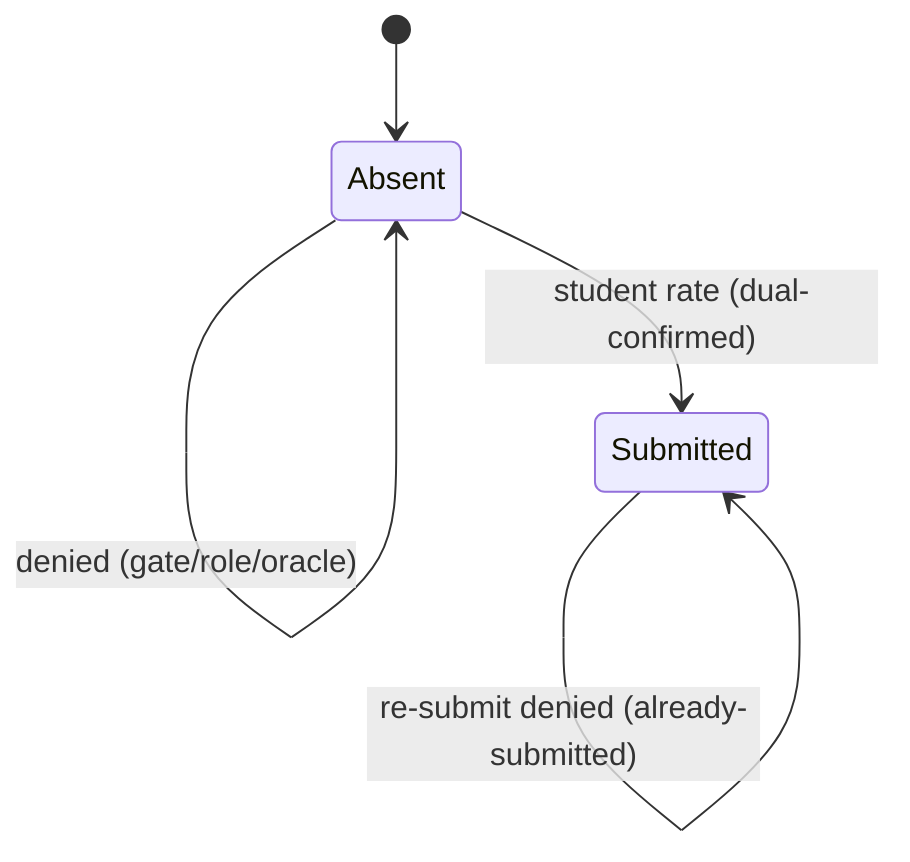

# Technical Architecture & Implementation Design: Student Evaluation Submission (Teacher Rating)

> **Plan of record:** `ai/plans/sprint_3/student-evaluation-submission-teacher-rating/`
> **Specs:** `specs.md` REQ-001..REQ-014 (incl. REQ-J1..J4)
> **Canonical refs:** `docs/sessions/session-lifecycle.md` (DEV2-016 consumption rule :163), `docs/specs/state-machine-invariants.md` (INV-E1..E6 :296-303), `docs/specs/open-decisions-and-gaps.md` (C.3 :199-203), `docs/graphql/error-handling-contract.md`, `docs/IDEMPOTENCY.md`
> **Ticket:** DEV2-016 (`docs/planning/TICKETS.md:2073`) · Dev 2 · Sprint 3 · 3 SP · Blocker DEV3-012 shipped
> **Version:** 1.0 · **Date:** 2026-09-11

---

## 1. System Overview & Architecture

### 1.1 Scope Statement

Ship the student→teacher rating write path on the already-existing `evaluations` table: schema hardening (write-once unique index) → typed repository → gated service → GraphQL surface (`submitTeacherEvaluation` + `myTeacherEvaluations`) → student sessions UI (Rate CTA + dialog). No new tables, no new routes, no notifications, no aggregation (aggregation is DEV2-017).

### 1.2 Layer Flow

```
Student (sessions row "Rate" action)
  → useMutation(submitTeacherEvaluationMutationDocument)          [frontend/views/student/sessions/]
  → POST /api/graphql                                             [app/api/graphql/route.ts]
  → authScopes { $all: { authenticated, role: [Student] } }       [backend/graphql/pothos/builder.ts]
  → mutation/classes/student-evaluation.mutation.ts  (thin: id coercion + member-map)
  → StudentEvaluationService.submitTeacherEvaluation  (guards → tx → probe → gate → insert)
  → SessionRepository.findRatingEligibilityProbe (session row read, non-locking)
  → EvaluationRepository.insertOnce  (UNIQUE arbiter; 23505 → typed conflict)
  → evaluations row (score = rating × 20)                         [backend/db/schema/teachers/evaluations.ts]

Read-back (rated state):  myTeacherEvaluations → EvaluationRepository.listByEvaluator
```

### 1.3 Key Design Decisions

| ID | Decision | Rationale / Evidence |
|---|---|---|
| D1 | Reuse the existing `evaluations` table; zero new tables | C.3 landed its shape (`schema/teachers/evaluations.ts:21-48`); student rating is the table's second consumer |
| D2 | Write-once arbitration via `UNIQUE(session_id, evaluator_id)`, never a pre-check SELECT | Repo/services AGENTS mandate; check-then-insert races; 23505 → `EVALUATION_ALREADY_SUBMITTED` (precedent `session-report.service.ts:290-300`) |
| D3 | Eligibility = `status='completed'` ∧ `confirmed_by_teacher_at` ∧ `confirmed_by_student_at`, read via a new, non-locking probe | Ticket AC ("dual confirmation done"); lifecycle rule `docs/sessions/session-lifecycle.md:163` (read-only consumption, no lifecycle writes) |
| D4 | Oracle collapse: non-participant/unknown id → identical `NotFoundError("SESSION")` | Sessions-are-sensitive ruling `session-lifecycle.md:131`; pattern `session-lifecycle.confirmation.ts:135` |
| D5 | UI input = whole stars 1–5; server stores `score = rating × 20` (INV-E1 scale) | Ticket AC explicitly allows "0-5 rating converted to score"; conversion centralized server-side so DEV2-017 reads one canonical scale |
| D6 | Ticket's literal "422" delivered as typed `ConflictError` codes over GraphQL | Contract reserves 422⇒`VALIDATION` for input shape; custom domain codes never map to HTTP (`error-handling-contract.md:42-56`) |
| D7 | No notifications, no audit rows in this ticket | AC requires neither; `NotificationType.EvaluationResult` reserved (ledger D2); audit census covers admin-gated mutations only |
| D8 | File placement: schema/repo/service/types/pothos under the **teachers** domain (entity home); mutation under **classes** (session-gated flow family, = `confirmSessionCompletion` precedent); query under **teachers** (=`myApplicantProfile` precedent) | Mirrors where each sibling lives today; no new dir conventions invented |
| D9 | Rated-state comes from a separate `myTeacherEvaluations` query (Set of sessionIds); the sessions-list payload is NOT modified | Keeps DEV3-011/012 read surfaces untouched; one indexed query per page load |
| D10 | i18n: extend existing `sessions` (UI copy) + `errors` (denials) namespaces; NO new namespace; `sessionRatingRange` key untouched | Six-touchpoint cost of a new namespace buys nothing here; key owner conflict documented in REQ-007 |
| D11 | Rate CTA mounts in the existing `studentActionsForSession` descriptor seam; dialog follows the `CancelSessionConfirmDialog` pattern | `useStudentSessionConfirm.ts:152-175` was built for exactly this kind of action |
| D12 | `myTeacherEvaluations` unpaginated in v1 | Per-student volume is naturally bounded; pagination deferred (ledger D3) |
| D13 | Extend notification deep-link map: `SessionCompletion → /student/sessions` | Turns the existing completion_prompt notification into a funnel to the Rate CTA (`notification-route-resolution.ts:35-50`) |

**Rejected alternatives:**
- *Locking probe (FOR UPDATE)* — unnecessary: post-confirmation state is monotonic; no write depends on the probe value besides duplicate arbitration, which the UNIQUE index owns (§4.3).
- *Store raw 1–5 in `score`* — breaks INV-E1's shared 0–100 scale and poisons DEV2-017's aggregation and the `platform-analytics` average (`platform-analytics.repository.ts:378-384`), which already reads the 0–100 meaning.
- *New `evaluations` namespace + new route `/student/evaluations`* — over-domain for a row-level action on an existing list; nav/config churn with zero UX gain.

---

## 2. Data Models & Database Schema

### 2.1 Existing Schema Verification (READ-ONLY findings)

`backend/db/schema/teachers/evaluations.ts` — full contract (verified 2026-09-11):

| Column | Type | Null | Rule |
|---|---|---|---|
| `id` | integer identity PK | NOT NULL | :24 |
| `evaluated_id` | integer → `users.id` CASCADE | NOT NULL | :25-27 (C.3: the teacher for this flow) |
| `evaluator_id` | integer → `users.id` RESTRICT | NOT NULL | :28-30 (C.3: the student for this flow) |
| `session_id` | integer → `session.id` SET NULL | NULL | :31 |
| `score` | integer, CHECK 0–100 | NULL | :32,43 (INV-E1) |
| `notes` | text | NULL | :33 (unused by this flow) |
| `is_deleted` / `deleted_at` | boolean default false / timestamp | NULL | :34-35 (INV-E2) |
| `created_at` / `updated_at` | timestamp defaultNow | NOT NULL | :36-40 |

Indexes exist on all three FK columns (:44-46). **Indexed ≠ unique** — one rating per (session, evaluator) is currently unenforced.

### 2.2 Schema Change (the only one)

Add to the table's third-arg block:

```ts
unique("evaluations_session_evaluator_unique").on(t.sessionId, t.evaluatorId),
```

- Applied via `bun run db push` (Drizzle schema change — push, not migrate).
- Safe posture: no production writer rows exist today (zero non-test insert paths); PG unique treats NULL `session_id` values as distinct, so the applicant-evaluation consumer is unaffected.
- Doc-comment at `evaluations.ts:6-20` is amended to document both consumers (sheikh applicant evaluation; student session rating with `score = rating × 20`).
### 2.3 Canonical Types

`backend/types/teachers/evaluation.types.ts` (extends the existing one-line file; `EvaluationSelectType` at :3 preserved):

```ts
export type EvaluationInsertType = typeof evaluations.$inferInsert;

/** GraphQL-facing row: soft-delete internals and the unused `notes` stay server-side. */
export type EvaluationReturnType = Omit<
  EvaluationSelectType,
  "isDeleted" | "deletedAt" | "notes" | "updatedAt"
>;

/** Student's star input. Server converts `rating` (1..5) → `score` (20..100). */
export interface EvaluationSubmitInput {
  readonly rating: number;
}
```

`backend/types/classes/session.types.ts` — additive type next to (not modifying) `SessionTransitionProbeRowType` (:72-75):

```ts
export type SessionRatingEligibilityProbeType = Pick<
  SessionSelectType,
  "id" | "studentId" | "teacherId" | "status" | "confirmedByTeacherAt" | "confirmedByStudentAt"
>;
```

---

## 3. API Contracts & Pothos Resolvers

### 3.1 GraphQL Schema Additions (SDL)

```graphql
type Evaluation {
  id: ID!
  evaluatedId: Int!
  evaluatorId: Int!
  sessionId: Int
  score: Int
  createdAt: DateTime!
}

input SubmitTeacherEvaluationInput {
  rating: Int!
}

extend type Mutation {
  submitTeacherEvaluation(sessionId: ID!, input: SubmitTeacherEvaluationInput!): Evaluation!
}

extend type Query {
  myTeacherEvaluations: [Evaluation!]!
}
```

### 3.2 Pothos Definition Details

- `backend/graphql/pothos/teachers/evaluation.pothos.ts` — `objectRef<EvaluationReturnType>("Evaluation")` (`id` first; nullability mirrors §3.1) and `gqlSchemaBuilder.inputType("SubmitTeacherEvaluationInput", …)` (string-named input per `backend/graphql/AGENTS.md`; no `inputRef`). Registered transitively via the mutation/query imports — same convention as `pothos/teachers/applicant.pothos.ts`.
- `backend/graphql/mutation/classes/student-evaluation.mutation.ts` — resolver shape (mirrors `session-report.mutation.ts:65-123`):

```ts
gqlSchemaBuilder.mutationField("submitTeacherEvaluation", t =>
  t.field({
    type: EvaluationPothosObject,
    args: {
      sessionId: t.arg.id({ required: true }),
      input: t.arg({ type: SubmitTeacherEvaluationPothosInput, required: true }),
    },
    authScopes: { $all: { authenticated: true, role: [UserRole.Student] } },
    resolve: async (_root, args, ctx) => {
      if (!ctx.user) throw new UnauthorizedError((await ctx.t("errorsTranslations")).unauthorized);
      const sessionId = requirePositiveIntId(Number(args.sessionId), "sessionId");
      return StudentEvaluationService.submitTeacherEvaluation(
        ctx.user.id, sessionId, { rating: args.input.rating }, ctx.locale,
      );
    },
  }));
```

- `backend/graphql/query/teachers/student-evaluation.query.ts` — `queryField("myTeacherEvaluations")` → `t.field({ type: [EvaluationPothosObject], authScopes: same, resolve: ctx.user-scoped call })`.
- Registration: side-effect import added to `backend/graphql/mutation/classes/index.ts` and `backend/graphql/query/teachers/index.ts` respectively.
- After wiring: `bun run generate:gqlSchema && bun codegen`; extend `backend/graphql/test/sdl-static-assertions.test.ts` pins.
### 3.3 Error Mapping (`extensions.code`)

| Code | Producer | HTTP envelope | Client behavior (via `mapGraphQLErrorByCode`) |
|---|---|---|---|
| `UNAUTHORIZED` | builder `authenticated` scope (`builder.ts:127-129`) | 401 class | redirect-to-login (existing behavior) |
| `FORBIDDEN` | builder `role` scope (`builder.ts:119`) | 403 class | existing denial surface |
| `SESSION_NOT_FOUND` | service (unknown id **or** non-participant) | 200 + errors | notice; session removed from local rated-candidate state |
| `EVALUATION_SESSION_NOT_COMPLETED` | service gate | 200 + errors | localized notice; Rate action stays |
| `EVALUATION_ALREADY_SUBMITTED` | service (23505 map) | 200 + errors | localized notice; row marked rated (idempotent UX convergence) |
| `VALIDATION` + `extensions.fields[]` | guards (`assertPositiveSafeSessionId`, rating range) | 422 taxonomy class | inline dialog field error via `mutationFieldErrors.ts` |

All domain messages resolve through `ctx.t`/`getServerTranslations(locale).errorsTranslations` for the request locale; the boundary finalizer passes DomainErrors through with `extensions.requestId` (no service-side masking/logging of transport concerns).

### 3.4 Permission Matrix

> Reality check (verified 2026-09-11): there is **no permission-slug system** in code — `AppPermission`/`PermissionsService`/`requirePermissionForPage` are documented aspirations only. Authorization is role-based via `authScopes` plus service-side participant gates. The matrix therefore uses roles.

| Operation | `student` (session participant) | `student` (non-participant) | `teacher` | `parent` | `admin` | anonymous |
|---|---|---|---|---|---|---|
| `mutation submitTeacherEvaluation` | ✅ (gates apply) | `SESSION_NOT_FOUND` (oracle-identical to unknown) | `FORBIDDEN` | `FORBIDDEN` | `FORBIDDEN` | `UNAUTHORIZED` |
| `query myTeacherEvaluations` | ✅ own rows only | n/a (no session arg) | `FORBIDDEN` | `FORBIDDEN` | `FORBIDDEN` | `UNAUTHORIZED` |
| Route `/student/sessions` (existing, hosts the CTA) | ✅ page (`withPageAuth`, `app/(dashboard)/student/sessions/page.tsx:32-35`) | — | redirect/deny | deny | deny | redirect to login |
| No new routes, no new pages, no sidebar entries | — | — | — | — | — | — |

---

## 4. Services, Repositories & Concurrency

### 4.1 Service — `backend/services/teachers/student-evaluation.service.ts`

```ts
export namespace StudentEvaluationService {
  export async function submitTeacherEvaluation(
    studentUserId: number,
    sessionId: number,
    input: EvaluationSubmitInput,
    locale: string,
    outerTx?: DBTransaction,
  ): Promise<EvaluationReturnType>;

  export async function listMyTeacherEvaluations(
    studentUserId: number,
    tx?: DBQueryExecutor,
  ): Promise<readonly EvaluationReturnType[]>;
}
```

`submitTeacherEvaluation` pipeline (all denials: one `logger.logDomainError`, then re-throw):

1. Resolve `const t = getServerTranslations(locale).errorsTranslations` once (established idiom — one handle threaded through guards).
2. Pre-DB: `assertPositiveSafeSessionId(sessionId, t)` → `ValidationError`; `Number.isInteger(input.rating) && input.rating >= 1 && input.rating <= 5` else `ValidationError(t.teacherRatingInvalid, [{ field: "rating", code: "TEACHER_RATING_INVALID", message: t.teacherRatingInvalid }])` (field entries carry `code` per `ApiFieldErrorType`).
3. `withTransaction(outerTx, async tx => { … })`.
4. `const probe = await SessionRepository.findRatingEligibilityProbe(sessionId, tx)`.
5. Oracle gate: `if (probe === null || probe.studentId !== studentUserId) throw new NotFoundError("SESSION", t.sessionNotFound)`.
6. Completion gate: `if (probe.status !== SessionStatus.Completed || probe.confirmedByTeacherAt === null || probe.confirmedByStudentAt === null) throw new ConflictError("EVALUATION_SESSION_NOT_COMPLETED", t.evaluationSessionNotCompleted)`.
7. Insert with derived values; catch `23505` ⇒ `ConflictError("EVALUATION_ALREADY_SUBMITTED", t.evaluationAlreadySubmitted)`.
8. Map row → `EvaluationReturnType` (strip soft-delete/notes/updatedAt).
### 4.2 Repositories

`backend/db/repo/teachers/evaluation.repository.ts`:

```ts
export namespace EvaluationRepository {
  /** Write-once insert; the UNIQUE(session_id, evaluator_id) constraint arbitrates duplicates. */
  export async function insertOnce(
    values: Pick<EvaluationInsertType, "evaluatedId" | "evaluatorId" | "sessionId" | "score">,
    tx: DBTransaction,                                          // REQUIRED — write path
  ): Promise<EvaluationSelectType>;

  /** Caller's own ratings, live rows only, newest first. */
  export async function listByEvaluator(
    evaluatorId: number,
    tx?: DBQueryExecutor,
  ): Promise<readonly EvaluationSelectType[]>;
}
```

Non-tx read rule: the `tx`-less `listByEvaluator` path MUST use `queryDb` raw SQL, not a bare Drizzle `db.select` (`backend/AGENTS.md` non-transactional read rule; precedent two-branch shape `report.repository.ts:63-72`).
```

`backend/db/repo/classes/session.repository.ts` — additive method beside `findTransitionProbe` (:346):

```ts
/** Non-locking eligibility read for the rating flow; the dual-confirmation state is monotonic. */
export async function findRatingEligibilityProbe(
  sessionId: number,
  tx: DBTransaction,                                            // REQUIRED — joins caller's tx
): Promise<SessionRatingEligibilityProbeType | null>;
```

Barrels: `backend/db/repo/teachers/index.ts` gains `export * from "./evaluation.repository";`. Conventions per `backend/db/repo/AGENTS.md`: namespace export, writes take required `tx`, member-by-member payloads, no business logic, no translated strings in repos.

### 4.3 Concurrency & Race-Condition Assessment

| Scenario | Actors | Risk | Mitigation |
|---|---|---|---|
| Double-click / retry storm | one student | duplicate row | UNIQUE index; 23505→`EVALUATION_ALREADY_SUBMITTED`; failing tx inserts nothing |
| Two tabs, same student, same session | one student | duplicate row | same arbiter (REQ-J2 chaos-proves it) |
| Rating during dispute/lifecycle churn | student + teacher | stale eligibility | probe reads confirmation stamps, which are monotonic post-confirmation; the row being disputed later does not invalidate a historical rating; no write touches the session |
| Sweep races a rating on an unconfirmed session | cron + student | rating after auto-cancel | gate requires the student stamp, which the sweep only fires in absence of; ordered by tx semantics — loser sees `EVALUATION_SESSION_NOT_COMPLETED` |
| Star-scale drift across producers | future writers | mixed scales in `score` | doc-comment + D5 + canonical doc (REQ-014) pin `rating × 20` |

TOCTOU statement: the only read-then-write pair is (probe → insert); its correctness does not depend on the probe remaining true — only on (a) participation being immutable for a session row, and (b) the unique index, which is race-free. No `SELECT FOR UPDATE`, no advisory locks, no module-level state are introduced.

`listByEvaluator` read isolation: default read-committed is correct (caller-scoped live rows).

### 4.4 Cross-Actor Journey Design (binds REQ-J1..J4)

**Shared-entity state machine** (`evaluations` row for a `(session, student)` pair):

| State | Trigger | Next | Guard |
|---|---|---|---|
| *(absent)* | student submits on dual-confirmed session | `SUBMITTED` | participant probe + dual stamps + rating 1..5 |
| *(absent)* | student submits pre-confirmation | *(absent)* | `EVALUATION_SESSION_NOT_COMPLETED` |
| *(absent)* | non-participant submits | *(absent)* | `SESSION_NOT_FOUND` (oracle) |
| `SUBMITTED` | any re-submit | `SUBMITTED` (unchanged) | UNIQUE → `EVALUATION_ALREADY_SUBMITTED` |



**Side-effect matrix:**

| Transition | Rows written | Notifications | Audit | Idempotency |
|---|---|---|---|---|
| → `SUBMITTED` | one `evaluations` row (`score=rating×20`) | none (D7) | none (not admin-gated) | `UNIQUE(session_id,evaluator_id)` |

**Cross-actor visibility:**

| Actor | After submission sees |
|---|---|
| Student | row via `myTeacherEvaluations`; rated state on the session row |
| Teacher | nothing new in this ticket (rating visibility/average is DEV2-017 + later surfaces) |
| Parent | existing surfaces only (DEV1-016/017), unchanged |
| Admin | `platform-analytics` aggregate now includes the row's score (existing reader) |

### 4.5 DEV2-017 Forward Contract (documented, NOT built here)

- Aggregation reads: all non-soft-deleted `evaluations` rows where `evaluated_id = teacherUsersId` (`permission` to add this read belongs to DEV2-017).
- Conversion: `teacher.average_rating = ROUND(AVG(score) / 20, 2)` clamped by the `0–5` CHECK (`teacher.ts:37`); `NULL`/0-rating semantics per its ticket (TICKETS.md:2130 mentions default 0).
- This ticket guarantees: one row per (session, student), non-null score in 20..100 steps, `session_id` always populated — the aggregator needs no self-defense beyond soft-delete exclusion.
---

## 5. Frontend UX & Navigation Specification

### 5.1 Routes & URLs — explicit no-new-route ruling

| Route | Type | Purpose | Auth |
|---|---|---|---|
| *(none added)* | — | This feature adds no route; the entry point is an action on the existing list | — |
| `/student/sessions` (EXISTING) | page | Hosts the new Rate action + dialog | `withPageAuth({ roles: [UserRole.Student] })` (`app/(dashboard)/student/sessions/page.tsx:32-35`) |

### 5.2 Sidebar / Navigation Integration

- **Sidebar:** unchanged — `NAV_ITEMS_BY_ROLE[UserRole.Student]` (`frontend/views/dashboard/nav/navItems.ts:116-124`) untouched. No new item; no new group; **no bottom-nav entries** (none exist for this surface; none added).
- **Deep links:** `frontend/lib/notification-route-resolution.ts:35-37` gains `NotificationType.SessionCompletion → <student sessions route>`; today NO route constant exists for `/student/sessions` (verified — the file holds only `STUDENT_LINK_REQUESTS_ROUTE`/`NOTIFICATIONS_FEED_ROUTE`), so the task creates a `STUDENT_SESSIONS_ROUTE` leaf-module constant following the `STUDENT_LINK_REQUESTS_ROUTE` precedent (frontend cross-surface single-source rule).
- **Mobile:** the row-action seam renders inside the shared `SessionRowCardShell` on both drawers breakpoints (`DashboardSidebar.tsx:83-121` handles nav only; row actions are breakpoint-agnostic). The dialog uses MUI `Dialog` `fullWidth` with `maxWidth="xs"` and full-screen behavior under `sm` per the repo's dialog conventions.

### 5.3 Role-Based Access & Per-Audience Rendering

| Audience | `/student/sessions` row affordances |
|---|---|
| Student (own, dual-confirmed, unrated) | **Rate Teacher** action + success state after submit |
| Student (own, dual-confirmed, rated) | read-only rated chip (no action) |
| Student (own, awaiting their confirmation) | existing Confirm action unchanged; Rate hidden |
| Teacher | no change — shared `SessionRow` receives no rate descriptor (role seam honored; `SessionRow.tsx:48-57` docblock) |
| Parent / Admin | no surface (their read paths are other tickets) |

### 5.4 Components, Documents & State

| Artifact | Path | Notes |
|---|---|---|
| Documents | `frontend/graphql/sharedDocuments/teachers/student-evaluation.documents.ts` (+ sub-dir `index.ts`) | `submitTeacherEvaluationMutationDocument`, `myTeacherEvaluationsQueryDocument`; TypedDocumentNode convention; `id` first in selections |
| Hook | `frontend/views/student/sessions/useMyTeacherEvaluations.ts` | `useQuery(myTeacherEvaluationsQueryDocument)`; exposes `ratedSessionIds: ReadonlySet<number>` + apollo `update()` writer |
| Dialog | `frontend/views/student/sessions/RateTeacherDialog.tsx` | MUI `Rating` (1–5), `sx`-only styling, `StarOutlined`/`StarBorderOutlined`, per-star aria-label interpolation, reduced-motion respected, localized copy from `sessions` namespace |
| CTA wiring | `frontend/views/student/sessions/useStudentSessionConfirm.ts:152-175` | new `rate` descriptor appended after `confirm`; gate = completed ∧ both stamps ∧ `!ratedSessionIds.has(session.id)` |
| Dialog host | `frontend/views/student/sessions/StudentSessionsDialogs.tsx` | registered alongside Cancel/Dispute dialogs, using the per-row in-flight slot book (`useStudentSessionDialogSlots`) |
| Error surfacing | `frontend/providers/apollo/error-link.map.ts` (+ `utils/mutationFieldErrors.ts`) | new-code behaviors per §3.3; VALIDATION → inline dialog error |

Rules observed: hooks from `@apollo/client/react`; no `useLazyQuery`; mutation success writes cache via `update()`/`cache.modify` (no refetch); enum-string comparisons go through `Record<string, …>` lookup tables (oxlint `no-unsafe-enum-comparison`); all colors from the theme palette; `Evaluation` carries `id` so no `keyFields: false` policy entry is needed.

### 5.5 i18n, RTL & Accessibility

- New keys per REQ-009.7; en+ar in the same change; `sessions-namespace.parity.test.ts` auto-verifies parity.
- RTL: star row order and dialog actions inherit the document direction; no directional CSS introduced.
- a11y: `Rating` gets `aria-label` per star via the interpolated `ratingStarAriaLabel`; dialog traps focus (MUI default), `aria-busy` on submit while in-flight; success/notice surfaces follow the shared `GraphQLErrorSurfaceHost` model.
- Reduced motion: dialog transition disabled under `prefers-reduced-motion` (`frontend/AGENTS.md` pattern).

---

## 6. Security, Authorization & Tenancy Mitigations

(Spec details in REQ-011; this is the engineering mapping.)

| Threat | Mitigation (implemented where) | Proof |
|---|---|---|
| BOLA/IDOR — rate someone else's session | participant predicate on probe; server-derived `evaluatorId` | service tests + REQ-J4 |
| BOPLA mass assignment | member-by-member mapping in resolver + service; no spread | code review + wire test payload fuzz |
| BFLA — role escalation | `$all { authenticated, role: [UserRole.Student] }` | wire tests: teacher/parent → FORBIDDEN |
| Info disclosure (session existence) | oracle-identical `SESSION_NOT_FOUND` | service test snapshot-compares error shape/message |
| Injection | numeric-only inputs; pre-DB guards | Tier-4 fuzz in service tests |
| Duplicate submission | UNIQUE constraint arbiter | REQ-J2 chaos test |
| SSRF/network | none — no outbound calls in this flow | n/a |
| Auth context | `ctx.user.id` only; no client-supplied identity | resolver review |

No tenant tables, no wallet/money movement, no env-config keys, no audit-census obligations (not an admin mutation).

---

## 7. Verification Anchors (consumed by `tasks.md`)

| Anchor | Command / Location |
|---|---|
| Per-file quality | `bun run scripts/health/sub-loop.ts <file> --lifecycle duplicates` (exit 0) |
| Repo tests | `bun run test/scripts/run-test.ts backend/db/test/repo/teachers/evaluation.repository.test.ts` |
| Service tests | `bun run test/scripts/run-test.ts backend/services/teachers/student-evaluation.service.test.ts` |
| Journey | `bun run test/scripts/run-test.ts test/workflows/teachers/student-teacher-rating.journey.test.ts` |
| GraphQL wire | `bun run test:graphql` (suite `backend/graphql/test/student-evaluation.wire.test.ts`) |
| Component | `bun run test:ui:components` |
| Schema apply | `bun run db push` then confirm `evaluations_session_evaluator_unique` exists |
| Codegen refresh | `bun run generate:gqlSchema && bun codegen` |
| Global gate | `bun quality-gate` |
| Traceability sweep | every `REQ-…` in `specs.md` appears in `tasks.md` |
