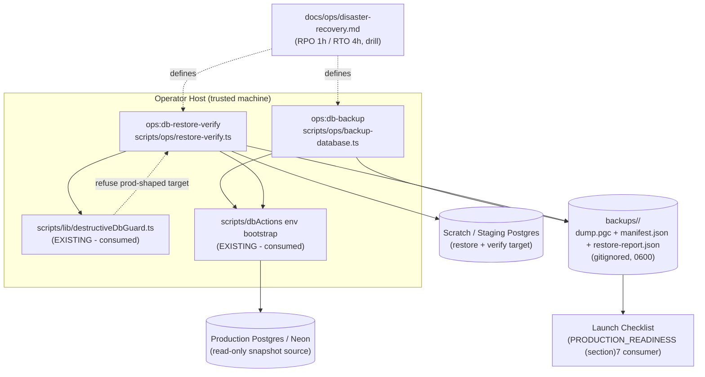
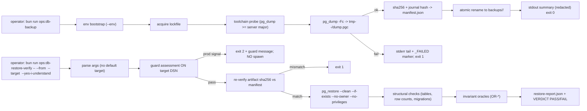

# Design Document: Disaster Recovery & Backup Verification

## Document Information

- **Feature Name**: Disaster Recovery & Backup Verification
- **Target Directory**: `ai/plans/sprint_4/disaster-recovery-backup-verification`
- **Outcome Directory**: `ai/plans/sprint_4/disaster-recovery-backup-verification/outcome`
- **Version**: 1.0
- **Date**: 2026-09-05
- **Author**: Dev 3 stream (planning agent)
- **Reviewers**: Launch-checklist executor (downstream consumer), Admin stakeholder
- **Related Documents**: `ai/plans/sprint_4/disaster-recovery-backup-verification/specs.md` (requirements), `tasks.md` (execution), `deferred-items.md` (ledger), `docs/planning/PRODUCTION_READINESS.md` §7, `docs/DATABASE_MIGRATIONS.md`, `docs/SQLITE_LOCAL_DEV.md`, `docs/notifications/realtime-engine.md`

## Overview

This design delivers disaster recovery as **operator tooling, not application code**. Two Bun scripts under `scripts/ops/` (matching the verified existing convention):

1. **`backup-database.ts`** — produces a transactionally-consistent `pg_dump -Fc` artifact into an isolated timestamped run directory, then writes a `manifest.json` (provenance + SHA-256 + Drizzle journal hash) so every backup is independently verifiable.
2. **`restore-verify.ts`** — consumes a run directory, re-verifies the artifact hash, **refuses any production-shaped target via the existing destructive-command guard**, restores into an explicit scratch/staging DSN with `pg_restore`, then proves the restore: structural table checks plus an **invariant oracle registry** that re-executes the platform's financial/governance invariants (INV-W*, INV-B*, INV-U*, A.5) as read-only SQL predicates, finally emitting a tamper-evident `restore-report.json` ending in `VERDICT: PASS|FAIL`.

A canonical runbook (`docs/ops/disaster-recovery.md`) ratifies **RPO = 1 hour / RTO = 4 hours**, documents scheduling, embedding the scripts into a step-timed recovery procedure and a cold-start drill whose measured duration becomes the RTO evidence consumed by the launch checklist for PRODUCTION_READINESS §7 sign-off.

### Design Goals

- **Proof over hope** — every backup carries a verifiable manifest; every restore claim terminates in a PASS/FAIL report. No unverifiable artifact counts as a backup (specs REQ-011.3).
- **Production can never be the restore target** — the *existing* `assessDestructiveDbCommandSafety()` decides, assessed on the very DSN string passed to `pg_restore` (single-variable TOCTOU-safe), plus a mandatory `--yes-i-understand` human gate.
- **Conventions-preserving** — identical bootstrap (`scripts/dbActions/envFile.ts`), flags (`--env`), exit codes (0/1/2), help layout, stdout-as-ops-record (`console.*` exemption), and colocated `*.test.ts` as `scripts/ops/sweep-expired-link-requests.ts` and `scripts/dbActions/*`.
- **Evidence-generating** — manifests, reports, and the drill timing file feed the launch checklist's PRODUCTION_READINESS §7.1–7.5 sign-off directly.
- **Zero application surface** — nothing in `app/`, `backend/graphql/`, `frontend/`, or `backend/db/schema/` changes; `git diff` on those trees MUST be empty.

### Key Design Decisions

#### Decision 1: `pg_dump -Fc` custom format (not plain SQL, not managed-only)

**Context:** Logical backup tool choice for Postgres/Neon. **Options:** (a) plain `pg_dump` SQL — human-readable but huge, slow parallel restore impossible, brittle to replay; (b) `pg_dump -Fc` custom format — compressed, selectively restorable, `pg_restore`-native; (c) rely solely on Neon PITR/snapshots — zero tooling but console-side, non-portable, and doesn't satisfy "restore to staging + verify" testing without extra work anyway. **Decision:** `-Fc` custom format as the primary, with Neon PITR documented as the complementary layer (D-001 console evidence). **Rationale:** portability across any Postgres shape + native selective restore + compression, while still acknowledging managed snapshots.

#### Decision 2: Restore requires explicit `--target` + guard + `--yes-i-understand` (triple gate)

**Context:** The most catastrophic failure mode of DR tooling is restoring a stale dump *over production*. **Options:** (a) default target = DATABASE_URL with a confirmation prompt; (b) explicit `--target` only, guarded by the existing destructive guard, plus non-TTY confirmation flag; (c) restore orchestrated inside the app admin UI. **Decision:** (b). **Rationale:** eliminates the blind default; reuses the audited guard module instead of inheriting a parallel, druggable check; BFLA-safe by absence of any app surface; matches specs REQ-015/016/025/031.

#### Decision 3: Invariant oracles as data-driven read-only SQL registry

**Context:** "Restore verified" must mean "the platform's own invariants hold on restored data," but invariants evolve ticket by ticket. **Options:** (a) hardcode checks inline in control flow; (b) data-driven `const ORACLES: { id; description; sql }[]` where each entry maps to a `docs/specs/state-machine-invariants.md` anchor; (c) reuse service-layer verification (would import backend services into ops scripts — layer violation). **Decision:** (b). **Rationale:** adding future invariants is a pure data append (specs REQ-018.4); zero app-layer coupling; read-only SQL keeps the scratch DB disposable.

#### Decision 4: Timestamped run directories + manifest/report artifacts (not a single rolling file)

**Context:** Backup storage layout. **Options:** (a) overwrite `latest.dump`; (b) run directories `backups/<utc>/` with tmp→final atomic rename and lockfile; (c) push straight to object storage. **Decision:** (b), with (c) forward-deferred as D-003 — the manifest format is designed so a future uploader can consume run directories without producer changes. **Rationale:** idempotent re-runs, crash-safe atomicity, retains failed-run evidence, and keeps a clean evidence trail for the launch checklist.

#### Decision 5: No i18n / no logger package in ops scripts

**Context:** Repo rule says user-facing strings use the compile-time locale system and logging goes through `logger.*`. **Options:** (a) route script output through backend logger + locale namespaces; (b) keep the established `scripts/ops/` precedent: English `console.*` stdout as the ops record. **Decision:** (b), with the exemption formally recorded in the runbook conventions section (specs REQ-000.5, REQ-052). **Rationale:** these are operator-facing developer tools; forcing the app i18n/logger stack would couple ops tooling to app bootstrap and break the `scripts/ops/` family convention verified in Phase-0 (G-06).

### UX/Navigation Specification (REQUIRED section — resolved as documented N/A)

| Item | Specification |
|---|---|
| New Routes & URLs | **None** — no pages created |
| Sidebar/Navigation Integration | **None** — `frontend/views/dashboard/navItems.ts` untouched (verified Phase-0: no ops section exists) |
| Role-Based Access Matrix | All in-app roles (SUPER_ADMIN, ACADEMY_ADMIN, SUPERVISOR, TEACHER, PARENT, STUDENT, STAFF, USER, GUEST): **N/A** — backup/restore is shell-only operator capability (BFLA by absence, specs REQ-032) |
| Per-Audience Rendering | N/A — no rendering exists |
| Permission Mapping | N/A — no permission strings introduced |
| Mobile Bottom Nav | N/A — no mobile component exists for ops, and none is introduced |

This is a deliberate, Phase-0-evidenced negation: Phase-0 grep/tree inspection of `frontend/views/dashboard/` and `backend/graphql/` confirmed no DR surface exists to extend.

### Translation System Requirements

Exempt by scope (no UI and no user-facing app strings). Ops-script stdout follows the `scripts/ops/` English, `console.*` precedent; the exemption is recorded in the runbook conventions section so future audits don't flag it (specs REQ-000.5, REQ-052). Enum/import rules still apply to any enum touchpoints (none planned; tests use plain string oracle ids — no enums introduced).

### Concurrency & Race Condition Assessment (CONDITIONAL — included: shared mutable state = the backup output area)

| Scenario | Actors | Risk | Mitigation |
|---|---|---|---|
| Two operators run backup simultaneously | Operator ×2 on one host | Interleaved/corrupt run dirs | Run-dir lockfile `backups/.lock-<pid>` with PID-liveness stale reclamation (REQ-042) |
| Backup vs live OLTP writes | App writes during dump | Inconsistent snapshot | pg_dump single-snapshot MVCC semantics; documented in runbook (REQ-012) |
| Crash mid-backup | Host failure | Half-written run dir mistaken for valid | Stage in `tmp-<pid>-<ts>/`, atomic rename only after manifest write; `_FAILED` suffix marker on known failures (REQ-040/013.3) |
| TOCTOU on restore target safety | Fast operator edits/env between check and exec | Assessed DSN ≠ restored DSN | Single DSN variable flows verbatim from arg → guard assessment → pg_restore argv; no re-parse |
| Restore while scratch serves tests | Another job using scratch DB | `--clean --if-exists` wipes shared scratch | Runbook: scratch DBs are throwaway; drill creates fresh `kottaby_drill_<ts>` DBs |
| Large-artifact hash vs restore start | Disk corruption between backup and restore | Restoring bit-rotted dump | SHA-256 recompute + manifest compare BEFORE pg_restore (REQ-015.2) |

**SELECT FOR UPDATE / advisory locks:** not applicable — specs scripts execute no in-app transactions; concurrency control is filesystem-level (lockfile) plus OS snapshot semantics.

### Cross-Actor Journey Design (CONDITIONAL — ruled N/A)

Per specs §Journeys: single-actor operational tooling; the "shared entity" (the database) is read-snapshotted by the backup and restored into an isolated scratch DB that serves no traffic. No multi-actor state machine exists, therefore:
- **Shared-Entity State Machine:** none — the runbook defines a linear procedure, not a domain state machine.
- **Side-Effect Matrix (operational analogue):**

  | Step | Rows created/updated | Artifacts produced | Notifications |
  |---|---|---|---|
  | backup | none (read snapshot) | `dump.pgc`, `manifest.json` (0600) | none (stdout record) |
  | restore-verify | scratch DB only | `restore-report.json` | none |
  | drill | scratch DB only | outcome evidence file | none |

- **Cross-Actor Visibility:** Admin sees the runbook + drill evidence; operators see the run directory; no in-app visibility for any role.

The drill chain is asserted end-to-end by the REQ-061 integration test and the REQ-022 human drill, not by a `test/workflows/` journey (ruling recorded; escalation path: ledger).

### Drizzle SQL Template Anti-Patterns (CRITICAL reminder for implementers)

No `sql` templates are written by this ticket (oracle queries go through `psql` argv, not the app's Drizzle runtime). If implementation ever does add app-side SQL, inline `--` comments inside ``sql``…`` templates are forbidden (they shift parameter bindings).


## Architecture

### System Context



### High-Level Flow



### Technology Stack

| Layer | Technology | Rationale |
|---|---|---|
| Script runtime | Bun TS (`scripts/ops/*.ts`) | Matches existing ops family; `@/`-aliased imports; no build step |
| Backup binary | `pg_dump` (`-Fc`), `pg_restore` | Postgres-reference tooling; Neon-compatible |
| Oracle execution | `psql -Atc` (argv, no shell string) | Read-only predicates; zero app-runtime coupling |
| Integrity | SHA-256 (Bun crypto) | Tamper evidence for manifest↔artifact↔report triangle |
| Safety | `scripts/lib/destructiveDbGuard.ts` | Existing audited production-signal guard (G-04) |
| Env loading | `scripts/dbActions/envFile.ts` (`applyEnvFile`) | Verified convention (G-06) |
| Storage | `<repo>/backups/` (gitignored, 0600) | PII containment; D-003 forward-defers off-site |
| Docs | `docs/ops/disaster-recovery.md` | New docs subtree per skill propagation rules |

## Components and Interfaces

### Component 1: `scripts/ops/backup-database.ts` (CREATE)

**Purpose:** Produce a consistent, machine-verifiable logical backup of the configured Postgres database.

**Responsibilities:**
- Parse CLI args (`--env <file>`, `--out-dir <dir>` default `<repo>/backups`, `--help`) with exit-2 usage errors.
- Bootstrap env via shared `applyEnvFile` (G-06); resolve and validate `DATABASE_URL`.
- Probe toolchain (`pg_dump` presence, version vs server major).
- Acquire run-directory lockfile; stale-lock reclamation via PID liveness.
- Execute `pg_dump -Fc` into a staging `tmp-<pid>-<ts>/` dir; stream/capture stderr for failure reporting.
- Compute SHA-256 of artifact; compute Drizzle journal hash (`backend/drizzle/` listing) for the manifest; write `manifest.json`; chmod 0600 both.
- Atomically rename staging dir to `backups/<UTC-YYYYmmddTHHMMSSZ>/`; print redacted summary; exit 0.
- On any failure: mark run `_FAILED`, release lock, exit 1 with tagged stderr.

**Interfaces:**
- **Input:** CLI args + env (DATABASE_URL).
- **Output:** run directory (`dump.pgc`, `manifest.json`), stdout summary, exit code.
- **Dependencies:** `scripts/dbActions/envFile.ts`, `Bun.spawn`, node crypto, fs.

**Implementation Notes:**
- All spawns via argv arrays — never composed shell strings (injection-safe).
- Credentials never printed; `redactDsn()` helper emits only `dbName@host(redacted-user)`.
- Run-dir timestamp collision → deterministic `-2`, `-3` suffix (REQ-024).

### Component 2: `scripts/ops/restore-verify.ts` (CREATE)

**Purpose:** Restore a verified backup into an explicit, guard-approved scratch/staging database and prove post-restore integrity.

**Responsibilities:**
- Parse CLI args (`--from <runDir|artifact>`, `--target <dsn>` REQUIRED, `--yes-i-understand`, `--help`); exit 2 when `--target` missing.
- Guard-assess the **target** DSN through existing `assessDestructiveDbCommandSafety()`; refusal → exit 2, guard message, zero spawns.
- Locate run directory; recompute artifact SHA-256; compare against manifest; mismatch → exit 1.
- `pg_restore --clean --if-exists --no-owner --no-privileges` into target.
- Run structural checks (expected tables present; REQ-017 critical-table row counts; `__drizzle_migrations` last-hash vs manifest `journalHash`).
- Run invariant oracle registry (see below) via read-only `psql` queries.
- Write `restore-report.json` (0600) into the run directory; print summary ending `VERDICT: PASS|FAIL` + absolute report path; exit 0 on PASS, 1 on FAIL.

**Interfaces:**
- **Input:** `--from` run dir, `--target` DSN, confirmation flag.
- **Output:** `restore-report.json`, stdout verdict, exit code.
- **Dependencies:** `scripts/lib/destructiveDbGuard.ts` (read-only consume), shared redaction helper (small internal util), `Bun.spawn`.

**Implementation Notes:**
- Single DSN variable threaded parse → guard → restore (TOCTOU-safe).
- Structural expectations derived from the live `backend/db/schema/` table exports at runtime (no stale hardcoded list).
- Oracle registry is `const ORACLES: { id: string; description: string; invariantAnchor: string; sql: string }[]`; verification loop is registry-driven so adding oracles never touches control flow.

### Component 3: Invariant Oracle Registry (data, embedded in restore-verify)

| Oracle | Anchor | Predicate intent (read-only) |
|---|---|---|
| OR-W1 | INV-W* | no `wallet` row with negative balance |
| OR-W2 | INV-W* | every `teacher_transaction` row joins an existing wallet (`teacher_transaction` is the wallet ledger table; INV-W4/W6/W7) |
| OR-B1 | INV-B* | no negative `students` balance lane (`balance_hifz`/`balance_tajweed`/`balance_reviews`/`balance_trial`, INV-B1); every `session` row joins an existing student and teacher (INV-S4) |
| OR-U1 | A.5 / INV-U* | no `audit_logs` row with null/dangling actor reference |
| OR-U2 | INV-U4/U5 | soft-deleted users retain their history rows (count sanity vs source when known) |
| OR-REQ | workflow 02 | every `session_request_idempotency` row references an existing user, and its claimed `session_id` (when set) references an existing `session` row (no dedicated `session_requests` queue table exists — booking-request state is the idempotency-claim table + `session.intent`, per open-decisions A.10) |
| OR-MIG | REQ-017 | scratch `__drizzle_migrations` trailing hash == manifest `journalHash` — sha256 over the terminal migration's SQL content per the repo's migration folder (drizzle-orm readMigrationFiles semantics) |

### Component 4: `docs/ops/disaster-recovery.md` (CREATE)

**Purpose:** Canonical DR runbook — the business contract for RPO/RTO and the executable recovery procedure.

**Contents:** summary; why (launch blocker §7); backup procedure (exact `bun run ops:db-backup` invocations); scheduling guidance (cron/systemd-timer example + Neon PITR note, D-001); restore-verify procedure; step-timed full recovery runbook (target: comfortably inside RTO 4 h); disaster-category playbooks (accidental data loss DB-only; full region loss requiring re-provision + env re-entry as manual step); drill procedure + evidence checklist; conventions (operator-English stdout, permission model); What NOT to Do; Rollout summary; Related documents; deferred D-001..D-003.

### Component 5: Repo wiring

- `package.json`: add `ops:db-backup` and `ops:db-restore-verify` adjacent to existing `ops:*` block (G-06 / specs REQ-029).
- `.gitignore`: ensure `/backups/` entry (asserted by test).

## Data Models

No database changes (`git diff -- backend/db/schema backend/db/migration backend/drizzle backend/drizzle-sqlite` MUST be empty). Script-local data contracts (live in-script; NOT in `backend/types/` — those are domain-entity types):

```typescript
interface BackupManifest {
  tool: "ops:db-backup";
  toolVersion: string;
  postgresServerVersion: string;
  pgDumpVersion: string;
  database: string;          // name only — host/user redacted (REQ-030)
  startedAtUtc: string;      // ISO-8601 Z
  finishedAtUtc: string;
  artifactFile: string;      // dump.pgc
  artifactBytes: number;
  sha256: string;
  journalHash: string;       // sha256 over the terminal migration's SQL content per the repo's migration folder (drizzle-orm readMigrationFiles semantics); corresponds to the trailing __drizzle_migrations.hash
}

interface OracleResult { id: string; description: string; passed: boolean; offendingCount: number; }
interface StructuralCheckRow { table: string; present: boolean; rowCount: number; sourceNonEmpty: boolean; ok: boolean; }
interface RestoreReport {
  tool: "ops:db-restore-verify";
  artifactFile: string;
  artifactSha256: string;    // recomputed; must equal manifest
  target: { database: string }; // redacted
  startedAtUtc: string;
  durationMs: number;        // feeds RTO evidence
  structural: StructuralCheckRow[];
  oracles: OracleResult[];
  verdict: "PASS" | "FAIL";
}
```

**Validation rules:** manifest requires all fields non-empty, `artifactBytes > 0`, `sha256` 64-hex lower-case; report `verdict === "PASS"` iff every structural check `ok` AND every oracle `passed` AND hashes match. **Relationships:** run directory is the aggregate root: `dump.pgc` 1—1 `manifest.json` (backup), 1—0..1 `restore-report.json` (verify).

## CLI Contract (API-design analogue)

| Command | Args | Exit 0 | Exit 1 | Exit 2 |
|---|---|---|---|---|
| `bun run ops:db-backup` | `--env <file>`, `--out-dir <dir>`, `--help` | backup + manifest written | pg_dump/IO failure | usage/env/lock |
| `bun run ops:db-restore-verify` | `--from <runDir|dump>`, `--target <dsn>` (REQ), `--yes-i-understand`, `--help` | verdict PASS | verdict FAIL / restore error / hash mismatch | usage/guard refusal |

Error output format: `[<tag>] message` where tag ∈ `env | guard | pg_dump | pg_restore | verify:<oracle-id>`; unexpected exceptions may print stacks after credential scrubbing (REQ-051).

## Security Considerations

- **Authentication/authorization:** no app auth involved; operator shell access is the boundary; no app role can invoke (BFLA by absence).
- **Credential handling:** DSNs never printed; manifests/reports carry db name only; Tier-4 tests grep all captured output for the password substring; no DSN persisted to artifacts.
- **Data protection:** artifacts 0600, confined to gitignored `backups/`; runbook forbids copying dumps into deploy artifacts/Docker/VCS; off-site encryption-at-rest is D-003's scope.
- **Injection safety:** all process spawns via argv arrays (`Bun.spawn([...])`), env passthrough explicit; no shell string composition anywhere.
- **Tamper evidence:** SHA-256 triangle manifest ↔ artifact ↔ report; mismatch fails closed.

## Error Handling

| Category | Tag | Behavior | Exit |
|---|---|---|---|
| Usage/flags/env | `[env]`/usage text | actionable message | 2 |
| Lock contention (live PID) | `[env]` | stale-reclaim handles dead PIDs only; a live lock refuses with an actionable message | 2 |
| Guard refusal | `[guard]` | guard's formatted block message; no spawn | 2 |
| Tool missing/old | `[env]` | install guidance pointer (runbook section) | 2 |
| pg_dump/pg_restore failure | `[pg_dump]`/`[pg_restore]` | stderr tail (scrubbed), `_FAILED` marker for backups | 1 |
| Hash mismatch | `[verify]` | refuse restore / FAIL report | 1 |
| Oracle/structural failure | `[verify:<id>]` | per-oracle detail in report; verdict FAIL | 1 |

Logging strategy: stdout is the ops record (family convention); artifacts are the durable log (manifest/report JSON). No app `logger` usage (ops-layer exemption, documented).

## Performance Considerations

- Expected data < 5 GB at launch → backup target < 15 min wall clock (drill-measured).
- Restore+verify target: < 60 min so the full runbook fits the 4-hour RTO with ≥ 50% headroom.
- Lightweight: no impact on production query load beyond a single-consistent-read pg_dump (documented lock footprint).

## Testing Strategy

- **Unit (colocated `scripts/ops/*.test.ts`, G-07 precedent), 4-Tier:** Tier 1 — 100% branch/statement of pure helpers (arg parsing, redaction, manifest build/validate, report verdict logic, lock lifecycle, oracle-registry shape). Tier 2 — boundaries: empty dump, zero-byte artifact, zero-row critical tables, max-length paths, TZ edge timestamps. Tier 3 — chaos: garbage bytes as artifact, manifest with random key subsets, concurrent backup invocations via `Promise.allSettled` asserting single winner, `pg_dump` mock exiting with random codes. Tier 4 — security: credential-leak greps over success+failure streams; guard refusal matrix (NODE_ENV=production, `neon.tech` host, Upstash marker, RDS host); `--target` omission; spawn-spy asserting no restore process on refusal.
- **Integration (`scripts/ops/backup-restore.integration.test.ts`):** real binaries against an isolated scratch DB `kottaby_dr_it_<ts>` created in `beforeAll` and dropped in `afterAll` (runInRollback NOT applicable to OS tools — documented deviation); seed minimal fixtures covering every REQ-017 table + each oracle domain; full PASS chain + tamper-FAIL chain.
- **Runner:** DB-touching tests via `bun run test/scripts/run-test.ts` (REQ-062).
- **Manual gate:** REQ-022 cold drill with timing evidence filed to outcome.

## Deployment and Operations

- **Release:** pure repo artifacts; no deploy pipeline step required; scripts usable immediately post-merge.
- **Scheduling (documented, not automated):** runbook provides cron/systemd-timer stanzas for hourly runbook-aligned backups (D-002 automates later).
- **Rollback:** deleting a run directory is the rollback; no production mutation exists to roll back.
- **Monitoring (forward):** D-002's CI job would alert on consecutive backup failures; documented as future work.

## Migration and Compatibility

- **Data migration:** none. **Compatibility:** works against Postgres 14+ (toolchain probe enforces pg_dump major ≥ server major); Neon branches eligible as scratch targets; SQLite dialect unsupported (documented).
- **Integration impact:** the launch checklist consumes runbook + drill evidence for §7.1–7.5; the invariant & load-test tickets remain orthogonal; oracle registry may grow as new invariants land (data-append only).

## Design Review Checklist (author self-certification)

- [x] Architecture described with mermaid context + flow diagrams.
- [x] All REQ-010..072 traced to components (see specs traceability matrix; components map 1:1 to tasks).
- [x] Concurrency table covers shared-mutable-state (output area) + TOCTOU.
- [x] UX/Navigation section present as documented N/A; journey ruling recorded with fallback.
- [x] Security: guard reuse, redaction, perms, no app surface, argv-only spawns.
- [x] Error contract + exit codes table.
- [x] Testing: 4-tier unit + integration + drill, runner conventions honored.
- [x] Ops: scheduling guidance, RTO budget arithmetic, rollback triviality.
