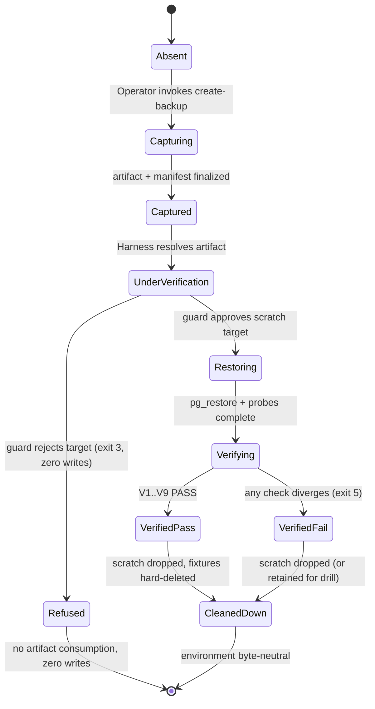

# Technical Architecture & Implementation Design: DEV3-024 — Disaster Recovery & Backup Verification

> **Plan of record:** `ai/plans/sprint_4/dev3-024-disaster-recovery-backup-verification/`
> **Specs:** `specs.md` REQ-001..REQ-083, J1/J2, JR-01..JR-08
> **Canonical refs:** `docs/DATABASE_MIGRATIONS.md` (guard lineage, `db push`/`migrate` forward-reconciliation), `docs/SQLITE_LOCAL_DEV.md` (dual-dialect, PG-only scope), `docs/quality/ci-pipeline.md` (argv-only spawn injection defense, no-artifact-upload policy), `docs/graphql/api-gateway-and-routing.md` (the two sanctioned health probes the runbook consumes), `docs/graphql/error-handling-contract.md` (redaction conventions), `docs/IDEMPOTENCY.md` (idempotent tooling posture), `docs/specs/state-machine-invariants.md` (INV-S/W/B/U/P/PAY/TV/A/HW/E families), `docs/specs/open-decisions-and-gaps.md` (A.2–A.9, B.2–B.9, C.1/C.5), `docs/planning/PRODUCTION_READINESS.md` §7.

---

## 1. System Overview & Architecture Diagram

### 1.1 Scope Statement

DEV3-024 is an **operations/tooling vertical slice** with zero application-runtime changes. It ships three deliverables: (a) `scripts/backup/create-backup.ts` — a snapshot-coherent, integrity-manifested PostgreSQL backup tool; (b) `scripts/backup/restore-verify.ts` — a guarded scratch-restore + full-fidelity verification harness; (c) the RPO ≤ 24h / RTO ≤ 4h codification plus the canonical DR documentation (`docs/disaster-recovery/backup-and-restore.md` + `dr-runbook.md`) that `PRODUCTION_READINESS.md` §7 cites. There is **no GraphQL surface, no frontend surface, no schema drift, no seed/migration touch** — enforced mechanically by empty-diff and byte-identical-codegen gates. A permanent `test/workflows/disaster-recovery/` journey tier proves the full round-trip against the real test database.

### 1.2 Backup Pipeline

```
┌── OPERATOR (shell, admin-class) ────────────────────────────────────────────┐
│  bun --env-file=.env.test run scripts/backup/create-backup.ts [--out <dir>] │
└──────────────────────────────────┬──────────────────────────────────────────┘
                                   ▼
┌── CLI HARNESS (thin wrapper) — scripts/backup/create-backup.ts ─────────────┐
│  parse args (closed flag union; unknown flag → exit 2)                       │
│  resolveBackupConfig()                       [env-config-registered, REQ-045]│
│  assertBackupToolchain()     [pg_dump/pg_restore + server major, exit 4]     │
│  acquireBackupLock(dbName)   [lockfile; concurrent backup serialized, D7]    │
└──────────────────────────────────┬──────────────────────────────────────────┘
                                   ▼
┌── SNAPSHOT SESSION (pg client, REPEATABLE READ) ────────────────────────────┐
│  BEGIN; SELECT pg_export_snapshot()  →  snapshotId                           │
│  buildManifestBody():                                                        │
│    • per-table rowCount for EVERY app table (inventory from Drizzle schema)  │
│    • contentHash for the critical set (payments / wallet / transactions /    │
│      audit_logs / subscriptions / students lanes / applicants)               │
│    • drizzle journal identity hash                                           │
│    • NO credentials, NO host, NO row payloads                                │
│  [transaction stays OPEN for the whole dump — snapshot stays valid]          │
└──────────────────────────────────┬───────────────────────────────────────────┘
                                   ▼
┌── pg_dump (subprocess, argv-ONLY spawn) ────────────────────────────────────┐
│  pg_dump --format=custom --snapshot=<id> --file=<tempPath>                   │
│  refusal if final artifact name exists (no clobber); temp-write → rename     │
└──────────────────────────────────┬───────────────────────────────────────────┘
                                   ▼
┌── FINALIZATION ─────────────────────────────────────────────────────────────┐
│  sha256(archive) → finalize manifest JSON (artifact sibling)                 │
│  COMMIT snapshot txn; release lockfile                                       │
│  logger.info structured summary (path, bytes, durationMs, rowCount total)    │
└─────────────────────────────────────────────────────────────────────────────┘
```

### 1.3 Restore-Verify Pipeline

```
bun run scripts/backup/restore-verify.ts --artifact <path> [--keep-scratch]
  → parse args (exit 2 on misuse)
  → resolveRestoreVerifyConfig()                      [REQ-045 fail-closed]
  → assertBackupToolchain()                           [exit 4]
  → assertRestorableTarget(config) ─► destructiveDbGuard + scratch-name rule    │
  │  managed/production-shaped target or non-scratch name → REFUSAL (exit 3)   │
  ▼                                                                             │
  verify manifest presence + archive checksum (tamper → exit 5, zero writes)───┘
  → CREATE DATABASE <source>__drrestore_<utcStamp> (fresh scratch; never the app DB)
  → pg_restore (argv-only) → seq-probe insert + cleanup
  → runVerificationSuite(scratchConn, manifest)
  │    V1 table-set diff = ∅            V2 rowCounts parity
  │    V3 contentHash parity            V4 financial invariants (INV-W/B/PAY)
  │    V5 immutability triggers present V6 governance/soft-delete preservation
  │    V7 orphan-FK scan (nullable-link exemptions)  V8 domain spot invariants
  │        (handshake unique A.3, recitation 1:1 C.5, applicant cooldowns INV-TV3,
  │         in-flight fee_held holds B.4, subscription windows A.9)
  │    V9 structural fingerprint (indexes/constraints spot-check)
  │    V10 migration-drift report (REPORT-ONLY: newer backend/drizzle folders)
  → report PASS (exit 0) / FAIL (exit 5, names check id; NO row payloads)
  → drop scratch DB (unless --keep-scratch) + release lock
```

### 1.4 Key Design Decisions Table

| # | Decision | Options Considered | Pros / Cons | Rationale (Maintainability, Scalability, Reliability) |
|---|---|---|---|---|
| D1 | **`pg_dump --format=custom`** as the artifact format | (a) plain-text SQL dump; (b) directory format; (c) custom format | (a) Pros: human-readable. Cons: no selective/compressed restore, fragile under `--snapshot`, huge on disk. (b) Pros: parallel restore. Cons: multi-file custody complexity for an operator MVP. (c) Pros: compressed, single-file, restores cleanly into a fresh DB carrying schema+data+constraints+indexes+triggers+sequences+enum types; pairs with `--snapshot`. Cons: binary (needs tooling to inspect — accepted). | (c). Whole-DB fidelity (incl. the custom-SQL trigger inventory from `backend/db/migration/`) is a launch-gate requirement; custom format is the only single-artifact option that round-trips triggers and supports snapshot pinning. |
| D2 | **Snapshot-coherent manifest via `pg_export_snapshot()` + `pg_dump --snapshot <id>`** | (a) capture manifest before dump (skew-prone — rows landing mid-dump fail verification); (b) capture after dump (skew-prone the other way); (c) exported snapshot shared by both | (a)/(b) Cons: append-mostly tables (`audit_logs`, `teacher_transaction`) make skew a *false-failure generator* — a write racing the dump poisons every drill. (c) Pros: manifest and dump observe the SAME point in time; skew class eliminated by construction. Cons: snapshot txn must stay open during the dump (bounded by backup runtime; documented). | (c). REQ-040 demands a documented bounded-skew story; sharing the snapshot is strictly stronger and removes the entire TOCTOU class between manifest and dump. PostgreSQL supports `--snapshot` since 9.2. |
| D3 | **Manifest as the single verification contract** (rowCounts for all tables + contentHash for the critical set + journal identity + archive checksum) | (a) hash the whole dump text; (b) per-table full-row hashing; (c) tiered (count everywhere, hash where integrity is money/law) | (a) Cons: detects corruption but can't name the divergent table → useless FAIL reports (violates REQ-052). (b) Cons: minutes-scale hashing cost at prod sizes; buys nothing over counts for low-risk tables. (c) Pros: zero-tolerance where it matters (financial/immutable/hold state), cheap everywhere else; failure reports are table-precise. | (c). REQ-011/014. The critical set is pinned in one module-scope frozen constant, reviewed at implementation against `state-machine-invariants.md` and extended only by conscious edit (static assertion keeps it non-vacuous). |
| D4 | **Content hash = JS-side SHA-256 over a canonical ordered projection** (PK-ordered rows; timestamps → epoch ms ISO UTC; decimals → their text form; fixed key order; rows joined by `\n`) | (a) SQL-side `md5` aggregation per table; (b) JS-side hashing; (c) byte-level row dump hashing | (a) Cons: aggregation order/type-coercion nondeterminism across PG versions; brittle under restore-order changes. (c) Cons: pg_dump value serialization differs subtly from a fresh-DB read (e.g., text formats), so byte-level row hashing fails legit restores. (b) Pros: canonicalization rules are testable pure functions; identical inputs after restore hash identically; memory-safe per-table loop with bounded batches documented as the large-DB forward hardening. | (b). Determinism is the failure mode that matters (REQ-044/073: same artifact verified twice ⇒ byte-identical PASS reports). Canonical serialization is a pure unit-testable module. |
| D5 | **Restore target = freshly created scratch database ONLY; destructive-guard refusal for anything else** | (a) allow `--into <existing>` with a `--force` flag; (b) scratch-creation-only | (a) Pros: none that survive contact with the guard policy. Cons: any in-place-restorable path is a production-destruction vector waiting for a typo'd flag. (b) Pros: the tooling structurally CANNOT overwrite an application database; real production restore is a runbook manual procedure. | (b). REQ-030. Composes `scripts/lib/destructiveDbGuard.ts` (which blocks managed/production-shaped targets) with a name-shape rule (`<source>__drrestore_<utcStamp>`) — defense in depth, fail-closed. |
| D6 | **Thin CLIs + testable pure-ish library modules under `scripts/backup/lib/`; journeys import the libraries directly (no HTTP/server boot)** | (a) journeys spawn the real CLI via `Bun.spawn`; (b) import lib entry points with injected config | (a) Pros: maximal realism. Cons: a second process per journey step, env plumbing, log-capture complexity, slower and flakier. (b) Pros: same production code path (CLIs are 20-line wrappers), in-process assertions, straightforward auditability; "no HTTP server" journey rule honored by construction. | (b). REQ-074 says the tooling opens its own connections; the lib-function call IS the real path because CLIs hold zero logic. The canonical doc states the CLI surface is a pass-through. |
| D7 | **Backup concurrency serialized by a lockfile; verify runs lock-free** | (a) no locking; (b) advisory lock on source DB (`pg_advisory_lock`); (c) lockfile via `scripts/lib/process-lock.ts` if present (verify-before-use, exact-match fallback) | (a) Cons: two operators/CRONs dump the same source concurrently → doubled I/O, bolted-on race in lock naming. (b) Cons: requires the source DB to accept advisory traffic; the lock is invisible to file-level tooling; harder to introspect in drills. (c) Pros: established codebase pattern, cross-process FIFO semantics, trivially observable; verify runs are read-only against source and scratch-scoped, so they never contend (REQ-042). | (c). The lock name is derived from the source database name (`backup:<dbName>`), not the output directory, so distinct sources parallelize naturally. Verify remains lock-free by design. |
| D8 | **Exit-code taxonomy 0/2/3/4/5/6 as the ONLY process result contract** | (a) boolean + stderr prose; (b) full taxonomy | (a) Cons: drills/CI cannot distinguish "operator typo" from "infrastructure destroyed an invariant" → runbooks can't auto-branch. (b) Pros: REQ-050's taxonomy is machine-consumable: `2` operator, `3` refusal, `4` toolchain, `5` divergence, `6` masked internal. Each tier is test-pinned (REQ-072). | (b). Deterministic operator ergonomics is the point of launch-gate tooling. Plain `throw` from CLIs is prohibited — all failures route through the taxonomy module to a `never`-returning `failWith(code, localizedKey, context)` helper that logs via `logger` only. |
| D9 | **All config through env-config registration; destructive-critical keys fail closed (no silent defaults toward dangerous targets)** | (a) inline `process.env` reads; (b) registered keys + fail-closed validation | (a) Cons: unregistered keys, undefined coalescing, and un-testable reset semantics (cross-cutting rule violation). (b) Pros: `BACKUP_OUTPUT_DIR` etc. registered once; missing restore-critical values name themselves in the error (REQ-045); test resets invalidate every resolved key. | (b). Output root defaults to `<repoRoot>/db/backups/` (already covered by the gitignored `db/` folder per `docs/SQLITE_LOCAL_DEV.md`) — a safe default that is NOT a destructive target; anything *targeting correctness* has no default. |
| D10 | **New `disasterRecovery` i18n namespace (not an `errors` grouping)** | (a) fold into `errors` namespace; (b) dedicated namespace | (a) Cons: `errors` is THE transport-error contract namespace (`shared/AGENTS.md`); operator-tool messages (runbook copy, refusal reasons, report prose) are not transport errors — near-duplicate key pollution risk. (b) Pros: clean message ownership; full `types`/`en`/`ar` parity gated by `MessageSchema` compile; consumed via `getServerTranslations(locale, "disasterRecovery")`. | (b). REQ-051. Registration follows the canonical 5-step `shared/locale/AGENTS.md` procedure; machine tokens (codes, paths, counts, durations) stay structured log context, never localized prose. |
| D11 | **Journey tier lives at `test/workflows/disaster-recovery/` with committed fixtures + hard-delete teardown + toolchain gating** | (a) `backend/db/test/logic/` reusing `runInRollback`; (b) journey tier with committed rows | (a) Cons: `runInRollback` is FORBIDDEN here (REQ-070) — tooling opens its own connections and cannot see uncommitted rows; a rolled-back fixture is invisible to `pg_dump`. (b) Pros: honest production-shape proof; registry-tracked IDs make `afterAll` teardown deterministic. | (b). `test/workflows/` is ABSENT from the packaged tree ⇒ the plan MUST scaffold it (helpers + `test/workflows/AGENTS.md`) per the cross-actor journey rules. Toolchain-absent environments gate via a `describeLiveWhen`-style skip-with-signal (REQ-053). |
| D12 | **Expected-trigger registry pinned from `backend/db/migration/*.sql` with a static-parity test** | (a) hardcode trigger names in verify.ts; (b) parse migration SQL at runtime; (c) frozen constant + static test asserting the constant ⊆ names present in the migration SQL | (a) Cons: silent drift when migrations add triggers. (b) Cons: runtime parsing of SQL is fragile and over-clever for a registry that changes rarely. (c) Pros: the audit-immutability trigger set is explicit and review-gated; its completeness vs. the migration files is itself test-locked. | (c). REQ-014(3). Trigger presence post-restore proves the append-only substrate survived (A.5 lineage); the registry asks the *right* question ("did the protection mechanisms restore?") rather than the tautological one. |

---

## 2. Data Models & Database Schema

### 2.1 Existing Schema Verification (READ-ONLY — zero changes, REQ-043)

Verification-only audit; `git diff` on `backend/db/schema/**`, `backend/db/migration/**`, `backend/enum/**`, and `shared/**` MUST be empty for this ticket (the `disasterRecovery` locale namespace lives under `shared/locale/`, which is the ONE sanctioned exception — the diff rule targets schema/migration/enum structural files; the locale addition is additive-only i18n data and is enumerated in the outcome).

| Contract dependency | Existing implementation | Verified at |
|---|---|---|
| Stewardship of ALL application tables (the manifest's inventory source) | Drizzle table objects under domain barrels | `backend/db/schema/index.ts` (+ domain barrels) |
| Balance lanes incl. trial | `students.balanceHifz/Reviews/Tajweed` CHECK ≥ 0; `balanceTrial`/`trialGrantedAt` (DEV1-004 lane) | `backend/db/schema/students/students.ts` |
| Financial/immutable tables | `student_payments` (`amount >= 0`), `wallet` (`balance`/`total_earning >= 0`, unique `teacherId`), `teacher_transaction` (`amount >= 0`), `audit_logs` (append-only) | `backend/db/schema/billing/*`, `backend/db/schema/audit/audit-logs.ts` |
| Escrow/confirmation columns | `session.fee`, `feeHeld`, `confirmationDeadline`, `confirmedBy*` | `backend/db/schema/classes/session.ts` |
| Applicant lifecycle columns | `applicants.cooldownUntil`, `verificationAttempts`, `status` | `backend/db/schema/teachers/applicants.ts` |
| Parent link + handshake | `students.parentId`, `handshakeCode` unique | `backend/db/schema/students/students.ts` |
| Recitation 1:1 | `recitation.sessionId` unique | `backend/db/schema/classes/recitation.ts` |
| Governance flags | `users.isDeleted/suspended/isBlocked/…` | `backend/db/schema/users/users.ts` |
| Append-only trigger substrate | custom SQL under migration folder (incl. audit-immutability triggers) | `backend/db/migration/*.sql` (per `docs/DATABASE_MIGRATIONS.md`) |
| Migration journal | `drizzle.__drizzle_migrations` | created by Drizzle migrate runs |
| Destructive-command policy | `scripts/lib/destructiveDbGuard.ts`; `db reset`/`cleanGenerate` permanently disabled | `docs/DATABASE_MIGRATIONS.md` |

**Prohibited by construction:** no new tables/columns/enums/indexes; no `bun run db push`; no custom SQL; no seeder changes (journeys create their own fixtures — never seed data); `db reset`/`cleanGenerate` remain disabled. The backup read path is READ-ONLY against the source database (snapshot txn + `pg_dump`).

### 2.2 Canonical Types — none new in `backend/types/` (REQ-003)

No new DB entity exists, so no `{Entity}*Type` files are added. The tooling-internal manifest contract is defined ONCE in `scripts/backup/lib/manifest.types.ts` (documented exception to the `backend/types/` convention because no second layer consumes it; if a future layer consumes it, it migrates to `backend/types/backup/`).

```ts
// scripts/backup/lib/manifest.types.ts (tooling-internal contract)
export interface ManifestTableEntry {
  readonly table: string;              // physical pg name from the Drizzle inventory
  readonly rowCount: number;
  readonly contentHash: string | null; // non-null for the critical set only
}
export interface BackupManifest {
  readonly manifestVersion: 1;
  readonly databaseName: string;       // name ONLY — never credentials/host
  readonly capturedAtUtc: string;      // ISO 8601 UTC
  readonly pgDumpVersion: string;
  readonly serverVersion: string;
  readonly migrationJournalHash: string; // canonical hash of drizzle.__drizzle_migrations rows
  readonly tables: readonly ManifestTableEntry[];
  readonly archiveSha256: string;      // finalized AFTER the dump completes
}
```

Consumed canonical types (imported, never redefined): `DBTransaction` NOT needed (scripts hold their own `pg` clients — documented scripts-lane exemption per the `scripts/` precedent of `scripts/dbActions.ts`); the verification queries consume Drizzle schema OBJECTS (`@/backend/db/schema`) as the structural inventory. Enums used in verification predicates (`TransactionType`, `TransactionStatus`, `PaymentStatus`, `ApplicantStatus`, `SessionStatus`) are **value imports** from `@/backend/enum/**` — never string literals, never `import type`.

### 2.3 Enums — ZERO additions

No new enum anywhere. Verification predicates consume existing enum members (e.g., `TransactionStatus.Completed` when computing the wallet-consistency probe).

### 2.4 i18n — new `disasterRecovery` namespace (REQ-051)

| File | Change |
|---|---|
| `shared/locale/types/disasterRecovery/index.ts` (NEW) | `DisasterRecoveryLabels` interface: `toolchainMissing`, `toolchainVersionMismatch`, `guardRefusalManagedTarget`, `guardRefusalNonScratch`, `missingEnvConfig(key: string)`, `manifestMissing`, `manifestChecksumMismatch`, `artifactExists`, `verificationCheckFailed(checkId: string)`, `verificationPassed`, `unsupportedDialect`, `usageCreateBackup`, `usageRestoreVerify` |
| `shared/locale/en/disasterRecovery/index.ts` (NEW) | English implementations (interpolation via typed functions, never `{var}` strings) |
| `shared/locale/ar/disasterRecovery/index.ts` (NEW) | Arabic implementations (RTL-natural phrasing) |
| `shared/locale/types/message.ts` | `MessageSchema` entry |
| `shared/locale/serverLegacy.ts` | namespace-path registration per `shared/locale/AGENTS.md` |

Parity gate: missing key ⇒ `tsgo` failure. No layout/`LocaleProvider` registration needed — server-side consumption only.

### 2.5 Env-Config Registration (REQ-045)

| Key | Default | Fail-closed when absent? | Purpose |
|---|---|---|---|
| `BACKUP_OUTPUT_DIR` | `<repoRoot>/db/backups` | No (safe non-destructive default) | Artifact root (gitignored via `db/`) |
| `BACKUP_SCRATCH_PREFIX` | `__drrestore_` | No | Scratch DB naming infix |
| `BACKUP_KEEP_SCRATCH_DB` | `false` | No | Drill-inspection retention |
| `BACKUP_DRILL_BUDGET_SECONDS` | `300` | No | REQ-016 internal drill budget guard |
| `DATABASE_URL` (existing) | — | YES (existing convention) | Source connection; restored-target identity derives from its dbname |

Test reset helpers MUST invalidate every newly resolved key (cache-invalidation completeness rule).

---

## 3. API Contracts & Pothos Resolvers

### 3.1 GraphQL Schema Additions: **NONE** (REQ-060)

No queries, mutations, object types, input types, or enum registrations. Verification gate: after implementation, run `bun run generate:gqlSchema && bun codegen`; the produced `schema.graphql` and `frontend/graphql/generated/**` MUST be byte-identical to baseline (recorded as diff-empty evidence in the completion outcome).

### 3.2 CLI Contract (in place of an API surface)

```
create-backup.ts   [--out <dir>]                       → 0 success
restore-verify.ts  --artifact <path> [--keep-scratch]  → 0 success (verification PASS)
```

| Flag/behavior | Failure class | Exit |
|---|---|---|
| Unknown flag / missing required `--artifact` | operator usage error | 2 |
| Managed/production-shaped target; non-scratch DB name | guard refusal (zero writes) | 3 |
| `pg_dump`/`pg_restore` absent; major-version mismatch vs server | toolchain | 4 |
| Missing manifest; checksum mismatch; tampered rowCount; any check divergence | verification | 5 |
| Unclassified internal failure (masked, correlated log) | internal | 6 |

**Result payloads are machine-shaped**: stdout sinks only structured log lines via `logger` (never `console.*`); reports are JSON (`<artifact>.verify-report.json`).

### 3.3 Permission Matrix (structural)

| Surface | Anonymous | Student | Parent | Teacher | Applicant | Super Admin |
|---|---|---|---|---|---|---|
| Any GraphQL/HTTP op | — | — | — | — | — | — (**none exist**; REQ-060/061 gates prove it) |
| `create-backup` CLI | n/a — shell-only; requires valid DB credentials in env | … | … | … | … | Operator (platform ops) |
| `restore-verify` CLI | guard REFUSES production-shaped/managed targets regardless of role (exit 3) | — | — | — | — | scratch-only |

BFLA note: there is no function surface for a low-privilege token to reach; the guard is the authorization boundary and it is identity-agnostic by design (it vets the TARGET, not the caller).

---

## 4. Backend Services, Repositories & Concurrency Model

### 4.1 Module Inventory — `scripts/backup/`

| Module (NEW) | Responsibility | Notes |
|---|---|---|
| `create-backup.ts` | Thin CLI wrapper: parse → config → toolchain → lock → snapshot → dump → finalize | ≤ 60 lines; all logic in lib |
| `restore-verify.ts` | Thin CLI wrapper: parse → config → toolchain → guard → integrity → restore → verify → report → teardown | same rule |
| `lib/exit-codes.ts` | `BackupExitCode` frozen taxonomy + `failWith(code, localizedMessage, context): never` | logger-only sink; taxonomy is REQ-050's single source |
| `lib/args.ts` | Closed-union flag parsers (`parseCreateBackupArgs`, `parseRestoreVerifyArgs`) | unknown flag ⇒ usage error; no object spreads into command construction |
| `lib/config.ts` | `resolveBackupConfig()` / `resolveRestoreVerifyConfig()` via env-config registry | fail-closed per REQ-045; names missing keys in errors |
| `lib/toolchain-probe.ts` | `assertBackupToolchain()`: binary presence via `spawnSync --version`; server major via connection; mismatch matrix | exit-4 closed path; sqlite provider → typed `unsupportedDialect` refusal (REQ-020) |
| `lib/lock.ts` | `acquireBackupLock(sourceDbName)` — verify `scripts/lib/process-lock.ts` exists and reuse; else `existsSync`+stale-timeout lockfile | REQ-042; release in `finally` |
| `lib/snapshot.ts` | `openExportSnapshot(pgClient)`: `BEGIN; SET TRANSACTION ISOLATION LEVEL REPEATABLE READ; SELECT pg_export_snapshot()`; `closeSnapshot()` COMMIT | the snapshot txn outlives the dump (D2) |
| `lib/manifest.ts` | `TABLE_INVENTORY` derivation from Drizzle schema objects; `CRITICAL_HASH_TABLES` frozen set; `buildManifestBody(conn)`; `finalizeManifest(manifestBody, archivePath)` | deterministic serialization rules (D4); journal hash over `drizzle.__drizzle_migrations` (quoted identifiers) |
| `lib/dump.ts` | `runPgDump({ bin, connectionUrl, snapshotId, archivePath })` — argv-array spawn; refuse existing target; temp-write-then-rename | no shell strings; `--format=custom --snapshot` |
| `lib/restore.ts` | `createScratchDatabase(maintenanceUrl, name)`; `dropScratchDatabase(…)`; `runPgRestore(…)`; `probeIdentityAndSequences(scratch)` (insert+delete probe row in a safe table / setval verification) | scratch creation only via guard-cleared path |
| `lib/guard.ts` | `assertRestorableScratchTarget({ url, dbName })`: name-shape rule + `destructiveDbGuard` composition | REQ-030; zero bytes written on refusal |
| `lib/verify.ts` | Check-registry runner: `VerificationCheck { id, phase, execute(conn, manifest) }` registry (V1..V10 from §1.3); aggregates `CheckResult[]` | failure report names check id + counts/hashes ONLY (REQ-052) |
| `lib/report.ts` | PASS/FAIL JSON report writer (atomic temp-then-rename) | deterministic ordering ⇒ REQ-044 byte-identity |
| `lib/trigger-inventory.ts` | `EXPECTED_INTEGRITY_TRIGGERS` frozen registry | pinned by static parity test vs `backend/db/migration/*.sql` |

**Layering note (sanctioned scripts-lane pattern):** these modules speak to PostgreSQL through a dedicated `pg` client/pool they own (precedent: `scripts/dbActions.ts`, `scripts/ci/*`). They do NOT import `backend/services/**` (services are request-scoped business logic) and MUST NOT import from `frontend/**`/`app/**`. They MAY import schema objects from `@/backend/db/schema` (structural inventory), enums from `@/backend/enum/**`, the logger from `@/backend/lib/logger`, and `getServerTranslations` from `@/shared/locale/server-graphql`.

### 4.2 Verification Check Registry (REQ-014 → check IDs)

| ID | Check | Asserts |
|---|---|---|
| V1 | `TABLE_SET_PARITY` | restored table set == manifest table set ==
| V2 | `ROW_COUNT_PARITY` | every manifest `rowCount` == live count |
| V3 | `CONTENT_HASH_PARITY` | every critical table re-hashes identically |
| V4 | `FINANCIAL_INVARIANTS` | lanes ≥ 0; `wallet.balance/totalEarning ≥ 0`; per-teacher `totalEarning == SUM(amount) WHERE type=Earning AND status=Completed`; `teacher_transaction.amount ≥ 0`; `student_payments.amount ≥ 0` (INV-W1/W2/W8, INV-PAY1) |
| V5 | `IMMUTABILITY_TRIGGERS_PRESENT` | `EXPECTED_INTEGRITY_TRIGGERS` present in `pg_trigger` post-restore (INV-W6/INV-PAY2/A.5) |
| V6 | `GOVERNANCE_PRESERVATION` | soft-deleted users present with `isDeleted=true`; their sessions/reports/financial rows FK-reachable; governance flags preserved (INV-U1/U4/U5) |
| V7 | `FK_ORPHAN_SCAN` | zero orphans across ALL declared FKs; nullable/`set null` links (`evaluations.sessionId`, `students.parentId`, `lessons.planId`, `progress.lessonId`, `studentPayments.subscriptionId`, `teacherTransaction.sessionId`) verified as integrity-consistent instead |
| V8 | `DOMAIN_SPOT_INVARIANTS` | `handshakeCode` unique (A.3); `recitation.sessionId` unique (C.5); applicant `cooldownUntil`/`verificationAttempts`/`status` content-preserved (INV-TV3, JR-03); in-flight holds (`feeHeld=true AND status ∈ {Scheduled, Started}`) present with identical `confirmationDeadline` (B.4, JR-05); `subscriptions` windows preserved (A.9) |
| V9 | `STRUCTURAL_FINGERPRINT` | required indexes/constraints spot-present via catalog queries |
| V10 | `MIGRATION_DRIFT_REPORT` | REPORT-ONLY: `backend/drizzle/` folders newer than the restored journal are listed (forward-reconciliation pointer to `bun db push`/`bun db migrate`; never auto-applied) |

All verification SQL is parameterized; table names come from the Drizzle-derived inventory (never from CLI/environment strings). No LIKE/ILIKE surface exists → `escapeLikeWildcards` recorded as N/A-to-ticket.

### 4.3 Concurrency & Race Condition Assessment

| Scenario | Actors | Risk | Mitigation |
|---|---|---|---|
| Two backups racing one source DB | 2 operators / cron overlap | doubled I/O; clobbered temp files | D7 lockfile per source name; artifact name embeds UTC timestamp + short hash; final-name `existsSync` refusal (REQ-012/042) |
| Write traffic DURING dump | application writers vs backup | manifest/dump skew → false FAIL | D2 shared exported snapshot: manifest and dump observe the same point in time; skew class eliminated |
| Backup racing restore-verify | operator vs harness | none material | backup is read-only; verify is scratch-scoped; documented lock-free coexistence (REQ-042) |
| Scratch name collision | two verify runs in the same ms | CREATE DATABASE 42P04 | name embeds timestamp + short random suffix; on collision, regenerate once then fail as internal (exit 6) with named step |
| Partial restore / probe failure | tool chain | half-restored scratch reported as PASS | REQ-041 all-or-nothing: any stage failure ⇒ exit 5/4/6, FAIL report naming phase, scratch dropped (or kept with `--keep-scratch`) |
| Same artifact verified twice | harness | nondeterminism in report | canonical ordering of checks; stable JSON key ordering; REQ-073 asserts byte-identical PASS reports |
| Lockfile crash-orphan | killed backup process | permanent lock wedging subsequent backups | stale-lock timeout sweep in `anagement/module` (lock lib); runbook documents manual clear step |
| TOCTOU on artifact finalization | operator scripting | rename overwrite | open with exclusive-create semantics (`wx`); refusal before any move (REQ-012) |

**Locking summary:** file-level lock for backup serialization; `pg_export_snapshot` row-safety via a long-lived REPEATABLE READ txn (no explicit locks needed); NO advisory locks; NO Redis (`SET NX EX` N/A — no cache involvement); no module-level mutable state (each process starts clean; lib modules carry frozen constants only).

### 4.4 Cross-Actor Journey Design (MANDATORY — specs §2.9)

**Shared-entity state machine — BACKUP ARTIFACT & SCRATCH DB lifecycle:**



| Transition | Driving actor | Permission basis |
|---|---|---|
| Capture | Operator | shell + valid env credentials (DB-level posession) |
| Refuse | Harness (guard) | target-shape policy — identity-independent |
| Restore/Verify | Harness | scratch DB creation privilege on the LOCAL test cluster |
| Teardown | Harness | tracked-ID registry (fixtures) + scratch ownership |

**Side-effect matrix (per transition):**

| Transition | Rows created/updated | External side effects | Files written | Idempotency anchor |
|---|---|---|---|---|
| Capture | NONE in source DB | none (no notification/email/SMS by design) | `<name>.dump`, `<name>.manifest.json`, lockfile (transient) | unique artifact name; no clobber |
| Refuse | NONE | refusal log line | FAIL log only | exit 3; zero writes |
| Restore | scratch DB fully populated | none | temp restore logs | fresh scratch each run |
| Verify | probe row inserted+deleted in scratch only | none | `<artifact>.verify-report.json` | WARN: report overwrite is the one sanctioned write-replace, timestamped |
| Teardown | fixtures hard-deleted by tracked IDs | none | none | second run green |

**Cross-actor visibility table (after each J1 step):**

| After step… | Operator can observe | Harness can observe | Must NOT be observable |
|---|---|---|---|
| J1.2 backup invoked | artifact paths, sizes, durations (logs) | manifest + artifact on disk | connection strings/credentials in ANY log |
| J1.3 snapshot integrity | checksum match signal | full manifest content | per-row payloads (manifest carries counts/hashes only) |
| J1.4 guard resolution | approve/refuse + reason | target identity | — |
| J1.6 verification PASS | report path | every check result | row-level content in FAIL reports (REQ-052) |
| J1.7 dataset observers | — | student balances/lanes, parent link, wallet hash, cooldowns, audit rows, held sessions, soft-deleted user | a PASS while any class diverged |

These ARE the journey assertion sets for `test/workflows/disaster-recovery/backup-restore-roundtrip.journey.test.ts` (J1) and `failure-legs.journey.test.ts` (J2).

**Scaffolding task (mandatory, Invariant-10):** `test/workflows/` is ABSENT in the packaged tree ⇒ the plan includes tasks to scaffold `test/workflows/AGENTS.md` (codifying: real services + real test DB, committed fixtures in `beforeAll`, hard-delete teardown in `afterAll` with tracked IDs, `runInRollback` FORBIDDEN, side effects spied, toolchain-gated skips) plus `test/workflows/helpers/` (tracked-ID registry, journey fixture builders for all seven dataset classes, scratch-DB utilities). Journeys gate on `pg_dump`/`pg_restore` presence (`describeLiveWhen`-style), and REQ-073 mandates two consecutive green runs.

---

## 5. Frontend UX & Navigation Specification

**Zero frontend surface ships** (REQ-061). Tables completed for template compliance:

| Aspect | Decision |
|---|---|
| **Routes & URLs** | None added/modified/removed. No `page.tsx`, no `withPageAuth` call-sites. |
| **Sidebar & Navigation Integration** | None. No nav group, parent item, child order, or mobile bottom-nav change. |
| **Per-Audience Rendering** | Student / Parent / Teacher / Supervisor / Admin see ZERO visual difference vs baseline. The tooling is invisible to every in-app role. |
| **Apollo GraphQL Documents & UI Components** | None added. No `.documents.ts` files, no hooks, no stores (and no `persist`-entangled state), no MUI components. The RNG of MUI v9 `sx`-only / `*Outlined` / `React.SubmitEvent` rules is recorded as binding for any future DR dashboard (forward note D-adjacent, no code). |
| **Responsive/RTL** | N/A — no UI. The only Hebrew/Arabic-impacting output is the `disasterRecovery` namespace's `ar` parity (compile-gated). |
| **Visual State Matrix** | N/A. Server-side/CLI states enumerated instead: empty artifact dir (typed usage), lock-contention wait, PASS report, FAIL report with check id, refusal. |
| **Agent-Browser Verification Protocol** | No URLs/screenshots. Automated functional verification = the J1/J2 journey suites (`bun run scripts/run-test/run-test.ts` for DB-touching runs) + CLI dry-runs recorded in outcomes; screenshot-based verification is explicitly deferred to any future DR UI ticket. |

---

## 6. Security, Authorization & Tenancy Mitigations

### 6.1 BOLA / IDOR (structural N/A — proven)

There is no client-supplied object identifier anywhere: the source database derives from env config; scratch identity is generated server-side; artifact selection is a local filesystem path. No per-row identifier is ever accepted from a caller. Verification queries never filter by caller-supplied IDs — they enumerate the entire restored database against the manifest. The "identity" is the operator's shell + env-configured source, and the target boundary is vetted by the guard (REQ-030/033).

### 6.2 BOPLA (mass assignment — structural N/A + rule)

No input DTO exists. CLI flags pass through a closed whitelist parser (`lib/args.ts`); unknown keys are rejected before use; flag values (a directory path, an artifact path, a boolean) map field-by-field into config — **no `{ ...args }` spread into any spawn config or query builder** (static-scan-gated). The manifest writer composes its JSON explicitly per field (never `JSON.stringify` of an ambient object).

### 6.3 BFLA (function level — structural N/A + proof)

No GraphQL/HTTP function exists for a token to call; REQ-060's byte-identical-codegen gate mechanically proves the API surface is unchanged. The sole privileged capability (restoring a database) is gated by the destructive-guard + scratch-name rule independent of any role system: even a super-admin-shaped JWT cannot induce an in-place restore because no such code path exists.

### 6.4 Secrets & Data Hygiene (REQ-031/032)

- Logs NEVER contain connection strings, `DATABASE_URL` bodies, credentials, or `.env` material — only the database NAME. Redaction discipline mirrors `redactLogContext`; a unit test feeds a poisoned config through `failWith` and asserts redaction.
- Manifests contain no credentials, no per-row PII (counts/hashes/versions only) — unit-locked.
- Artifacts contain full row data incl. `passwordHash`: custody rules live in the runbook (operator-controlled storage, no VCS, no ticket attachments, no CI artifact upload — consistent with `docs/quality/ci-pipeline.md` artifact policy). `.gitignore`-coverage of the default output root is asserted by a static check.
- No tenant isolation concept applies (single-tenant operational tooling); multi-tenant/PII-scrubbed export variants are documented as out-of-scope (non-goal 8).

### 6.5 Injection Surface (REQ-034)

- Process spawning uses argv arrays exclusively (`spawn(bin, [args])` / `Bun.spawn` with arrays) — no shell-string interpolation of paths, URLs, or identifiers (mirrors `docs/quality/ci-pipeline.md` injection-defense posture).
- All SQL is parameterized (`$1…` bindings) or built from the Drizzle-derived table inventory (compile-time constants); identifiers are never concatenated from user input.
- No LIKE/ILIKE user-text surface → `escapeLikeWildcards` documented as N/A. No inline `--` comments inside any `sql` template (parameter-binding rule).

### 6.6 Error Disclosure Confidentiality (REQ-052/053)

- FAIL reports carry: check id, expected vs actual COUNTS or HASHES, artifact path, scratch name, remediation pointer to the runbook section. They NEVER carry row payloads, emails, names, balances values (only their divergence signal), or internal stack traces (masked internal failures → exit 6 with correlation id).
- Toolchain absence degrades to a typed refusal (`exit 4`), not a crash; test environments missing the binaries skip-with-signal rather than false-passing.

### 6.7 Temporal/Ordering Guarantees

One `capturedAtUtc` per run, captured at snapshot open; RPO evidence is the manifest timestamp; RTO evidence is the drill wall-clock measurement recorded in the PASS report against `BACKUP_DRILL_BUDGET_SECONDS` (REQ-016). Restore NEVER re-arms `confirmationDeadline` — values restore byte-identically (B.2).

### 6.8 Verification Anchors (tie-ins for tasks.md)

- `bun run generate:gqlSchema && bun codegen` ⇒ byte-identical diff (REQ-060); `git diff` empty on `frontend/**`/`app/**` (REQ-061) and on schema/migration/enum trees (REQ-043).
- Every created/modified file passes `bun run scripts/health/sub-loop.ts <file> --lifecycle duplicates` (exit 0); DB-touching suites execute via `bun run scripts/run-test/run-test.ts <path>`.
- Suite inventory: unit (args/config/manifest/serialization/guard-mapping/report/exit-taxonomy/toolchain), static assertions (argv-only spawn, no `console.*`, no spreads, trigger-registry parity, `.gitignore` coverage), journey J1/J2 (green ×2 consecutively), determinism double-verify (byte-identical PASS), quality-baseline delta = 0 vs REQ-001 counts.
- Coverage: 100% statement/branch on all new `scripts/backup/lib/**` logic (`bun test --coverage`).
- Knowledge propagation: `docs/disaster-recovery/backup-and-restore.md` (canonical: Why → artifact/manifest architecture → snapshot-coherence pattern → rules → exit-taxonomy → verification invariant map V1–V10 → What NOT to Do → rollout summary → related docs) and `docs/disaster-recovery/dr-runbook.md` (operator runbook: prereqs, backup, verify, drill, real recovery with `bun db push`/`bun db migrate` forward-reconciliation + the two sanctioned health probes from `docs/graphql/api-gateway-and-routing.md` for app health order, retention/cadence table mapping to RPO ≤ 24h, RTO ≤ 4h budget table, failure playbook, refusal list); both Mermaid-validated; `PRODUCTION_READINESS.md` §7.1–7.7 evidence mapping table (REQ-019); root `AGENTS.md` Important References one-liner (REQ-082); ledger closes with `grep -c "❌\|⚠️" = 0` except the documented non-blocking D1 (scheduling/WAL-PITR → infra ticket) and D2 (artifact encryption-at-rest → security-hardening), each carrying owner references (REQ-083).
