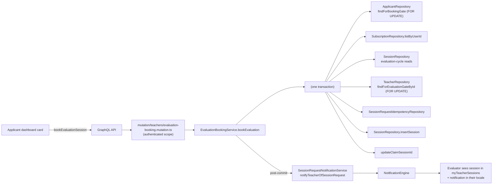

# Design: DEV2-006 — 5-Session Evaluation Loop Booking

> **Date**: 2026-09-17 · **Plan directory**: `ai/plans/milestone_1_core_domain_mvp/5_session_evaluation_loop_booking/`
> **Specs**: `specs.md` (this directory) · **Tasks**: `tasks.md` (this directory) · **Ledger**: `deferred-items.md` (this directory)
> Grounded entirely in the verified inventory at `specs.md` §4 (G1-G36). Decisions record the ONE schema delta and its sketch, the service surface, the concurrency knife-edge cases, and the UX/Nav ruling.

## 1. Overview

DEV2-006 implements the evaluation loop's booking surface end to end: an applicant with an ACTIVE verification subscription books up to 5 evaluation sessions with 5 distinct certified evaluators; each booking materializes as a `session` row with `session_type='teacher_evaluation'` and `intent='evaluation'`. The loop's guards distinctness (INV-TV2), capacity (5 credits), evaluator certification, and idempotency live inside the booking transaction; post-commit the evaluator receives the existing `session_request` notification wave.

The central design problem is structural, not behavioral: evaluation sessions live in `session`, whose `student_id` is NOT NULL and (today) references `students.id`. Applicant teacher-role users have NO `students` row (locked invariant by both registration and the verification-purchase journey). We therefore retarget that single FK constraint from `students.id` to `users.id` — a schema-level correction, not a logical change — making evaluation sessions first-class without breaking any existing student flow (they already store users.id values since `students` shares the users PK). Every consumer of `student_id` already treats it as a `users.id` semantically (wave-context reads join `users` on both legs — `backend/db/repo/classes/session.repository.wave.helpers.ts:66-110`).

### Design Goals

- **G1: Schema truthfulness** — the `session` model stores an evaluation booking the way the spec says (FR-3.3: same table, teacher=evaluator, student=applicant).
- **G2: One atomic booking transaction** — all gates and all writes in ONE tx; advisory checks elsewhere are not correctness-bearing.
- **G3: Minimal surface ripple** — lifecycle/sweep paths are untouched because evaluation rows carry `feeHeld=false`/`heldBalanceLane=null`; sweeps already treat a NULL lane as a no-op refund (`backend/services/classes/session-lifecycle.transitions.ts:222-243`).
- **G4: Zero new auth complexity** — the mutation keeps the `authenticated`-only scope with service-level gates (mirroring `purchaseVerificationPlan`'s documented rationale: `backend/graphql/mutation/verification-plan-purchase.mutation.ts:1-36`).
- **G5: No new routes or nav items** — the evaluation slot lives in the existing applicant dashboard zone; evaluators see the rows through existing session reads.

### Key Design Decisions

**D1 — `session.student_id` FK target moves `students.id → users.id` (schema delta, REQ-7).**
The runtime semantics are preserved byte-for-byte: registration always inserts `students` and `users` rows with matching PKs (shared PK model — `backend/db/schema/students/students.ts:23-31`), and every existing read path joins through `users.id`. The change is a pure constraint retarget (drop FK → add FK → `users.id`), produced by `bun run db push`, with a migration regression pin in the journey suite. On delete `restrict` is KEPT (an applicant/user with sessions cannot be hard-deleted).

**D2 — Credits are derived, never stored.**
There is NO evaluation-balance column and NO credit-tracking table. Available credits = `VERIFICATION_PLAN_SESSION_COUNT` (5) minus the count of non-cancelled evaluation sessions owned by this applicant in the CURRENT loop cycle (scoped by the latest ACTIVE verification subscription's `startDate`). This mirrors the settled pattern from DEV2-005 ("the 5-session grant is enforced by the booking flow off the active subscription", `backend/services/billing/subscription-activation-credit.helpers.ts:100-132`).

**D3 — One guarded transaction; the order is normative.**
 applicants lock (FOR UPDATE) → status/subscription/capacity/distinctness probes ONLOCK → evaluator certification lock → claim insert (savepoint) → session insert → claim backfill. Replay-by-throw on 23505 mirrors `bookSessionInTx` concept-for-concept; the implementation is a NEW surface (evaluation), never a refactor of the student booking (`bookSessionInTx` keeps the `Hifz|Tajweed`-only intent guard).

**D4 — Evaluator certification lock: a NEW read on `TeacherRepository` returning `{ id, isApproved, isEvaluator }` under `FOR UPDATE`.** The existing `lockForCertificationCheck` (returns `{id, isApproved}`) is NOT widened — the booking path calls `findForEvaluationGateById` so the two gate contracts don't share a row-shape or an implicit assumption.

**D5 — Idempotency via the existing `session_request_idempotency` claim table.** Same table, same replay semantics (23505 → same-caller `DUPLICATE_REQUEST`; foreign → `SESSION_NOT_FOUND`), no evaluation-specific idempotency table. Claim's `userId` is the APPLICANT's users id (the claim model is generic per DEV2-005's contract).

**D6 — Post-commit notification uses the existing requests wave verbatim.**
`SessionRequestNotificationService.notifyTeacherOfSessionRequest(sessionId, locale, tx)` is emitted INSIDE the booking transaction (persist-first) and its receipt is published only AFTER the commit — identical to the student booking path's notification posture. The `evaluation` intent label (`intentEvaluation`) already exists in both locales (`shared/locale/types/notifications/index.ts:132`).

**D7 — One new cohesive service: `EvaluationBookingService` (teachers domain).** It owns the booking write (`bookEvaluation`), plus the three read methods (`myEvaluationLoopStatus`, `availableEvaluators`, `myEvaluationSessions`), so the booking boundary, its list projections, and the lifecycle questions stay adjacently observable and the eligibility rule has EXACTLY ONE implementation site.

**D8 — The evaluation-zone is added by UPDATE inside the existing applicant dashboard card structure** (`frontend/views/teachers/dashboard/ApplicantStatusResolution.tsx`'s `InEvaluation` branch and `ApplicantStatusZones.tsx`'s compositions), NOT a new page.

**D9 — `evaluations` table is untouched in this plan.** Rubric submission, aggregation, threshold (`≥80%`), and applicant status flip (`in_evaluation→passed|failed`) belong to DEV2-007 (rubric scoring) and onward. This plan produces the 5 session rows they consume.

---

## 2. Architecture

### System context



### Component inventory

| Component | Path | Change |
|-----------|------|--------|
| Session schema FK | `backend/db/schema/classes/session.ts` (student_id FK only) | UPDATE |
| Booking types | `backend/types/classes/session.types.ts` | EXTEND (new types) |
| Booking service | `backend/services/teachers/evaluation-booking.service.ts` | CREATE |
| Applicant lock read | `backend/db/repo/teachers/applicant.repository.ts` | EXTEND |
| Evaluator gate lock | `backend/db/repo/teachers/teacher.repository.ts` | EXTEND |
| Cycle/credit reads | `backend/db/repo/classes/session.repository.evaluation.helpers.ts` (new sibling, called by namespace delegates) | CREATE |
| Claim repos | `backend/db/repo/classes/session-request-idempotency.repository.ts` | REUSE |
| "SESSION row insert" | `SessionRepository.insertSession` | REUSE |
| Mutation | `backend/graphql/mutation/evaluation-booking.mutation.ts` (FLAT, same pattern as sibling `verification-plan-purchase.mutation.ts` at the layer root — there is no `mutation/teachers/` subdir) | CREATE + one top-level barrel import |
| Queries | `backend/graphql/query/teachers/evaluation-booking.query.ts` | CREATE; barrel `backend/graphql/query/teachers/index.ts` UPDATE |
| Pothos defs | `backend/graphql/pothos/teachers/evaluation-booking.pothos.ts` | CREATE (BookEvaluationSessionInput, EvaluationLoopStatus, EvaluationEvaluatorOption, page wrapper) |
| Types | `backend/types/classes/session.types.ts` (NEW input/return types) + `backend/types/teachers/evaluation-booking.types.ts` | EXTEND / CREATE |
| Notifications wave | `backend/services/classes/session-request-notification.service.ts` | REUSE |
| i18n labels | `shared/locale/types/{errors,applicant}/…` + en/ar pairs | UPDATE |
| Frontend docs | `frontend/graphql/sharedDocuments/teachers/evaluation-booking.documents.ts` | CREATE (+barrel) |
| Dashboard zone/dialog | `frontend/views/teachers/dashboard/{ApplicantStatusResolution.tsx,ApplicantStatusZones.tsx,EvaluationLoopZone.tsx,EvaluationBookingDialog.tsx}` | UPDATE/CREATE |
| Journey test | `test/workflows/teachers/evaluation-loop-booking.journey.test.ts` | CREATE |

### Technology stack (unchanged)
| Layer | Existing | Note |
|-------|----------|------|
| Runtime | Bun | — |
| DB | Postgres + Drizzle | `db push` for the FK retarget |
| API | Pothos GraphQL | side-effect barrels; codegen |
| Frontend | React 19 / MUI v9 / Apollo v4 | `useQuery` (no lazy), `sx` only |
| i18n | compile-time shared/locale | en + ar; parity tests |
| Logging | `@/backend/lib/logger` / `@/frontend/lib/logger` | no console.* |
| Testing | Bun test; journey harness in `test/workflows` | no `runInRollback` inside journeys |

## 3. Data Models

### 3.1 Schema delta (ONLY DDL)

`backend/db/schema/classes/session.ts` — change `studentId`'s foreign key target:

```diff
-studentId: integer("student_id").notNull().references(() => students.id, { onDelete: "restrict" }),
+studentId: integer("student_id").notNull().references(() => users.id, { onDelete: "restrict" }),
```

Nothing else changes: no column, no type, no DEFAULT, no index, no trigger. Because `students.id` is a shared PK that RE-uses `users.id` (identical values), existing rows require no data migration — the retarget points at the SAME values from the parent table's point of view. `db push` will emit `ALTER TABLE session DROP CONSTRAINT ... ADD CONSTRAINT … FOREIGN KEY … REFERENCES users(id)`.

Companion doc updates (in the Knowledge Propagation task):
- `db/schema.dbml` — regenerate/retarget the `session.student_id` FK edge.
- `docs/specs/state-machine-invariants.md` — update the INV wording only where it referred to `students` as the FK target (update the parenthetical, keep the invariant's meaning).
- `docs/sessions/session-lifecycle.md` — row now widened to allow evaluation flow; note the applicant-as-student projection.

### 3.2 Tables touched (schema unchanged, read/write use)

| Table | Use |
|-------|-----|
| `session` | one insert per booking (type=teacher_evaluation, intent=evaluation, fee=null, feeHeld=false, heldBalanceLane=null) |
| `session_request_idempotency` | claim insert + backfill (existing model) |
| `applicants` | read (FOR UPDATE) — status/lock |
| `subscriptions` + `plans` | read — active verification row (plan resolved by `VERIFICATION_PLAN_TITLE`) |
| `teacher` | read (FOR UPDATE) — certification + is_evaluator |
| `users` | read (via joins) — participant locales, governance flags |

### 3.3 Types (canonical `backend/types/`)

| Type | File | Status |
|------|------|--------|
| `DatabaseBookingEvaluationInput` (name to follow services-side convention, see §4) | `backend/types/classes/session.types.ts` | NEW |
| `EvaluationLoopStatusReturnType` (read shape) | `backend/types/teachers/evaluation-booking.types.ts` (new file; rubric-side `evaluation.types.ts` stays untouched — type-only separation) | CREATE |
| `EvaluationEvaluatorOptionType` + `EvaluationEvaluatorOptionPageReturnType` (picker read shape) | `backend/types/teachers/evaluation-booking.types.ts` | CREATE |
| `SessionEvaluationPageReturnType` — avoid: just reuse `SessionPageReturnType` | n/a | REUSE |
| `SessionInsertType`/`SessionReturnType` | `backend/types/classes/session.types.ts` | REUSE |
| `SessionRequestIdempotency*Type` | existing types | REUSE |

**BOPLA discipline:** the booking input is the SEALED type `BookEvaluationSessionInput { evaluatorId: number }` with LITERALLY ONE field. Everything else (status, type, intent, timestamps, fee, hold, lane, deadline) is server-assigned field-by-field inside the session insert — never spread.

---

## 4. Components & Interfaces (exact signatures)

### 4.1 Types added to `backend/types/teachers/evaluation-booking.types.ts` (NEW file) and `backend/types/classes/session.types.ts`

```ts
// backend/types/classes/session.types.ts — appended type
/** The single client-controlled booking field. */
export interface BookEvaluationSessionInput {
  readonly evaluatorId: number;
}

// backend/types/teachers/evaluation-booking.types.ts — NEW
/** Application-side status blob of the applicant's CURRENT evaluation cycle. */
export interface EvaluationLoopStatusReturnType {
  /** sessions created in the current cycle (non-cancelled) */
  readonly bookedCount: number;
  /** sessions completed in the current cycle */
  readonly completedCount: number;
  /** remaining evaluation credits: VERIFICATION_PLAN_SESSION_COUNT - bookedCount */
  readonly remainingCredits: number;
  /** startDate of the CURRENT active verification subscription; null when none (loop closed) */
  readonly cycleStartDate: Date | null;
}

/** Minimal, PII-free evaluator option surface for the applicant picker. */
export interface EvaluationEvaluatorOptionType {
  readonly id: number;            /* users.id of the evaluator */
  readonly fullName: string;
  readonly isOnline: boolean;
  readonly averageRating: string | null;  /* decimal-as-string per drizzle decimal projection */
  readonly subjects: string | null;
}

export interface EvaluationEvaluatorOptionPageReturnType {
  readonly items: readonly EvaluationEvaluatorOptionType[];
  readonly totalCount: number;
  readonly page: number;
  readonly pageSize: number;
}
```

`SessionReturnType` is returned as-is from `bookEvaluationSession`, matching `createSession`'s wire shape. All fields are native (pg-enum via schema labels, decimal-as-string for fees) — no stringily-typed disconnects.

### 4.2 Repository extensions

`backend/db/repo/teachers/applicant.repository.ts` (append):

```ts
export async function findForBookingGate(
  userId: number,
  tx: DBTransaction
): Promise<ApplicantSelectType | null>
```
- `SELECT … FOR UPDATE` on `applicants WHERE id = userId` — serializes every booking for one applicant on the same row (the per-applicant mutation mutex for this flow). Returns `null` when the row does not exist. Note: `findByUserId` stays transactional/shared-read; this method is a `tx`-required, lock-taking read by contract.

`backend/db/repo/teachers/teacher.repository.ts` (append):

```ts
export async function findForEvaluationGateById(
  teacherId: number,
  tx: DBTransaction
): Promise<{ id: number; isApproved: boolean | null; isEvaluator: boolean | null } | null>
```
- `SELECT id, is_approved, is_evaluator FROM teacher WHERE id = $1 FOR UPDATE`. `null` on miss = not a teacher / not in "evaluator-auditability" membership.

`backend/db/repo/classes/session.repository.ts` (optional sibling helpers `session.repository.evaluation.helpers.ts`, namespace delegates added under `SessionRepository`):

```ts
export interface EvaluationCycleWindow {
  readonly cycleStart: Date | null;         // null ⇒ no active cycle
  readonly activeSubscriptionId: number | null;
}

export async function resolveCurrentEvaluationCycle(
  applicantUserId: number,
  tx: DBTransaction
): Promise<EvaluationCycleWindow>
```

Implementation notes:
- Reads `subscriptions` JOIN `plans` (on `plan_id`) with `user_id = applicantUserId`, `status = 'active'`, `plans.title = VERIFICATION_PLAN_TITLE`, ORDERED BY `start_date DESC LIMIT 1`.
- Returns `cycleStart = subscriptions.startDate` (never null on activation — activation writes it) and `activeSubscriptionId`.
- Pure read, tx-bound (holders of content take decisions from the same snapshot).
- Drizzle join style (not raw SQL) so pushed schema renames stay type-safe.

```ts
export async function countEvaluationBookingsInCycle(
  applicantUserId: number,
  cycleStart: Date,
  tx: DBTransaction
): Promise<{ booked: number; completed: number; evaluators: number[] }>
```
- ONE aggregate query: `SELECT COUNT(*) FILTER (WHERE status != 'cancelled') AS booked, COUNT(*) FILTER (WHERE status = 'completed') AS completed, ARRAY_AGG(DISTINCT teacher_id) FILTER (WHERE status != 'cancelled') AS used_evaluators FROM session WHERE student_id = $1 AND session_type = 'teacher_evaluation' AND created_at >= $2`.
- Bound params; pg via Drizzle's sql`…` fragment style, no raw interpolation; session_type and status values passed as typed enum references.
- Reused by BOTH the write guard and the read resolvers (one implementation).

```ts
export async function listEvaluationSessionsForApplicant(
  applicantUserId: number,
  filter: { status?: SessionStatus | null; page: number; pageSize: number },
  tx?: DBQueryExecutor
): Promise<{ items: SessionSelectType[]; total: number }>
```
- Two shared predicates (session.studentId = user, sessionType = EXACTLY teacher_evaluation) + optional status filter; page normalization per the existing `listForStudent` pattern (bounds sane-fallback, not thrown).

### 4.3 Service: `EvaluationBookingService` (backend/services/teachers/evaluation-booking.service.ts)

```ts
export namespace EvaluationBookingService {
  export async function bookEvaluation(
    applicantUserId: number,
    input: BookEvaluationSessionInput,
    idempotencyKey: string,
    locale: string,
    outerTx?: DBTransaction
  ): Promise<SessionReturnType>;

  export async function myEvaluationLoopStatus(
    callerUserId: number,
    locale: string,
    outerTx?: DBTransaction
  ): Promise<EvaluationLoopStatusReturnType>;

  export async function availableEvaluators(
    callerUserId: number,
    page: number,
    pageSize: number,
    locale: string,
    outerTx?: DBTransaction
  ): Promise<EvaluationEvaluatorOptionPageReturnType>;

  export async function myEvaluationSessions(
    callerUserId: number,
    filter: { status?: SessionStatus | null },
    page: number,
    pageSize: number,
    locale: string,
    outerTx?: DBTransaction
  ): Promise<SessionPageReturnType>;
}
```

`bookEvaluation` composition (ALL in ONE tx unless noted):

1. Resolve translations handle; guard `isPositiveSafeInteger(applicantUserId)` and `isPositiveSafeInteger(input.evaluatorId)`; `isCarryableIdempotencyKey(idempotencyKey)` — all pre-DB denials (`ValidationError`).
2. `assertActorGovernanceClean(applicantUserId, t, outerTx)` — deleted/blocked/suspended callers must not book.
3. `withTransaction(outerTx, tx => bookEvaluationInTx(...))`.

In-Transaction order (fixed):

4. `ApplicantRepository.findForBookingGate(applicantUserId, tx)` — null → `NotFoundError('APPLICANT', t.applicantNotFound)`; status !== InEvaluation → `ConflictError('APPLICANT_NOT_IN_EVALUATION', …)` — note: the status gate uses the EXISTING `ApplicantStatus.InEvaluation` member (value import) and a NEW localized error key.
5. ONE probe: `resolveCurrentEvaluationCycle(applicantUserId, tx)` (uses the SAME tx — the cycle must be decided under the applicant lock).
6. `cycleStart === null` → `ConflictError('VERIFICATION_NOT_ACTIVE', t.verificationSubscriptionNotActive)` (the applicant has an applicants row but no active verification subscription — DEV2-005's payment-must-be-confirmed precondition).
7. `countEvaluationBookingsInCycle(applicantUserId, cycleStart, tx)` → `{booked, completed, usedEvaluatorIds}`.
8. Capacity: `booked >= VERIFICATION_PLAN_SESSION_COUNT` → branch:
   - `completed >= VERIFICATION_PLAN_SESSION_COUNT` → `ConflictError('EVALUATION_LOOP_COMPLETE', t.evaluationLoopComplete)`
   - else → `ConflictError('NO_EVALUATION_CREDITS_REMAINING', t.noEvaluationCreditsRemaining)`
9. Distinctness: `usedEvaluatorIds.includes(input.evaluatorId)` → `ConflictError('EVALUATOR_ALREADY_USED', t.evaluatorAlreadyUsed)`.
10. `TeacherRepository.findForEvaluationGateById(input.evaluatorId, tx)`:
    - null → `NotFoundError('TEACHER', t.teacherNotFound)`
    - `isApproved !== true || isEvaluator !== true` → `ConflictError('TEACHER_NOT_CERTIFIED', t.teacherNotCertified)`
    - (Evaluator's users governance: the lock read is on `teacher`; the users governance check is on the APPLICANT in step 2. Evaluator deactivation is not a booking blocker in M1 — a certified teacher today is teachable; if the evaluator account becomes blocked/deleted AFTER booking, the lifecycle deals with it the same way as any session.)
11. Claim: savepoint-wrapped `SessionRequestIdempotencyRepository.insertClaim({ idempotencyKey, userId: applicantUserId }, tx)`; on 23505 cause-chain → replay branch:
    - `findByKey(key, tx)`: `claim.userId === applicantUserId` → `ConflictError('DUPLICATE_REQUEST', t.duplicateRequest)`;
    - otherwise → `NotFoundError('SESSION', t.sessionNotFound)`.
12. Insert session (server-owned full column set):
    ```
    teacherId: input.evaluatorId,
    studentId: applicantUserId,
    status: SessionStatus.Scheduled,
    sessionType: SessionType.TeacherEvaluation,
    intent: SessionIntent.Evaluation,
    fee: null, feeHeld: false, heldBalanceLane: null,
    startedAt: null, endedAt: null,
    confirmedByStudentAt: null, confirmedByTeacherAt: null,
    confirmationDeadline: new Date(now.getTime() + SESSION_CONFIRMATION_WINDOW_MS),
    cancelReason: null, disputeReason: null, disputedAt: null,
    resolutionNote: null, resolutionOutcome: null, resolvedAt: null
    ```
13. Claim backfill: `updateClaimSessionId(claim.id, createdSession.id, tx)`.
14. Return `createdSession` (SessionReturnType — full fields, type-stable).
15. AFTER COMMIT (outside tx): `SessionRequestNotificationService.notifyTeacherOfSessionRequest(session.id, locale)` — the service handles the recipient's locale internally from the session join; failures logged via the engine (never rethrown; the booking is committed).

`myEvaluationLoopStatus`: resolves the SAME helpers (no lock needed) and returns a fixed zero-shape when the caller has no applicants row or no active cycle: `{ bookedCount: 0, completedCount: 0, remainingCredits: 0, cycleStartDate: null }` (oracle-conservative posture, mirroring `myApplicantProfile`'s null-for-ineligible; the Pothos type is NULLABLE so `null` is legal but we choose the zero-shape to make the UI simpler — pagination NOT involved).

`availableEvaluators`: runs inside the service's `tx`-bound repository probe + exclusion list (`usedEvaluatorIds`); consults `teacher` (certified + evaluator) + `users` rows for governance cleanliness, paginated/sanely canonical (limit/offset normalized: defaults page=1, pageSize=25, pageSize max 100, page min 1); returns `EvaluationEvaluatorOptionPageReturnType`. NOT included: evaluator's conflict set OTHER way around — "booked-but-not-in-this-cycle" doesn't apply (memory is per-cycle).

`myEvaluationSessions`: session list by `studentId = caller AND session_type = teacher_evaluation`, filtered by optional status — normalization + ordering per the existing participant list helpers.

---

## 5. API Contract (GraphQL SDL + Permission Matrix)

### 5.1 New Pothos types (`backend/graphql/pothos/teachers/evaluation-booking.pothos.ts`)

```graphql
input BookEvaluationSessionInput {
  "The bookable evaluator's users.id — the ONLY client-owned field."
  evaluatorId: ID!
}

type EvaluationLoopStatus {
  "Sessions booked in the current cycle (non-cancelled)."
  bookedCount: Int!
  "Sessions completed in the current cycle."
  completedCount: Int!
  "Remaining evaluation credits (0..5)."
  remainingCredits: Int!
  "Start date of the active verification subscription; null when no active cycle."
  cycleStartDate: DateTime
}

type EvaluationEvaluatorOption {
  id: ID!
  fullName: String!
  isOnline: Boolean!
  "Decimal-as-string per the teacher table."
  averageRating: String
  subjects: String
}

type EvaluationEvaluatorOptionPage {
  items: [EvaluationEvaluatorOption!]!
  totalCount: Int!
  page: Int!
  pageSize: Int!
}

extend type Mutation {
  "Book one evaluation session as an applicant. BOLA-proof: identity from session."
  bookEvaluationSession(input: BookEvaluationSessionInput!): Session!
}

extend type Query {
  "Applicant's current evaluation loop status; zero-shape when no active cycle."
  myEvaluationLoopStatus: EvaluationLoopStatus
  "Unused certified evaluators (not yet used in the current cycle)."
  availableEvaluators(page: Int, pageSize: Int): EvaluationEvaluatorOptionPage!
  "Current applicant's evaluation session list (paged)."
  myEvaluationSessions(filter: SessionListFilterInput, page: Int, pageSize: Int): SessionPage!
}
```

The existing `Session`/`SessionPage` Pothos types are reused VERBATIM for both the mutation return and `myEvaluationSessions`; no new session-shaped object is added. `id` is exposed on every page member (Apollo cache normalization, per `frontend/graphql/sharedDocuments/AGENTS.md`).

### 5.2 Permission Matrix

| Field | Scope | Granted to | Denied to |
|-------|-------|-----------|-----------|
| `bookEvaluationSession` | `authenticated: true` (service gates enforce applicant + status) | `UserRole.Teacher` with `applicants.status='in_evaluation'` + active verification subscription | anonymous (UNAUTHORIZED); any user without an applicants row (`APPLICANT_NOT_FOUND`); applicants whose status ≠ `in_evaluation` (`APPLICANT_NOT_IN_EVALUATION` — the in-tx status gate fires FIRST; see §4.3 step ordering); applicants whose status is `in_evaluation` but no active verification subscription (`VERIFICATION_NOT_ACTIVE`) |
| `myEvaluationLoopStatus` | `authenticated: true` | any authenticated applicant (zero-shape for no-cycle); certified teachers also receive zero-shape (their applicant row is passed/absent — no read leak) | anonymous (UNAUTHORIZED) |
| `availableEvaluators` | `authenticated: true` (service gate: must be applicant with an active cycle — reads ARE booking surface) | in-loop applicants | non-applicants / inactive-cycle (ConflictError VERIFICATION_NOT_ACTIVE) — oracle-safe (no evaluator identities revealed) |
| `myEvaluationSessions` | `authenticated: true` (service gate: any user; scoping is caller-keyed) | any caller, self-scoped (empty page for non-applicants — the predicate never matches for them by construction) | anonymous (UNAUTHORIZED) |

### 5.3 Error codes (ticket's 422 phrases map to GraphQL code surfaces; all via `errors[].extensions.code`, HTTP 200 per Apollo practice)

| Code | Class | Trigger | i18n key (errors namespace) |
|------|-------|---------|------------------------------|
| `UNAUTHORIZED` | UnauthorizedError | no session | (existing builder-side) |
| `VALIDATION` | ValidationError | malformed ids / missing key / oversized key | `validation` / `idempotencyKeyRequired` |
| `APPLICANT_NOT_FOUND` | NotFoundError('APPLICANT') | no applicants row | `applicantNotFound` (existing) |
| `APPLICANT_NOT_IN_EVALUATION` | ConflictError | applicants.status !== 'in_evaluation' at lock time | NEW: `applicantNotInEvaluation` |
| `VERIFICATION_NOT_ACTIVE` | ConflictError | no active verification subscription | NEW: `verificationSubscriptionNotActive` |
| `EVALUATION_LOOP_COMPLETE` | ConflictError | completedCount >= 5 in current cycle | NEW: `evaluationLoopComplete` |
| `NO_EVALUATION_CREDITS_REMAINING` | ConflictError | bookedCount >= 5 AND not all completed | NEW: `noEvaluationCreditsRemaining` |
| `EVALUATOR_ALREADY_USED` | ConflictError | distinctness check on the current cycle | NEW: `evaluatorAlreadyUsed` |
| `TEACHER_NOT_FOUND` | NotFoundError('TEACHER') | evaluator id missing/malformed / not a teacher row | `teacherNotFound` (existing) |
| `TEACHER_NOT_CERTIFIED` | ConflictError | `is_approved !== true` OR `is_evaluator !== true` | `teacherNotCertified` (existing) |
| `DUPLICATE_REQUEST` | ConflictError | same-caller key replay | `duplicateRequest` (existing) |
| `SESSION_NOT_FOUND` | NotFoundError('SESSION') | foreign-caller key replay | `sessionNotFound` (existing) |

Propagation: thrown `DomainError`s stay uncaught in resolvers; the GraphQL masking boundary renders them (existing `errors[].extensions.code` convention from the modified session codebase).

### 5.4 Concurrency & Race Assessment (REQUIRED — INV-TV2 / 5-credit ceiling are state-bound)

| Scenario | Actors | Mitigation |
|----------|--------|------------|
| Same applicant, 2 concurrent bookings final credit | same caller, 2 requests | Applicant lock (`findForBookingGate` FOR UPDATE) serializes both; second tx sees updated counts and rejects with NO_EVALUATION_CREDITS_REMAINING |
| Same applicant, 2 concurrent SAME evaluator | same caller, 2 requests | Applicant lock serializes; second sees evaluator in used-set → EVALUATOR_ALREADY_USED |
| Same applicant, retry-with-same-key | 1 caller | claim-table 23505 → DUPLICATE_REQUEST replay (zero new rows) |
| Same applicant, key reused after cancel | 1 caller | claim survives cancellation — replay still DUPLICATE_REQUEST (the cancelled session is the FIRST one; the key is spent). To book again the client must rotate the key. |
| Two different applicants, SAME evaluator concurrently | distinct callers | No shared lock row per evaluator — both can book the same evaluator. This is INTENDED (evaluators can take many applicants); INV-TV2 is per (applicant, evaluator) only |
| Evaluator decertified mid-request | admin + booking | Evaluator row `FOR UPDATE` from probe to insert: either the lock read sees `is_approved=true` and the booking commits before the write lock is released, or the decertification commits first and the next probe (waiting) sees false → TEACHER_NOT_CERTIFIED |
| Subscription expires mid-request | cron + booking | The cycle resolution reads subscriptions INSIDE the booking tx under the applicant lock; expiry writes are concurrent but any subscription that flips `active→expired` after our read is reflected via the SAME row lock ordering for the second attempt (current-cycle scoping re-reads) |
| Applicant purchase replays during booking | purchase flow + booking | Purchase update on `applicants` row is not in this transaction's write set except for the booking lock — purchase flip runs BEFORE the subs are active and is not racing this read |
| TOCTOU between "status check" and "insert" | modal | closed by construction: everything happens in one tx |

### 5.5 Journey design (maps specs §6 onto `test/workflows/teachers/evaluation-loop-booking.journey.test.ts`)

**Shared-entity state machine** (the booking cycle as cross-actor visible state):

| State | Trigger | Next | Observer effect |
|-------|---------|------|-----------------|
| no cycle | subscription activates (DEV2-005) | cycle started (5 credits) | applicant sees progress; evaluators see nothing yet |
| cycle starts | applicant books E1 | booked=1, remaining=4 | E1 gets notification; applicant sees the row |
| booked ≥1 | applicant cancels | booked decremented; evaluator re-usable | row appears cancelled in both views |
| booked ≥1 | evaluator starts/completes (existing flow) | completed++ | applicant's progress grows; row persists |
| booked=5 all completed | any new booking attempt | EVALUATION_LOOP_COMPLETE | — |
| booked=5 not all completed | any new booking attempt | NO_EVALUATION_CREDITS_REMAINING | — |
| new subscription activates | → new cycle | booked/completed reset | new eligibility |

**Decision (distinctness memory):** used-evaluator memory is computed ONLY from non-cancelled rows in the current cycle — a cancelled booking frees the evaluator slot (a cancelled evaluation session is "no evaluation happened").

**Side-effect matrix per transition:**

| Transition | Rows written | Notifications | Idempotency |
|------------|--------------|---------------|-------------|
| booking | +session (teacher_evaluation), +claim, backfill | session_request → evaluator; recipients and locale server-derived | claim key |
| cancel (existing surface) | session.status=cancelled | none new | n/a |
| start/complete (existing) | status transitions; teacher lock lifecycle | existing completion prompt (n/a to applicant until DEV2-007's rubric submit) | guarded updates exactly-once |
| confirmation sweep (existing) | status=cancelled on lapsed deadlines | none | none |

**Cross-actor visibility:**

| State | Applicant sees | Evaluator sees | Others |
|-------|----------------|----------------|--------|
| booked | row in myEvaluationSessions; progress card | row in myTeacherSessions; notification | nothing |
| completed | the booked row's status | via existing query | nothing |
| cancelled | visible as cancelled | visible as cancelled | nothing |
| denied operations | localized error | silent | silent |

**Multi-request race proofs** (drives REQ-4.5's journey assertions):

1. **Final-credit race**: one credit remains; two concurrent bookings (different evaluators). Both serialize on the `applicants` row's FOR UPDATE lock; the loser's `countEvaluationBookingsInCycle` re-evaluates mid-transaction and rejects with `NO_EVALUATION_CREDITS_REMAINING`. No phantom credit.
2. **Same-evaluator race**: two concurrent bookings (same evaluator, distinct keys). Same lock serialization; after the first commits, the second's used-evaluator predicate sees the committed row → `EVALUATOR_ALREADY_USED`.
3. **Same-key retry**: network-level retry with the same `x-idempotency-key` → 23505 on the claim insert → `findByKey` resolves same-caller → `DUPLICATE_REQUEST`; zero new rows.

---

## 6. UX / Navigation Specification (explicit no-new-route ruling)

**No new routes, no new nav items, no bottom-nav (project has none).** The evaluation loop UI attaches to the existing teacher dashboard's applicant status card.

| Surface | Path | Change |
|---------|------|--------|
| Teacher dashboard page | `app/(dashboard)/teacher/dashboard/page.tsx` | UNCHANGED (slot composition already renders `ApplicantStatusCard`) |
| Status card host | `frontend/views/dashboard/home/RoleDashboardPage.tsx` | UNCHANGED |
| Domain status-card zone | `frontend/views/teachers/dashboard/ApplicantStatusResolution.tsx` | UPDATE — `InEvaluation` branch adds the evaluation zone composition on top of the existing attempts row |
| Evaluation zone + dialog | `frontend/views/teachers/dashboard/ApplicantStatusResolution.tsx` + `frontend/views/teachers/dashboard/EvaluationLoopZone.tsx` (CREATE) + `frontend/views/teachers/dashboard/EvaluationBookingDialog.tsx` (CREATE) | UPDATE/CREATE (MUI v9 `Dialog`, `sx`-only, theme palette callbacks, RTL-safe) |
| Frontend GraphQL docs | `frontend/graphql/sharedDocuments/teachers/evaluation-booking.documents.ts` (new) + teacher barrel | CREATE documents: `bookEvaluationSessionMutationDocument`, `myEvaluationLoopStatusQueryDocument`, `availableEvaluatorsQueryDocument`, `myEvaluationSessionsQueryDocument` — each with `id` fields for cache norms |
| Teacher nav | `frontend/views/dashboard/nav/navItems.ts` | UNCHANGED (no new entry) |
| Evaluator view | `frontend/views/teacher/sessions/*` | UNCHANGED — evaluation sessions flow through `myTeacherSessions`; the intent chip renders "Evaluation" via the existing `intentEvaluation` label |
| Admin surfaces | — | untouched |

**Dialog behavior** (mirrors `VerificationPurchaseDialog`'s conventions):

- Open via the in-evaluation-zone CTA.
- Fires `availableEvaluators` query when opened (polling-friendly `useQuery`, NOT useLazyQuery).
- Picker: MUI dialog + evaluator radio/choice list (`{id, fullName, averageRating, isOnline}`); displays nothing when page empty except the `availableEvaluatorsEmpty` copy.
- Confirm: `bookEvaluationSession` with fresh `x-idempotency-key` (`crypto.randomUUID()` per the platform convention at dialog open; retries reuse the same key — kept in local state until success or until close).
- Codes mapped on confirmation errors: `EVALUATOR_ALREADY_USED` → localized typed denial with refetch of `availableEvaluators`; `DUPLICATE_REQUEST` → treated as idempotent success (the client refetches `myEvaluationLoopStatus`/`availableEvaluators` and shows the success snackbar — deliberate mirror of the student booking posture documented in the booking docs); `EVALUATION_LOOP_COMPLETE` / `NO_EVALUATION_CREDITS_REMAINING` → typed denial + refetch; others → generic error.
- After any successful booking or typed terminal state: close dialog, refetch `myApplicantProfile`/`myEvaluationLoopStatus`.

**i18n**: keys land in `applicant` (dashboard-side copy) and `errors` (denials) namespaces — see §6.3 for exact key list.

**Role matrix recap** (from specs REQ-13): anonymous/applicant-pending/cooldown routes show nothing here; the zone renders from `myApplicantProfile.status === InEvaluation`; surface stays invisible otherwise. The navigation permission map is unchanged (no new `NavLabelKey` strings).

## 6.1 Storybook stories (visual QA only — no UI/E2E test targets in this project)

- The ONLY automated frontend guarantees in this codebase are type-level (tsgo) and lint/contract — **there are NO component-unit or E2E test layers in this project** (Playwright is reserved exclusively for the Paymob checkout suite; `test/ui/e2e/` must not grow new suites for this ticket). Frontend correctness for this feature is therefore asserted at: (a) the GraphQL integration layer (`frontend/graphql/test/teachers/evaluation-booking.test.ts` exercises the resolver/service seam end-to-end through the real schema); (b) the story suite for visual review.
- New stories under `frontend/stories/teachers/` — `EvaluationLoopZone.stories.tsx` + `EvaluationBookingDialog.stories.tsx` covering the state matrix (empty/0-made, mid-loop, loop-complete, evaluator-exhausted, typed denial states); follow the existing naming/structure (e.g. `frontend/stories/admin/CertifyTeacherDialog.stories.tsx`).

## 6.2 No prototype reference (deletion of guesswork)

- The M1 plan-prototype placeholders live under `ai/finished_plans/milestone_1_core_domain_mvp/verification-plan-purchase-5-sessions/`; prototypes lives inside DEV2-005's LEARNINGS only. No new prototype images produced here.
- INVARIANT binding coverage: INV-TV2 (distinct), plus INV-S4 NOT-NULL columns preserved; INV-S6 (in-session lock) already correct via start/complete flows which don't gate on session_type — implementation RE-VERIFIES in the journey test (start→complete pairing with the evaluator's role gate).

## 6.3 i18n Spec (exact keys)

New keys joined to existing namespaces (types + en + ar + parity tests):

| Key | Namespace | en example | placeholders |
|-----|-----------|------------|--------------|
| `evaluationLoopComplete` | errors | "Evaluation loop complete. Congratulations — all 5 sessions are complete." | none |
| `noEvaluationCreditsRemaining` | errors | "No evaluation sessions remaining." | none |
| `evaluatorAlreadyUsed` | errors | "This evaluator was already booked for the current loop. Choose another evaluator." | none |
| `applicantNotInEvaluation` | errors | "Your application is not in the evaluation stage." | none |
| `verificationSubscriptionNotActive` | errors | "Your verification plan is not active (complete the purchase first)." | none |
| `evaluationProgressLine` | applicant | `{booked} of {total} booked · {completed} completed · {remaining} left` | `booked, completed, remaining, total` (numeric interpolation via function — parity test pins template ORDER) |
| `bookEvaluationCta` | applicant | "Book an evaluation session" | none |
| `availableEvaluatorsEmpty` | applicant | "No eligible evaluators — all certified evaluators are already used in this cycle." | none |
| `evaluationBookingSuccess` | applicant | "Evaluation session booked." | none |
| `evaluationBookingCancelCta` | applicant | "Cancel" | none |
| `evaluationBookingConfirmCta` | applicant | "Confirm booking" | none |
| `evaluationBookingDialogTitle` | applicant | "Choose an evaluator" | none |
| `evaluationZoneTitle` | applicant | "Your evaluation loop" | none |

All keys added per namespace conventions in `shared/locale/types/<ns>/` + `shared/locale/{en,ar}/<ns>/` and parity tests extended (`shared/locale/{errors,applicant}-namespace.parity.test.ts`). Arabic translations supplied alongside (transparency: Arabic values reviewed as idiomatic).

---

## 7. Security, Tenancy & Authorization Mitigations

- **BOLA/IDOR**: identity is `ctx.user.id` only; `evaluatorId` is a data input, not an authority claim. The available-evaluator listing returns no PII beyond `fullName`/`averageRating`/`isOnline`/`subjects` (no emails, phones, countries).
- **BOPLA**: `BookEvaluationSessionInput` has exactly one field; the session insert is a field-by-field literal (no `{ ...input }` anywhere).
- **BFLA**: any authenticated user can call `bookEvaluationSession`, but the service-level gate (`applicants` row + `in_evaluation` + active cycle) is the only path through; a non-applicant caller reaches `APPLICANT_NOT_FOUND`.
- **Replay hygiene**: the claim-table 23505 is the arbiter; no TOCTOU between "does the key exist" and "insert" (the write runs first and retry resolves via `findByKey` on the same tx).
- **Constant-time denial**: `SESSION_NOT_FOUND` is returned for foreign-key replays, so a successful booking can never be probed by another caller.
- **No subject widening**: `myEvaluationSessions` carries the query's own predicate; the caller can never list another applicant's rows, and the page shape has no evaluators' row access beyond the list itself.
- **SQL-injection**: all new repository methods use bound parameters / Drizzle expressions; `VERIFICATION_PLAN_TITLE` comes from the shared constant, never from user input.
- **No new webhooks / ports / severs / env keys**: zero env scope creep; `resolveEnvConfig` untouched.

## 8. Error Handling & Logging

- Domain failures: `logger.logDomainError` with `{ code, entity, entityId }` (never idempotency key, never input body).
- Claim failures: per the claim ergonomics contract, the insertion's underlying PostgreSQL error traverses the error-cause chain; its constrained 23505 mapping is the decision point.
- The notification emission failure post-commit logs and never rolls back the booking (the engine's own failure isolation already exists — the receipt remains in the outbox; new behavior NOT introduced).

## 9. Performance

- All new reads are indexed by existing indexes on `session(student_id)`, `session(teacher_id)`, and primary keys on the reference tables. The aggregation query is per-applicant only (bounded by 5 rows).
- `availableEvaluators` equals "teachers × active-cycle candidate exclusions" — joined against `users` with governance predicates, paged via `limit/offset` capped at 100; NO offset adversarial clamping is relied on — both bound types normalized inside the service (default page 1, pageSize 25, pageSize max 100).
- The design makes no N+1s (single SQL statements for every listing; aggregate uses FILTER over one pass).

## 10. Migration & Compatibility

- `bun run db push` produces exactly one migration: DB-level retarget of `session.student_id`'s FK from `students(id)` to `users(id)` — zero data mutation, zero index churn, identical on-delete `restrict` semantics. This ships atomically and rolls back by reversing the same DDL.
- **Pre-existing flows' contract preservation** (regression lock):
  1. Student bookings still fail fast when the `students` row is missing — applicants never pass the boundary because both applicant identity and student identity derive from the same users-table presence; the debit ladder attempts a students-side guarded `UPDATE` (`decrementLaneIfAvailable`) which returns 0 rows and maps to `INSUFFICIENT_BALANCE` (no FK failure — the debit ladder predates the insert).
  2. `subscription` activation's `creditLaneBalance` never touches `student_id` as FK — it writes `students` balances via the user id (unchanged and unaffected).
  3. The FK retarget does not change the columns the notification wave's joined read touches (users-first-joined on both legs — see `session.repository.wave.helpers.ts`).
- **Knip/coverage hygiene**: no new exports without consumers; each new repository method is consumed by exactly one new service path.
- **Optional rollback**: the reverse delta (`ADD CONSTRAINT … REFERENCES students(id)`) restores today's behaviour with zero data loss since no evaluation session rows existed before this feature goes live.

## 11. Knowledge propagation hooks (planned at close)

- `docs/teachers/evaluation-loop-booking.md` (NEW canonical doc) — captures the loop's credit derivation, the idempotency/discipline contract, and the cross-ticket handoff to DEV2-007 (rubric scoring).
- Update `docs/teachers/applicant-lifecycle.md` §6 consumer table to add this flow as the certified reader of the `in_evaluation` status.
- Update `docs/sessions/session-lifecycle.md` — note that evaluation rows participate fully in the lifecycle with `feeHeld=false` (no escrow loop), deadlines observed as today, and sweeps apply without modification.
- **`AGENTS.md` and instructions files: NEVER modified by this plan** (hand-curated rule boundary — SKILL policy).

## 12. Outcome Knowledge & Quality Protocol

- Every task starts with a full read of `outcome/*`, writes its own `<task-id>-outcome.md` at completion, and updates tasks.md checkboxes.
- Every modified file passes `bun run scripts/health/sub-loop.ts <file> --lifecycle duplicates` (exit 0) BEFORE being referenced elsewhere.
- No mention of plan artifacts (`REQ-x`, `Task x.y`, phase labels, or this directory path) inside code comments or JSDoc — comments describe behavior only.

## 13. Testing Strategy (layer → runner)

| Layer | File(s) | Runner |
|-------|---------|--------|
| Repo — applicant lock | `backend/db/test/repo/teachers/applicant.repository.transition.test.ts` EXTEND (lock variant) | `bun run test/scripts/run-test.ts …` |
| Repo — teacher eval lock | `backend/db/test/repo/teachers/teacher.repository.test.ts` EXTEND | same |
| Repo — cycle/credit reads | `backend/db/test/repo/classes/session.repository.evaluation.test.ts` CREATE | same |
| Unit — service | `backend/services/teachers/evaluation-booking.service.test.ts` CREATE | same |
| GraphQL | `frontend/graphql/test/teachers/evaluation-booking.test.ts` CREATE | `bun run test:graphql` (dev-server harness via `test/scripts/run-server-tests.ts`; use `testClient` w/ Bearer) |
| Journey | `test/workflows/teachers/evaluation-loop-booking.journey.test.ts` | `bun run test/scripts/run-test.ts …` |
| Frontend visuals | `frontend/stories/teachers/EvaluationLoopZone.stories.tsx` + `EvaluationBookingDialog.stories.tsx` (state matrix) | manual review / storybook build |

Coverage contract (4-tier per every new/changed unit):
- Tier 1: happy paths + gate deny paths (each distinct code).
- Tier 2: boundaries (cycleStart boundary condition, `booked = 4/5`, 1-free slot cycles; cancelled-row exclusion; encoding of non-ascii names in the evaluator list).
- Tier 3: chaos — concurrent final-credit races; interleaved cancel/reuse races; jumbled idempotency keys (empty, oversize, foreign claim owners).
- Tier 4: abuse — forged/oversized evaluator ids, malformed enums from hostile clients, self-booking attempts.

Behavior-lock claims (MUST ship via tests):
- `session.session_type`/`intent` from the service — asserted in unit + journey tests.
- FK retarget — journey asserts evaluation row insert with applicant-as-student works and `on delete restrict` still guards student-with-sessions deletions.
- Distinctness — cancelled evaluation rows DO NOT occupy a used-evaluator slot (cancel-then-rebook journey leg).
- Zero-trap: 6th-booking code selection matches the specs wording.

## 14. Outcome & Knowledge Transfer Protocol (`outcome/`) — bindings

- BEFORE any task: read every `outcome/*.md` in this directory.
- AFTER each task: add `outcome/<task-id>-outcome.md`.
- Plus checkbox flips in `tasks.md` — the progress source of truth.

---

## 15. Plan-invariant map (normative anchors used)

| Invariant/Decision | Where it shows up here |
|--------------------|------------------------|
| A.8 session_type | booking writes `teacher_evaluation`, nothing else |
| A.10 session_intent | booking writes `evaluation`, nothing else |
| INV-TV2 | REQ-3 (distinct evaluators) |
| INV-S4 | REQ-7 (FK retarget — NOT NULL stays) |
| INV-S5 | REQ-2 (certified gate) |
| INV-S6 (in-session lock) | free via existing lifecycle |
| DEV2-005 D4 | subscription derived credit surface (no lane credit) |
| B.2 | confirmation_window symmetry |

---

## 16. Drizzle SQL Template Anti-Patterns (binding for every new repo method)

- **No `--` inline comments inside `sql``…`` ` templates** — they break parameter binding positions (the historical failure mode the template warns about). File header comments live OUTSIDE the template.
- **Aggregate FILTER / ARRAY_AGG** (`countEvaluationBookingsInCycle`) rides inside one parameterized statement; all filters use `=` comparisons on bound ids — no `inArray` (not introduced, not needed for a single applicant evaluation set).
- **`bun run db push` for the FK retarget only** — no hand-written SQL migrations in this plan.
- **Money columns untouched** — evaluation rows carry `fee = null`, `feeHeld = false`, `heldBalanceLane = null` explicitly at insert time; no settlement path reads prices from them (and no sweep refunds a NULL lane by design).

---
