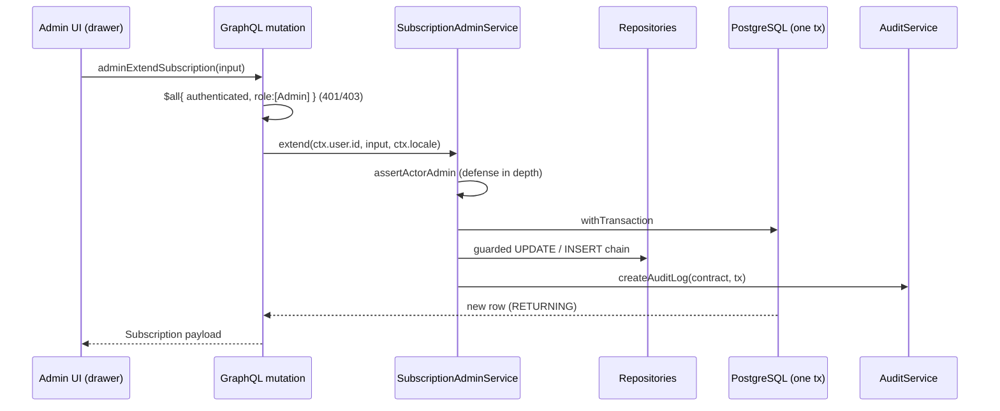

# Plan — Admin Subscription Management (Extend/Renew/Cancel/Upgrade/Downgrade)

**Plan Directory**: `ai/plans/sprint_1/Admin Subscription Management-admin-subscription-management/`
**Related**: `specs.md` (requirements), `tasks.md` (execution), `deferred-items.md` (ledger), `outcome/`
**Ticket**: `docs/planning/TICKETS.md:583-631` · **Decision refs**: B.17, FR-2.7, A.5, INV-B3, INV-B6

## 1. Overview

Four admin-gated lifecycle operations on the existing `subscriptions` root (extend / renew / cancel / change-plan covering upgrade+downgrade), plus one admin read surface. The
design mirrors the shipped plan-catalog and purchase/expiry services: a GraphQL mutation field gated by
`adminOnlyAuthScopes` (`backend/graphql/shared/admin-prelude.ts:24-29`) delegates to a service that re-asserts
the admin role, performs business validation, and executes guarded single-statement transitions plus the audit
write inside ONE `withTransaction` block. Renew and plan-change create NEW subscription rows (never mutate the
historical row's identity) — matching INV-PC2's renewal shape.

### 1.1 Design Goals
- Extend the established billing invariants without schema or enum changes.
- One audit row per committed admin action, transaction-coupled (A.5).
- Replay-safe under double-submit and retry (idempotency claims + guarded predicates).
- Exact proration arithmetic (no float drift on `decimal(10,2)`).

### 1.2 Key Design Decisions

| # | Decision | Rationale | Alternatives rejected |
|---|----------|-----------|------------------------|
| D1 | **No schema / enum changes.** Work within existing `subscriptions` columns and the pinned `audit_action_type` 7-member vocabulary (mapped: extend→Update, renew→Create, cancel→Suspend, plan-change→Override). | The audit enum is pinned by `docs/admin/audit-trail.md:117` and the census' total `Record` check. Schema additions would need a migration policy exception. | Add a `superseded` status or `_renewed_from` column — rejected: unbudgeted schema churn, and claim rows already give referential history. |
| D2 | **New row for renew / plan-change; the source row's status is flipped** (`active→cancelled` for change, source untouched for renew since it is already `expired`). | Follows INV-PC2 ("subscriptions are never mutated in place at purchase/renewal time") while still terminating the old period so lane math stays honest. | In-place plan_id flip on the same row — rejected: destroys auditability of what the student originally bought. |
| D3 | **Idempotency via the existing `subscription_purchase_idempotency` table** with admin-scoped keys (`renew:<sourceId>`, `planChange:<sourceId>:<newPlanId>`). Its `subscriptionId` FK is nullable set-null so the claim survives deletion of the produced row. | Reuses the verified claim→backfill write pattern (`subscription-purchase-idempotency.repository.ts:82,106,136`); zero new tables. | Separate admin idempotency table — rejected as duplication. |
| D4 | **Proration = exact BigInt minor-unit math.** `carrySessions = floor(remainingSessions × priceMinorOld × sessionCountNew / (sessionCountOld × priceMinorNew))`. Direction = unit-price comparison (tie-break: session_count). Downgrade forfeits carry (credit = `sessionCountNew` only). | Prices are `decimal(10,2)` strings (`plans.ts:26`); float division drifts. The B.17 text mandates "prorated … value credited toward the new plan" for upgrade and "excess value forfeited" for downgrade — see TICKETS.md:617-628. | Percent-based carry; float math; symmetric carry on downgrade — rejected by ticket AC. |
| D5 | **Lane-level (flat) remainder.** "Remaining sessions" = the student's current lane balance for the old plan's lane, and the plan-change refuses when ANOTHER active/pending subscription covers that lane (guards against the known flat-lane attribution ambiguity documented in the rejected O2 ledger). | The crediting plan deliberately rejected per-subscription ledgers; admin ops must not silently consume another subscription's contribution. | Introduce per-subscription session ledgers — rejected (upstream-deferred design, out of scope). |
| D6 | **Admin surface = drawer section on the student directory**, not a new top-level page. | Follows existing admin/students drawer components (`AdminStudentDetailDrawer.tsx`); subscription actions belong to a specific student's context. | Dedicated `/admin/subscriptions` page — deferred (D2 in ledger). |
| D7 | **Single mutation `adminChangeSubscriptionPlan`** (not two separate mutations) — direction derived from price/sessionCount comparison server-side. | A single entry point halves boilerplate and keeps direction server-derivable (client cannot claim "downgrade" on an upgrade). | Two mutations — rejected: same input, same transaction body, silly duplication. |
| D8 | **Cancel = `Suspend` audit verb; plan-change = `Override` audit verb.** Vocabulary is pinned (`AuditActionType` has 7 members); extend/cancel pair pinned by census deferred row D-001. | Keeps CI (`audit-census-drift.test.ts`) and journey assertions deterministic. | Verb per lifecycle action (extend/renew/…) — REJECTED: would silently fail the total-Record compile check. |

## 2. Architecture

### 2.1 Layer Map

| Layer | New surface | Existing surface reused |
|-------|-------------|-------------------------|
| GraphQL | `backend/graphql/mutation/billing/subscription-admin.mutation.ts`, `backend/graphql/query/billing/subscription-admin.query.ts`, `backend/graphql/pothos/billing/subscription-admin.pothos.ts` | `adminOnlyAuthScopes`, `requireAdminUser` (`backend/graphql/shared/admin-prelude.ts:24-36`), `SubscriptionPothosObject` (`pothos/billing/subscription.pothos.ts:48`) |
| Services | `backend/services/billing/subscription-admin.service.ts` (+ `.helpers.ts`) | `assertActorAdmin` (`services/admin/admin-gate.helpers.ts:114`), `AuditService.createAuditLog` (`services/admin/audit.service.ts:82`), `withTransaction` |
| Repos | `subscription.repository.ts` +2 methods; `student.repository.ts` +1 method | `insertSubscription` (`subscription.repository.ts:69`), `findById` (:86), `listByUserId` (:169), `creditLaneBalance` (`student.repository.ts:416`), claim repo |
| Types | `backend/types/billing/subscription-admin.types.ts` | `SubscriptionReturnType` (`types/billing/subscription.types.ts:22`), `DBTransaction`/`DBQueryExecutor` (`types/db.types.ts:23,30`) |
| Frontend | drawer section + dialogs + documents + i18n keys | `AdminStudentDetailDrawer.tsx`, `frontend/graphql/sharedDocuments/admin/` taxonomy |

### 2.2 Data Flow



### 2.3 Technology Stack
| Layer | Choice | Rationale |
|---|---|---|
| All | existing stack (Bun, Drizzle, Pothos, Apollo, Zustand, MUI v9) | zero new dependencies |

## 3. Components and Interfaces

### 3.1 Repository additions — `backend/db/repo/billing/subscription.repository.ts` (UPDATE existing file)

New namespace methods (verify exact context lines with grep before writing):

```ts
// Single guarded UPDATE: flips end_date forward only while the row is still active.
export async function extendActiveOnce(
  id: number,
  patch: { days: number; newEndDate: Date },
  tx?: DBTransaction
): Promise<SubscriptionSelectType | null>

// Single guarded UPDATE: active → cancelled. Zero rows = replay or wrong state.
export async function cancelActiveOnce(
  id: number,
  tx?: DBTransaction
): Promise<SubscriptionSelectType | null>

// Reads the row + its plan in one round-trip for the change-plan flow.
export async function findActiveWithPlan(
  id: number,
  tx?: DBQueryExecutor
): Promise<{ subscription: SubscriptionSelectType; plan: PlanSelectType } | null>
```

All three follow the file's conventions (`subscription.repository.ts:139-157` is the model): `const executor = tx ?? db`, single statement, `updatedAt: new Date()`. Bare reads (`findActiveWithPlan` executor-less path) use the module's `queryDb` raw pattern (`subscription.repository.ts:115-124`).

### 3.2 Repository additions — `backend/db/repo/students/student.repository.ts` (no new file)

No new methods required — reuse `creditLaneBalance(studentId, lane, amount, tx)` (`student.repository.ts:416`) and, for the plan-change lane reset, one NEW method added here:

```ts
// Atomic swap of one lane counter to an exact value, RETURNING the row (guarded: lane must not go negative — value is computed server-side).
export async function setLaneBalanceValue(
  studentId: number,
  lane: SubscriptionCreditLane,
  newValue: number,
  tx?: DBTransaction
): Promise<StudentSelectType | null>
```

### 3.3 Service — `backend/services/billing/subscription-admin.service.ts` (NEW)

```ts
export namespace SubscriptionAdminService {
  // REQ-1
  export async function extendSubscription(input: ExtendSubscriptionInput, actorId: number, locale: string, tx?: DBTransaction): Promise<SubscriptionReturnType>
  // REQ-2
  export async function renewSubscription(input: RenewSubscriptionInput, actorId: number, locale: string, tx?: DBTransaction): Promise<SubscriptionReturnType>
  // REQ-3
  export async function cancelSubscription(input: CancelSubscriptionInput, actorId: number, locale: string, tx?: DBTransaction): Promise<SubscriptionReturnType>
  // REQ-4
  export async function changeSubscriptionPlan(input: ChangeSubscriptionPlanInput, actorId: number, locale: string, tx?: DBTransaction): Promise<SubscriptionReturnType>
  // REQ-5
  export async function listForAdmin(userId: number, locale: string, tx?: DBQueryExecutor): Promise<SubscriptionReturnType[]>
}
```

Sibling helpers file `subscription-admin.helpers.ts` (runtime only — NO types here; types go to `backend/types/billing/subscription-admin.types.ts`):
- `buildSubscriptionAuditContract(actorId, actionType, entityId, details)` — mirrors `buildPlanAuditContract` (`plan-catalog.helpers.ts:115-125`), with `SUBSCRIPTION_AUDIT_ENTITY_TYPE = "subscription"`.
- `computeProration({ remainingSessions, oldPlan, newPlan })` — BigInt minor-unit math per D4; returns `{ direction: "upgrade" | "downgrade"; carrySessions: number; newSessionCount: number }`.
- `coerceSubscriptionId(value, tErrors)` — strict numeric parse (mirrors `PlanCatalogService.coercePlanId`).
- `toSubscriptionAdminDomainError(error, tErrors)` — maps unique-violation / FK / check-violation onto typed DomainErrors.
- `SUBSCRIPTION_ADMIN_CLAIM_PREFIXES = { renew: "renew", planChange: "planChange" }` (string constants for claim keys).

Transaction shape (all four writers):
1. `assertActorAdmin(actorId, locale, tx-from-arg-if-present)` — zero writes on denial.
2. `withTransaction(tx, async scopedTx => { … business writes … await AuditService.createAuditLog(contract, scopedTx); })`.
3. Domain error mapping in the outer `catch`, mirroring `plan-catalog.service.ts:100-131`.

### 3.4 Types — `backend/types/billing/subscription-admin.types.ts` (NEW, register in `backend/types/billing/index.ts`)

```ts
export interface ExtendSubscriptionSubmitInput { readonly subscriptionId: number; readonly days: number }
export interface RenewSubscriptionSubmitInput { readonly subscriptionId: number }
export interface CancelSubscriptionSubmitInput { readonly subscriptionId: number; readonly reason?: string }
export interface ChangeSubscriptionPlanSubmitInput { readonly subscriptionId: number; readonly newPlanId: number }
export interface ProrationComputation {
  readonly direction: "upgrade" | "downgrade";
  readonly carrySessions: number;   // upgrade ≥0, downgrade: forfeited value expressed as sessions
  readonly forfeitedSessions: number; // 0 on upgrade, >0 when downgrade proration discards remainder
  readonly newSessionCount: number; // newPlan.sessionCount
}
```

### 3.5 Pothos — `backend/graphql/pothos/billing/subscription-admin.pothos.ts` (NEW)

- Object: reuse `SubscriptionPothosObject` from `subscription.pothos.ts` (single canonical type rule) — no new object type needed except a small change-plan payload:

```ts
gqlSchemaBuilder.objectType-ish payload `ChangeSubscriptionPlanPayload`:
  subscription: SubscriptionPothosObject (the NEW row)
  direction: ProrationDirectionPothosEnum  // register ProrationDirection enum in shared/enum.pothos.ts
  carrySessions: Int
  forfeitedSessions: Int
```

Per `backend/graphql/AGENTS.md` enum rule, `ProrationDirection` is a real TS enum in `backend/enum/billing/proration-direction.enum.ts`, registered once in `shared/enum.pothos.ts`.

STRICT alternative to avoid a new GraphQL payload type: return the new `StudentSubscription` row from plan-change and expose proration inputs only via the audit row + the response dialog copy in the UI. DECISION (simpler): keep mutations returning `SubscriptionPothosObject` for extend/renew/cancel; `changeSubscriptionPlan` returns the small payload so the UI can render "carried X sessions, forfeited Y" without a refetch.

- Inputs: `ExtendSubscriptionInput { subscriptionId: ID!, days: Int! }`, `RenewSubscriptionInput { subscriptionId: ID! }`, `CancelSubscriptionInput { subscriptionId: ID!, reason: String }`, `ChangeSubscriptionPlanInput { subscriptionId: ID!, newPlanId: ID! }`.

### 3.6 GraphQL mutations — `backend/graphql/mutation/billing/subscription-admin.mutation.ts` (NEW)

Registration & gating pattern identical to `plan-catalog.mutation.ts:20-48` but tightened with the prelude:

```ts
gqlSchemaBuilder.mutationField("adminExtendSubscription", t =>
  t.field({ type: SubscriptionPothosObject, authScopes: adminOnlyAuthScopes, args: { input: t.arg({ type: ExtendSubscriptionInput, required: true }) },
    resolve: async (_r, a, ctx) => {
      const user = await requireAdminUser(ctx);
      return SubscriptionAdminService.extendSubscription(a.input, user.id, ctx.locale);
    } }));
```
Same for `adminRenewSubscription`, `adminCancelSubscription`, `adminChangeSubscriptionPlan`.

Registered via side-effect import added to `backend/graphql/mutation/billing/index.ts`; header docblock updated there.

### 3.7 GraphQL query — `backend/graphql/query/billing/subscription-admin.query.ts` (NEW)

`adminStudentSubscriptions(userId: ID!): [StudentSubscription]` with `adminOnlyAuthScopes` + `requireAdminUser`, delegating to `SubscriptionAdminService.listForAdmin`. Wire into `backend/graphql/query/billing/index.ts`.

### 3.8 Frontend drawer surface (NEW files)

- `frontend/views/admin/students/subscriptions/SubscriptionAdminSection.tsx` — renders rows + action buttons.
- `.../dialogs/ExtendSubscriptionDialog.tsx`, `RenewSubscriptionDialog.tsx`, `CancelSubscriptionDialog.tsx`, `ChangeSubscriptionPlanDialog.tsx` (one file per dialog, mirroring `frontend/views/admin/plans/dialogs/`).
- `.../hooks/useSubscriptionAdminActions.ts` — `useMutation` wrappers.
- Mount point: extend `AdminStudentDetailDrawer.tsx` to include the section (READ the file first; add section after balances).
- GraphQL docs: `frontend/graphql/sharedDocuments/admin/admin-subscriptions.documents.ts` + co-located `.documents.test.ts`; export via domain `index.ts`.
- i18n: NEW namespace `subscriptionAdmin` (types/en/ar + handle + parity test + message wiring).
- NavLabels: no new nav item (drawer surface). The existing `DashboardLabels.subscriptions` key (`shared/locale/types/dashboard/index.ts:25`) is student-nav; not reused.

## 4. Data Models

### 4.1 `subscriptions` (existing, unmodified)
From `backend/db/schema/billing/subscriptions.ts:28-57`: `id` identity PK, `userId` FK→users (restrict), `planId` FK→plans (restrict), `status` pgEnum default `'pending'`, `startDate`/`endDate` nullable timestamps, `paymentMethod` nullable pgEnum, `paymentReference` nullable varchar(255) with partial unique index, `paymentVerifiedAt`, `createdAt`/`updatedAt`.

Transitions this design adds (no schema change):

| From | To | Op | Guard | Side effects |
|------|----|----|-------|--------------|
| `active` | `active` (rows same, window extended) | extend | `WHERE id AND status='active'`; new endDate computed from `end_date + days` | audit Update |
| `expired` | (unchanged row) + NEW `active` row | renew | status='expired' + claim insert | credit lanes + junction + claim backfill + audit Create |
| `active` | `cancelled` | cancel | `WHERE id AND status='active'` | balance untouched; audit Suspend |
| `active` | (becomes `cancelled`) + NEW `active` row on new plan | changePlan | status='active'; lane-coverage check; claim insert | old row→cancelled; lane reset on old lane; new lane credited; audit Override |

> The `suspended` status member exists but is used by governance surfaces — subscription admin does NOT use it (documenting to prevent drift).

### 4.2 `plans` (read-only here)
Existing columns: `price` `decimal(10,2)` string, `sessionCount`, `intervalDays`, `balanceLane`, `isActive`, `deactivatedAt`. Proration + guard use reads only.

### 4.3 `student_subscriptions` (junction)
Composite PK (studentId, subscriptionId); both FKs cascade. New rows inserted on renew + plan-change exactly as the purchase flow does at `subscription-purchase.service.ts:418`.

### 4.4 `subscription_purchase_idempotency` (shared claim store)
Reused (D3): `idempotencyKey` (unique, varchar(128)), `userId`, nullable `subscriptionId` (set-null FK). `insertClaim`/`updateClaimSubscriptionId`/`findByKey` verified at `subscription-purchase-idempotency.repository.ts:82,106,136`.

### 4.5 `students` balance lanes
Columns `balanceHifz`/`balanceTajweed`/`balanceReviews`/`balanceTrial` with `CHECK >= 0` (`students.ts:24-45`). Proration only touches paid lanes; trial is never touched (INV-B3/B7).

### 4.6 `audit_logs` (existing, append-only)
`actor_id`, `action_type` (7-member enum), `entity_type` (varchar 100), `entity_id` (nullable), `details` (varchar 2000), `created_at`. UPDATE/DELETE triggers block mutation (`backend/db/migration/3-immutability-triggers.sql`).

## 5. API Contracts (SDL)

SDL surface added (verified naming against plan-catalog / subscription-purchase precedent):

```graphql
extend type Mutation {
  adminExtendSubscription(input: ExtendSubscriptionInput!): StudentSubscription!
  adminRenewSubscription(input: RenewSubscriptionInput!): StudentSubscription!
  adminCancelSubscription(input: CancelSubscriptionInput!): StudentSubscription!
  adminChangeSubscriptionPlan(input: ChangeSubscriptionPlanInput!): ChangeSubscriptionPlanPayload!
}
extend type Query {
  adminStudentSubscriptions(userId: ID!): [StudentSubscription!]!
}

input ExtendSubscriptionInput { subscriptionId: ID!, days: Int! }
input RenewSubscriptionInput { subscriptionId: ID! }
input CancelSubscriptionInput { subscriptionId: ID!, reason: String }
input ChangeSubscriptionPlanInput { subscriptionId: ID!, newPlanId: ID! }

enum ProrationDirection { Upgrade Downgrade }

type ChangeSubscriptionPlanPayload {
  subscription: StudentSubscription!
  direction: ProrationDirection!
  carrySessions: Int!
  forfeitedSessions: Int!
}
```

(The `StudentSubscription` object already exposes `id`, `planId`, `plan`, `status`, `startDate`, `endDate`, `paymentMethod`, `createdAt`, `updatedAt` — verified at `pothos/billing/subscription.pothos.ts:48-101`. The `ProrationDirection` wire spelling follows the Pothos enum-member KEY convention — `Upgrade`/`Downgrade` on the wire, matching e.g. `WalletAdjustmentDirection` → `Credit`/`Debit`.)

### 5.1 GraphQL Permission Matrix

| Field | authScopes | Service re-assertion | Error surface |
|-------|-----------|----------------------|----------------|
| `adminExtendSubscription` | `adminOnlyAuthScopes` (`$all{authenticated, role:[Admin]}`) | `assertActorAdmin` | UNAUTHORIZED/FORBIDDEN/VALIDATION/NOT_FOUND/CONFLICT |
| `adminRenewSubscription` | same | same | + CONFLICT (claim replay) |
| `adminCancelSubscription` | same | same |  |
| `adminChangeSubscriptionPlan` | same | same |  |
| `adminStudentSubscriptions` | same | same (defense in depth) | FORBIDDEN |
| Anything for non-admin caller | — | — | 403 → census-journey denial probe |

### 5.2 Action → Audit-Verb Mapping (census-pinned)

| Mutation | `AuditActionType` | Census entry replaces |
|----------|------------------|-----------------------|
| adminExtendSubscription | `Update` | D-001 deferred row |
| adminRenewSubscription | `Create` | covered by new rows |
| adminCancelSubscription | `Suspend` | D-001 deferred row |
| adminChangeSubscriptionPlan | `Override` | new wired row |

New wired rows land in `test/workflows/admin/audit-completeness.catalog.ts` alongside the existing 13; the deferred D-001 composite row is REPLACED (the array `DEFERRED_ADMIN_ACTION_IDS` keeps D-001 available in case another subscription surface is deferred later — do NOT renumber other IDs).

## 6. Concurrency & Race Condition Assessment (CONDITIONAL — included: balances are mutable shared state)

### 6.1 Concurrency model
Guarded single-statement transitions + same-transaction audit writes. No SELECT-then-UPDATE on subscription rows. FOR UPDATE on the claim insert (unique PK violation = replay).

### 6.2 Race Scenarios

| Scenario | Actors | Risk | Mitigation |
|----------|--------|------|------------|
| Double-submit extend | Admin (×2 tabs) | Two extensions | `extendActiveOnce` is a single guarded UPDATE but not idempotent — repeated calls legitimately stack. Ticket allows repeated extension; audit rows distinguish them. (Documented behavior — not a bug.) |
| Concurrent extend vs expiry sweep | Admin vs cron | Extend races flip | Expiry guard is `end_date <= now AND status='active'`; extend changes `end_date` — a single-statement execution order decides. Acceptable: either the sweep wins (row expires, then renew is the recovery path) or extend wins. Linearizable by the database's statement ordering inside their respective transactions. |
| Renew replay (retry/double click) | Admin client | Two active periods created | Claim insert `renew:<sourceId>` BEFORE subscription insert; 23505 conflict maps to replayed result (read claim → return its subscriptionId). |
| Plan-change replay | Admin client | Double credit | Claim `planChange:<sourceId>:<newPlanId>`; old row is cancelled in the same tx so a replay's guard also fails closed. |
| Plan-change vs concurrent booking that debits a lane | Admin vs student booking | Stale lane read → wrong proration | Read the lane balance INSIDE the same transaction; balance lane write is a guarded single statement (`setLaneBalanceValue`) — if another write landed between compute and write, the prepared arithmetic stays consistent because we set exact values, never relative increments on the OLD lane (the old lane's discard-overwrite is exactly what cancel+reset semantics require). `creditLaneBalance` on the new lane is relative-add — replay-safe per claim. |
| Two admins acting on the same subscription | Admin A extend, Admin B cancel | Interleave | Both are guarded UPDATEs — serializable per row; audit trail preserves both. Acceptable multi-admin semantics. |

### 6.3 TOCTOU notes
- `adminStudentSubscriptions` is read-only; no TOCTOU concern.
- Every writer's guard lives inside the UPDATE's WHERE — no read-then-write TOCTOU on the target row.

## 7. Cross-Actor Journey Design

Journey (single shared entity: one student's subscription):

| Step | Actor | Action | Shared-state change | Side effects |
|------|-------|--------|--------------------|--------------|
| 1 | System | Provision: student (lane=4 remaining on active Hifz sub S), admin, a second unrelated student | fixtures | tracked ids registered |
| 2 | Admin | extend S +30d | `subscriptions.end_date += 30d` | 1 audit row (Update) |
| 3 | Student | reads own subs | sees extended end_date | none |
| 4 | Admin | cancel S | S.status='cancelled'; lane left at its value | 1 audit row (Suspend) |
| 5 | Student | requests session | lane value preserved → booking allowed IF balance >0 (INV-B4; note: booking gate lives elsewhere, journey only asserts lane unchanged + no booking-denial mutation from the cancel op itself) | none |
| 6 | System | time-travel/insert expired S2 + drain lane | fixtures | tracked |
| 7 | Admin | renew S2 | new active row S3, lane += plan.sessionCount, junction row | claim row + audit Create |
| 8 | Admin | renew S2 again (replay) | NOTHING new; service returns S3 | second call reads claim and returns existing — asserted equal ids |
| 9 | Admin | plan-change S3 → smaller plan | S3 cancelled; S4 created on new plan; lane set to new count (excess forfeited) | claim row + audit Override |
| 10 | (denial) Student actor | tries adminCancelSubscription on own row | 403 FORBIDDEN | none |
| 11 | (BOLA-flavored sanity) unrelated Student actor | reads adminStudentSubscriptions(otherStudentId) | 403 before touch | no rows leaked |

Coverage invariants asserted by the journey (mirroring `test/workflows` hard rules):
- Every actor cast is real; never monkey-patched.
- Audit row assertions through `audit` reads (the completeness journey already executes each census row through its real service path; this journey asserts row-per-action shape).
- Zero residue at teardown (`TrackedFixtures.cleanup`), idempotent re-run proven by two consecutive runs.

## 8. Security & Tenancy

- **BOLA**: mutations take ids; subscription ownership is asserted via the row itself; admins bypass user scoping BY DESIGN (the read surface is admin-only). Non-admin callers to any new field get FORBIDDEN before any DB touch — asserted in tasks 2-7 `.SEC` legs + journey denial legs.
- **BOPLA**: repo patches are EXPLICIT column picks (`status`, `endDate`, `updatedAt` etc.) — never `{ ...input }`. Verified in repo tests.
- **BFLA**: double gate (prelude scopes + `assertActorAdmin`) — REQ-7.
- **BOLC/claims**: claim keys are server-constructed, never caller-supplied on this surface (X-Idempotency-Key is NOT consumed by these mutations).
- **Audit PII**: details carry ids, ints, ISO dates ONLY — no free text beyond an optional reason ≤ 200 chars on cancel.

## 9. UX / Navigation Spec

No new routes or nav items (drawer surface, D6). For completeness:

| Route | Purpose | Permission | Roles |
|-------|---------|-----------|-------|
| `/students` (existing) | admin student directory + detail drawer | `withPageAuth(roles:[Admin])` | Admin only |

The drawer gains a "Subscriptions" section; per-row actions are dialogs. Mobile rendering uses the established mobile-card pattern of the students directory.

Translation namespace: NEW `subscriptionAdmin` — registered in all five places (`types/`, `en/`, `ar/`, `types/message.ts`, handle + parity test).

## 10. Outcome & Knowledge Transfer Protocol
Same as template: read `outcome/` first; write `<task-id>-outcome.md`; flip checkboxes.

## 11. Drizzle / Migration Discipline
No schema edits anywhere in this plan → **no `db push`, no migrations**. If implementation discovers an unavoidable schema change, stop and record in the deferred ledger + outcome.

## 12. Anti-Pattern Safelist (verified negatives)
Verified ABSENT (do not re-invent): `requirePermissionForPage`; the stale `app/(dashboard)/shared/withPageAuth.ts` path referenced by old docs (real guard: `@/frontend/lib/auth/withPageAuth`); AppDataGrid; BaseCard; any `Translation`-enum-shaped selector; the two-arg form of `getTranslations`; `next-intl`; Pothos `permission`-scope strings (placeholder); mobile bottom-of-screen navigation; any pre-existing admin subscription mutations/queries (all four mutations + the one read query are NEW).
