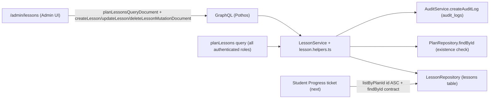

# Design — Tajweed Curriculum Lessons CRUD

> **Plan directory (verbatim):** `ai/plans/milestone_2_matching_notifications_escrow/tajweed_curriculum_lessons_crud-curriculum_lessons_crud/`
> **Specs of record:** `specs.md` (REQ-001..REQ-081) in the same directory · **Ticket:** `Tajweed Curriculum Lessons CRUD` (`docs/planning/TICKETS.md:1145-1183`) — Dev 1 · Milestone 2 · 3 SP · Blocked By Subscription Validity Window & Expiry (SHIPPED)
> **Plan kind:** full vertical slice — zero schema delta; the `lessons` table is consumed as-is; all layers (types, repo, service, GraphQL, i18n, seeds, admin UI, tests) are NEW code cloned from the shipped plan-catalog stack.

## Document Information

| Field | Value |
|---|---|
| Version / Date | 1.0 · 2026-09-17 |
| Ground-truth schema | `backend/db/schema/classes/lessons.ts:17-30` · `backend/db/schema/classes/progress.ts:19-34` · `backend/db/schema/billing/plans.ts:23-33` |
| Clone lineage | `backend/db/repo/billing/plan.repository.ts` · `backend/services/billing/plan-catalog.{service,helpers}.ts` · `backend/graphql/pothos/billing/plan.pothos.ts` · `backend/graphql/mutation/plan-catalog.mutation.ts` · `backend/graphql/query/plan-catalog.query.ts` · `frontend/views/admin/plans/**` |

## 1. System Overview & Architecture

A thin, fully precedented CRUD stack over the existing `lessons` table:



### Design Goals
1. Deterministic curriculum: ONE ordering predicate (`id ASC` per plan) consumed by everything downstream (admin UI, progress increment, teacher prep).
2. History preservation by construction: lesson deletion never destroys `progress` rows (FK set-null is the safety story, not a caveat).
3. Zero drift: no schema, no invented constraints, no new error taxonomy — every layer mirrors an already-shipped sibling.

### Key Design Decisions

- **D1 — Zero schema delta; sequence = `id ASC`.** *Context:* the ticket's AC says "the lessons form the curriculum sequence", but the schema (and FR-6.1: `lessons (plan_id, title)`, `docs/specs/functional-requirements.md:198-200`) has no ordering column. *Options:* (1) add a `position` column + reorder API; (2) order by `id ASC`. *Decision:* (2). *Rationale:* creation order IS curriculum order for an admin-authored curriculum; a `position` column expands a 3-SP ticket with schema drift, reorder mutations, and gap-compaction semantics nobody asked for; the progress ticket consumes `id ASC` as a stable contract. Reordering is a recorded forward item (ledger D1).
- **D2 — `planId` required at the API, never nullable in input.** *Context:* `lessons.plan_id` is nullable (`backend/db/schema/classes/lessons.ts:21`). *Rationale:* the schema header says the null state exists so "the lesson survives as a standalone unit" on plan deletion — and no `deletePlan` mutation exists (`backend/graphql/mutation/plan-catalog.mutation.ts` header), so NULL plan links are unreachable through the API. INV-PR3 ("Lessons belong to plans") is enforced at the service boundary; update may re-link to another existing plan, never to null.
- **D3 — Hard delete sanctioned.** *Context:* the ticket explicitly includes delete; plans are forward-only (no deletePlan) by INV-PC3, but lessons have no such invariant. *Rationale:* `progress.lesson_id` is `ON DELETE SET NULL` (`backend/db/schema/classes/progress.ts:26`) — the schema authors designed deletion to preserve progress history; `AuditActionType.Delete` ships in the enum (`backend/enum/audit/audit-action-type.enum.ts:10`). Delete is ONE guarded statement + ONE audit row snapshotting the row before it disappears.
- **D4 — One authenticated read, no admin/read split.** *Context:* the plans catalog splits `planCatalog` (active-only, authenticated) vs `adminPlans` (admin, all states) because `plans.is_active` exists. *Rationale:* lessons carry no state flag — an admin list and a student list of the same plan are the SAME rows in the SAME order, so a second query would be pure duplication. `planLessons(planId)` serves the admin UI and every future consumer (teacher prep, student dashboard).
- **D5 — No title uniqueness.** No unique constraint exists on `lessons` and none is minted; a curriculum may legitimately contain two identically-titled sessions. Lessons are identified by `id`.
- **D6 — Bad plan reference = `ValidationError` (422), bad lesson id = `NotFoundError` (404 semantics).** The ticket's test scenario "Lesson with non-existent plan_id — 422" pins the plan-field error to VALIDATION; the lesson being operated on, by contrast, is the resource addressed by the operation — a missing one is `LESSON_NOT_FOUND`. Strict numeric arg coercion (`LessonService.coerceLessonId` mirroring `PlanCatalogService.coercePlanId`, `backend/services/billing/plan-catalog.service.ts:67`) rejects malformed ids without touching the DB.
- **D7 — Audit entityType `"lesson"`.** Mirrors `PLAN_AUDIT_ENTITY_TYPE = "plan"` (`backend/services/billing/plan-catalog.helpers.ts:107`); every mutation appends exactly one Create/Update/Delete row inside the mutation's transaction; the Delete row snapshots `{ planId, title }` because the source row is gone.
- **D8 — Seed parity through the service, controller-threaded plan identity.** New `backend/db/seeds/classes/seed-lessons.ts` follows the `seedOrGet` idiom (`backend/db/seeds/AGENTS.md`): consume `LessonService` exclusively, idempotent by `(planId, title)`; the master controller threads the seeded Tajweed plan id ("Tajweed & Tilawa", `backend/db/seeds/billing/seed-plans.ts:45`) — never query seed data for it.
- **D9 — UI clones the shipped plans-admin stack.** `frontend/views/admin/lessons/` mirrors `frontend/views/admin/plans/` (container, MUI `Table` desktop + mobile card list, form dialog, confirm dialog, hooks). The repo has NO `AppDataGrid` component — hand-rolled MUI tables are the established pattern; permission gating is `withPageAuth({ roles: [UserRole.Admin] })` (there is no `requirePermissionForPage`/`RequirePermission` helper in this codebase).
- **D10 — Single-actor journey ruling.** Admin is the only mutator; other roles only read immutable list data; no cross-actor state machine, no notification fan-out. No `test/workflows/` journey in this ticket — the domain's first journey (session completes → progress increments → teacher observes) ships with the Student Progress ticket (ledger D2).
- **D11 — FK-violation mapping.** `toLessonWriteDomainError` extends the plan-catalog mapper (`backend/services/billing/plan-catalog.helpers.ts:94` maps unique→ConflictError, check→ValidationError) with pg `23503` on `lessons_plan_id_plans_id_fkey` → the same `ValidationError` planId field error as the pre-write check — defense-in-depth parity between service validation and the DB constraint.

## 2. UX / Navigation Specification

### 2.1 New Routes & URLs

| Route | Purpose | Permission / Gate | Roles with Access |
|---|---|---|---|
| `/admin/lessons` | Curriculum management: pick a plan → list, create, edit, delete its lessons | `withPageAuth({ roles: [UserRole.Admin], redirectTo: "/admin/lessons" })` (page) + `authScopes: { role: [UserRole.Admin] }` (mutations) | Admin only |
| `/admin/plans` (EXISTING, read consumer) | Plan selector feeding the lessons page | unchanged | Admin only |

No other route changes. Students/teachers/parents get NO page in this ticket (their curriculum surfaces ship with the progress ticket); they consume `planLessons` over GraphQL only.

### 2.2 Sidebar Navigation Integration

- **File:** `frontend/views/dashboard/nav/navItems.ts` — flat per-role arrays (`NAV_ITEMS_BY_ROLE`, `:125`); there are no nav groups and NO mobile bottom-nav anywhere in this repo.
- **Insertion:** Admin array (`:155-183`), immediately after the `/admin/plans` entry (`:161`): `{ route: "/admin/lessons", labelKey: "lessons", Icon: MenuBookOutlined }` (MUI v9 `*Outlined` naming per `:6-28`).
- **Label wiring:** `"lessons"` key added to `DashboardLabels` (`shared/locale/types/dashboard/index.ts:39` neighbors), `dashboardEn` (`shared/locale/en/dashboard/index.ts:15` neighbors — "Lessons"), `dashboardAr` (`shared/locale/ar/dashboard/index.ts:15` neighbors — Arabic script). Resolution rides the existing `resolveNavItemLabel` (`navItems.ts:209-218`).

### 2.3 Role-Based Access Matrix

| Role | `/admin/lessons` page | `planLessons` query | Mutations |
|---|---|---|---|
| Admin | full CRUD UI | ✓ | ✓ |
| Teacher | ✗ (redirect via `withPageAuth`) | ✓ (FR-6.2 substrate) | ✗ 403 |
| Student | ✗ (redirect) | ✓ (curriculum display) | ✗ 403 |
| Parent | ✗ (redirect) | ✓ (read-only monitoring) | ✗ 403 |
| Anonymous | ✗ (`/login` redirect) | ✗ 401 (`authenticated` scope throws) | ✗ 403 (`role` scope returns false) |

### 2.4 Per-Audience Rendering

| Audience | Rendering |
|---|---|
| Admin | Plan selector + lesson table (desktop `Table` / mobile card list), create/edit dialog, delete confirm dialog, per-row loading states, snackbar toasts — cloned from `frontend/views/admin/plans/`. |
| Teacher / Student / Parent | Nothing in this ticket (GraphQL read only). |
| Mobile | Same responsive pattern as the plans stack (`PlanMobileCardList` analog) — no bottom-nav. |

## 3. Data Models & Database Schema (EXISTING — consumed read-only)

### 3.1 `lessons` (verbatim ground truth, `backend/db/schema/classes/lessons.ts:17-30`)

```typescript
export const lessons = pgTable(
  "lessons",
  {
    id: integer("id").primaryKey().generatedAlwaysAsIdentity(),
    planId: integer("plan_id").references(() => plans.id, { onDelete: "set null" }),
    title: varchar("title", { length: 255 }),
    createdAt: timestamp("created_at").defaultNow().notNull(),
    updatedAt: timestamp("updated_at")
      .defaultNow()
      .notNull()
      .$onUpdate(() => new Date()),
  },
  t => [index("lessons_plan_id_idx").on(t.planId)]
);
```

**Analysis (verification targets, not change targets):**
- `plan_id` nullable FK ON DELETE SET NULL → `plans` (`:21`) — D2/D3 rationale lives in the schema itself.
- `title` nullable varchar(255) (`:22`) — API requires it (REQ-012); NULL survives only as legacy/foreign-write defense.
- Migration shipped: `backend/drizzle/20260904084151_omniscient_karen_page/migration.sql:174` (table), `:358` (index), `:422` (FK `lessons_plan_id_plans_id_fkey`), `:430` (`progress_lesson_id_lessons_id_fkey`).
- **No CHECK constraints, no ordering column, no soft-delete columns** — confirmed against `db/schema.dbml:446-452` (`Ref: lessons.plan_id > plans.id [delete: set null]` at `:555`).

### 3.2 Referencing surface

`progress.lesson_id` → `lessons.id` ON DELETE SET NULL (`backend/db/schema/classes/progress.ts:26`) — the deletion-safety contract (REQ-043). The progress table itself is OUT of this ticket's write scope entirely.

### 3.3 Canonical types (NEW `backend/types/classes/lesson.types.ts`)

```typescript
import type { lessons } from "@/backend/db/schema/classes/lessons";

export type LessonSelectType = typeof lessons.$inferSelect;
export type LessonInsertType = typeof lessons.$inferInsert;
export type LessonReturnType = typeof lessons.$inferSelect; // no forbidden fields, no enum re-typing

export interface LessonSubmitInput {
  readonly planId: number;
  readonly title: string;
}

export type LessonUpdateInput = Partial<LessonSubmitInput>;
```

Barrel UPDATE: `backend/types/classes/index.ts` (8 exports today, `:1-8`) gains `export * from "./lesson.types";` (REQ-003).

## 4. Backend Services, Repositories & Concurrency Model

### 4.1 `LessonRepository` (NEW `backend/db/repo/classes/lesson.repository.ts`)

Mirrors the dual-path read idiom of `backend/db/repo/billing/plan.repository.ts` (`isDBTransaction` guard + `LESSON_READ_COLUMNS` constant + raw `queryDb` Neon fast path for bare reads; Drizzle select inside a supplied `tx`). All methods take `tx` LAST:

```typescript
export namespace LessonRepository {
  export async function insertLesson(insert: LessonInsertType, tx?: DBTransaction): Promise<LessonSelectType>;
  //    one INSERT … RETURNING; defensive ConflictError if the RETURNING list is empty (insertPlan precedent, plan.repository.ts:52)
  export async function updateLessonFields(id: number, patch: LessonUpdateInput, tx?: DBTransaction): Promise<LessonSelectType | null>;
  //    ONE guarded UPDATE … WHERE id = <id> … RETURNING; zero-row = not-found signal; sets updatedAt server-side
  export async function deleteById(id: number, tx?: DBTransaction): Promise<LessonSelectType | null>;
  //    ONE guarded DELETE … WHERE id = <id> RETURNING; zero-row = not-found signal
  export async function findById(id: number, tx?: DBQueryExecutor): Promise<LessonSelectType | null>;
  export async function listByPlanId(planId: number, tx?: DBQueryExecutor): Promise<LessonSelectType[]>;
  //    WHERE plan_id = <planId> ORDER BY id ASC — THE curriculum-sequence predicate (REQ-015), the only ordering in the ticket
}
```

Barrel UPDATE: `backend/db/repo/classes/index.ts` (6 exports today) gains `export * from "./lesson.repository";`.

### 4.2 `LessonService` (NEW `backend/services/classes/lesson.service.ts`)

Namespace-exports mirroring `PlanCatalogService` (`backend/services/billing/plan-catalog.service.ts:59-267`) — admin gate BEFORE validation, `withTransaction` composing write + audit, localized errors via `getServerTranslations(locale).errorsTranslations`:

```typescript
export namespace LessonService {
  export function coerceLessonId(rawId: string | number, locale?: string): number;
  //    strict Number() parse; malformed → NotFoundError("LESSON", tErrors.lessonCatalog.lessonNotFound) (coercePlanId precedent :67-77)
  export async function createLesson(input: LessonSubmitInput, actorId: number, locale?: string, tx?: DBTransaction): Promise<LessonReturnType>;
  export async function updateLesson(id: number, patch: LessonUpdateInput, actorId: number, locale?: string, tx?: DBTransaction): Promise<LessonReturnType>;
  export async function deleteLesson(id: number, actorId: number, locale?: string, tx?: DBTransaction): Promise<LessonReturnType>;
  export async function listForPlan(planId: number, locale?: string, tx?: DBTransaction): Promise<LessonReturnType[]>;
  //    read path: NO actor gate (the authenticated GraphQL scope is the gate); delegates to LessonRepository.listByPlanId
}
```

Shared mutation prelude (private, mirrors `assertPlanMutationActor`, `backend/services/billing/plan-catalog.service.ts:49-56`): resolve locale → `assertActorAdmin(actorId, resolvedLocale, tx)` (`backend/services/admin/admin-gate.helpers.ts:114`) → return `tErrors` — a non-admin actor is rejected with ZERO writes before validation even runs.

Service barrel UPDATE: `backend/services/classes/index.ts` gains `export * from "./lesson.service";` (top-level `backend/services/index.ts` already re-exports `./classes`).

### 4.3 Helpers (NEW `backend/services/classes/lesson.helpers.ts`)

Mirrors `backend/services/billing/plan-catalog.helpers.ts`:

| Helper | Signature | Behavior |
|---|---|---|
| `validateLessonInput` | `(input: LessonSubmitInput, tErrors: ErrorsLabels) => void` | per-field validators; throws `ValidationError(tErrors.validation, fields)` with codes `LESSON_TITLE_REQUIRED` / `LESSON_TITLE_TOO_LONG` / `LESSON_PLAN_NOT_FOUND` |
| `validateAndExtractLessonPatch` | `(patch: LessonUpdateInput, tErrors: ErrorsLabels) => { updatePatch: LessonUpdateInput; fields: ApiFieldErrorType[] }` | conditional-spread patch building (never `{...input}` into `.set()`) |
| `toLessonWriteDomainError` | `(error: unknown, tErrors: ErrorsLabels) => unknown` | unique violation → `ConflictError`; check violation → `ValidationError`; pg `23503` on `lessons_plan_id_plans_id_fkey` → `ValidationError` with planId field (D11); else passthrough |
| `LESSON_AUDIT_ENTITY_TYPE` | `"lesson"` | mirrors `PLAN_AUDIT_ENTITY_TYPE` (`plan-catalog.helpers.ts:107`) |
| `buildLessonAuditContract` | `(actorId: number, actionType: AuditActionType, entityId: number, details: Record<string, unknown>) => AuditLogWriteContract` | `details: JSON.stringify(details)`; Delete snapshots `{ planId, title }` |

Plan-existence validation: `PlanRepository.findById(planId, tx)` (`backend/db/repo/billing/plan.repository.ts:131`) — miss → `ValidationError` planId field (`LESSON_PLAN_NOT_FOUND`), any active state accepted (D6).

### 4.4 Seeds (NEW `backend/db/seeds/classes/seed-lessons.ts`)

`seedOrGet(locale = "en", adminActorId: number, tx?: DBTransaction)` following `backend/db/seeds/billing/seed-plans.ts`: consume `LessonService.listForPlan` + `createLesson` exclusively; create the missing starter lessons (≥ 3, e.g. "Al-Madd", "An-Noon as-Sakinah", "Al-Qalqalah") on the controller-threaded Tajweed plan id; idempotent by `(planId, title)` matching. NEW sub-directory `backend/db/seeds/classes/` (on disk today: only `billing/`, `lib/`, `students/`, `users/`) + `index.ts` barrel + master-controller registration in `backend/db/seeds/index.ts`.

### 4.5 Concurrency & Race Condition Assessment

| Scenario | Actors | Risk | Mitigation |
|---|---|---|---|
| Double delete / update-vs-delete / double update on one lesson row | 2 admins | lost update / double-effect | single-statement guarded writes (REQ-040); zero-row result = `LESSON_NOT_FOUND`; PG row-level serialization inside the statement; proven via `Promise.allSettled` (REQ-042) |
| Create racing plan deactivation/deletion | admin + admin | lesson attached to dying plan | existence validated at write time; no `deletePlan` exists; FK set-null is the terminal backstop (D2) |
| Orphan plan_id insert | bug/script path | dangling curriculum row | FK `lessons_plan_id_plans_id_fkey` rejects at DB layer (REQ-035); mapper folds `23503` into the same 422 (D11) |
| Read-during-delete | reader + admin | stale list | benign — Apollo `cache-and-network` refetch; no locking warranted |

**No `SELECT FOR UPDATE`, no advisory locks, no module-level mutable state.** The table is small (per-plan tens of rows); `lessons_plan_id_idx` covers the only hot predicate.

### 4.6 Audit Flow (per mutation)

`withTransaction(tx, …)` wraps write + `AuditService.createAuditLog(buildLessonAuditContract(…), scopedTx)` — the audit row shares the mutation's commit/rollback fate (`backend/services/admin/audit.service.ts:82`; contract `backend/types/contracts/admin-audit.contract.types.ts:22-36`, `tx` REQUIRED). Failed/forbidden mutations mint NOTHING (zero-write denial oracle asserted in tests).

## 5. API Contracts & SDL

### 5.1 GraphQL surface

| Field | Args | authScopes | Resolves |
|---|---|---|---|
| `planLessons: [Lesson!]!` | `planId: ID!` (strict-coerced via `PlanCatalogService.coercePlanId`) | `{ authenticated: true }` — anonymous → 401 UNAUTHORIZED | `LessonService.listForPlan(coercedPlanId, ctx.locale)` |
| `createLesson: Lesson!` | `input: CreateLessonInput!` | `{ role: [UserRole.Admin] }` — anonymous & non-admin → 403 FORBIDDEN | `LessonService.createLesson(input, ctx.user.id, ctx.locale)` |
| `updateLesson: Lesson!` | `id: ID!`, `input: UpdateLessonInput!` | `{ role: [UserRole.Admin] }` | `LessonService.updateLesson(coerceLessonId(id), patch, ctx.user.id, ctx.locale)` |
| `deleteLesson: Lesson!` | `id: ID!` | `{ role: [UserRole.Admin] }` | `LessonService.deleteLesson(coerceLessonId(id), ctx.user.id, ctx.locale)` — returns the DELETED row for Apollo cache eviction |

Mutations live in NEW `backend/graphql/mutation/classes/lesson.mutation.ts` (side-effect import added to `backend/graphql/mutation/classes/index.ts`); the query in NEW `backend/graphql/query/classes/lesson.query.ts` (side-effect import added to `backend/graphql/query/classes/index.ts`); the object + inputs in NEW `backend/graphql/pothos/classes/lesson.pothos.ts` (re-exported by `backend/graphql/pothos/classes/index.ts`). Every resolver keeps the `if (!ctx.user) throw new UnauthorizedError(...)` TS-narrowing prelude (plan-catalog precedent) — `actorId` sourced EXCLUSIVELY from `ctx.user.id` (BOLA-safe by construction).

### 5.2 SDL sketch (verification target for `lesson.schema.test.ts`)

```graphql
type Lesson {
  id: ID!
  planId: Int!
  title: String
  createdAt: String!
  updatedAt: String!
}
input CreateLessonInput { planId: Int!, title: String! }
input UpdateLessonInput { planId: Int, title: String }
type Query { planLessons(planId: ID!): [Lesson!]! }
type Mutation { createLesson(input: CreateLessonInput!): Lesson!, updateLesson(id: ID!, input: UpdateLessonInput!): Lesson!, deleteLesson(id: ID!): Lesson! }
```

Post-registration: `bun run generate:gqlSchema && bun codegen`; the committed `frontend/graphql/generated/schema.graphql` MUST equal `printSchema(lexicographicSortSchema(graphQLSchema))` (parity assertion mirrors `backend/graphql/test/plan-catalog.schema.test.ts:61-69`).

### 5.3 Error contract

| Code | Class | Field errors | When |
|---|---|---|---|
| `LESSON_NOT_FOUND` | `NotFoundError("LESSON", …)` (`backend/lib/errors.ts:37`) | — | unknown/malformed lesson id; zero-row guarded write |
| `VALIDATION` | `ValidationError` (`:65-130`) | `LESSON_TITLE_REQUIRED`, `LESSON_TITLE_TOO_LONG`, `LESSON_PLAN_NOT_FOUND`, `LESSON_PATCH_EMPTY` on `extensions.fields[]` | pre-DB validation failure (the ticket's 422) |
| `FORBIDDEN` | scope layer (`backend/graphql/pothos/builder.ts:28-42`) | — | non-admin/anonymous mutation attempt (the ticket's 403) |
| `CONFLICT` | `ConflictError` | — | defensive insert-returned-no-rows guard only |

### 5.4 Permission Matrix (GraphQL + page)

| Surface | Anonymous | Student/Teacher/Parent | Admin |
|---|---|---|---|
| `planLessons` | 401 | read-only ✓ | read ✓ |
| `createLesson`/`updateLesson`/`deleteLesson` | 403 | 403 | ✓ |
| `/admin/lessons` page | login redirect | role-dashboard redirect (via `withPageAuth`) | ✓ full UI |

## 6. Security, Authorization & Tenancy Mitigations

| Threat | Vector | Mitigation (REQ) | Test oracle |
|---|---|---|---|
| BFLA | student/teacher/parent invoking admin mutations | `authScopes: { role: [UserRole.Admin] }` on all three mutations (REQ-030) | roles test `test.each` matrix — every non-admin role + anonymous → FORBIDDEN, zero rows written, zero audit rows |
| BOPLA | smuggled `id`/`createdAt`/`updatedAt` into insert/update | strict DTO whitelist; field-by-field copy; `LessonSubmitInput` structurally omits server columns (REQ-031) | `Object.defineProperty` smuggling probe (plan-catalog.service.test.ts:695 precedent) asserts extra props are ignored |
| BOLA/IDOR | caller-supplied actorId / foreign-tenant reads | actor ONLY from `ctx.user.id`; admin re-asserted via `assertActorAdmin` before any write — defense in depth (REQ-032) | non-admin actor id probe → ForbiddenError + zero writes |
| Injection | LIKE wildcards / SQL | no search input exists; all reads parameterized (Drizzle/`queryDb`) (REQ-033) | documented N/A — future search endpoints MUST use `escapeLikeWildcards` |
| Orphan FK | write referencing missing plan | pre-write existence check + FK `lessons_plan_id_plans_id_fkey` backstop + `23503` mapper (REQ-035, D11) | FK-violation repo probe (insert lesson with bogus plan id inside `runInRollback`) |
| Tenancy scope | cross-plan mutation | none applicable — lessons are platform-scoped curriculum data, not per-tenant records; documented ruling (REQ-032) | — |

## 7. Cross-Actor Journey Design — Explicit Ruling (REQ-070)

**No journey test ships in this ticket.** Analysis per the spec-driven journey rule (2+ actors interacting over shared MUTABLE state):

- **Shared-Entity State Machine:** none — `lessons` rows have no lifecycle states (created → edited/deleted; no transitions, no second mutator).
- **Side-Effect Matrix:** the only per-mutation side effect is ONE audit row (REQ-018); no notifications, no ledger entries, no fan-out.
- **Cross-Actor Visibility:** readers (`planLessons`) observe a filtered immutable list — no actor observes another actor's in-flight state.

The domain's FIRST genuine cross-actor journey — *student completes Tajweed session → progress row updates → `lesson_id` increments to the next lesson → teacher observes the new position (FR-6.2/FR-6.3, INV-PR2)* — is owned by the **Student Progress Tracking & Increment** ticket (ledger D2, resolved pointer). This ticket's contract INTO that journey is pinned by REQ-071: `listByPlanId` ordered `id ASC` + `findById` + the `createTestLesson` fixture helper + NULL-lesson tolerance.

## 8. i18n Requirements & Verification Anchors

### 8.1 New-string inventory (ONE changeset)

| Layer | File (NEW/UPDATE) | Content |
|---|---|---|
| Error type | `shared/locale/types/errors/labels.ts` UPDATE — `LessonCatalogErrorsLabels` interface + `readonly lessonCatalog: LessonCatalogErrorsLabels;` root member (mirror `PlanCatalogErrorsLabels` `:8-19`/`:71`) | `lessonNotFound`, `lessonTitleRequired`, `lessonTitleTooLong`, `lessonPlanNotFound`, `lessonPatchEmpty` |
| Error en/ar | `shared/locale/en/errors/index.ts` + `ar/errors/index.ts` UPDATE (mirror the `planCatalog` blocks at `:22-33`) | English / Arabic-script copy for all 5 keys |
| UI namespace | `shared/locale/namespaces/lessons/lessons.namespace.ts` NEW (`defineNamespace<LessonsLabels>("lessons.lessons", t => t.lessonsTranslations)`) + `shared/locale/types/lessons/index.ts` NEW + `shared/locale/en/lessons/index.ts` + `ar/lessons/index.ts` NEW | page title, table headers, dialog labels, buttons, toasts (REQ-063) |
| Namespace wiring | `shared/locale/namespaces/registry.ts` UPDATE (import + member, `:25`/`:49` precedent) · `shared/locale/types/message.ts` UPDATE (`lessonsTranslations: LessonsLabels`, `:31` neighbors) · `en/messages.ts:32` + `ar/messages.ts:32` UPDATE | handle registration + messages composition |
| Nav label | `shared/locale/types/dashboard/index.ts:39` neighbors + `en/dashboard/index.ts:15` + `ar/dashboard/index.ts:15` UPDATE | `lessons: "Lessons"` / Arabic script |
| Parity | `shared/locale/errors-namespace.parity.test.ts` + namespace-parity helpers | en/ar key parity auto-enforced — suites MUST stay green in the SAME changeset |

### 8.2 Verification anchors (consumed by `tasks.md` and `outcome/`)

| # | Anchor | Citation |
|---|---|---|
| A1 | Lesson schema (read-only) | `backend/db/schema/classes/lessons.ts:17-30` · `backend/db/schema/classes/progress.ts:26` · `db/schema.dbml:446-452,555` |
| A2 | Migration (read-only) | `backend/drizzle/20260904084151_omniscient_karen_page/migration.sql:174,358,422,430` |
| A3 | Clone lineage (repo) | `backend/db/repo/billing/plan.repository.ts:33-42,52-66,115-131` — `isDBTransaction` + `*_READ_COLUMNS` + dual-path reads |
| A4 | Clone lineage (service) | `backend/services/billing/plan-catalog.service.ts:49-56,67-77` · `plan-catalog.helpers.ts:94,107,117,281,315` |
| A5 | Admin gate + audit | `backend/services/admin/admin-gate.helpers.ts:114` · `backend/services/admin/audit.service.ts:82` · `backend/enum/audit/audit-action-type.enum.ts:6-14` |
| A6 | Wire precedents | `backend/graphql/mutation/plan-catalog.mutation.ts` · `backend/graphql/query/plan-catalog.query.ts` · `backend/graphql/pothos/billing/plan.pothos.ts:57-96` · barrels `backend/graphql/{mutation,query,pothos}/classes/index.ts` |
| A7 | Errors | `backend/lib/errors.ts:19,37,44,51,65-130,171` · `backend/lib/db/with-transaction.ts:42` · builder scopes `backend/graphql/pothos/builder.ts:28-42` |
| A8 | i18n anchors | `shared/locale/server-graphql.ts:3` · `shared/locale/namespaces/define-namespace.ts:3-11` · `shared/locale/namespaces/plans/plans.namespace.ts:3` · registry `:25,:49` · message wiring `:31/:32` · errors labels `:8-19/:71` + en/ar `:22-33` |
| A9 | Test harness | `backend/db/test/test-utils.ts:34,77,111` (`runInRollback`, `expectRepoError`, `constraintNameOf`) · `backend/db/test/entity-setup.ts:72-77,167,178-198` (NO `createTestLesson` exists — task 2.1 adds it) · `backend/graphql/test/plan-catalog.roles.test.ts:55-74,147,195-208` · `plan-catalog.schema.test.ts:22-33,44-45,61-69` |
| A10 | Frontend precedents | `app/(dashboard)/admin/plans/page.tsx:23-35` (+ page.test.ts) · `frontend/views/admin/plans/**` · `nav/navItems.ts:155-183,161,209-218` · `frontend/graphql/sharedDocuments/billing/plan-catalog.documents.ts` (+ `sharedDocuments/index.ts` — no `classes/` subdir exists on disk) |
| A11 | Seeds | `backend/db/seeds/AGENTS.md` · `backend/db/seeds/billing/seed-plans.ts:45,50` ("Tajweed & Tilawa", `SubscriptionCreditLane.Tajweed`) · master controller `backend/db/seeds/index.ts` |

## 9. Testing Strategy

| Suite (all NEW) | Layer rules | Proves |
|---|---|---|
| `backend/db/test/repo/classes/lesson.repository.test.ts` | `runInRollback` + `tx` to every method; `expectRepoError` try/catch (never `expect().rejects`); committed-fixture branch for the no-`tx` `queryDb` path; `constraintNameOf` FK probe | 100% per-method coverage (AGENTS Rule 14); REQ-040/042/043/044; progress-survivor probe |
| `backend/db/test/logic/classes/lesson.service.test.ts` | real service + real repo + real `audit_logs` inside `runInRollback`; `spyOn(logger, "logDomainError")` silencing; BOPLA smuggling via `Object.defineProperty` | REQ-011..014, 018, 030..032, 035; zero-write denial oracle (plan-catalog.service.test.ts `:95-98` precedent) |
| `backend/graphql/test/lesson.roles.test.ts` | in-process schema via `graphql()` + `buildContextForUser`; tracked cleanup with `withAuditDeleteTriggersSuspended` | REQ-030 matrix: anonymous 401 on read / 403 on mutations; student/teacher/parent 403 on all mutations; admin happy paths (mirrors `plan-catalog.roles.test.ts:55-208`) |
| `backend/graphql/test/lesson.schema.test.ts` | SDL contract + committed schema.graphql parity | REQ-050/051 field-type map, root exposure, codegen parity (mirrors `plan-catalog.schema.test.ts:22-69`) |
| `app/(dashboard)/admin/lessons/page.test.ts` | co-located page test (plans-page precedent) | REQ-060..063 |
| Runners | `bun run test/scripts/run-test.ts <path>` — NEVER raw `bun test` | — |

## 10. Outcome & Knowledge Transfer Protocol

- **BEFORE any task:** read ALL files in `ai/plans/milestone_2_matching_notifications_escrow/tajweed_curriculum_lessons_crud-curriculum_lessons_crud/outcome/`.
- **AFTER each task:** write `outcome/<task-id>-outcome.md` (research, changes, verification evidence, cross-file dependencies, carry-overs); update `[ ]` → `[x]` in `tasks.md`.
- **Knowledge propagation (final task):** consolidate learnings into a canonical doc under `docs/curriculum/` (new domain subdir per the docs convention) — `docs/curriculum/lessons-crud.md` (Why → Pattern → Rules → Anti-patterns → Rollout Summary → Related Documents). AGENTS.md and `.agents/instructions/*.md` are hand-curated — NEVER updated from plan outcomes.

### Deferred-Items Ledger Pointers (initial content for `deferred-items.md`)

| ID | Item | Target owner |
|---|---|---|
| D1 | Curriculum `position` column + reordering surface | Future sequencing enhancement (id-ASC contract documented in decision D1 of this plan) |
| D2 | Student/teacher progress-consuming surfaces + the domain's first cross-actor journey (FR-6.2/FR-6.3) | Student Progress Tracking & Increment ticket |
| D3 | Lesson audit assertions in the admin audit-completeness journey catalog (`test/workflows/admin/audit-completeness.catalog.ts`) | Follow-up wiring (needs catalog-structure review) |
| D4 | Lesson content enrichment (description/media/surah-juz refs) — no such columns exist | Future curriculum-content ticket |
| D5 | Anonymous curriculum browsing | Ruled out — authenticated-only (mirrors the `planCatalog` posture) |

All rows land as ✅ resolved-pointer entries (recorded decision + named owner); the final gate greps ledger table rows for ❌/⚠️ only.

---

## Design Review Checklist (self-assessment)

- [x] Data models: ground truth copied verbatim; zero drift (§3)
- [x] API contracts + SDL + permission matrix (§5)
- [x] Services/Repo exact signatures + concurrency assessment (§4)
- [x] Journey design — explicit single-actor ruling with forward contract (§7)
- [x] UX/Nav spec: routes, sidebar integration, role matrix, per-audience rendering, no bottom-nav (§2)
- [x] Security/tenancy mitigations with test oracles (§6)
- [x] i18n: namespace handles (no `Translation.` enum — it does not exist in this codebase), single-arg `getTranslations`, Arabic-script parity (§8)
- [x] Logging: `logger.info`/`logger.logDomainError` only — zero `console.*` (REQ-080)
- [x] Test conventions: `runInRollback`+`tx`, `expectRepoError`, run-test wrapper, roles/SDL tests mirror plan-catalog (§9)
- [x] GraphQL documents: `{entity}QueryDocument`/`{entity}MutationDocument`, `id` in every selection, `@apollo/client` imports (REQ-052)
- [x] MUI v9: `sx` prop only; no style props; `*Outlined` icons (REQ-062)
- [x] Requirements alignment: every REQ-001..081 maps to a section (traceability table in `specs.md` §6; enforced again in `tasks.md`)
