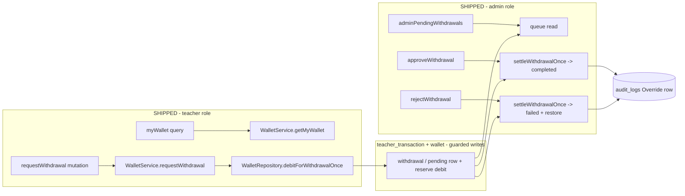

# Design — Teacher Withdrawal Workflow & Admin Approval (Close-the-Loop Verification)

**Plan Directory (verbatim):** `ai/plans/milestone_2_matching_notifications_escrow/teacher_withdrawal_workflow_&_admin_approval-withdrawal_workflow_admin_approval/`
**Requirements:** `specs.md` (same directory) · **Ticket:** `docs/planning/TICKETS.md:1799-1846` · **Milestone:** 2

---

## Document Information

| Field | Value |
|---|---|
| Version | 1.0 |
| Date | 2026-09-17 |
| Status | Design complete — verification-scoped |
| Companion | `specs.md`, `tasks.md`, `deferred-items.md`, `outcome/` |

---

## 1. System Overview & Architecture

### Overview

Code-state verification (2026-09-17) found the full withdrawal lifecycle already shipped across two finished plans: the teacher-side request surface (`myWallet` + `requestWithdrawal`, shipped with the wallet-crediting stream) and the admin-side settlement surface (`approveWithdrawal` + `rejectWithdrawal` + queue + inspector, shipped in `ai/finished_plans/milestone_3_parent_portal_admin_governance/admin-financial-auditing-payments-wallet/` — all 26 tasks `[x]`). This design therefore specifies **how to prove, gap-fill, and ratify**, not how to build: an evidence plan over live code, one new journey leg for the only uncovered AC arm, two doc repairs (plus the knowledge-propagation addendum from task 4.3), and a regression harness whose green output is the deliverable.



### Design Goals

1. Zero new production code (schema, services, resolvers, UI all shipped).
2. Every ticket AC carries a verified `path:line` code citation and a passing-test citation.
3. The single coverage hole (settle-on-`failed` journey arm) is closed with a real journey leg.
4. Divergences (ticket "422", debit-at-approval wording, DBML check) are recorded as binding rulings + one-line doc repairs — never silently absorbed.

### Key Design Decisions

**D1 — Close-the-loop, not reimplementation.**
*Context:* All five ticket ACs verified shipped (specs §Scope reconciliation table).
*Decision:* Prove + gap-fill + repair docs; introduce no runtime code.
*Rationale:* Rebuilding would duplicate race-tested money paths; the sibling fee-escrow plan set this precedent for M2.

**D2 — Reserve-at-request is the binding settlement semantics (ratified, not re-litigated).**
*Context:* Ticket gherkin reads "admin approves → balance is decremented"; shipped model debits at request and settles at decision (`docs/billing/admin-financial-auditing.md:46-48`, INV-W5 `docs/specs/state-machine-invariants.md:195`, previously ratified as D-1 by the admin-financial-auditing plan `plan.md:34-37`).
*Decision:* Ratify shipped semantics; repair the stale sequence-diagram wording (REQ-603); observable-equivalent assertions (post-approve `balance = pre_request − amount`; post-reject `balance = pre_request`) are the acceptance anchors.
*Rationale:* The guarded `balance >= amount` debit predicate is what makes drain races lose by construction.

**D3 — The "422" AC reconciles to the typed transport code.**
*Context:* Ticket says "rejected with 422 'Insufficient wallet balance'"; GraphQL has no per-error HTTP status; the shipped denial is `ConflictError("WALLET_INSUFFICIENT_FUNDS", …)` riding `errors[].extensions.code` (`docs/graphql/domain-error-extensions-code.md:9`; taxonomy `backend/lib/errors/error-code-taxonomy.ts:45-47`); the teacher UI routes on the CODE (`useTeacherWalletWithdraw.ts:86-91`).
*Decision:* REQ-104 records the reconciliation as the binding ruling; no code change.

**D4 — One journey leg is genuinely missing; it ships inside this plan.**
*Context:* Re-settle-on-`completed` is journey-covered (step 6, `admin-financial-auditing.journey.test.ts:806-848`); service-test covers settle-on-`completed` + earning rows (`admin-financial-auditing.service.test.ts:803-838`); NO journey anywhere attempts approve/reject on a `failed` row.
*Decision:* Add a step-8 leg to the existing settlement journey (same file, same cast; committed fixtures per `test/workflows/AGENTS.md`).
*Rationale:* AC5 names "completed or failed"; a ticket-closing plan must close its own coverage hole, not defer it.

**D5 — DBML + workflow-diagram repairs are in-scope doc fixes; the invariants-doc wording is a ledger row.**
*Context:* `db/schema.dbml:372` says `amount >= 0`; Drizzle truth is `teacher_transaction_amount_check (amount > 0)` (`backend/db/schema/billing/teacher-transaction.ts:50`); `docs/workflows/03-session-lifecycle-escrow.md:153` shows debit-at-approval; INV-W8 wording (`>= 0`) is wider-DBML-compatible but looser than the DB truth.
*Decision:* Fix DBML (`> 0`) and the diagram; record the INV-W8 wording row in `deferred-items.md` (target: invariants-doc owner) — the invariants table is cross-ticket shared state, edited only by its owner.

---

## 2. UX / Navigation Specification — Explicit No-New-UI Ruling

This plan ships **zero routes, zero navigation entries, zero components**. The row below is the complete new-route table; the remainder inventories the shipped surface so reviewers can confirm nothing is missing.

### New Routes & URLs

| Route | Purpose | Permission | Roles with Access |
|---|---|---|---|
| — none — | — | — | — |

### Sidebar Navigation Integration

None. Both surfaces already appear in the role-keyed nav map (`frontend/views/dashboard/nav/navItems.ts`): `/wallet` in the Teacher array at `:145` (labelKey `wallet`), `/admin/finances` in the Admin array at `:166` (labelKey `finances`). Rendering via `NAV_ITEMS_BY_ROLE` + `getNavItemsForRole(role)` (`:192-194`). No bottom-nav work (mobile nav layout is out of scope; nothing changes).

### Shipped Surface Inventory (verified 2026-09-17)

| Surface | Kind | Location | Role Access |
|---|---|---|---|
| `myWallet` | GraphQL query | `backend/graphql/query/billing/wallet.query.ts:46-64` | TEACHER (lazy wallet ensure) |
| `requestWithdrawal(amount)` | GraphQL mutation | `backend/graphql/mutation/billing/wallet.mutation.ts:53-78` | TEACHER |
| `adminTeacherWallet(teacherId, …)` | GraphQL query | `backend/graphql/query/admin/admin-finance.query.ts:96-128` | ADMIN |
| `adminPendingWithdrawals(page, pageSize)` | GraphQL query | same file `:131-149` | ADMIN |
| `approveWithdrawal(transactionId)` | GraphQL mutation | `backend/graphql/mutation/admin/admin-finance.mutation.ts:56-79` | ADMIN |
| `rejectWithdrawal(transactionId, reason)` | GraphQL mutation | same file `:82-105` | ADMIN |
| `adjustTeacherWallet(input)` | GraphQL mutation | same file `:108-141` | ADMIN |
| `/wallet` | Page | `app/(dashboard)/wallet/page.tsx` (`withPageAuth({ roles: [UserRole.Teacher] })` :33) | TEACHER |
| `/admin/finances` | Page | `app/(dashboard)/admin/finances/page.tsx` | ADMIN |
| `TeacherWalletContainer` + `WithdrawDialog` | View | `frontend/views/teacher/wallet/` (container `:60`, submit hook `useTeacherWalletWithdraw.ts:56-91`) | TEACHER |
| `AdminFinancesContainer` + approve/reject dialogs | View | `frontend/views/admin/finances/` (`ApproveWithdrawalDialog.tsx`, `RejectWithdrawalDialog.tsx`, `WithdrawalQueuePanel.tsx`, …) | ADMIN |

### Role-Based Access Matrix (shipped, re-verified by REQ-502)

| Role | `myWallet` / `requestWithdrawal` | `approve/reject/adjustWithdrawal` + admin wallet queries |
|---|---|---|
| TEACHER | ✅ own wallet only (ctx-derived identity) | ❌ 403 (wire-proven `admin-finance.integration.test.ts:455-543`) |
| ADMIN | ❌ 403 (teacher-only mutation) | ✅ all six |
| STUDENT / PARENT | ❌ 403 | ❌ 403 |
| anonymous | 401 | 401 (`:381-445`) |

### Per-Audience Rendering (shipped)

| Audience | What they see |
|---|---|
| Teacher | Balance card + ledger + Request-withdrawal dialog; `WALLET_INSUFFICIENT_FUNDS` keeps the dialog open with a snackbar retry (`useTeacherWalletWithdraw.ts:86-91`); pre-approval teachers get the `WALLET_TEACHER_PROFILE_MISSING` empty state (`WalletBody.tsx:49-63`) |
| Admin | Payments audit + withdrawal payout queue + wallet inspector with approve/reject/adjust dialogs (`frontend/views/admin/finances/`) |
| Student / Parent | Nothing — no wallet nav item, no route |

### Permission Mapping (shipped)

| Surface | Required Permission | Enforcement |
|---|---|---|
| Teacher wallet read/write | TEACHER role | Pothos `$all` conjunction (`wallet.query.ts:52-57`, `wallet.mutation.ts:62-67`) + service identity `ctx.user.id` |
| Admin finance operations | ADMIN role | `$all` conjunction (mutation `:62-67,89-94,114-119`; query `:66,105,138`) + `requireAdminUser` narrowing + `assertActorAdminActive` governance gate |

### Translation System Requirements (compliance statement — no new strings)

All wallet strings ship: `Wallet` handle (`shared/locale/namespaces/wallet/wallet.namespace.ts:4`), en labels `shared/locale/en/wallet/labels.ts:7-32` + ar mirror `:7-31`; error keys `insufficientBalance` (`shared/locale/en/errors/index.ts:90` / ar `:88`), `walletInvalidAmount` (`:93`/`:91`), `withdrawalRequestNotFound` (`:113`/`:111`), `withdrawalNotPending` (`:114`/`:112`), `walletTeacherProfileMissing` (`:94`/`:92`). The gap-fill journey test consumes them via `getServerTranslations("en").errorsTranslations` (service-layer pattern, REQ-005); no `Translation.` string literals, no two-arg `getTranslations`, no `next-intl`.

---

## 3. Data Models & Database Schema (shipped — verification targets)

### `wallet` — `backend/db/schema/billing/wallet.ts:20-40`

| Column | Type | Constraints |
|---|---|---|
| `id` | integer PK `generatedAlwaysAsIdentity` | :23 |
| `teacherId` | integer NOT NULL → `teacher.id` CASCADE | :24-26, unique `wallet_teacher_id_unique` :36 |
| `balance` | `decimal(10,2)` NOT NULL default "0" | `wallet_balance_check >= 0` :37 |
| `totalEarning` | `decimal(10,2)` NOT NULL default "0" | `wallet_total_earning_check >= 0` :38 |
| `createdAt` / `updatedAt` | timestamp NOT NULL | :29-33, `$onUpdate` |

Types: `WalletSelectType` (`backend/types/billing/wallet.types.ts:4`), `WalletViewType` (:13-16). No `WalletInsertType`/`WalletReturnType` (four-shape completion is ledger row D4 — fee-escrow plan specs D2).

### `teacher_transaction` — `backend/db/schema/billing/teacher-transaction.ts:31-54`

| Column | Type | Constraints |
|---|---|---|
| `id` | integer PK identity | :34 |
| `walletId` | integer NOT NULL → `wallet.id` RESTRICT | :35-37 |
| `sessionId` | integer nullable → `session.id` SET NULL | :38 |
| `description` | `varchar(255)` nullable | :39 |
| `amount` | `decimal(10,2)` NOT NULL | `teacher_transaction_amount_check (amount > 0)` :50 |
| `type` | `transactionType` pgEnum NOT NULL | :41 (`enums.ts:52`: earning/withdrawal/bonus/arbitration_reversal) |
| `status` | `transactionStatus` pgEnum NOT NULL default "pending" | :42 (`enums.ts:54`: pending/completed/failed) |
| `createdAt` / `updatedAt` | timestamp NOT NULL | :43-47 |

Indexes: `teacher_transaction_wallet_id_idx` :51, `teacher_transaction_session_id_idx` :52. Immutability: append-only triggers + settlement-only exception (`:17-27` comment; migrations `3-immutability-triggers.sql`, `5-teacher-transaction-settlement.sql`).

DBML drift to repair (REQ-602): `db/schema.dbml:372` says `amount >= 0`; authoritative truth is `> 0`.

### Canonical Types & Enums (consumed verbatim — no new types)

| Artifact | Location |
|---|---|
| `WalletSelectType` / `WalletViewType` | `backend/types/billing/wallet.types.ts:4,13-16` |
| `TeacherTransactionSelectType` | `backend/types/billing/teacher-transaction.types.ts:3` |
| `TransactionStatus` (Pending/Completed/Failed) | `backend/enum/billing/transaction-status.enum.ts:5-8` |
| `TransactionType` (Earning/Withdrawal/Bonus/ArbitrationReversal) | `backend/enum/billing/transaction-type.enum.ts:6-11` |
| `WalletAdjustmentDirection` (Credit/Debit) | `backend/enum/billing/wallet-adjustment-direction.enum.ts:7-9` |
| `UserRole` (Admin/Teacher/Student/Parent) | `backend/enum/users/user-role.enum.ts:5-9` |
| Admin finance types (`AdminWithdrawalQueuePageReturnType` etc.) | `backend/types/billing/admin-finance.types.ts` |
| Escrow/wallet contract (`WalletCreditContract`) | `backend/types/contracts/session-completion-escrow.contract.types.ts:46-56` |

---

## 4. Backend Services, Repositories & Concurrency Model (shipped — verification targets)

### Service Signatures (exact, verified)

```ts
// backend/services/billing/wallet.service.ts:168-172 (namespace WalletService, :66)
export async function getMyWallet(
  callerUserId: number, locale: string, outerTx?: DBTransaction
): Promise<WalletViewType>

// backend/services/billing/wallet.service.ts:213-218
export async function requestWithdrawal(
  callerUserId: number, rawAmount: string, locale: string, outerTx?: DBTransaction
): Promise<WalletViewType>

// backend/services/billing/admin-financial-auditing.service.ts:185-192 (namespace AdminFinancialAuditingService)
export async function approveWithdrawal(
  actorUserId: number, transactionId: number, locale: string, outerTx?: DBTransaction
): Promise<TeacherTransactionSelectType>

// backend/services/billing/admin-financial-auditing.service.ts:268-276
export async function rejectWithdrawal(
  actorUserId: number, transactionId: number, reason: string, locale: string, outerTx?: DBTransaction
): Promise<TeacherTransactionSelectType>

// backend/services/billing/admin-financial-auditing.service.ts:360+ — adjustTeacherWallet (adjacent, NOT this ticket's AC)
// backend/services/billing/admin-financial-auditing.service.ts:106/131/155 — listStudentPaymentsForAdmin / getTeacherWalletForAdmin / listPendingWithdrawalsForAdmin
```

Locale threading: plain `locale: string`, resolved once via `getServerTranslations(locale).errorsTranslations` (`wallet.service.ts:219`, `admin-financial-auditing.service.ts:191`). Amount carried as decimal string verbatim (never parsed) — grammar `/^\d{1,7}(\.\d{1,2})?$/` (`wallet.service.ts:61`). Logging: `logger.logDomainError(message, { code, entity, entityId })` only.

### Repository Signatures (exact, verified — `WalletRepository` namespace)

```ts
// backend/db/repo/billing/wallet.repository.ts
ensureWalletOnce(teacherId: number, tx?: DBTransaction): Promise<WalletSelectType>                                    // :59
creditEarningOnce(insert: {walletId; sessionId; amount; description}, tx?): Promise<TeacherTransactionSelectType>     // :78
findByTeacherId(teacherId: number, tx?): Promise<WalletSelectType | null>                                            // :119
findById(walletId: number, tx?): Promise<WalletSelectType | null>                                                    // :131
listTransactionsByWalletId(walletId: number, tx?): Promise<TeacherTransactionSelectType[]>                          // :142
debitForWithdrawalOnce(insert: {walletId; amount; description}, tx?): Promise<TeacherTransactionSelectType | null>    // :163
debitForArbitrationOnce(insert: {walletId; sessionId; amount; description}, tx?): Promise<TeacherTransactionSelectType | null> // :220
listRecentTransactions(walletId: number, limit: number, tx?): Promise<TeacherTransactionSelectType[]>                 // :259
listTransactionsForAdmin(walletId, filters, limit, offset, tx?)                                                       // :280
countTransactionsForAdmin(walletId, filters, tx?): Promise<number>                                                    // :296
findAdminWalletProbe(teacherId, tx?)                                                                                   // :312
listPendingWithdrawals(limit, offset, tx?)                                                                             // :327
countPendingWithdrawals(tx?): Promise<number>                                                                          // :341
findSettlementProbe(transactionId: number, tx?)                                                                        // :353
settleWithdrawalOnce(insert: {transactionId; nextStatus: TransactionStatus}, tx?): Promise<TeacherTransactionSelectType | null> // :370
restoreWithdrawalDebitOnce(insert: {walletId; amount}, tx?): Promise<void>                                            // :384
creditBonusOnce(insert, tx?): Promise<TeacherTransactionSelectType>                                                    // :402
debitAdjustmentOnce(insert, tx?): Promise<TeacherTransactionSelectType | null>                                        // :421

// backend/db/repo/billing/wallet.repository.shared-writer.ts:60
debitWithLedgerRow(insert: {walletId; amount; description}, ledgerStatus: TransactionStatus, methodLabel: string, tx?): Promise<TeacherTransactionSelectType | null>
```

Settlement implementation (admin.helpers.ts): `settleWithdrawalOnce` :302-322 (guarded `UPDATE … WHERE id AND type='withdrawal' AND status='pending' … RETURNING`; non-permitted `nextStatus` → `null` :306), `restoreWithdrawalDebitOnce` :331-340 (additive `balance + amount`).

### Concurrency & Race Condition Assessment (verified — re-proven, not redesigned)

**Concurrency model:** guarded single-UPDATE predicates everywhere; **no SELECT FOR UPDATE anywhere in `backend/db/repo/billing/`** (verified by sweep). Probe reads (`findSettlementProbe`) are for human-readable error disambiguation ONLY — the write decision is always the guarded UPDATE re-asserting the state predicate.

| Scenario | Actors | Risk | Mitigation (shipped) | Proof |
|---|---|---|---|---|
| Concurrent double settle | 2 admins approve same row | double payout audit / double-settle | guarded settle `status='pending'` predicate; loser → `null` → `WITHDRAWAL_NOT_PENDING` | journey step 6 `:806-848`; service race `admin-financial-auditing.service.test.ts:899-925`; repo re-settle-miss proofs `wallet.repository.admin.test.ts:437-475` |
| Settle ∥ new request on same wallet | admin + teacher | lost update on balance | debit predicate `balance >= amount`; additive restore | journey step 7 `:849-915` (exact arithmetic `start − A − B`) |
| Withdrawal drain race | 2 requests > balance/2 | overdraw | guarded debit `balance >= amount` + `wallet_balance_check` backstop | journey finsec step D `:565-593`; repo funds-guard races (arbitration ∥ withdrawal) `wallet.repository.test.ts:819-857` |
| Ledger tamper | any writer | mutation of decided rows | append-only triggers + settlement-only exception; repo exposes NO update/delete primitive (namespace-closure test `:419-442`) | `financial-immutability.test.ts:364-457`; journey finsec step F `:714-752` |

**TOCTOU windows:** none open — every money write is a single-statement guarded UPDATE; validation is pre-DB (amount grammar, reason normalization) so malformed input never reaches SQL.

### Cross-Actor Journey Design (REQ-601 gap-fill target)

**Shared-Entity State Machine** (withdrawal ledger row):

| Current State | Trigger (actor + action) | Next State | Guard / Permission |
|---|---|---|---|
| (none) | Teacher `requestWithdrawal` | `pending` (+ balance reserve) | TEACHER role, `balance >= amount` |
| `pending` | Admin `approveWithdrawal` | `completed` | ADMIN role + active governance, settlement-only trigger |
| `pending` | Admin `rejectWithdrawal(reason)` | `failed` (+ balance restore) | ADMIN role + active governance |
| `completed` / `failed` | any settle re-attempt | unchanged | guarded predicate misses → `WITHDRAWAL_NOT_PENDING` |

**Side-Effect Matrix:**

| Transition | Rows Created/Updated | Notifications | Audit | Idempotency |
|---|---|---|---|---|
| request → pending | 1 ledger row INSERT + 1 wallet UPDATE (reserve) | none (no withdrawal NotificationType) | none | request-level keying = forward item F11 |
| pending → completed | 1 guarded UPDATE (status/updatedAt) | none | 1 `Override` row `{action:"withdrawal_approved", amount, walletId, teacherId}` | guarded-predicate exactly-once |
| pending → failed | 1 guarded UPDATE + 1 wallet UPDATE (restore) | none | 1 `Override` row `{action:"withdrawal_rejected", …, reasonPresent:true}` | guarded-predicate exactly-once |

**Cross-Actor Visibility:**

| State | Teacher sees | Admin sees | Student/Parent sees |
|---|---|---|---|
| pending | own row in `myWallet.transactions` + reduced balance | row on `adminPendingWithdrawals` queue | nothing |
| completed | settled row, net-reserved balance | queue drained; row via `adminTeacherWallet` | nothing |
| failed | failed row, restored balance | queue drained; row via `adminTeacherWallet` | nothing |

---

## 5. API Contracts & SDL (shipped — verification targets)

### Teacher Root Fields (SDL, pinned by `backend/graphql/test/schema-surface.test.ts:250-252,251` and `sdl-static-assertions.test.ts:228`)

```graphql
myWallet: Wallet!                                    # zero args; identity = ctx.user.id
requestWithdrawal(input: RequestWithdrawalInput!): Wallet!
```

`RequestWithdrawalInput` (`backend/graphql/mutation/billing/wallet.mutation.ts:46-50`): exactly one field `amount: String!` (decimal string) — BOLA-proof by construction (no wallet id on the wire). Returns the UPDATED `Wallet!` (post-debit balance + refreshed 50-row ledger) so Apollo normalizes without refetch.

### Admin Root Fields (SDL)

```graphql
adminStudentPayments(filters: AdminStudentPaymentsFilterInput, page: Int, pageSize: Int): AdminStudentPaymentPage!
adminTeacherWallet(teacherId: ID!, filters: AdminWalletTransactionFilterInput, page: Int, pageSize: Int): AdminTeacherWallet!
adminPendingWithdrawals(page: Int, pageSize: Int): AdminWithdrawalQueuePage!
approveWithdrawal(transactionId: ID!): TeacherTransaction!
rejectWithdrawal(transactionId: ID!, reason: String!): TeacherTransaction!
adjustTeacherWallet(input: AdjustTeacherWalletInput!): TeacherTransaction!
```

Wire ids are coerced via `coerceDecimalSessionId` + `requirePositiveIntId` (e.g. `admin-finance.mutation.ts:72-76`). All three mutations return the shared canonical `TeacherTransaction` object (`backend/graphql/pothos/billing/wallet.pothos.ts:93-121` — single canonical object rule).

### Object Types

`TeacherTransaction` (`wallet.pothos.ts:93-121`): `id`, `walletId`, `sessionId?`, `amount` (string), `description?`, `type` (enum via fail-closed exhaustive switch `:49-62`), `status` (enum `:70-81`), `createdAt`, `updatedAt`. `Wallet` (`:128-154`): `id`, `balance`, `totalEarning`, `currency` (constant `"EGP"` :139), `createdAt`, `updatedAt`, `transactions` (service-capped at 50).

### Permission Matrix (SDL-level authScopes — the `$all` conjunction discipline)

| Field | authScopes | Effect |
|---|---|---|
| `myWallet` / `requestWithdrawal` | `{ $all: { authenticated: true, role: [UserRole.Teacher] } }` (`wallet.query.ts:52-57`, `wallet.mutation.ts:62-67`) | anonymous → `UNAUTHORIZED`; authenticated non-teacher → `FORBIDDEN` |
| six admin finance operations | `{ $all: { authenticated: true, role: [UserRole.Admin] } }` (`admin-finance.mutation.ts:62-67,89-94,114-119`; `admin-finance.query.ts:66,105,138`) | anonymous → `UNAUTHORIZED`; non-admin → `FORBIDDEN` (all 4 non-admin roles wire-proven) |

The `$all` key is mandatory: Pothos scope-auth combines a plain scope map with ANY semantics — a bare `{ authenticated, role }` map would admit any authenticated caller (documented at `wallet.query.ts:17-28`). Service layers re-assert (`assertActorAdminActive`; identity from `ctx.user.id`) as defense in depth.

### Error Contract (verification targets)

| Condition | Class / Code | Translations (en/ar) |
|---|---|---|
| Malformed / non-positive amount | `ValidationError("WALLET_INVALID_AMOUNT")` (`wallet.service.ts:83`) | `walletInvalidAmount` en `:93` / ar `:91` |
| Amount > balance | `ConflictError("WALLET_INSUFFICIENT_FUNDS")` (`wallet.service.ts:252`) | `insufficientBalance` en `:90` / ar `:88` |
| Pre-approval teacher (no profile row) | `DomainError("WALLET_TEACHER_PROFILE_MISSING")` (`wallet.service.ts:145`) | en `:94` / ar `:92` |
| Unknown transaction id (settle) | `NotFoundError("WITHDRAWAL_REQUEST")` (`admin-financial-auditing.service.ts:205`) | `withdrawalRequestNotFound` en `:113` / ar `:111` |
| Decided / non-withdrawal row (settle) | `ConflictError("WITHDRAWAL_NOT_PENDING")` (`:213`) | `withdrawalNotPending` en `:114` / ar `:112` |

All codes ride `errors[].extensions.code` (`docs/graphql/domain-error-extensions-code.md:9,112`); the "422" reconciliation is ruling D3/REQ-104.

---

## 6. Security, Authorization & Tenancy Mitigations (all shipped — re-verification targets)

| Threat | Mitigation (verified location) | Test proof |
|---|---|---|
| BOLA — teacher reads/withdraws another's wallet | Identity is ctx-derived; `myWallet` takes zero args; `requestWithdrawal` input is amount-only | `wallet.query.ts:46-64`; `wallet.mutation.ts:46-50,75`; wire suite request leg `admin-finance.integration.test.ts:638-647` |
| BFLA — low-privilege caller hits admin mutations | `$all` role conjunction at SDL + `requireAdminUser` narrowing + service governance gate | wire suite Tier 1/2 `:381-543`; journey step 5 `:719-805` |
| BOPLA — input spread into writes | Inputs copied field-by-field (closed whitelists); repo takes explicit `insert` objects, never `...input` | `admin-finance.mutation.ts:126-138`; repo signatures §4 |
| Overdraw / double-settle / lost-update | Guarded single-UPDATE predicates; no SELECT FOR UPDATE needed; CHECK backstops | Concurrency table §4 |
| Ledger tamper (decided rows) | Append-only triggers + settlement-only exception; no repo update/delete primitives | `financial-immutability.test.ts:364-457`; namespace closure `wallet.repository.test.ts:419-442` |
| LIKE/wildcard injection | No free-text search on the withdrawal surface; description/reason are bound parameters; reason normalized pre-DB | `normalizeAdjustmentReason` `admin-financial-auditing.service.ts:278` |
| Reason text leakage into audit trail | Only `reasonPresent: true` recorded — raw text never persisted | `docs/billing/admin-financial-auditing.md:158` |

---

## 7. Verification Plan Design (the actual work)

### 7.1 Evidence Files

Each verification task writes `outcome/<task-id>-outcome.md` containing: the REQ list it proves, a table `AC → code path:line → test file:test-line → green-run result`, and deviations. `outcome/verification-matrix.md` consolidates REQ-101..803 into the final traceability matrix (REQ-604).

### 7.2 Journey Gap-Fill Design (REQ-601)

Extend `test/workflows/billing/admin-financial-auditing.journey.test.ts` with a step-8 leg inside the existing describe (same cast: `provisionAdminActor` + `provisionCertifiedTeacherActor`; same `TrackedFixtures` registry + `withImmutabilityTriggersSuspended` teardown; same `publishReceipts` spy):

1. Teacher (teacherB, funded 300.00) requests a withdrawal → pending row reserved.
2. Admin rejects it → row `failed`, balance restored to 300.00 (re-uses step-2 helpers).
3. Admin re-attempts `approveWithdrawal` on the failed row → `ConflictError` + `WITHDRAWAL_NOT_PENDING` (via the file's `expectJourneyError`/denial helper pattern, translated substring from `getServerTranslations("en").errorsTranslations.withdrawalNotPending`); assert zero audit rows for the actor delta; assert balance still 300.00.
4. Admin re-attempts `rejectWithdrawal` on the same failed row → same denial; zero audit rows; balance unchanged.
5. `expectNoDispatches()` — no notification side effects.

Run via `bun run test/scripts/run-test.ts test/workflows/billing/admin-financial-auditing.journey.test.ts` until green, then the full `test/workflows/billing/` directory (`test/workflows/AGENTS.md:90-97`).

### 7.3 Doc Repairs (REQ-602/603)

- `db/schema.dbml:372`: `check: \`amount >= 0\`` → `check: \`amount > 0\`` (aligns DBML with `teacher_transaction_amount_check`; no migration involved — DBML is documentation; the DB CHECK already says `> 0`).
- `docs/workflows/03-session-lifecycle-escrow.md` §6.3: replace the approve-branch "Deduct from wallet.balance" semantics with the reserve-at-request wording (debit at request `:147-148`; approve = settle reservation; reject = restore), keep the audit-trail step and the mermaid structure.

### 7.4 Test Re-Run Matrix (REQ-605)

| Suite | Layer rules | Runner |
|---|---|---|
| `backend/services/billing/wallet.service.test.ts` | `runInRollback` + tx | `bun run test/scripts/run-test.ts <path>` |
| `backend/services/billing/admin-financial-auditing.service.test.ts` | `runInRollback` + tx | same |
| `backend/db/test/repo/billing/wallet.repository.test.ts` | `runInRollback` + tx; `Promise.allSettled` races | same |
| `backend/db/test/repo/billing/wallet.repository.admin.test.ts` | `runInRollback` + tx; trigger-freeze proofs | same |
| `backend/db/test/logic/billing/financial-immutability.test.ts` | trigger probes + tamper attempts | same |
| `test/workflows/billing/admin-financial-auditing.journey.test.ts` | journey rules (committed fixtures, no rollback) | same |
| `test/workflows/billing/financial-safety-verification.journey.test.ts` | journey rules | same |
| `frontend/graphql/test/admin/admin-finance.integration.test.ts` | `describeGraphqlSuite` + `setupTestServerLifecycle` + `testClient` | `bun run test:graphql` harness (or run-test wrapper) |

### 7.5 Quality Gates for Authored Files

- Journey test file: `bun run scripts/health/sub-loop.ts test/workflows/billing/admin-financial-auditing.journey.test.ts --lifecycle duplicates` (exit 0) — the script auto-discovers `test/workflows/AGENTS.md` + `tests.instructions.md`.
- `db/schema.dbml` and the workflow doc: not TypeScript — verified by inspection + repo docs linters where applicable; run `bun run db`-adjacent DBML validation only if the repo's pipeline gates it (the CI DBML/mermaid validation lives in `ai/finished_plans/milestone_0_foundation/cicd-pipeline-with-dbml-mermaid-validati/`); the mermaid block in §6.3 stays syntactically valid.

---

## 8. Verification Anchors (consumed by tasks.md and `outcome/`)

| # | Anchor | Citation |
|---|---|---|
| A1 | Teacher request surface | `backend/services/billing/wallet.service.ts:213-257` + `backend/db/repo/billing/wallet.repository.ts:163-172` + `wallet.repository.shared-writer.ts:60-91` |
| A2 | Admin settle surface | `backend/services/billing/admin-financial-auditing.service.ts:185-334` + `wallet.repository.admin.helpers.ts:302-340` |
| A3 | Immutability substrate | `backend/db/schema/billing/teacher-transaction.ts:17-27,50` + migrations `3-immutability-triggers.sql` / `5-teacher-transaction-settlement.sql` |
| A4 | Wire surface + gates | `backend/graphql/mutation/billing/wallet.mutation.ts:46-78` · `backend/graphql/query/billing/wallet.query.ts:46-64` · `backend/graphql/mutation/admin/admin-finance.mutation.ts:56-141` · `backend/graphql/query/admin/admin-finance.query.ts:58-149` |
| A5 | Settlement model canonical doc | `docs/billing/admin-financial-auditing.md` §2 `:46` · §3 `:71` · §5 `:148-158` |
| A6 | Invariants | `docs/specs/state-machine-invariants.md` INV-W1..W8 `:191-198` |
| A7 | Journey harness rules | `test/workflows/AGENTS.md:8-97` |
| A8 | Error taxonomy / wire codes | `backend/lib/errors/error-code-taxonomy.ts:45-47` · `docs/graphql/domain-error-extensions-code.md` |
| A9 | Client error routing | `frontend/views/teacher/wallet/useTeacherWalletWithdraw.ts:86-91` |
| A10 | Prior ratifications (reserve-at-request) | `ai/finished_plans/milestone_3_parent_portal_admin_governance/admin-financial-auditing-payments-wallet/plan.md:34-37` · `ai/finished_plans/milestone_2_matching_notifications_escrow/fee_escrow_and_teacher_wallet_crediting-crediting/specs.md:48` |

---

## 9. Deferred-Items Ledger Pointers (initial content for `deferred-items.md`)

| ID | Item | Kind | Target owner |
|---|---|---|---|
| D1 | Withdrawal request/decision notifications (no `NotificationType` members exist; engine + pgEnum change) | Resolved pointer | Future notifications ticket (engine table `docs/notifications/realtime-engine.md` §3.2) |
| D2 | Request-level idempotency keying (F11, `wallet.service.ts:199`) | Resolved pointer | Financial hardening backlog |
| D3 | Full teacher-ledger pagination (F10, `wallet.service.ts:49`) | Resolved pointer | Wallet UX backlog |
| D4 | `WalletInsertType`/`WalletReturnType` four-shape completion (fee-escrow plan specs D2) | Resolved pointer | First ticket needing wallet write shapes |
| D5 | Runtime adoption of escrow idempotency-key contract types (inherited fee-escrow D1, `plan.md:42-45`) | Resolved pointer | Financial Safety Verification follow-ups |
| D6 | INV-W8 doc wording (`>= 0` vs DB truth `> 0`) | Resolved pointer | `docs/specs/state-machine-invariants.md` owner |
| D7 | HTTP-status surfacing of `WALLET_INSUFFICIENT_FUNDS` beyond GraphQL (if a REST payout surface ever ships) | Resolved pointer | API-gateway surface owner |

All rows land as 🔄 Open forward-contracts/rulings with named owners (or ✅ where completed in-plan) at the final gate — never open ❌/⚠️ debt.

---

## 10. Outcome & Knowledge Transfer Protocol

- **BEFORE any task:** read ALL files in `ai/plans/milestone_2_matching_notifications_escrow/teacher_withdrawal_workflow_&_admin_approval-withdrawal_workflow_admin_approval/outcome/`.
- **AFTER each task:** write `outcome/<task-id>-outcome.md` with the evidence tables, run logs, deviations, and carry-overs.
- **Progress:** update `[ ]` → `[x]` in `tasks.md` per completed subtask.
- **Knowledge propagation:** the settlement reference doc already exists (`docs/billing/admin-financial-auditing.md`); the plan's final task appends the journey-gap-fill + reconciliation learnings to `outcome/` and, if material, a short addendum to `docs/billing/escrow-and-wallet-crediting.md` cross-referencing this verification — NOT to AGENTS.md/instruction files (hand-curated only).

---

## Design Review Checklist (self-assessment)

- [x] All design components are VERIFICATION targets with exact signatures (§4)
- [x] Data models complete with line-verified column tables (§3)
- [x] API contracts + SDL + permission matrix (§5)
- [x] Concurrency assessment + journey design (§4) — including the new gap-fill leg
- [x] UX/Nav spec with explicit no-new-UI ruling + shipped inventory (§2)
- [x] Security/tenancy mitigations table (§6)
- [x] Requirements alignment: every REQ-001..803 maps to a section (traceability enforced in tasks.md)
