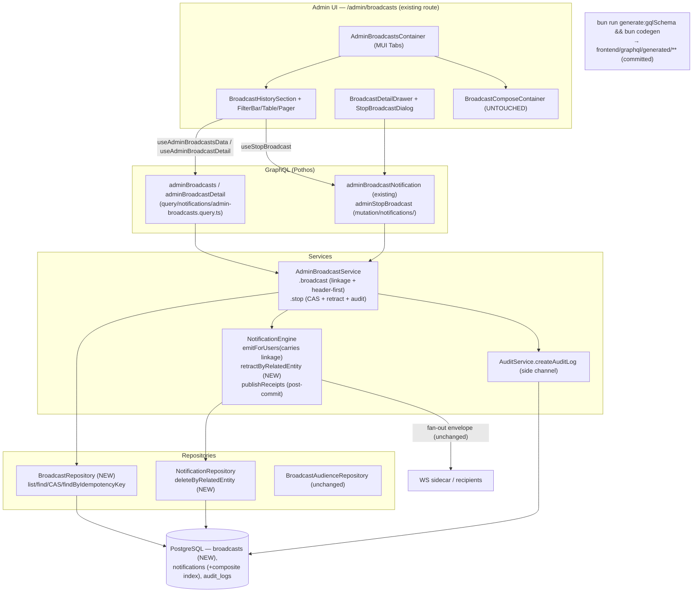
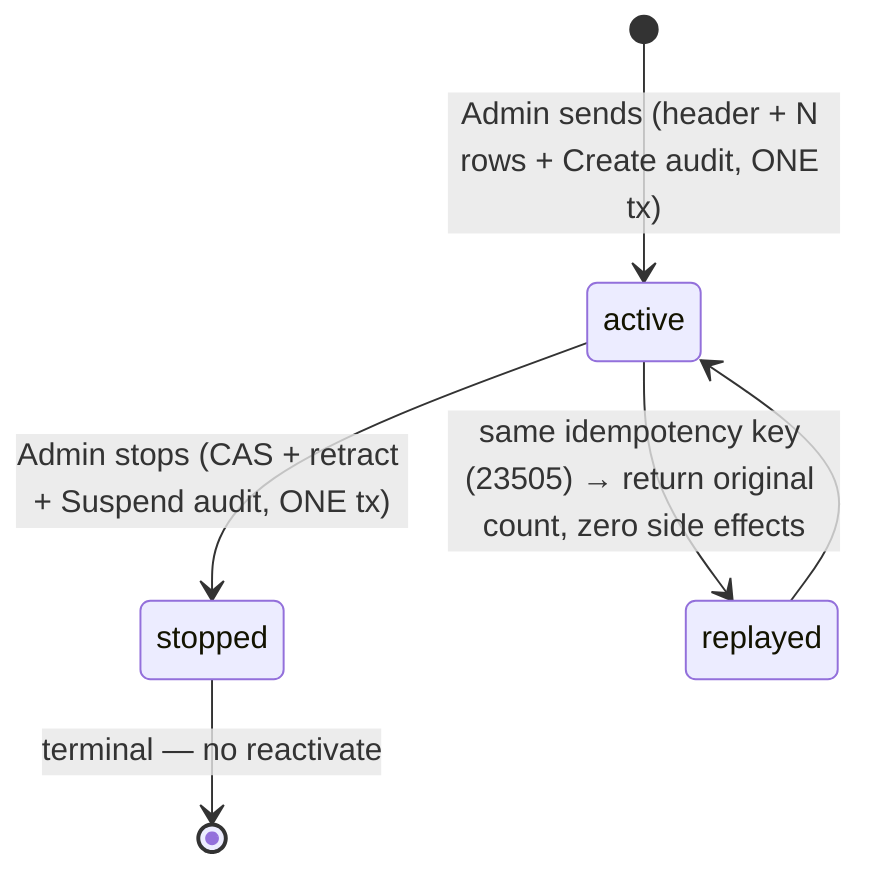

# Technical Architecture & Implementation Design: Admin Broadcasts — History, Detail & Stop Lifecycle

> **Plan of record:** `ai/plans/admin-broadcasts-history-lifecycle/`
> **Ticket:** GitHub issue #146 — "Admin broadcasts CRUD, UI/UX" (https://github.com/kottaby/kottaby/issues/146)
> **Author:** Ahmed Hosny, 2026-09-18
> **Verified fact base:** `ai/plans/admin-broadcasts-history-lifecycle/outcome/research-01..04` (exact file:line citations; corrected paths authoritative)
> **Canonical refs:** `docs/notifications/broadcast-notifications.md` (§1, §9, §10), `docs/notifications/realtime-engine.md` (§3.2 emitter contract, §3.6 idempotency posture)
> **Deferred ledger:** `ai/plans/admin-broadcasts-history-lifecycle/deferred-items.md` (D1–D8)

**Scope in one paragraph:** today a broadcast send is recorded only as N `notifications` rows (type `system_broadcast`) plus ONE metadata-only audit row — the send itself has no first-class entity, so admins have no history, no detail view, and no way to stop a live broadcast. This plan (a) makes every send **C**reate a first-class `broadcasts` header row inside the existing send transaction (zero regression to the send path), (b) adds admin **R**ead surfaces — paginated history list + detail view with live delivered/read stats on the existing `/admin/broadcasts` page (History tab + Compose tab), and (c) adds exactly one **U**pdate: a one-way `active → stopped` lifecycle transition that retracts (bulk-deletes) the broadcast's notification rows through the notification engine. There is no **D**elete: no hard-delete, no content editing, no scheduling, no live WS retraction push (locked out-of-scope list, deferred-items D1–D6). The existing `/admin/broadcasts` route is the ONLY route touched.

---

## 1. Overview & Design Goals

The feature composes on the shipped broadcast send substrate (`AdminBroadcastService.broadcast` → `NotificationEngine.emitForUsers` → `publishReceipts`). The send path is one transaction: cohort resolution → engine batch insert (SAVEPOINT inside the caller tx) → audit row → post-commit publish. What does not exist anywhere: a `broadcasts` header table, admin history/detail queries, a stop mutation, engine-mediated retraction, and the history UI. This plan adds exactly that gap and nothing else — the engine's write path, the recipient inbox read surface, the claim cache, and the 12 compose-only frontend files are untouched except for the documented linkage additions (D2, D4).

### Design Goals

- **First-class record:** every send — historical and future — is addressable as one `broadcasts` row carrying copy, audience snapshot, sender, count, and lifecycle state.
- **Complete observability:** admin sees the full send history (filterable, paginated) and per-broadcast detail with live delivered/read/unread aggregates derived from the still-present notification rows.
- **Safe one-way stop:** `active → stopped` is a single CAS-guarded, engine-mediated, audited, all-or-nothing transaction; stopped broadcasts never resurrect; recipients' feeds self-correct (rows disappear, unread counts drop) with zero client changes.
- **Zero regression to the send path:** the send flow's ordering, idempotency, cap, and audit discipline are preserved; only additive linkage (header row, `relatedEntityType`/`relatedEntityId`, audit `entityId`) is introduced.
- **Admin-only:** every new operation is behind the existing double wall (Pothos `adminOnlyAuthScopes` + service `assertActorAdmin`); non-admins and anonymous users see nothing.

---

## 2. Key Design Decisions

Full Decision format (Context / Options Considered / Decision / Rationale) for D1, D3, D4, D5; compact format for the rest.

### D1 — First-class `broadcasts` header table (new `backend/db/schema/notifications/broadcasts.ts`)

**Context:** Admins need per-send history, detail, and a lifecycle handle, but a send today is only N anonymous `notifications` rows + one metadata-only audit row (`backend/services/notifications/admin-broadcast.service.ts:79` — `AUDIT_ENTITY_TYPE`; the audit `details` JSON is deliberately `{scope, role?/country?/planId?, recipientCount}` with NO copy text, per prior-plan REQ-021). There is nothing to list, link to, or transition.

**Options Considered:**
- **(a) Derive history from `audit_logs` alone.** Rejected: audit details are metadata-only by design — no copy text, and the rows that would carry copy (`notifications`) are unlinked to the audit row and per-recipient (one send → N rows, no group key). Deriving would require fragile join heuristics on the read path forever.
- **(b) First-class `broadcasts` header table**, written inside the send transaction, one row per accepted send; notification rows get a polymorphic pointer back to it. Chosen.

**Decision:** New table `backend/db/schema/notifications/broadcasts.ts`, Drizzle column-builder style mirroring `notifications.ts`:

```typescript
export const broadcasts = pgTable(
  "broadcasts",
  {
    id: integer("id").primaryKey().generatedAlwaysAsIdentity(),
    title: varchar("title", { length: 255 }).notNull(),
    body: text("body").notNull(),
    audienceType: broadcastAudienceType("audience_type"),   // pgEnum, NULLABLE (backfill tolerance)
    audienceRole: userRole("audience_role"),                // pgEnum, nullable
    audienceCountry: varchar("audience_country", { length: 100 }),
    audiencePlanId: integer("audience_plan_id"),            // NO FK — audience snapshot semantics
    status: broadcastStatus("status").notNull().default("active"),
    recipientCount: integer("recipient_count").notNull(),
    sentById: integer("sent_by_id").notNull()
      .references(() => users.id, { onDelete: "restrict" }),
    sentAt: timestamp("sent_at").defaultNow().notNull(),
    stoppedById: integer("stopped_by_id").references(() => users.id, { onDelete: "restrict" }),
    stoppedAt: timestamp("stopped_at"),
    idempotencyKey: varchar("idempotency_key"),            // nullable, UNIQUE
  },
  t => [
    uniqueIndex("broadcasts_idempotency_key_uidx").on(t.idempotencyKey),
    index("broadcasts_sent_at_idx").on(t.sentAt),
    index("broadcasts_status_idx").on(t.status),
  ]
);
```

- `audiencePlanId` deliberately has **no FK**: it is an *audience snapshot* — the plan may be deleted later without invalidating history (the same reason `notifications.relatedEntityId` is a bare int).
- `idempotencyKey` is nullable **UNIQUE**; the unique-violation (PG 23505) mapped through `translateDbError` (`backend/lib/errors.ts:201` — traverses Drizzle `DrizzleQueryError` cause chains) to `ConflictError` IS the replay arbiter. **NEVER a pre-check SELECT** — a pre-check reintroduces a TOCTOU window the unique index exists to close (§8).
- Schema is applied via `bun run db push` (schema objects only — no data); the historical backfill is a separate custom-SQL migration (D5).

**Rationale:** One row per send is the minimal entity that makes history, detail, stats, and a lifecycle handle first-class; storing copy in the header keeps the audit-details metadata-only rule intact; nullable `audienceType` tolerates historical sends whose audit trail is missing or ambiguous instead of blocking the backfill.

### D2 — Linkage via the existing polymorphic pair (no junction table)

The send path now sets `relatedEntityType: "broadcast"` (new exported constant `BROADCAST_RELATED_ENTITY_TYPE` beside the existing `AUDIT_ENTITY_TYPE` in `admin-broadcast.service.ts`) and `relatedEntityId = broadcasts.id` on every emitted row, reusing the existing `notifications.related_entity_type` varchar(100) + `related_entity_id` int pair (`backend/db/schema/notifications/notifications.ts:38-39`). Add ONE composite index `notifications (related_entity_type, related_entity_id)`. **Rejected:** a `broadcast_recipients` junction table — it duplicates the polymorphic pair, doubles the send transaction's write volume, and would still need the same index. Route resolution is unaffected: `"broadcast"` matches no existing map in `frontend/lib/notification-route-resolution.ts`, so recipients fall through to the `/notifications` feed exactly as today.

### D3 — Stop = retraction, CAS-guarded and engine-mediated (full format)

**Context:** A stop must make stopped content disappear from recipient feeds and self-correct unread counts — a status flip alone would leave the content readable. But `notifications` has a single-writer invariant: `NotificationEngine` is the only writer (canonical doc §9, `docs/notifications/broadcast-notifications.md:76`); a stop that deleted rows via a repository bypass would violate it. Concurrent stops of the same broadcast must have exactly one winner. The lifecycle must be one-way — no reactivate.

**Options Considered:**
- **(a) Soft-hide column** (e.g. `is_retracted` on `notifications`, filtered at read time). Rejected: breaks the unread-count self-correction (unread badges would need a second predicate everywhere), leaves orphan rows forever, and touches every inbox read path.
- **(b) Read-time join on `broadcasts.status`.** Rejected: recipients' inbox queries would join a polymorphic entity; stopped content would still be present at rest and the join leaks admin-surface concepts into the recipient surface.
- **(c) Status-only transition without retraction.** Rejected: doesn't meet the requirement — recipients would still see stopped content.
- **(d) CAS status transition + engine-mediated bulk delete + one audit row, all in ONE transaction.** Chosen.

**Decision:** `AdminBroadcastService.stop(broadcastId, actorId, locale, outerTx?)`:

1. `assertActorAdmin` (pre-transaction, zero writes on denial — `backend/services/admin/admin-gate.helpers.ts:114`).
2. In ONE transaction:
   - **CAS:** `UPDATE broadcasts SET status='stopped', stopped_by_id=$actor, stopped_at=now() WHERE id=$id AND status='active' RETURNING id, recipient_count`.
   - 0 rows → `findById(broadcastId, tx)` in the SAME tx: `null` → `NotFoundError("BROADCAST", tErrors.broadcastNotFound)`; present-but-not-active → `ConflictError(tErrors.broadcastAlreadyStopped)` — the two cases are distinguishable without a second round-trip race.
   - **Retraction:** `NotificationEngine.retractByRelatedEntity(relatedEntityType, relatedEntityId, tx)` → new `NotificationRepository.deleteByRelatedEntity` (set-based single `DELETE ... WHERE related_entity_type = $1 AND related_entity_id = $2`). This **preserves the §9 single-writer invariant** — the engine (and only the engine) performs the delete, delegating to its repository.
   - **Audit:** exactly ONE row via `AuditService.createAuditLog` — actionType `AuditActionType.Suspend` (existing member, `backend/enum/audit/audit-action-type.enum.ts:12` — no `audit_action_type` pgEnum change), entityType `"notification_broadcast"` (the existing `AUDIT_ENTITY_TYPE`), entityId = broadcast id, details metadata-only `{recipientCount, retractedCount}` (REQ-021 discipline inherited — never copy text).
3. New GraphQL mutation `adminStopBroadcast(broadcastId: Int!): Int!` returns the **retracted count**. One-way: no reactivate mutation exists; `stopped` is terminal.

**Rationale:** CAS gives exactly one winner with no locks or pre-checks (§8); engine mediation keeps one writer for `notifications`; deletion makes unread counts self-correct for free (existing unread queries simply no longer see the rows); the whole stop is atomic — a failure anywhere rolls back status, deletion, and audit together.

### D4 — Send-path transaction order: header-first, with 23505 as the replay arbiter (full format)

**Context:** The send path (`AdminBroadcastService.broadcast`, `admin-broadcast.service.ts:330`) already owns one transaction: engine `emitForUsers` (SAVEPOINT insert, `backend/services/notifications/notification-engine.service.ts:79`) → audit row (`admin-broadcast.service.ts:394`) → post-commit `publishReceipts` (`notification-engine.service.ts:116`, replay marker `receipt.emitClaimKey === undefined` at `notification-engine.publish.ts:54`). The header row must join this transaction without disturbing that ordering, and the Redis-claim idempotency channel (which can report a replay even when the DB never committed rows — the documented ghost-claim residual) must not be able to strand a header with zero notification rows.

**Options Considered:**
- **(a) Header inserted after the engine emit.** Rejected: a caught 23505 replay would then need to roll back already-inserted notification rows; ordering inversions multiply failure modes.
- **(b) Header-first with the ghost-claim case surfacing as a hard error.** Chosen.

**Decision:** Strict order inside the send transaction:

- **(a) Insert the header row FIRST.** A caught 23505 on the header (idempotency key already committed by a prior send) means **idempotent replay**: `findByIdempotencyKey(key, tx)` → return the existing `recipientCount`; NO engine emit, NO audit, NO publish — the earlier send already produced everything. (This is a second, DB-durable replay belt under the Redis claim cache: the claim cache is fail-open by design, the header is not.)
- **(b) `emitForUsers` now carries the linkage:** `relatedEntityType: BROADCAST_RELATED_ENTITY_TYPE`, `relatedEntityId = header.id`. Nothing else in the emit input changes.
- **(c) If the engine reports a replay AFTER the header insert** (ghost Redis claim — claim held but rows were never committed): **throw `ConflictError`** so the header rolls back. A header without notification rows must never commit; the ghost-claim residual is converted from "duplicate row risk" into a clean, localized conflict the admin can retry with a fresh compose session.
- **(d) The send audit row** (actionType `Create`, entityType `"notification_broadcast"`) now carries **`entityId = broadcast.id`** — a refinement over today's `null`: the broadcast is now a first-class entity, and the stop-side audit row records its id, so symmetric linkage enables direct audit→broadcast joins. **Historical audit rows keep `null`** — the backfill (D5) must NOT mutate historical audit rows, preserving audit immutability. A documented mixed state; consumers already tolerate `entityId: number | null` (the contract was widened to nullable by the prior plan).

**Rationale:** Header-first makes the unique index the atomic, race-free replay arbiter (§8) and hands the engine a real id for linkage; the ghost-claim hard-fail keeps the invariant "header exists ⇒ rows exist (or a replay returned them)" unconditional; the audit `entityId` refinement is additive and symmetric with the stop side.

### D5 — One-time historical backfill (full format)

**Context:** Pre-existing sends have no header rows. Postgres `now()` is transaction-start time, so the audit row and ALL notification rows of one send share the exact same `created_at` — the deterministic join key (research-01). The backfill must run exactly once, never touch `audit_logs`, and be safe to re-run (guard).

**Options Considered:**
- **(a) Runtime lazy backfill** (create headers on first admin history read). Rejected: read path becomes write path, non-deterministic, untestable orderings.
- **(b) One-time custom-SQL migration** (data-only; the schema itself uses `bun run db push` per D1, this migration only backfills). Chosen.

**Decision:** A guarded, idempotent, custom-SQL migration run via `bun db migrate`. Executor loads the `drizzle-*` skills at migration time for journal mechanics (deferred-items D7 — plan documents the SQL logic, not the journal plumbing). Two steps, annotated sketch:

```sql
-- STEP 1: one header per historical send-group. The
-- `related_entity_id IS NULL` predicate is the idempotency guard:
-- after STEP 2 links the rows, a re-run finds zero groups (no-op).
WITH groups AS (
  SELECT title, body, created_at, count(*) AS recipients
  FROM notifications
  WHERE type = 'system_broadcast' AND related_entity_id IS NULL
  GROUP BY title, body, created_at
)
INSERT INTO broadcasts (title, body, audience_type, audience_role,
                        audience_country, audience_plan_id, status,
                        recipient_count, sent_by_id, sent_at, idempotency_key)
SELECT g.title, g.body,
       audit.d->>'scope', audit.d->>'role', audit.d->>'country',
       (audit.d->>'planId')::int,
       'active', g.recipients, audit.actor_id, g.created_at, NULL
FROM groups g
LEFT JOIN LATERAL (
  -- DISTINCT ON lowest audit id: pick THE audit row of the same send
  -- (same created_at, matching recipientCount) — never a later re-read
  SELECT actor_id, details::jsonb AS d
  FROM audit_logs
  WHERE entity_type = 'notification_broadcast'
    AND created_at = g.created_at
    AND (details::json ->> 'recipientCount')::int = g.recipients
  ORDER BY id ASC
  LIMIT 1
) audit ON true;

-- STEP 2: link each group's rows to its header.
UPDATE notifications n
SET related_entity_type = 'broadcast', related_entity_id = b.id
FROM broadcasts b
WHERE n.type = 'system_broadcast'
  AND n.related_entity_id IS NULL
  AND n.title = b.title
  AND n.body IS NOT DISTINCT FROM b.body
  AND n.created_at = b.sent_at;
```

Notes: `details` is a varchar(2000) storing JSON (`backend/db/schema/audit/audit-logs.ts`), hence the cast; `audience_type` is nullable so a group whose audit row is missing (or whose `scope` value fails the pgEnum) inserts with NULL — tolerance, not failure. The backfill does **NOT** touch `audit_logs` (historical send rows keep `entityId` null forever — D4's documented mixed state).

**Accepted risk:** two *identical* sends (same title+body) committed in the same microsecond merge into ONE header — possible only for a true double-commit racing the transaction clock, documented here and in the migration header. Out-of-range `planId` values in historical audit JSON land as-is (no FK — D1). Re-runs are a no-op (the `IS NULL` guard); the migration is a guarded one-shot (deferred-items D8 — re-entry is a non-goal).

**Rationale:** `created_at` equality is provably deterministic (transaction-clock semantics), the `IS NULL` predicate makes the whole thing idempotent without a bookkeeping table, and metadata comes from the audit row that already exists — no copy reconstruction, no guessing.

### D6 — GraphQL surface (enum, types, queries, mutation)

- **TS enum** `backend/enum/notifications/broadcast-status.enum.ts`: `BroadcastStatus { Active = "active", Stopped = "stopped" }` (value import for runtime use), mirroring the `broadcast-audience-type.enum.ts` shape.
- **pgEnums** registered in `backend/db/schema/enums.ts` (single source of truth — its header claims 17 while the file actually holds 18 `pgEnum` declarations): `broadcast_status` `["active","stopped"]` and `broadcast_audience_type` `["all","role","country","plan"]` — the audience taxonomy gains a persisted snapshot form in the header, while the runtime selector stays TS-only (canonical doc §9's "no fifth kind by schema" rule still holds: a new kind still starts as an enum + repo-branch change; the pgEnum merely records what happened).
- **Pothos enum**: `BroadcastStatusPothosEnum = gqlSchemaBuilder.enumType(BroadcastStatus, { name: "BroadcastStatus" })` in `backend/graphql/pothos/shared/enum.pothos.ts` (enum-OBJECT form only — literal `values: [...]` fails the static-assertion gate).
- **Types** extend `backend/types/notifications/broadcast.types.ts`: `BroadcastSelectType`, `BroadcastInsertType` (database shapes), `AdminBroadcastEntryReturnType` (list row: entry fields + `sentByName`/`stoppedByName` via SQL joins — **NO DataLoader**), `AdminBroadcastPageReturnType` `{items, totalCount, page, pageSize}` (the admin audit-trail house shape), `AdminBroadcastDetailReturnType` (entry + `liveDeliveredCount` + `liveReadCount`), `AdminBroadcastListFilters` `{titleSearch?, status?, audienceType?}`.
- **Queries** in a NEW `backend/graphql/query/notifications/admin-broadcasts.query.ts` (side-effect import added to the query barrel): `adminBroadcasts(filters, page, pageSize): AdminBroadcastPage!` and `adminBroadcastDetail(broadcastId: Int!): AdminBroadcastDetail!`.
- **Mutation** in a NEW `backend/graphql/mutation/notifications/admin-stop-broadcast.mutation.ts` (side-effect import into the mutation barrel): `adminStopBroadcast(broadcastId: Int!): Int!`.
- Entry object types list `id: ID!` first (Apollo cache normalization). Title search: the service escapes wildcards (`escapeLikeWildcards`, `backend/lib/db/escape-like-wildcards.ts:37`) and wraps `%…%`; the repository applies `ilike` (precedent `backend/db/repo/admin/admin-user-query-helpers.ts:96-98`). `pageSize` default 25, clamped ≤ 100; out-of-range page → empty items + honest totalCount.

### D7 — Error codes (flat keys, errors namespace)

`broadcastNotFound` (thrown as `NotFoundError`) and `broadcastAlreadyStopped` (thrown as `ConflictError`) land FLAT in the errors namespace beside the existing broadcast keys — type declarations in `shared/locale/types/errors/labels.ts` (broadcast keys currently at :164-170), implementations in `shared/locale/en/errors/index.ts` (precedent :78-81) and `shared/locale/ar/errors/index.ts` (precedent :77-80). The errors-namespace parity walkers then enforce en/ar presence automatically.

### D8 — Frontend structure (tabs on the existing page; compose untouched)

`app/(dashboard)/admin/broadcasts/page.tsx` swaps its body to render a new `AdminBroadcastsContainer` with MUI Tabs — **History (default) + Compose** — both panels mounted (hidden via tab visibility, not unmounted) so the compose draft and Apollo cache survive tab switches; `BroadcastComposeContainer` and the other 11 compose files are untouched. New files under `frontend/views/admin/broadcasts/`: `AdminBroadcastsContainer.tsx`, `BroadcastHistorySection.tsx`, `BroadcastHistoryFilterBar.tsx`, `BroadcastHistoryTable.tsx` (row + status chip), `BroadcastHistoryPager.tsx`, `BroadcastDetailDrawer.tsx`, `StopBroadcastDialog.tsx`, `useAdminBroadcastsData.ts`, `useAdminBroadcastDetail.ts` (stateful `useQuery` + `skip` — **NO `useLazyQuery`**), `useStopBroadcast.ts`, `broadcast-history.helpers.ts`. Patterns follow `frontend/views/admin/session-governance/` (draft→applied filters, 1-based page, pageSize 25, honest totals, clamped `changePage`, in-page detail drawer, dialog key-remount via ONE `useState<string|null>`) and `frontend/views/admin/disputes/` (render-state matrix, `clampPage`, snackbar). Hand-composed MUI Stack/Paper/Table — **NO AppDataGrid / PageContainer** on these panels.

### D9 — GraphQL documents (extend the existing file + its lock test)

Extend the EXISTING `frontend/graphql/sharedDocuments/notifications/broadcast.documents.ts` with `adminBroadcastsQueryDocument`, `adminBroadcastDetailQueryDocument`, `adminStopBroadcastMutationDocument` (TypedDocumentNode, generated variable types). Every object selection includes `id` (Apollo normalization). Extend the existing lock test `frontend/graphql/sharedDocuments/notifications/broadcast.documents.test.ts` with the new documents' operation-name/channel/variables pins (barrel identity unchanged — the file is already exported).

### D10 — i18n (~35 new keys in `AdminBroadcasts`; 2 error keys flat per D7)

New keys in the `AdminBroadcastsLabels` type (`shared/locale/types/adminBroadcasts/index.ts`) + en/ar implementations, and the parity test's lists updated — `MANDATED_KEYS` (`shared/locale/adminBroadcasts-namespace.parity.test.ts:54`) and `FUNCTION_KEYS` (currently `["successToast"]` at :88). Key groups: tabs (History/Compose), history title/subtitle, filter labels (titleSearch/status/audienceType + all-kind labels reuse existing compose keys), column labels (title, audience, recipients, status, sentBy, sentAt), `statusActive`/`statusStopped`, `viewDetails`/`stopAction`, detail labels (recipients, delivered, read, unread, `detailRetractedNote`), stop dialog (`stopConfirmTitle`, `stopConfirmBody(count)` — count function, `stopConfirmAction`, `stopConfirmCancel`), `stopSuccessToast(count)` — count function, `emptyTitle`/`emptyBody`, `pagerPrev`/`pagerNext`. The 2 D7 keys go FLAT in the errors namespace, NOT in AdminBroadcasts.

### D11 — Testing strategy (no UI tests — test/ui is E2E-only by policy)

- **Journey (TEST-FIRST, red until the service task lands):** `test/workflows/notifications/broadcast-retraction.journey.test.ts` — committed fixtures + `TrackedFixtures` teardown, `SpiedFanoutTransport` injection, NEVER `runInRollback` (precedent `admin-broadcast.journey.test.ts`). Its assertion set is §7's state machine + side-effect matrix + visibility table.
- **Repository tests** at `backend/db/test/logic/notifications/` (`runInRollback` + `expectRepoError`): list/filters/pagination/clamps, CAS stop winners and losers, `deleteByRelatedEntity`, `findByIdempotencyKey`.
- **Engine + service tests** colocated (`notification-engine.service.test.ts` extension; `admin-broadcast.service.test.ts` extension): header-first order, 23505 replay branch, ghost-claim rollback, stop atomicity, gate ordering.
- **GraphQL integration** (`backend/graphql/test/`, dev server, `testClient`): UNAUTHORIZED/FORBIDDEN wall, list/detail/stop over the real HTTP stack.
- **SDL pin updates:** `sdl-static-assertions.test.ts` — `FROZEN_MUTATION_FIELDS` (:124, asserted sorted at :378) gains `adminStopBroadcast`; `FROZEN_QUERY_FIELDS` (:192, asserted :383) gains `adminBroadcasts` + `adminBroadcastDetail`. `schema-surface.test.ts` — `RECONCILED_ADMIN_BROADCAST_CERTIFY_MUTATION_FIELDS` (:598), `RECONCILED_ENUMS` (:609) gains `BroadcastStatus`, `RECONCILED_ADMIN_BROADCAST_TYPE_NAMES` (:623), admin-block sorted-contiguity (~:858-880), whole-schema named-type delta (:992), `NotificationType` 9-value pin untouched (:1265), codegen-sync byte-identical `schema.graphql` (:2161-2162).
- **Audit-completeness catalog:** a "wired" row for `adminStopBroadcast` → `AdminBroadcastService.stop`, `expectedActionTypes: [AuditActionType.Suspend]`, `expectedEntityType: "notification_broadcast"` (precedent row at `test/workflows/admin/audit-completeness.catalog.ts:110-118`).
- **i18n parity** (D10 lists) + **documents-lock** tests (D9).
- **NO UI component/e2e test files** — `test/ui` is E2E-only (Paymob spec; policy per research-04). UI verification is agent-browser manual capture (screenshots to `scratch/screenshots/`, never committed).

### D12 — Out of scope (locked; deferred-items D1–D6)

Hard-delete; content editing; scheduling; live WS retraction push; per-recipient breakdown UI; un-publishing already-delivered realtime envelopes. All six are permanent scope exclusions with revisit triggers in `deferred-items.md`.

---

## 3. Architecture



Read path: Admin UI → admin queries → service → BroadcastRepository (SQL joins for sender/stopper names, grouped aggregate for live stats) → PostgreSQL. Stop path: UI → `adminStopBroadcast` → service CAS → engine retraction → audit → commit. Codegen flow: schema regeneration + `bun codegen` runs in the same change set; the generated artifacts are committed (byte-identical pin, `schema-surface.test.ts:2161`).

---

## 4. Data Model

### 4.1 `broadcasts` DDL sketch

The canonical Drizzle column-builder definition (per D1) lives in D1's code block — `backend/db/schema/notifications/broadcasts.ts`, mirroring the `notifications.ts` style. Review notes only:

- PK `integer GENERATED ALWAYS AS IDENTITY`; copy columns `title varchar(255) NOT NULL`, `body text NOT NULL`.
- FKs `sent_by_id`/`stopped_by_id` → `users(id)` ON DELETE RESTRICT; `audience_plan_id` deliberately FK-free (snapshot semantics, D1).
- `status broadcast_status NOT NULL DEFAULT 'active'`; `idempotency_key varchar` nullable UNIQUE (23505 arbiter); indexes `(sent_at)` and `(status)`.

### 4.2 New pgEnums (`backend/db/schema/enums.ts`)

```typescript
export const broadcastStatus = pgEnum("broadcast_status", ["active", "stopped"]);
export const broadcastAudienceType = pgEnum("broadcast_audience_type", ["all", "role", "country", "plan"]);
```

The registry doc header (currently claiming "all 17 PostgreSQL enums" while the file holds 18 `pgEnum` declarations) is corrected to 20 once the two new pgEnums land. TS mirrors live under `backend/enum/notifications/`: `broadcast-status.enum.ts` (NEW, D6) and the existing `broadcast-audience-type.enum.ts` (whose "no pgEnum counterpart" doc note is amended — the runtime *selector* stays TS-only; the header stores a snapshot).

### 4.3 `notifications` linkage index

```typescript
index("notifications_related_entity_idx").on(t.relatedEntityType, t.relatedEntityId)
```

— powers the stop-side `DELETE` lookup and any future per-broadcast row access. No other `notifications` change (no new columns).

### 4.4 New constants & where each new enum/constant file lives

| Artifact | File | Kind |
|---|---|---|
| `BroadcastStatus` TS enum | `backend/enum/notifications/broadcast-status.enum.ts` | CREATE |
| `BROADCAST_RELATED_ENTITY_TYPE = "broadcast"` | `backend/services/notifications/admin-broadcast.service.ts` (beside `AUDIT_ENTITY_TYPE` at :79) | CREATE constant |
| pgEnums `broadcast_status`, `broadcast_audience_type` | `backend/db/schema/enums.ts` | CREATE |
| `broadcasts` table | `backend/db/schema/notifications/broadcasts.ts` | CREATE |
| Types (Select/Insert/ReturnTypes/Filters) | `backend/types/notifications/broadcast.types.ts` | EXTEND (already exists for compose types) |
| `BroadcastStatusPothosEnum` | `backend/graphql/pothos/shared/enum.pothos.ts` | CREATE |

### 4.5 Validation Rules

- `title` ≤ 255, non-empty (inherited from the send path — history is read-only against these columns).
- `status` is system-controlled; no client input ever writes it (BOPLA: `adminStopBroadcast` takes only `broadcastId: Int!`).
- `stoppedById`/`stoppedAt` set only by the CAS stop; `idempotencyKey` set only by the send path.
- `recipientCount > 0` always (the send path rejects empty cohorts before any write; the backfill only groups existing rows).

### 4.6 Relationships

- `broadcasts.sentById`/`stoppedById` → `users` (restrict) — senders/stoppers persist even if user deletion is later attempted (restrict blocks).
- `notifications (related_entity_type = 'broadcast', related_entity_id = broadcasts.id)` — polymorphic, no FK, cascade-free: retraction is explicit, not DB-driven.
- `audit_logs (entity_type = 'notification_broadcast', entity_id = broadcasts.id)` — new sends only (historical rows keep `entity_id` NULL, documented mixed state).

---

## 5. GraphQL API Design

### 5.1 Schema additions (exact surface)

```graphql
enum BroadcastStatus { Active, Stopped }

input AdminBroadcastListFilters {
  titleSearch: String
  status: BroadcastStatus
  audienceType: BroadcastAudienceType
}

type AdminBroadcastEntry {
  id: ID!
  title: String!
  body: String
  audienceType: BroadcastAudienceType
  audienceRole: UserRole
  audienceCountry: String
  audiencePlanId: Int
  status: BroadcastStatus!
  recipientCount: Int!
  sentById: Int!
  sentByName: String!
  sentAt: String!
  stoppedById: Int
  stoppedByName: String
  stoppedAt: String
}

type AdminBroadcastPage { items: [AdminBroadcastEntry!]!, totalCount: Int!, page: Int!, pageSize: Int! }

type AdminBroadcastDetail {
  entry: AdminBroadcastEntry!
  liveDeliveredCount: Int!   # rows still present = delivered
  liveReadCount: Int!       # of those, is_read = true
}

extend type Query {
  adminBroadcasts(filters: AdminBroadcastListFilters, page: Int, pageSize: Int): AdminBroadcastPage!
  adminBroadcastDetail(broadcastId: Int!): AdminBroadcastDetail!
}

extend type Mutation {
  adminStopBroadcast(broadcastId: Int!): Int!
}
```

### 5.2 Resolvers & auth wiring

| Operation | File | Auth |
|---|---|---|
| `adminBroadcasts` / `adminBroadcastDetail` | `backend/graphql/query/notifications/admin-broadcasts.query.ts` (NEW) + side-effect import in the query barrel | `authScopes: adminOnlyAuthScopes` (`backend/graphql/shared/admin-prelude.ts:24`) + `requireAdminUser(ctx)` narrowing (:31) + service `assertActorAdmin` re-check |
| `adminStopBroadcast` | `backend/graphql/mutation/notifications/admin-stop-broadcast.mutation.ts` (NEW) + side-effect import in the mutation barrel | Same triple wall |

- Anonymous → `UNAUTHORIZED`, authenticated non-admin → `FORBIDDEN`, both pre-resolver via the `$all` conjunction scope; the service re-check is defense-in-depth for future non-GraphQL callers.
- Wire names follow the TS member names (UserRole precedent): `Active`/`Stopped`.
- Field-by-field input mapping only; `filters` is a closed Pothos input — smuggled fields fail with `GRAPHQL_VALIDATION_FAILED` before the resolver.
- Public-operations allowlist (`backend/lib/gateway/public-operations.ts`) untouched — every new op is admin-scoped, never public.

### 5.3 Semantics

- `adminBroadcasts`: ordered `sentAt DESC`; `titleSearch` → service trims, escapes wildcards (`escapeLikeWildcards`), wraps `%…%` → repository `ilike(broadcasts.title, pattern)`; `status`/`audienceType` exact pgEnum equality; `page` 1-based, default 1; `pageSize` default 25, clamp ≤ 100; out-of-range page → empty `items` + honest `totalCount`.
- `adminBroadcastDetail`: entry + ONE grouped aggregate over `notifications` (`count(*)` + `count(*) FILTER (is_read)` where `related_entity_type='broadcast' AND related_entity_id=$id`); for a stopped broadcast both live counts are 0 (rows retracted) — the entry's `recipientCount` preserves the original reach.
- `adminStopBroadcast`: returns the retracted row count (§7 side-effect matrix); errors per §10.
- `sentByName`/`stoppedByName` resolved via SQL LEFT JOIN to `users` in the list/detail query — no N+1, no DataLoader.

---

## 6. UX/Navigation Specification

### 6.1 Routes & URLs (existing route ONLY — no new routes)

| Route | Purpose | Permission Required | Roles with Access |
|---|---|---|---|
| `/admin/broadcasts` | History tab (default) + Compose tab, both on one page | `withPageAuth({ roles: [UserRole.Admin], redirectTo: "/admin/broadcasts" })` (unchanged, `app/(dashboard)/admin/broadcasts/page.tsx`) | Admin only — other roles redirect via their role dashboard; anonymous → login redirect |

### 6.2 Sidebar & Navigation Integration

No changes: the nav item already exists (`frontend/views/dashboard/nav/navItems.ts:167`, `/admin/broadcasts`, CampaignOutlined). No mobile bottom-nav work. The page metadata resolution (`getTranslations(locale).adminBroadcastsTranslations`) is unchanged.

### 6.3 Role-Based Access Matrix

| Role | Routes | Page | API |
|---|---|---|---|
| Admin (real `users` row, role admin) | `/admin/broadcasts` | Full history/detail/compose/stop | ✅ all three ops |
| Teacher | own dashboard (redirect) | never renders | ❌ `FORBIDDEN` |
| Student | own dashboard (redirect) | never renders | ❌ `FORBIDDEN` |
| Parent | own dashboard (redirect) | never renders | ❌ `FORBIDDEN` |
| Anonymous | `/login?redirect=/admin/broadcasts` | never renders | ❌ `UNAUTHORIZED` |
| Governed (isDeleted/isBlocked) | SSR guard fail-closed → login redirect | never renders | ❌ |

### 6.4 Per-Audience Rendering

| Audience | Rendering |
|---|---|
| Admin | Tabs (History default): filter bar (title search + status + audience selects), hand-composed table (columns per D10), status chip, pager; row click → in-page detail drawer; stop action → confirmation dialog → success toast with retracted count |
| Teacher / Student / Parent | Never reach the page; no nav item; API denies FORBIDDEN |
| Anonymous | Login redirect (page) / UNAUTHORIZED (API) |
| Recipient (any role) | ZERO changes: their feed row appears on send, disappears on stop; unread count self-corrects; toast envelope unchanged |

### 6.5 Permission Mapping

| Component/Route | Required Permission | Source |
|---|---|---|
| `/admin/broadcasts` page | `withPageAuth({ roles: [UserRole.Admin] })` | `frontend/lib/auth/withPageAuth.ts` pattern (existing) |
| `adminBroadcasts` / `adminBroadcastDetail` / `adminStopBroadcast` | `adminOnlyAuthScopes` + `requireAdminUser` | `backend/graphql/shared/admin-prelude.ts` |
| Service methods | `assertActorAdmin(actorId, locale, tx)` | `backend/services/admin/admin-gate.helpers.ts:114` |

### 6.6 Mobile & Visual Considerations (exemplar depth)

- Breakpoints: desktop 1440px — full table; tablet 768px — filter bar stacks, table scrolls horizontally within Paper; mobile 375px — filter controls collapse to a disclosure, drawer goes full-screen, stop dialog action buttons ≥44px.
- RTL: logical spacing only (`marginInline*`, `ps/pe`); status chips and tab order mirror under Arabic.
- MUI v9 discipline: all styling via `sx` with `theme.palette.*` tokens; icons `Outlined`; `focusVisibleRingSx` on every interactive element.
- Visual state matrix (disputes pattern): loading → Skeleton rows; empty → `emptyTitle`/`emptyBody` with a Compose-tab affordance; error → snackbar + retry; stopping → dialog `aria-busy` + disabled actions; success → toast + list/drawer refetch.
- Both tabs stay mounted (hidden) — compose draft + Apollo cache preserved across switches.

---

## 7. Cross-Actor Journey Design

This section is the assertion set for `test/workflows/notifications/broadcast-retraction.journey.test.ts` (D11, TEST-FIRST).

### 7.1 Shared-Entity State Machine (the broadcast)



| Current State | Trigger (actor + action) | Next State | Guard / Permission |
|---|---|---|---|
| *(none)* | Admin sends (`adminBroadcastNotification`) | `active` | Admin double wall; cohort non-empty, ≤ 5000 |
| *(none)* | Replay of an accepted key | *(none)* | `broadcasts.idempotencyKey` UNIQUE — no state change |
| `active` | Admin stops (`adminStopBroadcast`) | `stopped` | Admin double wall; CAS `WHERE status='active'` |
| `stopped` | Any stop attempt | `stopped` | CAS miss → `broadcastAlreadyStopped` |
| any | Non-admin / anonymous any action | unchanged | FORBIDDEN / UNAUTHORIZED, zero writes |

### 7.2 Side-Effect Matrix (per transition)

| Transition | Actor | Rows Created/Updated/Deleted | Notifications channel → recipient | Idempotency |
|---|---|---|---|---|
| send → `active` | Admin | +1 `broadcasts` header; +N `notifications` (type `system_broadcast`, `related_entity_type='broadcast'`, `related_entity_id=header.id`); +1 `audit_logs` (Create, `notification_broadcast`, entityId=header.id) — ALL in ONE tx | post-commit: ONE WS fan-out envelope (unchanged `publishReceipts`) | header `idempotency_key` UNIQUE (23505 arbiter) + engine Redis claim |
| replay (send, same key) | same Admin | NONE | NONE | 23505 → `findByIdempotencyKey` → original count returned |
| ghost claim (claim held, no rows) | Admin | header rolls back (ConflictError) | NONE | claim cache residual → hard-fail, clean retry |
| stop `active → stopped` | Admin | 1 `broadcasts` UPDATE (status/stoppedBy/stoppedAt, CAS); N `notifications` DELETED (engine-mediated, set-based); +1 `audit_logs` (Suspend, `notification_broadcast`, entityId=broadcast id, details `{recipientCount, retractedCount}`) — ONE tx | none (retraction is DB-level; already-delivered envelopes NOT un-published — deferred-items D4/D6) | CAS `WHERE status='active'` |
| stop on `stopped` | Admin | NONE | NONE | → `broadcastAlreadyStopped` |
| any denial | non-admin/anon | NONE — zero writes, zero audit (JR-C-1) | NONE | n/a |

### 7.3 Cross-Actor Visibility Table

| State / event | Admin | Recipient (teacher/student/parent) | Non-admin API caller | Anonymous |
|---|---|---|---|---|
| Send accepted | history row (active, count); detail shows live stats | feed row appears; unread badge +1; WS toast | FORBIDDEN | UNAUTHORIZED |
| Replay | count toast repeats; no duplicate row | NO new row anywhere | FORBIDDEN | UNAUTHORIZED |
| Stop accepted | history row (stopped, stoppedBy/stoppedAt); detail shows original recipientCount, live counts 0; success toast shows retracted count | feed row GONE; unread badge self-corrects downward; already-shown toast is NOT retracted | FORBIDDEN | UNAUTHORIZED |
| Stop raced (lost CAS) | `broadcastAlreadyStopped` error surfaced in dialog | unchanged | FORBIDDEN | UNAUTHORIZED |
| Non-existent id | `broadcastNotFound` | n/a | FORBIDDEN (never reaches service) | UNAUTHORIZED |

### 7.4 Journey test shape

Committed fixtures in `beforeAll` (single tx): provisioned admin actor, teacher/student/parent recipients, a governed user. Steps: (1) send broadcast → header row + N linked rows + audit row exist, exactly ONE fan-out envelope; (2) replay same key → original count, zero new rows anywhere; (3) admin history/detail reads → correct stats; (4) teacher/student/parent inbox reads → row present; (5) stop → CAS wins, N rows deleted, unread counts drop, Suspend audit appended by the SAME actor's audit chain; (6) second stop → `broadcastAlreadyStopped`; (7) BFLA: every non-admin role denied on all three ops with zero writes; (8) anonymous wall. Teardown: `TrackedFixtures` reverse-order hard delete for fixture rows (`broadcasts`, `notifications`, actor fixtures); `audit_logs` rows are cleared by the separate suspended-trigger cleanup sweep (journey-cleanup precedent) — trigger-immutable tables are never registered in `TrackedFixtures` (test/workflows/AGENTS.md).

---

## 8. Concurrency & Integrity Assessment

| Scenario | Actors | Risk | Mitigation |
|---|---|---|---|
| Two concurrent stops, same broadcast | 2 admins | double delete / double audit | CAS `UPDATE … WHERE status='active'`: exactly ONE winner (row-level lock serializes); loser sees 0 rows → present-but-stopped → `broadcastAlreadyStopped`. Everything (CAS + delete + audit) is ONE tx — no partial stop ever commits |
| Concurrent same-key sends (true parallel) | 2 admin requests | duplicate header | `broadcasts.idempotency_key` UNIQUE — loser takes 23505 → `translateDbError` → `ConflictError` → replay branch returns original count. The unique index is the arbiter; there is NO pre-check SELECT, hence no TOCTOU window at all |
| Ghost Redis claim (claim held, rows never committed) | admin + prior crash | header with zero rows | D4(c): engine replay AFTER header insert → throw → header rolls back. Invariant: a header never commits without its notification rows (or an earlier tx having committed them) |
| Send vs. stop race (stop lands between header insert and commit) | 2 admins | stop sees uncommitted header | Impossible to observe: the stop's CAS blocks on the send's row lock (or misses it entirely); either way both transactions serialize — the visible outcome is always consistent |
| Backfill re-run | ops | duplicate headers | `related_entity_id IS NULL` guard makes both steps no-ops (D5); one-shot migration (D8) |
| Unread-count drift | recipients | badge shows retracted rows | none: rows are deleted, so existing `myUnreadNotificationCount` queries simply stop counting them — no client change |
| Recipient reads during stop | recipient + admin | transient visibility | last-committer-wins at row level; a feed query either sees all rows or none (single statement, no partial states visible under READ COMMITTED per-statement snapshots) |

**Single-writer invariant preserved:** `notifications` writes (insert AND delete) flow only through `NotificationEngine` → `NotificationRepository` (canonical doc §9) — retraction adds an engine method, never a direct repo call from the service.

**TOCTOU windows:** none on the stop path (CAS is one statement); none on the send replay path (unique index is the arbiter). No `SELECT FOR UPDATE`, no advisory locks — the CAS UPDATE's row lock IS the serialization point.

---

## 9. Security

- **BFLA (function-level):** triple wall on every new op — page `withPageAuth` (UI never renders), Pothos `adminOnlyAuthScopes` (`$all` conjunction, pre-resolver UNAUTHORIZED/FORBIDDEN), service `assertActorAdmin` re-verification against the live `users` row. Zero writes, zero audit on denial.
- **BOLA / IDOR:** all ids (`broadcastId` in detail/stop; list has no id argument) are gated behind admin-only operations; `broadcastNotFound` leaks no existence information to non-admins because non-admins never reach the service. Recipient-facing surfaces are untouched (`myNotifications` self-scoping unchanged).
- **BOPLA (mass assignment):** strict field-by-field input mapping in resolvers and service; `AdminBroadcastListFilters` is a closed input; NO `{ ...input }` spreads into any update. The CAS UPDATE sets exactly three columns (`status`, `stopped_by_id`, `stopped_at`) — status is never client-supplied.
- **ILIKE wildcard escaping:** `titleSearch` is escaped via `escapeLikeWildcards` (`backend/lib/db/escape-like-wildcards.ts:37`) before wrapping `%…%` — `%`/`_`/`\` literals in user input cannot widen the pattern.
- **Idempotency-key as replay defense:** the header UNIQUE constraint converts any duplicate submit (double-click, retry storm) into a no-op returning the original count — no pre-check SELECT race.
- **Audit immutability:** historical `audit_logs` rows are never mutated by the backfill; new audit rows carry metadata only (`{recipientCount, retractedCount}`) — never copy text (REQ-021 inherited).
- **Log hygiene:** `logger.logDomainError` contexts carry `{code, entity, entityId?, locale}` only — no copy bodies, no recipient lists, no raw idempotency keys. Zero `console.*`.

## 10. Error Handling

| Scenario | Error class | extensions.code | Localized key (flat, errors namespace) |
|---|---|---|---|
| Stop/detail on non-existent broadcast | `NotFoundError` | `BROADCAST_NOT_FOUND` | `broadcastNotFound` (D7) |
| Stop on already-stopped broadcast | `ConflictError` | `CONFLICT` | `broadcastAlreadyStopped` (D7) |
| Send replay (idempotent, NOT an error to the admin) | — returns original count | — | — |
| Ghost-claim send conflict | `ConflictError` | `CONFLICT` | reuses an existing conflict-family key; surfaced as generic retryable send failure |
| Anonymous / non-admin | `UnauthorizedError` / `ForbiddenError` | `UNAUTHORIZED` / `FORBIDDEN` | existing `unauthorized` / `forbidden` |
| Existing send validation codes | unchanged | `BROADCAST_TITLE_INVALID`, `BROADCAST_AUDIENCE_INVALID`, `BROADCAST_AUDIENCE_EMPTY`, `BROADCAST_AUDIENCE_TOO_LARGE`, `PLAN_NOT_FOUND` | unchanged |

Domain rejections (NotFound/Conflict/validation) are logged via `logger.logDomainError` (debug in test mode, warn in production). The two new keys land in `shared/locale/types/errors/labels.ts` + `en/errors` + `ar/errors` (D7); UI field/snackbar handling reuses `projectMutationFieldErrors` + snackbar toasts — no bespoke renderer.

## 11. Performance

- **Pagination:** `pageSize` default 25, hard clamp ≤ 100; 1-based `page`; `count(*)` for `totalCount` in the same query shape — no separate N+1 total call; out-of-range page returns empty items with the honest total (no silent clamping that would confuse the pager).
- **Indexes:** `broadcasts (sent_at)` for the default DESC listing; `broadcasts (status)` for status filter; `notifications (related_entity_type, related_entity_id)` for both the stop-side DELETE and live-stat aggregate. pgEnum equality filters are index-friendly by construction.
- **Live stats:** ONE grouped aggregate query (`count(*)` + `count(*) FILTER (WHERE is_read)`), never per-row reads; a stopped broadcast's counts short-circuit to 0/0 without querying (rows provably absent) — executor may keep the single query for uniformity; both live counts are 0 either way.
- **Names:** `sentByName`/`stoppedByName` via SQL LEFT JOIN in the list/detail query — no N+1, no DataLoader complexity for a ≤100-row page.
- **Retraction:** a set-based single `DELETE … WHERE related_entity_type=$1 AND related_entity_id=$2` — O(N) in one statement, index-backed, inside the stop transaction.
- **Send path:** unchanged cost profile + one header insert; the 5000-recipient cap (`BROADCAST_MAX_RECIPIENTS`) is untouched.
- **Backfill:** one-time; the group CTE scans `notifications` once with the existing `type` filter — acceptable as a maintenance-window migration, not a runtime path.

---

## 12. Testing Strategy

| Layer | File | What it asserts |
|---|---|---|
| Journey (TEST-FIRST) | `test/workflows/notifications/broadcast-retraction.journey.test.ts` (NEW) | §7's full assertion set: send linkage (header + linked rows + audit entityId), replay absorption via 23505, stop retraction + unread self-correction + Suspend audit append, second-stop conflict, BFLA wall for every non-admin role, anonymous wall. Committed fixtures + `TrackedFixtures` teardown + `SpiedFanoutTransport`; NEVER `runInRollback` |
| Repository | `backend/db/test/logic/notifications/broadcast.repository.test.ts` (NEW) | `runInRollback` + `expectRepoError`: list ordering/filters (titleSearch escaping included), pagination clamps + out-of-range page, CAS stop single-winner, `deleteByRelatedEntity` scope isolation (only the broadcast's rows), `findByIdempotencyKey` |
| Engine | `backend/services/notifications/notification-engine.service.test.ts` (EXTEND) | `retractByRelatedEntity` deletes exactly the linked set and nothing else; single-writer surface (no bypass) |
| Service | `backend/services/notifications/admin-broadcast.service.test.ts` (EXTEND) | header-first tx order; 23505 replay branch (zero audit/emit/publish); ghost-claim ConflictError rollback; stop: gate ordering, NotFound vs AlreadyStopped disambiguation, atomicity (forced rollback), metadata-only stop audit |
| GraphQL integration | `backend/graphql/test/admin-broadcasts-history.integration.test.ts` (NEW) + `admin-stop-broadcast.integration.test.ts` (NEW) | UNAUTHORIZED/FORBIDDEN over the real HTTP stack (`testClient`, dev server); list/detail/stop happy paths; BOPLA smuggled-field probes; `$all` snapshot |
| SDL pins | `sdl-static-assertions.test.ts`, `schema-surface.test.ts` (EXTEND, per D11's exact pins) | frozen lists gain exactly the new names; sorted contiguity; named-type delta; codegen-sync byte-identical |
| Audit completeness | `test/workflows/admin/audit-completeness.catalog.ts` (EXTEND) | wired row for `adminStopBroadcast` |
| i18n parity | `shared/locale/adminBroadcasts-namespace.parity.test.ts` (EXTEND) + errors parity | mandated-key inventory (bumped count), `FUNCTION_KEYS` gains the two count functions, en/ar presence, Arabic-script sweep |
| Documents lock | `frontend/graphql/sharedDocuments/notifications/broadcast.documents.test.ts` (EXTEND) | new documents' operation-name/variable pins; `id` present on every object |
| UI | **NONE** — no component/e2e test files (test/ui is E2E-only; research-04 policy) | UI verification = agent-browser manual capture (screenshots to `scratch/screenshots/`, never committed) |

Run commands: journeys via `bun run test/scripts/run-test.ts test/workflows/...`; repo via `bun run test:db`; service via `bun run test:services`; GraphQL via `bun run test:graphql`; pin tests ride the same suites. The journey test is written TEST-FIRST — it stays red until the service/engine task lands (assert against the documented contract, not the implementation gap).

## 13. Deployment & Migration Order

1. **`bun run db push`** — schema only: `broadcasts` table, `broadcast_status` + `broadcast_audience_type` pgEnums, `notifications` composite index. (Repository policy: push, not generated migration, for schema objects.)
2. **Custom-SQL backfill migration via `bun db migrate`** — guarded one-shot, data-only (D5's SQL); executor loads the `drizzle-*` skills for journal mechanics (deferred-items D7). Runs after step 1 in the same release window; a no-op on re-run (`IS NULL` guard, D8).
3. **`bun run generate:gqlSchema && bun codegen`** — schema + client artifacts in the SAME change set; commit `frontend/graphql/generated/**` (byte-identical pin enforced by `schema-surface.test.ts:2161`).
4. **Application deploy** — backend + frontend ship together; there is no split-mode window because steps 1–3 precede it.

**Compatibility notes:**
- Existing notification readers (inbox queries, unread counts, WS lane) are unaffected: no new `notifications` columns, only new VALUES in the existing polymorphic pair + one additive index. The value `"broadcast"` falls through `notification-route-resolution.ts` to the `/notifications` feed — zero behavior change.
- The send path stays live during migration: pre-deploy sends simply have no header (backfilled in step 2); post-backfill, pre-deploy sends have headers with `idempotency_key` NULL and unlinked audit rows — both tolerated by nullable design.
- Mixed audit state is documented: historical send rows keep `entityId` NULL; new sends carry the broadcast id (D4). Audit consumers already tolerate `number | null`.
- **Rollback:** the custom migration is forward-only (deferred-items D8); documented rollback = drop the `broadcasts` table + `UPDATE notifications SET related_entity_type=NULL, related_entity_id=NULL WHERE related_entity_type='broadcast'`. Historical audit rows need no repair (never mutated).

## 14. Documentation Update Plan

Amend `docs/notifications/broadcast-notifications.md` (the canonical doc) only:

- **§1 "What it is":** broadcasts are now first-class — one `broadcasts` header row per accepted send; notification rows carry `related_entity_type='broadcast'` + the header id; history/detail/stop live on `/admin/broadcasts` (History tab).
- **§9 "What NOT to do":** extend with the new rules — (a) stop is engine-mediated retraction (`retractByRelatedEntity`); NEVER delete notification rows from a repository call outside the engine; (b) the send path inserts the header FIRST and treats a 23505 on `broadcasts.idempotency_key` as the replay arbiter — no pre-check SELECT; (c) new send audit rows carry `entityId = broadcast.id` (historical rows keep NULL — never back-mutate audit); (d) `stopped` is terminal — no reactivate path exists.
- **§10 "Test map (evidence)":** EXTEND with new rows — retraction journey, broadcast repository suite, stop mutation integration, extended service/engine matrices, documents-lock. Verified: §10 currently has NO stale component-test references (no `test/ui` citation exists anywhere in the doc — research-04), so this is an extension, NOT a prune.

**AGENTS.md / `.agents/instructions/*` are NEVER updated from plan outcomes** — they are hand-curated only.

## 15. Outcome & Knowledge Transfer Protocol (`ai/plans/admin-broadcasts-history-lifecycle/outcome/`)

- **BEFORE Execution:** executing agents MUST read ALL existing files in `outcome/` (research-01..04) plus `deferred-items.md` to avoid re-analysis.
- **AFTER Execution:** each task writes `outcome/<task-id>-outcome.md` with research/doc findings, implementation details, cross-file dependencies, and carry-over points.
- **PROGRESS TRACKING:** executors update task checkboxes `[ ]` → `[x]` in `tasks.md` as tasks complete.
- **Deferred ledger:** any accidental deferral MUST be logged in `deferred-items.md` (D1–D6 are locked scope exclusions and stay ❌ by design; D7–D8 resolve during implementation).
