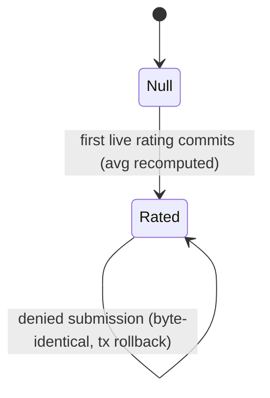

# Technical Architecture & Implementation Design: Teacher Average Rating Aggregation & Update

> **Plan of record:** `ai/plans/milestone_3_parent_portal_admin_governance/teacher_average_rating_aggregation_update/`
> **Specs:** `specs.md` REQ-001..REQ-012 (incl. REQ-J1..J3)
> **Canonical refs:** `docs/teachers/student-evaluation-submission.md` (the DEV2-016 write contract + aggregation forward contract :65-68), `docs/specs/state-machine-invariants.md` (INV-E4 :317), `docs/specs/functional-requirements.md` (FR-8.2 :238-240), `docs/sessions/session-lifecycle.md` (read-only consumption :176)
> **Ticket:** DEV2-017 (`docs/planning/TICKETS.md:2108`) · Dev 2 · Milestone 3 · 3 SP · Blocker DEV2-016 shipped
> **Version:** 1.0 · **Date:** 2026-09-17

---

## 1. System Overview & Architecture

### 1.1 Scope Statement

Close INV-E4 with the smallest possible blast radius: one aggregation read, one guarded teacher UPDATE, one same-transaction service step inside the existing submission flow, and the tests + doc that pin it. Zero schema change, zero SDL change, zero frontend change, zero new denials, zero new i18n keys. Every existing read surface (admin directory, admin user detail) starts reflecting the maintained column without a single edit on their side.

### 1.2 Layer Flow

```
Student (existing Rate dialog — UNTOUCHED)
  → useMutation(submitTeacherEvaluationMutationDocument)   [frontend, unchanged]
  → POST /api/graphql                                       [app/api/graphql/route.ts]
  → authScopes { $all: { authenticated, role: [Student] } } [unchanged]
  → mutation/classes/student-evaluation.mutation.ts         [unchanged thin resolver]
  → StudentEvaluationService.submitTeacherEvaluation        [EXTENDED pipeline, same one tx]
      1. pre-DB guards           (unchanged)
      2. withTransaction(outerTx, …)                          (unchanged)
      3. findRatingEligibilityProbe → oracle gate → completion gate (unchanged)
      4. EvaluationRepository.insertOnce(rating row)         (unchanged)
   →5. EvaluationRepository.aggregateLiveRatings(teacherId, tx)  [NEW — single-row AVG/COUNT]
      6. service conversion: (avgScore / 20).toFixed(2) → decimal string  [NEW]
   →7. TeacherRepository.updateAverageRating(teacherId, "4.00", tx) [NEW — guarded UPDATE]
  → commit: evaluations row + teacher.average_rating move atomically

Read-back (no new surface): adminTeachers directory / admin user detail
  already select teacher.averageRating → maintained value appears.
```

### 1.3 Key Design Decisions

| ID | Decision | Rationale / Evidence |
|---|---|---|
| D1 | Recompute-from-source (`AVG` over the live family per submission), never incremental merge | An incremental `(old×(n−1)+new)/n` under two concurrent submissions is a lost-update corruption; a full recomputed AVG is a pure function of the rows the tx sees. Cost is one indexed single-row aggregate over a small per-teacher family. |
| D2 | Aggregation runs INSIDE the submission's existing transaction (step 5-7 after the insert) | Atomicity contract (REQ-006.1): a rollback of either is a rollback of both. A separate tx/event/queue would leave a window where a committed rating exists with a stale average — an explainability hole, and every alternative adds infrastructure for zero benefit. |
| D3 | The average is a cached, denormalized column — not a live view | The column already exists with consumers (`teacher.repository.ts:305`, `admin-user.repository.ts:300`); FR-8.2 names it the ranking input; a live view would change every consumer's SQL for no correctness win. |
| D4 | Honest-null: zero live ratings ⇒ `NULL`, never a fabricated 0 | Ticket says "default 0", but the column is nullable with NO default and every renderer already renders null as the localized "—" (`adminTeachersDirectory.helpers.ts:78-80`) — and the platform-wide precedent is explicit ("an empty family yields `null` — never a fabricated zero", `platform-analytics.repository.ts:39-41`). A 0 would read as "rated one star×0" — an impossible rating (min 1★ = 20). Semantic conflict recorded + deferred (ledger D1). On this flow the case is unreachable anyway: the just-inserted row is live, so `aggregateLiveRatings` always sees ≥1 row. |
| D5 | Rounding lives in the service (`(avgScore / 20).toFixed(2)`), reusing `SCORE_POINTS_PER_STAR` | One conversion constant, one site (`student-evaluation.service.ts:74`). SQL-side rounding (`round(avg(score)::numeric/20, 2)`) would duplicate the 20 into SQL — a second constant to drift. The repo returns the unrounded mean; the service owns scale discipline. |
| D6 | Repo aggregate is `avg(...)::float8` in SQL + `count(*)::int`, one row — no JS-side reduction | Repo AGENTS conditional-aggregation rule (`backend/db/repo/AGENTS.md:34`); avoids materializing rows client-side. The `::float8` cast is load-bearing: pg returns bare `numeric` as a JS string, which would type-lie against `number | null` — the repo's own aggregate precedent casts to float for exactly this reason (`platform-analytics.repository.ts:366-403`). |
| D7 | `tx` REQUIRED on `aggregateLiveRatings` (no cold branch) | The aggregate feeds a same-transaction write; a cold read could read stale state or another snapshot. It exists for exactly one caller. |
| D8 | Service-facing failure for a missing teacher row is a plain internal `Error`, not a DomainError | Unreachable-by-construction invariant break (probe row's teacher always has a teacher row — shared-PK family); a DomainError would demand an i18n key, violating the zero-keys ruling (REQ-002). One bounded `logDomainError` + rethrow — loud, untranslated, never masked. |
| D9 | Zero new GraphQL surface; mutation return shape unchanged | The average is observable via admin reads; widening `EvaluationReturnType` would churn DEV2-016's SDL pins for no consumer (REQ-008.3/4). SDL byte-identical ⇒ no codegen commit. |
| D10 | Applicant-evaluation rows (`session_id NULL`) excluded by the aggregate's WHERE | Canonical contract is explicit: "NULL `session_id` rows are applicant evaluations — a different flow's scores … MUST be excluded" (`docs/teachers/student-evaluation-submission.md:68`). The unique index's NULL-distinct semantics are what let both consumers coexist. |
| D11 | Platform-analytics' live `AVG(score)` (0–100, all evaluation kinds) is NOT switched to the cached column | Different metric: analytics averages ALL live evaluations (applicant + student) on the 0–100 scale; the cached column averages student ratings only, on 0–5. Conflating them corrupts both (REQ-008.2). |
| D12 | No soft-delete-triggered recalc; no backfill job | No rating soft-delete mutation exists yet (the moderation flow is a future ticket — ledger D3 holds the recompute-hook obligation); zero pre-feature production rating rows exist (DEV2-016 shipped them; the invariant starts maintained — ledger D4). |
| D13 | Journey extends the EXISTING `student-teacher-rating.journey.test.ts` (same file/cast), not a new suite | The aggregation IS a step of the same cross-actor workflow — student acts, teacher's row moves, admin observes. The registry already tracks `evaluations` (`journey-fixture-registry.ts:81`); a second suite would duplicate the expensive cast for one assertion family. |

**Rejected alternatives:**
- *Post-commit event / notification-triggered recompute* — breaks atomicity (D2); adds an event surface this codebase's rating flow deliberately avoids ("Cross-surface purity", `student-evaluation.service.ts:35-37`).
- *Incremental average maintenance* — lost-update corruption under concurrency (D1).
- *DB trigger on `evaluations` INSERT* — invisible control flow; the repo would no longer be the single write path; triggers are not used for cross-table maintenance anywhere in this codebase, and the journey could not assert the service pipeline's order.
- *Round in SQL* — duplicates the star constant (D5).
- *Cron sweep recomputing all teachers* — eventual consistency for a value that must be exact at commit; N teachers recomputed to fix 1 teacher's change.

---

## 2. Data Models & Database Schema

### 2.1 Existing Schema Verification (READ-ONLY findings)

`backend/db/schema/teachers/teacher.ts` — the target row (verified 2026-09-17):

| Column | Type | Null | Rule |
|---|---|---|---|
| `id` | integer PK = `users.id` FK CASCADE | NOT NULL | `:22-24` (shared PK) |
| `is_approved` | boolean default false | NULL-able | `:25` |
| `is_evaluator` | boolean default false | NULL-able | `:26` |
| `average_rating` | `decimal(3,2)` | **NULL — NO default** | `:27` — the column this ticket writes |
| `is_online` | boolean default false | NULL-able | `:28` |
| `subjects` | varchar(255) | NULL | `:29` |
| `request_preference` | pgEnum default "queue" | NULL | `:30` |
| `created_at` / `updated_at` | timestamp defaultNow, `$onUpdate` | NOT NULL | `:31-35` |

Constraint: `teacher_average_rating_check` — `average_rating >= 0 AND average_rating <= 5` (`:37`).

`backend/db/schema/teachers/evaluations.ts` — the source family (verified 2026-09-17): `evaluatedId` FK CASCADE `:38-40`; `evaluatorId` FK RESTRICT `:41-43`; `sessionId` FK SET NULL, nullable `:44`; `score` integer nullable, CHECK 0–100 `:45,56`; `isDeleted`/`deletedAt` `:47-48`; index `evaluations_evaluated_id_idx` `:57` (serves the aggregate's `evaluated_id = $1` filter); unique `evaluations_session_evaluator_unique` `:60`.

### 2.2 Schema Change

**None.** The column, its clamp, and the source table all exist (REQ-003). No `bun run db push`, no migration, no snapshot change. The migration tree's latest entry (`backend/drizzle/20260915232950_custom_7-notification-dispute-types/`) stays the tip.

### 2.3 Canonical Types

`backend/types/teachers/evaluation.types.ts` — one additive export (all existing exports preserved verbatim):

```ts
/**
 * Single-row aggregate over one teacher's live student-rating family:
 * `averageScore` is the 0-100-scale mean (or null when no live rating
 * rows exist — never a fabricated value), `ratingCount` the live sample
 * size behind it.
 */
export interface EvaluationRatingAggregateType {
  readonly averageScore: number | null;
  readonly ratingCount: number;
}
```

`backend/types/teachers/teacher.types.ts` — **no change**: the UPDATE returns `TeacherSelectType` (`:3`) via `.returning()`; no twin type is created (single canonical shape). Barrel `backend/types/teachers/index.ts` needs no edit (`export *` picks the interface up — verify in the outcome).

---

## 3. API Contracts & Pothos Resolvers

### 3.1 GraphQL Schema Additions (SDL)

**None.** The write rides the existing `submitTeacherEvaluation(sessionId: ID!, input: SubmitTeacherEvaluationInput!): Evaluation!` mutation (`backend/graphql/mutation/classes/student-evaluation.mutation.ts:54`; authScopes `:66-71` — `$all { authenticated: true, role: [UserRole.Student] }`). Verification gate: after implementation, `bun run generate:gqlSchema` output MUST be byte-identical to the committed schema (no diff, no codegen, no SDL pin changes — record the check in the outcome).

### 3.2 Resolver Definition Details

**No resolver changes.** The mutation file's resolver is untouched: id coercion, member-mapped input, and the single delegation call to `StudentEvaluationService.submitTeacherEvaluation` already carry the extension — the service owns the new step.

### 3.3 Error Mapping

**Zero new codes.** Every existing denial is byte-identical (DEV2-016's contract, `docs/teachers/student-evaluation-submission.md:82-90`):

| Code | Producer | Change in this ticket |
|---|---|---|
| `SESSION_NOT_FOUND` | participant oracle (`student-evaluation.service.ts:131-142`) | none |
| `EVALUATION_SESSION_NOT_COMPLETED` | completion gate (`:151-164`) | none |
| `EVALUATION_ALREADY_SUBMITTED` | 23505 map (`:251-259`) | none — and the loser's rollback leaves the teacher row untouched (REQ-010.4) |
| `VALIDATION` + `fields[]` | pre-DB guards (`:224-240`) | none |
| `23514` check violation on `teacher_average_rating_check` | PostgreSQL, if a clamped-exceeding value were ever written | **not caught, not translated** — surfaces loudly (unreachable by the formula: scores CHECK-bound 0–100 ⇒ /20 ⇒ ≤5.00) |
| (internal, non-Domain) `Error` — teacher row missing on the update | service step 7 (`null` return) | one bounded `logDomainError` entry via the file's `logDenial` helper (`TEACHER_PROFILE_MISSING`, entity `teacher`) + rethrow — no client surface, no i18n key (D8) |

### 3.4 Permission Matrix

> Reality check (re-verified 2026-09-17): role-based `authScopes` only; no permission-slug system. This ticket adds no operation, so the matrix is the existing one plus the internal write.

| Operation | student (participant) | student (non-participant) | teacher | parent | admin | anonymous |
|---|---|---|---|---|---|---|
| `mutation submitTeacherEvaluation` (now also moves the average) | ✅ gates apply | `SESSION_NOT_FOUND` (oracle) | `FORBIDDEN` | `FORBIDDEN` | `FORBIDDEN` | `UNAUTHORIZED` |
| Read `teacher.average_rating` via `adminTeachers` directory | — | — | — | — | ✅ (existing query, unchanged) | — |
| Read via admin user detail (`teacherAverageRating`) | — | — | — | — | ✅ (existing) | — |
| Direct write to `average_rating` | none exists — the ONLY writer is the submission transaction (D2); no admin surface, no cron, no trigger | | | | | |

---

## 4. Services, Repositories & Concurrency

### 4.1 Service — `backend/services/teachers/student-evaluation.service.ts` (EXTEND)

Public surface (unchanged signatures; the extension is internal to `submitWithinTransaction`):

```ts
export namespace StudentEvaluationService {
  export async function submitTeacherEvaluation(
    studentUserId: number,
    sessionId: number,
    input: EvaluationSubmitInput,
    locale: string,
    outerTx?: DBTransaction,
  ): Promise<EvaluationReturnType>;

  export async function listMyTeacherEvaluations(
    studentUserId: number,
    tx?: DBQueryExecutor,
  ): Promise<readonly EvaluationReturnType[]>;
}
```

`submitWithinTransaction` pipeline after the insert (`:165-173`, insert unchanged):

```ts
const aggregate = await EvaluationRepository.aggregateLiveRatings(probe.teacherId, tx);
if (aggregate.averageScore === null) {
  // Unreachable by construction (the just-inserted row is live), but the
  // honest-null contract is defended here: no live family ⇒ nothing to write.
  return toEvaluationReturnType(row);
}
const averageRating = (aggregate.averageScore / SCORE_POINTS_PER_STAR).toFixed(2);
const updatedTeacher = await TeacherRepository.updateAverageRating(probe.teacherId, averageRating, tx);
if (!updatedTeacher) {
  logDenial(
    "Teacher rating aggregation failed: the rated teacher's profile row is missing",
    "TEACHER_PROFILE_MISSING",
    "teacher",
    probe.teacherId,
    locale
  );
  throw new Error("Student evaluation failed: the rated teacher has no teacher row");
}
return toEvaluationReturnType(row);
```

Notes: `SCORE_POINTS_PER_STAR` is the existing `20` constant (`:74`) — imported/used as-is, no second constant. `logDenial` is the file's existing bounded-log helper (`:87-89`); its doc-comment (`:79-86`) names `"session"` as the consistent entity label — this is the FIRST teacher-labeled use, so the helper's JSDoc is amended in the same change to say the label follows `entityId`'s target table. The throw is a plain `Error` (D8): not a `DomainError`, no i18n key, client surfaces it as an internal failure through the standard boundary — which is the correct treatment for an invariant break.

### 4.2 Repositories

`backend/db/repo/teachers/evaluation.repository.ts` — additive method inside `EvaluationRepository`:

```ts
export async function aggregateLiveRatings(
  evaluatedId: number,
  tx: DBTransaction                                    // REQUIRED — feeds a same-tx write
): Promise<EvaluationRatingAggregateType>;
```

Implementation shape (single-row select; Drizzle SQL-template aggregate per `backend/db/repo/AGENTS.md:34`):

```ts
const [row] = await tx
  .select({
    averageScore: sql<number | null>`avg(${evaluations.score})::float8`.as("average_score"),
    ratingCount: sql<number>`count(*)::int`.as("rating_count"),
  })
  .from(evaluations)
  .where(
    and(
      eq(evaluations.evaluatedId, evaluatedId),
      isNotNull(evaluations.sessionId),        // applicant evaluations excluded (D10)
      isNotNull(evaluations.score),
      or(eq(evaluations.isDeleted, false), isNull(evaluations.isDeleted))
    )
  );
return {
  averageScore: row?.averageScore ?? null,     // empty family ⇒ (null, 0)
  ratingCount: row?.ratingCount ?? 0,
};
```

(`avg()` over an empty family already returns SQL NULL and `count(*)` returns 0 — the row always exists, so the `??` only guards the never-hit empty projection. The `::float8` cast mirrors the platform-analytics precedent so the pg driver hands JS a number — a bare `avg()::numeric` arrives as a string and would contradict the declared type.)

`backend/db/repo/teachers/teacher.repository.ts` — additive method inside `TeacherRepository`:

```ts
export async function updateAverageRating(
  teacherId: number,
  averageRating: string,                               // decimal string, e.g. "4.25"
  tx: DBTransaction                                    // REQUIRED — write path
): Promise<TeacherSelectType | null>;
```

Implementation shape (guarded single-statement UPDATE, member-by-member payload):

```ts
const [row] = await tx
  .update(teacher)
  .set({ averageRating, updatedAt: sql`now()` })
  .where(eq(teacher.id, teacherId))
  .returning();
return row ?? null;
```

Both file header doc-comments are amended in the same change (method inventories at `teacher.repository.ts:2-38`, `evaluation.repository.ts:2-38`). No barrels change (`backend/db/repo/teachers/index.ts` already `export *`s both files). `isNotNull` joins the existing `drizzle-orm` import in the evaluation repo (`:39` — currently `and, desc, eq, isNull, or`).

### 4.3 Concurrency & Race-Condition Assessment

| Scenario | Actors | Risk | Mitigation |
|---|---|---|---|
| Two students rate the same teacher concurrently (different sessions) | 2 students | interleaved recomputes could each miss the other's uncommitted row | Harmless by design (D1): under READ COMMITTED each recompute sees some valid subset of the live family — never double-counted, never CHECK-violating. The later-committing transaction MAY have aggregated before the earlier one committed, so its stored value can be a subset average; that value heals to the full-family mean at the NEXT submission (recompute-from-source is the self-healing property). Journey REQ-J3 asserts bounds + CHECK safety for the chaotic race and exact convergence for sequential submissions. |
| Duplicate double-submit race on ONE session | 1 student | loser writes a stale/extra average | UNIQUE index arbitrates BEFORE the aggregate runs (insert at step 4 fails ⇒ steps 5-7 never run in the loser's tx); rollback purity asserted by teacher-row snapshots (REQ-010.4). |
| Submission fails mid-tx (probe gate, completion gate, insert failure) | student | partial write | Same-tx discipline (D2): rollback erases both the rating and the average move. |
| CHECK violation (average out of 0–5) | none | corrupted stored value | Unreachable (scores CHECK-bound 0–100 ⇒ /20 ⇒ ≤5.00) and un-handled: the raw `23514` fails the tx loudly (REQ-003.4). |
| Soft-deleted rating rows linger | moderation (future) | stale average until the next submission | Documented seam — ledger D3 owns the recompute hook when a soft-delete surface ships. |
| Module-level state / caches | — | cross-request bleed | None introduced: two stateless repo functions and a pure service step; no new imports of stateful surfaces. |

**TOCTOU statement:** the new read-then-write pair is (aggregate → teacher UPDATE) inside one transaction on one teacher id. It is NOT a guarded state transition — it is a cache recompute whose correctness never depends on the read staying true: any interleaving produces a value that is a correct average over SOME valid subset of the live family, and the family is monotonic inside a committed tx (rows are never removed by this flow). No `SELECT FOR UPDATE`, no advisory lock, no queue — a lock would serialize two students' unrelated sessions for zero correctness gain. The rating insert's own write-once race remains arbitrated by the UNIQUE index exactly as in DEV2-016.

Read isolation: default READ COMMITTED is correct for the same reason — the aggregate never feeds an authorization or uniqueness decision.

### 4.4 Cross-Actor Journey Design (binds REQ-J1..J3)

**Shared-entity state machine** (`teacher.average_rating`, a cache over the live rating family):

| State | Trigger | Next | Guard |
|---|---|---|---|
| `NULL` (no live ratings) | first live rating commits (via submission) | `"X.XX"` (mean of family, 2dp) | existing submission gates |
| `"A.AA"` | a later live rating commits | `"B.BB"` (mean of NEW family) | recomputed-from-source (D1) |
| any | denied submission (any gate / 23505) | unchanged (byte-identical) | tx rollback (D2) |
| any | rating soft-delete | unchanged **until the next submission** (documented seam, ledger D3) | no soft-delete surface exists |



**Side-effect matrix:**

| Transition | Rows written | Notifications | Audit | Idempotency |
|---|---|---|---|---|
| → `Rated` (first) | 1 `evaluations` row + 1 `teacher` row UPDATE | none (D7 of DEV2-016, kept) | none (not admin-gated) | UNIQUE(session_id, evaluator_id) on the row; the UPDATE is a pure recompute (same input ⇒ same value) |
| → `Rated` (subsequent) | 1 `evaluations` row + 1 `teacher` row UPDATE | none | none | same |
| denied | zero rows, teacher row byte-identical | none | none | — |

**Cross-actor visibility:**

| Actor | After a successful submission sees |
|---|---|
| Student (rater) | their `Evaluation` row returned (unchanged shape); the moved average is NOT visible to them (no student surface — REQ-008.4) |
| Teacher (rated) | nothing on their own surfaces (teacher-facing visibility is future scope per `student-evaluation-submission.md:74`) |
| Parent | nothing new (rating surfaces for parents are DEV1-016/017 scope) |
| Admin | the new `averageRating` value via the existing `adminTeachers` directory (`teacher.repository.ts:305` → `teacher-directory.mappers.ts:61`) and admin user detail (`admin-user.repository.ts:300`) — zero code change on their side |
| Platform analytics | its live `AVG(score)` continues measuring ALL evaluation kinds on 0–100 — intentionally NOT the cached column (D11) |

### 4.5 Forward Contract (documented, NOT built here)

- **Ranking consumer (FR-8.2):** the maintained `teacher.average_rating` (0–5, `decimal(3,2)`, honest-null) is the canonical ranking input for the future student-facing teacher search/browse surface — which does not exist yet (verified: no student-facing teacher list query in `backend/graphql/query/`). That future ticket consumes the column read-only; it never recomputes and never writes (single-writer discipline: the submission flow is the only writer). Ledger D2.
- **Soft-delete recompute hook:** when a rating-moderation surface ships, it MUST call `aggregateLiveRatings` + `updateAverageRating` in ITS transaction (or a documented successor seam) — ledger D3.
- **No other writers:** any future surface that wants to move `average_rating` composes the same two repo functions through a service; a second ad-hoc writer is the anti-pattern (see canonical doc's what-NOT-to-do).

---

## 5. Frontend UX & Navigation Specification

### 5.1 Routes & URLs — explicit no-new-route ruling

| Route | Type | Purpose | Auth |
|---|---|---|---|
| *(none added)* | — | This feature is a backend data write behind an existing mutation; there is nothing to navigate to | — |
| `/student/sessions` (EXISTING, untouched) | page | hosts the Rate CTA that triggers the flow | `withPageAuth({ roles: [UserRole.Student] })` (existing, unchanged) |
| `/admin/teachers` (EXISTING, untouched) | page | surfaces the maintained value through the directory's existing `averageRating` column | existing admin auth (unchanged) |

### 5.2 Sidebar / Navigation Integration

**No changes anywhere.** No new nav items, no new groups, no bottom-nav (the repo has none for these surfaces), no deep links, no route constants. The student dialog (`RateTeacherDialog.tsx`), its hook, its documents, and the error-link map are all untouched — the frontend cannot observe this ticket (the mutation's return shape is unchanged, REQ-008.4).

### 5.3 Role-Based Access & Per-Audience Rendering

| Audience | What changes for them |
|---|---|
| Student | nothing visible; submitting a rating now also moves the teacher's average server-side |
| Teacher (rated) | nothing (no teacher-facing rating surface exists — future scope) |
| Parent | nothing (parent rating surfaces are DEV1-016/017 scope) |
| Admin | the `average_rating` column in the existing teacher directory / user detail becomes a maintained value instead of a permanent `null`/"—" — no code or copy change on their side |
| Anonymous | nothing |

### 5.4 Components, Documents & State

| Artifact | Path | Notes |
|---|---|---|
| Frontend changes | **none** | no documents, hooks, components, stores, or generated types change (SDL byte-identical — §3.1) |

### 5.5 i18n, RTL & Accessibility

**No new keys, no parity-test changes** (REQ-002): zero new user-facing strings ship — no new UI, no new denials. Existing rating keys (`shared/locale/en/errors/index.ts:118-121`) belong to DEV2-016 and are untouched. The em-dash "—" rendering for `null` (`adminTeachersDirectory.helpers.ts:78-80`) continues to serve genuinely-unrated teachers.

---

## 6. Security, Authorization & Tenancy Mitigations

(Spec details in REQ-009; this is the engineering mapping.)

| Threat | Mitigation (implemented where) | Proof |
|---|---|---|
| BOLA/IDOR — move ANOTHER teacher's average | aggregated teacher = `probe.teacherId` (server-read from the session row; the mutation takes no teacher id) — `student-evaluation.service.ts:167` + new step 5 | service tests + existing REQ-J4-style oracle journey steps stay green |
| BOLA — rate via a foreign session to touch its teacher | participant oracle unchanged (`:131-142`); foreign ≡ nonexistent | DEV2-016 wire suites re-run unmodified |
| BOPLA mass assignment | UPDATE payload built member-by-member from server-computed values (`{ averageRating, updatedAt }`); no client byte reaches the teacher row | code review + repo tests |
| BFLA — role escalation | zero new operations; the student-only `$all` role gate (`student-evaluation.mutation.ts:66-71`) is the only entry | role matrix re-run (teacher/parent/admin → FORBIDDEN) |
| Injection | only inputs: an integer teacher id (parameterized) + a server-formatted decimal string; zero string-search surface | repo tests assert exact stored strings |
| Disclosure — learn other students' ratings | the aggregate is one number written to a column no student-facing surface reads; the mutation returns only the caller's own row | journey cross-actor visibility assertions |
| Cross-surface purity regression | still zero notification/audit/wallet/ledger/session-row writes; only `TeacherRepository` joins the import set (from the already-imported `@/backend/db/repo` barrel) | write-purity row-count oracles in the service tests (existing pattern, `student-evaluation.service.test.ts` header :28-31) |
| Write-path widening | single-writer discipline: the submission transaction is the ONLY writer of `average_rating`; no trigger, no cron, no admin knob | canonical doc what-NOT-to-do + grep sweep |

No tenant tables, no money movement, no env-config keys, no cache keys, no audit-census obligations (not an admin mutation).

---

## 7. Verification Anchors (consumed by `tasks.md`)

| Anchor | Command / Location |
|---|---|
| Per-file quality | `bun run scripts/health/sub-loop.ts <file> --lifecycle duplicates` (exit 0) |
| Repo tests | `bun run test/scripts/run-test.ts backend/db/test/repo/teachers/evaluation.repository.test.ts` and `… /teacher.repository.test.ts` |
| Service tests | `bun run test/scripts/run-test.ts backend/services/teachers/student-evaluation.service.test.ts` |
| Journey | `bun run test/scripts/run-test.ts test/workflows/teachers/student-teacher-rating.journey.test.ts` |
| SDL integrity gate | `bun run generate:gqlSchema` → `git diff --stat frontend/graphql/generated/schema.graphql` MUST be empty (record in outcome) |
| Codegen | NOT run — no SDL change; if the diff gate unexpectedly shows a change, STOP and record (spec drift) |
| Global gate | `bun quality-gate` |
| Traceability sweep | every `REQ-…` in `specs.md` appears in `tasks.md` |
| Zero-schema gate | `git status backend/db/schema/ backend/drizzle/` MUST show no change after implementation |
