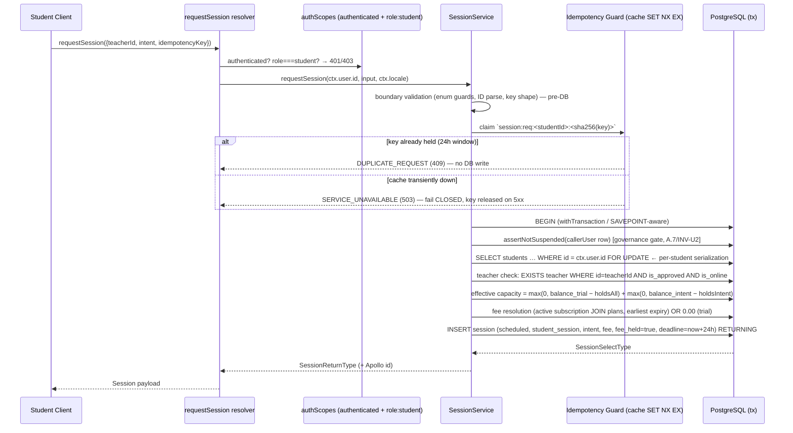

```markdown
# Technical Architecture & Implementation Design: DEV3-004 — Session Creation & Lifecycle (Scheduled → Started → Completed/Cancelled)

> **Plan of record:** `ai/plans/dev3-004-session-creation-lifecycle/`
> **Specs:** `specs.md` REQ-001..REQ-083
> **Canonical refs:** `docs/specs/state-machine-invariants.md` (INV-S1..S8, INV-A1..A4, INV-B4), `docs/specs/open-decisions-and-gaps.md` (B.2, B.3, B.4, A.8, A.10, B.18, C.5), `docs/workflows/02-on-demand-matching-workflow.md`, `docs/workflows/03-session-lifecycle-escrow.md`, `docs/IDEMPOTENCY.md`, `docs/graphql/domain-error-extensions-code.md`, `docs/auth/user-registration.md`, `docs/auth/jwt-authentication-service.md`, `docs/auth/qiraah-selection-and-c5.md`, `ai/plans/dev2-003-shared-types-interface-contracts/plan.md`

---

## 1. System Overview & Architecture Diagram

### 1.1 Scope & The Request-vs-Accept Reconciliation

DEV3-004 ships the **canonical session lifecycle engine**: one creation entry point (`requestSession`), three guarded transitions (`startSession`, `completeSession`, `cancelSession`), and one participant-scoped read (`session(id)`). The ticket's prose ("student requests … teacher accepts … session record is created") is reconciled against the Drizzle schema ground truth in `backend/db/schema/`: **there is no pending-request table and no `pending` status value** (DEV1-001). Following TEAM_ALLOCATION Contract 1 and Workflow 02, the durable `session` row in `status='scheduled'` **IS** the committed booking, created at request time only when the teacher is certified + online at that instant. The explicit accept/decline/queue handshake (B.16) is layered onto this row by DEV3-011 and is categorically NOT rebuilt here.

### 1.2 Sequence — Creation Pipeline (`requestSession`)



### 1.3 State Machine — Canonical Transition Set (INV-S1/S2, Workflow 03, B.18)

```mermaid
stateDiagram-v2
[*] --> scheduled: requestSession commit (fee_held=true, deadline=now+24h)
scheduled --> started: startSession (teacher; sets started_at + is_online=false)
scheduled --> cancelled: cancelSession (participant; releases hold, fee_held=false)
started --> completed: completeSession (teacher; sets ended_at + is_online=true)
started --> cancelled: cancelSession (participant; releases hold + is_online=true)
completed --> [*]: terminal (dual-confirmation/escrow = DEV3-012/013; dispute = DEV3-022)
cancelled --> [*]: terminal (no financial transaction; INV-S3)
note right of completed: suspected → VOID in this ticket\n`disputed` unreachable here (B.18 → DEV3-022)
```

Every transition executes as a **single guarded `UPDATE … WHERE id=? AND status=<expectedFrom> … RETURNING`**. Zero rows ⇒ `SESSION_INVALID_TRANSITION`. Read-then-write status checks are prohibited (REQ-041).

### 1.4 Layer Data Flow (canonical Kottaby layers — unchanged)

```
Client Component → Apollo useMutation(requestSessionMutationDocument)
  → GraphQL API → Pothos resolver (thin: locale + delegation)
  → SessionService (validation, governance, orchestration, DomainError throws)
  → SessionRepository / StudentRepository / TeacherRepository / (plans read for fee)
  → PostgreSQL
(No Server Component path in this ticket — no SSR consumer exists yet; forward note REQ-066.)
```

### 1.5 Key Design Decisions Table

| # | Decision | Options Considered | Pros / Cons | Rationale (Maintainability, Scalability, Reliability) |
|---|---|---|---|---|
| D1 | **`scheduled` row created at request time** (no pending table, no invite round-trip) | (a) Pending-request entity + accept flow; (b) create-at-request; (c) deferred creation on accept | (a) Pros: matches prose. Cons: contradicts DEV1-001 schema ground truth (no table, no `pending` enum), contradicts Contract 1 / B.4 hold-at-request timing, adds unreconciled schema ownership. (b) Pros: zero schema drift; identical to Contract 1 guarantees; gives DEV3-011 a real `session.id` for notifications (A.4 `related_entity_id`); INV-S6 lock defined against a row that exists. Cons: "accept" ceremony deferred to DEV3-011 — acceptable per B.16 (preference-driven, not a second booking state). (c) Pros: none dominant. Cons: Contract 1 deadline semantics unfalsifiable at M1. | **(b).** The Drizzle schema in `backend/db/schema/` is the sole structural ground truth (REQ-002 of DEV1-001 ethos); Workflow 02 says "verify teacher is still available → create session (scheduled) + lock". Merging request=creation keeps one writable artifact and one audit path. |
| D2 | **Single canonical state-guard module** in the service layer encoding the WF-03 transition map | (a) Per-mutation inline checks; (b) one guard module + guarded repo UPDATE | (a) Cons: 3+ duplicated drift-prone maps (violates REQ-023). (b) Pros: DEV3-021/DEV3-022/DEV2-006 reuse the map by import; the repo's `WHERE status=expectedFrom` is the atomic enforcement and the map is the fast-path typed rejection; single testable unit. | **(b).** REQ-023; prevents the "ad-hoc per-mutation status checks" anti-pattern explicitly prohibited by specs. |
| D3 | **Guarded single-statement transitions** (`UPDATE … WHERE id AND status RETURNING`), zero-row ⇒ typed conflict | (a) SELECT then UPDATE; (b) advisory locks; (c) guarded UPDATE | (a) Cons: TOCTOU window between check and write under concurrent complete/cancel races. (b) Cons: extra lock infra for what row-lock-on-UPDATE already serializes. (c) Pros: purple predicate evaluated under PostgreSQL row lock ⇒ atomicity window = 0; zero infrastructure. | **(c).** REQ-041; REQ-045(c–e) race matrix is provable with `Promise.allSettled` because the loser trivially observes zero affected rows. |
| D4 | **Per-student serialization via `SELECT … FOR UPDATE` on the `students` row** during creation | (a) No lock; (b) lock on `students` row; (c) advisory lock keyed by student | (a) Cons: REQ-045(a) double-hold race — two parallel requests each see capacity=1 and both insert. (b) Pros: the row being guarded is the ledger-of-record for balances; all per-student creations naturally queue; composes with `runInRollback` SAVEPOINT tests. Cons: brief lock hold per request (bounded, sub-50ms). (c) Cons: invisible to FK/rollback semantics tests; harder to reason about in Drizzle. | **(b).** REQ-040/REQ-042; INV-B4 enforcement needs *locked* balance visibility — check-then-insert without the row lock leaks credits. |
| D5 | **Hold-by-marker + derived availability** (no decrement ever; capacity = balances − active-hold count) | (a) Decrement at request, refund on cancel; (b) marker + derived | (a) Cons: contradicts B.4 (decrement at completion) and INV-S3 (no financial writing on cancel); refund path = write amplification + failure modes. (b) Pros: cancel = pure state flip; decrement/wallet side effects structurally absent (INV-W4 proven by REQ-073 "no teacher_transaction" assertion); aligns with DEV1-004 REQ-021's trial-first *decrement* contract landing later in DEV3-013. Cons: capacity is computed, not materialized (documented, REQ-049). | **(b).** B.4 is decision-locked. The conservative mixed-intent approximation (trial holds count globally within their intent bucket) is the documented bound pending DEV3-013's lane-assignment refinement (F3). |
| D6 | **Idempotency via atomic cache claim `SET NX EX` on `session:req:<studentId>:<sha256(key)>` (24h TTL), fail-CLOSED on cache outage** | (a) DB unique constraint on `(student_id, key)` column; (b) in-process Map; (c) cache `SET NX EX` with `SERVICE_UNAVAILABLE` fallback | (a) Pros: transactional. Cons: requires schema change — forbidden by REQ-047 (schema stability); `session` table has no key column and adding one belongs to DEV1-001 governance. (b) Cons: violates REQ-046 (module-level mutable state) and serverless multi-instance correctness. (c) Pros: matches `docs/IDEMPOTENCY.md` (24h window, 409 DUPLICATE_REQUEST, 5xx releases key); horizontally safe; mockable in service tests. Cons: cache outage blocks creation — deliberately chosen (fail-closed beats duplicate bookings). | **(c).** REQ-017; cold-start resilience precedent (`docs/backend/login-cold-start-resilience.md`) applies: transient infra ⇒ 503-retryable, never silent degradation. |
| D7 | **Fee resolution server-side only**: active subscription (JOIN plans, `status=active`, within window, earliest `end_date` first) ⇒ `price/session_count` rounded to `numeric(10,2)`; trial coverage ⇒ `0.00` | (a) Client-supplied fee (rejected — B.3); (b) plan lookup per request inside the same tx; (c) cached fee table | (b) Pros: joins are local to the locked tx; no cache coherence problem. Cons: per-request read cost, negligible scale. (c) Cons: stale-pricing risk + invalidation bugs; unjustified at current volume. | **(b).** B.3 platform-set fee; REQ-015; deterministic earliest-expiry rule keeps behavior testable. Per-plan lane attribution refinement is forward-owned (F3 → DEV3-013/DEV1-007). |
| D8 | **`assertNotSuspended` lands in this ticket** at `backend/services/auth/assert-not-suspended.ts` (DEV2-002 deferred item D2 ownership) and gates `requestSession` | (a) Skip (rely on login gate); (b) land here; (c) defer again | (a) Cons: a token issued before a mid-session suspension still passes context; INV-U2 requires write-path denial. (b) Pros: pure, unit-testable, consumed later by DEV1-006/DEV3-013. Cons: small cross-stream file touch — sanctioned by the DEV2-002 consumption guide. | **(b).** REQ-033; governance is defense-in-depth at every balance-consuming entry. |
| D9 | **Oracle resistance via `SESSION_NOT_FOUND`** for non-participant access/mutation attempts | (a) FORBIDDEN for non-participants; (b) NOT_FOUND | (a) Cons: reveals existence of arbitrary enumerable integer IDs (BOLA oracle). (b) Pros: REQ-034/DEV3-002 REQ-031 pattern; sessions leak nothing to outsiders. Cons: debugging friction — mitigated by structured `logger.logDomainError` server-side. | **(b).** Session IDs are sequential integers; existence disclosure is a reconnaissance vector. |
| D10 | **No schema, no recitation rows, no wallet writes, no notification rows, no UI routes** — hard negative scope enforced by review + static scans | (a) allow opportunistic extras; (b) hard negative boundary | (a) Cons: scope bleed poisons DEV3-006/010/013 ownership. (b) Pros: M1 gate evidence is the GraphQL suite (REQ-029); review-time grep-scan enforces it. | **(b).** Non-goals 1–11 are contractual; the plan pins them as verified constraints, not prose. |

---

## 2. Data Models & Database Schema

### 2.1 Existing Schema Verification (READ-ONLY — zero changes, REQ-047)

All structures exist from DEV1-001 (+ DEV1-004 trial lane). Verification-only audit; `git diff backend/db/schema/**` must be empty at completion.

| Contract dependency | Existing implementation | Verified at |
|---|---|---|
| `session` lifecycle columns | `status session_status NOT NULL DEFAULT 'scheduled'`, `session_type session_type NOT NULL DEFAULT 'student_session'`, `intent session_intent NULL`, `fee numeric(10,2) NULL`, `fee_held boolean DEFAULT false`, `started_at`, `ended_at`, `confirmation_deadline`, `confirmed_by_student_at`, `confirmed_by_teacher_at`, `teacher_id NOT NULL FK→teacher`, `student_id NOT NULL FK→students`, PK identity | `backend/db/schema/classes/session.ts` |
| `session_status` values (scheduled/started/completed/cancelled/disputed) | `pgEnum` registry | `backend/db/schema/enums.ts` (+ `backend/enum/scheduling/session-status.enum.ts`; `disputed` exists but is unreachable here — B.18/DEV3-022) |
| Teacher certification/presence flags | `teacher.isApproved`, `teacher.isOnline`, `requestPreference` (B.16 — NOT consumed here) | `backend/db/schema/teachers/teacher.ts` |
| Balance lanes (INV-B1/B4) | `students.balanceHifz/Tajweed/Reviews` CHECK ≥ 0; DEV1-004 lane `students.balanceTrial NOT NULL DEFAULT 0`, `trialGrantedAt` (guarded by REQ-004 dep check) | `backend/db/schema/students/students.ts` |
| Fee inputs | `plans.price`, `plans.sessionCount` (CHECK > 0); `subscriptions.status/startDate/endDate` (A.9) | `backend/db/schema/billing/plans.ts`, `subscriptions.ts` |
| Governance (A.7/INV-U2) | `users.suspended/suspendedAt/suspendedPeriodDays/isBlocked/isDeleted` | `backend/db/schema/users/users.ts` |

**Prohibited by construction:** no new tables/columns/enums; no `bun run db push`; no custom SQL under `backend/db/migration/`; no `recitation` rows (C.5 → DEV3-007); no `teacher_transaction`/`student_payments`/`wallet` writes on ANY path (INV-S3/INV-W4/INV-PAY2 — grep-verified in review gates); `db reset`/`cleanGenerate` remain disabled (`docs/DATABASE_MIGRATIONS.md`).

### 2.2 Canonical Types — `backend/types/classes/session.types.ts` (EXTEND, additive only)

Existing file holds `SessionSelectType`/`SessionInsertType` (`$inferSelect`/`$inferInsert`). Additive exports (REQ-003): all composed from the canonical select type — composition-only, per DEV2-003 REQ-011 rule.

```typescript
// backend/types/classes/session.types.ts (ADDITIVE)
export interface SessionRequestSubmitInput {            // BOPLA whitelist (REQ-031)
  readonly teacherId: number;                            // positive safe int (REQ-039)
  readonly intent: SessionIntent.Hifz | SessionIntent.Tajweed; // enum-member typed (REQ-002)
  readonly idempotencyKey: string;                       // non-empty ≤128 (REQ-054)
}
export interface SessionTransitionInput { readonly sessionId: number; }
export type SessionReturnType = Omit<SessionSelectType, never>; // no forbidden fields on session; kept distinct alias for GraphQL binding (single canonical object)
```

- Values `SessionIntent`/`SessionStatus` are **value imports** from `@/backend/enum/scheduling/*` (never `import type` for runtime use).
- Consumed (imported, NOT redefined): `SessionRequestContract`, `EscrowReleaseContract`, `ContractErrorCodes` from `@/backend/types/contracts`; `DBTransaction` from `@/backend/types`.
- NO new `.types.ts` in `backend/services/` (prohibited); NO local types in Pothos files (CRITICAL rule).

### 2.3 Enums — registration only in Pothos layer (REQ-061)

No enum VALUE changes anywhere. Pothos exposure registers each canonical enum **once** in `backend/graphql/pothos/shared/enum.pothos.ts` via enum-object form against `backend/enum/scheduling/*`: `SessionStatusPothosEnum`, `SessionTypePothosEnum`, `SessionIntentPothosEnum`. Domain Pothos files import these — re-registration / `values: [...]` literals / inline enums are prohibited (`backend/graphql/AGENTS.md` CRITICAL RULE). After registration: `bun run generate:gqlSchema && bun codegen` (diff committed, REQ-064).

### 2.4 i18n — `errors` namespace additions (REQ-051; namespace already registered by DEV1-002/DEV3-002)

| File | Change |
|---|---|
| `shared/locale/types/errors/index.ts` | Add (grouping per locale convention, e.g. `session` group): `sessionNotFound`, `sessionInvalidTransition`, `teacherNotCertified`, `teacherNotAvailable`, `insufficientSessionBalance`, `idempotencyKeyRequired` — all `string`. Reuse existing `duplicateRequest` (NO near-duplicate key). |
| `shared/locale/en/errors/index.ts` | English implementations for every new key |
| `shared/locale/ar/errors/index.ts` | Arabic implementations (parity gate = `tsgo` MessageSchema compile error on missing key) |

Consumers: services `getServerTranslations(locale, "errors")`; resolvers `ctx.t("errors")`.

---

## 3. API Contracts & Pothos Resolvers

### 3.1 GraphQL Schema Additions (SDL)

```graphql
extend type Query {
  session(id: ID!): Session
}

extend type Mutation {
  requestSession(input: RequestSessionInput!): Session!
  startSession(sessionId: ID!): Session!
  completeSession(sessionId: ID!): Session!
  cancelSession(sessionId: ID!): Session!
}

input RequestSessionInput {
  teacherId: ID!
  intent: SessionIntent!
  idempotencyKey: String!
}

type Session {
  id: ID!
  studentId: ID!
  teacherId: ID!
  status: SessionStatus!
  sessionType: SessionType!
  intent: SessionIntent
  fee: String           # decimal serializes as string (drizzle numeric); nullable (trial path may resolve 0.00)
  feeHeld: Boolean
  startedAt: DateTime
  endedAt: DateTime
  confirmationDeadline: DateTime
  confirmedByStudentAt: DateTime
  confirmedByTeacherAt: DateTime
  createdAt: DateTime!
}
```

(`DateTime` scalar follows the repo's existing scalar convention; timestamps come from `SessionReturnType` direct — no resolver-side transformation.)

### 3.2 Pothos Definition Details

- **Canonical object (REQ-060):** single `SessionPothosObject` in `backend/graphql/pothos/sessions/session.pothos.ts` (new subdir + barrel, wired into `backend/graphql/pothos/index.ts`), backed by `SessionReturnType` from `@/backend/types` via `gqlSchemaBuilder.objectRef<SessionReturnType>("Session")`; `id` exposed first (Apollo normalization). No second session-shaped object, no local types.
- **Input type:** `RequestSessionInput` input type maps to `SessionRequestSubmitInput` fields only (whitelist by construction).
- **Resolvers:** `backend/graphql/mutation/session.mutation.ts` (4 mutation fields) and `backend/graphql/query/session.query.ts` (`session(id)`), following the existing `backend/graphql/mutation/auth.mutation.ts` pattern: thin bodies — `const tErrors = await ctx.t("errors")` available for direct throws; delegate to `SessionService` with `ctx.user.id` + `ctx.locale`. **Top-level static imports only** (Bun ESM rule — no `await import()` inside resolvers).
- **Error surfacing:** resolvers never map/catch; `DomainError` subclasses thrown from the service propagate `extensions.code` per `docs/graphql/domain-error-extensions-code.md` and the DEV3-002 taxonomy boundary (REQ-050/052).
- **ID parsing (REQ-039):** `sessionId`/`teacherId` pass a positive-safe-integer guard before ANY DB read; malformed ⇒ `ValidationError` (`VALIDATION`, 422 semantics).
- **Codegen sync (REQ-064):** after Pothos changes run `bun run generate:gqlSchema && bun codegen`; commits include generated artifacts.

### 3.3 authScopes & Rate Limiting

| Operation | authScopes | Post-auth ownership gate | Rate limiting |
|---|---|---|---|
| `requestSession` | `{ authenticated: true, role: [UserRole.Student] }` | studentId = `ctx.user.id` (derived, not input) | existing platform limiter posture unchanged (REQ-035); idempotency guard absorbs retry storms |
| `startSession` | `{ authenticated: true, role: [UserRole.Teacher] }` | `session.teacherId === ctx.user.id` else `SESSION_NOT_FOUND` | — |
| `completeSession` | `{ authenticated: true, role: [UserRole.Teacher] }` | same | — |
| `cancelSession` | `{ authenticated: true, role: [UserRole.Student, UserRole.Teacher] }` | participant on either side else `SESSION_NOT_FOUND` | — |
| `session(id)` | `{ authenticated: true }` | participant OR `role=admin` (DEV2-002 machinery) else `SESSION_NOT_FOUND` | — |

Scope composition is AND across facets (Pothos conjunction, DEV2-002 contract). NO public session ops; NO admin-only scope added (DEV3-021 owns governance ops); NO `superAdmin` usage here.

### 3.4 Permission Matrix (REQ-032, REQ-030)

| Interaction | Anonymous | Student | Parent | Teacher (Applicant) | Teacher (Certified) | Supervisor/Super Admin |
|---|---|---|---|---|---|---|
| `requestSession` | `UNAUTHORIZED` (401) | ✅ (suspension-gated) | `FORBIDDEN` (403 role) | `FORBIDDEN` (403 role) | `FORBIDDEN` (403 role) | 403 role |
| `startSession` | 401 | 403 role | 403 role | 403 role (non-participant) / `TEACHER_NOT_CERTIFIED` class when somehow session owner (impossible — can't be one) | ✅ own session only | 403 role |
| `completeSession` | 401 | 403 role | 403 role | 403 role | ✅ own session only | 403 role |
| `cancelSession` | 401 | ✅ own only | 403 role | 403/`SESSION_NOT_FOUND` | ✅ own only | 403 role |
| `session(id)` | 401 | own only / else `SESSION_NOT_FOUND` | `SESSION_NOT_FOUND` (PINV-P2: no surface) | `SESSION_NOT_FOUND` | own only | admin: allow |
| Target un-certified teacher at request | — | `TEACHER_NOT_CERTIFIED` (422) | — | — | — | — |
| Target offline/in-session teacher | — | `TEACHER_NOT_AVAILABLE` (409) | — | — | — | — |

Role↔certification boundary (DEV2-002 §5.6): `role=teacher` never substitutes for `teacher.isApproved=true` (INV-S5) — the certified re-check also re-runs inside `startSession` (REQ-019) against mid-cycle revocation.

---

## 4. Backend Services, Repositories & Concurrency Model

### 4.1 Service Layer — `backend/services/sessions/` (NEW subdir)

**`session-state-guard.helpers.ts`** (REQ-023; runtime helpers in non-`.types` file per the types/services split rule):

```typescript
// value imports only
export const SESSION_ALLOWED_TRANSITIONS: Readonly<Record<SessionStatus, readonly SessionStatus[]>> = {
  [SessionStatus.Scheduled]: [SessionStatus.Started, SessionStatus.Cancelled],
  [SessionStatus.Started]: [SessionStatus.Completed, SessionStatus.Cancelled],
  [SessionStatus.Completed]: [],
  [SessionStatus.Cancelled]: [],
  [SessionStatus.Disputed]: [],  // exists in enum; unreachable here (B.18 → DEV3-022)
};
export function assertSessionTransition(from: SessionStatus, to: SessionStatus, t: ErrorsNamespace): void; // throws ValidationError("SESSION_INVALID_TRANSITION", …)
```

**`session.service.ts`** — `SessionService` namespace; all public methods accept `outerTx?: DBTransaction` last and compose the DEV1-002/DEV1-004 `withTransaction(outerTx)` SAVEPOINT-aware pattern (REQ-018/REQ-044):

| Method | Signature essence | Flow |
|---|---|---|
| `requestSession` | `(callerStudentId: number, input: SessionRequestSubmitInput, locale: string, outerTx?) => Promise<SessionReturnType>` | boundary validation (REQ-054) → idempotency claim (D6) → tx: `assertNotSuspended(userGovRow)` → `StudentRepository.lockForUpdate` → teacher eligible (`isApproved && isOnline` — REQ-013) → capacity (REQ-014 formula) → fee resolve (D7) → `SessionRepository.createFromContract(mappedInsert, tx)` → return |
| `startSession` | `(callerTeacherId, sessionId, locale, outerTx?)` | tx: `SessionRepository.transitionStatus(id, Scheduled, {status: Started, startedAt: now}, tx)` (zero rows ⇒ typed) + teacher-certified re-assert + `TeacherRepository.setOnline(teacherId, false, tx)` guarded by `isApproved=true` (REQ-042) |
| `completeSession` | `(callerTeacherId, sessionId, locale, outerTx?)` | tx: transition `Started→Completed` `endedAt=now` + `setOnline(true)` (INV-A4) |
| `cancelSession` | `(callerId, sessionId, locale, outerTx?)` | tx: fetch participant anchor (single read INSIDE tx via `findById`, identity gate REQ-030) → transition via state map (`Scheduled|Started→Cancelled`) with `endedAt=now, feeHeld=false` + IF source was `started` ⇒ `setOnline(true)` — NO wallet/payment writes |
| `getSessionForParticipant` | `(callerId, sessionId, callerRole, locale)` | read: `SESSION_NOT_FOUND` when absent or foreign (REQ-024/034); admin pass-through |

Domain rules only inside the service: enum guards, governance, capacity math, fee resolution, BOPLA mapping (explicit literal object into `SessionInsertType`), DomainError throws, `logger.logDomainError` for expected rejections (REQ-053). NO `console.*`; NO swallowed catches (DEV3-002 REQ-026).

**`backend/services/auth/assert-not-suspended.ts`** (NEW; REQ-033 — DEV2-002 D2 shape): pure function `assertNotSuspended(user: {suspended, suspendedAt, suspendedPeriodDays}, locale): void` — active-window compute (`suspended && suspendedAt && (days == null || suspendedAt + days > now)`) ⇒ `ForbiddenError` (localized `accountSuspended` — reuse existing key if present; else add it in the same errors-namespace edit, avoiding near-duplicates); lapsed/missing ⇒ allow. Consumed by `requestSession` (user row read inside the tx). Independently unit-tested (boundary dates around the window edge).

**Idempotency guard port (D6):** thin module `session-request-idempotency.helpers.ts` wrapping the cache service port with EXACTLY: `claimSessionRequestKey(studentId, key): Promise<"claimed" | "duplicate">` using atomic SET-NX-EX semantics (TTL 24h), `releaseSessionRequestKey(...)` on 5xx path, raising `ConflictError(DUPLICATE_REQUEST)` / `ServiceUnavailable`-class `SERVICE_UNAVAILABLE` on duplex/outage per REQ-017. Cache adapter is injected/mocked in service tests (REQ-078); key material = SHA-256 hex of the raw key; key cap ≤128 chars enforced before hashing.

### 4.2 Repository Layer — `backend/db/repo/sessions/` (NEW subdir), plus additive methods

**`session.repository.ts`** — `SessionRepository` namespace; every method takes `tx?: DBTransaction` (REQ-043, `repo.method(params, tx)` convention):

```typescript
createFromContract(insert: SessionInsertType, tx?: DBTransaction): Promise<SessionSelectType>            // INSERT RETURNING
findById(sessionId: number, tx?: DBTransaction): Promise<SessionSelectType | null>                     // queryDb(tx) Neon-HTTP read branch
transitionStatus(sessionId, expectedFrom: SessionStatus, patch: SessionInsertType-partial-literal, tx?: DBTransaction): Promise<SessionSelectType | null>
   // single guarded UPDATE … WHERE id AND status = expectedFrom RETURNING — NO prepared statements (write path)
countActiveHolds(studentId: number, intent: SessionIntent | null, tx?: DBTransaction): Promise<number> // feeHeld=true AND status IN (Scheduled, Started) [+ intent filter]
```

**`backend/db/repo/students/student.repository.ts`** (ADDITIVE): `lockForUpdate(studentId: number, tx?: DBTransaction): Promise<StudentSelectType>` — `SELECT … FROM students WHERE id=? FOR UPDATE` (Drizzle `.for("update")`), only ever called non-null inside a tx.

**`backend/db/repo/teachers/teacher.repository.ts`** (ADDITIVE): `setOnline(teacherId: number, online: boolean, tx?: DBTransaction)` and `setOnlineIfApproved(teacherId, false, tx)` (guarded start-side acquisition, REQ-042); `findEligibility(teacherId, tx)` returning `{isApproved, isOnline}` (read, `queryDb(tx)` pattern inside tx).

**Fee-resolution read (D7):** subscription/plan count join lives in `backend/db/repo/billing/subscription.repository.ts` if present; otherwise additive read method `findActiveWithPlan(userId, now, tx)` — plain SELECT (read-only inside tx; prepared-statement rule does not apply to in-tx reads; NO `inArray`+placeholder prohibition triggered — single scalar params). Fields read: `plans.price`, `plans.sessionCount`, `subscriptions.endDate` ordered by `endDate ASC` limit 1.

Repo hygiene: no business logic, no permissions, no hardcoded strings (localized messages resolve in the service layer, `backend/db/repo/AGENTS.md`); no `sql` templates with `--` inline comments (parameter binding rule); values are Drizzle-parameterized.

### 4.3 Concurrency & Race Condition Assessment

| Scenario | Actors | Risk | Mitigation (requirement anchor) |
|---|---|---|---|
| Parallel `requestSession` × 2, student capacity = 1 | 2 student clients | Double-hold / credit leak | `students` row `SELECT … FOR UPDATE` serializes capacity computation + insert (D4); loser computes capacity=0 ⇒ `INSUFFICIENT_BALANCE` (REQ-040, REQ-045a) |
| Same-key replay burst (flaky network / double-tap) | student × N retries | Duplicate rows | Atomic `SET NX EX` claim before tx (D6); first commit holds key 24h ⇒ `DUPLICATE_REQUEST`; 5xx ⇒ key released, same-key retry allowed (REQ-017, REQ-045b) |
| Cache outage during claim | student + cache infra | Unprotected creation | Fail-closed `SERVICE_UNAVAILABLE` (retryable), never proceed unprotected (REQ-017/D6; cold-start resilience precedent) |
| `startSession` ⚡ `cancelSession` on same row | teacher + student | Divergent status/lock | Guarded UPDATE per actor: exactly one transition wins (row lock); loser zero-rows ⇒ typed conflict; `is_online` mutated in the WINNER's tx only ⇒ consistent outcome (REQ-019/021/042, REQ-045c) |
| `completeSession` ⚡ `cancelSession` | teacher + student | Post-completion release or double terminal write | Same guarded-transition discipline; a cancelled session NEVER emits wallet/transaction writes (structurally absent), and once `completed` = terminal (INV-S1) (REQ-045d, REQ-073) |
| Duplicate `startSession` / `completeSession` (retry after committed 5xx) | teacher | State drift | Second call hits zero-rows on `WHERE status=<expectedFrom>` ⇒ `SESSION_INVALID_TRANSITION` — deterministic success-equivalent per REQ-025/`docs/IDEMPOTENCY.md` guidance (REQ-045e) |
| Teacher decertified mid-cycle (admin governance, future surface) | admin (DEV3-021 lane) vs active start | Lock acquired by uncertified teacher | Start-side acquisition is guarded: `setOnlineIfApproved` + eligibility re-assert in the same tx (REQ-019/042) |
| Mid-tx failure after lock acquired | service error | Partial commit / leaked lock | Single Drizzle tx discards full unit incl. row locks on rollback; forced-failure test proves zero residuals (REQ-044, REQ-074) |
| Clock drift on deadline | any | Bad 24h math | One `now` captured per tx; app-time arithmetic `now + 24*3600*1000` (REQ-048/027 — written, never read here) |

**TOCTOU guarantees:** status transitions — window = 0 (single statement). Teacher availability (Workflow-02 "verify still available") — window bounded by the student-row lock + same-tx certification read; full directory-grade lock integrity is the matching/queue layer's job (DEV3-008/011; teacher-side write conflicts serialize naturally through the `teacher` row update lock in the tx). **SELECT FOR UPDATE usage:** `students` row only (creation). **No advisory locks; no module-level mutable state (REQ-046); Redis used ONLY via the atomic SET-NX-EX claim — never GET+SET sequences.**

---

## 5. Frontend UX & Navigation Specification

This ticket ships **GraphQL documents only — zero UI** (non-goal #11; REQ-066).

### 5.1 Routes & URLs Table

| Path | Purpose | Required permission | Allowed roles |
|---|---|---|---|
| — (none) | No routes added/changed/removed | — | — |

`/register`, `/login`, dashboards — untouched. No `page.tsx` changes, no `withPageAuth`/`requireRoleForPage` call-site additions.

### 5.2 Sidebar & Navigation Integration

| Group | Parent item | New children | Mobile bottom nav |
|---|---|---|---|
| — | — | None | None |

### 5.3 Per-Audience Rendering Table

| Audience | Rendering impact |
|---|---|
| Student / Parent / Teacher / Supervisor / Admin | **None.** No view changes; M1 evidence is the GraphQL integration suite (REQ-029/077). |

### 5.4 Apollo GraphQL Documents & UI Components

**Documents (REQ-065):** `frontend/graphql/sharedDocuments/sessions/session.documents.ts` (NEW subdir + `index.ts` barrel `export * from "./session.documents";` + top-level barrel `export * from "./sessions";`).

| Document const | Operation | Type |
|---|---|---|
| `requestSessionMutationDocument` | `mutation RequestSession($input: RequestSessionInput!)` | `TypedDocumentNode<RequestSessionMutation, RequestSessionMutationVariables>` |
| `startSessionMutationDocument` | `mutation StartSession($sessionId: ID!)` | `TypedDocumentNode<StartSessionMutation, StartSessionMutationVariables>` |
| `completeSessionMutationDocument` | `mutation CompleteSession($sessionId: ID!)` | `TypedDocumentNode<…>` |
| `cancelSessionMutationDocument` | `mutation CancelSession($sessionId: ID!)` | `TypedDocumentNode<…>` |
| `sessionQueryDocument` | `query Session($id: ID!)` | `TypedDocumentNode<SessionQuery, SessionQueryVariables>` |

Rules: `gql` + `TypedDocumentNode` imported from `@apollo/client` (never `/core`); `id` selected on every `Session` object; codegen types from `@/frontend/graphql/generated/gql/graphql` only (no inline literals, no mapping layers, no indexed-access workarounds); hooks from `@apollo/client/react`; NO `useLazyQuery`. The GraphQL integration harness consumes these documents exclusively via `testClient` (REQ-065). Error consumption follows DEV3-002's `extensions.code` branching (REQ-068 — `CombinedGraphQLErrors` / `expectMutationError(…, expectedCode)` in tests).

**Components/hooks/stores:** none added. No Zustand (incl. no `persist`) involvement.

### 5.5 Visual Design & Responsive Specifications

- **Breakpoints (1440/768/375)**: N/A — no visual surface.
- **Multi-Language & RTL**: N/A for UI; backend error strings are fully bilingual (`en`/`ar` parity gated by `MessageSchema` compile) — the only language-sensitive output of this ticket.
- **Visual State Matrix**: N/A (no empty/skeleton/error/success UI states). Server-side error states (typed codes + localized copy) are enumerated in §3.4/§6 instead.
- **Agent-Browser Verification Protocol**: No UI screenshots. Automated functional verification = `setupTestServerLifecycle` + `testClient` against `/api/graphql` on the dev/test server executing the REQ-077 happy path (`requestSession → startSession → completeSession`) and both cancel paths, with `extensions.code` assertions per negative matrix. Screenshot-based verification attaches at the Sprint-2 matching UI ticket (forward note, REQ-066).

---

## 6. Security, Authorization & Tenancy Mitigations

### 6.1 BOLA / IDOR (REQ-030/024/034)

- Identity derived ONLY from the verified context: `ctx.user.id` (DEV2-001 pipeline: verified JWT/session → DB-refreshed row). Student identity at creation = `ctx.user.id` (shared-PK ≡ `students.id`); NEVER an input field (`SessionRequestSubmitInput` structurally omits it).
- Every transition/read gates on a participant anchor read INSIDE the tx (`findById` on the target row) followed by `studentId|teacherId` membership comparison; unauthorized targeting returns `SESSION_NOT_FOUND` (oracle-resistant — integer IDs are enumerable, existence must not leak). Admin role read access flows through DEV2-002 role machinery only.
- No DataLoader surface in this ticket (single-row ops); future batched session fields MUST filter by caller tenancy per `docs/graphql/dataloader-batching.md` (forward note REQ-066).

### 6.2 BOPLA — Mass Assignment (REQ-031/012)

- Whitelist: `{ teacherId, intent, idempotencyKey }` (request) and `{ sessionId }` (transitions). Pothos input types physically cannot express `studentId`, `status`, `fee`, `feeHeld`, timestamps, or confirmation columns.
- Service → insert mapping is an **explicit literal object** (`SessionInsertType` assembly) — NO `{ ...input }` spread (grep-verified review gate in tasks; mirrors DEV1-002 §4).
- Governance columns (`isDeleted`, `suspended`, …), balances, and markers (`trialGrantedAt`) are never set from this slice's inputs.

### 6.3 BFLA — Function-Level Authorization (REQ-032)

- Exact scope matrix in §3.3 enforced via canonical `authenticated`/`role` scopes (DEV2-002); no mutation is public; **no** `grantRole*`/`elevate*`-style surface exists by construction (DEV2-002 REQ-074 class scan).
- Parent tokens: every write returns 403/`SESSION_NOT_FOUND` before any write executes (INV-P2 read-only model holds).
- Teacher-applicant vertical-escalation probe: a user with `role=teacher` but no certified `teacher` row CANNOT be a session host — creation-side `isApproved` guard (INV-S5) + start-side re-assert close the loop (REQ-013/019).
- `requestSession` consumes balance lanes ⇒ entry-gated by `assertNotSuspended` (REQ-033/INV-U2); blocked/deleted accounts are already fail-closed at token/context level (DEV2-001 REQ-030/033). The suspension window math (active rejects / lapsed allows) is test-proven (REQ-076).

### 6.4 Injection & Sanitization (REQ-036/039)

- Drizzle parameterized queries only; zero raw SQL string concatenation; `sql` templates (capacity/count expressions) contain parameters only and NO inline `--` comments (parameter-binding rule).
- NO LIKE/ILIKE search input exists in this slice ⇒ `escapeLikeWildcards` is deliberately N/A (recorded so Phase-6 pentester waves don't flag absence as a gap).
- ID channel: `ID` scalars → positive-safe-integer type guard (`VALIDATION` before any DB read); unknown `intent` strings rejected by enum guards (value-import enum members — never `as` narrowing or string literals).
- GraphQL depth/complexity: flat scalar/enum fields on one object ⇒ depth trivially bounded; no self-referential recursion (REQ-038); batching abuse not applicable (no list fields).

### 6.5 Error Disclosure & Logging Hygiene (REQ-034/037/050/053)

- Public failure vocabulary is limited to the sanctioned reasons (§3.4/REQ-052): `SESSION_NOT_FOUND`, `SESSION_INVALID_TRANSITION`, `TEACHER_NOT_CERTIFIED`, `TEACHER_NOT_AVAILABLE`, `INSUFFICIENT_BALANCE`, `DUPLICATE_REQUEST`, `VALIDATION`, `FORBIDDEN`, `UNAUTHORIZED`, `SERVICE_UNAVAILABLE`, masked `INTERNAL_SERVER_ERROR`. NO balance values, governance flags of third parties, or wallet contents appear in any message.
- Error key registry per §2.4 (compile-time parity across `types`/`en`/`ar`); errors are `DomainError` subclasses only (plain `new Error` prohibited; boundary masking per DEV3-002).
- Logging: expected rejections ⇒ `logger.logDomainError` with structured domain context (`code`, `entity: "session"`, `entityId`); unexpected ⇒ `logger.error`; **never `console.*`**; NO token/credential/balance dumps in log context (REQ-037).

### 6.6 Anti-Pattern Negative Registry (static-scan enforced in tasks)

`test`-adjacent static assertions (carried from DEV2-003 REQ-073 discipline) scan the new modules for: `{ ...input` spreads adjacent to drizzle calls; `console.`; string-literal status values (`"started"` etc.) where enum members belong; `import type` on runtime-used enums; `recitation`/`teacher_transaction`/`wallet`/`student_payments` writes; module-level mutable `new Map/Set/[]`; `notifications`-table writes (DEV3-010/011 ownership, non-goal #2); `confirmationDeadline` **reads** (REQ-027 — written only); any new route/view files. Violations fail CI quality gates.

### 6.7 Verification Anchors (tie-ins used by `tasks.md`)

- Gates: `bun tsgo` / `bun biome:check` / `bun run scripts/lint-service.ts` delta = +0 vs REQ-001 baseline (REQ-079); empty schema diff (REQ-047); `bun run generate:gqlSchema && bun codegen` artifacts committed (REQ-064).
- Suites (REQ-070..078): repo unit coverage 100% on `SessionRepository` (`runInRollback` + every call threaded `tx`); logic suites under `backend/db/test/logic/sessions/` (creation matrix REQ-072, transition matrix REQ-073 incl. exhaustive forbidden moves + `→disputed` rejection, chaos REQ-074 a–e + forced mid-tx rollback, idempotency REQ-075 with mocked service in service tests + cache-outage branch, security REQ-076 incl. suspension-window boundary dates and parent-token probes); GraphQL integration via `setupTestServerLifecycle` + `testClient` (REQ-077 = M1 gate evidence); all DB tests executed via `bun run scripts/run-test/run-test.ts` (never raw `bun test`); `entity-setup.ts` additions only if a missing helper is required (`createTestCertifiedTeacher`-style — signature verified before use; NEVER seed queries).
- Documentation outputs: `docs/sessions/session-lifecycle.md` (canonical — REQ-080), layer AGENTS one-liners (`backend/services/AGENTS.md`, `backend/db/repo/AGENTS.md`, root `AGENTS.md` Important References — REQ-081), outcome protocol + plan-review gate `outcome/plan-review-R1.md` pre-implementation (REQ-082), ledger completion gate `grep -c "❌\|⚠️" = 0` for non-forward items with F1–F5 forward notes carrying owning tickets (REQ-083).
```
