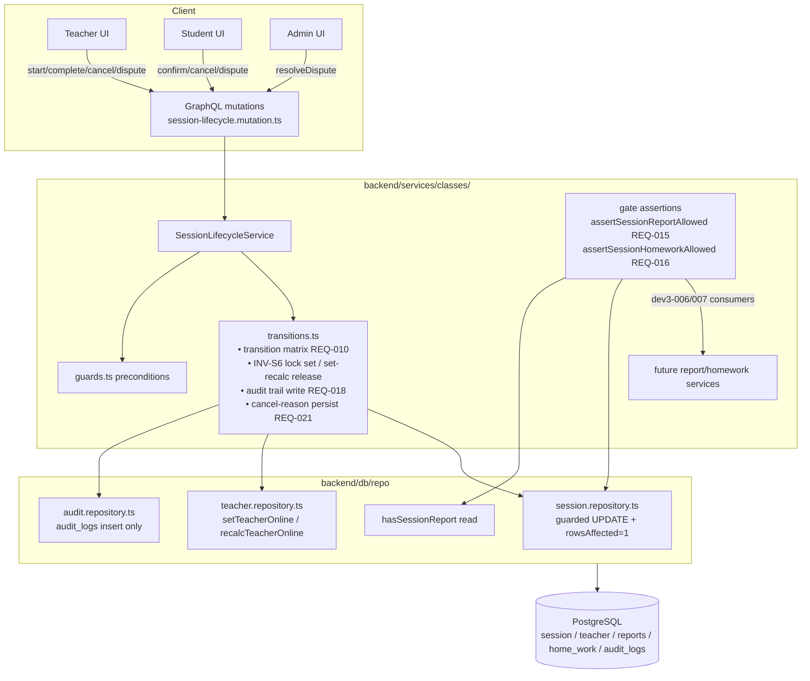

# DEV3-005 — Session Status State Machine Enforcement — Plan

**Plan directory:** `ai/plans/sprint_1/dev3-005-session-status-state-machine-enforcement/`
**Companion docs:** `specs.md`, `tasks.md`, `deferred-items.md`, `outcome/`

---

## 1. System Overview & Architecture

### Scope Statement (ground-truthed)

DEV3-004 already shipped: `SessionLifecycleService` with guarded transitions (`session-lifecycle.transitions.ts`), the `disputed` status + `openSessionDispute`/`resolveSessionDispute` admin arbitration (B.18), hold-as-debit + refund lanes, GraphQL mutations (`backend/graphql/mutation/classes/session-lifecycle.mutation.ts`), and session journey tests (`test/workflows/sessions/`). Reports/home_work **tables** exist (`backend/db/schema/classes/reports.ts`, `home-work.ts`) but no report/homework services exist yet (DEV3-006/DEV3-007).

This ticket therefore **extends existing modules** — it does not create parallel ones:

- **NEW:** explicit transition matrix + `SessionInvalidTransitionError`; INV-S6 teacher online-lock (set on start, set-recalc release); INV-S7/INV-S8 gate functions exported for DEV3-006/007; `audit_logs` transition trail; cancel-reason persistence.
- **EXTEND:** `session-lifecycle.service.ts` / `transitions.ts` / `guards.ts`, `session.repository.ts`, `teacher.repository.ts`, existing mutations (behavior only, no new SDL).

### Architecture Diagram



### Key Design Decisions

| # | Decision | Rationale |
|---|---|---|
| K1 | Single explicit matrix constant (`TRANSITION_MATRIX`) keyed by `from→to` with allowed increment; illegal ⇒ `SessionInvalidTransitionError` | REQ-010; eliminates scattered `if (status !== …)` copies and makes the 25-pair test exhaustive |
| K2 | INV-S6 release via set-based recalc `is_online = NOT EXISTS (started sessions)` | REQ-013/014; race-safe and self-healing vs. counters/toggles |
| K3 | Lock + transition + audit row inside the existing guarded `tx` | Atomicity; no phantom "completed-but-still-online" window |
| K4 | Gates (`assertSessionReportAllowed`) exported from the lifecycle service, not re-implemented per consumer | Single gate — DEV3-006 cannot fork the INV-S7 rule |
| K5 | Audit trail reuses existing `audit_logs` (A.5), no new table | No migration churn; `entity_type='session'` keeps queries simple |
| K6 | No GraphQL/frontend additions; behavior changes land inside existing operations | Ticket is backend enforcement; UI already renders statuses |
| K7 | Cancel reason capped/trimmed at 500 (schema is varchar(500)) | Validation lives in service before repo write |

---

## 2. Data Models & Database Schema (ground-truth)

| Artifact | Status | Notes |
|---|---|---|
| `session` table w/ `status` enum incl. `disputed`, `cancel_reason varchar(500)`, `dispute_reason`, `resolution_note` | **EXISTING** | `backend/db/schema/classes/session.ts`; `backend/db/schema/enums.ts` |
| `session_status` enum: `scheduled, started, completed, cancelled, disputed` | **EXISTING** | B.18 shipped in DEV3-004 |
| `teacher.is_online boolean` | **EXISTING** | `backend/db/schema/teachers/teacher.ts` (read via `isOnline` in repo) |
| `reports`, `home_work` tables (+ grade CHECKs) | **EXISTING** | schema only; no repo/service yet |
| `audit_logs` table + `audit_action_type` enum | **EXISTING** | `backend/db/schema/audit/audit-logs.ts` — may need new enum values (`session_transition`) ⇒ **`bun run db` generate/push if enum extended** |
| Canonical types `SessionSelectType`/`SessionReturnType` | **EXISTING** | `backend/types/…` — reused, not redefined |

**Planned schema deltas:** at most, new `audit_action_type` enum value(s) for session transitions. No table changes.

---

## 3. API Contracts & Pothos Resolvers

No new operations. Existing mutations in `backend/graphql/mutation/classes/session-lifecycle.mutation.ts` gain enforcement side effects:

| Operation | authScopes | New behavior | Error codes |
|---|---|---|---|
| `startSession` | participant (teacher of session) | status `scheduled→started` + set `is_online=false` + audit row | `SESSION_NOT_FOUND`, `SESSION_FORBIDDEN`, `SESSION_INVALID_TRANSITION` |
| `completeSession` | teacher | `started→completed` + lock release recalc + audit | same |
| `cancelSession` | participant | + audit + reason persist (≤500 trimmed) + lock release if leaving `started` | same |
| `confirmSessionCompletion` | counterpart | existing DEV3-004 dual confirmation (unchanged) | same |
| `openSessionDispute` | participant | audit row; matrix rejects double-dispute | same |
| `resolveSessionDispute` | admin (REQ 2.3 BFLA) | `disputed→completed|cancelled`, outcome recorded, audit row with admin id + outcome | `UNAUTHORIZED` non-admin |

`extensions.code` mapping per the specs §2.5 table; all messages via `ctx.t("sessions")` (namespace already in `shared/locale/` — verify/add `sessions.transitions.*` keys, both locales).

---

## 4. Backend Services & Repositories

### 4.1 `SessionLifecycleService` additions (`backend/services/classes/session-lifecycle.transitions.ts`, `service.ts`, `guards.ts`)

```ts
// transitions.ts
export const TRANSITION_MATRIX: Readonly<Record<SessionStatus, readonly SessionStatus[]>>
export function assertTransitionAllowed(from: SessionStatus, to: SessionStatus): void   // throws SessionInvalidTransitionError

// NEW file backend/types? NO — error class lives with domain errors: backend/graphql or backend/lib errors per existing DomainError location (check existing: reuse file where NotFoundError/ForbiddenError live)
export class SessionInvalidTransitionError extends DomainError { code = "SESSION_INVALID_TRANSITION" }

// service-level (same tx as the guarded status write):
async function applyInSessionLock(teacherId: number, tx: DBTransaction): Promise<void>            // set is_online=false
async function releaseInSessionLock(teacherId: number, tx: DBTransaction): Promise<void>          // recalc (K2)
async function writeTransitionAuditRow(input: { sessionId: number; from: SessionStatus; to: SessionStatus; actorId: number; details?: JsonObject; outcome?: string }, tx): Promise<void>

// gates, exported for DEV3-006/007:
export async function assertSessionReportAllowed(sessionId: number, tx?: DBTransaction): Promise<void>
export async function assertSessionHomeworkAllowed(sessionId: number, tx?: DBTransaction): Promise<void>
```

Wiring (all inside the existing guarded-transaction flow): `startSession` → lock; `completeSession`/`cancelSession`/`resolveSessionDispute` → release-if-leaving-`started` + audit; `openSessionDispute` → audit.

### 4.2 Repositories

```ts
// backend/db/repo/classes/session.repository.ts (EXTEND)
hasSessionReport(sessionId: number, tx?: DBTransaction|DBQueryExecutor): Promise<boolean>          // prepared statement (Drizzle Prepared 2.0)
getSessionStatusForGate(sessionId: number, tx?): Promise<SessionStatus | null>

// backend/db/repo/teachers/teacher.repository.ts (EXTEND)
setTeacherOnlineLock(teacherId: number, online: boolean, tx: DBTransaction): Promise<void>        // guarded write
recalcTeacherOnlineFromSessions(teacherId: number, tx: DBTransaction): Promise<void>              // K2 recalc

// backend/db/repo/audit (or existing location — verify): insert-only helper consuming audit_action_type
```

**Concurrency & race assessment (TOCTOU):**
- Transition + lock + audit all in one tx; guarded `WHERE status=:expected` makes two concurrent completers: first wins, second gets rowsAffected=0 ⇒ `SESSION_INVALID_TRANSITION`. ✔
- Concurrent completes of two different sessions of the same teacher: both recalc `NOT EXISTS(started…)`; second recalc sees first's committed state only if ordered — run recalc **inside the same tx** as the status flip; Postgres `READ COMMITTED` sees per-statement snapshot, so second tx's recalc after its own flip sees first tx committed ⇒ correct final state. A `chaos` test asserts final `is_online=true`.
- Lock-set on `startSession` and release never interleave falsely because release is conditional on zero-remaining, not on blind toggle.

### 4.3 Cross-Actor Journey Design

| Journey | State transitions | Side effects (per committed step) | Actor visibility |
|---|---|---|---|
| J-1 lock+report | scheduled→started→completed | lock=false@start; audit@both; lock recalc true@complete; gate pass post-complete | teacher sees own offline; student sees status |
| J-2 dispute arbitration | completed→disputed→completed (uphold) / →cancelled (refund) | audit rows: student open, admin resolve w/ outcome; refund lane restore per DEV3-004 on refund | admin reads trail; participants status |
| J-3 concurrent completes | start×2→completed×2 | lock stays false after first complete; true after second | booking surface reflects truth |
| J-4 late cancel w/ reason | started→cancelled(reason) | reason persisted; lock released; audit | both parties + admin |

Side-effect matrix always: (1) guarded status UPDATE ⇒ audit row ⇒ lock write/recalc, in one tx.

---

## 5. Frontend UX & Navigation Specification

**No frontend changes.** No new routes, no navItems changes, no new Apollo documents. Existing UIs (teacher session view, admin arbitration list `listAdminDisputedSessions`, student history) automatically benefit: statuses/audit-driven outcomes render via existing documents. The INV-S6 flag is *consumed* by DEV2-011/012 availability surfaces — this ticket only guarantees its correctness.

### Visual/state matrix (existing pages, sanity-only verification)
Empty/loading/error states unchanged; RTL parity verified by spot-check in BF loops of dev3-006 — **explicit non-goal here**.

---

## 6. Security & Tenancy Mitigations

| Threat | Mitigation |
|---|---|
| BOLA/IDOR (transition someone else's session) | participant checks in `guards.ts` (existing) re-verified by Tier-4 tests; gates take only sessionId, no user input beyond id |
| BOPLA | no `...input` spreads anywhere; only whitelisted `reason` (trimmed/capped) is written |
| BFLA | `resolveSessionDispute` admin-only authScope; Tier-4 test non-admin ⇒ `UNAUTHORIZED` |
| Privilege via lock | only the service transitions can write `is_online`; repo setter is `tx`-required and guarded by service call sites |
| Info disclosure | `SessionInvalidTransitionError` message is generic ("transition not allowed") — does not leak current status of other users' sessions |
| Audit integrity | append-only insert; no update/delete APIs on `audit_logs` |
