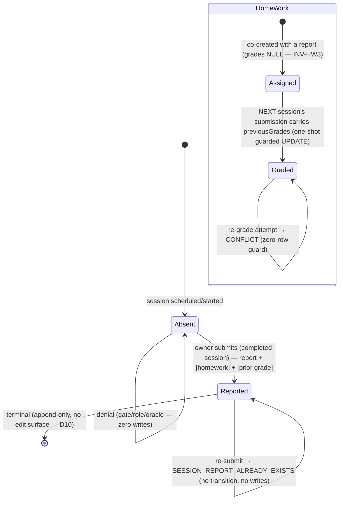

# Technical Architecture & Implementation Design: DEV3-006 — Session Report & Homework Infrastructure

> **Plan directory (verbatim, used by every header/ledger/self-reference):** `ai/plans/sprint_1/dev3-006-session-report-homework-infrastructure`
> **Specs of record:** `ai/plans/sprint_1/dev3-006-session-report-homework-infrastructure/specs.md` (REQ-001…REQ-072)
> **Ledger:** `ai/plans/sprint_1/dev3-006-session-report-homework-infrastructure/deferred-items.md`
> **Outcome dir:** `ai/plans/sprint_1/dev3-006-session-report-homework-infrastructure/outcome/`

---

## 1. System Overview & Architecture Diagram

DEV3-006 is an **infrastructure-only** ticket: the guarded report+homework write surface, the participant read surface, and the notification seam over the pre-existing `reports` / `home_work` tables. No UI ships (DEV2-014 owns the submission UX); the consumable contract is GraphQL + typed documents.

```
                          ┌────────────────────────────────────────────────────────────┐
                          │                         CLIENT                              │
                          │  (future DEV2-014 teacher submit form — NOT in this scope)  │
                          └──────────────┬─────────────────────────────────────────────┘
                                         │ Apollo Client (TypedDocumentNode documents)
                                         ▼
┌────────────────────────────────────────────────────────────────────────────────────────┐
│ GraphQL transport (app/api/graphql — transport guards, requestId, error finalizer)      │
├────────────────────────────────────────────────────────────────────────────────────────┤
│ Pothos resolvers                                                                        │
│  Mutation.submitSessionReport   authScopes { $all: { authenticated, role:[Teacher] } }  │
│  Query.sessionReport            authScopes { authenticated: true }                      │
│  Query.sessionHomework          authScopes { authenticated: true }                      │
├────────────────────────────────────────────────────────────────────────────────────────┤
│ SessionReportService (backend/services/classes/session-report.service.ts)               │
│  0. pre-DB validation (id shape, notes, rating, blocks, grades, SurahJuzRef guard)      │
│  1. governance re-check — assertActorGovernanceClean (session-lifecycle.governance.ts)  │
│  2. withTransaction:                                                                    │
│     2a. session gate: FOR UPDATE lock + probe (owner? completed?)                       │
│     2b. report INSERT  (UNIQUE(reports.session_id) arbiter; 23505 ⇒ ALREADY_EXISTS)     │
│     2c. prior-homework grade routing (newest ungraded row, one-shot guarded UPDATE)     │
│     2d. homework INSERT (when assignment block present)                                 │
│     2e. notifications via NotificationEngine.emitForUser (in-tx; receipts out)          │
│  3. publishReceipts AFTER commit                                                        │
├────────────────────────────────────────────────────────────────────────────────────────┤
│ Repositories (tx always propagated)                                                     │
│  ReportRepository.insertReport / findBySessionId                                        │
│  HomeWorkRepository.insertHomeWork / findBySessionId /                                  │
│      findLatestUngradedByStudentId / gradeHomeWorkOnce (guarded WHERE grades IS NULL)   │
│  SessionRepository.findTransitionProbe (REUSE) + lockForReportGate (NEW, FOR UPDATE) +  │
│      findReportWaveContextById (NEW — student + teacher + linked-parent join)           │
├────────────────────────────────────────────────────────────────────────────────────────┤
│ PostgreSQL: reports (one-per-session UNIQUE), home_work (grade-nullability relaxed,     │
│             one-per-session UNIQUE), notifications (NotificationEngine single-writer)   │
└────────────────────────────────────────────────────────────────────────────────────────┘
```

### Key Design Decisions Table

| # | Decision | Options Considered | Pros / Cons | Rationale (Maintainability, Scalability, Reliability) |
|---|---|---|---|---|
| D1 | **Unique-constraint arbiter** for one-report-per-session: add `reports_session_id_unique` via `bun run db push`; 23505 ⇒ `ConflictError("SESSION_REPORT_ALREADY_EXISTS", …)` via cause-chain traversal. | (a) SELECT-then-INSERT guard; (b) guarded UPDATE pre-check; (c) DB unique (chosen). | (a) has a TOCTOU hole and fails the double-submit storm; (b) is write-to-read misuse; (c) is race-proof, zero-window, mirrors `session_request_idempotency` claim-table pattern shipped in DEV3-004 and the `parent_link_requests_pending_pair_unique` arbiter in DEV1-014. | Reliability: the DB is the only trustworthy arbiter under connection-level concurrency. Scalability: one index. Maintainability: one canonical mapping site via `isUniqueViolation` (`backend/services/shared/user-provisioning.helpers.ts`). |
| D2 | **Session gate uses one `SELECT … FOR UPDATE` row lock** (`SessionRepository.lockForReportGate`), then predicate classification. | (a) plain probe read (reuse `findTransitionProbe`); (b) FOR UPDATE lock (chosen); (c) guarded predicate UPDATE-style trick. | (a) leaves a TOCTOU window against concurrent dispute-arbitration status flips (B.18 surface); (b) serializes status mutation vs. gate read on the same row; (c) misapplies the transition pattern — report submission does not mutate `session`. | Reliability: closes the cancel/dispute-vs-report race. Cost: one row lock held for milliseconds, only inside our own tx — no cross-surface deadlock risk because we are the only service locking `session` rows under this name (verified against bundled `session.repository.ts`: no FOR UPDATE on `session` today). |
| D3 | **Replay-throw, never replay-return** for duplicate submissions: a second submit resolves `SESSION_REPORT_ALREADY_EXISTS` (409), never returns the existing report. | (a) return existing row (idempotent read-back); (b) throw (chosen). | (a) would mask a logic bug (double-click vs genuine confusion) and contradicts the DEV3-004 replay-throw ruling (`docs/sessions/session-lifecycle.md` §6, §9a). (b) keeps the surface honest; the client maps 409 → informational notice via the error-link contract. | Consistency with the session-booking replay ruling; identical user experience for double-submits platform-wide. |
| D4 | **Grade routing order: grade-the-prior-row BEFORE inserting the new assignment**, inside the same tx; grade target = newest ungraded row of the student via `findLatestUngradedByStudentId` + one-shot guarded `gradeHomeWorkOnce` (`WHERE … AND current_grade IS NULL AND revision_grade IS NULL`). | (a) insert-then-grade (broken — the just-inserted row wins "newest ungraded"); (b) grade-before-insert (chosen); (c) grade the explicitly referenced prior session id (adds an identity input — BOLA surface). | (a) self-grades the new row; (c) accepts caller-supplied homework identity (oracle/tamper risk). (b) is correct and needs no identity input. | Reliability: INV-HW3/HW4 structurally enforced; re-grade attempts hit the zero-row guarded miss. Maintainability: no request-time identity beyond the session id. |
| D5 | **First-session = no-op, not an error** when no prior ungraded homework exists and `previousGrades` is present? — NO: `previousGrades` with NO prior ungraded row ⇒ no-op ONLY when `previousGrades` is absent; if `previousGrades` present but there is nothing to grade, the grades are **validated then discarded with the submission succeeding** (assignment-only arms stay valid). Edge resolution chosen: presence of `previousGrades` with zero gradeable rows is silently absorbed only when the session is genuinely the first (no prior homework rows at all); when prior rows exist but are already graded, the one-shot guard yields `null` ⇒ `ConflictError` (`CONFLICT`, localized `homeworkAlreadyGraded`). | (a) always error when grades have no target; (b) always silently absorb; (c) split (chosen). | (a) breaks the genuine first-session payload shape teachers will send from one form; (b) silently swallows a re-grade attempt, hiding the write-once rule (INV-HW4). | Preserves INV-HW3 (first session: no grades to record) while keeping the write-once semantics loud and typed. |
| D6 | **Notification seam: one module function `notifySessionReportReady(sessionId, locale, tx, options)`** reading the wave context once (student + teacher + linked parent via one joined read) and emitting up to two rows via `NotificationEngine.emitForUser`, receipts returned; the service publishes via `NotificationEngine.publishReceipts` strictly after its own commit. | (a) two exported emitters with two context reads; (b) one function, one read (chosen); (c) fold into `session-request-notification.service.ts`. | (a) doubles the wave-context read; (c) muddles that module's six-wave taxonomy (request lifecycle) with report lifecycle. | Follows the shipped pattern (`docs/notifications/session-request-notifications.md`) — emitters own recipient-locale composition; engine stays single-writer; publish-after-commit is structural. Idempotency key `session:{id}:report` per REQ-018; engine claim digests differentiate recipients because the digest binds the recipient id set (`buildEmitClaimKey`). |
| D7 | **`SurahJuzRef` Pothos enum registered ONCE** in `backend/graphql/pothos/shared/enum.pothos.ts` (enum-object form), plus a new fail-closed guard `isSurahJuzRef` added to `backend/enum/shared/surah-juz-ref.enum.ts` (mirrors `isApplicantStatus`/`isSessionIntent` pattern). | (a) hand-write SDL values; (b) register real TS enum (chosen); (c) reuse `String` on the wire. | (a)/(c) break the enum-object registration mandate and codegen parity. | Hard rule from the gateway/API-gateway surface discipline; exhaustive mappers become compile-guarded. |
| D8 | **No new custom domain code beyond `SESSION_REPORT_ALREADY_EXISTS`** — journey step 10's re-grade conflict rides plain `ConflictError(message)` (fixed code `CONFLICT`); reads collapse to `null`. | (a) mint `HOMEWORK_ALREADY_GRADED`; (b) reuse `CONFLICT` (chosen). | (a) contradicts specs §2.5 ("the only NEW code is SESSION_REPORT_ALREADY_EXISTS"); (b) satisfies "typed conflict" via the class + localized message from the flat `errors` namespace without touching the taxonomy freeze. | Honors the closed-taxonomy rule in `docs/graphql/error-handling-contract.md` and the spec's own code budget. |
| D9 | **Reads return `null` for foreign/nonexistent** (oracle collapse), writes throw `SESSION_NOT_FOUND` — verbatim reuse of the DEV3-004 sensitive-domain ruling. | (a) distinguishable 403 on foreign; (b) collapse (chosen). | Sessions/reports leak balances-adjacent context + participant identity; per `docs/sessions/session-lifecycle.md` §7 the collapse is non-negotiable. | Security ruling consistency; one test oracle reproves it at the wire tier. |
| D10 | **No report edit/update/void surface.** Submission is append-only truth (permanent retention, PRODUCTION_READINESS §1.4); corrections are compensating artifacts owned by a future ticket. | (a) add update mutation now; (b) append-only (chosen). | (a) re-opens dispute-evidence integrity (Workflow 03 §7). | Data-integrity rules in `docs/specs/functional-requirements.md` §11; keeps this ticket's state machine trivially safe. |
| D11 | **No UI / no nav change in this ticket** — only typed GraphQL documents land frontend-side. | (a) ship a minimal submit form; (b) documents only (chosen). | (a) would collide with DEV2-014's UI ticket and duplicate i18n/copy work twice. | Specs §1 non-goals are explicit; the consumable contract is the documents module + codegen types. |

---

## 2. Data Models & Database Schema

### 2.1 Existing schema verification (hard gate before ANY schema edit)

Bundled-code anchors that ARE provable in this context:

- `backend/db/schema/classes/reports.ts` exists; its import surface is `check, index, integer, pgTable, text, timestamp` + `session` FK import — **no `unique`/`uniqueIndex` import, no `teacher_id` import** (C.4 posture holds by construction evidence).
- `backend/db/schema/classes/home-work.ts` exists; imports `check, index, integer, pgTable, timestamp` + `surahJuzRef` from `@/backend/db/schema/enums` — **no `unique` import** (so no unique constraint on `session_id` exists today).
- `backend/types/classes/report.types.ts` and `backend/types/classes/home-work.types.ts` exist with `Select/Insert` pairs only (`ReportSelectType`, `ReportInsertType`, `HomeWorkSelectType`, `HomeWorkInsertType`).
- `backend/enum/shared/surah-juz-ref.enum.ts` exists (35 members: 5 surah + 30 juz) and has **no `isSurahJuzRef` guard** (bundle shows only the enum).
- `surahJuzRef` pgEnum is already registered in `backend/db/schema/enums.ts` (imported by `home-work.ts`).

**NOT provable from the bundle (must be verified in Task 1.x before any claim):**

| Verification | Where | If false → action |
|---|---|---|
| R1: `reports.session_id` has NO unique constraint | importers prove absence; confirm by reading `reports.ts` body | ADD `unique("reports_session_id_unique")` on `sessionId` (push-only) |
| R2: `home_work.current_grade` / `revision_grade` are NULLABLE | read `home-work.ts` body | If NOT NULL ⇒ relax to nullable via `bun run db push` (prerequisite of REQ-015 / INV-HW3) |
| R3: `home_work.session_id` has NO unique constraint | importers prove absence; confirm by body read | ADD `unique("home_work_session_id_unique")` (INV-S8 hardening; one assignment per session follows one-report-per-session) |
| R4: `reports.teacher_id` absent | C.4 | Confirm; assert in a static test that the table config carries no `teacherId` column key |
| R5: existing CHECK constraints `reports.student_rating_by_teacher` 0–5, `home_work.*_grade` 0–100 present | read bodies | Keep as backstop; never the primary error path (service validates first per REQ-016) |
| R6: `session` row shape consumed (`id, status, teacherId, studentId, feeHeld`) matches `SessionSelectType` | `backend/types/classes/session.types.ts` (present in bundle) | No action expected; verification only |

**Migration discipline:** all changes are `bun run db push` ONLY (`docs/DATABASE_MIGRATIONS.md` — `cleanGenerate`/`reset` permanently disabled; no custom SQL needed since Drizzle expresses unique/nullable DDL). Zero rows are re-written; adding UNIQUE to empty-of-duplicate tables and relaxing NOT NULL→nullable is non-destructive.

### 2.2 Drizzle table modifications

`backend/db/schema/classes/reports.ts` (UPDATE — conditional on R1):

```ts
// table-cfg — ADD:
unique("reports_session_id_unique").on(t.sessionId),
```

`backend/db/schema/classes/home-work.ts` (UPDATE — conditional on R2/R3):

```ts
// columns — RELAX (only if NOT NULL today):
currentGrade: integer("current_grade"),          // nullable now
revisionGrade: integer("revision_grade"),        // nullable now
// table-cfg — ADD (only if no unique today):
unique("home_work_session_id_unique").on(t.sessionId),
```

No other table is touched. `session`, `students`, `users`, `notifications`, `wallet`, `teacher_transaction` are write-pure for this surface (REQ-044).

### 2.3 Enums

- `backend/enum/shared/surah-juz-ref.enum.ts` — UPDATE: add `isSurahJuzRef(value: unknown): value is SurahJuzRef` (pattern copied verbatim from `backend/enum/teachers/applicant-status.enum.ts`'s `isApplicantStatus`). No new members.
- `backend/db/schema/enums.ts` — NO change (`surahJuzRef` registered).
- `backend/graphql/pothos/shared/enum.pothos.ts` — UPDATE: register `SurahJuzRefPothosEnum = gqlSchemaBuilder.enumType(SurahJuzRef, { name: "SurahJuzRef" })` ONCE.

### 2.4 Canonical types (all changes in `backend/types/`, none elsewhere)

`backend/types/classes/report.types.ts` — EXTEND:

```ts
export type ReportReturnType = ReportSelectType;          // row-shaped, id-first consumer contract
export type HomeWorkGradeFieldsInput  = { currentGrade: number; revisionGrade: number };
export type HomeWorkBlockInput      = { fromAyah: number; toAyah: number; surahJuz: SurahJuzRef };
export type HomeWorkAssignInput     = { jadid?: HomeWorkBlockInput; madi?: HomeWorkBlockInput };
export interface SessionReportSubmitInput {
  readonly teacherNotes: string;
  readonly studentRatingByTeacher: number;
  readonly homework?: HomeWorkAssignInput;
  readonly previousGrades?: HomeWorkGradeFieldsInput;
}
```

`backend/types/classes/home-work.types.ts` — EXTEND:

```ts
export type HomeWorkReturnType = HomeWorkSelectType;
```

`backend/types/classes/session-notification.types.ts` — EXTEND (notification wave context; existing file, additive):

```ts
export interface SessionReportWaveParticipant extends SessionWaveParticipantContext {}
export interface SessionReportWaveContext {
  readonly sessionId: number;
  readonly student: SessionReportWaveParticipant;
  readonly teacher: SessionReportWaveParticipant;
  readonly parent: SessionReportWaveParticipant | null;   // null ⇒ unlinked (INV-P1)
}
export interface SessionReportWaveContextRow { /* sessionId + student/teacher/parent joined raw row shape */ }
```

Barrels: `backend/types/classes/index.ts` re-exports (existing barrel — one-line additions). **No service-layer `.types.ts` files may be created.**

---

## 3. API Contracts & Pothos Resolvers

### 3.1 SDL additions (authoritative shape; generated via `bun run generate:gqlSchema` + `bun codegen`)

```graphql
type SessionReport {
  id: ID!
  sessionId: Int!
  teacherNotes: String!
  studentRatingByTeacher: Int!
  createdAt: DateTime!
  updatedAt: DateTime!
}

type SessionHomeWork {
  id: ID!
  sessionId: Int!
  currentFromAyah: Int
  currentToAyah: Int
  currentGrade: Int
  currentSurahJuz: SurahJuzRef
  revisionFromAyah: Int
  revisionToAyah: Int
  revisionGrade: Int
  revisionSurahJuz: SurahJuzRef
  createdAt: DateTime!
  updatedAt: DateTime!
}

input HomeWorkBlockInput { fromAyah: Int!, toAyah: Int!, surahJuz: SurahJuzRef! }
input HomeWorkGradeInput { currentGrade: Int!, revisionGrade: Int! }
input HomeWorkAssignmentInput { jadid: HomeWorkBlockInput, madi: HomeWorkBlockInput }

input SubmitSessionReportInput {
  teacherNotes: String!
  studentRatingByTeacher: Int!
  homework: HomeWorkAssignmentInput
  previousGrades: HomeWorkGradeInput
}

extend type Mutation {
  submitSessionReport(id: ID!, input: SubmitSessionReportInput!): SessionReport!
}
extend type Query {
  sessionReport(sessionId: ID!): SessionReport
  sessionHomework(sessionId: ID!): SessionHomeWork
}
```

Notes:
- Timestamp fields use `type: "DateTime"` (the registered scalar — `backend/graphql/pothos/shared/scalar.pothos.ts`); NO `toISOString()`-into-String workaround.
- `id` is exposed FIRST on both objects (Apollo normalization).
- Enum fields resolve through exhaustive DB-string → `SurahJuzRef` mappers with the `const exhaustive: never` tail (pattern from `session.pothos.ts` `toSessionStatus`).
- Both inputs are closed whitelists: unknown members die as `GRAPHQL_VALIDATION_FAILED` pre-resolver.
- **Public-operations allowlist is NOT touched** — all three fields are authenticated.

### 3.2 Resolver modules

| File | Contents |
|---|---|
| `backend/graphql/pothos/classes/report.pothos.ts` (NEW) | `SessionReportPothosObject` |
| `backend/graphql/pothos/classes/home-work.pothos.ts` (NEW) | `SessionHomeWorkPothosObject` |
| `backend/graphql/pothos/classes/session-report-input.pothos.ts` (NEW) | `HomeWorkBlockInput`, `HomeWorkGradeInput`, `HomeWorkAssignmentInput`, `SubmitSessionReportInput` |
| `backend/graphql/mutation/classes/session-report.mutation.ts` (NEW) | `submitSessionReport` — thin resolver: `!ctx.user` narrowing guard; `authScopes: { $all: { authenticated: true, role: [UserRole.Teacher] } }`; field-by-field hand-off (NO spread); delegates to `SessionReportService.submitSessionReport(ctx.user.id, id, input, ctx.locale, undefined, { transport/cache passthrough allowed })`. |
| `backend/graphql/query/classes/session-report.query.ts` (NEW) | `sessionReport`, `sessionHomework` — `authScopes: { authenticated: true }`; `requirePositiveIntId`-style shape guard; delegate and return nullable row. |
| Barrels | `backend/graphql/pothos/classes/index.ts`(create-if-absent barrel line), `backend/graphql/mutation/classes/index.ts` (+1 import line), `backend/graphql/query/classes/index.ts` (+1 import line). |

**Error mapping:** all thrown `DomainError` subclasses propagate to the boundary finalizer with `extensions.code` + localized message; unexpected errors mask to `INTERNAL_SERVER_ERROR`. No resolver-level try/catch.

### 3.3 Rate limiting

Inherited fail-open platform stub (`backend/lib/ratelimit.ts`) — no new limiter behavior planned; recorded so the pentest wave does not flag the absence (REQ-033 posture).

### 3.4 Permission matrix

| Operation | Anonymous | Student (participant) | Student (foreign) | Teacher (owner) | Teacher (foreign) | Parent (linked) | Parent (other) | Admin |
|---|---|---|---|---|---|---|---|---|
| `submitSessionReport` | `UNAUTHORIZED` (401, pre-resolver) | `FORBIDDEN` (403, scope) | `FORBIDDEN` (403, scope) | ✅ transition (per state gate) | `SESSION_NOT_FOUND` (oracle per REQ-030) | `FORBIDDEN` | `FORBIDDEN` | `FORBIDDEN` (scope) |
| `sessionReport` | `UNAUTHORIZED` | ✅ row | `null` | ✅ row | `null` | `null` (even linked — DEV1-016 owns parent reads) | `null` | `null` |
| `sessionHomework` | `UNAUTHORIZED` | ✅ row | `null` | ✅ row | `null` | `null` | `null` | `null` |

---

## 4. Backend Services, Repositories & Concurrency Model

### 4.1 Repositories

**`backend/db/repo/classes/report.repository.ts` (NEW)** — every method takes `tx` last:

```ts
export async function insertReport(insert: ReportInsertType, tx?: DBTransaction): Promise<ReportSelectType>;
export async function findBySessionId(sessionId: number, tx?: DBQueryExecutor): Promise<ReportSelectType | null>;
```

**`backend/db/repo/classes/home-work.repository.ts` (NEW):**

```ts
export async function insertHomeWork(insert: HomeWorkInsertType, tx?: DBTransaction): Promise<HomeWorkSelectType>;
export async function findBySessionId(sessionId: number, tx?: DBQueryExecutor): Promise<HomeWorkSelectType | null>;
// newest-first join home_work → session by session.student_id, predicate grades-both-NULL, LIMIT 1
export async function findLatestUngradedByStudentId(studentId: number, tx?: DBTransaction): Promise<HomeWorkSelectType | null>;
// ONE guarded statement: UPDATE … SET current_grade=$1, revision_grade=$2, updated_at=now()
//   WHERE id=$3 AND current_grade IS NULL AND revision_grade IS NULL RETURNING *
export async function gradeHomeWorkOnce(id: number, grades: { currentGrade: number; revisionGrade: number }, tx?: DBTransaction): Promise<HomeWorkSelectType | null>;
```

**`backend/db/repo/classes/session.repository.ts` (EXTEND — two additive methods; existing methods untouched):**

```ts
// ONE statement: SELECT id,status,teacherId,studentId FROM session WHERE id=$1 FOR UPDATE (tx REQUIRED)
export async function lockForReportGate(sessionId: number, tx: DBTransaction): Promise<SessionTransitionProbeRowType | null>;
// joins session → users(student) + users(teacher) + students → LEFT users(parent);
// returns student/teacher/parent id+fullName+locale (+students.parentId)
export async function findReportWaveContextById(sessionId: number, tx?: DBTransaction): Promise<SessionReportWaveContextRow | null>;
```

Barrel updates: `backend/db/repo/classes/index.ts` (+ ReportRepository, HomeWorkRepository), root `backend/db/repo/index.ts` unchanged if it re-exports the classes barrel (verify; else +1 line).

**Drizzle discipline:** no `--` comments inside `sql` templates; no prepared-statement use with anything array-shaped; simple reads may use prepared statements per `docs/drizzle/prepared-statements.md` (id-equality reads qualify); all write paths are plain tx-bound calls.

### 4.2 Services

**`backend/services/classes/session-report.guards.ts` (NEW)** — pure validators, zero DB:

```ts
export function assertPositiveSessionId(id: unknown, t): asserts id is number;         // reuse pattern of session-lifecycle.guards
export function assertTeacherNotes(notes: string, t): string;                           // trim; non-empty; ≤2000
export function assertRating01To5(rating: number, t): number;                           // int, 0..5
export function assertGrade0To100(grade: number, t): number;                            // int, 0..100
export function assertBlock(block: HomeWorkBlockInput, t): void;                        // safe ints, from ≤ to, isSurahJuzRef
export function validateAssignment(input: HomeWorkAssignInput, t): void;                // ≥1 block present, both blocks cohesive
export function validatePreviousGrades(g: HomeWorkGradeFieldsInput, t): void;
```

**`backend/services/classes/session-report-notification.service.ts` (NEW)** — D6 seam:

```ts
// Reads the wave context ONCE, composes copy per recipient locale, emits:
//  - student (NotificationType.SessionCompletion, key `session:{id}:report`, related session)
//  - parent iff students.parent_id ≠ null (INV-P1 gate), same key (engine digest differentiates recipients)
// Returns NotificationDeliveryReceipt[] for the caller to publish after commit.
export async function notifySessionReportReady(
  sessionId: number, locale: string, tx: DBTransaction, options?: NotificationEngineCallOptions
): Promise<NotificationDeliveryReceipt[]>;
```

Copy slots (new in `notifications` namespace, en/ar + types + parity inventory): `eventSessionReportReadyTitle`, `eventSessionReportReadyBody(teacherName)` for the student and `eventSessionReportReadyParentBody(studentName, teacherName)` for the parent. Body interpolates names only — no grades, no notes content (privacy, REQ-019).

**`backend/services/classes/session-report.service.ts` (NEW)** — the business hub:

```ts
export async function submitSessionReport(
  teacherUserId: number, sessionId: number, input: SessionReportSubmitInput,
  locale: string, outerTx?: DBTransaction, options?: NotificationEngineCallOptions
): Promise<ReportReturnType>;

export async function getSessionReport(callerUserId: number, sessionId: number, locale: string, tx?: DBTransaction): Promise<ReportReturnType | null>;
export async function getSessionHomework(callerUserId: number, sessionId: number, locale: string, tx?: DBTransaction): Promise<HomeWorkReturnType | null>;
```

`submitSessionReport` pipeline (strictly ordered — mirrors REQ-012/013/040/041):

```
0  pre-DB: id shape, notes, rating, blocks, grades        (VALIDATION — zero DB touch)
1  assertActorGovernanceClean(teacherUserId, t)           (service-tier governance re-check; FORBIDDEN)
2  withTransaction(outerTx):
   2a probe = SessionRepository.lockForReportGate(sessionId, tx)
        probe === null               → NotFoundError("SESSION", t.sessionNotFound)   // SESSION_NOT_FOUND
        probe.teacherId !== teacherId→ NotFoundError("SESSION", …)                   // oracle-identical (REQ-030)
        probe.status !== completed   → ConflictError("SESSION_INVALID_TRANSITION", …)// reused code, incl. cancelled/disputed (REQ-034)
   2b report = ReportRepository.insertReport(fieldByField({ sessionId, teacherNotes, studentRatingByTeacher }), tx)
        catch 23505 → ConflictError("SESSION_REPORT_ALREADY_EXISTS", t.sessionReportAlreadyExists)  (isUniqueViolation traversal)
   2c if input.previousGrades:
        target = HomeWorkRepository.findLatestUngradedByStudentId(probe.studentId, tx)
        if target === null:
            priorRowsExist ? —  (determined by one count-less read: the same repo exposes
                             findLatestByStudentIdAnyGrade? NO — design keeps ONE method and resolves:
                             grade attempt against an already-graded prior row surfaces as guarded miss)
        if target !== null:
            graded = HomeWorkRepository.gradeHomeWorkOnce(target.id, grades, tx)
            graded === null → ConflictError(t.homeworkAlreadyGraded)          // plain CONFLICT (D8)
   2d if input.homework:
        HomeWorkRepository.insertHomeWork(fieldByField({ sessionId, …blocks mapped to current_*/revision_* }), tx)
        (its 23505 also maps to SESSION_REPORT_ALREADY_EXISTS — a homework row without a prior report
         cannot be reached; mapping is cause-chain scoped to the reports constraint name when both present)
   2e receipts = notifySessionReportReady(sessionId, locale, tx, options)
   return { report, receipts }
3  NotificationEngine.publishReceipts(receipts, locale, options)   // strictly AFTER commit; rollback ⇒ zero pushes
4  return report
```

Read paths (`getSessionReport`/`getSessionHomework`): validate id shape pre-DB; then ONE guarded read `WHERE report.session_id = $1 AND EXISTS (SELECT 1 FROM session s WHERE s.id = $1 AND (s.teacher_id = $2 OR s.student_id = $2)) LIMIT 1` composed either as a repo join or service-composed two reads (session probe reuse is the cheaper, already-shipped primitive: `findTransitionProbe` + participant check ⇒ then `ReportRepository.findBySessionId(tx)`). Zero writes. Foreign ≡ nonexistent ⇒ `null`.

**BOPLA:** every insert is field-by-field from validated service state; `sessionId`/`studentId`/`teacherId` never come from client input.

**Logging:** every denial logs exactly ONE `logger.logDomainError` with `{ code, entity: "session"|"reports"|"home_work", entityId, locale }`; happy paths log nothing; `console.*` never.

### 4.3 Concurrency & Race Condition Assessment

| Scenario | Actors | Risk | Mitigation |
|---|---|---|---|
| Double-submit storm (same teacher, same session, parallel) | teacher ×N connections | duplicate report rows / duplicate notifications | D1: `reports_session_id_unique` + 23505 translation; loser aborts its whole tx ⇒ zero rows, zero in-tx emits; publish structurally unreachable. |
| Two distinct teachers racing on the same session | foreign + owner | foreign row | Gate: `teacherId` predicate belongs to the locked probe classification — only owner's write proceeds; foreign ⇒ `SESSION_NOT_FOUND` (no write anywhere). |
| Report vs concurrent dispute-arbitration status flip (B.18) | teacher vs admin | report lands on a session that flipped to `disputed`/`cancelled` mid-gate | D2 FOR UPDATE lock on the session row serializes against any writer mutating that row; our read-and各县gate is atomic under the row lock. Accepted residual: an arbitration that locks AFTER our commit is legitimately sequenced later. |
| Grade race: two sessions report "previous homework" concurrently for the same student | two teachers | double grade write / lost update | `gradeHomeWorkOnce` guarded `WHERE … grades IS NULL` — loser matches zero rows ⇒ typed `CONFLICT`. TOCTOU window zero by construction (predicate+mutation in one statement). |
| First-session no-op absorption vs. grade discard | teacher | silently dropped grade | D5 splits: prior rows exist-but-graded ⇒ typed conflict; truly none ⇒ valid no-op (INV-HW3). |
| Notification publish vs rollback | service | ghost push | Engine receipt composition: emissions in-tx; `publishReceipts` after own commit only. Middle-failure ⇒ zero notifications rows and zero pushes (chaos test weaponizes this). |
| Idempotent client retry after commit | client | duplicate notify | Engine claim (`SET NX EX` semantics) keyed `session:{id}:report` + recipient digest ⇒ replay returns stored receipt, zero new rows. |
| Cross-service: `cancelSession` refund racing report submission | lifecycle service vs ours | none | We never write `session.fee_held`/lanes (REQ-044); we hold the row lock only for reads+ournone-session tables — refund path unaffected. |

**TOCTOU guarantees:** (1) gate: FOR UPDATE row lock; (2) one-report: unique constraint; (3) grade-once: guarded UPDATE predicate. No read-then-write survives unsynchronized.

**No Redis/advisory locks** on this surface (mirrors the session-lifecycle ruling: Postgres primitives suffice; `docs/sessions/session-lifecycle.md` §2.7 precedent).

### 4.4 Cross-Actor Journey Design (specs §2.9)

**Shared-entity state machine** — two entities:



| Transition | Driving actor | Guards | Rows written | Notifications emitted (channel → recipient) | Idempotency |
|---|---|---|---|---|---|
| Absent → Reported (first session, no grades) | owning certified teacher | role `$all` scope + governance re-check + owner + `status=completed` + 23505 arbiter | 1 `reports`, 1 `home_work` (grades NULL), 2 `notifications` (student + linked parent) | inbox+realtime → student (own locale); inbox+realtime → parent if linked (own locale) | `session:{id}:report` engine claim per recipient |
| Absent → Reported (subsequent, w/ previousGrades) | owning teacher | same + one-shot grade guard | 1 `reports`, 1 `home_work` (grades NULL), 1 `home_work` UPDATE (prior row grades), 2 `notifications` | same | same |
| → denied (foreign/wrong-state/duplicate/invalid) | any | respective guard | ZERO rows everywhere | ZERO notifications | the 23505/conflict path emits nothing |

**Side-effect matrix per journey step (specs §2.9 ordered list):**

| Step | Actor → action | `reports` rows | `home_work` rows | `notifications` rows | Publishes (spied transport) | Denial |
|---|---|---|---|---|---|---|
| 2 foreign teacher submits σ | — | 0 | 0 | 0 | 0 | `SESSION_NOT_FOUND` |
| 3 student submits | — | 0 | 0 | 0 | 0 | `FORBIDDEN` |
| 4 owner invalid payload | — | 0 | 0 | 0 | 0 | `VALIDATION` ×N (pre-DB) |
| 5 owner valid submit σ (1st session, no grades) | +1 report | +1 assignment (NULL grades) | +1 (student), +1 (parent) | student×1, parent×1 | — |
| 6 owner re-submit σ | 0 | 0 | 0 | 0 | 0 | `SESSION_REPORT_ALREADY_EXISTS` |
| 7 student reads σ | — (read) | — | — | — | row returned | — |
| 8 parent reads σ | — (read) | — | — | — | `null` byte-identical to foreign read | — |
| 9 owner submits σ₂ with grades | +1 report | +1 assignment σ₂ (NULL grades); σ's row UPDATED grades | +1 student, +1 parent | student×1, parent×1 | — |
| 10 owner re-grades σ | 0 | 0 | 0 | 0 | 0 | `CONFLICT` (already graded) |
| 11 forced mid-tx failure (homework insert fails after report) | 0 | 0 | 0 | 0 | 0 | masked/internal at wire; journey asserts unit rollback |

**Cross-actor visibility table:**

| After step | Owning teacher sees | Session student sees | Linked parent sees | Foreign teacher / admin sees |
|---|---|---|---|---|
| 5 committed | report+homework via participant reads | report+homework; 1 notification (own locale) | 1 notification (own locale); reads still `null` | `null` everywhere |
| 6 | unchanged; conflict error only | unchanged; NO 2nd notification | unchanged; NO 2nd notification | unchanged |
| 9 | σ row graded once; σ₂ assignment ungraded | same visibility; notifications ×1 each for σ₂ | ×1 for σ₂ | `null` everywhere |
| 10 | typed conflict | unchanged | unchanged | unchanged |

These rows are the literal assertion set of `test/workflows/classes/session-report-homework.journey.test.ts`, written TEST-FIRST.

---

## 5. Frontend UX & Navigation Specification

**This ticket ships NO UI (specs §1 non-goals; D11).** The frontend deliverable is the consumable typed-documents contract; UX surfaces belong to DEV2-014 (submit UX), DEV2-015 (Surah/Juz UI), DEV1-016/017 (parent portal).

### Routes & URLs Table

| Path | Purpose | Required permission | Allowed roles |
|---|---|---|---|
| — (none added) | No new routes; existing dashboards untouched | n/a | n/a |

### Sidebar & Navigation Integration

No change. Verified against the bundled `frontend/views/dashboard/nav/navItems.ts`: no Homework/Reports item is claimed or retargeted by this ticket (DEV2-014 will retarget any catch-all `ComingSoon` item at its own time). **No mobile bottom-nav work exists anywhere (none exists in the codebase).**

### Per-Audience Rendering Table

| Audience | This ticket |
|---|---|
| Student | consumes `sessionReport`/`sessionHomework` reads in a future UI; this ticket ships only the documents + null-collapse semantics |
| Parent | no read surface (null by design); receives notification only (side effect) |
| Teacher | future submit form consumes `submitSessionReportMutationDocument` |
| Supervisor/Admin | nothing (governance reads stay on DEV3-021's surface) |

### Apollo GraphQL Documents & UI Components

**`frontend/graphql/sharedDocuments/scheduling/session-report.documents.ts` (NEW):**

```ts
export const submitSessionReportMutationDocument: TypedDocumentNode<SubmitSessionReportMutation, SubmitSessionReportMutationVariables>;
export const sessionReportQueryDocument: TypedDocumentNode<SessionReportQuery, SessionReportQueryVariables>;
export const sessionHomeworkQueryDocument: TypedDocumentNode<SessionHomeWorkQuery, SessionHomeWorkQueryVariables>;
```

Selection rules (pinned by document tests): `id` selected FIRST on every object selection; `createdAt/updatedAt` ride `DateTime` (codegen maps to `string`); enum fields select as `SurahJuzRef` codegen members; no field beyond the object contract is requested.
Barrels: `frontend/graphql/sharedDocuments/scheduling/index.ts` (+3 exports) and `frontend/graphql/sharedDocuments/index.ts` unchanged if it re-exports the scheduling barrel (otherwise +1 line).
**Apollo cache:** no registration change — both objects carry `id` and normalize naturally; no embedded/result-envelope types on this surface, so no `keyFields: false` addition to `frontend/providers/apollo/apolloCache.ts`.

### Visual Design & Responsive Specifications

- **Breakpoints / components / states:** N/A — zero components ship. Forward note for DEV2-014: follow the MUI v9 `sx`-only, `*Outlined` icons, palette-token discipline; teacher submit form is a desktop-first (1440px) form with a mobile (375px) stacked variant; Arabic RTL requires start/end alignment and RTL-safe date/ayah formatting.
- **RTL/i18n:** all user-facing copy of THIS ticket is server-side (errors + notification copy) in `shared/locale` with en/ar parity; client documents carry no copy.
- **Agent-Browser Verification Protocol:** deferred to DEV2-014 (no page exists to screenshot). This ticket's functional verification is through the GraphQL wire suites + journey suite; verification steps for live browsing will assert zero drift on `/student/dashboard`, `/teacher/dashboard` only as regression smoke (no new visual surface expected).

---

## 6. Security, Authorization & Tenancy Mitigations

- **BOLA / IDOR:** `ctx.user.id` is the ONLY actor identity; session id is the only caller-supplied identifier and is re-validated pre-DB (positive-safe-int), then classified via the locked probe. Foreign/unknown ⇒ `SESSION_NOT_FOUND` on writes, `null` on reads — byte-identical (D9; verified by wire tests asserting byte-equality of the two error/null shapes).
- **BFLA:** $all conjunction `{ authenticated: true, role: [UserRole.Teacher] }` on the mutation; service-layer re-asserts governance via `assertActorGovernanceClean` (because `createGraphQLContext` applies no governance filter per the known substrate reality — the defense-in-depth is REQUIRED, REQ-012/031). Queries carry `{ authenticated: true }` and rely on participant scoping — there is no participant-agnostic path.
- **BOPLA:** closed input objects (`SubmitSessionReportInput` whitelist); service maps field-by-field into `ReportInsertType`/`HomeWorkInsertType`; server-controlled fields (`id`, `sessionId`, `createdAt`, `updatedAt`, grades at assignment time) are structurally unreachable from input. Smuggled fields die as `GRAPHQL_VALIDATION_FAILED` pre-resolver (pinned by smuggle-probe tests).
- **Injection / LIKE:** N/A by construction (REQ-033): no search/LIKE surface; ids are bound parameters only; `teacherNotes` is stored verbatim via parameterized insert and rendered inert by React escaping.
- **Privacy / error disclosure:** notification bodies carry names only (no grades/notes, REQ-019); denials use identical generic localized copy; logs are bounded `{ code, entity, entityId, locale }` — never note content, never recipient PII, never the grade values.
- **Governance:** governed teacher ⇒ `FORBIDDEN` pre-DB on submit (service re-check); reads do not need a governance re-check (reads are participant-limited and expose nothing beyond the caller's own session); historical rows are preserved regardless of later governance flips (INV-U1/U5).
- **Audit:** ZERO `audit_logs` rows — this is a non-admin workflow (specs alignment with A.5 + the parent-link no-audit precedent); statically pinned so the omission is a decision, not a gap.

---

## Rolling out — materialization checklist the tasks will cite

- Schema (push-only): verify-conditional unique on `reports.session_id` (+ `home_work.session_id`), grade-nullability relaxation (verification tasks R1–R6 first).
- New backend files: 2 repositories, 1 service, 1 guards module, 1 notification module, 2 Pothos objects, 1 input module, 1 mutation, 1 query + barrels; enum guard + Pothos enum registration; types extensions.
- i18n: errors keys `sessionReportAlreadyExists`, `homeworkAlreadyGraded`, validation keys (notes/rating/grade/ayah-range/surah-guard); notification slots `eventSessionReportReady*`; parity suites updated.
- Frontend: `session-report.documents.ts` + barrels + document-contract tests; `bun run generate:gqlSchema` + `bun codegen`; `schema-surface.test.ts` baseline refresh; SDL assertions for the new types/fields/enum.
- Tests: repo suites, service 4-tier suite, chaos (double-submit storm + forced mid-tx rollback), GraphQL wire matrix, journey (`test/workflows/classes/session-report-homework.journey.test.ts`, **test-first**) with committed fixtures + tracked `afterAll`, `SpiedFanoutTransport`-spied publishes.
- Docs/knowledge: `docs/sessions/session-report-homework.md` canonical doc; REQ-072 amendment of `docs/sessions/session-lifecycle.md` §10 (INV-S7/S8 now landed here); AGENTS.md pointers; ledger at `ai/plans/sprint_1/dev3-006-session-report-homework-infrastructure/deferred-items.md` pre-seeded with D1 (full 114-surah enum expansion), D2 (parent read surface → DEV1-016), D3 (submit UX → DEV2-014), D4 (rating aggregation → DEV2-017), D5 (report amendment semantics — future compensating-artifact flow).
