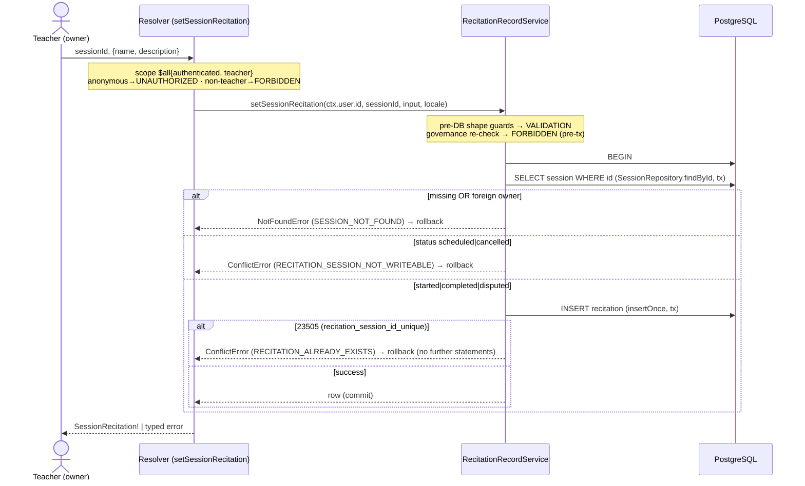

# Technical Architecture & Implementation Design: DEV3-007 — Recitation Record per Session (1:1)

**Plan directory (verbatim — all artifacts, ledger paths, and self-references in this plan use exactly this string):** `ai/plans/sprint_1/dev3-007-recitation-record-per-session-11`
**Ticket:** DEV3-007 · Sprint 1 · Dev 3 · 2 SP · Blocked-By satisfied (DEV3-004 shipped — `docs/sessions/session-lifecycle.md`)
**Binding anchors:** Decision **C.5** (`docs/specs/open-decisions-and-gaps.md`), session-domain oracle ruling (`docs/sessions/session-lifecycle.md` §7), permanent-retention rule (`docs/workflows/05-admin-governance-override.md` §8), Qira'ah non-resurrection guard (`docs/auth/qiraah-selection-and-c5.md` §6.1).

---

## 1. System Overview & Architecture Diagram

### 1.1 What this ticket ships

The `recitation` table **already exists and already enforces the 1:1 contract at rest** (`backend/db/schema/classes/recitation.ts:1-19` — `sessionId` NOT NULL FK `session.id` ON DELETE CASCADE, `recitation_session_id_unique`, content columns `name varchar(255) NOT NULL` + `description text NULL`, audit timestamps). What does not exist is any **behavioral surface**: no repository, no service, no GraphQL field, no read path, no document. This ticket ships the single-writer / participant-only-reader seam — and nothing else.

| Shipped | NOT shipped (negative registry) |
|---|---|
| `RecitationRepository` (closed 2-method namespace) | update / delete / list methods — recitation is write-once (retention rule) |
| `RecitationRecordService.setSessionRecitation` (write pipeline) | no admin override surface (DEV3-021 owns) |
| `RecitationRecordService.getSessionRecitation` (collapse read) | no parent read surface (DEV1-016 owns portal projection) |
| Mutation `setSessionRecitation` + Query `sessionRecitation` | no UI page/form/nav (non-goal 3); no notification rows; no audit rows |
| Two typed shared documents + barrels | no `apolloCache.ts` change (frozen policy surface at `frontend/providers/apollo/apolloCache.test.ts:95-106`) |
| i18n: 2 flat error keys (`recitationAlreadyExists`, `recitationSessionNotWriteable`) | no dispatcher/error-map row (RECITATION_* codes are adopted locally by future forms) |
| Journey + wire + service + repo + SDL test tiers | no `X-Idempotency-Key` requirement (constraint arbiters; outside `docs/IDEMPOTENCY.md` mandated set) |
| Canonical doc `docs/sessions/recitation-record.md` | no schema change (`bun run db push` diff MUST be empty) |

### 1.2 Layered flow

```text
WRITE (teacher)                                    READ (participant)
─────────────────                                  ─────────────────
React form (future DEV3-006/DEV2-014)              Any participant view (future consumers)
        │                                                  │
        ▼                                                  ▼
setSessionRecitationMutationDocument          sessionRecitationQueryDocument
(frontend/graphql/sharedDocuments/            (id-first selection; nullable payload)
 scheduling/recitation.documents.ts)
        │                                                  │
        ▼ Apollo (POST /api/graphql)                       ▼
setSessionRecitation(sessionId, input)          sessionRecitation(sessionId)
$all{ authenticated, role:[Teacher] }           { authenticated }
        │                                                  │
        ▼ resolver (thin, field-by-field)                  ▼ resolver (thin)
RecitationRecordService.setSessionRecitation    RecitationRecordService.getSessionRecitation
guards → governance (pre-tx) → withTransaction  malformed→null; findById; participant gate;
  → findById → ownership → status → insert      → findBySessionId → row | null
        │                                                  │
        ▼                                                  ▼
RecitationRepository.insertOnce (tx)            RecitationRepository.findBySessionId
        │ 23505 → ConflictError(RECITATION_ALREADY_EXISTS) │
        ▼                                                  ▼
   PostgreSQL  recitation  (recitation_session_id_unique is the write-once arbiter)
```

### 1.3 Write-path sequence (mermaid)



### 1.4 Key Design Decisions

| # | Decision | Options Considered | Pros / Cons | Rationale (Maintainability · Scalability · Reliability) |
|---|---|---|---|---|
| 1 | **DB unique constraint IS the write-once arbiter**; `23505` decoded via cause-chain → `ConflictError("RECITATION_ALREADY_EXISTS", …)` | (a) constraint arbiter · (b) pre-check `findBySessionId` then insert · (c) upsert | (a) atomic, race-proof, zero TOCTOU / (b) raw TOCTOU hole — rejected · (c) silently rewrites — violates write-once permanence (Workflow 05 §8) | Single-statement insertion failure IS the race arbiter; mirrors the certified-teacher insert `23505`→`TEACHER_ALREADY_CERTIFIED` precedent (`backend/services/admin/cold-start-certification.service.ts:44-57`, `docs/admin/cold-start-certification.md` §2.7). Reliable by construction. |
| 2 | **Two-statement in-tx pipeline** (read session → insert) — NOT a fused `INSERT…SELECT … FROM session WHERE owner∧status` | two-statement vs fused single statement | fused is atomic but its zero-row RETURNING cannot distinguish {missing, foreign, not-writeable} without a follow-on probe, AND the probe must never feed a write (lifecycle rule) / two-statement is classifiable and honest | Ownership key (`session.teacher_id`) is immutable so the only window is STATUS flips — a post-decision transition is domain-coherent (the record honestly reflects decision-time reality; a cancelled-after-write session legitimately retains its record per retention law). Window documented, accepted. |
| 3 | **Read collapses to `null`** for {malformed id, nonexistent id, foreign caller} — never an error | null vs `SESSION_NOT_FOUND` error | null: no existence oracle, identical bytes; error would re-open the session enumeration channel | Direct inheritance of the sessions-are-sensitive ruling (`docs/sessions/session-lifecycle.md` §7 — "foreign ≡ nonexistent") and the precedent `SessionLifecycleService.getSessionById` return-null shape (`backend/services/classes/session-lifecycle.service.ts:178-194`). |
| 4 | **Status admissibility window = `started | completed | disputed`** | include scheduled? include cancelled? | scheduled = nothing happened yet → deny; cancelled = nothing happened / aborted → deny; disputed = happened, evidence needed (B.18) → admit | A recitation documents an occurred session. `disputed` retention supports arbitration evidence (docs/specs/state-machine-invariants.md INV posture + Workflow 03). |
| 5 | **NO `X-Idempotency-Key` requirement**; repeat write = typed conflict | key-bearing vs constraint-only | key adds a claim table + replay machinery for zero marginal safety (the unique index already serializes concurrency) vs conflict replay is free and honest | Recitation writes are outside the mandated key set of `docs/IDEMPOTENCY.md` (Student/Invoice/Class Instance/Payment). Mirrors the cold-start ruling: "conflict, not keys" (`docs/admin/cold-start-certification.md` §2.8). |
| 6 | **Reuse session-lifecycle guard/governance helpers verbatim** — `assertPositiveSafeSessionId`, `isPositiveSafeSessionId`, `assertActorGovernanceClean` | reuse vs rewrite twins | rewrite forks the REQ-054 proven guards; twins drift | Import from `backend/services/classes/session-lifecycle.guards.ts:24-34` and `…governance.ts:8-22`. Single source; existing suites keep pinning them. |
| 7 | **Mutation = teacher `$all` scope; Query = `authenticated` only, service-owned tenancy** | role-gate the query too? | role-gating the query would need a multi-role `$all` variant (`student`+`teacher`) — but parent/admin must also evaluate (to null); simplest honest wall is authenticated + service-side participant predicate | The query's whole contract is "collapse via participant predicate from the DB row" — the scope map only keeps anonymous callers out (401). Proven identical to `sessionById` (`backend/graphql/query/classes/session-lifecycle.query.ts:43-60`). |
| 8 | **GraphQL object named `SessionRecitation`** (not `Recitation`) | `Recitation` vs `SessionRecitation` | bare `Recitation` collides conceptually with the Qira'ah vocabulary (`RecitationReading`, `docs/auth/qiraah-selection-and-c5.md`) — future readers WILL conflate them | Names away from the Qira'ah domain. Payload fields `name`/`description` stay free text; NO recitation-reading linkage ever (C.5 is session-linkage; the Qira'ah doc §6.1 prohibition on user-linked rows stands). |
| 9 | **Zero notifications + zero audit rows in this slice**; enforced by source-pin + oracle tests | emit parent wave here? | parent-completion wave is DEV1-017's emitter; audit logs admin actions only (A.5) — a teacher authoring a record is not an admin action | Single-writer engine discipline (`docs/notifications/realtime-engine.md` REQ-010). The service source NEVER imports `NotificationEngine` or `AuditService` — pinned by a static test (pattern at `backend/services/classes/session-lifecycle.service.test.ts:957-1054`). |
| 10 | **Repository namespace is CLOSED at two methods** (`insertOnce`, `findBySessionId`) — no update/delete/list | ship `update` "just in case"? | a correction surface is a future audited, separately-designed ticket (deferred D1); the static namespace-key lock makes drift a failing test | Permanent retention + write-once is the domain rule; the cheapest correct enforcement is structural absence + a runtime key-set pin. |

**REQ cross-walk (plan section map):** REQ-001/002/003 → §1 scope + §2 types + §6 i18n · REQ-010-018 → §2 + §4 · REQ-030-035 → §3 + §6 · REQ-040-043 → §4 concurrency · REQ-050-053 → §3 error contract + §6 · REQ-060-065 → §3 + §5 · REQ-070-074 → §4.7 test surfaces · REQ-080/081 → §1 registry + knowledge-propagation note (§5.7/§7 of tasks phase).

---

## 2. Data Models & Database Schema

### 2.1 Existing schema verification (NO changes — verified against the bundled Drizzle schema, the sole structural ground truth)

`backend/db/schema/classes/recitation.ts` (lines 1-19) ALREADY defines:

| Column | Type / Nullability | Constraint role |
|---|---|---|
| `id` | `integer` PK `generatedAlwaysAsIdentity()` | row identity |
| `sessionId` (`session_id`) | `integer` NOT NULL, `.references(() => session.id, { onDelete: "cascade" })` | FK to owning session (C.5 — renamed from `user_id` historically) |
| `name` | `varchar(255)` NOT NULL | content column 1 |
| `description` | `text` NULL | content column 2 |
| `createdAt` / `updatedAt` | `timestamp` defaults + `.$onUpdate(() => new Date())` | audit stamps |
| — | `unique("recitation_session_id_unique").on(t.sessionId)` | **the 1:1 arbiter (23505 source)** |
| — | `index("recitation_session_id_idx").on(t.sessionId)` | read-path index |

Verification pins for the implementation phase: the unique constraint name in error chains is readable via the existing helper `constraintNameOf` (`backend/db/test/test-utils.ts:34-49`) → repo tests assert `constraintNameOf(err) === "recitation_session_id_unique"` alongside the `23505` code.

**Zero schema work (REQ-010):** NO migration files, NO `backend/db/schema/**` edits. Acceptance gate: `bun run db push` on this branch produces an EMPTY diff; `docs/DATABASE_MIGRATIONS.md` push-vs-migrate discipline applies (no custom SQL either — nothing to migrate).

**Retention semantics note:** the FK is `onDelete: "cascade"` but the session lifecycle exposes NO session delete path (INV-U1 lineage) — the cascade is dormant by policy. Recitation rows are perpetual (Workflow 05 §8 permanent-retention rule).

### 2.2 Canonical types — additive extension only

`backend/types/classes/recitation.types.ts` currently contains ONLY:

```ts
export type RecitationSelectType = typeof recitation.$inferSelect;
export type RecitationInsertType = typeof recitation.$inferInsert;
```

This ticket EXTENDS it (in place) to the exact four-member shape (no new file, no service-layer `.types.ts` — prohibited; no barrel edit needed — `backend/types/classes/index.ts:4` already re-exports `./recitation.types` and `backend/types/index.ts:5` already re-exports `./classes`):

```ts
export type RecitationSelectType = typeof recitation.$inferSelect;   // EXISTS — untouched
export type RecitationInsertType = typeof recitation.$inferInsert;   // EXISTS — untouched
export type RecitationReturnType = typeof recitation.$inferSelect;   // NEW (mirrors session.types.ts:6)
export interface SessionRecitationSubmitInput {                      // NEW — closed BOPLA whitelist
  readonly name: string;
  readonly description: string | null;
}
```

Static-assertion discipline mirrors `backend/types/classes/session.types.static-assertions.test.ts`: derivation never re-declared, no `any`, no `console`/`logger`, no spreads, no plan-artifact references in comments. A conformance `.test-d.ts` proves (a) `RecitationReturnType ≡ RecitationSelectType` parity, (b) `SessionRecitationSubmitInput` keys EXACTLY `{name, description}`, (c) `@ts-expect-error` negative cases: `sessionId`, `id`, `createdAt` can never be submitted (BOPLA), `description: undefined` is not assignable (it's `string | null`).

**No enum changes:** `backend/db/schema/enums.ts`, `backend/enum/**`, and the Pothos enum registry (`backend/graphql/pothos/shared/enum.pothos.ts`) are byte-identical after this ticket.

---

## 3. API Contracts & Pothos Resolvers

### 3.1 SDL additions (EXACT — pinned verbatim by the SDL test tier)

```graphql
# Mutation
setSessionRecitation(input: SessionRecitationInput!, sessionId: ID!): SessionRecitation!
# Query
sessionRecitation(sessionId: ID!): SessionRecitation   # nullable — the collapse channel

type SessionRecitation {
  createdAt: DateTime!
  description: String
  id: ID!
  name: String!
  sessionId: ID!
  updatedAt: DateTime!
}

input SessionRecitationInput {
  name: String!
  description: String
}
```

> Arg order above is the post-`lexicographicSortSchema` print order (`input` < `sessionId`) — the SDL assertions pin strings in THAT sorted form, matching how the existing committed SDL is generated (`backend/graphql/test/schema-surface.test.ts:898-936`).

### 3.2 Pothos definitions (NEW module — exact contract)

`backend/graphql/pothos/classes/recitation.pothos.ts` (CREATE):

```ts
export const SessionRecitationInput = gqlSchemaBuilder.inputType("SessionRecitationInput", {
  fields: t => ({
    name: t.string({ required: true }),
    description: t.string({ required: false }),
  }),
});
export const SessionRecitationPothosObject = gqlSchemaBuilder
  .objectRef<RecitationReturnType>("SessionRecitation")
  .implement({
    fields: t => ({
      id: t.exposeID("id"),                    // FIRST — Apollo normalization convention
      sessionId: t.exposeID("sessionId"),
      name: t.exposeString("name"),
      description: t.exposeString("description", { nullable: true }),
      createdAt: t.expose("createdAt", { type: "DateTime" }),  // registered scalar — never toISOString-into-String
      updatedAt: t.expose("updatedAt", { type: "DateTime" }),
    }),
  });
```

Conventions honored: `t.exposeID` shape proven at `backend/graphql/pothos/classes/session.pothos.ts:53-55`; `DateTime` usage mirrors `session.pothos.ts:76-79` (scalar registered once, `backend/graphql/pothos/shared/scalar.pothos.ts`; builder `Scalars` slot at `backend/graphql/pothos/builder.ts:16-18`). NO new scalar; NO new Pothos enum.

### 3.3 Mutation resolver

`backend/graphql/mutation/classes/recitation.mutation.ts` (CREATE); barrel edit `backend/graphql/mutation
