# Technical Architecture & Implementation Design: Paymob Gateway Integration — Real Subscription Payments

**Plan directory:** `ai/plans/sprint_1/paymob-gateway-integration/`
**Specs:** `ai/plans/sprint_1/paymob-gateway-integration/specs.md`
**Tasks:** `ai/plans/sprint_1/paymob-gateway-integration/tasks.md`
**Deferred-items ledger:** `ai/plans/sprint_1/paymob-gateway-integration/deferred-items.md`

## Document Information

- **Feature Name**: Paymob Gateway Integration — real subscription purchase payments + purchase funnel
- **Ticket**: none in `docs/planning/TICKETS.md` (intentional — anchor is `docs/planning/SPRINT_PLAN.md:161` + the subscription-purchase plan's forward contract at `ai/plans/sprint_1/subscription-purchase-payment-gateway/deferred-items.md:45`)
- **Standing On**: the subscription-purchase/gateway-plan backend is IMPLEMENTED and live — `PaymentGatewayPort` + mock adapter + factory (`backend/services/billing/payment-gateway/`), port types (`backend/types/billing/payment-gateway.types.ts`), purchase/activation services (`backend/services/billing/`), webhook route (`app/api/payments/webhook/route.ts`, registered `provider-ack-exempt` in `backend/lib/gateway/route-inventory.ts:65`), `purchaseSubscription` mutation / `mySubscriptions` query, canonical contract `docs/billing/subscription-purchase.md` (Lifecycle Status: Active). This plan EXTENDS those existing seams; it does not fork them
- **Version**: 1.0 · **Date**: 2026-09-07
- **Related Documents**: `.agents/skills/paymob-payments/SKILL.md` + `references/` (vendor mirror), `docs/IDEMPOTENCY.md`, `docs/notifications/realtime-engine.md`, `docs/graphql/error-handling-contract.md`, `docs/graphql/api-gateway-and-routing.md`, `docs/billing/plan-catalog.md`, `ai/plans/sprint_1/subscription-purchase-payment-gateway/{specs,plan,tasks}.md`, research digests in `outcome/research-00..05-*.md`

---

## 1. System Overview & Architecture

### 1.1 What this is

The Sprint-2 real-gateway ticket: a Paymob adapter behind the subscription-purchase plan's `PaymentGatewayPort`, a verify-before-trust webhook receiver, env/credential configuration, a stuck-pending reconciliation sweep, and the student purchase funnel UI deferred by the subscription-purchase plan REQ-064. The mock adapter remains the default for unconfigured environments; `PAYMENT_GATEWAY_PROVIDER=paymob` activates real payments.

### 1.2 Interaction diagram

```mermaid
sequenceDiagram
    actor S as Student
    participant FE as Funnel UI (student views)
    participant GQ as GraphQL (purchaseSubscription — the subscription-purchase plan)
    participant PS as SubscriptionPurchaseService (the subscription-purchase plan)
    participant GW as PaymobPaymentGateway (THIS PLAN)
    participant PM as Paymob (accept.paymob.com)
    participant WH as app/api/payments/webhook (route)
    participant AS as SubscriptionActivationService (the subscription-purchase plan)
    participant NE as NotificationEngine
    S->>FE: Buy plan
    FE->>GQ: purchaseSubscription(planId, x-idempotency-key)
    GQ->>PS: purchase(userId, planId, claim)
    PS->>GW: createCheckout(input incl. specialReference)
    GW->>PM: POST v1/intention/ (Token sk_…)
    PM-->>GW: { id, client_secret }
    GW-->>PS: { provider: paymob, providerReference: claimRef, checkoutUrl }
    PS-->>GQ: pending pair + descriptor
    FE-->>S: redirect (window.location.href)
    S->>PM: pays on Unified Checkout (3DS / wallet)
    PM->>WH: POST processed callback (?hmac=…)
    WH->>GW: parseWebhookEvent({ rawBody, query })
    GW-->>WH: PaymentWebhookEvent (HMAC-verified) | ignored
    WH->>AS: processWebhookEvent(event, locale)
    AS->>AS: guarded pending→paid|failed + activate + credit (1 tx)
    AS->>NE: emitForUser(payment_confirmation) in-tx; publishReceipts post-commit
    PM-->>S: GET redirect → /student/checkout/result (display-only)
    S->>FE: result page → re-query mySubscriptions (authoritative)
```

### 1.3 Key Design Decisions

| # | Decision | Rationale | Alternatives rejected |
|---|---|---|---|
| D1 | EXTEND the landed subscription-purchase seams (port, factory, route, services); zero parallel payment stack | Port architecture is the sanctioned doctrine (the subscription-purchase plan D1); fork would duplicate purchase/activation logic | A bespoke paymob-only purchase path |
| D2 | Unified Checkout redirect (not Pixel embedded) | Zero PCI surface; wallets + 3DS hosted by Paymob; minimal UI surface | Pixel JS SDK (heavier integration, styling burden) — re-visitable later (ledger) |
| D3 | Checkout host env-configurable: `PAYMOB_CHECKOUT_BASE_URL`, default `https://eg.checkout.paymob.com` | Live docs (2026-07-22) moved hosts vs mirror's `accept.paymob.com/unifiedcheckout/` (research-02 §3); config survives upstream churn. **Re-verify against the mirror + live dashboard at execution** — if the move cannot be confirmed, fall back to the mirror value `https://accept.paymob.com/unifiedcheckout/` as the default (it stays a valid operator-configurable value either way) | Hardcoding either host |
| D4 | `providerReference := specialReference := purchase claim key`; intention id (`pi_…`) NOT persisted | Activation resolves by `reference == providerReference` (the subscription-purchase plan flow); inquiry recovers intention data by `merchant_order_id` when needed | Storing `pi_…` in `subscriptions.payment_reference` (breaks callback correlation) |
| D5 | Fulfill ONLY on the HMAC-verified POST processed callback; GET response callback is display-only | GET params are client-spoofable; `success==true` in a URL never moves money state | Trusting the redirect; HMAC-verifying the redirect then trusting it (still display-only by ruling) |
| D6 | ONE provider-dispatched route at the existing `/api/payments/webhook` (classification `provider-ack-exempt`) | Single exemption surface; A4 registry discipline; future adapters join the same dispatch | A separate `/api/paymob/webhook` route (second webhook surface to secure/audit) |
| D7 | No Paymob auth-token caching; token minted per reconciliation run; no module-level mutable state | Token TTL is 1 hour (mirror §6); sweep needs ≤1 token/run; module state violates the stateless posture | Shared token cache with TTL/mutex |
| D8 | `student_payments.provider_transaction_id` nullable column; trigger amended to allow NULL→value ONLY within the guarded `pending→paid|failed` transition | Auditable gateway correlation without weakening the immutability record (migration 5 on top of the subscription-purchase plan's planned migration 4) | A separate join table (overkill for one immutable-ish field) |
| D9 | Intention retry ONLY when no response was received, reusing the same `special_reference` | Paymob rejects reused `special_reference` — the retry is naturally collision-proof | Blind retry on any error (double-charge risk class) |
| D10 | Reconciliation sweep via transaction inquiry (`api/ecommerce/orders/transaction_inquiry` by `merchant_order_id`), active only when `PAYMOB_API_KEY` set | Webhook delivery/retries are not documented as guaranteed (mirror §8 — no documented retry policy); a backstop is required for money state | Trusting callbacks alone; client-side polling as trigger |
| D11 | NO new GraphQL operations — the funnel consumes the subscription-purchase plan's `purchaseSubscription` / `mySubscriptions` + existing `planCatalog` | Keeps the API surface single-owner (the subscription-purchase plan); REQ-017 descriptor already carries `checkoutUrl` | A paymob-specific mutation/query pair |
| D12 | New `checkout` i18n namespace (types/en/ar + `defineNamespace` + parity test), reusing `plans`/`errors` where overlapping | `plans` namespace is admin-CRUD-shaped (`shared/locale/types/plans/index.ts:10-70`); funnel copy is a distinct corpus | Overloading `plans`; hardcoded strings |
| D13 | Webhook ignores (200, logged) `TOKEN` / refund / void / unknown-type callbacks | Same endpoint receives card-token payloads (mirror §3); refunds are out of scope but their parental callbacks still arrive | 4xx/5xx on unrecognized types (would poison provider retry behavior) |

---

## 2. Data Models & Database Schema

### 2.1 Existing-schema verification

See the ground-truth table in `specs.md` §1 (every row verified 2026-09-07 with `path:line`). Recap of the two rows this plan mutates: `student_payments` exists and is append-only (`backend/db/schema/billing/student-payments.ts:23-48`, trigger at `backend/db/migration/3-immutability-triggers.sql:59-77`); `PaymentGateway.Paymob` already exists (`backend/enum/billing/payment-gateway.enum.ts:13`).

### 2.2 Schema deltas (all EXTEND)

| Subject | Change | Kind |
|---|---|---|
| `student_payments` | ADD `provider_transaction_id varchar(64) NULL` | Drizzle column + migration |
| migration `5-student-payments-provider-transaction.sql` (+ `-sqlite.sql` pair) | ALTER TABLE add column; amend `prevent_student_payments_update`-family rule so the guarded status transition MAY also set `provider_transaction_id` from NULL; all other columns frozen (layers onto the subscription-purchase plan's planned `4-student-payments-status-transition.sql` — ordering guard: file name keeps numeric sequence) | custom SQL migration (repo convention: schema via push, trigger logic via migration) |
| `student-subscriptions` / `subscriptions` / `plans` | NONE | — |

### 2.3 Canonical types (`backend/types/`)

| Type | File | Notes |
|---|---|---|
| `PaymobIntentionRequest`, `PaymobIntentionResponse`, `PaymobProcessedCallbackBody`, `PaymobResponseCallbackParams`, `PaymobTokenCallbackBody`, `PaymobAuthTokenResponse`, `PaymobTransactionInquiryResult`, `PaymobResolvedConfig` | CREATE `backend/types/billing/paymob.types.ts` (+ barrel `backend/types/billing/index.ts` if the type barrel lists siblings — verify) | vendor-shaped DTOs; field names mirror Paymob exactly (snake_case); boundary-mapped to camelCase domain types before any service sees them |
| `PaymentCheckoutInput` | EXTEND (the subscription-purchase plan-owned) `backend/types/billing/payment-gateway.types.ts`: += `specialReference: string`, `billing: { firstName: string; lastName: string; email: string; phone: string \| null }` | amendment A1 (deferred-items) |
| `PaymentWebhookEvent` | EXTEND (same file): += `providerTransactionId?: string` | amendment A2 |
| `WebhookParseInput = { rawBody: string; query: Record<string, string \| undefined> }`; port signature `parseWebhookEvent(input: WebhookParseInput): PaymentWebhookEvent \| null` | EXTEND (same file) — replaces the subscription-purchase plan's planned `parseWebhookEvent(rawBody: string)` | amendment A3; `null` return = "acknowledged, intentionally ignored" (TOKEN/refund/unknown) |

---

## 3. API Contracts & Pothos Resolvers

### 3.1 GraphQL SDL — no schema delta

This plan adds NO GraphQL types/operations. The funnel consumes (qualified references to the subscription-purchase plan, which owns them):

- `purchaseSubscription(input: PurchaseSubscriptionInput!): PurchaseSubscriptionPayload!` where the payload carries `checkout: PaymentCheckout { provider: PaymentGateway!, providerReference: String!, checkoutUrl: String }` (the subscription-purchase plan `plan.md:105` area + its REQ-017).
- `mySubscriptions: [Subscription!]!` (the subscription-purchase plan) for the result + my-subscriptions pages.
- `planCatalog` for the catalog page (EXISTS: `backend/graphql/query/plan-catalog.query.ts:18`).
- Codegen gate: after the subscription-purchase plan's resolvers land, run `bun run generate:gqlSchema && bun codegen` so the funnel's `TypedDocumentNode`s materialize (verified absent today — research-05 §0).

### 3.2 Resolver surface & authScopes — no change

`purchaseSubscription` / `mySubscriptions` remain student-scoped exactly as the subscription-purchase plan specifies (`{ $all: { authenticated: true, role: [UserRole.Student] } }`, identity from `ctx.user.id` — the subscription-purchase plan `plan.md:135-136`). This plan prohibits any resolver widening.

### 3.3 Permission matrix delta

| Surface | STUDENT | PARENT/TEACHER/… | ADMIN | GUEST |
|---|---|---|---|---|
| `/student/plans`, `/student/checkout/result`, `/subscriptions` pages | ALLOW (`withPageAuth({ roles: [UserRole.Student] })`) | role-dashboard redirect | role-dashboard redirect | login redirect |
| `POST /api/payments/webhook` | N/A (unauthenticated; HMAC-authentic; 404 when provider ≠ paymob) | — | — | — |
| `GET /api/cron/reconcile-paymob-payments` | bearer `CRON_SECRET` only (timing-safe, `sweep-sessions` precedent) | — | — | — |

### 3.4 REST contract — webhook receiver

`POST /api/payments/webhook` — body: Paymob processed-callback JSON (samples carry `{ type: "TRANSACTION", obj: {…} }`, but a `type` discriminator is NOT documented as guaranteed — dispatch keys off payload shape, see §4.1); `hmac` arrives as a QUERY parameter. Status matrix (full detail in specs REQ-053):

| Condition | Status | Body | State change |
|---|---|---|---|
| valid HMAC + confirmable | 200 | `{ "received": true }` | fulfillment tx (REQ-023/030) |
| valid HMAC + failure | 200 | `{ "received": true }` | `pending→failed` + notification |
| valid HMAC + replay/unknown-ref/TOKEN/refund/void-type | 200 | `{ "received": true }` | none (logs only) |
| missing `hmac` param / malformed JSON | 400 | `{ "received": false }` | none |
| invalid HMAC | 401 | `{ "received": false }` | none (+ domain-error log) |
| paymob branch hit while `PAYMENT_GATEWAY_PROVIDER ≠ paymob` | 404 | bare (no envelope) | none |
| body > 64 KiB | 413 | `{ "received": false }` | none |

Compliance registrations (MANDATORY, same change set as the route):

1. `ROUTE_INVENTORY` registration already exists — `{ path: "/api/payments/webhook", classification: "provider-ack-exempt" }` at `backend/lib/gateway/route-inventory.ts:65`; this change set VERIFIES it (no new row) and updates `docs/graphql/error-handling-contract.md` §Exemptions (`:94-102`) only if the paymob branch alters the exemption envelope.
2. `docs/graphql/error-handling-contract.md` §Exemptions inventory gains the provider-ack row for this route (`:94-102`).
3. The cron route registers its own `ROUTE_INVENTORY` row following the same rule (classification per cron precedent; verify the committed `sweep-sessions` row state — research-04 flagged the inventory as stale for `/api/cron/sweep-sessions`, so reconcile on execution).
4. Response/redirect URLs to configure in the Paymob dashboard (documented in `docs/billing/paymob-gateway.md` at propagation): processed-callback URL = `https://<host>/api/payments/webhook`; redirection URL = `https://<host>/student/checkout/result`.

---

## 4. Backend Services, Repositories & Concurrency

### 4.1 Exact signatures per file

**`backend/lib/env.ts`** (EXTEND — typed config; mirrors existing getter pattern `:322-384`):

- `EnvironmentConfig` += `paymob: { secretKey: string | null; publicKey: string | null; hmacSecret: string | null; apiKey: string | null; integrationIdCard: number | null; integrationIdWallet: number | null; apiBaseUrl: string; checkoutBaseUrl: string; httpTimeoutMs: number; reconcilePendingMinutes: number }`
- `readEnvironment()` parses: `PAYMOB_SECRET_KEY`, `PAYMOB_PUBLIC_KEY`, `PAYMOB_HMAC_SECRET`, `PAYMOB_API_KEY`, `PAYMOB_INTEGRATION_ID_CARD` (int-or-null), `PAYMOB_INTEGRATION_ID_WALLET` (int-or-null), `PAYMOB_API_BASE_URL` (default `https://accept.paymob.com`), `PAYMOB_CHECKOUT_BASE_URL` — full host(+path) checkout prefix; default `https://eg.checkout.paymob.com` (D3; live-docs host); operator fallback value `https://accept.paymob.com/unifiedcheckout/` — `PAYMOB_HTTP_TIMEOUT_MS` (default `10000`), `PAYMOB_RECONCILE_PENDING_MINUTES` (default `30`)
- `getPaymobConfig(): EnvironmentConfig["paymob"]` getter; `resetEnvironmentCache()` already covers the whole object (`env.ts:279`)
- `.env.example` += the 10 keys with `<your-…-here>` placeholders (existing convention, e.g. `.env.example:145`); `backend/lib/test-ci-env.ts` provides harmless test defaults

**`backend/services/billing/payment-gateway/paymob/paymob.constants.ts`** (CREATE):

- `PAYMOB_TXN_HMAC_KEYS_POST` / `PAYMOB_TXN_HMAC_KEYS_GET` — the exact 20-key ordered lists (mirror `hmac/hmac-transaction-callback.md:27-48`), expressed as getter paths
- `PAYMOB_TOKEN_HMAC_KEYS` — the 8-key card-token list (`hmac-for-card-tokens.md:23-32`)

**`backend/services/billing/payment-gateway/paymob/paymob.hmac.ts`** (CREATE — pure functions, no I/O):

- `buildTransactionHmacMessage(source: PaymobProcessedCallbackBody["obj"]): string` — POST/nested values
- `buildTransactionHmacMessageFromQuery(query: Record<string, string | undefined>): string` — GET/flat values; reads `order` first, falls back to `order_id` (mirror discrepancy)
- `buildTokenHmacMessage(obj: PaymobTokenCallbackBody["obj"]): string`
- `verifyPaymobHmac(message: string, providedHmac: string | undefined, hmacSecret: string): boolean` — `createHmac("sha512", secret)` hex digest; timing-safe compare via SHA-256 digest of both hex strings (length-agnostic; cron `bearerSecretMatches` precedent at `app/api/cron/sweep-sessions/route.ts:66-73`); booleans lowercase, missing → empty string inside the builders

**`backend/services/billing/payment-gateway/paymob/paymob.mapper.ts`** (CREATE — pure mappers):

- `buildIntentionRequest(args: { input: PaymentCheckoutInput; itemName: string; config: PaymobResolvedConfig; notificationUrl: string; redirectionUrl: string }): PaymobIntentionRequest` — cents conversion (REQ-011), billing placeholders (REQ-012), method IDs (REQ-013), `special_reference = input.specialReference`
- `toCheckoutDescriptor(response: PaymobIntentionResponse, config: PaymobResolvedConfig, specialReference: string): PaymentCheckoutSession` — validates `id` + `client_secret` (REQ-015), assembles URL (REQ-016)
- `mapCallbackToEvent(obj: PaymobProcessedCallbackBody["obj"]): PaymentWebhookEvent` — `reference = obj.order.merchant_order_id`, `outcome = success && !pending ? "confirmed" : "failed"`, `amount = (amount_cents / 100).toFixed(2)`, `currency = obj.currency`, `providerTransactionId = String(obj.id)`

**`backend/services/billing/payment-gateway/paymob/paymob.http.ts`** (CREATE):

- `PaymobHttpClient` — injectable `fetch`-boundary class: `createIntention(body)`, `mintAuthToken()`, `transactionInquiryByMerchantRef(ref)`; the inquiry sends the minted token in the request BODY as `auth_token` (per `references/docs/transaction-inquiry-apis/by-order-id-or-reference.md` — the Bearer-header form is documented only for `GET api/acceptance/transactions/{id}`); per-call `AbortSignal.timeout(config.httpTimeoutMs)`; `retryTransient` ONLY around no-response transport failures / 5xx (REQ-050/051); returns typed DTOs validated minimally (presence checks, not full schema drift detection)

**`backend/services/billing/payment-gateway/paymob/paymob.adapter.ts`** (CREATE):

- `class PaymobPaymentGateway implements PaymentGatewayPort`
- `readonly provider = PaymentGateway.Paymob`
- `createCheckout(input: PaymentCheckoutInput): Promise<PaymentCheckoutSession>` — resolves config (fail-closed per REQ-042 when incomplete), builds intention via mapper, POSTs via `PaymobHttpClient`, returns descriptor (D4: `providerReference = input.specialReference`)
- `parseWebhookEvent(input: WebhookParseInput): PaymentWebhookEvent | null` — JSON-parse inside try; malformed JSON or missing `hmac` → throws a type the route maps to 400; invalid HMAC → throws an `UnauthorizedError` class for the route to map to 401; dispatch by PAYLOAD SHAPE (a `type` discriminator is not guaranteed upstream): `type === "TOKEN"` or token-shaped payload → token HMAC key list → return null; transaction-shaped payload (`obj` with boolean `success`; `type` may be absent) → transaction key list; then `is_refund || is_void || has_parent_transaction` → return null AFTER verification; else `mapCallbackToEvent`

**`backend/services/billing/payment-gateway/paymob/paymob.reconcile.ts`** (CREATE):

- `reconcilePendingPaymobPayments(deps: { now: Date; batchLimit?: number }): Promise<{ checked: number; confirmed: number; failed: number; skipped: number }>` — gated off (returns `{checked:0,…}` + log) when provider ≠ paymob or `PAYMOB_API_KEY` absent; finds `student_payments` rows `status=pending AND payment_gateway=paymob AND created_at < now - config.reconcilePendingMinutes` via a NEW `StudentPaymentRepository.findStalePendingByGateway(gateway, olderThan: Date, limit: number)` (amendment A4 to the subscription-purchase plan's planned repo); per row: inquiry by `merchant_order_id` (== `subscriptions.payment_reference` via the subscription join), then routes outcome through the SAME activation surface as the webhook (`SubscriptionActivationService.processWebhookEvent`) — never a bespoke update
- `findStalePendingByGateway` implementation: Drizzle select, `queryDb` for non-tx read per `backend/db/repo/AGENTS.md`

**`app/api/cron/reconcile-paymob-payments/route.ts`** (CREATE — follows `app/api/cron/sweep-sessions/route.ts` exactly):

- GET-only; `CRON_SECRET` timing-safe compare (`bearerSecretMatches` pattern); 404 mode-gate when provider ≠ paymob OR `PAYMOB_API_KEY` absent; calls `reconcilePendingPaymobPayments`; responds via `apiSuccessResponse`/`apiErrorResponse` with `resolveRequestId`; registers in `ROUTE_INVENTORY`

**`backend/types/billing/paymob.types.ts`** (CREATE): per §2.3 — vendor DTOs only, no logic, no re-exports of domain types

**the subscription-purchase plan-OWNED (landed) files this plan amends (amendments A1–A5, each mirrored in `deferred-items.md`):**

| # | File (landed, owned by the subscription-purchase plan) | Amendment |
|---|---|---|
| A1 | `backend/types/billing/payment-gateway.types.ts` | `PaymentCheckoutInput` += `specialReference`, `billing` |
| A2 | same | `PaymentWebhookEvent` += `providerTransactionId?: string` |
| A3 | same | `parseWebhookEvent(rawBody)` → `parseWebhookEvent(input: WebhookParseInput): PaymentWebhookEvent \| null` |
| A4 | `backend/db/repo/billing/student-payment.repository.ts` | += `findStalePendingByGateway(gateway, olderThan, limit)` |
| A5 | `backend/lib/env.ts` consumption | the factory reads the `backend/lib/env.ts` typed config snapshot (`getPaymobConfig()`); no separate env helper |

### 4.2 Race & concurrency register

| Race | Guard | Test proof |
|---|---|---|
| Duplicate webhook delivery → double credit | guarded `pending→paid` transition (the subscription-purchase plan mark-once) — second delivery is a zero-row no-op | REQ-025 route test + repo test |
| Webhook racing reconciliation inquiry for the same payment | both funnel through the same guarded transition; loser sees no-op | journey test with interleaved calls |
| Replay with tampered amount on an already-paid payment | HMAC fails → 401, nothing runs | REQ-070 tamper vector |
| Intention timeout after Paymob received it (unknown state) | no blind retry (REQ-051); claim stays pending; sweep resolves via inquiry | adapter test asserting no re-POST on unknown-state timeout |
| `special_reference` collision across users | claim key is globally unique (the subscription-purchase plan claim table unique constraint); Paymob also rejects reuse | unit test asserts adapter passes claim key through unchanged |
| Webhook fired while provider mode flipped mid-flight | route re-reads config per request (no module state — REQ-033); mode gate first | route test with flipped env |

### 4.3 Journey design (money state machine + side effects)

```mermaid
stateDiagram-v2
    [*] --> payment_pending: purchaseSubscription (the subscription-purchase plan, claim + pending pair)
    payment_pending --> payment_paid: verified processed callback success (HMAC + amount + currency) / reconciliation PAID
    payment_pending --> payment_failed: verified processed callback declined / reconciliation UNPAID-expired
    payment_pending --> payment_pending: replay / TOKEN / refund-shaped callbacks (no-op)
    payment_paid --> [*]: subscription ACTIVE + lanes credited + notification
    payment_failed --> [*]: subscription stays non-active; retry creates a NEW pending claim
```



**Side-effect matrix (fulfillment row executes inside ONE transaction; receipts publish post-commit):**

| Transition | Rows written | Notification | Idempotency anchor |
|---|---|---|---|
| pending→paid | `student_payments.status`, `provider_transaction_id`, subscription activation, lane credits (the subscription-purchase plan surface), notification row | `payment_confirmation` (success) persist-first / publish post-commit | guarded zero-row second attempt |
| pending→failed | `student_payments.status`, notification row | `payment_confirmation` (failure) | same guard |
| any → no-op (replay/TOKEN/refund/unknown) | none | none | HMAC verify still runs |

**Cross-actor visibility:** STUDENT sees own rows only (student-scoped resolvers/pages); ADMIN sees aggregates via the EXISTING platform-analytics revenue reads (`backend/db/repo/admin/platform-analytics-query-helpers.ts:370` — untouched); Paymob sees only intention + billing data sent (no other user fields leave the server).

---

## 5. Frontend UX & Navigation Specification

Routes, access, nav, and per-audience rendering are fixed in `specs.md` §4. Implementation-level layout:

**Pages (all `app/(dashboard)/…`, server components wrapping `"use client"` views):**

| Page file | View | Notes |
|---|---|---|
| `app/(dashboard)/student/plans/page.tsx` | `frontend/views/student/plans/PlansCatalogContainer.tsx` | `withPageAuth({ roles: [UserRole.Student] })` (real helper at `frontend/lib/auth/withPageAuth.ts:67-105`); `generateMetadata` via locale cookie + `getTranslations(locale).checkoutTranslations`; `useQuery(planCatalog…, { fetchPolicy: "cache-and-network" })` |
| `app/(dashboard)/student/checkout/result/page.tsx` | `frontend/views/student/checkout/result/PaymentResultContainer.tsx` | Next.js 16: `await searchParams`; treats params as hints; re-queries `mySubscriptions`; branches success/failed/pending + retry CTA |
| `app/(dashboard)/subscriptions/page.tsx` | `frontend/views/student/subscriptions/MySubscriptionsContainer.tsx` | activates the pre-existing nav entry (`navItems.ts:112`) |

**View internals (conventions from research-05):**

- `PlansCatalogContainer`: locality of components in the view dir (`PlanPurchaseCard`, `PlanPurchaseConfirmDialog`, `usePurchaseSubscription.ts`); mutation hook mints `randomUUID()` idempotency key in a ref, sends `context: { headers: { "x-idempotency-key": key } }`, rotates on success only; then `checkoutUrl ? (globalThis.window.location.href = checkoutUrl) : refetch()` (REQ-061/062)
- Status chips are view-local styled spans (NO `StatusBadge` import — not in-tree); colors via `sx={(theme) => theme.palette.*}` + `on<Color>` siblings; reduced motion via `useMediaQuery("(prefers-reduced-motion: reduce)", { noSsr: true })`
- Error surfacing: rely on `GraphQLErrorSurfaceHost` + `mutationFieldErrors`; never a page-local error listener

**GraphQL documents:** CREATE `frontend/graphql/sharedDocuments/billing/subscription-purchase.documents.ts` with `purchaseSubscriptionMutationDocument` + `mySubscriptionsQueryDocument` (`TypedDocumentNode`, `id` in every selection set, hooks from `@apollo/client/react`); export via `frontend/graphql/sharedDocuments/billing/index.ts`. Types exist only after the codegen step (ordering guarded by task dependencies).

**i18n:** new `checkout` namespace (D12): `shared/locale/types/checkout/index.ts`, `shared/locale/en/checkout/index.ts`, `shared/locale/ar/checkout/index.ts`, `shared/locale/namespaces/checkout/checkout.namespace.ts`, `checkoutTranslations` registered in `shared/locale/types/message.ts` (`Translations`) + `shared/locale/{en,ar}/messages.ts`, barrel registrations, `shared/locale/checkout-namespace.parity.test.ts`; nav `Plans` entry added to the student list reusing label conventions at `frontend/views/dashboard/nav/navItems.ts:53-74`.

**Storybook:** `frontend/stories/pages/student/Plans.stories.tsx`, `CheckoutResult.stories.tsx`, `MySubscriptions.stories.tsx` + colocated fixtures; arms: Default / Loading / Empty / PaymentFailed / Pending (mirror the subscription-purchase plan's prototype states).

---

## 6. Security, Authorization & Tenancy Mitigations

| Threat | Mitigation | REQ |
|---|---|---|
| Forged callback (attacker knows endpoint) | HMAC-SHA512 verify before any parse-trust; timing-safe compare; 401 + zero state on failure | REQ-022/024 |
| Replay attack (valid callback resent) | guarded transition → 200 no-op; no double credit by construction | REQ-025/034 |
| Amount/currency manipulation | server-side price from catalog row; fulfillment equality check against stored cents | REQ-011/023/044 |
| Secret leakage to client bundle | secrets read only in `backend/**`; public key is the only client-visible credential; redacting logger | REQ-040/043 |
| Payment-state spoofing via the GET redirect | redirect is display-only; truth comes from an authenticated re-query | REQ-027/063 |
| BOLA across students | all resolution through the reference/claim bound to the purchasing `ctx.user.id` (the subscription-purchase plan contract); pages student-scoped | REQ-045 |
| BOPLA / mass assignment | intention payload assembled field-by-field server-side; no spread of client input | REQ-044 |
| Body bomb / slow POST | 64 KiB bounded raw read; 413 beyond | REQ-021 |
| Webhook enumerability (does this deployment pay?) | 404 mode gate when provider ≠ paymob; no envelope leaks | REQ-041 |
| Secret/credential misuse across environments | test/live key+ID pairing enforced by operators; fail-closed config guard at request time | REQ-042 |
| Log leakage of callback payloads | summarized logs only (ids/status), correlation id via `resolveRequestId` | REQ-043 |

## 7. Components & Interfaces (implementation level)

| Task-phase | Component | Path |
|---|---|---|
| Config | env keys + getters | `backend/lib/env.ts`, `.env.example`, `backend/lib/test-ci-env.ts` |
| Types | vendor DTOs | `backend/types/billing/paymob.types.ts` |
| Port amendments | A1–A3 | `backend/types/billing/payment-gateway.types.ts` (with the subscription-purchase plan executor per ledger) |
| HMAC | verify + builders | `…/payment-gateway/paymob/paymob.hmac.ts`, `paymob.constants.ts` |
| Mapping | intention/callback mappers | `…/paymob/paymob.mapper.ts` |
| HTTP | injectable client | `…/paymob/paymob.http.ts` |
| Adapter | port implementation | `…/paymob/paymob.adapter.ts` |
| Webhook | route + registration | `app/api/payments/webhook/route.ts`, `backend/lib/gateway/route-inventory.ts`, `docs/graphql/error-handling-contract.md` |
| Schema | column + trigger | `backend/db/schema/billing/student-payments.ts`, `backend/db/migration/5-student-payments-provider-transaction{,-sqlite}.sql` |
| Repository amendment | A4 stale-pending finder | `backend/db/repo/billing/student-payment.repository.ts` |
| Reconciliation | service + cron route | `…/paymob/paymob.reconcile.ts`, `app/api/cron/reconcile-paymob-payments/route.ts` |
| Funnel | pages + views + docs + namespace + stories | §5 table |

## 8. Error Handling & Error Contract Detail

| Situation | Class / code | Surface |
|---|---|---|
| Paymob 404 (integration id) or 400 (validation) | domain provider-error logged verbatim; client sees generic localized "payment unavailable" | adapter → purchase mutation error path |
| Network error / 5xx on intention creation | `retryTransient` bounded; eventual failure → `SERVICE_UNAVAILABLE`-class domain error | adapter |
| Unknown-state timeout | NO retry; pending claim heals via sweep | adapter + reconcile (D9) |
| Incomplete paymob config | fail-closed domain error at request time | `requirePaymobConfig` (REQ-042) |
| Webhook malformed/missing hmac/invalid hmac | 400 / 401 minimal ack bodies | route (REQ-053) |
| Provider disabled | 404 bare | route (REQ-041) |

## 9. Testing Strategy (layered)

| Layer | Location | Runner | Scope |
|---|---|---|---|
| HMAC unit (golden + tamper vectors) | colocated `backend/services/billing/payment-gateway/paymob/__tests__/paymob.hmac.test.ts` | `bun run test/scripts/run-test.ts` | REQ-070 vectors incl. GET `order`/`order_id` fallback and token list |
| Mapper unit | colocated `…/paymob.mapper.test.ts` | same | cents conversion, billing placeholders, descriptor assembly, callback→event mapping |
| Adapter unit | colocated `…/paymob.adapter.test.ts` | same | mocked fetch; field-by-field body assertions; retry semantics; fail-closed config |
| Route suite | `app/api/payments/webhook/__tests__/` (or route-colocated per existing route-test precedent — verify at execution) | same | REQ-053 matrix, replay, variants, mode gate |
| Repository | `backend/db/test/logic/billing/student-payment.repository.test.ts` (EXTEND the subscription-purchase plan's planned suite at its planned location) | `bun run test/scripts/run-test.ts` | `runInRollback` + `tx`; provider-transaction-id allowance + frozen-column proofs |
| Reconciliation service | colocated unit + repo-backed cases | same | gating, batching, inquiry→activation handoff |
| Journey | `test/workflows/billing/paymob-purchase-journey.test.ts` | per `docs/testing/workflow-journey-tests.md` | REQ-074 end-to-end with mock HTTP boundary + real DB |
| UI components | under `test/ui/components/` per `test/ui/AGENTS.md` | `bun run test:ui:components` | funnel views incl. failed/pending arms |
| i18n parity | `shared/locale/checkout-namespace.parity.test.ts` | repo runner | en/ar key parity |
| Storybook compile | stories build with the app storybook config | existing storybook tooling | arms render without provider crashes |
| Manual QA (documented, not automated) | Paymob test credentials (mirror §7) | — | card success/decline, wallet, abandonment, replay, tamper — with runbook in `docs/billing/paymob-gateway.md` |

## 10. Deployment, Migration & Compatibility

1. **Provision** (out-of-band): Paymob dashboard — collect `sk_test/sk_live` key pairs, `pk_*` public key, HMAC secret, card + (optional) wallet integration IDs (test set first); set processed-callback URL to `https://<host>/api/payments/webhook` and redirection URL to `https://<host>/student/checkout/result` on the integration IDs (per-intention overrides also sent by the adapter — REQ-022 fields).
2. **Order of rollout**: the subscription-purchase backend is already deployed with the mock provider → this plan lands the schema migration 5 (+ column, trigger allowance) → env keys set → deploy with `PAYMENT_GATEWAY_PROVIDER=mock` (unchanged behavior) → flip to `paymob` per environment → smoke-test one purchase with test credentials.
3. **Rollback**: set `PAYMENT_GATEWAY_PROVIDER=mock` (webhook immediately 404s; purchases resume mock behavior); schema column is additive and stays inert.
4. **Migrations**: schema column via the project's db push flow; trigger-amendment SQL via the numbered migration pair (repo rule: push for schema, migrate for custom SQL).
5. **Compatibility**: mock adapter untouched; existing analytics reads untouched; no GraphQL schema drift; upstream plan-catalog/purchase contracts preserved verbatim except the recorded A1–A5 amendments.

### 10.1 Local development — callbacks can't reach localhost

- **Processed callback (webhook)** — Paymob's servers POST server-to-server; they cannot reach `http://localhost:3000`. For local development the traffic needs a public tunnel: run `ngrok http 3000` (or cloudflared / webhook.site), then set the Paymob dashboard processed-callback URL (or the per-intention `notification_url` override) to `https://<tunnel-host>/api/payments/webhook`. Alternative without a tunnel: the Paymob dashboard **webhook testing tool** (mirror `references/docs/webhook-callbacks-and-hmac/webhook-testing-tool.md`) which replays callbacks against a public URL.
- **Response callback (redirect)** — this one is a plain browser redirect, so it CAN point at localhost: `http://localhost:3000/student/checkout/result` works as the redirection URL in local dev. It is display-only (REQ-027), so no security depends on its reachability.
- **Env keys in dev**: use the `sk_test_…`/`pk_test_…` pair with the TEST integration IDs (test/live mismatch is the classic 404 `Integration ID/Name does not exist`, mirror §7), `PAYMENT_GATEWAY_PROVIDER=paymob`, `PAYMENT_WEBHOOK_ENABLED=true`, and a throwaway local `PAYMOB_HMAC_SECRET`.
- Never commit tunnel URLs or real secrets; `.env.example` carries placeholders only.

---

## Appendix — Governing rule files (read at execution per task)

Root `AGENTS.md`; `backend/AGENTS.md`; `backend/services/AGENTS.md`; `backend/db/repo/AGENTS.md`; `backend/types/AGENTS.md`; `app/AGENTS.md`; `frontend/AGENTS.md`; `frontend/graphql/sharedDocuments/AGENTS.md`; `shared/AGENTS.md`; `test/ui/AGENTS.md`; `.agents/instructions/backend.instructions.md`; `.agents/instructions/frontend.instructions.md`; `.agents/instructions/tests.instructions.md` (all verified to exist, 2026-09-07). NOTE: the root mapping table references `frontend/views/AGENTS.md` — that file is MISSING in this tree (verified 2026-09-07); do not cite it. Per-file applicability is auto-discovered by `scripts/health/sub-loop.ts` at task time (IV step). Vendor truth: `.agents/skills/paymob-payments/references/` (+ docs-MCP `paymob` library for drift checks — research-02).
