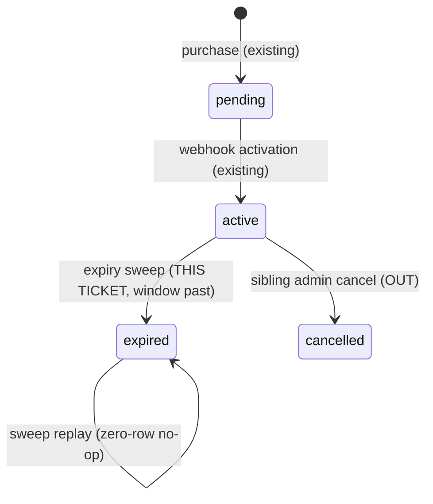

# Technical Architecture & Implementation Design: Subscription Validity Window & Expiry

**Plan directory:** `ai/plans/sprint_1/subscription-validity-window-expiry/`
**Specs:** `ai/plans/sprint_1/subscription-validity-window-expiry/specs.md`
**Tasks:** `ai/plans/sprint_1/subscription-validity-window-expiry/tasks.md`
**Deferred-items ledger:** `ai/plans/sprint_1/subscription-validity-window-expiry/deferred-items.md`
**Outcomes:** `ai/plans/sprint_1/subscription-validity-window-expiry/outcome/`

## Document Information

- **Feature Name**: Subscription Validity Window & Expiry
- **Ticket**: Subscription Validity Window & Expiry (Sprint 1, Dev 1, 3 pts) — `docs/planning/TICKETS.md:540-581`; Blocked-By "Segregated Session Balance Crediting" (shipped); Decision Refs FR-2.4 / INV-B3 / INV-B6 (`TICKETS.md:579`)
- **Version**: 1.0 · **Date**: 2026-09-11
- **Author**: Spec Plan Generator (swarm — design author)
- **Reviewers**: plan-review gate (Phase 1.5)
- **Related Documents**: `docs/billing/subscription-purchase.md` (`:359-362` assigns window-end zeroing to this job), `docs/specs/state-machine-invariants.md` (A.9 state table `:124-135`, INV-B3 `:147`, INV-B4 `:148`, INV-B6 `:150`), `docs/graphql/error-handling-contract.md`, `docs/planning/TICKETS.md:583-631` (sibling Admin Subscription Management — bounded OUT), research digests `outcome/research-01..04` (all facts verified against the tree on 2026-09-11)

## 1. System Overview & Architecture

### 1.1 What this is

A non-UI, backend-only ticket that makes the already-written validity window **enforceable** in three moves:

1. **AC1 (EXISTING — lock-in only).** Activation already writes `end_date = start_date + plans.interval_days × MS_PER_DAY` via a single captured `now` in `SubscriptionActivationService` (`backend/services/billing/subscription-activation.service.ts:360-372`, `MS_PER_DAY` at `:96`). This ticket re-pins it with tests and changes nothing.
2. **AC2 (NEW).** An externally-triggered cron route `GET /api/cron/expire-subscriptions` runs `SubscriptionExpiryService.expireDue()`: one transaction, one captured `now`, one guarded batch UPDATE flipping `active → expired` for past-window rows, then per-(student, lane) guarded lane zeroing per Decision D2 (REQ-023).
3. **AC3 (NEW).** The booking debit ladder (`debitBookingLadder`, `backend/services/classes/session-lifecycle.booking.ts:95-116`) gains a lane-aware expiry gate in its failure branch, throwing `ValidationError("SUBSCRIPTION_EXPIRED", t.subscriptionExpired)` in precedence over the existing `INSUFFICIENT_BALANCE` throw at `:113` (Decision D3, REQ-034).

Out of scope (sibling/deferred): admin extend/renew/cancel/upgrade/downgrade and `audit_logs` writes (`TICKETS.md:583-631`), per-subscription attribution ledger (rejected option O2 below, ledger D1), any scheduler infrastructure (ledger D2), and any UI (REQ-060 ruling, §6).

### 1.2 Sequence diagram

```mermaid
sequenceDiagram
    participant SC as External scheduler
    participant RT as GET /api/cron/expire-subscriptions
    participant SV as SubscriptionExpiryService
    participant DB as Postgres (one tx)
    participant ST as Student (booking)
    participant BL as debitBookingLadder

    SC->>RT: GET + Bearer CRON_SECRET
    RT->>RT: bare 404 unless CRON_EXECUTION_MODE=external AND CRON_EXTERNAL_ENABLED=true
    RT->>RT: timing-safe SHA-256 digest compare (401 masked on mismatch)
    RT->>SV: expireDue()
    SV->>DB: withTransaction: now once; guarded UPDATE active→expired (end_date<=now) RETURNING
    SV->>DB: per expired row plan lane: guarded zeroing UPDATE (not covered by other active/pending sub)
    SV-->>RT: { expired, lanesZeroed }
    RT-->>SC: apiSuccessResponse envelope
    ST->>BL: book session
    BL->>DB: trial debit? success → done (INV-B3 exempt)
    BL->>DB: intent-lane debit? success → done
    BL->>DB: both missed: EXISTS uncovered expired sub on lane?
    BL-->>ST: SUBSCRIPTION_EXPIRED (422-family) | INSUFFICIENT_BALANCE
```

### 1.3 Key Design Decisions

| # | Decision | Rationale | Alternatives rejected |
|---|---|---|---|
| D1 | New cron route `app/api/cron/expire-subscriptions/route.ts` is a line-for-line sibling of `app/api/cron/sweep-sessions/route.ts` (GET-only; bare 404 unless `CRON_EXECUTION_MODE === "external"` AND `CRON_EXTERNAL_ENABLED === "true"` via `getEnv`; SHA-256 digest + `timingSafeEqual` bearer vs `CRON_SECRET`; `apiSuccessResponse`/`apiErrorResponse`; fixed `locale = "en"`); registered in `backend/lib/gateway/route-inventory.ts` as `{ path: "/api/cron/expire-subscriptions", classification: "envelope" }`; **no new env keys** | REQ-020; sweep-sessions is the single sanctioned cron pattern (research-03 §1); `CRON_SECRET` already pays the registration cost (research-03 §6 recommendation) | New env-key toggle (adds raw-`getEnv` recipe + `.env.example` churn for zero security gain); any in-process scheduler (none exists — `scripts/cron-worker.ts` is a stale package.json entry, research-03 §7) |
| D2 | **REQ-023 zeroing semantic = O1: conditional lane zeroing.** When the batch flip expires subscription S, the plan's `balance_lane` credited to the owning student is zeroed **only if** no other `active` (post-flip, in-window by construction) or `pending` subscription of that student credits the same lane. One guarded UPDATE per (student, lane) inside the same sweep transaction; `balance_trial` never touched (INV-B3) | Matches AC2 exactly in the dominant single-subscription case; never over-revokes under co-subscriptions; expressible as a single atomic guarded statement (`StudentRepository.zeroLaneIfNoCoveringSubscription`, §5.1); no schema churn — fits a 3-pt ticket. Full trade-off record in §2.1 | **O2** per-subscription attribution ledger — precise but new table + migration + crediting rewrite; deferred as future work (ledger D1). **O3** status-only (no zeroing) — explicitly rejected: fails AC2/INV-B3 |
| D3 | **REQ-034 denial ordering.** The expiry gate is inserted into `debitBookingLadder` (`session-lifecycle.booking.ts:95-116`) strictly inside the **double-debit-miss branch** (after `:106`, before the `INSUFFICIENT_BALANCE` throw at `:113`): trial debit → intent-lane debit → only when both miss, `hasUncoveredExpiredLane` probe → `SUBSCRIPTION_EXPIRED` else fall through to `INSUFFICIENT_BALANCE` | Deterministic; trial-exempt for free (trial debit succeeds first, gate never reached — REQ-033); zero added cost on the successful-booking hot path; single locale key; error precedence expired-over-insufficient per AC3. Full record in §2.2 | Gate before the intent-lane debit (would deny positive-but-unswept balances during sweep lag; adds a hot-path read); window-based gate replacing status (the sweep/lag contract already governs staleness — §5.2) |
| D4 | Zero GraphQL delta: no new operations, no authScope changes, no codegen. `StudentSubscription.status` already carries the registered `Expired` member (`frontend/graphql/generated/schema.graphql:1166-1172`); expired rows surface through `mySubscriptions` unchanged | REQ-051; schema enum and DB/TS enums are already aligned (`backend/db/schema/enums.ts:47-53` ↔ `backend/enum/billing/subscription-status.enum.ts:6-12`) | Adding an `expireSubscription` mutation (admin surface is the sibling's) |
| D5 | Sweep efficiency: new **partial index** `subscriptions_active_end_date_idx` ON `subscriptions(end_date) WHERE status = 'active'` — Drizzle `.where(sql`…`)` pattern already in the same file (`subscriptions.ts:53-55`); applied via `bun run db` push | REQ-022/§9: no `status`/`end_date` index exists today (`subscriptions.ts:51-55`); partial index keeps write cost near zero and scans tiny | Full composite index (larger write amplification for no query-shape gain); no index (seq-scan acceptable today but violates the NFR's stated approach) |
| D6 | Sweep = ONE transaction for the whole cohort (batch flip + all zeroings commit or roll back together); counts-only return `{ expired, lanesZeroed }`; no `audit_logs` writes (no system actor exists — `audit_logs.actor_id` NOT NULL, `backend/db/schema/audit/audit-logs.ts:30-47`) | REQ-025/reliability NFRs demand no half-swept cohort; REQ-052 reserves audit writing for the sibling ticket | Per-row transactions (allows a torn cohort); inventing a system actor (schema change for observability the logs already give) |
| D7 | Zero frontend changes — justified by **surface absence, not fallback coverage**: (1) the booking mutation has NO wired UI consumer (`createSessionMutationDocument` is referenced only by its document file `frontend/graphql/sharedDocuments/scheduling/session-lifecycle.documents.ts:48` + `documents.contract.test.ts` — grep-verified), so no dialog can render the denial this sprint; (2) the client error map (`frontend/providers/apollo/error-link.map.ts`) defines NO row for custom domain codes — `normalizeGraphQLErrorCode` folds only the `RATE_LIMIT_EXCEEDED` alias (`:58-65`), `mapValidationRow` matches the literal `VALIDATION` only (`:242-258`), unmapped codes → `null` (no published action). The localized copy travels server-side in the `ValidationError` message + `extensions.code`; when the booking UI lands, its error arm SHALL map `SUBSCRIPTION_EXPIRED` → the new `subscriptionExpired` key (ledger D3 — REQUIRED at that landing, not optional polish) | REQ-061; the earlier "custom codes fall through to the VALIDATION toast" claim (research-04 §4) is falsified by the map's `:242-258` guard — corrected above | Shipping a dedicated dialog arm now (no booking dialog exists to hang it on — verified negative); widening the client error map in this ticket (frontend scope creep for a surfacing no one renders yet) |

### Design Goals

- **G1**: AC1 stays untouched — verification and test lock-in only (REQ-010/012).
- **G2**: AC2 ships as the smallest correct aggregate: route + service + two guarded repo statements + one partial index (REQ-020..026).
- **G3**: AC3 is an insertion, not a redesign — the existing ladder order, logging idiom (`logger.logDomainError` from `@/backend/lib/logger`), and error class are preserved verbatim (REQ-030..034).
- **G4**: Every user-facing string is a typed one-arg-bundle key added to exactly 3 locale files (REQ-003/032).

## 2. Key Decision Records (full)

### 2.1 D2 — REQ-023: what "zero the period's remaining balance" means on flat lanes

**Context.** AC2 mandates zeroing "any remaining session balance for that subscription period" (INV-B3, `docs/specs/state-machine-invariants.md:147`). The shipped model (`backend/db/schema/students/students.ts:24-45`) holds flat per-student counters `balance_hifz / balance_reviews / balance_tajweed` (+ never-expire `balance_trial`) fed by relative `creditLaneBalance` increments (`backend/db/repo/students/student.repository.credit-lane.helpers.ts:108`) — there is **no per-subscription attribution** anywhere (research-02 §1/§9.1), and the blocking ticket deliberately shipped none. Literal per-period zeroing is unimplementable; the plan must choose an honest interim semantic.

| Option | Description | Pros | Cons |
|---|---|---|---|
| **O1 — conditional lane zeroing (CHOSEN)** | When S expires, zero the plan's lane on the student IFF no other `active`/`pending` subscription of that student credits the same lane. Single guarded UPDATE per (student, lane), inside the sweep tx | Matches AC2 verbatim for the dominant single-subscription reality; never over-revokes under co-subscriptions (conservative direction = under-revoke only); atomic with the flip (REQ-025); expressible in one named repo statement with a frozen lane→column map | Under-revokes the expiring subscription's residual when another sub covers the lane (units become indistinguishable — inherent to flat lanes, documented) |
| O2 — attribution ledger | New per-subscription allocation table; zero exactly the expiring period's units | Exact AC2 under all topologies | New table + migration + crediting/booking rewrite + refund accounting; several tickets' scope; violates this ticket's 3-pt budget and the ratify-don't-rebuild pattern (research-01 Part C) |
| O3 — status-only expiry | Flip status, leave lanes | Trivial | **Fails AC2/INV-B3 outright** — rejected, not deferred |

**Decision.** O1, with the guard: skip zeroing when any *other* subscription row of the same student has `status IN ('active','pending')` and a plan whose `balance_lane` matches. Because the batch flip runs first **in the same transaction**, `active` at zeroing time is exactly "in-window at the captured `now`" — no count exclusion needed. `balance_trial` is structurally unreachable (zeroing resolves lanes via the `SubscriptionCreditLane`-keyed map, which has no trial member).

**Rationale vs INV-B3 wording.** INV-B3's intent is "expired units stop entitling bookings with no carryover". O1 delivers that for every student whose expired period is their only coverage of the lane, and errs toward Revoke-Never-Wrongly when coverage genuinely overlaps. The residual gap (shared-lane co-subscriptions) is recorded in `deferred-items.md` D1 with O2 as its candidate future work — it must not silently disappear.

**Expressibility.** `StudentRepository.zeroLaneIfNoCoveringSubscription(studentId, lane, tx)` (§5.1) is exactly one `UPDATE … WHERE id=? AND COALESCE(balance_<lane>,0) > 0 AND NOT EXISTS (…covering subscription…) RETURNING id` — zero rows = covered or already-zero, both safe no-ops.

### 2.2 D3 — REQ-034: exactly where and in what order the expiry gate fires

**Verification against the real ladder** (`backend/services/classes/session-lifecycle.booking.ts:95-116`, read this session): `debitBookingLadder` first attempts the trial-lane debit (`:101`, success → return `HeldBalanceLane.Trial`), then the intent-lane debit via `intentLaneFor(intent)` (`:105-106`; hifz/tajweed only — the reviews lane never funds bookings), and on a miss logs `logger.logDomainError(...)` then throws `ValidationError("INSUFFICIENT_BALANCE", t.insufficientBalance)` at `:113`.

**Insertion.** Inside that same `if (!intentDebited)` block (after `:107`, before the INSUFFICIENT_BALANCE logging at `:108`), add:

```ts
if (await SubscriptionRepository.hasUncoveredExpiredLane(studentId, creditLaneForIntentLane(intentLane), tx)) {
  logger.logDomainError("Session booking rejected: subscription expired", {
    code: "SUBSCRIPTION_EXPIRED",
    entity: "session",
    entityId: studentId,
  });
  throw new ValidationError("SUBSCRIPTION_EXPIRED", t.subscriptionExpired);
}
```

**Deterministic predicate order (pinned):** (1) trial debit attempt — success returns immediately (trial exemption, REQ-033, is structural: an expired-subscription student with `balance_trial > 0` never reaches the gate); (2) intent-lane debit attempt — success returns immediately (balance-based eligibility unchanged, REQ-030's "without weakening the ladder"); (3) only on double-miss, the one-shot `EXISTS`/anti-`EXISTS` probe; (4) existing `INSUFFICIENT_BALANCE`. Outcome: expired+zeroed lane ⇒ `SUBSCRIPTION_EXPIRED` (AC3/REQ-034); never-subscribed+empty lane ⇒ `INSUFFICIENT_BALANCE` unchanged; both are `ValidationError` (422 family).

**Why failure-branch and not pre-ladder:** (a) zero cost on the successful-booking hot path (no per-booking subscription read — the NFR's "at most one indexed read" becomes "zero reads unless both debits fail"); (b) the sweep's same-tx flip+zeroing guarantees lane=0 ⇔ expired/uncovered when the failure branch runs, so a status-based probe is exact at the point it executes; (c) the sweep-lag case (past window, not yet swept, lane > 0) intentionally books — the window-vs-status lag contract (`state-machine-invariants.md:124-135`, REQ-011) assigns expiry enforcement to the sweep, and forbidding it would deny spendable units.

**Lane mapping:** intent lanes are `HeldBalanceLane` (`hifz|tajweed`); plan lanes are `SubscriptionCreditLane` (`hifz|tajweed|reviews`, `backend/enum/billing/subscription-credit-lane.enum.ts:8-12`). A frozen two-member map `HELD_LANE_TO_CREDIT_LANE` in the booking module converts; the reviews lane never appears on the booking path.

## 3. Data Models & Database Schema

### 3.1 Existing schema (read-only anchors, verified)

| Table | Key columns | Constraint notes |
|---|---|---|
| `subscriptions` (`backend/db/schema/billing/subscriptions.ts:28-57`) | `id` identity PK; `userId`→users restrict; `planId`→plans restrict; `status` pgEnum default `pending`; `startDate`/`endDate` nullable timestamps (`:39-40`) | Indexes only on `user_id`, `plan_id`, partial `payment_reference` (`:51-55`) — **no `status`/`end_date` index today** |
| `plans` (`backend/db/schema/billing/plans.ts:20-43`) | `sessionCount` int CHECK>0; `intervalDays` int CHECK>0 (`:28,41`); `balanceLane` pgEnum **nullable** (`:29`); `isActive` | `interval_days` lives ONLY here (REQ-012); NULL lane = unconfigured (purchase fails closed) |
| `students` (`backend/db/schema/students/students.ts:18-47`) | `balanceHifz`/`balanceReviews`/`balanceTajweed` nullable int default 0 (CHECK ≥ 0, `:42-44`); `balanceTrial` NOT NULL (CHECK ≥ 0) | Flat lanes; NO per-subscription attribution |
| `student_subscriptions` (`backend/db/schema/billing/student-subscriptions.ts:20-35`) | composite PK `(student_id, subscription_id)` | junction; untouched by expiry (rows stay as history) |

### 3.2 Schema delta (the ONLY one)

| Artifact | Kind | Definition |
|---|---|---|
| `subscriptions_active_end_date_idx` | EXTEND `subscriptions.ts` index list | `index("subscriptions_active_end_date_idx").on(t.endDate).where(sql\`${t.status} = 'active'\`)` — partial index (per D5); same `.where(sql\`…\`)` idiom as `subscriptions_payment_reference_unique` at `:53-55`; **no `--` comments inside any `sql` template** (template anti-pattern section) |

Application: Drizzle-declared ⇒ `bun run db` → `push` (schema DDL; per schema AGENTS + tasks-template convention — `bun run db push` for schema, `bun db migrate` for custom SQL; **no custom SQL migration is needed for this ticket** — the guarded UPDATEs are app-level parameterized statements, not DDL). `db reset`/`cleanGenerate` remain policy-disabled.

### 3.3 Canonical types

| Type | File | Kind / Definition |
|---|---|---|
| `ExpiredDueSubscriptionRow` | `backend/types/billing/subscription.types.ts` | EXTEND — `{ readonly id: number; readonly userId: number; readonly planId: number }` (batch-flip RETURNING projection) |
| `SubscriptionExpirySweepReturnType` | `backend/types/billing/subscription.types.ts` | EXTEND — `{ readonly expired: number; readonly lanesZeroed: number }` (counts-only route/service contract) |

No service-local `.types.ts` (prohibited); `DBTransaction`/`DBQueryExecutor` from `@/backend/types`. No GraphQL/typegen touch (D4): `SubscriptionReturnType` already carries `status: SubscriptionStatus` and the enum already includes `Expired`.

## 4. API Contracts

### 4.1 GraphQL SDL — unchanged (sketch of what expiry rides on)

```graphql
enum SubscriptionStatus { Active Pending Expired Cancelled Suspended }   # EXISTING, already registered
type StudentSubscription { id: ID! status: SubscriptionStatus! startDate: String endDate: String /* … */ }  # EXISTING
extend type Query { mySubscriptions: [StudentSubscription!]! }           # EXISTING — authScopes unchanged
# Mutation.createSession → SessionLifecycleService.createSession          # EXISTING — gains SUBSCRIPTION_EXPIRED denial only
# NO new type/input/operation; SubscriptionStatus.Expired rows now actually occur.
```

### 4.2 New REST cron route contract (CREATE)

`GET /api/cron/expire-subscriptions` — `app/api/cron/expire-subscriptions/route.ts` (CREATE), mirroring `sweep-sessions/route.ts` (which was re-read for this plan):

| Aspect | Contract |
|---|---|
| Method | GET only (others → Next 405) |
| Mode gates (fail-closed) | bare `404` (no envelope, no body) unless `getEnv("CRON_EXECUTION_MODE") === "external"` AND `getEnv("CRON_EXTERNAL_ENABLED") === "true"` — gates FIRST (route.ts:83-87 precedent) |
| Auth | `Authorization: Bearer <CRON_SECRET>`; SHA-256 digest both sides + `crypto.timingSafeEqual` (module-local `bearerSecretMatches`, route.ts:66-73 precedent); mismatch/missing/empty-secret ⇒ masked 401 `apiErrorResponse(DomainError("UNAUTHORIZED", …))`; secret NEVER via query string |
| Delegate | `SubscriptionExpiryService.expireDue()` — locale-free service; route fixes `locale = "en"` for envelope classification only |
| Success | `apiSuccessResponse({ expired, lanesZeroed }, { requestId })` — honest counts from the guarded statements |
| Failure | thrown sweep error → `apiErrorResponse(error, { requestId, locale })` masked 500; never raw |
| Registration (MANDATORY) | `ROUTE_INVENTORY` gains `{ path: "/api/cron/expire-subscriptions", classification: "envelope" }` (`backend/lib/gateway/route-inventory.ts:54-65`; static assertions in `route-inventory.ts` docblock + `backend/lib/gateway/route-inventory.test.ts`/`static-assertions.test.ts` must stay green/extended) |

### 4.3 Permission matrix (Principal × operation)

Roles universe = exactly `Admin | Teacher | Student | Parent` (`backend/enum/users/user-role.enum.ts:5-10`; no SUPER_ADMIN role — research-04 §3).

| Principal | `GET /api/cron/expire-subscriptions` (NEW) | `createSession` booking mutation (EXISTING, denial added) | `mySubscriptions` (EXISTING) |
|---|---|---|---|
| Anonymous | 401 masked (enabled) / bare 404 (disabled) | 401 | 401 |
| Student | 401 masked (bearer-gated; user session is irrelevant) | ✅ — expiry denial via `extensions.code` | ✅ own rows |
| Teacher | 401 masked | 403 (role-gated today) | 403 |
| Parent | 401 masked | 403 | 403 |
| Admin | 401 masked | 403 | 403 |
| System scheduler (valid `CRON_SECRET`) | ✅ | — (no user session) | — |

### 4.4 Error contract

| Situation | Class | `extensions.code` | HTTP mapping |
|---|---|---|---|
| Cron disabled | — (bare 404, no envelope) | — | 404 (the ONE taxonomy-exempt literal, documented on the route) |
| Cron wrong/missing bearer | `DomainError("UNAUTHORIZED", …)` | `UNAUTHORIZED` | 401 masked envelope |
| Cron internal failure | masked via `apiErrorResponse` | `INTERNAL_SERVER_ERROR` | 500 |
| Booking: unauthenticated | `UnauthorizedError` | `UNAUTHORIZED` | GraphQL HTTP 200 + `errors[].extensions.code` |
| Booking: non-student role | scope gate | `FORBIDDEN` | 403 (scope layer) |
| Booking: expired+zeroed subscription lane (NEW) | `ValidationError("SUBSCRIPTION_EXPIRED", t.subscriptionExpired)` | `SUBSCRIPTION_EXPIRED` | VALIDATION family → 422 on REST envelopes (`backend/lib/errors/error-code-taxonomy.ts:47`); over GraphQL the status-bearing surface is `extensions.code` (HTTP 200) |
| Booking: zero balance, no expired coverage (UNCHANGED) | `ValidationError("INSUFFICIENT_BALANCE", t.insufficientBalance)` | `INSUFFICIENT_BALANCE` | 422 family, precedent `session-lifecycle.booking.ts:113` |

Denial happens BEFORE any debit/insert (the ladder's misses are no-op guarded statements); zero rows written on denial (REQ-031).

## 5. Services, Repositories & Concurrency

### 5.1 Exact signatures

**`backend/db/repo/billing/subscription.repository.ts`** (EXTEND — same namespace, guarded-transition doctrine):

- `expireDueActive(now: Date, tx?: DBTransaction): Promise<ExpiredDueSubscriptionRow[]>` —
  ONE guarded `UPDATE subscriptions SET status='expired', updated_at=now() WHERE status='active' AND end_date IS NOT NULL AND end_date <= $now RETURNING id, user_id, plan_id` (enum **value** import `SubscriptionStatus` from `@/backend/enum/billing/subscription-status.enum`, per REQ-005; `$onUpdate` bypassed by raw set ⇒ stamp `updated_at` explicitly, mirroring `activatePendingOnce` at `:131-149`). SQL-side comparison keeps the predicate inside the row lock (no SELECT-then-UPDATE).
- `hasUncoveredExpiredLane(studentId: number, lane: SubscriptionCreditLane, tx?: DBTransaction): Promise<boolean>` —
  single read-only statement (transactional executor): `EXISTS(subscriptions ⨝ plans on plan_id WHERE user_id=$1 AND balance_lane=$2 AND status='expired') AND NOT EXISTS(… same join … WHERE status='pending' OR (status='active' AND end_date > now()))`. Bound parameters for `lane` through the `SubscriptionCreditLane` enum value — never string interpolation. Per AGENTS bare-reads rule this method is used ONLY inside the booking transaction, so no `queryDb` raw variant is needed.

**`backend/db/repo/students/student.repository.ts`** (EXTEND — students table's single-writer repo):
- `zeroLaneIfNoCoveringSubscription(studentId: number, lane: SubscriptionCreditLane, tx?: DBTransaction): Promise<boolean>` — ONE guarded UPDATE:
  `UPDATE students SET balance_<lane> = 0, updated_at = now() WHERE id = $1 AND COALESCE(balance_<lane>, 0) > 0 AND NOT EXISTS (SELECT 1 FROM subscriptions s JOIN plans p ON p.id = s.plan_id WHERE s.user_id = $1 AND p.balance_lane = $lane AND s.status IN ('active','pending')) RETURNING id`.
  Lane column resolved via a NEW frozen `ZERO_LANE_BALANCE_SETTERS`-style map keyed by `SubscriptionCreditLane` (three members incl. `reviews`) in a sibling helper `student.repository.zero-lane.helpers.ts` (CREATE) mirroring `student.repository.credit-lane.helpers.ts` extraction conventions; `balance_trial` is structurally unreachable (no map member). Returns `true` iff the row matched (for honest `lanesZeroed` counting).

**`backend/services/billing/subscription-expiry.service.ts`** (CREATE — namespace `SubscriptionExpiryService`, locale-free):
- `expireDue(outerTx?: DBTransaction): Promise<SubscriptionExpirySweepReturnType>` —
  `withTransaction(outerTx, async tx => { const now = new Date(); const due = await SubscriptionRepository.expireDueActive(now, tx); …zeroing… })`; `now` captured ONCE (precedent `session-lifecycle.service.ts:780-781`). Plan lanes resolved by one `inArray(plans.id, …)` batch read on the tx (dynamic query — `inArray`+placeholder prepared statements PROHIBITED per `backend/db/repo/AGENTS.md`); rows whose plan `balance_lane` is NULL are skipped with a warn-log (config gap, fail-safe not fail-silent). Dedupe (student, lane) pairs before zeroing; `lanesZeroed` sums matched zeroing statements; return `{ expired: due.length, lanesZeroed }`. Zero-row flip ⇒ zero-row zeroings ⇒ `{0,0}` (replay branch, REQ-022). No notifications, no audit rows (REQ-052).

**`backend/services/classes/session-lifecycle.booking.ts`** (EXTEND — `debitBookingLadder` only): insert the gate branch per §2.2; add `SubscriptionRepository` + `SubscriptionCreditLane` imports and the frozen `HELD_LANE_TO_CREDIT_LANE` map (module-local constant, two members). No other booking function changes; `bookSessionInTx` call graph untouched.

### 5.2 Concurrency & race-condition assessment (REQ-053)

**Concurrency model.** All transitions are single-statement guarded UPDATEs; the WHERE predicate is the lock (no SELECT-then-UPDATE, no advisory locks — house style, `subscription.repository.ts:6-9` docblock). PostgreSQL row locks serialize concurrent writers of the same `subscriptions`/`students` row, and a losing writer re-evaluates the predicate against the post-commit value (same mechanics as `decrementLaneIfAvailable`, `student.repository.ts:478-493` doctrine).

| Race | Guard | Outcome |
|---|---|---|
| Double-fire sweep (duplicate scheduler delivery) | `expireDueActive` predicate `status='active' AND end_date <= $now`; second run matches zero rows | second run is a provable no-op; envelope `{ expired: 0, lanesZeroed: 0 }` (REQ-026 honest counts) |
| Concurrent sweep ×2 | batch UPDATE row-lock: loser blocks, re-evaluates, matches zero | identical terminal state both orders (idempotent convergence, REQ-022) |
| Sweep vs in-flight booking of expiring student | booking's debit is its own guarded UPDATE on the same `students` row inside its own tx; sweep zeroing guarded UPDATE serializes on that row lock | linearizable: either booking debits pre-zero (sweep then zeroes the remainder — correct) or sweep zeroes first (booking debit misses → expiry gate ⇒ `SUBSCRIPTION_EXPIRED`, zero rows written). Never double-spent, never half-zeroed (REQ-025: flip+zero share one tx; REQ-053) |
| Booking in the window-vs-sweep lag (past `end_date`, not yet swept) | none — intentional | booking succeeds from the still-positive lane (Decision D3 rationale; the lag is closed by the next sweep; documented in canonical doc) |
| Refund landing after the student's sweep zeroed the lane | refund `incrementLane` is unguarded `+1` (no expired check) | a post-expiry cancellation refund can re-credit one unit; accepted residual risk recorded here (fix belongs to the refund path, not this ticket). Note: with D3's failure-branch gate, such a unit remains spendable until consumed |
| Activation racing a sweep for the same student | activation targets `status='pending'` rows (`end_date` NULL ⇒ never sweep-eligible, REQ-011) | disjoint row sets; no interaction |
| Batch partial failure mid-sweep | whole cohort in ONE `withTransaction` | any error ⇒ full rollback; no half-swept cohort (reliability NFR). envelope 500 |

**TOCTOU windows.** None introduced: every check-then-write pair is fused into one statement. The `hasUncoveredExpiredLane` probe + subsequent denial is a READ-then-THROW (no write follows), so its staleness cost is zero — a concurrent covering activation commits only after the booking already threw, which the caller may retry.

### 5.3 Cross-Actor Journey Design

**Shared-entity state machine (`subscriptions.status`):**

| Current | Trigger (actor) | Next | Guard |
|---|---|---|---|
| — | Student purchases (EXISTING) | `pending` | role gate + claim |
| `pending` | Webhook confirmed (EXISTING, `activatePendingOnce`) | `active` (+window, +lane credit) | `status='pending'` guarded UPDATE |
| `active`, past window | System sweep (NEW, `expireDueActive`) | `expired` (+ conditional lane zeroing) | `status='active' AND end_date <= now` guarded batch UPDATE |
| `active`, in window | sweep | (unchanged) | guard excludes |
| `pending` (null/future `start_date`) | sweep | (unchanged) | guard excludes (REQ-011) |
| `cancelled` / `suspended` / `expired` | sweep | (unchanged) | guard excludes |
| `expired` | admin renew/extend | (SIBLING scope — not shipped here) | — |



**Side-effect matrix (per transition of THIS ticket):**

| Transition | Rows written | Notifications | Idempotency key |
|---|---|---|---|
| batch flip `active→expired` | `subscriptions.status`, `updated_at` per expired row | none (REQ-021: no fan-out) | zero-row guarded UPDATE (replay ⇒ 0 rows) |
| conditional zeroing | `students.balance_<lane>` → 0 (uncovered pairs only) | none | `>0` + `NOT EXISTS` guard (replay ⇒ 0 rows) |

**Cross-actor visibility:**

| State | Student A | Student B (probe) | Admin/Teacher/Parent |
|---|---|---|---|
| `active` in window | `mySubscriptions` status `Active` + dates; booking succeeds | nothing (owner-scoped) | unchanged surfaces only |
| `expired` | `status = Expired`, ORIGINAL `startDate`/`endDate` unchanged (sweep mutates status+balances only); `SUBSCRIPTION_EXPIRED` denial on expired-lane booking; trial booking still succeeds (INV-B3) | byte-identical before/after (zero cross-tenant effect) | unchanged this ticket (analytics `subscriptionsExpiredLabel` counter — existing — starts counting) |

## 6. UX / Navigation Specification (REQ-060..061)

**No-UI ruling (explicit, evidence-backed).** This ticket ships NO new pages, NO nav changes, NO new UI components:

| Claim | Evidence (verified in research-04 §1, re-checkable) |
|---|---|
| No student subscription pages exist | no `app/(dashboard)/subscriptions/`; `app/(dashboard)/student/` holds only `dashboard/ link-requests/ sessions/`; no `frontend/views/student/subscriptions/`; `MySubscriptionsContainer` does NOT exist in code (grep-negative) |
| `/subscriptions` nav link → catch-all | `frontend/views/dashboard/nav/navItems.ts:120` (Student array) → `app/(dashboard)/[feature]/page.tsx:26-30` → `ComingSoonView`; remains so |
| Paymob-plan screens are planned-but-unlanded | `ai/plans/sprint_1/paymob-gateway-integration/plan.md:263-264` — they will render `SubscriptionStatus.Expired` **for free** from this ticket's data (schema enum + fields already exposed, `schema.graphql:1117-1151,1166-1172`) |
| No bottom nav exists | repo-wide grep for bottom-nav finds only comments (research-04 §2) — nothing to change |

**Client touchpoint: none this sprint.** The denial lives at the GraphQL error surface (HTTP 200 + `errors[].extensions.code === "SUBSCRIPTION_EXPIRED"` + server-localized message). The path that would display it — the booking flow — has no wired frontend consumer (verified), and the client map defines no custom-code row, so nothing renders today; the snackbar arm is deferred to the booking UI's landing (Decision D7, ledger D3).

- **New routes & URLs:** exactly one — `GET /api/cron/expire-subscriptions` (system bearer; see §4.2). No page routes.
- **Sidebar navigation:** UNCHANGED — no new items, no re-order, no bottom-nav entry (none exists).
- **Role-based access matrix:** identical to §4.3 (Student: denial surfacing only; Admin/Teacher/Parent: zero delta; System: bearer-gated route).
- **Per-audience rendering:** identical for every audience; no rendering delta is introduced by data alone.
- **Permission mapping:** no new permission strings; page guards untouched. NB: `requirePermissionForPage` in `backend/lib/auth/require-permission.ts` and `app/(dashboard)/shared/withPageAuth.ts` are **stale AGENTS.md references that do not exist** (research-04 §3 verified negatives) — the real page-guard module is `@/frontend/lib/auth/withPageAuth`; nothing in this ticket touches either path.

### Translation / i18n rules (REQ-003, REQ-032)

- **One-arg bundles only:** services receive `locale: string` and do `const t = getServerTranslations(locale).errorsTranslations;` (`shared/locale/server-graphql.ts:3`; live precedent `session-lifecycle.service.ts:203`). FORBIDDEN: two-arg `getTranslations`, `Translation.*` enums (never existed), `next-intl`, `getBackendTranslations`, `shared/messages/`, hardcoded strings, `LocaleType`.
- **New key `subscriptionExpired` — exactly 3 files:** (1) type — `shared/locale/types/errors/labels.ts` `ErrorsLabels` flat entry beside `insufficientBalance` (`:174`, docblock: self-contained sentence, no identifiers); (2) English leaf — `shared/locale/en/errors/index.ts` (sibling of `insufficientBalance: "Your balance is insufficient for this request."` at `:85`); (3) Arabic leaf — `shared/locale/ar/errors/index.ts` (RTL-safe, mirrors `insufficientBalance` at `:84`).
- **Parity:** `shared/locale/errors-namespace.parity.test.ts` auto-covers key parity (research-03 §5); no namespace registration needed (errors namespace already wired in `shared/locale/types/message.ts:21-24`).
- en copy class: `"Your subscription has expired. …"`-style self-contained sentence; the final wording is fixed at implementation in both leaves.

## 7. Security, Authorization & Tenancy

| Threat class | Mitigation | REQ |
|---|---|---|
| BFLA (route abuse) | fail-closed bare-404 mode gates + timing-safe digest bearer; no query-string secret; GET-only | REQ-020/050 |
| Existence oracle | disabled mode answers a BARE 404 with no envelope/code — indistinguishable from an unknown path | REQ-050 |
| BOLA/IDOR (cross-student effect) | sweep predicates key on `s.user_id = $1` per row; zeroing NEVER crosses row ownership; `hasUncoveredExpiredLane` is invoked only for the authenticated booking student inside their own tx; journey asserts Student B byte-identical | REQ-053, §3 specs |
| BOPLA (mass assignment) | no input bodies anywhere (GET cron has none; booking inputs unchanged); lane columns resolved through frozen enum-keyed maps — caller strings cannot select a column | AGENTS house rule |
| Audit integrity | no `audit_logs` writes from the sweep (`actor_id` NOT NULL, no system actor — `audit-logs.ts:30-47`); observability = structured logs + counts | REQ-052 |
| Log hygiene | `logger.logDomainError` for domain denials, `logger.error` for anomalies (both from `@/backend/lib/logger` — NEVER `@/frontend/utils/logger` in backend); no row/PII payloads in logs; `console.*` prohibited | REQ-026 |
| Tenancy replay | guarded updates make replay/double-fire provable no-ops | REQ-022 |
| Transaction misuse in tests | `runInRollback` + `tx` on EVERY repo call; no `.rejects.toThrow()` inside rollback | backend/db/test AGENTS |

## 8. Error Handling

Categories + logging discipline:

| Layer | Behavior |
|---|---|
| Cron route | masked envelopes only (401/500); bare 404 when disabled; `resolveRequestId` correlation; route docblock documents the one sanctioned bare-404 literal |
| Sweep service | throws propagate to the route's masked envelope; `logger.error` once per failure with `requestId`-free context (route re-logs correlation); expected empty sweep logs at info/debug — NO error noise |
| Booking gate | `logger.logDomainError("Session booking rejected: subscription expired", { code: "SUBSCRIPTION_EXPIRED", entity: "session", entityId: studentId })` immediately before the throw — same shape as the `INSUFFICIENT_BALANCE` site (`session-lifecycle.booking.ts:108-113`) |
| Client | custom domain code → `null` in `error-link.map.ts` (no mapped row); localized copy travels via the server `ValidationError` message + `extensions.code` (D7) |

## 9. Performance Considerations

- **Sweep:** one partial-index-supported range scan (`subscriptions_active_end_date_idx`, D5) + one batch UPDATE + ≤1 zeroing UPDATE per distinct (student, lane); target < 500 ms p99 locally, mirroring `sweepExpiredSessions`. No batching/chunking is added: the cohort is expected small (interval-bounded), and one transaction is the required failure domain (D6).
- **Booking hot path:** ZERO added reads on success (gate lives in the double-miss branch — D3); the failure-branch probe is one indexed `EXISTS` + one `EXISTS`, both keyed on the indexed `subscriptions_user_id_idx`.
- **Index cost:** partial `WHERE status='active'` index stays tiny and routes out on every flip; write amplification ≈ zero.

## 10. Testing Strategy

Runner discipline: ALL suites via `bun run test/scripts/run-test.ts <path>` (raw `bun test` PROHIBITED for these layers); test-first where the design creates behavior.

| Layer | File | Kind | Covers |
|---|---|---|---|
| Repo (DB) | `backend/db/test/logic/billing/subscription-expiry.repository.test.ts` (CREATE) | `runInRollback` + `tx`; try/catch helpers, never `.rejects` inside rollback | flip: past-window active→expired; in-window untouched; `pending` untouched; `cancelled`/`suspended` untouched; null `end_date` untouched; re-run = 0 rows. Zeroing: trial exemption (REQ-024 — seed trial balance, assert intact); covered-lane guard (second ACTIVE sub same lane ⇒ not zeroed; PENDING cover ⇒ not zeroed); uncovered ⇒ zeroed once; re-run no-op (T1–T3) |
| Service | `backend/services/billing/subscription-expiry.service.test.ts` (CREATE, colocated) | 4-tier; `runInRollback` per service-test convention (`subscription-activation.service.test.ts:72`) | T1 branches (empty cohort, null-lane skip, dedupe); T2 boundary `end_date == now` inclusive (expired per A.9 `now >= end_date`); T3 chaos: concurrent `expireDue()` ×2 via `Promise.allSettled` + sweep-vs-booking race; honest counts |
| Booking denial | EXTEND `backend/services/classes/session-lifecycle.booking.test.ts` | same conventions | expired+zeroed → `SUBSCRIPTION_EXPIRED` before any write; expired + `balance_trial > 0` → trial success (REQ-033); in-window → unchanged; never-subscribed empty lane → `INSUFFICIENT_BALANCE` regression intact; GraphQL shape `extensions.code === "SUBSCRIPTION_EXPIRED"` via `expectSingleDenial`-style assertion |
| Route | `app/api/cron/expire-subscriptions/test/expire-subscriptions-route.test.ts` (CREATE) | env gymnastics precedent `sweep-sessions-route.test.ts:66-74` | disabled → bare 404; wrong/missing bearer → masked 401; happy path → envelope honest counts; query-string secret rejected |
| i18n parity | EXISTING `shared/locale/errors-namespace.parity.test.ts` | unchanged | auto-covers the new key |
| Journey (test-first) | `test/workflows/billing/subscription-expiry.journey.test.ts` (CREATE) | `test/workflows/AGENTS.md`: ONE committing `beforeAll` tx; `TrackedFixtures`; `journeyPrefix("billing")`; NO `runInRollback`; `catchJourneyError`; per-run run: `bun run test/scripts/run-test.ts test/workflows/billing/subscription-expiry.journey.test.ts` | full §5.3 journey: activate → backdate `endDate` (`createTestSubscription` fixture precedent `entity-setup.ts:208-218`) → `expireDue()` → assert status=expired + lane zeroed + trial intact → booking denied `SUBSCRIPTION_EXPIRED` → trial booking succeeds → Student B probe byte-identical → replay ⇒ zero counts |
| AC1 lock-in | EXISTING activation tests (confirm green) + explicit `endDate - startDate === intervalDays * MS_PER_DAY` assertions (service suite; journey precedent `subscription-purchase.journey.test.ts:539`; `secondPrecisionMs` `test/workflows/helpers/second-precision.ts:21`) | boundary probes: min `intervalDays=1`, leap-adjacent activation | REQ-070 |
| Regression pin | route-inventory static assertions (EXTEND for the new route), activation/booking suites, blocking ticket's suites | unchanged-green | REQ-075 |

## 11. Deployment, Migration & Compatibility

- **Scheduler trigger decision:** the ticket ships the fail-closed route + service only. Triggering is an **external cron caller** hitting `GET /api/cron/expire-subscriptions` with `Authorization: Bearer ${CRON_SECRET}`, gated on deployment env `CRON_EXECUTION_MODE=external` + `CRON_EXTERNAL_ENABLED=true` (reuse of the existing `CRON_SECRET` — NO new env keys, per D1/research-03 §6). There is no in-process scheduler, no `vercel.json`, no `scripts/cron-worker.ts` (all verified-missing/stale — research-03 §7); wiring the caller (host cron / scheduler config) is ops work tracked as `deferred-items.md` D2 and documented in the canonical doc.
- **Schema application:** the partial index is Drizzle-declared ⇒ `bun run db` → `push` is the required path (schema DDL). No custom SQL migration exists in this ticket (guarded UPDATEs are app statements). `db reset`/`cleanGenerate` disabled by policy. SQLite dev mirror applies through the same `bun run db` CLI flow.
- **Drizzle SQL discipline:** no `--` line comments inside any `sql` template (parameter-shift corruption anti-pattern); frozen enum-keyed maps for every dynamic column reference; bound parameters for values.
- **Backward compatibility:** additive-only (one index, two repo methods, one service, one route, one locale key trio). Enum/schema untouched ⇒ `bun run generate:gqlSchema && bun codegen` NOT required (D4); run them anyway post-implementation as a drift no-op check if any GraphQL file was inadvertently touched.
- **Rollback:** flip `CRON_EXTERNAL_ENABLED` off ⇒ route answers bare 404; schema additive ⇒ nothing to revert; booking gate removal is a 3-line revert restoring the exact prior ladder.
- **Kill switch cadence:** until the external caller is wired (D2), the route is live-but-unused; the sweep CAN also be invoked manually via the same curl-shaped call for ops verification.

## 12. Knowledge Propagation (Phase 7 obligations)

| Artifact | Action |
|---|---|
| `docs/billing/subscription-validity-window-expiry.md` | CREATE canonical doc: window arithmetic, sweep design, D2 zeroing semantic + rationale, booking gate + ordering, cron contract, trial exemption, ledger-D2 scheduler handoff |
| `docs/specs/state-machine-invariants.md` | EXTEND INV-B3 addendum: interim zeroing semantic (D2) + the `active→expired` writer now EXISTS (A.9 table gains its producer) |
| `backend/AGENTS.md` / `backend/services/AGENTS.md` | ≤2-line cross-refs ONLY; instruction files otherwise NEVER modified per plan work |
| Code hygiene | NO plan-meta comments (no REQ ids / task ids / plan paths in code or JSDoc); per-file `bun run scripts/health/sub-loop.ts <file> --lifecycle duplicates` exit 0; deferred ledger gate `grep -c "❌\|⚠️" deferred-items.md` = 0 before completion |

## Appendix — Governing rule files (read at execution)

- Root `AGENTS.md`; `backend/AGENTS.md`; `backend/db/schema/AGENTS.md`; `backend/db/repo/AGENTS.md`; `backend/services/AGENTS.md`; `backend/types/AGENTS.md`; `backend/enum/AGENTS.md`; `app/AGENTS.md`; `shared/AGENTS.md`; `shared/locale/AGENTS.md`; `test/workflows/AGENTS.md`; `backend/db/test/AGENTS.md`; `backend/db/test/logic/AGENTS.md`.
- Instruction files auto-discovered by `sub-loop.ts` (`.agents/instructions/*.instructions.md`).
- Research digests (mandatory read-again at execution): `outcome/research-01-planning-conventions.md`, `research-02-subscription-domain.md`, `research-03-jobs-testing-i18n.md`, `research-04-ux-graphql-permissions.md`.

## Anti-pattern safelist (what this plan forbids — all verified negatives)

`Translation.` enum · two-arg `getTranslations` · `LocaleType` (services take `locale: string`) · `@/frontend/utils/logger` from backend · raw `bun test` for DB/service/journey suites · bottom-nav items · `scripts/cron-worker.ts` · `backend/services/cron/` · `vercel.json` · `env-config-keys.ts` (`getEnv` raw reads only) · `backend/lib/auth/require-permission.ts` · `app/(dashboard)/shared/withPageAuth.ts` (real: `@/frontend/lib/auth/withPageAuth`) · `jscpd:ignore` comments · `--` comments inside `sql` templates.
