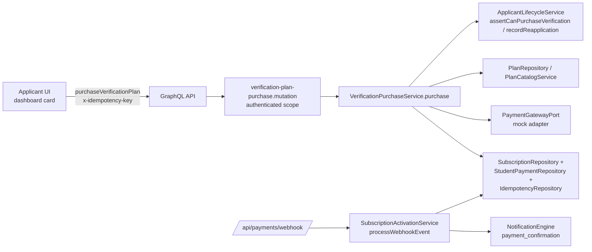

# Design: DEV2-005 — Verification Plan Purchase (5 Sessions)

> **Date**: 2026-09-11 · **Plan directory**: `ai/plans/sprint_1/verification-plan-purchase-5-sessions/`
> **Specs**: `ai/plans/sprint_1/verification-plan-purchase-5-sessions/specs.md` · **Tasks**: `ai/plans/sprint_1/verification-plan-purchase-5-sessions/tasks.md` · **Ledger**: `ai/plans/sprint_1/verification-plan-purchase-5-sessions/deferred-items.md` · **Outcome**: `ai/plans/sprint_1/verification-plan-purchase-5-sessions/outcome/`

## 1. Overview

DEV2-005 adds an applicant-facing purchase path that reuses DEV1-006's payment spine end-to-end and DEV2-004's lifecycle contract, adding only what is provably absent: a guarded `pending|failed → in_evaluation` applicant write, a nullable payment-owner column, a verification-plan purchase service + zero-arg mutation, an activation credit-skip branch, and the dashboard purchase dialog.

### Design Goals
- **G1**: One money pipeline — verification purchases flow through the same plan/`subscriptions`/`student_payments`/idempotency/webhook spine as student purchases (B.8/C.2).
- **G2**: Lifecycle truth — the applicant status flip and attempt accounting are atomic with the purchase write (docs/teachers/applicant-lifecycle.md §6).
- **G3**: Zero client authority — the wire carries no plan id, no amount, no user id (`purchaseVerificationPlan` takes NO arguments).
- **G4**: No regression for student flows — every existing behavior (lane credit, abort, notification, replay) preserved byte-for-byte.

### Key Design Decisions

**D1 — Status flip happens at PURCHASE time, not activation.**
DEV2-004's canonical doc binds the flip to the purchase flow: "`pending → in_evaluation` … the status write belongs to this flow" (`docs/teachers/applicant-lifecycle.md:119`) and the ticket AC attaches the flip to the purchase event. Activation retains money finality (paid/active + notification). *Consequence recorded:* on a `failed` webhook the applicant stays `in_evaluation` with a `pending` subscription — re-purchase from `in_evaluation` is allowed (the flip is a no-op) so no status trap exists (accepted posture, deferred-items D1).

**D2 — Dedicated zero-arg `purchaseVerificationPlan` mutation; the student mutation stays untouched.**
DEV1-006's `purchaseSubscription` is deliberately student-only (`subscription-purchase.mutation.ts:60-64`); the in-flight paymob plan re-affirms this scope lock. Widening its scope would couple this ticket to the paymob plan's invariant. A dedicated mutation preserves both contracts, removes the `planId` input entirely (the server resolves the verification plan), and gives the applicant flow its own audited surface.

**D3 — `student_payments.student_id` becomes nullable; no parallel payment table.**
The schema's student-only FK (`student-payments.ts:38-40`) makes "verbatim reuse" of the purchase writes impossible for applicants (no `students` row exists by construction — `user-provisioning.helpers.ts:90-92`). The minimal, decision-conformant delta is a nullable `student_id` (the owner of a verification payment is the subscription's generic `userId`). This preserves FR-3.2 "payment is logged in `student_payments`" without inventing a second ledger. `docs/billing/subscription-purchase.md:369-372` ("no special-casing") is amended in the Knowledge Propagation task to describe this bridge — verbatim reuse was spec fiction against the physical schema.

**D4 — Activation skips the lane credit when the purchaser is an applicant (applicants-row probe), keeps the corruption abort otherwise.**
The credit path (`subscription-activation.service.ts:393-408`) assumes a `students` row. The amendment: `students` row present → credit exactly as today; absent + `applicants` row present → skip credit (expected verification case); absent both → keep the existing abort (real corruption). Positive-students-row-first ordering keeps the branch correct for the future DEV2-009 conversion era.

**D5 — Cooldown/`passed` enforcement lives in ONE place: `assertCanPurchaseVerification`.**
DEV2-004's guard (`applicant-lifecycle.service.ts:196-228`) is the designated re-purchase choke point. Hardening it to also reject `status = passed` (`APPLICANT_ALREADY_CERTIFIED`) keeps every future purchase caller honest without a second check site; DEV2-004's own tests don't exercise `passed` purchase, so nothing breaks.

**D6 — Plan resolution by shared title constant, active-only, server-side.**
The canonical doc pins lookup-by-title (`docs/billing/subscription-purchase.md:369-372`; `plan-catalog.md:84-85`). New `shared/constants/verification-plan.constants.ts` exports `VERIFICATION_PLAN_TITLE` and `VERIFICATION_PLAN_SESSION_COUNT = 5`; the seed stays the data owner and the service/UI derive from the constant. (Seeds continue matching by title — no seed signature change.)

**D7 — Attempt increment only on re-application from `failed`.**
First purchase from `pending` leaves `verification_attempts = 0` (registration baseline, DEV2-004); a purchase from `failed` after cooldown expiry calls `recordReapplication` (+1) in the same tx. Matches ticket AC exactly ("cooldown expired → attempts incremented") and avoids double-counting the first attempt.

**D8 — No new route; dialog on the existing teacher dashboard card.**
Both purchase affordances already exist as deliberate no-ops (`ApplicantStatusZones.tsx:25-27`). The UI task swaps the no-op for the dialog — zero navigation churn, zero new nav items (project has no bottom nav).

**D9 — Idempotency and replay semantics inherited unchanged.**
Same claim table (generic `userId`), same 23505 → `ConflictError("DUPLICATE_REQUEST")` replay-by-throwing, same FK-violation → oracle-safe payment-not-found, same client rule (key survives domain rejections, rotates on success).

## 2. Architecture

### System Context


### Component Inventory
| Component | Path | Verdict |
|-----------|------|---------|
| Verification purchase service | `backend/services/teachers/verification-purchase.service.ts` | CREATE |
| Activation credit-skip branch | `backend/services/billing/subscription-activation.service.ts` (~:393-408) | UPDATE |
| Applicant guarded transition repo fn | `backend/db/repo/teachers/applicant.repository.ts` | UPDATE |
| Lifecycle guard hardening (`passed`) | `backend/services/teachers/applicant-lifecycle.service.ts:196-228` | UPDATE |
| student_payments nullable owner | `backend/db/schema/billing/student-payments.ts:38-40` + types + repo input | UPDATE |
| Mutation root field | `backend/graphql/mutation/verification-plan-purchase.mutation.ts` (flat sibling of `subscription-purchase.mutation.ts`) | CREATE |
| Wire payload/input reuse | `backend/graphql/pothos/billing/purchase-checkout.pothos.ts:41-100` | EXISTING (reuse as-is) |
| Constants | `shared/constants/verification-plan.constants.ts` (+ barrel `shared/constants/index.ts`) | CREATE |
| Frontend documents | `frontend/graphql/sharedDocuments/billing/verification-purchase.documents.ts` | CREATE |
| Purchase dialog + CTA wiring | `frontend/views/teachers/dashboard/VerificationPurchaseDialog.tsx` + `ApplicantStatusZones.tsx` | CREATE + UPDATE |
| i18n keys | `shared/locale/types/{errors,applicant}/`, `shared/locale/{en,ar}/{errors,applicant}/` | UPDATE |
| Tests | repo/service/activation/graphql/journey/component (see tasks.md) | CREATE |

### Technology Stack
| Layer | Technology | Rationale |
|-------|------------|-----------|
| API | Pothos GraphQL (`gqlSchemaBuilder.mutationField`, side-effect barrels) | House standard; mirrors DEV1-006 |
| Service | Bun TS, namespace exports via `@/backend/services` | Layer doctrine |
| DB | Drizzle + PostgreSQL; `bun run db push` for the nullable-column delta | repo policy (push = schema, migrate = custom SQL only) |
| Frontend | React 19 + MUI v9 (`sx` only) + Apollo v4 (`@apollo/client/react` hooks) | existing dashboard card stack |
| i18n | compile-time `shared/locale` (one-arg `getServerTranslations`/`getTranslations`, `defineNamespace` handles) | verified current API |

## 3. Data Models

### 3.1 Schema delta (ONE column — `db push`)

`backend/db/schema/billing/student-payments.ts` (~:38-40):

```ts
// BEFORE
studentId: integer("student_id").notNull().references(() => students.id, { onDelete: "restrict" }),
// AFTER
studentId: integer("student_id").references(() => students.id, { onDelete: "restrict" }), // nullable owner: student id, or NULL for verification purchases (owner = subscriptions.user_id)
```

- Cascade posture unchanged; the immutability trigger (append-only ledger, `pending → paid|failed`) is untouched.
- **Downstream type ripple (must audit in Task 1):** `StudentPaymentSelectType.studentId` becomes `number | null` automatically via `$inferSelect`; `StudentPaymentRepository.insertPayment` input gains `studentId: number | null`; any consumer assuming non-null (admin payment views, codegen `StudentPayment` type, seeded-payment readers) is compiled against the widened type — tsgo surfaces offenders; none may silently ignore NULLs.

### 3.2 Tables reused verbatim (no change)
- `subscriptions` (`backend/db/schema/billing/subscriptions.ts:28-53`) — `userId` generic FK; `paymentReference` partial unique index.
- `subscription_purchase_idempotency` (`…/subscription-purchase-idempotency.ts:24`) — claim + backfill.
- `plans` (`backend/db/schema/billing/plans.ts:20+`) — verified: `sessionCount`, `price decimal(10,2)`, `currency char(3)`, `intervalDays`, `balanceLane`, `isActive`.
- `applicants` (`backend/db/schema/teachers/applicants.ts:17-30`) — write target of the flip; NO schema change (status is `varchar(50)` by design).

### 3.3 Types (canonical `backend/types/`)
| Type | Status | Notes |
|------|--------|-------|
| `PurchaseSubscriptionReturnType` (`backend/types/billing/subscription.types.ts:51-55`) | REUSE | `{ subscription, payment, checkout }` — the verification purchase returns this shape |
| `PurchaseSubscriptionSubmitInput` (`subscription.types.ts:41-43`) | NOT reused | verification mutation has NO input arg |
| `PaymentCheckoutSession`, `PaymentGatewayPort` (`backend/types/billing/payment-gateway.types.ts:26,55`) | REUSE | mock adapter target |
| `ApplicantSelectType`, `ApplicantProfileReturnType` (`backend/types/teachers/applicant.types.ts:10,30-38`) | REUSE | no change |
| `StudentPaymentInsertType` (or service-internal payment insert contract) | UPDATE (via nullability ripple) | audit in Task 1 |

## 4. Components & Interfaces

### 4.1 NEW: `ApplicantRepository.transitionToInEvaluation`
`backend/db/repo/teachers/applicant.repository.ts` (append to the existing namespace):

```ts
/**
 * Guarded lifecycle transition pending|failed → in_evaluation.
 * Single-statement guarded UPDATE (state folded into WHERE + RETURNING);
 * zero rows means the applicant is already past those states — the
 * service tier disambiguates (no-op for in_evaluation; passed never
 * reaches here — the guard rejects it upstream).
 */
export async function transitionToInEvaluation(
  userId: number,
  tx?: DBTransaction
): Promise<ApplicantSelectType | null>
```
Conventions honored: optional `tx` falling back to `db`; parameterized; no prepared statement; `updatedAt` stamped; no hardcoded strings.

### 4.2 UPDATE: `ApplicantLifecycleService.assertCanPurchaseVerification` (+`passed` rejection)
`backend/services/teachers/applicant-lifecycle.service.ts:196-228` — add after the cooldown branch:
- `row.status === ApplicantStatus.Passed` → `logger.logDomainError("Verification purchase denied: already certified", { code: "APPLICANT_ALREADY_CERTIFIED", entity: "applicants", entityId: userId, locale })` then `throw new ValidationError("APPLICANT_ALREADY_CERTIFIED", t.applicantAlreadyCertified)`.
- Enum imported as VALUE import; message key new (REQ-7).

### 4.3 NEW: `VerificationPurchaseService.purchase`
`backend/services/teachers/verification-purchase.service.ts` — `export namespace VerificationPurchaseService`, registered in the teachers services barrel (importable via `@/backend/services`):

```ts
export async function purchase(
  applicantUserId: number,
  idempotencyKey: string | null,
  locale: string,
  outerTx?: DBTransaction
): Promise<PurchaseSubscriptionReturnType>
```

**Flow (mirrors `subscription-purchase.service.ts:529-591` step-for-step):**
1. `const t = getServerTranslations(locale).errorsTranslations;`
2. `isPositiveSafeId(applicantUserId)` else `ValidationError(t.validation)`.
3. `assertActorGovernanceClean(applicantUserId, t, outerTx)` (same import as DEV1-006's service).
4. `isCarryableIdempotencyKey(idempotencyKey)` else `ValidationError(t.subscriptionPurchase.idempotencyKeyRequired)` (log via `logDomainError`, never log the key itself).
5. Resolve plan: read active catalog via `PlanRepository.listActive(outerTx)` and `find(p => p.title === VERIFICATION_PLAN_TITLE)`; missing → `logDomainError` + `NotFoundError("PLAN", t.subscriptionPurchase.planNotPurchasable)`.
6. `const gateway = getPaymentGateway(locale); const checkout = await gateway.createCheckout({ studentId: applicantUserId, planId: plan.id, amount: plan.price, currency: plan.currency });` — OUTSIDE the transaction (network boundary). Note: `PaymentCheckoutInput.studentId` is a generic purchaser id slot; the applicant's user id rides it verbatim.
7. `withTransaction(outerTx, tx => purchaseInTx(...))` — inside the tx, in order:
   a. authoritative plan re-read via `PlanRepository.findActiveById(plan.id, tx)`; gone → `NotFoundError("PLAN", …)`;
   b. `ApplicantLifecycleService.assertCanPurchaseVerification(applicantUserId, locale, tx)` — **before any write** (contract `docs/teachers/applicant-lifecycle.md:119`);
   c. idempotency claim insert behind the same savepoint/23505 discipline as DEV1-006: `SubscriptionPurchaseIdempotencyRepository.insertClaim(key, applicantUserId, tx)`; 23505 → replay path (`ConflictError("DUPLICATE_REQUEST")`, zero new writes); FK-violation → `NotFoundError("PAYMENT", …)`;
   d. applicant row read for the transition decision: `ApplicantRepository.findByUserId(applicantUserId, tx)` (non-null beyond this point — the guard already proved it);
   e. `SubscriptionRepository.insertSubscription({ userId, planId, paymentMethod: gateway.provider, paymentReference: checkout.providerReference, status: pending … }, tx)` (param shape per DEV1-006 row builder);
   f. `StudentPaymentRepository.insertPayment({ studentId: null, subscriptionId, amount: plan.price, currency: plan.currency, paymentGateway: provider, paymentReference, status: pending }, tx)` — junction insert deliberately NOT performed;
   g. `if (applicant.status === ApplicantStatus.Failed) await ApplicantLifecycleService.recordReapplication(applicantUserId, locale, tx);`
   h. `await ApplicantRepository.transitionToInEvaluation(applicantUserId, tx)` — zero-row ⇒ already `in_evaluation` ⇒ silent no-op;
   i. `SubscriptionPurchaseIdempotencyRepository.updateClaimSubscriptionId(key, subscription.id, tx)`.
8. Return `{ subscription, payment, checkout }` (composed field-by-field, never spread).

**Rejections are uncaught DomainErrors** (resolvers/boundaries mask per contract); rejections log via `logDomainError` exactly-once at throw sites.

**Shared-guard helper extraction (mandatory, anti-duplication):** `isPositiveSafeId` and `isCarryableIdempotencyKey` are currently **module-private** functions inside `backend/services/billing/subscription-purchase.service.ts:109,120`. This plan PROMOTES both into a new shared module `backend/services/billing/purchase-guards.helpers.ts` (exported functions, imported by BOTH the existing purchase service and the new verification service) — a verbatim copy would trip the duplicates gate. `withTransaction` is imported from `@/backend/lib/db/with-transaction` (`with-transaction.ts:27`);
`assertActorGovernanceClean` is imported from the same module DEV1-006 uses (`@/backend/services/classes/session-lifecycle.governance`, see its import at `subscription-purchase.service.ts:78`).

### 4.4 UPDATE: activation credit-skip branch
`backend/services/billing/subscription-activation.service.ts` (~:386-408, inside the confirmed branch after `markPaidOnce`):

```ts
const purchaserStudent = await StudentRepository.findById(subscription.userId, tx); // name per existing read used nearby; verify exact helper
if (purchaserStudent !== null) {
  const credited = await StudentRepository.creditLaneBalance(subscription.userId, lane, plan.sessionCount, tx);
  if (credited === null) abortActivation("student row vanished before the lane credit", …); // EXISTING abort, unchanged
} else {
  const applicant = await ApplicantRepository.findByUserId(subscription.userId, tx);
  if (applicant === null) abortActivation("student row vanished before the lane credit", …);   // corruption: neither row exists
  // verification purchase — lane credit intentionally skipped; the 5-session
  // grant is enforced by DEV2-006's booking flow off the active subscription.
}
```
Notification emission (recipient = `subscription.userId`, persisted in-tx + post-commit publish) is unchanged.

### 4.5 NEW: GraphQL mutation
`backend/graphql/mutation/verification-plan-purchase.mutation.ts` (flat file; root `mutation/index.ts` gains a side-effect import — same wiring as `subscription-purchase.mutation.ts`):

```ts
gqlSchemaBuilder.mutationField("purchaseVerificationPlan", t =>
  t.field({
    type: PurchaseSubscriptionPayloadPothosObject,   // reuse — zero new Pothos types
    description: "…",
    authScopes: { authenticated: true },              // applicant gate is service-level (REQ-2.3); keeps post-conversion re-application reachable
    resolve: async (_root, _args, ctx) => {
      if (!ctx.user) throw new UnauthorizedError("Authentication required.");
      return VerificationPurchaseService.purchase(ctx.user.id, ctx.idempotencyKey ?? null, ctx.locale);
    },
  })
);
```

## 5. API Contract (SDL + Permission Matrix)

### 5.1 SDL delta (generated via `bun run generate:gqlSchema`)
```graphql
extend type Mutation {
  "Purchase the teacher verification plan; identity from ctx; server-resolved plan."
  purchaseVerificationPlan: PurchaseSubscriptionPayload!
}
```
(Existing `PurchaseSubscriptionPayload`/`PaymentCheckout`/`Subscription`/`StudentPayment` types unchanged.)

### 5.2 Permission Matrix
| Operation | Scope | Caller ✓/✗ |
|-----------|-------|------------|
| `purchaseVerificationPlan` | `{ authenticated: true }` + service-level `applicants`-row gate | applicant (pending/failed, cooldown-clear) ✅ · applicant passed ✗ · cooldown-active ✗ · non-applicant roles ✗ (`APPLICANT_NOT_FOUND`) · anonymous ✗ (UNAUTHORIZED) |
| `purchaseSubscription` | unchanged (`role: [Student]`) | untouched |
| `planCatalog` (query) | unchanged (`authenticated`) | powers the dialog |
| `myApplicantProfile` | unchanged | post-purchase refetch |

### 5.3 Error Contract
| Code | Class | When | i18n key (en example) |
|------|-------|------|-----------------------|
| `UNAUTHORIZED` | `UnauthorizedError` | no session | `errors.unauthorized` |
| `APPLICANT_NOT_FOUND` | `NotFoundError("APPLICANT")` | no applicants row | `errors.applicantNotFound` (EXISTING) |
| `APPLICANT_COOLDOWN_ACTIVE` | `ValidationError` (custom code) | `cooldownUntil > now` | `errors.applicantCooldownActive` (EXISTING, `{cooldownUntil}`) |
| `APPLICANT_ALREADY_CERTIFIED` | `ValidationError` (custom code) | `status = passed` | `errors.applicantAlreadyCertified` (NEW) |
| `VALIDATION` | `ValidationError` | malformed id / missing key | `errors.validation`, `errors.subscriptionPurchase.idempotencyKeyRequired` (EXISTING) |
| `PLAN_NOT_FOUND` | `NotFoundError("PLAN")` | plan absent/inactive | `errors.subscriptionPurchase.planNotPurchasable` (EXISTING) |
| `DUPLICATE_REQUEST` | `ConflictError` | key replay (same caller) | existing DEV1-006 contract |
| `PAYMENT_NOT_FOUND` | `NotFoundError("PAYMENT")` | foreign-key claim (oracle-safe) | existing DEV1-006 contract |
- GraphQL transport: HTTP 200 + `errors[].extensions.code` (custom codes pass through verbatim). The 422 HTTP mapping applies only to REST envelopes (`error-code-taxonomy.ts:41-51`); UI branches on `extensions.code`.

### 5.4 Concurrency & Race-Condition Assessment (REQUIRED — shared money + lifecycle rows)

| Scenario | Actors | Risk | Mitigation |
|----------|--------|------|------------|
| Double-submit same key | one applicant | duplicate charge | claim 23505 → `DUPLICATE_REQUEST`; this attempt rolls back |
| Double purchase, distinct keys | one applicant | two pending pairs | inherited DEV1-006 posture (allowed; mirrors student flow); flip is no-op on 2nd (guarded UPDATE) |
| Cooldown flips mid-purchase | cooldown writer (DEV2-008) vs purchase | TOCTOU | guard runs with the PURCHASE `tx` (docs/teachers/applicant-lifecycle.md §4,§6); single captured `now`; strict `>` |
| Two re-applications race (distinct keys, status `failed`) | one applicant | attempts +2 instead of +1 | row-lock ordering makes them sequential; both are genuine purchases of two plans (documented accepted posture — mirrors students) |
| Activation replay | webhook retries | double credit/notification | EXISTING `activatePendingOnce` zero-row arbiter + `markPaidOnce`; unchanged |
| Activation vs applicant purchase | webhook + mutation | flip ordering | flip is purchase-time (D1); activation never touches status |
| FK restrict on payment owner | concurrent student delete | blocked writes | `students` FK restrict; verification payments carry NULL owner — unaffected |

**SELECT FOR UPDATE / locks:** none new required — the claim UNIQUE index, guarded UPDATE row lock, and `activatePendingOnce` suffice. TOCTOU window documented: guard → write share one tx (closed).

### 5.5 Journey Design (maps 1:1 to specs §6 J1)
**Shared-entity state machine (`applicants.status` × purchase):**
| Current | Trigger (actor) | Next | Guard |
|---------|-----------------|------|-------|
| `pending` | applicant purchases | `in_evaluation` | cooldown clear, plan active, key carried |
| `failed` (+ expired cooldown) | applicant re-purchases | `in_evaluation` (+ attempts +1) | guard strict `>` |
| `failed` (+ active cooldown) | purchase attempt | `failed` (no change) | `APPLICANT_COOLDOWN_ACTIVE` thrown pre-write |
| `passed` | purchase attempt | `passed` (no change) | `APPLICANT_ALREADY_CERTIFIED` |
| `in_evaluation` | purchase attempt | `in_evaluation` (no-op flip) | allowed; new pending pair created |

**Side-effect matrix:**
| Transition | Rows | Notifications | Idempotency |
|-----------|------|---------------|-------------|
| purchase success | +claim, +subscription(pending), +student_payments(pending, studentId NULL), claim backfill, applicants flip/(+attempt) | none at purchase | claim key |
| webhook confirmed | subscription → active, payment → paid | `payment_confirmation` → purchaser (persist in-tx, publish post-commit) | `activatePendingOnce` arbiter |
| webhook failed | payment → failed (existing branch) | existing unchanged posture | existing |

**Cross-actor visibility:** purchaser sees new status via `myApplicantProfile`; subscription via existing owner-scoped reads; non-owners cannot observe the pair (no id-addressed reads; foreign key replay → payment-not-found).

## 6. UX / Navigation Specification (explicit no-new-route ruling)

**No new routes, no sidebar changes, no bottom-nav (none exists — responsive Drawer only).** The purchase surface attaches to the existing teacher dashboard.

| Element | Path | Change |
|---------|------|--------|
| Teacher dashboard page | `app/(dashboard)/teacher/dashboard/page.tsx` | UNCHANGED (`createRoleDashboardPage(UserRole.Teacher, "/teacher/dashboard")`) |
| Status card host | `frontend/views/dashboard/home/RoleDashboardPage.tsx:53` | UNCHANGED |
| CTA zones | `frontend/views/teachers/dashboard/ApplicantStatusZones.tsx` | UPDATE — `handleReapplyIntent` (:25-27) and pending prompt CTA open the dialog |
| Purchase dialog | `frontend/views/teachers/dashboard/VerificationPurchaseDialog.tsx` | CREATE — MUI v9 `Dialog`, `sx` only, theme palette callbacks, RTL-safe |
| i18n | `applicant` namespace + keys (REQ-7) | UPDATE |

**Dialog behavior:** shows plan descriptor (from `planCatalog` query, title-matched on `VERIFICATION_PLAN_TITLE`; missing-plan → disabled confirm + error state), confirm executes the mutation with a per-attempt `x-idempotency-key` (context header; rotate on success, keep across domain rejections), success refetches `myApplicantProfileQueryDocument` + success snackbar; failures branch on `extensions.code` per REQ-6.5; `checkout.checkoutUrl === null` (mock) → no redirect. MUI v9: `sx` props only; `CloseRounded`/`ErrorOutlined` icon conventions; React 19 event types.

## 7. Security & Tenancy Mitigations

- **BOLA/IDOR**: mutation inputless; purchaser = `ctx.user.id`; no resource id on the wire.
- **BOPLA**: zero client fields; money/plan/owner server-derived only.
- **BFLA**: authenticated scope + applicant-row gate; no admin/privileged path is reachable from this surface.
- **Replay/idempotency**: claim-table 23505 arbiter; oracle-safe foreign-key denial.
- **Money integrity**: plan-row amounts only; unique `payment_reference`; append-only payment ledger.
- **Webhook**: unchanged HMAC/kill-switch/body-cap posture (`app/api/payments/webhook/route.ts`).
- **Logging hygiene**: `logDomainError` codes only; idempotency keys never logged; no PII in error strings beyond localized public copy.
- **i18n injection**: server templates known-fixed placeholders (`{cooldownUntil}`); dialog line placeholders validated by parity pins.

## 8. i18n Spec (keys landing in this plan)

| Key | Namespace | Locales | Placeholders |
|-----|-----------|---------|--------------|
| `applicantAlreadyCertified` | `errors` | en+ar | none |
| `purchaseDialogTitle` | `applicant` | en+ar | none |
| `purchasePlanLine` | `applicant` | en+ar | `{title} {price} {currency} {sessions} {days}` — order matches specs REQ-7.2 `(title, price, currency, sessions, days)` (pinned by parity test) |
| `purchaseConfirmCta` / `purchaseCancelCta` | `applicant` | en+ar | none |
| `purchaseSuccess` | `applicant` | en+ar | none |
| `purchaseGenericError` | `applicant` | en+ar | none |

Mechanics: extend `shared/locale/types/{errors,applicant}/index.ts`, `shared/locale/{en,ar}/{errors,applicant}/index.ts`; parity suites (`shared/locale/*-namespace.parity.test.ts`) extended with placeholder pins. NO new namespace, NO `Translation` enum (not in this codebase), NO `t('call')`.

## 9. Testing Strategy

| Layer | File | Runner |
|-------|------|--------|
| Repo | `backend/db/test/repo/teachers/applicant.repository.transition.test.ts` (new) + student-payment null-owner cases in the existing billing repo tests | `bun run test/scripts/run-test.ts <path>` |
| Service | `backend/services/teachers/verification-purchase.service.test.ts` (4-tier; `MockPaymentGatewayAdapter.prototype.createCheckout` spy seam; `runInRollback` + `outerTx`) | `bun run test/scripts/run-test.ts <path>` |
| Activation | extend `backend/services/billing/subscription-activation.service.test.ts` (applicant credit-skip, student regression, corruption abort, notification) | same |
| GraphQL | `frontend/graphql/test/teachers/verification-plan-purchase.test.ts` (401 / APPLICANT_NOT_FOUND / VALIDATION; `describeGraphqlSuite` + `setupTestServerLifecycle` + `testClient` Bearer pattern from `applicant-profile.test.ts:109-190`) | `bun run test:graphql` |
| Journey | `test/workflows/teachers/verification-plan-purchase.journey.test.ts` (specs §6 steps 1-8) | `bun run test/scripts/run-test.ts test/workflows/teachers/verification-plan-purchase.journey.test.ts` |
| UI | component tests for dialog + zones wiring (Happy DOM, Apollo mocks, `test/ui/components/…`) | `bun run test:ui:components` |
| Locale | extend errors/applicant parity suites | `bun run test/scripts/run-test.ts` |

## 10. Migration & Compatibility

- Schema delta via `bun run db push` (nullable column; repo policy: push = schema, migrate = custom SQL only). Existing rows unaffected (no verification payments exist).
- GraphQL regeneration REQUIRED + committed: `bun run generate:gqlSchema && bun codegen`.
- Backward compatibility: `purchaseSubscription`, activation, webhook, seeds — unchanged behavior for existing roles.
- Rollback: drop the mutation + revert column nullability (nullable → NOT NULL safe only because no NULL owners exist in prod yet).

## 11. Outcome & Knowledge Transfer Protocol

- BEFORE any task: read all files in `ai/plans/sprint_1/verification-plan-purchase-5-sessions/outcome/`.
- AFTER each task: write `outcome/<task-id>-outcome.md`; flip the checkbox in `tasks.md`.
- Final task: consolidate learnings into `docs/teachers/verification-plan-purchase.md` and rewrite the stale consumer-guidance paragraph at `docs/billing/subscription-purchase.md:369-372` (D3 ruling). Rule files (AGENTS.md / `.agents/instructions/`) are NOT touched (hand-curated only).

## 12. Drizzle SQL Template Anti-Patterns (binding)

No inline `--` comments inside `sql`` templates (parameter-shift bug); block comments only. No `inArray`+prepared-statement combos. Guarded UPDATEs single-statement with `RETURNING *`.
