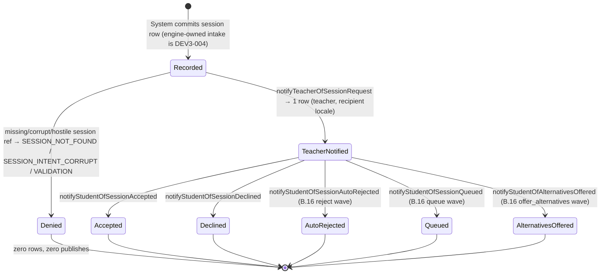

# Technical Architecture & Implementation Design: DEV3-011 — Session Request Notification to Teacher

> **Plan directory (verbatim — every header, ledger path, and self-reference in this plan uses this exact string):** `ai/plans/sprint_2/dev3-011-session-request-notification-to-teacher`
> **Specs of record:** `ai/plans/sprint_2/dev3-011-session-request-notification-to-teacher/specs.md` (REQ-001..REQ-095)
> **Canonical refs:** `docs/notifications/realtime-engine.md` (§3.1–3.6 — single-writer emit, caller-tx receipt / publish-after-commit, fail-open claim layer, engine-never-translates D2) · `docs/workflows/02-on-demand-matching-workflow.md` §4 (request → notify → accept/decline sequence) · `docs/backend/cross-stream-contracts.md` (`SessionEventNotificationContract`) · `docs/specs/open-decisions-and-gaps.md` (A.4, A.4.1–A.4.3, B.16) · `docs/testing/workflow-journey-tests.md` · `docs/graphql/domain-error-extensions-code.md` · `docs/graphql/error-handling-contract.md` · `docs/DATABASE_MIGRATIONS.md`
> **Blocking dependency:** DEV3-010 (real-time engine) — SHIPPED (`backend/services/notifications/notification-engine.service.ts` — `emitForUser` at :327-369, `publishReceipts` at :475-481, `publishReceiptsFromIndex` at :612-645).
> **Scope ruling under ratification at Phase 1.5:** this ticket ships the canonical six-emitter **notification wave module** ONLY. Session request/accept/decline mechanics, B.16 routing resolution, and any GraphQL/frontend surface are forward consumption contracts (DEV3-004/005, DEV2-011, DEV3-008) — recorded as resolved-pointer deferred entries, never silently absorbed.

---

## 1. System Overview & Architecture Diagram

### 1.1 Scope Statement

DEV3-011 adds four net-new backend artifacts and nothing else:

1. **`SessionRepository`** (NEW domain dir `backend/db/repo/classes/`) — `findById` + `findWaveContextById` (ONE joined read returning the session's id/intent plus BOTH participants' `fullName` + `locale`).
2. **`SessionRequestNotificationService`** (NEW domain dir `backend/services/classes/`) — the six wave emitters (`notifyTeacherOfSessionRequest`, `notifyStudentOfSessionAccepted`, `notifyStudentOfSessionDeclined`, `notifyStudentOfSessionAutoRejected`, `notifyStudentOfSessionQueued`, `notifyStudentOfAlternativesOffered`), composing recipient-locale copy and emitting EXCLUSIVELY through `NotificationEngine.emitForUser`.
3. **Canonical types** in `backend/types/classes/session-notification.types.ts` — `SessionRequestWaveKind` (closed six-member union) + the wave-context row/return shapes.
4. **i18n keys** — 15 new keys on the EXISTING `notifications` namespace (6 titles + 6 body functions + 3 intent labels) and 2 new flat `errors` keys (`sessionNotFound`, `sessionIntentCorrupt`).

There are **ZERO schema changes, ZERO GraphQL root fields, ZERO frontend files** — the wave is consumed by the already-shipped inbox (`NotificationDrawer` / `NotificationUnreadBadge` / realtime toast host) whose `typeSessionRequest` label already exists (`shared/locale/en/notifications/index.ts:11`, `ar`:11).

### 1.2 Data Flow

```text
FUTURE CALLER (DEV3-004 session engine — NOT in this ticket)          THIS TICKET
─────────────────────────────────────────────────────────────         ───────────────────────────────
session write committed ──(sessionId, tx?)──► SessionRequestNotificationService.<emitter>
                                                    │
                                                    ├─ isPositiveSafeInt(sessionId)          [pre-DB]
                                                    ├─ SessionRepository.findWaveContextById ──┐
                                                    │     session ⋈ users (student)            │
                                                    │          ⋈ users (teacher)               │
                                                    │     → { intent, student{name,locale},    │
                                                    │          teacher{name,locale} }          │
                                                    ├─ isSessionIntent(row.intent)  [fail-closed]
                                                    ├─ recipientLocale = recipient.locale
                                                    │       ?? defaultLocale  ("ar")
                                                    ├─ compose copy via
                                                    │   getServerTranslations(recipientLocale)
                                                    │     .notificationsTranslations
                                                    ├─ NotificationEngine.emitForUser( ────────┼── ONLY writer
                                                    │     input { userId, SessionRequest,
                                                    │       title, body,
                                                    │       relatedEntityType:"session",
                                                    │       relatedEntityId: sessionId,
                                                    │       idempotencyKey:
                                                    │         `session:${id}:${waveKind}` },
                                                    │     recipientLocale, tx?, options )
                                                    │
              caller-tx path:                       │        own-commit path (tx=undefined):
              return receipt, NO publish            │        engine commits + stores receipt +
              (caller publishes post-commit via     │        publishes; replay under a held
               NotificationEngine.publishReceipts)  │        claim returns prior receipt,
                                                                 ZERO new row, ZERO publish
                                                    │
                                                    ▼
                                     notifications row (recipient) + realtime envelope
                                     (SpiedFanoutTransport in service/journey tiers)
```

### 1.3 Key Design Decisions Table

| # | Decision | Options Considered | Pros / Cons | Rationale (Maintainability, Scalability, Reliability) |
|---|---|---|---|---|
| D1 | **Two emission paths with the engine's OWN own-commit branch used directly** (no wrapper tx round it): caller-tx → `emitForUser(input, recipientLocale, tx, options)` returns the receipt and the service NEVER publishes; no-tx → `emitForUser(input, recipientLocale, undefined, options)` and normalize the return into a `NotificationDeliveryReceipt` (replay detection via the `"notifications" in result` type guard — replayed receipts carry the `notifications` array; fresh own-commit returns the bare row, which we wrap as `{ notifications: [row], recipientUserIds }`) | (a) always wrap own-commit in our own `db.transaction` + call `publishReceipts` ourselves (DEV3-018 choreography); (b) ride the engine's own-commit branch directly | (a) Pros: uniform receipt shape (`emitClaimKey` present). Cons: publish-on-REPLAY becomes OUR bug — a replayed `priorReceipt` handed to `publishReceipts` re-publishes (`publishReceiptsFromIndex` re-publishes any receipt with a representative row, `notification-engine.service.ts:641-644`); the engine's own-commit path (`:343-345`, claim-duplicate handling at `:302-304`) already implements "replay ⇒ return prior receipt, ZERO publish" and stores the fresh receipt itself (`:363-366`, publishes internally at `:367`). (b) Pros: replay/claim/publish correctness is engine-owned; REQ-094's "zero new rows + zero new publishes" holds by construction. Cons: fresh own-commit returns a bare row that we wrap (documented). | (b). Correctness of the idempotent replay beat all uniformity concerns; REQ-094 journey step 3 IS the engine's own-commit replay semantics. The caller-tx path still returns the engine receipt verbatim WITHOUT publish (publish-after-commit belongs to the future engine caller per engine §3.2). |
| D2 | **Emitter signature carries `locale` as the second positional argument** — `(sessionId: number, locale: string, tx?: DBTransaction, options?: NotificationEngineCallOptions) => Promise<NotificationDeliveryReceipt>` | (a) specs.md REQ-011's literal signature `(sessionId, tx?, options?)`; (b) house convention `(sessionId, locale, tx?, options?)` | (a) Literal-conformant but cannot localize the `SESSION_NOT_FOUND` / `SESSION_INTENT_CORRUPT` / `VALIDATION` errors that REQ-012 mandates, and cannot tell the engine which locale to use for ITS validation copy. (b) Every sibling service takes locale second — `ApplicantLifecycleService.getMyApplicantProfile(userId, locale, tx)` (`backend/services/teachers/applicant-lifecycle.service.ts:137-141`), `StudentHandshakeService.findStudentByHandshakeCode(code, locale, tx?)`, `StudentTrialService.grantFreeTrial(studentId, locale, tx)`. | (b) — recorded as a signature-level reconciliation for plan review. The caller-supplied `locale` governs SERVICE-SIDE error messages ONLY; recipient COPY always resolves from `users.locale` (REQ-014), which keeps the D2-recipient-locale obligation untainted. |
| D3 | **ONE joined read** for the wave context (`session ⋈ users ×2` via `alias()` in the Drizzle tx branch; a flat aliased SELECT in the `queryDb` branch) instead of 3 separate repo reads + `UserRepository.findLocalesByIds` | (a) three PK reads + `findLocalesByIds` (`user.repository.ts:152-155`); (b) single 3-way join | (a) 3–4 round trips per wave; torn reads possible across statements outside a tx. (b) One statement, one snapshot, the exact counterparty pair bound to the SAME session row — the derived-recipient BOLA invariant is enforced by the join itself. Cons: needs a driver-split repo method (precedent exists verbatim in `student.repository.ts:96-112`). | (b). Fewer round trips, stronger identity derivation, and the repo-row interface lives in the canonical types file per REQ-003. |
| D4 | **ALL SIX waves use the EXISTING `NotificationType.SessionRequest`** — the notification-type vocabulary is NOT widened | (a) new enum members per wave (`session_accepted`, …); (b) reuse `SessionRequest` | (a) requires a pgEnum + schema drift (FORBIDDEN by REQ-017) and a wire/type/parity cascade; (b) `session_request` IS the lifecycle type for this wave family; differentiation lives in the copy + deterministic idempotency key. | (b). Zero schema drift (REQ-017/043 gates) and the parity suite's seven-value `type*` pins stay untouched (`notifications-namespace.parity.test.ts`). |
| D5 | **Deterministic key `session:<sessionId>:<waveKind>` on EVERY emit** (REQ-015); no caller-provided key surface | (a) opt-in keys; (b) mandatory deterministic | (a) lets caller retries multi-insert. (b) dedupe is engine-claim mechanics (fail-open per A.4.2); bounded length makes the 128-char engine ceiling (`emit-validation.ts:40`) unreachable-by-construction. | (b). This module is NOT in `docs/IDEMPOTENCY.md`'s mandated key set (Students/Invoices/Class Instances/Payments); deterministic keys give replay safety without claiming that posture. |
| D6 | **Copy keys extend the EXISTING `notifications` namespace** as flat non-`type*` slots (6 titles + 6 body functions + 3 intent labels) instead of a new namespace | (a) new `sessionRequests` namespace; (b) extend `notifications` (DEV3-018 D7 precedent) | (a) registry + bundle + parity scaffolding for one emitter family is noise. (b) constraint-compatible: the parity suite pins `type*` keys to exactly the seven enum labels — our keys are `event*`/`intent*`-prefixed, so the invariant survives; the suite's `MANDATED_KEYS`/`FUNCTION_KEYS` inventories are extended in the SAME changeset (REQ-051). | (b). Namespace cohesion + precedent; type-label invariant provably green. |
| D7 | **Stored `session.intent` is fail-closed through the EXISTING `isSessionIntent` guard** (`backend/types/contracts/contract-guards.ts:76-78`); `null` or non-member ⇒ `SESSION_INTENT_CORRUPT` | (a) tolerate null intent on outcome waves (their copy omits intent); (b) uniform fail-closed | (a) leaves a corrupt row silently flowing (a partial-truth surface); the session-request contract (`session-request.contract.types.ts:17-32`) REQUIRES intent at request time, so any stored null/garbage is corrupt state on this surface. (b) one predicate, total. | (b). REQ-012 + journey step 8 pin this branch; better an explicit domain error than silent copy degradation. |
| D8 | **Emitters are internal primitives: NO role/permission logic inside the module** (REQ-018) | (a) emitter-side role gates; (b) documented internal-primitive posture | (a) duplicates whatever the future session engine does and creates a double authorization truth. (b) recipients are DERIVED from the persisted session's FK chain — there is no identity argument to abuse (REQ-031). | (b). BFLA for the future caller is the caller's graphQL scope; this module's BOLA safety is structural (no recipient parameters at all). |
| D9 | **Journey fixtures are committed via DIRECT Drizzle inserts** (the session CREATION write path is DEV3-004's; sanctioned fixture-level composition per the DEV3-022c journey ruling) | (a) build a throwaway intake mutation for the test; (b) direct committed inserts | (a) fabricates scope that the ticket forbids (zero new GraphQL surface). (b) honest: the journey tests the WAVE against committed shared state. | (b). `test/workflows/AGENTS.md` committed-fixture + tracked-teardown rules apply unchanged. |
| D10 | **ZERO GraphQL / frontend / schema surface** — freeze suites stay green UNEDITED; codegen rerun is a recorded no-diff | (a) baseline re-anchor if drift found; (b) ledger entry | The bundled `schema-surface.test.ts:19-71` baselines are stale relative to shipped DEV3-016 fields — but re-anchoring them here is a foreign-scope edit. | (b). Any discovered baseline drift becomes a ❌-free ledger entry in `ai/plans/sprint_2/dev3-011-session-request-notification-to-teacher/deferred-items.md` pointing at the freeze-suite owner — this ticket's diff never touches the baselines (REQ-060). |

---

## 2. Data Models & Database Schema

### 2.1 Existing Schema Verification (READ-ONLY — zero drift gate REQ-017/043)

| Element | Verified anchor (bundled code) | Consumed as |
|---|---|---|
| `session` PK identity `id`, `teacherId` NOT NULL FK→`teacher.id`, `studentId` NOT NULL FK→`students.id`, `intent` nullable `session_intent`, `status`, `createdAt` | `backend/db/schema/classes/session.ts:32-63` | read target of `findById` / `findWaveContextById` |
| `teacher` shared-PK with `users.id` (`teacher.id = users.id`) | `backend/db/schema/teachers/teacher.ts:19-38` | implicit in the join (session.teacherId → users.id via shared PK) |
| `students` shared-PK with `users.id` | `backend/db/schema/students/students.ts:18-47` | same |
| `users.fullName` / `users.locale` (nullable `app_locale`) | `backend/db/schema/users/users.ts:11-45` (`locale` at `:29`) | counterparty name + recipient locale |
| `notifications` append-only rows (`userId`, `type`, `title`, `body`, `isRead`, `relatedEntityType`, `relatedEntityId`) | `backend/db/schema/notifications/notifications.ts:27-46` | written ONLY by the engine |
| `NotificationType.SessionRequest = "session_request"` | `backend/enum/notifications/notification-type.enum.ts:6` (pgEnum parity `backend/db/schema/enums.ts:56-64`) | every wave's `type` |
| `SessionIntent` members (`Hifz`/`Tajweed`/`Evaluation`) + guard `isSessionIntent` | `backend/enum/scheduling/session-intent.enum.ts` + `backend/types/contracts/contract-guards.ts:76-78` | fail-closed intent guard |
| `SessionEventNotificationContract` | `backend/types/contracts/session-notification.contract.types.ts:42-52` | FIRST consumer — conformance suites stay green UNEDITED |

**Zero-drift gate:** `git diff -- backend/db/schema/** backend/db/migration/**` MUST be EMPTY at completion. No `bun run db push` is ever invoked for this ticket. No new enum (TS or pg), no new table, no new column, no new index.

### 2.2 Canonical Types — ONE Additive File

**NEW `backend/types/classes/session-notification.types.ts`** (exported from `backend/types/classes/index.ts`, which today re-exports six files):

```typescript
import type { SessionIntent } from "@/backend/enum/scheduling/session-intent.enum";
import type { AppLocale } from "@/shared/locale/AppLocale";

/** Closed wave vocabulary — the six lifecycle notifications of a session request. */
export type SessionRequestWaveKind =
  | "teacher_request"
  | "outcome_accepted"
  | "outcome_declined"
  | "outcome_auto_rejected"
  | "outcome_queued"
  | "outcome_alternatives_offered";

/** Raw joined read row (intent is STILL untrusted storage at this layer). */
export interface SessionWaveContextRow {
  readonly sessionId: number;
  readonly intent: string | null;
  readonly studentUserId: number;
  readonly studentFullName: string;
  readonly studentLocale: AppLocale | null;
  readonly teacherUserId: number;
  readonly teacherFullName: string;
  readonly teacherLocale: AppLocale | null;
}

/** Service-level, guard-validated wave context — intent is a real SessionIntent here. */
export interface SessionWaveParticipantContext {
  readonly userId: number;
  readonly fullName: string;
  readonly locale: AppLocale | null;
}

export interface SessionWaveContext {
  readonly sessionId: number;
  readonly intent: SessionIntent;
  readonly student: SessionWaveParticipantContext;
  readonly teacher: SessionWaveParticipantContext;
}
```

No `SessionRequestSubmitInput` is needed: the emitters' only caller input is the bare `sessionId` (REQ-031 closes the input model by construction). `SessionSelectType` is reused from `backend/types/classes/session.types.ts:3` for `findById`. The contracts conformance suites (`contracts.conformance.test-d.ts`, `contracts.static-assertions.test.ts`) are NOT edited.

### 2.3 i18n Additions (REQ-051 — same changeset)

| Namespace | File(s) | New keys (EXACT inventory) |
|---|---|---|
| `notifications` | `shared/locale/types/notifications/index.ts` + `en/notifications/index.ts` + `ar/notifications/index.ts` | Titles (string): `eventSessionRequestTitle`, `eventSessionAcceptedTitle`, `eventSessionDeclinedTitle`, `eventSessionAutoRejectedTitle`, `eventSessionQueuedTitle`, `eventSessionAlternativesOfferedTitle` · Bodies (functions): `eventSessionRequestBody: (studentName: string, intentLabel: string) => string`, `eventSessionAcceptedBody`, `eventSessionDeclinedBody`, `eventSessionAutoRejectedBody`, `eventSessionQueuedBody`, `eventSessionAlternativesOfferedBody` (each `(teacherName: string) => string`) · Intent labels (string): `intentHifz`, `intentTajweed`, `intentEvaluation` |
| `errors` | `shared/locale/types/errors/index.ts` + `en/errors/index.ts` + `ar/errors/index.ts` | FLAT domain-prefixed keys: `sessionNotFound`, `sessionIntentCorrupt` (flat precedent: `notificationNotFound`, `studentHandshakeNotFound` at `shared/locale/types/errors/index.ts:93,97`) |

Parity choreography (REQ-051 + REQ-073): `shared/locale/notifications-namespace.parity.test.ts` is extended in the SAME changeset — `MANDATED_KEYS` 26 → 41 entries, `FUNCTION_KEYS` 4 → 10; the "exactly seven `type*`-prefixed slots" assertion stays green by prefix-discipline; new pins assert every new `ar` STRING slot contains Arabic script and every new ar FUNCTION returns Arabic-script output (mirroring the suite's existing Arabic pins — the `ARABIC_SCRIPT` regex at `notifications-namespace.parity.test.ts:102` and the pinned Arabic strings at :192-238). The global `errors`-namespace parity suite (`errors-namespace.parity.test.ts`) stays green structurally (it walks all keys). Arabic body slots use the locale's plural-free templates (fixed teacher/student name interpolation).

---

## 3. API Contracts & Pothos Resolvers

### 3.1 GraphQL Surface — HARD FROZEN (REQ-060)

**Zero new root fields, zero new types, zero new inputs, zero new enums.** No `requestSession` / `acceptSessionRequest` / `declineSessionRequest` / `*session*` token may appear on either root.

- `backend/lib/gateway/public-operations.ts:36-46` stays the frozen six (this ticket adds NO anonymous operation, so no allowlist rationale row is needed at all).
- `backend/graphql/test/schema-surface.test.ts`, `sdl-static-assertions.test.ts`, `handshake-code-surface.test.ts`, `plan-catalog.schema.test.ts` (committed-vs-live SDL equality, `:67-73`) stay GREEN WITHOUT edits.
- `bun run generate:gqlSchema && bun codegen` runs as a **no-diff proof** recorded in the outcome; no artifact changes are committed.
- IF baseline drift is discovered (e.g. DEV3-016-era fields missing from frozen inventories): ledger entry in `ai/plans/sprint_2/dev3-011-session-request-notification-to-teacher/deferred-items.md` (resolved-pointer to the freeze-suite owner) — NEVER a silent re-anchor in this ticket.

### 3.2 Permission Matrix (no new surface — behavior is inherited)

| Caller | Behavior on this ticket's emission surface |
|---|---|
| Anonymous | No GraphQL surface exists to call. Emitters are service-internal; no anonymous path exists by construction (a `sessionId` is only meaningful to a caller who already owns a committed session row — DEV3-004's future scope-gated intake). |
| Student / Parent / Teacher / Admin | Same answer — no role-matrix addition is possible or required. The inherited inbox surface (`myNotifications` / `markNotificationRead` / realtime toast) renders wave rows to their recipient per the already-locked engine contract. |
| Governed caller (suspended/blocked/deleted, pre-issued token) | **Unchanged governance window** (`docs/notifications/realtime-engine.md` §3.10 D5). This ticket adds NO context-factory change and NO service-level governorship re-check — recorded honestly (REQ-034). Emitters do NOT filter governed participants (read-side concern of the future intake). |

### 3.3 Error/Code Contract (engine surface is untouched; module-internal codes)

| `extensions.code` | Producer branch | Error class | i18n key |
|---|---|---|---|
| `VALIDATION` | hostile `sessionId` (non-positive-safe-int) BEFORE any DB read | `ValidationError(t.validation)` (default-code form, `backend/lib/errors.ts:65-130` — overloads at `:78-86`) | `errorsTranslations.validation` (existing) |
| `SESSION_NOT_FOUND` | `findWaveContextById` → null | `NotFoundError("SESSION", t.sessionNotFound)` (entity-name ctor form — auto-derives the code, `errors.ts:37-41`) | `sessionNotFound` (NEW) |
| `SESSION_INTENT_CORRUPT` | stored intent fails `isSessionIntent` | `ValidationError("SESSION_INTENT_CORRUPT", t.sessionIntentCorrupt)` (overloaded ctor) | `sessionIntentCorrupt` (NEW) |
| engine-owned validation of the emit input | malformed in-module input composition (unreachable under the whitelisted builder) | engine's own `ValidationError` | engine-owned |

DomainErrors propagate UNCATCHED out of the emitters; no try/catch, no masking inside the module. `UNAUTHORIZED`/`FORBIDDEN` are NEVER produced here (no GraphQL resolver exists).

---

## 4. Backend Services, Repositories & Concurrency Model

### 4.1 NEW Repository — `backend/db/repo/classes/session.repository.ts`

New domain dir + barrel: `backend/db/repo/classes/index.ts` (`export * from "./session.repository";`), registered in `backend/db/repo/index.ts` (`+ export * from "./classes";`).

```typescript
export namespace SessionRepository {
  /** Bare PK read, tx-vs-queryDb branch per the student.repository.ts:96-112 idiom. */
  export async function findById(sessionId: number, tx?: DBQueryExecutor): Promise<SessionSelectType | null>;

  /** ONE joined read of the wave context — session + BOTH participants' names/locales. */
  export async function findWaveContextById(sessionId: number, tx?: DBQueryExecutor): Promise<SessionWaveContextRow | null>;
}
```

**`findWaveContextById` semantics (REQ-012 read substrate):**

- tx branch (Drizzle, `isDBTransaction` discriminator per `student.repository.ts:33-36`): two table aliases via `alias(users, "wave_student_user")` / `alias(users, "wave_teacher_user")` from `drizzle-orm/pg-core`; `innerJoin` on `session.studentId` and `session.teacherId`; `where(eq(session.id, sessionId)).limit(1)`.
- Non-tx branch (`queryDb`): ONE flat parameterized statement (NO inline `--` comments anywhere in the template — parameter-binding hazard):

```sql
SELECT s.id AS "sessionId", s.intent AS "intent",
       su.id AS "studentUserId", su.full_name AS "studentFullName", su.locale AS "studentLocale",
       tu.id AS "teacherUserId", tu.full_name AS "teacherFullName", tu.locale AS "teacherLocale"
FROM session s
JOIN users su ON su.id = s.student_id
JOIN users tu ON tu.id = s.teacher_id
WHERE s.id = $1 LIMIT 1
```

No prepared statements (dynamic read whose Postgres-vs-Neon branching already exists in the repo idiom), no `inArray`+`sql.placeholder`, no LIKE/ILIKE anywhere — the `escapeLikeWildcards` obligation is N/A **by construction** on this module.

### 4.2 NEW Service — `backend/services/classes/session-request-notification.service.ts`

New domain dir + barrel: `backend/services/classes/index.ts` (`export * from "./session-request-notification.service";`), registered in `backend/services/index.ts` (`+ export * from "./classes";`).

```typescript
export namespace SessionRequestNotificationService {
  export async function notifyTeacherOfSessionRequest(sessionId: number, locale: string, tx?: DBTransaction, options?: NotificationEngineCallOptions): Promise<NotificationDeliveryReceipt>;
  export async function notifyStudentOfSessionAccepted(/* identical shape */): Promise<NotificationDeliveryReceipt>;
  export async function notifyStudentOfSessionDeclined(/* … */): Promise<NotificationDeliveryReceipt>;
  export async function notifyStudentOfSessionAutoRejected(/* … */): Promise<NotificationDeliveryReceipt>;
  export async function notifyStudentOfSessionQueued(/* … */): Promise<NotificationDeliveryReceipt>;
  export async function notifyStudentOfAlternativesOffered(/* … */): Promise<NotificationDeliveryReceipt>;
}
```

Each public method is a ONE-LINE delegate into a private `emitWave(...)`:

```text
emitWave(sessionId, waveKind, recipientSide: "student" | "teacher", locale, tx, options):
1. const tErrors = getServerTranslations(locale).errorsTranslations;
2. isPositiveSafeInt(sessionId) — else ValidationError(tErrors.validation)   [PRE-DB, zero reads]
3. row = await SessionRepository.findWaveContextById(sessionId, tx)
   row === null → ONE logDomainError { code:"SESSION_NOT_FOUND", entity:"session", entityId, locale }
                  → throw NotFoundError("SESSION", tErrors.sessionNotFound)
4. intent = isSessionIntent(row.intent) ? row.intent : corrupt —
   corrupt → ONE logDomainError { code:"SESSION_INTENT_CORRUPT", entity:"session", entityId, locale }
             → throw ValidationError("SESSION_INTENT_CORRUPT", tErrors.sessionIntentCorrupt)
5. recipient = recipientSide === "teacher" ? teacherCtx : studentCtx
   counterparty = the other side (name source for copy)
6. recipientLocale = recipient.locale ?? defaultLocale            (shared/locale/AppLocale.ts:3)
7. compose via getServerTranslations(recipientLocale).notificationsTranslations:
   teacher_request           → { eventSessionRequestTitle, eventSessionRequestBody(student.fullName, intentLabel(intent, n)) }
   outcome_accepted          → { eventSessionAcceptedTitle,  eventSessionAcceptedBody(teacher.fullName) }
   outcome_declined          → { eventSessionDeclinedTitle,  eventSessionDeclinedBody(teacher.fullName) }
   outcome_auto_rejected     → { eventSessionAutoRejectedTitle, eventSessionAutoRejectedBody(teacher.fullName) }
   outcome_queued            → { eventSessionQueuedTitle,    eventSessionQueuedBody(teacher.fullName) }
   outcome_alternatives_offered → { eventSessionAlternativesOfferedTitle, eventSessionAlternativesOfferedBody(teacher.fullName) }
   (intentLabel: SessionIntent.Hifz → n.intentHifz · Tajweed → n.intentTajweed · Evaluation → n.intentEvaluation;
    exhaustive switch over enum MEMBERS — value import, no string literals)
8. const input: NotificationEmitInput = {                        [field-by-field — NEVER { ...x }]
     userId: recipient.userId,
     type: NotificationType.SessionRequest,                      [VALUE import]
     title, body,
     relatedEntityType: "session",
     relatedEntityId: sessionId,
     idempotencyKey: `session:${sessionId}:${waveKind}`,
   };
9. if (tx !== undefined) {
     const result = await NotificationEngine.emitForUser(input, recipientLocale, tx, options);
     if ("notifications" in result) return result;                // replay under caller tx ⇒ prior receipt
     return { notifications: [result], recipientUserIds: [recipient.userId], ...emitClaimKey passthrough };
     // NO publish under caller-tx — the OWNING caller publishes post-commit (engine §3.2)
   }
   const result = await NotificationEngine.emitForUser(input, recipientLocale, undefined, options);
   if ("notifications" in result) return result;                  // own-commit REPLAY ⇒ prior receipt, engine published NOTHING
   return { notifications: [result], recipientUserIds: [recipient.userId] };
   // fresh own-commit: engine already committed, stored the receipt, and published ONCE internally
```

**Contract notes that the tasks phase must honor verbatim:**

- The `"notifications" in result` guard is a REAL type guard (no `as` casts — oxlint `no-unsafe-type-assertion` discipline).
- Under caller-tx, the engine's tx-path returns a receipt carrying `emitClaimKey` when keyed (`notification-engine.service.ts:356`) — return it verbatim so a future tx-owning caller can hand it to `NotificationEngine.publishReceipts` (which also stores the claim receipt at `:625-636` inside `publishReceiptsFromIndex`).
- Validation order (REQ-050/054): hostile id → `VALIDATION` (pre-DB, step 2) → not-found → intent-corrupt → engine validation. Precedence is deterministic and test-pinned.
- Logging: exactly ONE `logger.logDomainError` per expected rejection with bounded context `{ code, entity: "session", entityId: sessionId, locale }` — never copy, never participant names, never raw idempotency keys (REQ-033/052). Happy paths log NOTHING (REQ-053).
- No module-level mutable state anywhere in the service.

### 4.3 Concurrency & Race Condition Assessment

| Scenario | Actors | Risk | Mitigation |
|---|---|---|---|
| Same wave twice concurrently (same session + waveKind) | network retry / double engine invocation | duplicate `notifications` rows | deterministic key `session:<id>:<waveKind>` + engine claim (`attemptEmitClaim`, fail-open per A.4.2). WORST case under cache outage: a duplicate dismissible row — the documented posture, never a domain outage. |
| 25-way DISTINCT-wave storm | engine flows | partial failure | append-only inserts; `Promise.allSettled` storm test asserts all-fulfilled + final row-set equality (REQ-043/071). |
| Caller-tx rollback after the emit | future session engine flow | ghost push (row rolled back but envelope delivered) | caller-tx path NEVER publishes from this module; publish is only reachable post-commit by the owner. Forced-failure test asserts `publishCount === 0` + zero residual rows (mirrors engine ghost-proof at `notification-engine.emit.test.ts:780-828`). |
| Participant deleted between context read (no-tx path) and engine insert | governance writer | FK violation on `notifications.user_id` | the engine's insert fails → error propagates UNCATCHED (masked at the boundary); accepted + documented TOCTOU note (no lock taken — append-only emission never locks). |
| Session deleted between read and emit | session engine admin | same FK-fail posture | same. |
| Claim cache absent | any caller | no dedupe | engine fails OPEN with ONE `NOTIFICATION_IDEMPOTENCY_DEGRADED` warn; emission lands (A.4.2). |
| Hostile id fuzz | hostile caller surface | wasted DB reads | `isPositiveSafeInt` pre-DB + repo-spy zero-call proof (Tier-4 service test). |

**Explicit non-mechanisms:** no `SELECT FOR UPDATE`, no advisory lock, no Redis `SET NX EX` introduced by this ticket — emission is append-only and the only atomic Redis operation is the ENGINE's own claim, consumed untouched. TOCTOU note: the no-tx path reads the wave context via `queryDb` and inserts via the engine's own tx as two DB interactions; the gap is honest (FK is the last guard) and documented.

### 4.4 Cross-Actor Journey Design (specs.md §2.9 ⇢ assertion set)

**Target file (TEST-FIRST):** `test/workflows/classes/session-request-notifications.journey.test.ts` — REAL services, REAL test DB, committed fixtures in `beforeAll` via ONE committing `db.transaction` (entity rows through `backend/db/test/entity-setup.ts` helpers; the four `session` request rows via direct committed Drizzle inserts under D9), `TrackedFixtures` teardown with zero-residue re-probes, `runInRollback` FORBIDDEN, unique `jrn_sessreq_<uuid8>` prefix, `SpiedFanoutTransport` + a suite-local `Map`-backed `NotificationIdempotencyClaimCache` (modeled on `notification-engine.emit.test.ts:177-215`) injected through the emitters' `options` seam.

**Shared-entity state machine (the committed session-request row and its wave record):**



| Current state | Trigger (actor + action) | Next state | Guard / permission |
|---|---|---|---|
| Recorded | System → `notifyTeacherOfSessionRequest(session_ST, "en", undefined, { transport: spy, cache })` | TeacherNotified | valid session id + intent |
| TeacherNotified | System → each outcome emitter | Accepted / Declined / AutoRejected / Queued / AlternativesOffered | same |
| any | System → replay with the held claim key | unchanged (prior receipt returned) | engine claim |
| any | hostile/corrupt/missing session ref | Denied | module guards, zero writes |

**Side-effect matrix:**

| Transition | Rows created/updated | Notifications (channel → recipient actor) | Idempotency key |
|---|---|---|---|
| Recorded → TeacherNotified | 1 × `notifications` (`userId=T`, type `session_request`, relatedEntity `session`/`session_ST.id`) | engine own-commit publish → T ONLY, Arabic copy (T's persisted locale) | `session:<id>:teacher_request` |
| TeacherNotified → each outcome | 1 × `notifications` (`userId=S`) per wave | publish → S only, English copy (S's persisted locale) | `session:<id>:outcome_*` |
| every denial | ZERO rows | ZERO publishes | — |
| replay under held key | ZERO new | ZERO new publishes | same key |

**Cross-actor visibility (the journey's assertion set — REQ-090..095):**

| After step | Student S sees | Teacher T sees | U/V/W (preference counterparties) | X (student outsider) | Y (teacher outsider) |
|---|---|---|---|---|---|
| teacher wave (S↔T) | nothing | 1 Arabic request row w/ S's name + intent label | nothing | 0 attributable rows | 0 attributable rows |
| accept + decline waves | 2 English rows naming T | T's inbox UNCHANGED (no student-directed rows) | nothing | 0 | 0 |
| three B.16 waves (S↔U/V/W) | 3 more rows, each naming the RIGHT counterparty | unchanged | 0 rows themselves (they're name only) | 0 | 0 |
| replay of teacher wave | unchanged | unchanged | — | — | — |
| denial probes (missing/corrupt/hostile) | 0 new rows | 0 new rows | 0 | 0 | 0 |
| teardown | — | — | — | `verifyAllAbsent` = 0 residue | — |

---

## 5. Frontend UX & Navigation Specification

### 5.1 Routes & URLs Table

**ZERO new routes.** The wave lands on surfaces that already exist and are test-locked:

| Path | Purpose | Required permission | Allowed roles |
|---|---|---|---|
| (existing) `/student/dashboard`, `/teacher/dashboard`, `/parent/dashboard`, `/admin/dashboard` | render the user's own inbox through the EXISTING drawer/badge/toast | existing `withPageAuth` + engine surface scopes | unchanged |
| (existing) `/notifications` | full inbox list | existing | unchanged |

### 5.2 Sidebar & Navigation Integration

`frontend/views/dashboard/navItems.ts` is **byte-identical** (no new item, no retarget — verified the file needs no edit; the `navItems.test.ts` ownership matrix stays green untouched). There is NO mobile bottom-nav component — mobile uses the existing temporary MUI `Drawer` in `DashboardSidebar.tsx`; nothing to do.

### 5.3 Per-Audience Rendering

| Audience | Experience |
|---|---|
| Teacher recipient | request wave appears in the existing drawer/feed with the EXISTING `typeSessionRequest` label and the localized title/body composed by this module; unread badge increments via the existing cache seam; realtime toast via the existing host (`NotificationRealtimeToastHost`). |
| Student recipient | outcome waves appear identically under the same label. |
| All other roles | never receive these rows (recipient derivation is server-side). |
| CTA affordance ("accept / decline") | **NOT SHIPPED** (REQ-062): the realtime payload projection is engine-allowlisted and closed; adding CTA metadata is an engine change. The future session engine reads `relatedEntityId` and owns the action UI — forward-pointer in the ledger. |

### 5.4 Apollo GraphQL Documents & UI Components

NO new documents, NO new components, NO cache registrations (`Notification` rows normalize under the existing `id`; no new embedded type is introduced). Codegen rerun is a recorded no-diff proof (REQ-017d). `useLazyQuery` ban trivially holds (no new query).

### 5.5 Visual Design & Responsive / Agent-Browser Verification

N/A — zero visual surface. There is nothing to screenshot at 1440/768/375: the existing drawers render each row's verbatim localized copy in both locales as they already do (machine verification rides the service + journey + parity tiers; no E2E run is authored for this ticket — `test/ui` scope is discharged by absence, REQ-063).

---

## 6. Security, Authorization & Tenancy Mitigations

| Threat class | Mitigation (anchored) |
|---|---|
| **BOLA / IDOR** | The ONLY input identifier is `sessionId` — validated via the engine-shared `isPositiveSafeInt` (`backend/services/notifications/emit-validation.ts:50-52`) BEFORE any DB access. Recipients are NEVER parameters: they are derived inside the SAME read from the session row's FK chain (`session.studentId` / `session.teacherId` → `users.id`), so redirecting a wave to a foreign user is structurally impossible (REQ-031). |
| **BOPLA (mass assignment)** | The `NotificationEmitInput` is assembled field-by-field (`userId`, `type`, `title`, `body`, `relatedEntityType`, `relatedEntityId`, `idempotencyKey`) — NO `{ ...input }` spread anywhere; the emitters accept no input OBJECT at all (REQ-032). |
| **BFLA (function-level)** | Zero new GraphQL/root surface, zero new public-operations entries, zero new routes (REQ-030). The emitters are internal primitives whose caller-to-be (session engine) carries its own scope gates (REQ-018 documented — emitters never authorize). |
| **PII / copy minimality** | Wave copy carries AT MOST the counterparty's `fullName` and the intent label — the sanctioned matching-context disclosure (Workflow 02 §2). No email/phone/ids beyond the related-entity pair, no balances, no governance flags (REQ-033). |
| **Oracle hygiene** | `SESSION_NOT_FOUND` is a service-INTERNAL signal; the canonical doc records that it is NOT precedential for any future PUBLIC intake surface (foreign/nonexistent indistinguishability is the intake's own future ruling). A corrupt stored intent fails closed as `SESSION_INTENT_CORRUPT` — never silently rendered. |
| **Governance-window honesty** | The documented context-factory window (`createGraphQLContext` does no governance re-check; realtime-engine §3.10 D5) is untouched and unworsened; NO context edits occur anywhere in this ticket. Emitters deliberately do NOT filter governed participants (that's the future intake's job) — REQ-034 recorded. |
| **SQL injection / LIKE** | Equality + joins only; parameterized bindings; NO inline `--` comments in any `sql` template; no LIKE/ILIKE surface exists, so `escapeLikeWildcards` is N/A by construction (REQ-044). |
| **Log hygiene** | `logger.logDomainError` ONLY on expected rejections, ONE per rejection, bounded context `{ code, entity: "session", entityId, locale }`; never copy, never participant PII, never raw keys (the engine hashes claim keys). `console.*` forbidden; backend logger is `@/backend/lib/logger`. Happy path silent (REQ-052/053). |
| **Idempotency** | Out of `docs/IDEMPOTENCY.md`'s mandated key set (Students/Invoices/Class Instances/Payments). Deterministic per-(session, wave) keys + the engine's fail-open claim posture (A.4.2) — replay = prior receipt, zero new rows, zero new publishes (REQ-094). |
| **Tenancy** | Single-tenant platform; recipients are row-derived — no cross-tenant channel exists. |

---

## Verification Anchors (consumed by tasks.md and `ai/plans/sprint_2/dev3-011-session-request-notification-to-teacher/outcome/`)

1. **Freeze proofs (REQ-017/060/074):** `git diff -- backend/db/schema/** backend/db/migration/**` EMPTY; `bun run generate:gqlSchema && bun codegen` recorded no-diff; `schema-surface.test.ts`, `sdl-static-assertions.test.ts`, `handshake-code-surface.test.ts`, `plan-catalog.schema.test.ts`, `backend/lib/gateway/public-operations.test.ts` all GREEN UNEDITED.
2. **Repo tier (REQ-070):** `backend/db/repo/classes/__tests__/session.repository.test.ts` — `runInRollback` + `tx`-everywhere + `entity-setup.ts`-only fixtures; `findById` hit/miss; `findWaveContextById` joined shape incl. `locale = null` fallback rows; zero writes on read paths; 100% statement/branch on the NEW file.
3. **Service 4-tier (REQ-071):** `backend/services/classes/session-request-notification.service.test.ts` — `runInRollback`, `expectRepoError` try/catch (NEVER `.rejects.toThrow()`): all six emitters happy-path; all failure branches (`SESSION_NOT_FOUND` / `SESSION_INTENT_CORRUPT` / `VALIDATION` with ONE log each); boundary ids (`Number.MAX_SAFE_INTEGER`, `0`, `-1`, `1.5`, `NaN`, `2**53`); recipient-locale resolution incl. null→`defaultLocale`; hostile unicode/RTL/emoji names composed verbatim; 25-way `Promise.allSettled` storm; keyed replay under injected cache returns prior receipt with ZERO new rows; cache-absent fail-open with exactly ONE engine degraded warn; caller-tx path proven to publish NOTHING (`publishCount === 0`) and forced mid-tx failure leaves ZERO residual rows (rollback proof).
4. **Journey (REQ-072/090-095, TEST-FIRST):** `test/workflows/classes/session-request-notifications.journey.test.ts` via `bun run test/scripts/run-test.ts test/workflows/classes/session-request-notifications.journey.test.ts` — the §4.4 visibility matrix + the spec's ordered step list 1:1 (Arabic teacher wave content, English outcome waves, three distinct B.16 keys, isolation invariance, replay idempotence, denial probes, zero-residue teardown).
5. **Engine regression (REQ-073):** the full engine suites (`notification-engine.emit.test.ts`, `.inbox.test.ts`, `.chaos.test.ts`, realtime transports) pass UNEDITED — consumption-not-modification proof.
6. **i18n parity (REQ-051):** extended `notifications-namespace.parity.test.ts` green (41 mandated keys incl. 10 function slots; seven `type*` pins intact; Arabic-script pins on all new slots); `errors-namespace.parity.test.ts` green with the two new flat keys.
7. **Baseline gate (REQ-075):** `bun tsgo` / `bun biome:check` / lint counts ≡ REQ-001 baseline + ZERO new errors; EVERY created/modified file passes `bun run scripts/health/sub-loop.ts <file> --lifecycle duplicates` exit 0; final ledger gate `grep -c "❌\|⚠️" ai/plans/sprint_2/dev3-011-session-request-notification-to-teacher/deferred-items.md` = 0.
8. **Docs (REQ-080..082):** NEW canonical doc `docs/notifications/session-request-notifications.md` (Why → six-wave Pattern + key/entity conventions → Rules: single-writer, caller-tx receipt / publish-after-commit, recipient-locale composition, closed payload → What NOT to Do → Rollout file table → Forward Consumption Contract for DEV3-004/005, DEV2-011, DEV3-008 → Related Documents); `docs/notifications/realtime-engine.md` §3.2 DEV3-011 row gains the one-line shipped pointer; `backend/services/AGENTS.md` + `backend/db/repo/AGENTS.md` gain their one-liners; root `AGENTS.md` Important References gains the doc line. `docs/specs/*` remain UNEDITED (no new invariants minted).

## Deferred-Items Ledger Pointers (initial content for `ai/plans/sprint_2/dev3-011-session-request-notification-to-teacher/deferred-items.md`)

| ID | Item | Owning direction | Status at plan time |
|---|---|---|---|
| D1 | Session intake + accept/decline mutations + session-row authorship (the ONLY writer of `session` rows) | DEV3-004 / DEV3-005 | ✅ resolved-pointer |
| D2 | B.16 ROUTE resolution (in-session detection + preference → which outcome wave to fire) | DEV2-011 (availability) + DEV3-008 (matching) + DEV3-004 | ✅ resolved-pointer |
| D3 | Queue persistence for the `queue` preference (NO pending-request entity exists in schema) | session-engine design (DEV3-004 era) | ✅ resolved-pointer |
| D4 | Actionable accept/decline CTA metadata on the realtime payload (engine-owned projection widening) | DEV3-010 lineage / session engine's UI ticket | ✅ resolved-pointer |
| D5 | Alternative-teacher computation for `offer_alternatives` (matching engine surplus) | DEV3-008 | ✅ resolved-pointer |
| D6 | Any discovered freeze-suite baseline drift (e.g. pre-DEV3-016 inventories) | freeze-suite owner ticket | ✅ resolved-pointer |
| D7 | Caller-tx replay double-publish posture (a tx-owning caller that publishes a replayed `priorReceipt` re-publishes; mitigate by publishing only fresh receipts) | engine contract documentation (reckless-publish is caller-side) | ✅ resolved-pointer |

The final gate is `grep -c "❌\|⚠️" ai/plans/sprint_2/dev3-011-session-request-notification-to-teacher/deferred-items.md` = 0 at completion.

---

**Governing next step:** Phase 1.5 — run `@plan-review` on the complete plan (`specs.md` + `plan.md` + tasks) BEFORE any implementation; the two rulings it MUST ratify are (a) the §0 scope reconciliation (notification-wave-only ticket; engine machinery stays with DEV3-004/005) and (b) the D2 signature reconciliation (the `locale` second positional parameter absent from specs.md REQ-011's literal shape).
