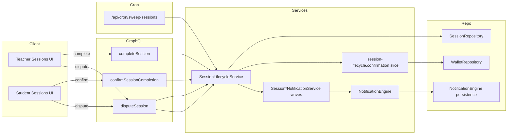

# DEV3-012 — Dual-Confirmation Completion Handshake (24h Timeout) — Implementation Plan

- **Plan Directory:** `ai/plans/sprint_2/dev3-012-dual-confirmation-completion-handshake/`
- **Companion:** `specs.md` (REQ-001…REQ-094), `tasks.md`, `deferred-items.md`, `outcome/`
- **Ground-truth anchor:** DEV3-004 shipped the guarded-transition state machine, the dual-confirmation slices, the 24h deadline column, the cron sweep route, and the dispute enum + resolver. This ticket **extends** that spine; it does not re-design it.

---

## 1. System Overview

### Architecture Diagram



### State Machine (handshake excerpt)

```mermaid
stateDiagram-v2
  [*] --> scheduled : createSession (DEV3-004)
  scheduled --> started : teacher start (DEV3-004)
  started --> completed : completeSessionOnce (teacher stamp)
  completed --> completed : confirmSessionCompletion (student stamp + hold consume + wallet credit)
  scheduled --> cancelled : sweepExpiredScheduledOnce (deadline lapsed) ← EXISTING
  completed --> cancelled : sweepExpiredCompletedUnconfirmedOnce (deadline lapsed, feeHeld) ← NEW
  scheduled --> disputed : openDisputeOnce ← EXISTING
  started --> disputed : openDisputeOnce ← EXISTING
  completed --> disputed : openDisputeOnce (NEW arm)
  disputed --> cancelled|completed : admin resolve (EXISTING resolver; arbitration economics = DEV3-022)
```

### Key Design Decisions

| # | Decision | Rationale |
|---|---|---|
| D1 | Extend guarded UPDATEs with new predicate arms rather than adding new methods | Mirrors the existing single-statement/once contract; keeps classification cold-probe intact |
| D2 | Swallowed-completed & dispute arms reuse `feeHeld=false`-clearing pattern; the completed sweep ALSO refunds via same-lane primitive | B.4/INV-B8 provenance |
| D3 | Deadline never re-armed (B.2). The completed-arm sweep uses the SAME `confirmation_deadline < now` predicate. Consequence: effectively the deadline is "24h from creation"; a row completed after the window lapses can never be confirmed (confirm predicate requires feeHeld). This matches the ticket AC ("24 hours without confirmation → auto-cancel") without inventing a second clock. | Prevents clock skew disputes; avoids schema change |
| D4 | Notifications: keep engine single-writer; compose new emit waves next to `SessionRequestNotificationService` (new `session-completion.notification.service.ts`), reusing receipt/publish-after-commit pattern | DEV3-011 contract honored; zero risk of violating notification invariants |
| D5 | Cron route gains no new endpoint; the sweeper call inside `app/api/cron/sweep-sessions/route.ts` wraps one service method that internally handles both arms | Idempotency & single-transaction guarantees preserved |
| D6 | No audit rows from participants; admin-arbitration audit stays DEV3-022 | Layer boundary |
| D7 | Frontend: no new routes; student/teacher sessions pages gain handshake affordances inside the EXISTING screens | Per navItems map (`/student/sessions`, `/teacher/sessions` already live) |

---

## 2. Data Models & Database Schema

**No schema changes.** Verified: `backend/db/schema/classes/session.ts` already exposes `status`, `fee`, `feeHeld`, `heldBalanceLane`, `startedAt`, `endedAt`, `confirmedByStudentAt`, `confirmedByTeacherAt`, `confirmationDeadline`, `disputeReason`, `disputedAt`, `resolutionNote`, `resolvedAt`, `cancelReason`. Enums: `SessionStatus` includes `disputed`; `DisputeResolution`, `HeldBalanceLane` registered. No migration, no `bun run db push` needed.

**Canonical types:** `SessionSelectType`, `SessionReturnType`, `SessionTransitionProbeRowType`, `DBTransaction` from `@/backend/types`. Sweep counts type: small object literal in service signature (module-level interface NOT in service `.types.ts` — put in `backend/types/classes/session.types.ts` if reused across modules; already the convention via `sweepExpiredSessions` return inline `: Promise<{cancelled: number, refunded: number}>` — extend in place).

---

## 3. API Contracts & Pothos Resolvers

### Existing Mutations (PRESERVE)

| Mutation | Resolver File | Auth | Notes |
|---|---|---|---|
| `completeSession(id: ID!): Session!` | `backend/graphql/mutation/classes/session-lifecycle.mutation.ts` | participant: teacher of row | existing |
| `confirmSessionCompletion(id: ID!): Session!` | same file (already registered, ~line 11 note) | participant: student of row | existing |
| `disputeSession(id: ID!, reason: String!) : Session!` (verified name is `disputeSession` in documents: `session-disputes.documents.ts`) | same file | participant of row | existing |
| `resolveSessionDispute(id, resolution, note): Session!` | same file | admin | existing |

**Decision:** No new mutations. The new behavior surfaces purely through widened predicates (completed arm) and notifications. Field selection unchanged; sessions Pothos object stays canonical.

### Cron Route
`app/api/cron/sweep-sessions/route.ts` — EXISTING; service method becomes dual-armed. Auth: existing cron secret (unchanged).

### Error → `extensions.code` Mapping (existing conventions, REQ-053)

| Condition | Error | Code |
|---|---|---|
| Foreign / missing / non-participant | `NotFoundError` | `SESSION_NOT_FOUND` (oracle-safe) |
| Wrong state for transition | `ConflictError` | `SESSION_INVALID_TRANSITION` |
| Non-admin resolve | scope gate → FORBIDDEN | per error-handling-contract |
| Bad id shape / reason size | `ValidationError` | `VALIDATION` |

### Caller Permission Matrix

| Actor | completeSession | confirmSessionCompletion | disputeSession | resolveSessionDispute | sweep (cron) |
|---|---|---|---|---|---|
| Student (owner) | — (FORBIDDEN class) | ✅ | ✅ | ❌ | n/a |
| Teacher (owner, certified) | ✅ | — (self-no-op via predicate) | ✅ | ❌ | n/a |
| Foreign user | oracle NF | oracle NF | oracle NF | FORBIDDEN | n/a |
| Admin | ❌ | ❌ | ❌ | ✅ | n/a |
| System (cron secret) | n/a | n/a | n/a | n/a | ✅ |

---

## 4. Backend Services & Repositories

All repo methods accept `tx?: DBTransaction`. Existing file paths are authoritative; only additions listed.

### SessionRepository (EXTEND in `backend/db/repo/classes/session.repository.ts`)

- **EXTEND `sweepExpiredScheduledOnce(now, tx)` → `sweepExpiredConfirmationOnce(now, tx)`** (rename allowed per Failure-mode symmetry; OR add sibling `sweepExpiredCompletedUnconfirmedOnce(now, tx)` — chosen: SIBLING, to keep existing call sites byte-identical).
  - New predicate: `status = completed AND confirmed_by_student_at IS NULL AND fee_held = true AND confirmation_deadline < now`
  - SET: `status=cancelled, fee_held=false, updated_at=now`
  - Returns rows (for refund + notification fan-out).
- **EXTEND `openDisputeOnce`** predicate arm: add `OR status = completed` to the existing `status ∈ {scheduled, started}` guard. No write-set change.

### SessionLifecycleService (EXTEND in `backend/services/classes/session-lifecycle.service.ts` + sibling modules)

- **sweepExpiredSessions(outerTx?)** — one tx, single captured `now`: (1) existing scheduled sweep; (2) new completed-arm sweep; (3) per refunded row, emit timeout notifications as RECEIPTS; return `{cancelled, refunded}`. Publish-after-commit of receipts stays with the route/service caller per notification contract.
- **completeSession** — after commit, emit `completion_pending_student_confirm` wave (student recipient) — add via follow-up emitter call in service post-commit hook (receipts returned from `confirmCompletionInTx`-style structure or emitted outside tx per existing publisher pattern).
- **confirmSessionCompletion** — after successful commit, emit `completion_confirmed` wave (teacher recipient).
- **openDispute** — after commit on completed arm, emit `dispute_opened` wave (counterparty + admin cohort).

### Notifications (NEW module)
`backend/services/classes/session-completion-notification.service.ts` mirroring `session-request-notification.service.ts` shape:
- kinds: `completion_pending_student_confirm` (student), `completion_confirmed` (teacher), `timeout_auto_refunded` (student + teacher), `dispute_opened` (counterparty + admins)
- every emitter returns receipts; never authorizes; recipients resolved server-side from the session row via joined wave-context read (session → teacher.userId / students.userId); publish via `NotificationEngine.publishReceipts` post-commit.
- Locale composition via recipient-locale pattern of session-request-notifications.
- New `NotificationType` registration (`session_completion`, `session_cancellation`, `session_disputed` if needed — **session_completion/session_cancellation already exist in `backend/enum/notifications/notification-type.enum.ts`** — add `session_disputed` only if a distinct kind is required; otherwise reuse `session_dispute` … verify enum contents at implementation time: choose reuse-first).

### Wallet slice
No change. `WalletRepository.ensureWalletOnce` + `creditEarningOnce` remain the only writers.

### Concurrency & Race Assessment

| Race | Defense |
|---|---|
| confirm ∥ sweep (completed arm) | Both are single guarded UPDATEs on overlapping required columns; loser's predicate no longer matches; classification probe resolves — no double-refund/credit |
| sweep arm 1 ∥ sweep arm 2 | Disjoint predicates (`scheduled` vs `completed`); shared `now`; one tx |
| double dispute | predicate excludes `disputed`; zero-row miss → conflict |
| teacher decertified mid-flight | `completeSessionOnce` fuses `EXISTS(teacher.is_approved)`; unchanged |
| refund same lane twice | `fee_held=true` in predicate; cleared in SET |

### Cross-Actor Journey Design (Side-Effect Matrix)

| Transition | Row writes | Notifications | Idempotency |
|---|---|---|---|
| teacher completes | status/ended/teacher-stamp | student: pending-confirm | once |
| student confirms | student-stamp, feeHeld=false, wallet ensure+earning+credit | teacher: confirmed | once (predicate-guarded) |
| sweep scheduled | cancel + refund | student: timeout-refund | second sweep no-op |
| sweep completed-unconfirmed | cancel + refund | student+teacher: timeout-refund | second sweep no-op |
| dispute (completed) | disputed, reason, disputedAt | counterparty + admin: dispute-opened | once |
| resolve (admin) | DEV3-022 | DEV3-022 | DEV3-022 |

---

## 5. Frontend UX & Navigation Specification

### Routes (all EXISTING — VERIFY, no new routes)

| Route | Purpose | Roles |
|---|---|---|
| `/[locale]/student/sessions` | student sessions list incl. confirm/dispute CTAs | student |
| `/[locale]/teacher/sessions` | teacher sessions list incl. complete CTA | teacher |

`navItems.ts` already points students/teachers at these (`/student/sessions`, `/teacher/sessions`). No nav change.

### Per-Audience Rendering

| State | Student sees | Teacher sees |
|---|---|---|
| completed + unconfirmed + feeHeld | Confirm CTA (+ deadline countdown chip) | "Awaiting student confirmation" status chip |
| completed + confirmed | "Confirmed — teacher paid" chip | "Confirmed — earning credited" chip |
| cancelled by timeout | "Auto-cancelled — refunded" chip, lane-restored hint | "Window lapsed — refunded" chip |
| disputed | dispute badge + immutability | same |

### Components / Documents

- **Documents (existing):** `backend/graphql/*` documents — `frontend/graphql/sharedDocuments/scheduling/session-lifecycle.documents.ts` (`confirmSessionCompletionMutationDocument` verified, per-document R-201 note "DEV3-012" comment exists), `session-disputes.documents.ts`, `session-reads.documents.ts`. No new documents needed.
- **Components (EXISTING):** `useStudentSessionConfirm`, `SessionDisputeConfirmDialog`, `SessionRowLifecycleCtas`, teacher complete flow — **EXTEND** where the new states (timeout-refund chip, countdown) are absent. Exact deltas to be assessed in Task 6 code survey before editing pixels.
- **i18n namespaces:** `Sessions` (`frontend`); new copy keys in `shared/locale/namespaces/sessions/` + notification copy modules (Arabic + English) — NO new namespace files required; use `defineNamespace` handles (`useAppTranslation(Sessions)`), not strings.
- **Responsive:** existing screens already implement 1440/768/375 per DEV3-004 lineage; countdown chip inherits row layout. RTL preserved via existing Emotion setup.

### Visual State Matrix

| Viewport | Empty | Loading | Error | Disabled |
|---|---|---|---|---|
| All | existing `SessionsEmptyState` | existing skeleton | existing snackbar pattern | per-row disabled CTA while mutation in flight (existing) |

---

## 6. Security & Tenancy Mitigations

- **BOLA:** all mutations keyed to `ctx.user.id` server-side; caller identity NEVER from input; guarded predicates fuse ownership; oracle collapse on miss.
- **BOPLA:** inputs are only `{id, reason?}`; reason trimmed & bounded (≤500); persistence maps explicit columns.
- **BFLA:** `resolveSessionDispute` protected by admin scope; nothing new added this ticket.
- **Search/LIKE:** no search added.
- **Disclosure:** error text uses localized generic strings; row content not leaked to non-participants; cron output counts only.
- **Cron auth:** existing secret check on `/api/cron/sweep-sessions` — VERIFY while editing.

---
