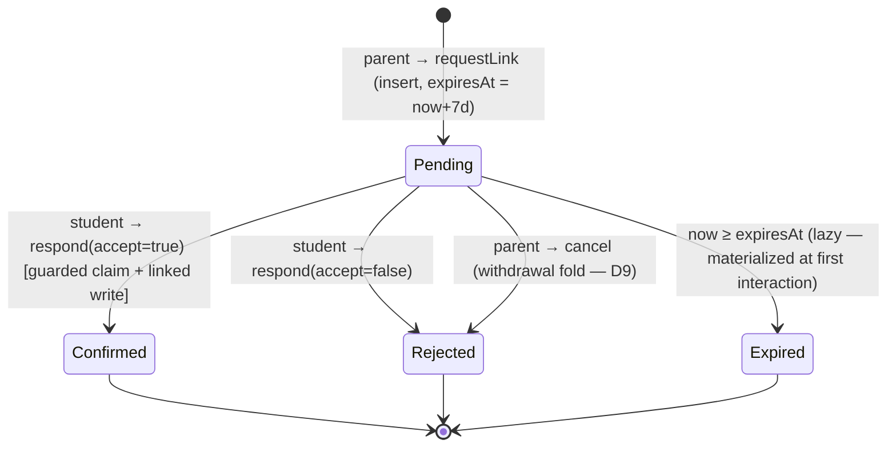

```markdown
# Technical Architecture & Implementation Design: DEV1-014 — Parent-Child Link Request Workflow (7-Day Expiry)

> **Plan directory (verbatim — every header, ledger path, and self-reference in this plan uses exactly this string):** `ai/plans/sprint_3/dev1-014-parent-child-link-request-workflow-7-day`
> **Specs of record:** `ai/plans/sprint_3/dev1-014-parent-child-link-request-workflow-7-day/specs.md` (REQ-001..REQ-096)
> **Canonical refs consumed:** `docs/workflows/04-parent-supervision-handshake.md` (§2 state machine, §4.3/§4.4), `docs/parents/handshake-code-discovery.md` (R1–R8 — binding R5 link-flow contract), `docs/notifications/realtime-engine.md` §3.1–§3.3, `docs/specs/state-machine-invariants.md` (INV-P1..P4, INV-U1/U4/U5), `docs/specs/open-decisions-and-gaps.md` (A.2, A.3, B.12, B.13, B.14), `docs/graphql/error-handling-contract.md`, `docs/graphql/domain-error-extensions-code.md`, `docs/DATABASE_MIGRATIONS.md`, `docs/IDEMPOTENCY.md`, `docs/testing/workflow-journey-tests.md`
> **Blocking dependencies (SHIPPED, verified in-tree):** DEV1-002 registration (`backend/services/auth/registration.service.ts:22-48`), DEV1-013 handshake substrate (`backend/services/students/student-handshake.service.ts`, `backend/graphql/query/students/handshake-code.query.ts`), DEV3-010 notification engine (`backend/services/notifications/notification-engine.service.ts:159-288`).

---

## 1. System Overview & Architecture Diagram

### 1.1 Scope Statement

DEV1-014 ships the platform's first **persistent link-request record** and the only sanctioned write path onto `students.parent_id` (INV-P1). The net-new work:

1. **ONE new table** — `parent_link_requests` (the first new table since DEV1-001), reusing the ALREADY-EXISTING `link_status` pgEnum (`backend/db/schema/enums.ts:28`) and its dormant TS mirror (`backend/enum/shared/link-status.enum.ts:1-6`). Zero enum drift. A partial unique index `(parent_id, student_id) WHERE status='pending'` enforces one live pending per pair at the DB level.
2. **One new domain service** — `ParentLinkRequestService` (`backend/services/parents/parent-link-request.service.ts`): request (capability-by-code re-submission), respond (confirm — THE `parent_id` writer — / reject), cancel, and two self-scoped list reads with compute-on-read expiry rendering.
3. **One new repository** — `ParentLinkRequestRepository` (`backend/db/repo/parents/parent-link-request.repository.ts`) + TWO additive students-repo methods (`findLinkTargetByHandshakeCode`, `linkParentIfUnlinked`).
4. **Five GraphQL operations** — 2 self-scoped queries + 3 mutations — with the load-bearing `$all` authScopes conjunction and service-layer governance re-checks (the context factory applies NO governance filter — `backend/graphql/gqlContextFactory.ts:91-104`).
5. **Frontend** — the student `link-requests` page, the parent's outgoing-requests section on the existing handshake page, one new student nav item, and the new `parentLink` i18n namespace.
6. **Permanent test locks** — repo/service/chaos/wire/static tiers plus the cross-actor journey `test/workflows/parents/parent-link-request.journey.test.ts`, written TEST-FIRST.

### 1.2 Data Flow

```
┌── CLIENT (React 19 / MUI v9 / Apollo v4) ──────────────────────────────────────┐
│ /student/link-requests page        + parent handshake page outgoing section    │
│   useQuery(myIncoming/outgoing…)   useMutation(request/respond/cancel…)        │
└──────────────────────────────────┬─────────────────────────────────────────────┘
                                   ▼ Apollo POST /api/graphql
┌── POTHOSE (thin, no logic, no try/catch) ─────────────────────────────────────┐
│ query/parents/parent-link.query.ts      myOutgoing / myIncoming ($all scopes) │
│ mutation/parents/parent-link.mutation.ts requestParentChildLink (nullable!)   │
│     respondToParentLinkRequest / cancelParentLinkRequest                      │
└──────────────────────────────────┬────────────────────────────────────────────┘
                                   ▼
┌── SERVICE (backend/services/parents/parent-link-request.service.ts) ─────────┐
│ EVERY mutation: 1) actor fresh-read re-check (role + governance fail-closed) │
│ 2) ONE withTransaction(outerTx): guarded single-statement transitions ONLY   │
│ 3) in-tx NotificationEngine.emitForUser (recipient-locale copy)              │
│ 4) post-commit ONLY: NotificationEngine.publishReceipts                      │
└──────────────────────────────────┬────────────────────────────────────────────┘
                                   ▼
┌── REPOSITORIES ──────────────────────────────────────────────────────────────┐
│ ParentLinkRequestRepository (NEW): create / findById / findPendingByPair /   │
│   respondToPendingForStudent (guarded) / cancelPendingForParent (guarded) /  │
│   markExpiredIfPending / expireSiblingPendingsForStudent / list+join reads   │
│ StudentRepository (additive): findLinkTargetByHandshakeCode (server-internal │
│   joint read incl. students.id — the discovery payload deliberately has NO   │
│   id), linkParentIfUnlinked (guarded `parent_id IS NULL` write — the ONLY    │
│   production writer of a non-null students.parent_id)                        │
└──────────────────────────────────┬────────────────────────────────────────────┘
                                   ▼
┌── POSTGRESQL (ONE additive table; zero edits elsewhere) ─────────────────────┐
│ parent_link_requests(id, parent_id→users RESTRICT, student_id→students       │
│   RESTRICT, status link_status, created_at, expires_at, responded_at) +      │
│ partial UNIQUE (parent_id, student_id) WHERE status='pending'                │
│ students (untouched) · users (untouched) · notifications (engine-written)    │
└──────────────────────────────────────────────────────────────────────────────┘
```

### 1.3 Key Design Decisions Table

| # | Decision | Options Considered | Pros / Cons | Rationale (Maintainability, Scalability, Reliability) |
|---|---|---|---|---|
| D1 | **Lazy expiry + materialize-at-write**, never a cron sweep | (a) cron sweeper; (b) read-time flip; (c) lazy + guarded materialization on interaction | (a) extra infra for a correctness-neutral convenience. (b) alone leaves `pending` rows forever stale-looking to other actors' writes. (c) list reads COMPUTE expired render without writing (read purity); the first WRITE interaction materializes `expired` via a guarded no-op-safe UPDATE | REQ-015/044. Strict `expiresAt > now` liveness mirrors the applicant-cooldown precedent (`backend/services/teachers/applicant-lifecycle.service.ts`). Sweep = ledger forward-reference, resolved-pointer |
| D2 | **All transitions are single guarded `UPDATE … WHERE <ownership ∧ status ∧ liveness> RETURNING`** — zero SELECT-then-UPDATE | (a) read-check-write; (b) guarded updates + zero-row classifiers | (a) TOCTOU under concurrent claim (two confirms win). (b) predicate+mutation in one statement; the zero-row branch drives an honest classifier | REQ-041. Precedent: `AdminUserRepository.setDeletedOnce` (`backend/db/repo/admin/admin-user.repository.ts:327-347`) |
| D3 | **The confirm flow's arbiter is the guarded `students.parent_id IS NULL` write, and failure rolls back the WHOLE tx** (claim + notification die with it) | (a) claim-check-then-link in separate steps; (b) single-tx order claim → link → sibling-expiry → notify | (a) ghost confirmed state without a link (INV-P1 breach). (b) the loser's claim is NEVER committed; confirmed rows and linked parents stay 1:1 | REQ-016/042. Two-parent confirm race: exactly one winner by construction |
| D4 | **Partial unique index `(parent_id, student_id) WHERE status='pending'`** as the duplicate-pending final arbiter | (a) full unique on pair (blocks legitimate re-request after rejection); (b) partial unique; (c) app-level check only | (a) forbids re-applying after rejection/expiry — wrong product rule. (c) racy. (b) terminates duplicates under concurrency AND lets reject→re-request succeed | REQ-014/043. 23505 loser maps to `PARENT_LINK_ALREADY_PENDING` via cause-chain traversal (`isUniqueViolation`, `backend/services/shared/user-provisioning.helpers.ts:29-44`) |
| D5 | **Service-layer actor re-check (fresh `users` read: role + governance) is the FIRST action of every mutation** | (a) trust the context; (b) re-check per surface | (a) rides the documented governance window — a suspended parent could act with a pre-issued token. (b) closes the window for THIS surface only, honestly documented | REQ-031; same posture as DEV3-018's strict actor re-check. The context factory stays as-is |
| D6 | **Target resolution is server-internal: a NEW joint read `findLinkTargetByHandshakeCode` returns `students.id`** — the public discovery payload stays id-free | (a) widen the discovery payload with `id`; (b) a second read inside the write tx | (a) violates R1 payload closure (`docs/parents/handshake-code-discovery.md`) — the id must never cross the wire. (b) the code is re-submitted server-side (R5.1); the id never leaves the backend | REQ-011/032. Client args carry the CODE only; the id surfaces only inside the write tx |
| D7 | **Null-collapse for miss/governed (`requestParentChildLink` returns `null`)**; honest conflicts for already-linked/duplicate | (a) errors for every denial; (b) R2/R3 parity collapse for the miss family, conflict codes for the honest family | (b) preserves the discovery oracle contract byte-for-byte (governed ≡ never existed) while keeping `linkable:false`'s honest disclosure | REQ-012/013/034. The `linkable` bit already disclosed linkability; erroring on it leaks nothing new |
| D8 | **Recipient-locale notification copy, verbatim-stored, publish-after-commit** via the engine's caller-tx receipt pattern | (a) actor locale; (b) recipient locale via `UserRepository.findLocalesByIds` + `defaultLocale` fallback | (b) is the engine's emitter-localization rule (§3.3) and the DEV3-018 D6 precedent | REQ-023; `defaultLocale = "ar"` (`shared/locale/AppLocale.ts:3`) |
| D9 | **Cancel folds into `status='rejected'`** (the frozen `link_status` enum has no `cancelled`), recorded as withdrawal-with-note | (a) widen the enum (needs a migration); (b) fold with a documented semantic | (a) REQ-045 forbids enum drift; (b) preserves the append-only history row with zero schema churn | REQ-018; product-vocabulary change = future-ticket pointer, never patched here |
| D10 | **Reconcile-then-extend the stale frozen SDL baselines in ONE documented two-step** | (a) silent baseline patch; (b) re-anchor to live, then append this surface | The bundled freeze suites predate the DEV3-016 admin surface; a silent edit erases that history | REQ-061; DEV3-018 §3.3 precedent — reconciliation commit context + extension step, both recorded in the outcome |
| D11 | **Timestamps use the registered `DateTime` scalar, never `String` + `toISOString()`** | (a) legacy String pattern; (b) `type: "DateTime"` | (b) Architectural Invariant 11; scalar registered at `backend/graphql/pothos/shared/scalar.pothos.ts:1-4`, builder slot `backend/graphql/pothos/builder.ts:16-18` | REQ-060; codegen maps to `string` (`codegen.ts`) |
| D12 | **No idempotency-key contract (out of the mandated set); natural guards ARE the replay protection** | (a) `X-Idempotency-Key` plumbing; (b) partial-unique + guarded transitions + UI in-flight disable | Key set = Students/Invoices/Class Instances/Payments only (`docs/IDEMPOTENCY.md`); the DEV3-016 ruling pattern applies verbatim | REQ-023. Duplicate double-submit ⇒ one row + one `PARENT_LINK_ALREADY_PENDING` |

---

## 2. Data Models & Database Schema

### 2.1 Existing Schema Verification (READ-ONLY anchors)

| Element | Anchor | State |
|---|---|---|
| `linkStatus` pgEnum `("pending","confirmed","rejected","expired")` | `backend/db/schema/enums.ts:28` | EXISTING, first consumer — untouched |
| `LinkStatus` TS mirror | `backend/enum/shared/link-status.enum.ts:1-6` | EXISTING; NO `isLinkStatus` guard exists → NEW additive guard this ticket |
| `students.parentId` FK `ON DELETE SET NULL` + `students_parent_id_idx` | `backend/db/schema/students/students.ts:18,27` | EXISTING — the INV-P1 write target; untouched |
| `users` governance columns | `backend/db/schema/users/users.ts:16-22` | READ-only here |
| `students.handshake_code` unique | `backend/db/schema/students/students.ts:17,26` | The capability key |
| `notifications` (engine-written) | `backend/db/schema/notifications/notifications.ts` | Written ONLY via `NotificationEngine` |

**Zero table elsewhere changes.** `git diff backend/db/schema/**` at completion shows EXACTLY: the new file + the one-line barrel edit in `backend/db/schema/parents/index.ts`.

### 2.2 NEW Table — `backend/db/schema/parents/parent-link-requests.ts` (CREATE)

```typescript
import { sql } from "drizzle-orm";
import { index, integer, pgTable, timestamp, unique } from "drizzle-orm/pg-core";
import { linkStatus } from "@/backend/db/schema/enums";
import { students } from "@/backend/db/schema/students/students";
import { users } from "@/backend/db/schema/users/users";

export const parentLinkRequests = pgTable(
  "parent_link_requests",
  {
    id: integer("id").primaryKey().generatedAlwaysAsIdentity(),
    parentId: integer("parent_id")
      .notNull()
      .references(() => users.id, { onDelete: "restrict" }),
    studentId: integer("student_id")
      .notNull()
      .references(() => students.id, { onDelete: "restrict" }),
    status: linkStatus("status").notNull().default("pending"),
    createdAt: timestamp("created_at").defaultNow().notNull(),
    expiresAt: timestamp("expires_at").notNull(),        // application-written: createdAt + 7d
    respondedAt: timestamp("responded_at"),
  },
  t => [
    index("parent_link_requests_parent_id_idx").on(t.parentId),
    index("parent_link_requests_student_id_idx").on(t.studentId),
    unique("parent_link_requests_pending_pair_unique")
      .on(t.parentId, t.studentId)
      .where(sql`${t.status} = 'pending'`),
  ]
);
```

- **Barrel:** `backend/db/schema/parents/index.ts` gains `export * from "./parent-link-requests";` (currently re-exports only `./parents`).
- **Delivery (REQ-010):** `bun run db push` per `docs/DATABASE_MIGRATIONS.md`. IF the partial-unique `.where(...)` proves unexpressible in the bundled Drizzle version, the recorded fallback is ONE ADDITIVE custom SQL file under `backend/db/migration/` + its drizzle folder — ledger-recorded, never silent.
- **FK posture rationale:** both FKs are `RESTRICT` — a request row is durable history (append-and-transition); the row must outlive governance bookkeeping, and the DEV3-017 purge-guard family treats identity-table deletes as sanctioned-test-only. Journey teardown deletes request rows FIRST (REQ-046).

### 2.3 Canonical Types (CREATE `backend/types/parents/parent-link-request.types.ts`)

```typescript
import type { parentLinkRequests } from "@/backend/db/schema/parents/parent-link-requests";
import type { LinkStatus } from "@/backend/enum/shared/link-status.enum";

export type ParentLinkRequestSelectType = typeof parentLinkRequests.$inferSelect;
export type ParentLinkRequestInsertType = typeof parentLinkRequests.$inferInsert;

export interface OutgoingParentLinkRequestReturnType {
  readonly id: number;
  readonly status: LinkStatus;
  readonly studentMaskedName: string;
  readonly createdAt: Date;
  readonly expiresAt: Date;
  readonly respondedAt: Date | null;
}
export interface IncomingParentLinkRequestReturnType {
  readonly id: number;
  readonly status: LinkStatus;
  readonly parentFullName: string;
  readonly createdAt: Date;
  readonly expiresAt: Date;
  readonly respondedAt: Date | null;
}
```

Barrel: `backend/types/parents/index.ts` gains `export * from "./parent-link-request.types";` (currently `export * from "./parent.types";`).

**Students types (ADDITIVE, `backend/types/students/student.types.ts`):**

```typescript
// server-internal link-target resolution row — NEVER a GraphQL payload
export interface StudentLinkTargetRowType {
  readonly studentId: number;
  readonly parentId: number | null;
  readonly fullName: string;
  readonly isDeleted: boolean | null;
  readonly isBlocked: boolean | null;
  readonly suspended: boolean | null;
  readonly suspendedAt: Date | null;
  readonly suspendedPeriodDays: number | null;
}
```

### 2.4 Shared constant (CREATE `shared/constants/parent-link-request.constants.ts`)

```typescript
export const PARENT_LINK_REQUEST_TTL_DAYS = 7;
export const PARENT_LINK_REQUEST_MS = PARENT_LINK_REQUEST_TTL_DAYS * 86_400_000;
```

ZERO `@/backend/**` imports (layer-isolation rule); barrel line in `shared/constants/index.ts` (currently 3 lines). Mirrors `free-trial.constants.ts` precedent.

### 2.5 Enum guard (ADDITIVE — `backend/enum/shared/link-status.enum.ts`)

Append, mirroring `isApplicantStatus` (`backend/enum/teachers/applicant-status.enum.ts:7-9`):

```typescript
export function isLinkStatus(value: unknown): value is LinkStatus {
  return typeof value === "string" && (Object.values(LinkStatus) as string[]).includes(value);
}
```

Used by the read-mapping boundary to fail closed on corrupt stored statuses. Follow the fuzz/4-tier guard-test precedent (`applicant-status.enum.test.ts`) with a compact sibling suite.

---

## 3. API Contracts & Pothos Resolvers

### 3.1 GraphQL SDL Additions (exact — REQ-060)

```graphql
enum LinkStatus { Pending, Confirmed, Rejected, Expired }

type OutgoingParentLinkRequest {
  id: ID!
  status: LinkStatus!
  studentMaskedName: String!
  createdAt: DateTime!
  expiresAt: DateTime!
  respondedAt: DateTime
}
type IncomingParentLinkRequest {
  id: ID!
  status: LinkStatus!
  parentFullName: String!
  createdAt: DateTime!
  expiresAt: DateTime!
  respondedAt: DateTime
}

extend type Query {
  myOutgoingParentLinkRequests: [OutgoingParentLinkRequest!]!
  myIncomingParentLinkRequests: [IncomingParentLinkRequest!]!
}

extend type Mutation {
  requestParentChildLink(code: String!): OutgoingParentLinkRequest        # nullable — miss/governed collapse
  respondToParentLinkRequest(requestId: ID!, accept: Boolean!): IncomingParentLinkRequest!
  cancelParentLinkRequest(requestId: ID!): OutgoingParentLinkRequest!
}
```

### 3.2 Pothos Registration Map

| File | Change |
|---|---|
| `backend/graphql/pothos/shared/enum.pothos.ts` | ADD `LinkStatusPothosEnum = gqlSchemaBuilder.enumType(LinkStatus, { name: "LinkStatus" })` — enum-OBJECT form ONLY (CRITICAL rule), registered ONCE |
| `backend/graphql/pothos/parents/parent-link-request.pothos.ts` | CREATE dir + objects: `OutgoingParentLinkRequestPothosObject`/`IncomingParentLinkRequestPothosObject` — `objectRef<…ReturnType>(...)`, `id` FIRST (`t.exposeID("id")`), timestamps `t.expose("createdAt", { type: "DateTime" })` etc. NO local types |
| `backend/graphql/pothos/parents/index.ts` | CREATE barrel line |
| `backend/graphql/query/parents/parent-link.query.ts` | CREATE: `myOutgoingParentLinkRequests` (`$all: { authenticated: true, role: [UserRole.Parent] }`), `myIncomingParentLinkRequests` (`role: [UserRole.Student]`) — thin delegation; `ctx.user` guard via localized `UnauthorizedError` (pattern anchored at `backend/graphql/mutation/notifications/notification.mutation.ts:31-34`) |
| `backend/graphql/query/parents/index.ts` + `backend/graphql/query/index.ts` | side-effect barrel wiring (`import "./parents";`) |
| `backend/graphql/mutation/parents/parent-link.mutation.ts` | CREATE: the three mutations. `requestParentChildLink` — SAME parent scope, `nullable: true` type config, resolver maps the service's `null` through verbatim. `respondToParentLinkRequest` / `cancelParentLinkRequest` — SAME respective-role scopes; `requestId: ID!` parsed by a module-local `parseLinkRequestIdArg` mirroring the canonical pattern (`/^[1-9]\d*$/` + `isPositiveSafeInt`, invalid → `ValidationError` pre-DB — precedent `notification.mutation.ts:7-18`) |
| `backend/graphql/mutation/parents/index.ts` + `backend/graphql/mutation/index.ts` | side-effect barrel wiring |
| Codegen | `bun run generate:gqlSchema && bun codegen` in the SAME change set; commit `frontend/graphql/**/generated` artifacts |
| `backend/lib/gateway/public-operations.ts` | UNTOUCHED — frozen six; all five ops are scope-gated |

### 3.3 Baseline Reconciliation + Extension (REQ-061 — documented two-step)

1. **Re-anchor:** `backend/graphql/test/schema-surface.test.ts` (`PRE_3_1_*`) and `backend/graphql/test/sdl-static-assertions.test.ts` (`FROZEN_*`) are STALE relative to the already-shipped DEV3-016 admin surface (live: `backend/graphql/mutation/admin/index.ts`, `backend/graphql/query/admin/index.ts` exist; the frozen arrays predate them). STEP ONE re-anchors the inventories to the CURRENT live built schema (verified via `printSchema(lexicographicSortSchema(graphQLSchema))` probe).
2. **Extend:** STEP TWO appends the five new root fields, the `LinkStatus` enum, and the two object types to the now-current baselines — including pins that BOTH lists are NON-paginated arrays AND that `requestParentChildLink` is the ONLY nullable new mutation (the collapse contract).
Both steps and their rationale are recorded in the same changeset's outcome file; `plan-catalog.schema.test.ts`'s committed-vs-live SDL byte-parity stays green via the regenerated `frontend/graphql/generated/schema.graphql`.

### 3.4 Error Code Map

| Scenario | `extensions.code` | Producer |
|---|---|---|
| anonymous, any of the 5 ops | `UNAUTHORIZED` | `$all` `authenticated` scope throws pre-resolver (`builder.ts:41-46`) |
| authenticated wrong role (parent↔student cross-probes) | `FORBIDDEN` | role scope → localized `ForbiddenError` |
| governed actor with pre-issued token | `FORBIDDEN` (service re-check) | actor fresh-read guard (REQ-031) |
| malformed code | `VALIDATION` | pre-DB (`isHandshakeCode`) |
| code miss / governed target | `null` payload (NO error) | REQ-012 collapse |
| target already linked | `PARENT_LINK_TARGET_ALREADY_LINKED` | `ConflictError(code, message)` overload (`backend/lib/errors.ts:90-99`) |
| duplicate pending per pair (incl. 23505 race loser) | `PARENT_LINK_ALREADY_PENDING` | same overload via `isUniqueViolation` traversal |
| respond/cancel foreign OR nonexistent id | `PARENT_LINK_REQUEST_NOT_FOUND` | `NotFoundError("PARENT_LINK_REQUEST", …)` — constant shape, foreign ≡ nonexistent (the `markReadOnce` precedent `notification.repository.ts:128-139`) |
| respond/cancel already answered | `PARENT_LINK_REQUEST_ALREADY_RESOLVED` | `ConflictError(code, message)` |
| respond/cancel expired-at-interaction | `PARENT_LINK_REQUEST_EXPIRED` | classifier materializes `expired` THEN throws |
| invalid `requestId` wire value (`"0"`, `"-1"`, `"1.5"`, `"abc"`, oversized) | `VALIDATION` | module-local ID parser, pre-DB |
| corrupt stored `status` value | `PARENT_LINK_STATUS_CORRUPT`-class `ValidationError` guarded at read-mapping via `isLinkStatus` — surfaced as generic `VALIDATION` (recorded: simplest closed code, no new key needed beyond `validation`) |
| unexpected internals | `INTERNAL_SERVER_ERROR` | masked once at the finalizer |

### 3.5 Permission Matrix

| Caller | `requestParentChildLink` / `cancelParentLinkRequest` / `myOutgoingParentLinkRequests` | `respondToParentLinkRequest` / `myIncomingParentLinkRequests` |
|---|---|---|
| Anonymous | ❌ `UNAUTHORIZED` (pre-resolver) | ❌ `UNAUTHORIZED` |
| Student | ❌ `FORBIDDEN` | ✅ own incoming surface |
| Parent | ✅ own outgoing surface | ❌ `FORBIDDEN` |
| Teacher | ❌ `FORBIDDEN` | ❌ `FORBIDDEN` |
| Admin | ❌ `FORBIDDEN` (no admin read/write override — governance reads live on DEV3-016 surfaces ONLY) | ❌ `FORBIDDEN` |
| Governed caller (pre-issued token) | ❌ `FORBIDDEN` at the SERVICE layer (REQ-031) | ❌ `FORBIDDEN` |

There is deliberately NO admin/supervisor axis — link requests are a user-to-user handshake, zero `audit_logs` rows by design (A.5 covers ADMIN actions only; REQ-074(c) scan-locks zero audit writes in the new modules).

---

## 4. Backend Services, Repositories & Concurrency Model

### 4.1 Repository — `backend/db/repo/parents/parent-link-request.repository.ts` (CREATE)

Registered in `backend/db/repo/parents/index.ts` (currently `export * from "./parent.repository";`).

Repo-local joined-row shapes follow the sanctioned precedent (exported interfaces inside the repo file, e.g. `AdminUserDirectoryRow` at `backend/db/repo/admin/admin-user.repository.ts:41-61`).

| Method | Signature | Contract |
|---|---|---|
| `create` | `(insert: { parentId: number; studentId: number; expiresAt: Date }, tx: DBTransaction) => Promise<ParentLinkRequestSelectType>` | INSERT … RETURNING. No status override (schema default `pending`). Raises 23505 on the partial-unique race — the SERVICE classifies it |
| `findById` | `(id: number, tx?: DBQueryExecutor) => Promise<ParentLinkRequestSelectType \| null>` | PK classifier read |
| `findPendingByPair` | `(parentId, studentId, tx?: DBQueryExecutor) => Promise<… \| null>` | `WHERE parent_id AND student_id AND status='pending'` |
| `respondToPendingForStudent` | `(requestId, studentId, target: LinkStatus.Confirmed \| LinkStatus.Rejected, now: Date, tx) => Promise<… \| null>` | ONE guarded statement: `UPDATE … SET status=<target>, responded_at=now, updated=? — (no updated_at column exists; set responded_at only) WHERE id=? AND student_id=? AND status='pending' AND expires_at > <now> RETURNING *` |
| `cancelPendingForParent` | `(requestId, parentId, now: Date, tx) => Promise<… \| null>` | `… SET status='rejected', responded_at=<now> WHERE id=? AND parent_id=? AND status='pending' AND expires_at > <now> RETURNING *` (withdrawal fold — D9) |
| `markExpiredIfPending` | `(requestId, tx) => Promise<void>` | `SET status='expired' WHERE id=? AND status='pending'` — idempotent by construction (double-materialize = zero rows) |
| `expireSiblingPendingsForStudent` | `(studentId, winnerRequestId, tx) => Promise<number>` | `SET status='expired' WHERE student_id=? AND status='pending' AND id <> ?` — returns affected count |
| `listOutgoingForParent` | `(parentId, tx?) => Promise<OutgoingRow[]>` | joins `users` ON `studentId` for the student's `fullName`; `ORDER BY created_at DESC, id DESC LIMIT 50` |
| `listIncomingForStudent` | `(studentId, tx?) => Promise<IncomingRow[]>` | joins `users` ON `parentId` for the parent's `fullName`; same ordering/cap |
| `findOutgoingRowById` / `findIncomingRowById` | `(requestId, tx?) => Promise<JoinedRow \| null>` | single-row join read used by cancel/respond SUCCESS paths to assemble the counterpart name |

**Students repo (ADDITIVE — `backend/db/repo/students/student.repository.ts`):**

```typescript
// Server-internal joint read for the write path — NEVER exposed via GraphQL.
findLinkTargetByHandshakeCode(code: string, tx?: DBQueryExecutor): Promise<StudentLinkTargetRowType | null>
//   SELECT s.id AS "studentId", s.parent_id AS "parentId", u.full_name AS "fullName",
//          u.is_deleted …, u.is_blocked …, u.suspended, u.suspended_at …, u.suspended_period_days …
//   FROM students s JOIN users u ON u.id = s.id WHERE s.handshake_code = $1 LIMIT 1
//   (one parameterized equality predicate; NO LIKE/ILIKE; mirrors findDiscoveryByHandshakeCode shape)

linkParentIfUnlinked(studentId: number, parentId: number, tx: DBTransaction): Promise<StudentSelectType | null>
//   ONE guarded statement — THE single production writer of a non-null students.parent_id:
//   UPDATE students SET parent_id = $2, updated_at = now() WHERE id = $1 AND parent_id IS NULL RETURNING *
```

All repo methods take `tx` LAST; `(tx ?? db)` / `queryDb` executor discipline preserved.

### 4.2 Service — `backend/services/parents/parent-link-request.service.ts` (CREATE)

Exported via NEW `backend/services/parents/index.ts` + root `backend/services/index.ts` line (currently: admin/auth/billing/shared/students/teachers).

```typescript
export namespace ParentLinkRequestService {
  export async function requestLink(code, parentActorId, locale, outerTx?, options?: NotificationEngineCallOptions): Promise<OutgoingParentLinkRequestReturnType | null>;
  export async function respondToLinkRequest(requestId, accept, studentActorId, locale, outerTx?, options?): Promise<IncomingParentLinkRequestReturnType>;
  export async function cancelLinkRequest(requestId, parentActorId, locale, outerTx?): Promise<OutgoingParentLinkRequestReturnType>;
  export async function listMyOutgoing(parentActorId, locale, tx?): Promise<OutgoingParentLinkRequestReturnType[]>;
  export async function listMyIncoming(studentActorId, locale, tx?): Promise<IncomingParentLinkRequestReturnType[]>;
}
```

**Module-private actor re-check (REQ-031)** — one local function (fresh `UserRepository.findById(actorId, tx)`): missing/id≤0 → `UnauthorizedError(t.unauthorized)`; role mismatch → `ForbiddenError(t.forbidden)`; `isDeleted || isBlocked || suspended` → `ForbiddenError(t.forbidden)` (constant denial copy — no branch disclosure). Each denial = exactly ONE `logger.logDomainError` `{ code, entity: "users", entityId, locale }` + ZERO writes + ZERO notifications.

**`requestLink` pipeline (ordered — REQ-011):**
1. `normalizeHandshakeCode(code)` + `isHandshakeCode` — malformed → `ValidationError(t.handshakeCodeInvalid)` PRE-DB (existing key — `shared/locale/en/errors/index.ts:48`).
2. Actor re-check (parent).
3. `withTransaction(outerTx, async tx => …)` (`backend/lib/db/with-transaction` — import anchored at `user-management.service.ts:13`):
   - `const now = new Date();` — ONE captured instant.
   - `const target = await StudentRepository.findLinkTargetByHandshakeCode(normalized, tx)`;
   - `null` → return `null`; `isGovernanceExcludedFromDiscovery(target, now)` (`backend/services/students/student-handshake.helpers.ts:3-18`) → return `null`. BOTH leave zero rows, zero notifications, zero publishes.
   - `target.parentId !== null` → `ConflictError("PARENT_LINK_TARGET_ALREADY_LINKED", t.parentLinkTargetAlreadyLinked)`.
   - `findPendingByPair` hit → `ConflictError("PARENT_LINK_ALREADY_PENDING", t.parentLinkAlreadyPending)`.
   - `ParentLinkRequestRepository.create({ parentId: parentActorId, studentId: target.studentId, expiresAt: new Date(now.getTime() + PARENT_LINK_REQUEST_MS) }, tx)` wrapped in the 23505-traversal catch → SAME `PARENT_LINK_ALREADY_PENDING` on `isUniqueViolation(error)`.
   - Recipient locale: `(await UserRepository.findLocalesByIds([target.studentId], tx)).get(target.studentId) ?? defaultLocale` (`user.repository.ts:63-92`; `AppLocale.ts:3`); copy = `getServerTranslations(recipientLocale).notificationsTranslations.eventParentLinkRequestTitle` + `…Body(actorFullName)` (the parent actor's own name — sanctioned: the decision-maker must know WHO asks).
   - In-tx `NotificationEngine.emitForUser({ userId: target.studentId, type: NotificationType.ParentLinkRequest, title, body, relatedEntityType: "parent_link_request", relatedEntityId: created.id }, recipientLocale, tx, options)` → receipt (NO publish inside tx — `notification-engine.service.ts:178-181`).
   - Return `{ created, receipt }` (internal bridge shape).
4. Own-commit path ONLY: `NotificationEngine.publishReceipts([receipt], recipientLocale, options)` — push failure degrades to `NOTIFICATION_DELIVERY_DEGRADED` and NEVER fails the request (engine contract §3.1).
5. Map to outgoing return: `maskFullName(target.fullName)` (`shared/lib/mask-full-name` — import anchored at `student-handshake.service.ts:7`), `status: LinkStatus.Pending`, inserted timestamps verbatim.

**`respondToLinkRequest` pipeline (REQ-016/017):**
1. Actor re-check (student).
2. `withTransaction`:
   - `const claim = await ParentLinkRequestRepository.respondToPendingForStudent(requestId, studentActorId, accept ? LinkStatus.Confirmed : LinkStatus.Rejected, now, tx)`.
   - `claim === null` → classifier: `findById` → null → `NotFoundError("PARENT_LINK_REQUEST", t.parentLinkRequestNotFound)`; `row.studentId !== studentActorId` → SAME NotFoundError (foreign ≡ nonexistent, byte-shaped); `row.status !== LinkStatus.Pending` → `ConflictError("PARENT_LINK_REQUEST_ALREADY_RESOLVED", …)`; else (pending but liveness predicate failed) → `markExpiredIfPending(requestId, tx)` + `ConflictError("PARENT_LINK_REQUEST_EXPIRED", t.parentLinkRequestExpired)`.
   - `accept === true` branch ONLY:
     - `const linked = await StudentRepository.linkParentIfUnlinked(studentActorId, claim.parentId, tx)`; `null` → `ConflictError("PARENT_LINK_TARGET_ALREADY_LINKED", …)` — the THROW rolls back the claim (ghost confirmations are impossible).
     - `expireSiblingPendingsForStudent(studentActorId, claim.id, tx)`.
     - Emit to the PARENT: accepted copy — body = `…AcceptedBody(studentFullNameFromActorRow)` in the parent's persisted locale; `relatedEntityType: "parent_link_request"`, `relatedEntityId: claim.id`.
   - `accept === false`: emit the rejected copy to the parent; NO students write; NO sibling expiry (rejection leaves other pendings live — "children choose parents").
   - Assemble the return via `findIncomingRowById(claim.id, tx)` (carries `parentFullName`).
3. Post-commit (own-commit only): `publishReceipts`.

**`cancelLinkRequest` (REQ-018):** actor re-check (parent) → tx → `cancelPendingForParent(requestId, parentId, now, tx)` → zero rows → SAME classifier (null/foreign → NOT_FOUND; non-pending → ALREADY_RESOLVED; pending-expired → materialize + EXPIRED) → success: ZERO notifications (withdrawal is silent), return shape via `findOutgoingRowById`. The flipped row persists forever as request history.

**Reads:** role re-check (relaxed reads still actor-check for honesty — the lists are self-scoped on the actorId regardless), repo list, then per-row render-mapping: `status === LinkStatus.Pending && expiresAt <= now` → surface `LinkStatus.Expired` WITHOUT writing (read purity, REQ-015); `status` values pass `isLinkStatus` fail-closed.

### 4.3 Concurrency & Race Condition Assessment

| Scenario | Actors | Risk | Mitigation |
|---|---|---|---|
| Duplicate pending create race (double-click / concurrent submit) | parent × DB | two live pendings per pair | partial unique index (D4) — loser maps 23505 → `PARENT_LINK_ALREADY_PENDING`; chaos tier proves ONE row (`Promise.allSettled`, skip under `isPgliteProvider` — `test/helpers/skip-when-pglite.ts:1-5`) |
| Two pending requests for ONE student confirmed in race | student acts twice (claim A ∥ claim B) | two "confirmed" rows / double link write | the guarded `parent_id IS NULL` link write is the FINAL arbiter (D3): loser's link update matches zero rows → whole loser tx (claim + notification + anything) rolls back; final = exactly ONE confirmed + ONE linked parent + all siblings expired |
| Confirm lands exactly ON `expiresAt` | student | off-by-one liveness | strict `expires_at > now` predicate; one captured `now` per call; boundary suite covers past/now/future |
| Cancel ∥ student-confirm on the SAME row | parent + student | conflicting terminal states | both transitions are row-locked guarded UPDATEs on the SAME row; the second statement observes the first's committed effect; a cancelled row cannot be claimed (`status='pending'` predicate) and vice versa |
| Governance flag flips between intake read and claim | admin + actor | acted-on governed actor | accepted advisory window — the fresh actor read IS the check (D5); no lock taken on `users` (never mutated here) |
| Sibling expiry vs sibling claim interleave | two parents' flows | sibling silences a live request winner-side | whichever guarded UPDATE acquires the row lock last observes committed state; the winner's own claim was committed (post-commit publish), so expiry of the winner is structurally impossible; losing claims classify honestly |
| Forced failure AFTER the link write (chaos) | infra | partial confirm state | REQ-072 rollback proof: ZERO residual rows across `parent_link_requests` / `students` / `notifications`; publish unreachable pre-commit |
| Expiry materialization replay | any | double-expire | `markExpiredIfPending` zero-row on second run — idempotent by predicate |

**Explicit non-mechanisms:** NO `SELECT FOR UPDATE` (all mutable surfaces are single-statement guarded updates), NO advisory locks, NO Redis `SET NX EX` (the only claim primitive in play is the engine's own optional emit-claim, out-of-key-set here — D12). TOCTOU is closed structurally by D2/D3/D4.

### 4.4 Cross-Actor Journey Design (MANDATORY — specs §2.9)

**Shared-entity state machine (`parent_link_requests.status`):**



| Current | Trigger (actor → action) | Next | Guard / Permission |
|---|---|---|---|
| (none) | Parent → `requestLink(code)` | Pending | parent role + ungoverned actor + ungoverned+unlinked target + no pending pair |
| Pending | Student → `respond(accept=true)` | Confirmed | guarded claim (own + pending + live) THEN guarded link write (winner only) |
| Pending | Student → `respond(accept=false)` | Rejected | same claim |
| Pending | Parent → `cancel` | Rejected | guarded (own + pending + live) |
| Pending | time passes (no actor) | Expired | lazy materialization at next interaction |
| non-Pending / foreign / missing | any actor | DENIED (constant shape) | zero-row classifiers |

**Side-effect matrix (per committed transition):**

| Transition | Rows created/updated | Notifications (channel → recipient) | Idempotency |
|---|---|---|---|
| → Pending | ONE `parent_link_requests` INSERT | in-tx row → STUDENT; ONE post-commit publish to the student | partial-unique index (D4) |
| → Confirmed | claim UPDATE + `students.parent_id` UPDATE (winner) + sibling `expired` UPDATEs | in-tx row → PARENT (accepted copy); post-commit publish | guarded link write (D3) |
| → Rejected (student) | claim UPDATE | in-tx row → PARENT; post-commit publish | guarded claim |
| → Rejected (parent withdraw) | claim UPDATE | NONE (silent withdrawal — REQ-018) | guarded claim |
| → Expired | materialize UPDATE (only on interaction) | NONE (silent — REQ-024) | guarded no-op-safe update |
| EVERY denial | ZERO rows (`parent_link_requests`, `students`, `notifications`, `audit_logs`) | NONE | JR-C-1 parity: denials leave no side-effect rows |

**Cross-actor visibility (post-step assertions the journey locks):**

| After step | Parent A (requester) | Parent B (contender) | Student S | Governed G / Linked L |
|---|---|---|---|---|
| A requests S | outgoing list shows `pending` (+7d expiry line) | own outgoing EMPTY (foreign-list invariance) | incoming shows A's FULL name; ONE own-inbox row (`parent_link_request`) | byte-identical oracles |
| S confirms A | outgoing shows `confirmed`; ONE accepted notification | B's pendings on S → `expired`, silently | own incoming shows `confirmed`; `students.parentId === A` | unchanged |
| S rejects (fresh case) | owns `rejected` + ONE rejected notification | unaffected | `parentId` still NULL | unchanged |
| A cancels (fresh target) | row `rejected` (folded); ZERO notifications | — | ZERO new rows/notifications | unchanged |
| Expired interaction | outgoing renders `expired` chip (computed) | — | interaction denied `PARENT_LINK_REQUEST_EXPIRED`; row materialized | — |
| Race (B12) | ONE parent_id winner; losers see conflict | OTHER pendings expired; ZERO dupes | exactly ONE notification per direction | — |

**Journey harness contract (REQ-076):** `test/workflows/parents/parent-link-request.journey.test.ts` — TEST-FIRST; committed fixtures in ONE `beforeAll db.transaction`; REAL actors via `provisionParentActor` / `provisionStudentActor` (existence anchored by `@/test/workflows/helpers` imports — `fanout-transport.test.ts:12`); `TrackedFixtures` teardown deleting `parent_link_requests` FIRST (RESTRICT FKs — REQ-046 order) with mandatory zero-residue re-probes; `SpiedFanoutTransport` at the `options.transport` seam; unique `jrn_plink_<uuid8>` prefixes; NO `runInRollback`; denials via REAL role resolution; backdated `expiresAt` fixtures are committed DIRECTLY (`expiresAt` is application-written, so fixture control is honest). Run: `bun run test/scripts/run-test.ts test/workflows/parents/parent-link-request.journey.test.ts`.

---

## 5. Frontend UX & Navigation Specification

### 5.1 Routes & URLs Table

| Path | Purpose | Required permission | Allowed roles |
|---|---|---|---|
| `/student/link-requests` (NEW) | student incoming queue (confirm/reject) | `withPageAuth({ roles: [UserRole.Student], redirectTo: "/student/link-requests" })` (`frontend/lib/auth/withPageAuth.ts:15-30`) | Student |
| `/parent/handshake` (EXISTING page — container gains the outgoing section + the send affordance on the found state) | discovery + outgoing list | existing parent guard | Parent |

Anonymous → `/login?redirect=/student/link-requests`; wrong role → `roleDashboardPath(ctx.role)` (`frontend/lib/auth/roleDashboardRoute.ts:9-22`) — bare `/dashboard` is NEVER a target.

### 5.2 Sidebar & Navigation Integration

- `frontend/views/dashboard/navItems.ts` student array (`navItems.ts:35-42`) gains ONE entry `{ route: "/student/link-requests", labelKey: "linkRequests", Icon: LinkChildIcon }` (the `LinkChildIcon` import already exists at `navItems.ts:8`). NO duplicate — no current item targets this route.
- `DashboardLabels` gains `linkRequests: string` (`shared/locale/types/dashboard/index.ts` + en/ar leaves). The nav ownership matrix (`navItems.test.ts:19-29`) stays green — the key lives ONLY on the dashboard bundle.
- There is NO mobile bottom-nav component; the temporary MUI `Drawer` (`DashboardSidebar.tsx`) picks the item up automatically.

### 5.3 Per-Audience Rendering

| Audience | Surface |
|---|---|
| Student | full incoming queue: parent's FULL name (sanctioned — the confirmation decision needs identity, Workflow 04 §4.4), status chip, expiry line, Confirm/Reject CTAs |
| Parent | send affordance on a `linkable: true` discovery result; outgoing list: MASKED student name (never full), computed status chips, cancel CTA on live pendings |
| Teacher / Admin | never reach either surface (server guard + scope gates) |
| Governed actor | server guard already fails closed at SSR; the GraphQL service re-check is the second line |

### 5.4 Apollo GraphQL Documents & UI Components

**CREATE `frontend/graphql/sharedDocuments/parents/parent-link.documents.ts`** (+ `parents/index.ts` barrel; + one line on `frontend/graphql/sharedDocuments/index.ts:1-6`):

```graphql
query MyOutgoingParentLinkRequests { myOutgoingParentLinkRequests { id status studentMaskedName createdAt expiresAt respondedAt } }
query MyIncomingParentLinkRequests { myIncomingParentLinkRequests { id status parentFullName createdAt expiresAt respondedAt } }
mutation RequestParentChildLink($code: String!) { requestParentChildLink(code: $code) { id status studentMaskedName createdAt expiresAt respondedAt } }
mutation RespondToParentLinkRequest($requestId: ID!, $accept: Boolean!) { respondToParentLinkRequest(requestId: $requestId, accept: $accept) { id status parentFullName createdAt expiresAt respondedAt } }
mutation CancelParentLinkRequest($requestId: ID!) { cancelParentLinkRequest(requestId: $requestId) { id status studentMaskedName createdAt expiresAt respondedAt } }
```

- `id` FIRST in every selection; five named operations; `TypedDocumentNode<…>` typed from the single generated `graphql.ts`; `useQuery`-only (NO `useLazyQuery`).
- **Cache:** both objects carry real `id`s → they normalize; the frozen policy inventory (`frontend/providers/apollo/apolloCache.test.ts:90-99`) stays GREEN UNTOUCHED (no `keyFields: false` needed).
- A sibling document-contract test mirrors `notification.documents.test.ts` (operation names, variables, id-first).
- Mutation→list coherence: after each mutation, `await` the active query's `refetch()` (the simplest honest refresh; no hand-rolled cache surgery).

**Component tree:**

```
app/(dashboard)/student/link-requests/page.tsx            (NEW — Server Component, withPageAuth)
└─ frontend/views/students/link-requests/StudentLinkRequestsContainer.tsx   (NEW, client)
   ├─ useQuery(myIncomingParentLinkRequestsQueryDocument)
   ├─ per-row Card: parentFullName, status Chip, expires line, Confirm/Reject (≥44px)
   ├─ confirm/reject Dialogs (copy functions take parentName)
   └─ skeleton / empty / error / PermissionDeniedFallback branches

app/(dashboard)/parent/handshake/page.tsx                 (EXISTING — prose-verified; verify container shape at implementation)
└─ HandshakeDiscoveryContainer                            (EXISTING — UPDATE-with-verify: inject below the result card)
   ├─ send affordance on linkable result → useMutation(requestParentChildLinkMutationDocument);
   │   null payload ⇒ t.sendUnavailableNotice; conflict codes ⇒ inline Alert (localized server message)
   └─ <OutgoingLinkRequestsSection />                     (NEW)
       ├─ useQuery(myOutgoingParentLinkRequestsQueryDocument)
       ├─ per-row: masked name, computed chip (expired renders expired), cancel CTA on live-pending rows
       └─ cancel dialog → useMutation(cancelParentLinkRequestMutationDocument)
```

**MUI v9 / React 19 discipline:** `sx`-only styling, `theme.palette.*` ONLY, `*Outlined` icons, `focusVisibleRingSx` on interactive elements, ≥44px CTAs, `Box component="output" aria-busy` pending regions, `React.SubmitEvent` discipline, `dir="auto"` on name text, no `console.*` (`@/frontend/lib/logger`).

### 5.5 Visual Design & Responsive Specifications

- **Desktop 1440px:** rows as cards in a 2-col grid; actions inline end-aligned. **Tablet 768px:** single column, full-bleed cards. **Mobile 375px:** stacked rows; CTAs full-width, ≥44px; dialogs full-width minus 16px gutters.
- **RTL/Arabic:** logical properties only (`marginInlineStart`, `text-align: start`); bidirectional mirroring via the existing Emotion RTL pipeline (`frontend/lib/emotion-cache.tsx`); Arabic tall line-heights; names render `dir="auto"`.
- **Visual State Matrix:** loading skeleton rows; empty states (incoming "no requests yet", outgoing "you haven't linked anyone"); expired chip (computed — never a stale write); confirm/reject/cancel dialogs with in-flight disabled buttons; conflict-code inline `Alert`s (`PARENT_LINK_*`) localized; `FORBIDDEN` → `PermissionDeniedFallback`; transient → `RetryableNotice`.
- **Agent-Browser Verification Protocol:** `bun run scripts/browser-login.ts --inject` (student + parent sessions), drive `/student/link-requests` end-to-end (request via parent → student confirms) with DOM-first assertions (`agent-browser snapshot`), verify en + ar (RTL) renderings at 1440/768/375; any screenshot inspection goes through a short-lived visual-inspection subagent — NEVER `ReadMediaFile` in the orchestrator (`test/ui/AGENTS.md` context-isolation rule).

### 5.6 i18n — new `parentLink` namespace (REQ-066, full registration per `shared/AGENTS.md` checklist)

| Artifact | Change |
|---|---|
| `shared/locale/types/parentLink/index.ts` | CREATE `ParentLinkLabels` — inventory: `studentPageTitle`, `studentPageSubtitle`, `incomingEmptyTitle`, `incomingEmptyBody`, `fromLabel`, `sentAtLabel`, `expiresLine: (date: string) => string`, `statusPending`, `statusConfirmed`, `statusRejected`, `statusExpired`, `confirmAction`, `rejectAction`, `confirmDialogTitle`, `confirmDialogBody: (parentName: string) => string`, `rejectDialogTitle`, `rejectDialogBody: (parentName: string) => string`, `confirmSuccessToast`, `rejectSuccessToast`, `cancelAction`, `cancelDialogTitle`, `cancelDialogBody`, `cancelSuccessToast`, `outgoingTitle`, `outgoingEmptyTitle`, `outgoingEmptyBody`, `sendRequestAction`, `sendRequestSuccessToast`, `requestPendingNotice`, `sendUnavailableNotice` |
| `shared/locale/en/parentLink/index.ts` + `shared/locale/ar/parentLink/index.ts` | both leaves (Arabic-script in EVERY ar slot incl. function outputs) |
| `shared/locale/namespaces/parentLink/parentLink.namespace.ts` (+ index) | `export const ParentLink = defineNamespace<ParentLinkLabels>("parentLink.parentLink", t => t.parentLinkTranslations)` |
| `shared/locale/namespaces/index.ts` | registry entry + `export *` line |
| `shared/locale/types/message.ts` + both `messages.ts` | `parentLinkTranslations: ParentLinkLabels` + bundle wiring (pattern anchored at `shared/locale/en/messages.ts`) |
| `shared/locale/parentLink-namespace.parity.test.ts` | NEW parity suite mirroring `notifications-namespace.parity.test.ts` (key-set identity, non-empty, Arabic-script pins, function-slot parity, registry/bundle pins) |
| `shared/locale/types/errors/index.ts` + en/ar errors | FIVE NEW FLAT keys (flat like `handshakeCodeInvalid` at line 48): `parentLinkTargetAlreadyLinked`, `parentLinkAlreadyPending`, `parentLinkRequestExpired`, `parentLinkRequestAlreadyResolved`, `parentLinkRequestNotFound` |
| `shared/locale/{types,en,ar}/notifications/` | SIX new non-`type*` slots: `eventParentLinkRequestTitle`, `eventParentLinkRequestBody: (parentName) => string`, `eventParentLinkAcceptedTitle`, `eventParentLinkAcceptedBody: (studentName) => string`, `eventParentLinkRejectedTitle`, `eventParentLinkRejectedBody: (studentName) => string` |
| `shared/locale/notifications-namespace.parity.test.ts` | SAME change set: `MANDATED_KEYS` 26 → 32 and the function-slot inventory 4 → 7 (the three body functions); the "exactly seven `type*` keys" pin stays GREEN UNCHANGED |
| `shared/locale/{types,en,ar}/dashboard/` | `linkRequests` label (nav) |

---

## 6. Security, Authorization & Tenancy Mitigations

| Threat class | Mitigation (anchored) |
|---|---|
| **BOLA / IDOR** | (1) Targeting is capability-by-CODE only — `requestLink(code)` re-resolves server-side; the student id NEVER crosses the wire (D6). (2) `respondToParentLinkRequest`/`cancelParentLinkRequest` fold ownership into the guarded UPDATE predicate; foreign ≡ nonexistent ⇒ constant `PARENT_LINK_REQUEST_NOT_FOUND` (precedent `notification.repository.ts:128-139`). (3) Lists are self-scoped by the VERIFIED actor id. (4) NO resolver argument may carry `parentId`/`studentId`/`userId` — smuggled identity dies as `GRAPHQL_VALIDATION_FAILED` pre-resolver (wire-matrix pinned) |
| **BFLA** | `$all: { authenticated: true, role: [<one role>] }` on all five ops (handshake-code `$all` precedent `handshake-code.query.ts:9-15`; the ANY-semantics hazard recorded at `docs/teachers/applicant-lifecycle.md` §3) + service-layer fresh-read actor re-check incl. governance (D5). `PUBLIC_OPERATIONS` untouched |
| **BOPLA (mass assignment)** | Every DB payload built field-by-field: insert = EXACTLY `{ parentId, studentId, expiresAt }`; guarded updates set only their transition columns; NO `{ ...input }` spread anywhere; GraphQL inputs are closed (request input = exactly `{ code: String! }`) |
| **Oracle hygiene** | (1) code miss ≡ governed target ⇒ SAME `null` payload (REQ-012/034); (2) already-linked = honest conflict (the `linkable:false` bit already disclosed it); (3) foreign ≡ nonexistent request ids; (4) malformed code dies pre-DB. Both request-path reads run through identical query shapes (timing-parity test-locked) |
| **Injection / LIKE surface** | ZERO LIKE/ILIKE anywhere in the new modules — every read is parameterized equality; a static scan pins absence of `ilike(` (REQ-074(b)). `escapeLikeWildcards` is deliberately NOT wired — no text search exists on this surface |
| **INV-P1 single-writer lock (REQ-021)** | a static scan over `backend/**` pins that the ONLY production writer of a NON-NULL `students.parent_id` is `StudentRepository.linkParentIfUnlinked` (sanctioned test helpers/seeds are the whitelist); the FK's `ON DELETE SET NULL` stays untouched |
| **Silent-surface guarantees** | expiry + sibling expiry write ZERO notification rows (REQ-024); cancellation emits NONE; EVERY denial writes ZERO rows across `parent_link_requests`/`students`/`notifications`/`audit_logs` and emits EXACTLY ONE bounded `logDomainError` `{ code, entity, entityId?, locale }` — NEVER codes/names/emails and NEVER the submitted handshake code (R8 carried forward: the code is never logged at ANY layer); happy paths log NOTHING (REQ-054) |
| **Governance window honesty** | `createGraphQLContext` applies NO governance filter (`gqlContextFactory.ts:91-104`) — this plan closes it per-surface via a fresh-read re-check and records the divergence; it never claims the context boundary is fail-closed |
| **Rate limiting** | unchanged fail-open stub posture (`docs/parents/handshake-code-discovery.md` R6); brute-force rests on the 32-bit code space + role gates + null collapse |
| **Financial/tenant adjacency** | zero balance/wallet/session reads or writes; `runInRollback` suites pin zero-row oracles on unrelated fixtures |

---

## Deferred-Items Ledger Pointers (initial content for `ai/plans/sprint_3/dev1-014-parent-child-link-request-workflow-7-day/deferred-items.md`)

| ID | Item | Owning direction | Status |
|---|---|---|---|
| D1 | Cron expiry sweep + optional expiry reminder notifications | future cron-stream ticket | resolved-pointer |
| D2 | Distinct `cancelled` link-status vocabulary (would require enum + product signoff) | future product ticket | resolved-pointer |
| D3 | Link revocation/"unlinked" transition (Workflow 04 §2 `Unlinked`) | future revoke ticket | resolved-pointer |
| D4 | Fallback custom SQL for the partial-unique index IF `unique().where()` is unexpressible in the bundled Drizzle | resolved at REQ-010 implementation time (ledger-recorded either way) | resolved-pointer |

Final gate: `grep -c "❌\|⚠️" ai/plans/sprint_3/dev1-014-parent-child-link-request-workflow-7-day/deferred-items.md` = 0.

---

## Verification Anchors (consumed by `trackable-tasks.md`)

1. **Schema drift gate:** `git diff backend/db/schema/**` = EXACTLY the new table file + the parents barrel line; `enums.ts`/`students.ts`/`users.ts` untouched; `bun run db push` only.
2. **GraphQL gates:** `bun run generate:gqlSchema && bun codegen` committed in the SAME changeset; `schema-surface.test.ts` + `sdl-static-assertions.test.ts` show the documented reconcile-then-extend; `plan-catalog.schema.test.ts` SDL byte-parity green; public-operations frozen-six pins untouched.
3. **Repo/service tiers:** `bun run test:db` / `bun run test:services` — 100% statement/branch target on ALL new code; every DB test under `runInRollback` with `tx` propagated and `expectRepoError` (NEVER `rejects.toThrow`).
4. **Chaos:** duplicate-create race (one row + one conflict), two-parent confirm race (ONE winner, all siblings expired, ONE notification per direction), forced post-claim rollback → zero residuals, expiry-instant determinism — skip-gated under pglite.
5. **Wire matrix:** `bun run test:graphql` — 401/403 per role per op, governed-caller service denial, `requestId` fuzz, BOPLA smuggle probes, wire≡oracle payload equality, nullable-collapse pins.
6. **Journey (TEST-FIRST):** `bun run test/scripts/run-test.ts test/workflows/parents/parent-link-request.journey.test.ts` — the §4.4 matrices as its assertion set; teardown residue = 0.
7. **Frontend:** `bun run test:ui:components` — both containers across all status branches, in-flight disable, dialog flows, RTL pass, translation-handle-only assertions.
8. **Static locks:** single `parent_id` writer scan; zero `ilike(`; zero `auditLogs` writes; zero `console.*`; engine-only `notifications` writes in the new modules.
9. **i18n:** `parentLink`-namespace parity green; notifications parity (26→32 keys, 4→7 function slots, seven `type*` keys unchanged); errors flat-key parity; dashboard `linkRequests` parity.
10. **Quality gates:** `bun tsgo` / `bun biome:check` / lint service counts == REQ-001 baseline + ZERO new errors; per-file `bun run scripts/health/sub-loop.ts <file> --lifecycle duplicates` exit 0 for EVERY created/modified file; `outcome/` protocol (read-all-first, write-per-task, Phase-1.5 `@plan-review` passes BEFORE implementation); docs per REQ-080..082 (`docs/parents/parent-link-request.md` canonical + handshake-doc R5 pointer + AGENTS one-liners + root `AGENTS.md` Important References line).
```
