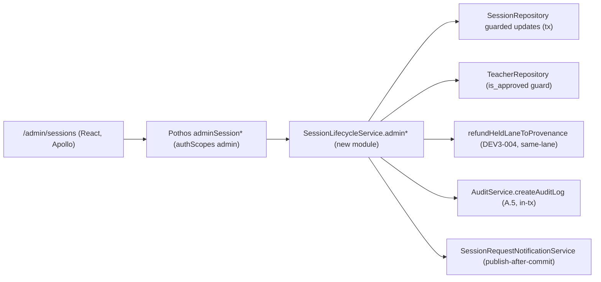

# DEV3-021 — Admin Session Governance — plan.md

**Plan directory**: `ai/plans/sprint_3/dev3-021-admin-session-governance/`

## 1. System Overview



**Key design decisions**

| # | Decision | Rationale |
|---|---|---|
| D1 | No schema change for timing — reschedule writes `started_at`/`ended_at` (the only timing columns that EXIST; `scheduled_at` does not exist → prose-only, not reused). Table: `backend/db/schema/classes/session.ts` | Ground truth verified; avoids destructive migration; documented in docs. |
| D2 | Disputed sessions excluded from reschedule/reassign/cancel (check `status NOT IN ('disputed','completed','cancelled','ended','expired')`); join only on `started`. | Keeps DEV3-022 arbitration sole writer for disputes. |
| D3 | Admin ops piggyback on `SessionLifecycleService` (new file `admin-governance.ts` co-located with other service modules, re-exported via existing barrel) — NOT a new parallel service. | "Session lifecycle is single-writer" rule from `docs/sessions/session-lifecycle.md`. |
| D4 | Audit action types reused: `Override` for reschedule/reassign/join, `Delete` for cancel… enum only offers `create|update|delete|override|adjust|suspend|reactivate` — use `Override` for reschedule/reassign/join; `Delete` is wrong (row survives) → use `Override` for cancel too, `details.action` carries semantic (`"cancel"`/`"reschedule"`/`"reassign"`/`"join"`). | Enums must not be mutated casually; metadata-only details matches DEV3-016 contract. |
| D5 | Frontend: single page `app/(dashboard)/admin/sessions/page.tsx` + views under `frontend/views/admin/sessions/`; nav item added (no existing coming-soon stub — verified). | Follows `frontend/views/admin/disputes` layout pattern. |
| D6 | Join returns `{ session: Session, joinedAt: DateTime }` — no meeting URL (column absent); observation is an audit + detail-view grant. Live-URL bridging deferred (IF meeting-provider join URLs land later, UI gains a link, no API change). | Ground truth: no `meeting_url` in schema. |

## 2. Data Models & Schema

- **No new tables/columns.** Existing `session` + `session_delivery_holds`-lane refunds + `audit_logs` (existing).
- Enums reused: `sessionStatus`, `sessionType` (existing `backend/db/schema/enums.ts`), `AuditActionType` (existing).
- **Canonical types (NEW)** in `backend/types/classes/session-governance.types.ts` (exported via `backend/types/classes/index.ts`):
  - `AdminSessionListFilterInput { teacherId?, studentId?, type?, status?, dateFrom?, dateTo? }`
  - `AdminSessionPage { items: SessionReturnType[], totalCount: number, hasMore: boolean }`
  - `AdminSessionRescheduleInput { sessionId, startedAt, endedAt? }`
  - `AdminSessionReassignInput { sessionId, newTeacherId }`
  - `AdminSessionJoinResult { session: SessionReturnType, joinedAt: Date }`
  - All validated via existing Pothos `validateInputSchema` + zod (zod schemas co-located in same types file, exported).

## 3. API Contracts (Pothos)

Files: `backend/graphql/pothos/classes/admin-session-object.pothos.ts` (AdminSessionPage + AdminSessionJoinResult objects), `backend/graphql/query/classes/admin-session.query.ts`, `backend/graphql/mutation/classes/admin-session.mutation.ts`. All registered in existing barrels `backend/graphql/pothos/classes/index.ts`; import side-effect in the classes pothos index barrels for schema registration (precedent: resolver-layer uses import-for-registration pattern inside GraphQL barrels only).

SDL additions:

```graphql
input AdminSessionListFilterInput { teacherId: ID, studentId: ID, type: SessionTypeEnum, status: SessionStatusEnum, dateFrom: DateTime, dateTo: DateTime }
type AdminSessionPage { items: [Session!]!, totalCount: Int!, hasMore: Boolean! }
type AdminSessionJoinResult { session: Session!, joinedAt: DateTime! }
extend type Query { adminSessions(filter: AdminSessionListFilterInput, page: Int, pageSize: Int): AdminSessionPage!, adminSession(sessionId: ID!): Session }
extend type Mutation { adminRescheduleSession(input: AdminSessionRescheduleInput!): Session!, adminCancelSession(sessionId: ID!, reason: String!): Session!, adminReassignTeacher(input: AdminSessionReassignInput!): Session!, adminJoinSession(sessionId: ID!): AdminSessionJoinResult! }
```

`authScopes: { admin: true }` (same scheme as `adminPothos*` admin resolvers — verify exact existing admin scope helper e.g. `dedicatedAdmin`/`superAdmin` used by DEV3-016 resolvers; mirror it verbatim). Error mapping per `docs/graphql/error-handling-contract.md` via `DomainError.extensions.code`.

**Caller permission matrix**

| Operation | admin | supervisor/teacher/student/parent |
|---|---|---|
| adminSessions / adminSession | ✔ | 403 |
| adminRescheduleSession (scheduled/started) | ✔ | 403 |
| adminCancelSession (non-terminal, non-disputed) | ✔ | 403 |
| adminReassignTeacher (scheduled only) | ✔ | 403 |
| adminJoinSession (status=started) | ✔ | 403 |

## 4. Backend Services & Repositories

**New service module**: `backend/services/classes/session-admin-governance.ts` (imported & re-exported in `backend/services/classes/session-lifecycle.service.ts` namespace pattern used by sibling modules; exported from classes barrel). Methods:

- `listAdminAllSessions(filter: AdminSessionListFilterInput, page: number, pageSize: number, tx?)` → repo `listAdminAll` with `limit/offset`, date range half-open on `created_at`, `escapeLikeWildcards` N/A (no free-text), ORDER BY `created_at DESC, id DESC` (audit-trail convention).
- `getAdminSession(sessionId)` → null-safe read.
- `adminReschedule(input)` — guards (`session.status IN ('scheduled','started')`; if `started`, disallow moving `startedAt` before `created_at`; `endedAt > startedAt` when set) → repo `updateTimingGuarded` → audit `Override` → notify wave (rescheduled).
- `adminCancel(sessionId, reason)` → `db.transaction(tx)` { session = repo.getForUpdate; guard status; `refundHeldLaneToProvenance(tx)` (EXISTING); repo guard-update `status='cancelled'`; `AuditService.createAuditLog(contract, tx)`; collect recipients } → after-commit notify.
- `adminReassign(input)` — tx { lock session; assert status='scheduled'; assert `TeacherRepository` teacher exists + `is_approved`; set `teacher_id` } + audit + notify old/new teacher.
- `adminJoin(sessionId)` — assert `status='started'`; audit only; return `{session, joinedAt: new Date()}`.

**Repository** (`backend/db/repo/classes/session.repository.ts`, guarded pattern as existing methods): add `adminUpdateTimingGuarded`, `adminCancelGuarded`, `adminReassignGuarded`, `listAdminAll` (single Drizzle query with count window-fn — `count(*) over()` — avoiding double round-trip), all accepting `tx?: DBTransaction`. All timestamps keep timezone (column already `mode: "date"`).

**Concurrency assessment**: TOCTOU between guard-check and update is eliminated by performing state assertion INSIDE the guarded `UPDATE … WHERE status IN (...)` returning `RETURNING`*; refunds and audit share `tx`; teacher lock not needed (reassign validates certification snapshot; certification revocation mid-flight is acceptable — audit both ids).

**Journey side-effect matrix**: cancel → status change + refund + 2 notifications + audit; reschedule → timing + 2 notifications + audit; reassign → teacher_id + 2 notifications + audit; join → audit only.

## 5. Frontend UX & Navigation

- Route: `app/(dashboard)/admin/sessions/page.tsx` (server wrapper with auth) → client view `frontend/views/admin/sessions/AdminSessionsView.tsx` — files: `useAdminSessionsViewModel.ts`, `SessionFiltersBar.tsx`, `AdminSessionActionsMenu.tsx`, dialogs `RescheduleDialog.tsx`, `ConfirmAdminActionDialog.tsx` (shared for cancel/reassign warnings…cancel ConfirmDialog w/ reason TextField), `JoinObservePanel.tsx` (detail drawer with observation banner).
- Nav: add to `navItems.ts` admin section: `{ labelKey: "sessions", path: "/admin/sessions" }`. No retarget (verified none).
- Apollo docs `frontend/graphql/sharedDocuments/adminSessions.documents.ts` — include `id` everywhere.
- i18n: extend namespaces `adminSessions` (EXISTING dir present in `shared/locale/namespaces/` — verified; extend submodules `filters`, `actions`, `dialogs`, `errors` keeping handle-const pattern and parity across `en`/`ar`).
- Breakpoints 1440/768/375 via MUI `sx` with shared scaffold split (`AdminSessionsShared.tsx`, `*Desktop.tsx`, `*Mobile.tsx` per scaffold pattern); RTL via existing dir flip; states: loading skeleton rows, empty-state (StatusBadge-backed CTA `EmptyState`), error Alert, disabled Join unless `status==='started'`.
- No hardcoded colors — `theme.palette.*` only; `*Outlined` icons.

## 6. Security & Tenancy Mitigations

- BFLA: `authScopes` + service-level admin assert (defense-in-depth).
- BOLA/BOPLA: whitelist `.set({started_at, ended_at})` / `.set({teacher_id})`; audit `details` metadata-only.
- BOLA: all ops key on `sessionId` PK with no cross-tenant joins; single-tenant app — still assert ctx session role.
- Validation before DB; LIKE escaping N/A (uuid/date filters only).
- `assertUserActive` applied in service (governance exclusion per `createGraphQLContext` note).
- Errors localized, masked (no SQL/stack), `extensions.code` taxonomy.
- Rate limiting: mutations reuse existing gateway/`MAX_GRAPHQL_BODY_BYTES`; no special limiter added (admin ops low-frequency) — recorded as decision.
