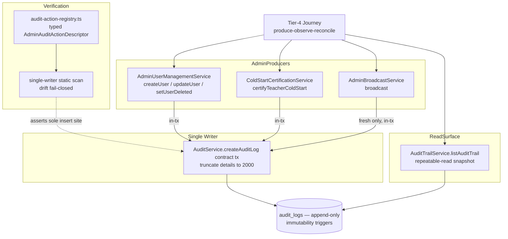

# Implementation Plan: DEV2-021 — Audit Trail Completeness Verification

> **Plan directory (verbatim — every header, ledger path, and self-reference in this document uses this exact string):** `ai/plans/sprint_4/dev2-021-audit-trail-completeness-verification`
> **Specs of record:** `ai/plans/sprint_4/dev2-021-audit-trail-completeness-verification/specs.md` (REQ-001..REQ-096)
> **Ground truth (verify-then-claim, all read):** `backend/services/admin/audit.service.ts:82-90`, `backend/services/admin/audit-trail.service.ts:228-256`, `backend/services/admin/user-management.service.ts:110-440`, `backend/services/admin/cold-start-certification.service.ts:155-215`, `backend/services/notifications/admin-broadcast.service.ts:330-407`, `backend/db/schema/audit/audit-logs.ts`, `backend/enum/audit/audit-action-type.enum.ts`, `backend/types/contracts/admin-audit.contract.types.ts`, `test/workflows/AGENTS.md`, `test/workflows/admin/audit-trail.journey.test.ts`, `test/workflows/helpers/`, `docs/admin/audit-trail.md`.

## 1. System Overview

This is a VERIFICATION ticket. No schema, no new emitters, no GraphQL/SDL, no frontend changes. It adds (1) a typed registry of audit-emitting admin actions, (2) a static single-writer/drift scan, (3) 4-Tier service/repository tests proving per-action audit rows, and (4) a committed-fixture cross-actor workflow journey proving produce→observe→reconcile, denial zero-write, rollback co-fate, and replay idempotency.



## 2. Key Design Decisions

| # | Decision | Rationale | Status |
|---|---|---|---|
| D1 | Registry as code (`backend/services/admin/audit-action-registry.ts`), not doc prose | fail-closed drift: a new admin mutation without registry entry breaks the scan | CREATE |
| D2 | Verification consumes existing emitters; zero new emitters | DEV2-021 is verification; producer gaps become ledger rows, not code | LOCKED |
| D3 | `adjust` / `suspend` recorded as forward obligations in registry + ledger | DEV3-020 listed them as obligation; no producers exist yet in tree | FORWARD |
| D4 | Journey asserts against real services + real DB (committed fixtures) | honest oracle per `test/workflows/AGENTS.md`; no spies on DB | LOCKED |
| D5 | No-Missing-Entries oracle = row-count reconciliation per run prefix | deterministic, isolation-safe under parallel runs | LOCKED |
| D6 | Reuse existing harnesss `TrackedFixtures`, actor factories, `withAuditDeleteTriggersSuspended` | mandatory by `test/workflows/AGENTS.md`; no invented helpers | EXISTING |
| D7 | Denial chaos via real service calls, using try/catch + translated substrings | repo rule; NEVER `expect(...).rejects.toThrow()` | LOCKED |
| D8 | Replay (idempotency) path driven through real `AdminBroadcastService.broadcast` with `X-Idempotency-Key` pinned via engine cache | proves REQ-018 at the true integration seam | LOCKED |
| D9 | Docs: amend ONLY `docs/admin/audit-trail.md` §10 (pointer); PRODUCTION_READINESS §1.3 checkbox flip deferred | per REQ-081 release-manager ownership | DEFERRED |
| D10 | `entity_type` vocabulary frozen to observed values: `user`, `teacher`, `notification_broadcast` (+ forward `wallet`/placeholder for adjust) | matches in-tree emitters; registry asserts equality | LOCKED |

## 3. Data Models & Database Schema

No schema changes. Existing sources of truth (verify-then-claim — all present on disk):

- Table `audit_logs` — `backend/db/schema/audit/audit-logs.ts`:
  - `id integer PK generatedAlwaysAsIdentity`
  - `actor_id integer NOT NULL REFERENCES users(id) ON DELETE RESTRICT`
  - `action_type audit_action_type NOT NULL` (pgEnum, `backend/db/schema/enums.ts`)
  - `entity_type varchar(100) NOT NULL`, `entity_id integer NULL`, `details varchar(2000) NULL`, `created_at timestamp NOT NULL DEFAULT now()`
  - Indexes: `audit_logs_actor_id_idx (actor_id)`, `audit_logs_entity_type_entity_id_idx (entity_type, entity_id)`
  - Immutability: `backend/db/migration/3-immutability-triggers.sql` (blocks UPDATE/DELETE; sanctioned suspension only via `withAuditDeleteTriggersSuspended`).
- Enum `AuditActionType` — `backend/enum/audit/audit-action-type.enum.ts`: `create | update | delete | override | adjust | suspend | reactivate`.
- Canonical types — `backend/types/audit/audit-log.types.ts` (`AuditLogSelectType`, `AuditLogInsertType`); write/actor contract in `backend/types/contracts/admin-audit.contract.types.ts` (`AuditLogWriteContract`, `ActorContextRef`).

## 4. API Contracts & Pothos Resolvers

No changes. Existing read surface (`docs/admin/audit-trail.md` §2): `adminAuditLogs(filters, page, pageSize)` — admin-gated via `assertActorAdmin`; closed-input filter whitelist `(actorId, actionType, entityType, entityId, from, to)`; `createdAt DESC, id DESC`; honest pagination; snapshot tx.

Wire contract remains locked by `backend/graphql/test/audit-trail.query.test.ts`, `schema-surface.test.ts`, `sdl-static-assertions.test.ts`. This plan references those locks; it does not modify them.

Caller permission matrix (verification targets):

| Surface | Anonymous | Non-admin | Admin |
|---|---|---|---|
| Admin mutations (registry) | `UNAUTHENTICATED`, 0 rows | `FORBIDDEN`, 0 rows | commit → exactly 1 row |
| `adminAuditLogs` read | `UNAUTHORIZED`, 0 rows | `FORBIDDEN`, 0 rows | snapshot read, 0 rows minted |

## 5. Backend Services & Repositories

### 5.1 New module (CREATE) — `backend/services/admin/audit-action-registry.ts`

```typescript
// typed, frozen const; the ONLY enumeration of audit-emitting admin actions.
import { AuditActionType } from "@/backend/enum/audit/audit-action-type.enum";
export interface AdminAuditActionDescriptor {
  readonly operation: string;            // e.g. "admin.users.create"
  readonly expectedActionType: AuditActionType;
  readonly entityType: "user" | "teacher" | "notification_broadcast";
  readonly emitterFile: string;          // repo-relative path
  readonly serviceMethod: string;        // e.g. "AdminUserManagementService.createUser"
  readonly producerStatus: "implemented" | "forward";
}
export const ADMIN_AUDIT_ACTIONS: readonly AdminAuditActionDescriptor[] = [
  { operation: "admin.users.create",     expectedActionType: AuditActionType.Create,     entityType: "user",                   emitterFile: "backend/services/admin/user-management.service.ts",         serviceMethod: "AdminUserManagementService.createUser",             producerStatus: "implemented" },
  { operation: "admin.users.update",     expectedActionType: AuditActionType.Update,     entityType: "user",                   emitterFile: "backend/services/admin/user-management.service.ts",         serviceMethod: "AdminUserManagementService.updateUser",             producerStatus: "implemented" },
  { operation: "admin.users.delete",     expectedActionType: AuditActionType.Delete,     entityType: "user",                   emitterFile: "backend/services/admin/user-management.service.ts",         serviceMethod: "AdminUserManagementService.setUserDeleted(true)",   producerStatus: "implemented" },
  { operation: "admin.users.reactivate", expectedActionType: AuditActionType.Reactivate, entityType: "user",                   emitterFile: "backend/services/admin/user-management.service.ts",         serviceMethod: "AdminUserManagementService.setUserDeleted(false)",  producerStatus: "implemented" },
  { operation: "admin.teachers.certifyColdStart", expectedActionType: AuditActionType.Override, entityType: "teacher",     emitterFile: "backend/services/admin/cold-start-certification.service.ts", serviceMethod: "ColdStartCertificationService.certifyTeacherColdStart", producerStatus: "implemented" },
  { operation: "admin.broadcast.send",   expectedActionType: AuditActionType.Create,     entityType: "notification_broadcast", emitterFile: "backend/services/notifications/admin-broadcast.service.ts", serviceMethod: "AdminBroadcastService.broadcast",                 producerStatus: "implemented" },
  { operation: "admin.wallet.adjust",    expectedActionType: AuditActionType.Adjust,     entityType: "user",                   emitterFile: "",                                                       serviceMethod: "",                                                  producerStatus: "forward" },
  { operation: "admin.users.suspend",    expectedActionType: AuditActionType.Suspend,    entityType: "user",                   emitterFile: "",                                                       serviceMethod: "",                                                  producerStatus: "forward" },
] as const;
```
Barrel: add `export * from "./audit-action-registry"` to `backend/services/admin/index.ts` (`./`, one slash, no imports).

### 5.2 Repository / Service call signatures (all EXISTING — consumed, not modified)

- `AuditService.createAuditLog(input: AuditLogWriteContract, tx: DBTransaction): Promise<void>` — ONLY writer; truncates `details` ≤ 2000.
- `AdminUserManagementService.createUser(input: AdminCreateUserSubmitInput, locale: string, actorId: number)` → create row.
- `AdminUserManagementService.updateUser(id, patch, locale, actorId)` → update row.
- `AdminUserManagementService.setUserDeleted(id, deleted, locale, actorId)` → delete/reactivate row.
- `ColdStartCertificationService.certifyTeacherColdStart(userId, makeEvaluator, locale, actorId)` → override row, entityType `"teacher"`.
- `AdminBroadcastService.broadcast(input, locale, actorId, engineOptions)` → create row `entityId: null` when fresh; replay → zero rows.
- `AuditTrailService.listAuditTrail(filters, page, pageSize, locale, actorId, outerTx?)` — snapshot read.

### 5.3 Concurrency & Race Condition Assessment

- TOCTOU: none applicable — this ticket mutates only test fixtures; production writes happen inside existing `withTransaction` single commits.
- Row locking: not applicable (append-only).
- Read consistency: reconcile oracle relies on `AuditTrailService` snapshot (repeatable read); concurrent producer test asserts both rows appear with correct count.
- Broadcast idempotency: replay detection via engine claim cache — the only concurrency-sensitive producer; covered by Tier-3 test.

### 5.4 Cross-Actor Journey Design

State transitions: none on domain entities beyond existing flows; the audit trail itself is the observed shared state. Side-effect matrix:

| Producer action | audit_logs delta | notifications | governance |
|---|---|---|---|
| createUser (commit) | +1 (create/user) | none asserted here | — |
| updateUser (commit) | +1 (update/user) | none | — |
| setUserDeleted true/false | +1 (delete|reactivate/user) | none | user soft state flips |
| certifyTeacherColdStart | +1 (override/teacher) | none | teacher certified |
| broadcast fresh | +1 (create/notification_broadcast, entityId null) | engine fan-out (spied) | — |
| broadcast replay | 0 | idempotent no-op | — |
| rolled-back mutation | 0 | none | none |
| any denial | 0 | none | none |
| trail read | 0 | none | none |

Visibility matrix: admin observer sees all rows; non-admin/anonymous see nothing (denied); governed (soft-deleted) target's history remains readable (INV-U1).

## 6. Frontend UX & Navigation

N/A — verification ticket. No routes, no navItems, no components, no Apollo documents. The existing audit-trail UI + tests (`frontend/.../AuditTrailView`, `test/ui/components/admin/AuditTrailView.test.tsx`, documents tests) are unchanged locks.

## 7. Security & Tenancy Mitigations

- BOLA/IDOR: `actorId = ctx.user.id` proof via tampered-input chaos test; read surface admin-only.
- BOPLA: `details` whitelist proof — PII denylist scan asserts no `email`, `phone`, `password`, `passwordHash`, pre/post pairs in minted rows.
- BFLA: per-surface gating re-verified on every registry row via real service calls with non-admin and anonymous actors.
- LIKE escaping / filter hardening: already owned by `docs/admin/user-management.md` + `audit-trail` filters; re-verified only at boundaries exercised.
- Error disclosure: try/catch + translated substring assertions; no raw stack/PII in assertions.

## 8. Deferred-Items Ledger Pointers (pre-seed for `deferred-items.md`)

| Pointer | Owner | Note |
|---|---|---|
| FWD-adjust-emitter | future billing/wallet admin adjust ticket | `Adjust` has no producer; registry row `admin.wallet.adjust` forward |
| FWD-suspend-emitter | future governance suspend ticket (DEV3-017 covers soft-delete not suspension emission) | `Suspend` has no producer; registry row `admin.users.suspend` forward |
| READINESS-1.3-checkbox-flip | release manager | PR §1.3.1/1.3.3/1.3.5 remain `☐` until release pass (REQ-081) |
| DOC-audit-trail-§10-amend | this plan (task 5.1) | pointer amendment only |
