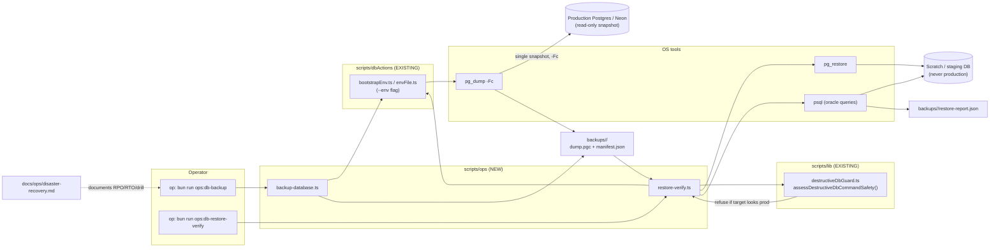

# Implementation Plan: DEV3-024 — Disaster Recovery & Backup Verification

> **Plan directory (verbatim — all self-references use this exact string)**: `ai/plans/sprint_4/dev3-024-disaster-recovery-backup-verification`
> **Companion docs**: `specs.md` (this dir), `tasks.md` (this dir), `deferred-items.md` (this dir)
> **Ticket**: `docs/planning/TICKETS.md` §DEV3-024 (Sprint 4, 5 SP, Blocked By: None)

## 1. System Overview & Architecture

### Overview

This ticket is pure operational tooling + documentation. It ships **two Bun operator scripts** following the existing `scripts/ops/*.ts` convention, plus the **canonical DR runbook**, plus tests. No application code paths change; nothing is reachable from the app at runtime.

### Design Goals

- **Proof over hope** — every backup must be machine-verifiable; every restore claim must terminate in a PASS/FAIL report.
- **Production can never be the restore target** — the existing destructive guard decides, not operator memory.
- **Conventions-preserving** — identical bootstrap, flags, exit codes, output style, and test layout to `scripts/ops/sweep-expired-link-requests.ts` and `scripts/dbActions/*`.
- **Evidence-generating** — every run leaves a manifest/report that DEV3-026 can attach to PRODUCTION_READINESS §7 sign-off.

### Architecture (Mermaid)



### Key Design Decisions

| Decision | Choice | Rationale |
|---|---|---|
| Backup tool | `pg_dump -Fc` (custom format) | Bit-stable, selective-restore capable, version-tolerant; matches Postgres/Neon reality; SQLite path out of scope |
| Restore target | Always explicit scratch DSN + guard + `--yes-i-understand` | Zero-blind-spot against prod overwrite; reuses existing guard module verbatim |
| Verification | Structural counts + invariant spec predicates + migration-hash check | Turns `docs/specs/state-machine-invariants.md` into executable post-restore oracles without touching app services |
| Storage | `<repo>/backups/<utc-ts>/`, gitignored, 0600 | Keeps PII out of VCS/deploys; D-003 forward-defers off-site upload |
| No UI / no GraphQL | Confirmed by Phase 0 | Backup/restore must never be app-triggerable (BFLA) |
| RPO / RTO | RPO 1h, RTO 4h | Ratifies PRODUCTION_READINESS §7.4/7.5's example values as the platform contract |
| i18n | Exempt (operator tooling) | Matches existing ops scripts; exemption recorded in runbook (REQ-052) |

## 2. Data Models & Database Schema

**None created, none modified.** `git diff -- backend/db/schema/ backend/db/migration/ backend/drizzle/**` MUST be empty.

Script-local shapes (not persisted; live inside their script files, never in `backend/types/` — those are reserved for domain entities):

```ts
// scripts/ops/backup-database.ts
interface BackupManifest {
  tool: "ops:db-backup";
  toolVersion: string;
  postgresServerVersion: string;
  pgDumpVersion: string;
  database: string;        // name only — host/user redacted (REQ-030)
  startedAtUtc: string;
  finishedAtUtc: string;
  artifactFile: string;    // dump.pgc
  artifactBytes: number;
  sha256: string;
  journalHash: string;     // hash of backend/drizzle journal at backup time
}

// scripts/ops/restore-verify.ts
interface OracleResult { id: string; description: string; passed: boolean; detail: string; }
interface RestoreReport {
  tool: "ops:db-restore-verify";
  artifactFile: string;
  artifactSha256: string;  // recomputed; must equal manifest
  target: { database: string }; // redacted
  startedAtUtc: string;
  durationMs: number;      // feeds RTO evidence
  structural: { table: string; rowCount: number; sourceNonEmpty: boolean; ok: boolean }[];
  oracles: OracleResult[];
  verdict: "PASS" | "FAIL";
}
```

## 3. API Contracts & Pothos Resolvers

**None.** Zero GraphQL surface. (Deliberate — see specs §1 non-goals and §2.6.) Caller-permission matrix collapses to: *shell operator only*; all in-app roles including `SUPER_ADMIN` have no trigger path.

## 4. Backend Services & Repositories

**None created.** The scripts do NOT import `backend/services/**` or `backend/db/repo/**`; they shell out to `pg_*` binaries (OS-level, snapshot-consistent) and run oracle SQL via `psql`. Internal helper decomposition, per file:

### 4.1 `scripts/ops/backup-database.ts` (CREATE)

| Function | Signature | Behavior |
|---|---|---|
| `parseBackupArgs(argv)` | `(argv: string[]) => { envFile?: string; outDir: string } \| never` | `--env`, optional `--out-dir` (default `<repo>/backups`), `--help`; usage errors exit 2 |
| `resolvePgToolchain()` | `() => { pgDump: string; psql: string }` | Find via PATH; actionable error if missing (document apt/brew install in runbook) |
| `buildSafeConnString(rawUrl)` | `(rawUrl: string) => string` | Validates postgres scheme; redaction applied only at *print* time |
| `runBackup(dsn, runDir)` | `(dsn, runDir) => Promise<BackupManifest>` | `pg_dump -Fc -f dump.pgc`; stream stderr tail on failure; compute sha256; snapshot `backend/drizzle/` journal hash; atomic `tmp → final` rename (REQ-040) |
| `writeManifest(runDir, manifest)` | `(...)` | `manifest.json`, mode 0600, then `chmod 600 dump.pgc` (REQ-033) |
| `printSummary(manifest)` | `(manifest) => void` | stdout summary, host/DSN redacted |

### 4.2 `scripts/ops/restore-verify.ts` (CREATE)

| Function | Signature | Behavior |
|---|---|---|
| `parseRestoreArgs(argv)` | `(argv) => { from: string; target: string; yes: boolean } \| never` | `--from <artifact|run-dir>`, `--target <dsn>` (REQUIRED — no default (REQ-031)), `--yes-i-understand` for non-TTY |
| `assertRestoreTargetSafe(dsn)` | `(dsn) => void` | Calls `assessDestructiveDbCommandSafety()` (existing guard) against a synthesized env where the TARGET dsn is the one assessed; refusal → exit 2 with formatDestructiveDbBlockMessage (REQ-016) |
| `verifyArtifact(runDir)` | `(runDir) => BackupManifest` | Recompute sha256 vs manifest; fail exit 1 on mismatch |
| `restoreIntoScratch(dsn, artifact)` | `(...) => Promise<void>` | `pg_restore --clean --if-exists --no-owner --no-privileges` (documented choice: staging DBs have different roles) |
| `runStructuralChecks(dsn)` | `(...) => Promise<StructuralRow[]>` | REQ-017 table presence + row counts |
| `runInvariantOracles(dsn)` | `(...) => Promise<OracleResult[]>` | REQ-018 read-only SQL (registry below) |
| `writeReport(runDir, report)` | `(...)` | `restore-report.json`; prints PASS/FAIL summary + report path (REQ-019) |

### 4.3 Invariant Oracle Registry (initial — REQ-018)

| Oracle id | SQL predicate (sketch) | Anchor |
|---|---|---|
| `OR-W1` | no wallet with `balance < 0` | INV-W* |
| `OR-W2` | no `wallet_transactions` row without matching wallet | INV-W* |
| `OR-B1` | no session hold referencing a missing lane/balance | INV-B* |
| `OR-U1` | no `audit_logs` row with null actor FK target | A.5 / INV-U* |
| `OR-U2` | soft-deleted users retain history rows (counts > 0 where source had any) | INV-U4/U5 |
| `OR-ACL` | `session_requests` reference existing student rows | workflow 02 |
| `OR-MIG` | last `__drizzle_migrations` hash == manifest `journalHash` | REQ-017 |

Oracle SQL lives inline in `restore-verify.ts` as a `const ORACLES: { id; description; sql }[]` — data-driven so adding an oracle never touches control flow.

### 4.4 Concurrency & Race-Condition Assessment

- **Backup vs. app writes**: `pg_dump` takes a consistent MVCC snapshot; no app lock needed; documented in runbook.
- **Two operators racing**: run-directory lockfile `backups/.lock-<pid>` (REQ-042); second invocation exits 2 while lock is live; stale-lock detection via PID liveness check.
- **TOCTOU on target safety**: guard is evaluated on the *same* DSN string that is passed to `pg_restore` (single variable, no re-parse), eliminating parse-divergence TOCTOU.
- **Restore concurrency**: scratch DB name may embed timestamp in drill mode; production-shape DSNs are guard-refused regardless of timing.

### 4.5 Cross-Actor Journey Design

Per specs §2.9 ruling: **no domain journey**. The drill in the runbook plays the operational sequence (Operator → backup; Operator → restore-to-scratch; Operator → verify; Admin → accept evidence) as a *procedure*, asserted end-to-end by the integration test (REQ-061), not by a multi-actor workflow test.

## 5. Frontend UX & Navigation Specification

**None — deliberate.** No routes, no navItems changes, no Apollo documents, no components, no breakpoints, no RTL deltas. Verified in Phase 0 that no DR-related UI exists to extend (`frontend/views/dashboard/` has no ops section). A future admin "backup status" widget is out of scope (non-goal, §1).

## 6. Security & Tenancy Mitigations

| Threat | Mitigation (REQ ref) |
|---|---|
| Restore overwriting production | destructiveDbGuard assessment on target DSN + mandatory explicit `--target` + `--yes-i-understand` (REQ-016/031); TOCTOU-safe single-DSN usage (§4.4) |
| Credential leakage in logs/manifests | redaction helper; Tier-4 tests grep captured stdout/stderr/manifest for the raw DSN password (REQ-030) |
| PII-bearing dumps committed to git | `/backups/` added to `.gitignore` + assertion test (REQ-014/033); 0600 perms |
| App-role abuse of DR surface | no app surface exists at all (BFLA by construction, REQ-032) |
| Injection via CLI args | args are file paths/DSNs passed as argv arrays to `Bun.spawn` — never through a shell string |
| Tampered artifact restored | SHA-256 recompute vs manifest before restore; mismatch = exit 1 (REQ-011/019) |
| LIKE/regex wildcard escaping | N/A — no search inputs |
| Error disclosure | error messages tagged, no stack+credentials; runbook documents operator log-handling (REQ-050/051) |

## 7. Testing Strategy Summary (detail in tasks.md)

- **Unit (colocated `*.test.ts`, `scripts/ops/`)**: arg parsing, manifest/io, sha256, guard wiring, oracle registry shape, exit-code matrix — 4 tiers per REQ-060.
- **Integration**: full backup→restore→verify against an isolated scratch database created/dropped by the test itself (not `runInRollback` — OS tooling needs a real DB); executed via `bun run test/scripts/run-test.ts` (REQ-061/062).
- **Drill**: documented human execution of `docs/ops/disaster-recovery.md` with durations recorded as outcome evidence (REQ-022).
