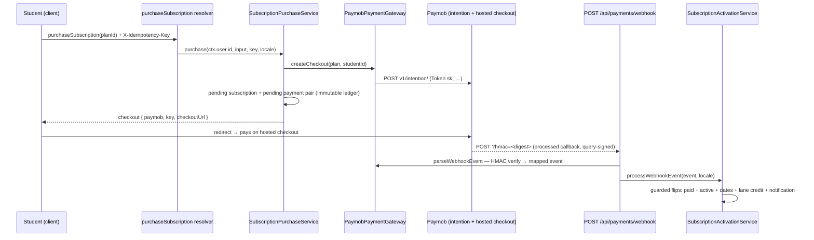
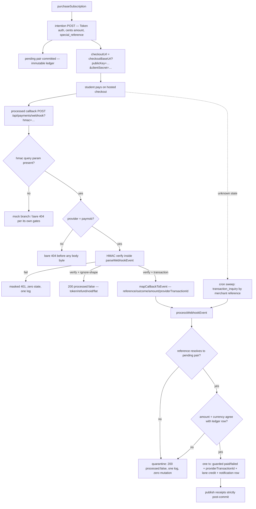

# Paymob Gateway Reference

**Domain:** Billing & Subscriptions — `paymob` payment provider
**Lifecycle Status:** Active

---

## 1. Overview & Architecture

The `paymob` provider is the real redirect-based gateway behind the `PaymentGatewayPort`
contract documented in [`subscription-purchase.md`](./subscription-purchase.md). It follows the
Unified Checkout redirect flow: the server creates an **intention**, the browser redirects to
Paymob's hosted checkout, the settled result arrives as an HMAC-signed callback on
`POST /api/payments/webhook`, and the existing activation service fulfils the purchase. The
gateway adapter holds no state between calls — configuration is re-resolved fail-closed on every
operation, so a config change is observable on the next request without a restart.

All endpoint paths below are relative to the configured API base (default
`https://accept.paymob.com`; regional bases `ksa.paymob.com` / `uae.paymob.com` / `oman.paymob.com`
are operator-configurable overrides).

---

## 2. Endpoints

| Surface | Endpoint / location | Auth | Purpose |
|---|---|---|---|
| Intention creation | `POST v1/intention/` | `Authorization: Token <PAYMOB_SECRET_KEY>` | Creates the payment intention; response carries `client_secret` (→ checkout URL) and `id` |
| Checkout redirect | `GET {checkoutBaseUrl}?publicKey=<pk>&clientSecret=<client_secret>` | public key (client-side) | Hosted Unified Checkout; the student's browser only |
| Processed callback (fulfillment source of truth) | `POST /api/payments/webhook?hmac=<digest>` | HMAC-SHA512 signature | Server-to-server settlement; drives activation |
| Response callback (display only) | `GET` query params on the result page | HMAC-SHA512 over flat query | Shows success/failure; **never fulfils** |
| Reconciliation sweep | `GET /api/cron/reconcile-paymob-payments` | `Authorization: Bearer <CRON_SECRET>` | Cron backstop for delivered-but-unknown-state intentions |
| Transaction inquiry (used by the sweep) | `POST api/auth/tokens` then `POST api/ecommerce/orders/transaction_inquiry` | API key in the mint body; minted token in the inquiry **body** | Resolves stale pending payments |

Refund / void / capture and saved-card (CIT/MIT) endpoints are intentionally NOT wired — see the
deferral notes in `ai/plans/sprint_1/subscription-purchase-payment-gateway/deferred-items.md` and
the mirror under `.agents/skills/paymob-payments/references/docs/manage-payment-apis/`.

### Intention request essentials

- `amount` — integer **cents**, converted from the verbatim plan-row decimal string (regex
  `^\d+(\.\d{1,2})?$` + exact string-split integer math + safe-integer ceiling; a malformed amount
  fails closed **before** any network call).
- `currency` — passthrough from the plan row; matching it to the integration's currency is checked
  by the provider.
- `payment_methods` — `[integrationIdCard]`, plus `integrationIdWallet` only when configured.
- `items` — exactly one line item (`name: "Subscription"`, same cents, `quantity: 1`) so the
  vendor's sum-of-items rule holds by construction.
- `billing_data` — server-derived `first_name`/`last_name`/`email`/`phone_number` (trimmed,
  `"NA"` placeholder when null/empty; phone is nullable upstream); the seven address members are
  ALWAYS `"NA"` — the domain carries no address data.
- `special_reference` — the purchase idempotency key, carried verbatim; the provider echoes it
  back as `merchant_order_id` on every callback (the correlation key).
- `notification_url` / `redirection_url` — composed only on the ngrok callback channel (§4);
  omitted otherwise so the vendor falls back to the operator-configured dashboard URLs.

---

## 3. HMAC verification discipline

Every callback's trust boundary is the vendor's HMAC-SHA512 scheme. The rules below are enforced by
`backend/services/billing/payment-gateway/paymob/paymob.hmac.ts` + `paymob.constants.ts` and pinned
by the colocated golden/tamper vector suite.

**Verify-before-parse:** the `hmac` query parameter's *presence* is the paymob-branch claim marker
on the webhook route; its *value* is verified inside `parseWebhookEvent` before any payload member
is trusted or mapped. A tampered body with a stale signature is rejected (401) with zero state
change; an ignored variant (token/refund/void/flat-redirect) is verified BEFORE it is ignored.

**Three key lists, exact order (missing → empty string; the message is position-sensitive):**

- `PAYMOB_TXN_HMAC_KEYS_POST` (20, getter paths relative to the nested `obj`):
  `amount_cents, created_at, currency, error_occured, has_parent_transaction, id, integration_id,
  is_3d_secure, is_auth, is_capture, is_refunded, is_standalone_payment, is_voided, order.id,
  owner, pending, source_data.pan, source_data.sub_type, source_data.type, success`
- `PAYMOB_TXN_HMAC_KEYS_GET` (20, flat — same order, the order-id slot swapped):
  `… order_id, owner, pending, …` (the builder prefers `order`, falls back to `order_id`)
- `PAYMOB_TOKEN_HMAC_KEYS` (8):
  `card_subtype, created_at, email, id, masked_pan, merchant_id, order_id, token`

**Serialization rules:** booleans lowercase `true`/`false`; numbers/strings plain; absent values →
empty string (an absent member still consumes its slot — the vendor's own sample shows the empty
`pending` slot on completed transactions).

**Comparison discipline:** both the presented and the expected hex digests are hashed to
fixed-length SHA-256 digests and compared with `timingSafeEqual` — length-agnostic, timing-safe,
never throwing on attacker-controlled input, fail-closed (missing/empty `hmac` or empty secret →
`false`). Digest comparison is case-sensitive lowercase hex; uppercase re-encodings are denied by
design. The simulation and ngrok callback channels sign synthetic deliveries with the SAME
production builder — there is exactly one HMAC message implementation, and the webhook route's
HMAC gate is the only signature authority (the route itself contains no HMAC machinery).

---

## 4. Callback-channel architecture

Outside production, a provider callback reaches the webhook receiver through the callback-channel
factory (`getCallbackChannel()`), the single source of truth for delivery topology. The adapter
composes `notification_url`/`redirection_url` from the resolved channel's `publicBaseUrl` — URLs
are composed ONLY when the resolved channel carries a public base, i.e. only on the ngrok channel.

| Channel | Resolved when | `publicBaseUrl` | Callback URLs on intention | Test delivery |
|---|---|---|---|---|
| `real` | Production runtime, or provider ≠ paymob | `null` | omitted → dashboard fallback | fail-closed rejection (`PAYMENT_CALLBACK_TEST_DELIVERY_UNSUPPORTED`) |
| `ngrok` | Development + paymob + BOTH `NGROB_*`-family keys set + the public readiness probe passes | `https://<NGROK_DOMAIN>` | composed: `${publicBaseUrl}/api/payments/webhook` + result path | signed synthesis through the tunnel |
| `simulation` | Development + paymob, everything else (missing/partial tunnel keys → `ngrok-not-configured`; failed probe → `ngrok-unreachable`) | `http://localhost:<NGROK_PORT>` (default 3000) | omitted → dashboard fallback | signed synthesis POSTed to the local webhook |

Factory rules:

- **Tunnel configuration is read in exactly ONE place** — inside the factory, through the typed
  env snapshot (`getEnvironmentConfig().ngrok`); no production source outside `backend/lib/env.ts`
  reads `process.env.NGROK`.
- **Single lazy resolution** (in-flight Promise memoization): concurrent first callers resolve one
  channel, spawn one agent, log one fallback. `resetCallbackChannel()` drops the channel + env
  snapshot (the test seam).
- **Localhost leak guard:** the simulation channel's localhost base is never attached to an
  intention — internal topology never reaches the vendor on the default dev path.
- **Ngrok lifecycle:** the agent is spawned as `ngrok http --url="https://<domain>" <port>`
  (authtoken via the child process environment — never the command line, never a log line; agent
  output discarded), readiness is probed on the PUBLIC domain's `https://<domain>/api/health`
  (2xx/3xx, deadline-bounded retries under `PAYMOB_HTTP_TIMEOUT_MS`), and the channel registers a
  process-exit cleanup; a failed acquisition disposes the agent and degrades to `simulation` with
  one structured info log (reason + the tunnel's own error message, never the authtoken).
- **Production guards:** every dev channel throws from BOTH public methods before any transport
  call if invoked in a production runtime; the real channel rejects test delivery outright, so no
  production process can synthesize settlements through any channel.
- **Synthesis determinism:** identical delivery arguments produce byte-identical signed bodies
  (no clock, no randomness) — replay scenarios reproduce true duplicate deliveries; distinct
  references derive distinct transaction ids.

### localhost `notification_url` pitfall

Do not "fix" the omitted callback URLs by hardcoding `http://localhost:3000/...` into the
intention: that value would be sent to Paymob as the notification target and (a) leaks internal
topology, (b) can never receive a vendor callback. The omission is deliberate — the vendor falls
back to the dashboard-configured URLs, and local dev delivery goes through the simulation channel
instead. The only legitimate tunnel composition is the ngrok channel's `publicBaseUrl`.

---

## 5. Environment matrix

All keys live in the typed env snapshot (`backend/lib/env.ts`); a `null`/unset member means
"gateway unconfigured" and consumers fail closed at request time. The full set is documented in
`.env.example` (placeholders only — no real credentials are ever committed).

| Key | Default | Fail-closed semantics |
|---|---|---|
| `PAYMENT_GATEWAY_PROVIDER` | `mock` | Registry key (trimmed, lowercased); unknown values fail closed; in production without `TEST_SERVER=1` the built-in `mock` is refused (fail-closed) |
| `PAYMOB_SECRET_KEY` | `null` | Absent → `createCheckout` answers `SERVICE_UNAVAILABLE` ("Payment gateway is not configured.") |
| `PAYMOB_PUBLIC_KEY` | `null` | Absent → fail closed (the checkout URL cannot be composed) |
| `PAYMOB_HMAC_SECRET` | `null` | Absent → every webhook delivery rejected (503-family for the unconfigured secret; 401 on a failed compare); test channels fail delivery closed |
| `PAYMOB_API_KEY` | `null` | Absent → reconciliation sweep gates to a zero-count skip; cron route answers bare 404 |
| `PAYMOB_INTEGRATION_ID_CARD` | `null` | Absent → fail closed (no payment method on the intention) |
| `PAYMOB_INTEGRATION_ID_WALLET` | `null` | Optional — wallet appended to the intention only when set |
| `PAYMOB_API_BASE_URL` | `https://accept.paymob.com` | Accepts a verbatim regional base |
| `PAYMOB_CHECKOUT_BASE_URL` | `https://eg.checkout.paymob.com` | Full host(+path) prefix; the legacy `https://accept.paymob.com/unifiedcheckout/` form is a valid override |
| `PAYMOB_HTTP_TIMEOUT_MS` | `10000` | Per-attempt HTTP budget; also the callback-channel readiness budget |
| `PAYMOB_RECONCILE_PENDING_MINUTES` | `30` | Stale-pending window for the sweep |
| `NGROK_AUTHTOKEN` | `null` | BOTH tunnel keys required — absent/partial → `simulation` (`ngrok-not-configured`) |
| `NGROK_DOMAIN` | `null` | Trailing slash stripped; a `://`-containing value falls into the named fallback |
| `NGROK_PORT` | `3000` | Local dev-server port for the tunnel/simulation target |

Cron trio for the sweep route (pre-existing): `CRON_EXECUTION_MODE=external` AND
`CRON_EXTERNAL_ENABLED=true` AND `CRON_SECRET` — each leg alone fails closed.

---

## 6. Purchase → webhook → activation flow

**Replay / idempotency invariants** (identical on the webhook and sweep paths):

1. The purchase idempotency key rides `special_reference` → echoed as `merchant_order_id` → stored
   as `paymentReference` (partial unique index: one reference maps to at most one subscription).
2. The guarded `WHERE status = 'pending'` decision UPDATE is the arbiter — a replayed delivery
   matches zero rows and acks as a replay; no second credit, no second notification, no second
   publish, and the `providerTransactionId` write is a one-time NULL → value inside the SAME
   guarded statement (never overwritten, never written after the fact).
3. Paymob deliveries always carry `providerTransactionId`, so the notification idempotency key
   `payment:<providerTransactionId>:confirmation` dedupes belt-and-braces on top of the guard.
4. Settlement integrity beats liveness: the receiver never throws 4xx for outcome content —
   quarantines, replays, and ignored variants ack `200 { processed: false }` so the vendor's retry
   schedule stops without triggering an infinite retry storm against a terminal state.
5. Transport retry discipline mirrors this: a timed-out intention request is NEVER retried (it was
   delivered — its state is unknown and belongs to the sweep); retries are granted only to
   no-response transport failures and 5xx (3 attempts total, 100 ms pause).

---

## 7. Reconciliation sweep semantics

`GET /api/cron/reconcile-paymob-payments` (gate chain, in fixed order: bare-404 cron-mode gate →
bare-404 provider/API-key gate → timing-safe bearer gate) delegates to
`reconcilePendingPaymobPayments({ now })`:

1. Pull the stale-pending batch: `findStalePendingByGateway(paymob, now − 30 min, ≤ 50 rows)`.
2. For each row, resolve independently: mint a fresh auth token (never cached — the vendor expires
   it hourly), `transaction_inquiry` by the row's stored `paymentReference`.
3. Classify the inquiry: still `pending` → skip (never terminate an in-flight purchase);
   refund/void/parent-child variants → skip (the same verified-then-ignored shapes the webhook
   dispatch never settles); missing reference → skip with a log; otherwise `success` decides
   confirmed/failed.
4. Terminal outcomes funnel through the SAME `processWebhookEvent(event, "en")` call as webhook
   deliveries — guarded transitions, lane crediting, provider-reference recording, and keyed
   notification dedupe are byte-identical to the callback path.
5. Counters `{ checked, confirmed, failed, skipped }` with `checked = confirmed + failed +
   skipped`; refused handoffs (unknown reference, quarantine) count as `skipped`. The success
   envelope carries aggregate counts only — no row identities cross the wire.

The sweep never throws for unconfigured state or outcome content — only true infrastructure
breaches propagate to the masked 500. The route-level provider gate intentionally duplicates the
service-level gate (belt-and-suspenders: the route hides the endpoint, the service stays honest
when invoked from elsewhere). All cron routes (`reconcile-paymob-payments`, `sweep-sessions`, and `expire-subscriptions`)
answer the same bare-404 fail-closed gates (disabled cron mode; unconfigured provider — see
[`error-handling-contract.md`](../graphql/error-handling-contract.md) §3 for the webhook route's
exemption row).

---

## 8. Dashboard setup checklist

All operator-side (Paymob dashboard — test and live modes are separate):

1. **Secret key** (`sk_test_…` / `sk_live_…`) → `PAYMOB_SECRET_KEY` (intention API, Token auth).
2. **Public key** (`pk_…`) → `PAYMOB_PUBLIC_KEY` (checkout URL query param).
3. **API key** (long base64; shared across test/live) → `PAYMOB_API_KEY` (reconciliation only).
4. **HMAC secret** (hex) → `PAYMOB_HMAC_SECRET` (callback verification).
5. **Integration IDs** — Developers → Payment Integrations: card integration ID (required) and
   wallet integration ID (optional) → `PAYMOB_INTEGRATION_ID_CARD` / `PAYMOB_INTEGRATION_ID_WALLET`
   (integer values).
6. **Callback URLs** on the integration — processed-callback URL
   (`https://<your-domain>/api/payments/webhook`) and redirect URL (the student result page).
   These are the fallback targets whenever the intention omits `notification_url` /
   `redirection_url` — i.e. always in production (the real channel composes no URLs; the
   dashboard entry is the delivery path). The secret key and the integration IDs must belong to
   the SAME mode (test vs live) — a mismatch is the classic 404 "Integration ID/Name does not
   exist" failure.

---

## 9. Test-credential runbook (sandbox)

Source: the offline mirror (`.agents/skills/paymob-payments/references/docs/need-help/faq/test-credentials.md`).

| Method | Values |
|---|---|
| Mastercard | `5123456789012346` or `5123450000000008` — holder `Test Account`, exp `01/39`, CVV `123` |
| Visa | `4111111111111111` — same holder/exp/CVV |
| Mobile wallet | number `01010101010`, MPin `123456`, OTP `123456` |

Procedure: configure the `PAYMOB_*` test-mode keys (§8), set `PAYMENT_GATEWAY_PROVIDER=paymob`
with `PAYMENT_WEBHOOK_ENABLED=true`, purchase through the funnel, pay with a test card/wallet on
the hosted checkout, and confirm the pending pair flips to `paid` + `active` with the lane
credited and one `payment_confirmation` notification. Local dev without a public tunnel: leave the
`NGROK_*` keys unset — the simulation channel delivers signed synthetic callbacks to the local
webhook route and the whole verify→activation chain runs against production code. The wallet
phone-placeholder tolerance (`"NA"` billing members) is PROVEN against the Paymob sandbox by the
live intention smoke (`test/integration/paymob/paymob-intention.integration.test.ts`).

Automated live verification (`PAYMOB_LIVE_TESTS=1` gates every suite; skips cleanly when unset):

- `bun run test:integration:paymob` — three provider smokes over the REAL sandbox API
  (`test/integration/paymob/`): token minting, hosted-checkout intention creation (echo +
  `"NA"` tolerance), and the merchant-reference transaction inquiry. Gated on the canonical
  `PAYMOB_*` keys (legacy `Paymob__*` spelling honored as fallback).
- `bun run test:workflows:paymob` — the live tunnel journey
  (`test/workflows/billing/paymob-live-tunnel.journey.test.ts`): purchase → REAL intention
  carrying the tunnel's public callback URLs → signed callback through the REAL tunnel into the
  REAL webhook receiver → activation; replay, tamper-401-at-the-public-URL, and failure legs.
  Requires BOTH `NGROB_*`-family keys resolvable; the `beforeAll` sweeps stray agents holding the
  reserved domain.
- `bun run test:ui:e2e:paymob` — the browser E2E (`test/ui/e2e/paymob-checkout.e2e.test.ts`):
  register → sign in → catalog → confirm → REAL hosted checkout → sandbox test card → 3DS →
  redirect back → tunnel-or-simulation settlement → result success branch → ACTIVE subscription.
  Environment is generated by `bun run gen:paymob-test-env` (`.env.paymob.test`, gitignored);
  the E2E server resolves the simulation channel by design — the ngrok free tier answers every
  non-browser user agent (the vendor's server-side webhook deliveries included) with a bare 502
  bot-filter page, so a tunnel-dependent browser flow can never receive the vendor callback on
  the free tier. Paymob's AWS WAF also blocks the default headless-Chromium user agent with a
  bare 403 — the E2E presents a regular desktop Chrome UA.

### 9.1 Ngrok tunnel: dev-server warm-up + manual script

Two ways to bring the reserved-domain tunnel up in development (both need BOTH
`NGROK_AUTHTOKEN` and `NGROK_DOMAIN` in `.env`):

- **Dev-server warm-up (automatic):** root `instrumentation.ts` resolves the callback channel
  through the factory at server boot (`bun run dev`) — with both keys set and the public
  `/api/health` probe answering, the ngrok channel spawns the agent itself and the boot log
  names the live channel (`Payment callback channel warmed up { kind, publicBaseUrl }`). The
  agent is adopted probe-first: if an operator-started agent already answers at the reserved
  domain, no second agent is spawned. Keys unset or probe failing → the one structured
  simulation-fallback log (`ngrok-not-configured` / `ngrok-unreachable`); development is never
  blocked. Test servers (`TEST_SERVER=1`) and production never warm the tunnel.
- **Manual script:** `bun run ngrok` (`scripts/ngrok.ts`) — same env keys (flags
  `--port`/`--domain`/`--authtoken`/`--env-file` override), spawns
  `ngrok http <port> --url=<domain>` with the authtoken in the child env (never the command
  line), and prints the exact Callback URL (`https://<domain>/api/payments/webhook`) and result
  redirect for Paymob dashboard/intention testing.

Interplay: run the manual script while the dev server already holds the reserved domain →
ngrok answers `ERR_NGROK_334` (the script's output maps it). Run it first → the dev server's
channel adopts the running tunnel via its public probe (no double spawn). The channel's
default spawn runs under Node (`node:child_process`) so `next dev` can start the agent itself.

---

## 10. Troubleshooting

| Symptom | Likely cause | Fix |
|---|---|---|
| 404 "Integration ID/Name does not exist" on intention | Integration ID wrong, not yours, or **test/live mode mismatch with the secret key** | Re-check the integration ID and that both credentials come from the same dashboard mode |
| Every webhook delivery 401s | `PAYMOB_HMAC_SECRET` missing/empty, or the secret belongs to the other mode | Configure the HMAC secret for the active mode; a misconfigured deployment is intentionally indistinguishable from a forgery |
| Vendor never calls the webhook in production | Callback URL not set on the integration, or the intention omitted `notification_url` and the dashboard URL is missing | Set the processed-callback URL on the integration (§8 step 6) — production composes no URLs on the intention |
| Dev: no callbacks arrive | Expected without tunnel keys — the simulation channel is the delivery path, or the provider isn't `paymob` | Set `PAYMENT_GATEWAY_PROVIDER=paymob`; optionally set both `NGROB_*`-family keys (`NGROK_AUTHTOKEN` + `NGROK_DOMAIN`) to upgrade dev to real tunnel delivery with zero code changes |
| Dev: factory logs `ngrok-not-configured` | One or both tunnel keys unset | Set BOTH keys (partial keys never enable the tunnel) |
| Dev: factory logs `ngrok-unreachable` | The public probe against `https://<domain>/api/health` failed within the readiness budget | Verify the domain is reserved for this authtoken and reachable; a dead tunnel degrades to simulation automatically |
| Purchases 503 "Payment gateway is not configured." | A required `PAYMOB_*` member is `null` | Complete the env matrix (§5); every nullable member fails closed |
| Stuck pending payments after paying | The intention was delivered but the callback was lost/late | Wait for the sweep window (default 30 min) or trigger `GET /api/cron/reconcile-paymob-payments`; a timed-out intention is never re-POSTed |
| Callbacks 404 with an empty body | A fail-closed gate answered: webhook kill switch off, provider ≠ paymob, or (cron route) cron mode/provider gates | Enable the gate legitimately — the bare 404 is deliberate (no existence oracle) |
| Tunnel deliveries 404 at the reserved domain while the agent is up | A stray agent from a killed run still holds the reserved domain, so the new agent's bind fails silently | Kill stray `ngrok http --url=<domain>` processes; the live tunnel journey sweeps them in `beforeAll` |
| Duplicate settlements feared | Replay is safe by construction | The guarded `status = 'pending'` UPDATE + keyed notification dedupe arbitrate; verify with the replay journey (`test/workflows/billing/paymob-purchase-journey.test.ts`) |

---

## 11. Operator-facing-error i18n posture

User-facing money errors are localized; operator-facing transport errors are not — deliberately:

- **User-facing (localized via the compile-time translation system):** the purchase path's price
  rejections (`planPriceShapeInvalid` / `planPriceOutOfRange` in the
  `errorsTranslations.subscriptionPurchase` namespace, en+ar with a parity suite), the checkout
  result page copy, and the webhook-path notification copy (composed in the recipient's persisted
  locale, server-side).
- **Operator-facing (English, by repo precedent):** transport/config error message families —
  `PaymobUpstreamError`'s fixed messages ("could not be reached." / "rejected the request." /
  "returned an unusable response." / "did not respond in time."), the fail-closed
  "Payment gateway is not configured." guard, and the cron routes' diagnostics. Zero user-facing
  surface consumes them; they match the `requireEnv` precedent. Adding i18n for these would add a
  translation surface with no reader.

---

## 12. Related Documents

- [`subscription-purchase.md`](./subscription-purchase.md) — the port contract, purchase flow, activation service, ledger trigger
- [`../graphql/error-handling-contract.md`](../graphql/error-handling-contract.md) — webhook route's exemption row + envelope machinery
- `../IDEMPOTENCY.md` — purchase idempotency + duplicate semantics
- `.agents/skills/paymob-payments/references/cheatsheet.md` — vendor endpoint catalogue + test cards (offline mirror)
- `backend/services/billing/payment-gateway/` — adapter, HMAC module, callback channels, reconcile service
- `test/workflows/billing/paymob-purchase-journey.test.ts` — the end-to-end journey (replay/tamper/failure/cross-user arms)
