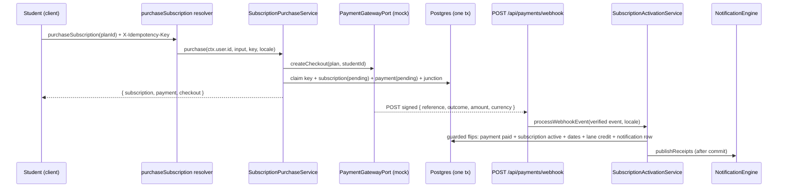

# Subscription Purchase & Payment Gateway Reference

**Domain:** Billing & Subscriptions
**Lifecycle Status:** Active

---

## 1. Overview & Architecture

The purchase flow converts the curated plan catalog into monetized subscriptions: a student
purchases a plan, the intent is recorded as a **pending subscription + pending payment pair** in the
immutable `student_payments` ledger, and a signature-verified gateway callback atomically activates
the subscription and credits the plan's balance lane.

Realtime delivery (WebSocket sidecar) is out of scope for this surface — the `Subscription` type
name is permanently reserved for the schema's subscription root, so the subscription entity ships on
the wire as **`StudentSubscription`**. Any future realtime root must use an explicit non-default name.



### Key invariants

1. **INV-PAY2 + amendment (ledger immutability):** payment records are append-only. The single
   permitted exception is the guarded `pending → paid | failed` status decision with every
   financial/identity column frozen (§6). Decided payments are terminal; corrections are
   compensating rows only; `DELETE` is always blocked.
2. **INV-PAY3 (activation gate):** a subscription is activated and its session balance credited only
   upon `paid`.
3. **INV-PAY6 (exactly-once activation):** exactly one `pending → paid` activation ever executes per
   subscription. The guarded `WHERE status = 'pending'` predicate IS the arbiter — a replayed
   callback matches zero rows and is acked as a replay (no double credit, no second notification).
4. **INV-PAY7 (quarantine):** a verified callback whose `amount`/`currency` disagrees with the
   stored ledger row (or whose ledger row is missing) mutates NOTHING — it is logged once with
   correlation ids only and acked `200 { processed: false }`.
5. **INV-PC1/INV-PC2 (catalog gate):** only active plans are purchasable; the active-state
   re-validation runs INSIDE the purchase transaction so a concurrent deactivation serializes behind
   the row lock. Deactivation never voids an already-paid activation.
6. **Fail-closed lane:** a plan row with a NULL `balance_lane` cannot be purchased
   (`PLAN_LANE_UNCONFIGURED`), and a NULL lane at activation QUARANTINES the delivery — nothing
   mutated, one correlated error log, acked `200 { processed: false }` (the lane-clear is
   reachable — an admin can clear a lane after the purchase commits; the lane is never guessed;
   INV-B2/INV-B5 require a lane to credit).

---

## 2. Gateway Port & Mock Provider

### Port contract (`backend/types/billing/payment-gateway.types.ts`)

```ts
export interface PaymentGatewayPort {
  createCheckout(input: PaymentCheckoutInput): Promise<PaymentCheckoutSession>;
  parseWebhookEvent(rawBody: string): PaymentWebhookEvent;
}

export interface PaymentCheckoutInput {
  readonly studentId: number;   // provider customer metadata
  readonly planId: number;      // plan identity metadata
  readonly amount: string;      // decimal string, verbatim from the plan row (money-as-string)
  readonly currency: string;
}

export interface PaymentCheckoutSession {
  readonly provider: PaymentGateway;
  readonly providerReference: string;  // mock adapter issues mock_<uuid-v4>
  readonly checkoutUrl: string | null; // nullable — server-side/mock providers have none
}

export interface PaymentWebhookEvent {
  readonly reference: string;
  readonly outcome: "confirmed" | "failed"; // literal union — verified-event vocabulary, not a pgEnum mirror
  readonly amount: string;
  readonly currency: string;
}
```

Money is a decimal **string** end-to-end (never a float, never arithmetic in the domain layer).

### Factory (`backend/services/billing/payment-gateway/payment-gateway.factory.ts`)

- `getPaymentGateway(locale?)` — lazy singleton keyed on the registered `PAYMENT_GATEWAY_PROVIDER`
  env key (default `mock`). Unknown providers fail closed with a localized
  `PAYMENT_GATEWAY_UNSUPPORTED` domain error.
- `resetPaymentGateway()` — drops the adapter singleton AND the shared env snapshot, so
  provider/secret/enabled swaps are observable without restart. This is the only valid test seam:
  mock the gateway through the factory/env, never by constructing `MockPaymentGatewayAdapter` in
  domain code.
- The gateway call runs **outside any transaction** — network never executes inside a DB tx.

### Mock adapter (`mock-payment-gateway.adapter.ts`)

- `createCheckout` is network-free and deterministic in shape: `{ provider: Mock,
  providerReference: "mock_<uuid-v4>", checkoutUrl: null }`. It never throws.
- `parseWebhookEvent` accepts ONLY `{ reference, outcome: "confirmed" | "failed", amount, currency }`
  as non-empty strings; extra payload members are dropped, anything missing/ill-typed/unknown raises
  `PAYMENT_WEBHOOK_MALFORMED` (route masks it to a 400 envelope).
- **Audit honesty (INV-PAY4):** mock payments persist `payment_gateway = mock` — never mapped to
  `other`, which would lose attribution in auditor queries.

### Swapping in a real gateway

Sprint 2 replaces the mock by implementing `PaymentGatewayPort` behind the same factory and env key.
Zero domain/service/route changes are expected: services and the route consume only the port types,
and the webhook security contract (§5) is enforced before the adapter parses anything. Adapter-layer
normalization decisions (e.g. uppercase-hex signatures) belong to the new adapter, not to this
contract.

---

## 3. Purchase Contract (`SubscriptionPurchaseService.purchase`)

```ts
purchase(studentUserId: number, input: PurchaseSubscriptionSubmitInput, idempotencyKey: string | null,
         locale: string, outerTx?: DBTransaction): Promise<PurchaseSubscriptionReturnType>
// PurchaseSubscriptionSubmitInput = { readonly planId: number }  — the ONLY client-supplied field (BOPLA)
// PurchaseSubscriptionReturnType = { subscription, payment, checkout }
```

### Fixed order

1. **Pre-DB boundary:** caller id + `input.planId` positive-safe-integer guard; actor-governance
   re-check via the shared suspension predicate; the idempotency key must be non-empty and ≤128
   chars and is carried **verbatim** (never trimmed, coerced, or logged). Missing key → `422
   VALIDATION` with zero writes.
2. **Checkout-time plan read (active-only)** feeds the gateway session; the provider receives the
   verbatim `amount`/`currency` from the authoritative plan row. This read is NOT the purchase
   gate — step 3 re-validates inside the transaction.
3. **One transaction** (SAVEPOINT on a supplied `outerTx` / top-level tx in production):
   active-state re-validation (`null` → `PLAN_NOT_FOUND`, whole tx rolls back) → price/currency
   re-comparison against the values the checkout was created with (mismatch → `422 VALIDATION`
   with the `PLAN_PRICE_CHANGED` field code on `planId`, thrown before any row write) →
   actor-governance re-assertion (a suspension during checkout rolls the pair back) → NULL-lane
   fail-closed guard → idempotency claim insert → `subscriptions` insert (`status = pending` DB
   default, `paymentMethod = checkout.provider`, `paymentReference = checkout.providerReference`) →
   `student_payments` insert (amount/currency **verbatim** from the plan row — no derivation, no
   client values) → `student_subscriptions` junction insert → claim backfill with the winning
   subscription id.
4. **ReturnType conversion:** raw `$inferSelect` rows are NOT assignable to the enum-typed
   `*ReturnType` shapes — rows are mapped through total-over-vocabulary mappers (spread + enum-member
   overrides), never casts.

### Idempotency & error channels

| Scenario | Result |
|---|---|
| Same caller replays a committed key | `ConflictError("DUPLICATE_REQUEST")` → 409; client maps it to a success-equivalent (the first purchase stands) |
| Foreign caller replays someone else's key | oracle-safe `NotFoundError("PAYMENT", …)` → 404 `PAYMENT_NOT_FOUND`, generic copy, no existence leak, zero writes |
| Mid-flow failure (FK, constraint) | whole tx rolls back; the claim rolls back with it — the same key is cleanly reusable on retry |
| Reference collision on insert | raw PG `23505` translated via the cause chain to `ConflictError` (`paymentReferenceConflict`) |
| Unknown / inactive / malformed plan id | `PLAN_NOT_FOUND` pre-DB (strict coercion), zero writes |
| Renewal | a fresh key purchases a NEW pending pair; existing subscriptions are never mutated at purchase time |

### Ownership reads

`listOwn(studentUserId)` is the only listing read — owner-scoped (`WHERE user_id = ?`, newest
first) with **no id-addressed read anywhere** on the service or repository (BOLA dead by
construction). The wire list is `[StudentSubscription!]!`.

---

## 4. Idempotency Tables & Structural Guards

| Mechanism | Table / index | Semantics |
|---|---|---|
| Purchase claim | `subscription_purchase_idempotency` — identity PK, `idempotency_key varchar(128)` UNIQUE, `user_id` (cascade), `subscription_id` (set-null), `created_at` | Claim insert lives in the SAME tx as the pair (fate-sharing). The claim OUTLIVES its subscription (`subscription_id` set-null on delete) so replays after deletion still surface duplicate semantics — never "clean up" claims when subscriptions are removed. |
| Pending-pair uniqueness | `subscriptions_payment_reference_unique` — partial unique index on `payment_reference` `WHERE payment_reference IS NOT NULL` | One gateway reference maps to at most one subscription; collisions surface as raw `23505` for service translation. |
| Activation arbiter | guarded UPDATE `WHERE id = ? AND status = 'pending'` | Zero rows = replay/no-op. No `processed_webhook_events` bookkeeping table — the subscription state machine IS the source of truth. |
| Decision arbiter | guarded UPDATE `WHERE subscription_id = ? AND status = 'pending'` on `student_payments` | Zero rows = replay or already-terminal. The DB trigger (§6) is the backstop for any non-conforming writer. |

The idempotency key rides the `X-Idempotency-Key` transport header (captured once in the GraphQL
context; absent header reaches the service as `null` and fails validation pre-DB). The key is
transport metadata only — reads never require it.

---

## 5. Webhook Security Contract (`app/api/payments/webhook/route.ts`)

POST-only surface in cron-route parity. Order of gates is fixed:

1. **Kill switch FIRST:** `PAYMENT_WEBHOOK_ENABLED` unset/not-"true" (parser trims) ⇒ **bare 404**
   (`new Response(null)`) — no envelope, no code, no request id, no existence oracle. The default is
   fail-closed: an unconfigured deployment exposes nothing.
2. **Bounded body:** the body is read EXACTLY ONCE via `request.text()` and capped at 64,000 UTF-8
   **bytes** (a multibyte body under 64,000 characters can still exceed the cap). Over-cap ⇒ masked
   `400 PAYMENT_WEBHOOK_BODY_TOO_LARGE`, payload never echoed.
3. **Signature gate (fail-closed):** missing/empty configured secret OR
   `verifyWebhookSignature(rawBody, "x-payment-signature" header, secret) === false` ⇒ ONE masked
   `401 UNAUTHORIZED`. A misconfigured deployment is intentionally indistinguishable from a forgery.
   The verifier (`webhook-signature.helpers.ts`) is pure over its three arguments: lowercase-hex
   HMAC-SHA256 over the byte-exact raw body, timing-safe compare (both sides hashed — no length
   leak), never throws, never logs, whitespace is never trimmed (signed material is verbatim;
   uppercase-hex re-encodings are denied). Empty-secret deployments reject every callback even though
   the getter reports `undefined` — treat `undefined` as "reject all".
4. **Parse gate:** `getPaymentGateway(locale).parseWebhookEvent(rawBody)` inside try/catch — malformed
   JSON or structural violations ⇒ masked `400 PAYMENT_WEBHOOK_MALFORMED`, zero reference echo.
5. **Service delegation:** `processWebhookEvent(event, locale)` (2-arg production call). Everything
   the service decides comes back as `200 { processed, replayed? }` — replays AND
   verified-but-uncorrelated/quarantined events ack 200 with `{ processed: false }`.
   **Settlement integrity beats liveness:** throwing a 4xx would trigger endless gateway retries
   against a terminal state; the service never throws for outcome content. Only true infrastructural
   failures reach the masked 500 envelope.
6. **Log hygiene:** no raw payload, no secret, no financial values in logs — correlation ids only
   (`reference`, `outcome`, `subscriptionId`, `paymentId`, request id).

**Deployment checklist:** `PAYMENT_WEBHOOK_ENABLED=true` and `PAYMENT_WEBHOOK_SECRET` must be
configured together (each alone fails closed); never ship the dev `true` value to production while
the mock provider is active.

---

## 6. Ledger Trigger Amendment (INV-PAY2 exception)

`prevent_student_payments_update()` (custom SQL, shipped as a guarded re-`CREATE OR REPLACE`) allows
an UPDATE **iff**:

- `OLD.status = 'pending'` **AND** `NEW.status IN ('paid', 'failed')`, **AND**
- every frozen financial/identity column is unchanged: `student_id`, `subscription_id`, `amount`,
  `currency`, `payment_gateway`, `created_at` (null-safe `IS NOT DISTINCT FROM` on PostgreSQL / `IS`
  on the SQLite parity trigger — a NULL→NULL swap is a no-op, any value swap is blocked).

Everything else raises `SQLSTATE P0001` with the verbatim message
`student_payments is immutable — UPDATE is permitted only to transition a pending payment to paid or
failed with all financial columns unchanged`. The DELETE guard is untouched. `pending → pending` is
blocked (a decision must change state), `paid`/`failed` rows are terminal, and lifecycle skips
(`pending → refunded`) are blocked.

Rules for future writers:

- The ONLY conforming writers are the repository's guarded decision writers (`markPaidOnce` /
  `markFailedOnce` — single UPDATEs touching `status` + `updated_at` only). Their `WHERE status =
  'pending'` predicate agrees 1:1 with the trigger's exception.
- Do NOT recreate the executing trigger in later migrations — replacing the function re-arms the
  guard. The SQLite parity file (`*-sqlite.sql`) must stay listed in the migration bundler's
  `EXCLUDED_FILES`.
- Any service that attempts a non-conforming write gets the raw trigger raise; translate it to a
  conflict through the error cause chain — the repository stays translation-free.

---

## 7. Guarded Activation & Lane Credit (`SubscriptionActivationService.processWebhookEvent`)

```ts
processWebhookEvent(event: PaymentWebhookEvent, locale: string, outerTx?: DBTransaction):
  Promise<{ processed: boolean; replayed?: boolean }>
```

The service receives an ALREADY-VERIFIED event (signature, size cap, and parsing belong to the
route). Fail-closed stages:

1. **Reference correlation:** `findByPaymentReference(event.reference)` — unknown reference ⇒
   `{ processed: false }` + one bounded `PAYMENT_REFERENCE_UNKNOWN` log, zero mutation.
2. **Settlement quarantine:** the ledger row for the correlated subscription must exist and agree
   with the event on `amount` AND `currency`. Any disagreement ⇒ `{ processed: false }` + one error
   log carrying correlation ids only, zero mutation (stored row stays source of truth).
3. **`confirmed` path — one transaction, fixed order:**
   path-selection read of the payment status (selection ONLY — the guarded updates re-verify every
   predicate server-side, so a stale read can never override a concurrent decision) → plan read
   IN-TX + NULL-lane QUARANTINE guard (a lane-clear is REACHABLE — an admin can clear a plan's lane
   after the purchase commits — so a NULL lane acks `{ processed: false }`, mutates nothing, and
   logs one correlated error; operator follow-up owns the settled charge until the lane is
   re-configured) → `activatePendingOnce` (zero rows ⇒ `{ processed: true, replayed:
   true }` — no credit, no second notification) → `markPaidOnce` → `creditLaneBalance(studentId,
   plan.balanceLane, plan.sessionCount, tx)` → confirmation notification row persisted in-tx →
   receipts published strictly AFTER the unit resolves (publish failure degrades to one structured
   log — it never rolls back settlement).
4. **`failed` path:** one guarded decision write; the subscription stays `pending` (no credit, no
   notification). A late `confirmed` after `failed` yields zero rows from the guard and acks
   `{ processed: false }` — reject-and-log, never a silent upgrade, never an error storm.

### Lane crediting rules

- The credit is a single relative UPDATE (`SET balance_<lane> = balance_<lane> + amount`) resolved
  through the frozen `CREDIT_LANE_BALANCE_COLUMNS` map (Hifz → `balance_hifz`, Tajweed →
  `balance_tajweed`, Reviews → `balance_reviews`) — exactly one column moves, sibling lanes untouched,
  CHECK floors still enforced.
- Crediting a NULL lane column is a no-op (inherited convention — no `COALESCE`); the service's
  NULL-lane quarantine ensures this case never carries financial weight (the delivery acks
  `{ processed: false }` before any credit runs).
- The activation emits are deliberately keyless: the `activatePendingOnce` zero-row arbiter already
  guarantees the credit and the notification run exactly once per subscription.

### Subscription window semantics

Activation stamps `startDate` (now) and `endDate` (exactly `intervalDays` later) plus
`paymentVerifiedAt`. A `pending` subscription is **pending-until-paid**: it carries NULL dates and
only transitions to `active` through the guarded settlement. Validity-window expiry (balance zeroing
at window end) is a separate lifecycle concern owned downstream.

---

## 8. GraphQL Surface

| Operation | Auth | Contract |
|---|---|---|
| `purchaseSubscription(input: PurchaseSubscriptionInput!)` | student-only (`$all { authenticated, role: [Student] }` conjunction — a plain role map would OR-scope) | `PurchaseSubscriptionPayload { subscription: StudentSubscription!, payment: StudentPayment!, checkout: PaymentCheckout! }`; replay throws 409 (never returns a row) |
| `mySubscriptions` (zero args) | student-only | `[StudentSubscription!]!`, strictly owner-scoped, newest first |

- Identity is server-bound (`ctx.user.id`); the input carries exactly `planId` (strict coercion —
  garbage ids fail `PLAN_NOT_FOUND` pre-DB).
- Anonymous callers get `401 UNAUTHORIZED`; every non-student role (parent/teacher/admin) gets `403
  FORBIDDEN` — there is no admin purchase surface by design.
- Entities expose no owner columns on the wire (`StudentSubscription` has no `userId`;
  `StudentPayment` has no `studentId`). Money fields are decimal strings; dates are ISO strings.
- `PaymentCheckout.checkoutUrl` is nullable (server-side/mock providers have none).

---

## 9. Operational Keys

| Key | Semantics |
|---|---|
| `PAYMENT_GATEWAY_PROVIDER` | Adapter registry key (trimmed, lowercased); default `mock`; unknown values fail closed |
| `PAYMENT_WEBHOOK_ENABLED` | Webhook kill switch; `"true"` (after trim) enables; unset ⇒ bare-404 posture |
| `PAYMENT_WEBHOOK_SECRET` | Shared HMAC secret; missing/empty while enabled ⇒ every callback 401s |

All three are registered in the typed env snapshot registry; `resetPaymentGateway()` /
`resetEnvironmentCache()` invalidate the cached values in-process.

---

## 10. Consumer Guidance

- **DEV1-007 (segregated crediting refinement / reviews-lane hold semantics):** the crediting
  primitive is `StudentRepository.creditLaneBalance` + the frozen `CREDIT_LANE_BALANCE_COLUMNS` map.
  The hold/debit vocabulary (`LANE_BALANCE_COLUMNS`, held-fee lane type) is a deliberate separate
  world — do not merge the two maps or smuggle the reviews lane into hold semantics. NULL-lane credit
  is a no-op by inherited convention; if NULL→0 seeding is ever wanted, that is a NEW explicit
  decision.
- **DEV1-008 (validity windows / expiry sweep):** activation stamps the window (`endDate − startDate
  === intervalDays` exactly) and `paymentVerifiedAt`. The expiry job owns balance zeroing and status
  transitions at window end; purchases never mutate existing subscriptions (renewal = a new pending
  pair), so overlapping windows resolve at expiry time, not purchase time.
- **DEV1-009 (admin subscription management / ledger follow-up):** reads beyond `mySubscriptions`
  are deliberately absent (BOLA minimization) — add admin reads as new owner-scoped surfaces, never
  by widening the existing ones. Stuck `pending` pairs (e.g. zero-price purchases confirmed
  neutrally by the mock) and `failed` payments with `pending` subscriptions are the operator
  follow-up backlog; the ledger trigger means fixes are compensating rows or guarded transitions,
  never edits.
- **DEV2-005 (teacher verification purchase):** verification-plan purchase rides this exact flow —
  no special-casing. The verification plan is looked up from the catalog (active-only; title
  `"New Teacher Verification & Evaluation Plan"`, `reviews` lane) and the confirmed callback credits
  the reviews lane like any other plan.

### Testing notes (binding for any suite touching this surface)

- The payment ledger is append-only: committed purchase pairs cannot be deleted normally. Teardown
  must delete `student_payments` FIRST under the sanctioned immutability-trigger suspension, then the
  junction, then claims (before subscriptions — no set-null write fires), then subscriptions; unique
  per-run fixture prefixes keep any mid-crash residue greppable.
- True-concurrency chaos tests (parallel double-submit / double-callback) require a multi-connection
  Postgres; on the single-connection local provider the serialized same-key/same-reference variants
  carry the invariants, and the guarded predicates make the replay branch deterministic.
- GraphQL suites must run the schema in-process (canonical `graphQLSchema` + context factory) —
  never spawn the live-server harness against a shared single-writer database directory.

---

## 11. Anti-Patterns (what NOT to do)

- Never read-then-write for any settlement decision — the guarded `WHERE status = 'pending'`
  predicate IS the lock; pre-reads select paths only.
- Never construct adapters directly; always resolve through the factory.
- Never accept client-supplied amounts, currencies, or payment metadata — the plan row is the only
  source of financial truth (BOPLA).
- Never log raw payloads, secrets, or financial values on the webhook path.
- Never hard-fail (4xx) a verified callback to "retry later" — quarantines and replays ack 200 with
  `{ processed: false }`; gateways retry forever against terminal states.
- Never map the mock gateway to the `other` ledger member.
- Never delete or edit decided ledger rows — the trigger will raise, and the audit history is the
  point.
- Never trim, normalize, or log the idempotency key; it is an opaque byte-exact claim.
