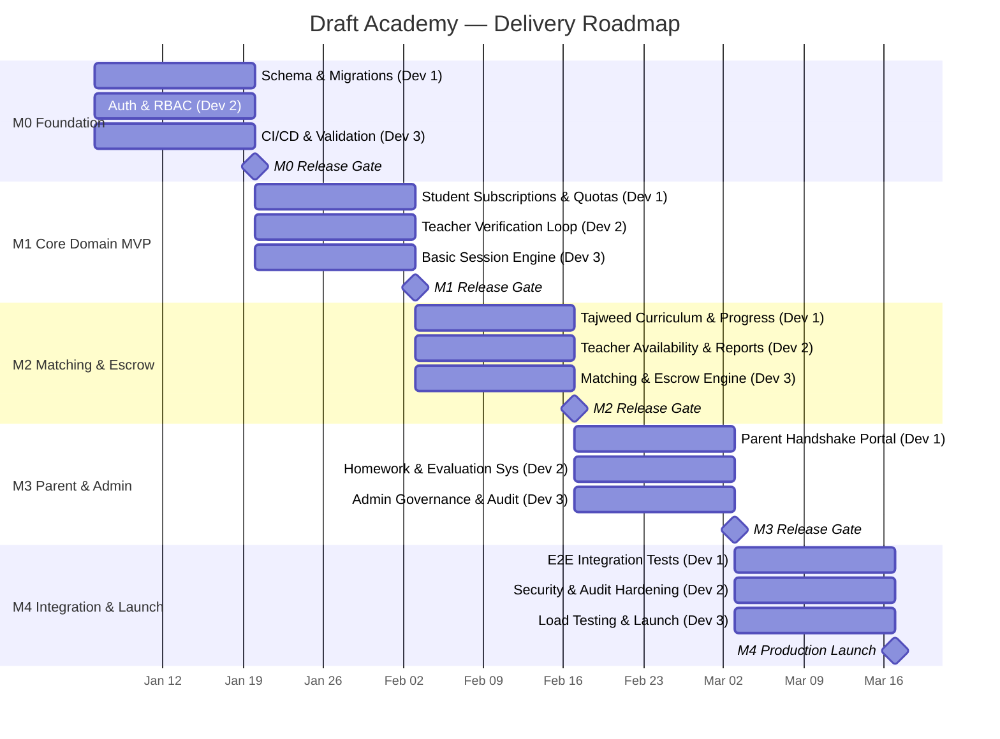

# Draft Academy — Delivery Roadmap

> **Source of truth:** `docs/specs/`, `db/schema.dbml`, `docs/scenarios/user-story-map.md`
> **Related:** `docs/planning/SPRINT_PLAN.md`, `docs/planning/TEAM_ALLOCATION.md`, `docs/planning/TICKETS.md`

---

## Overview

Draft Academy is delivered across **5 milestones** (M0–M4) spanning **5 two-week sprints** (Sprint 0–4). Three vertical developer streams work in parallel, each owning a complete tracer-bullet slice through every layer (schema, API, UI, tests).

| Milestone | Sprint | Duration | Theme |
|---|---|---|---|
| **M0 — Foundation** | Sprint 0 | Weeks 1–2 | Shared schemas, auth, role contracts, CI/CD, validation suite |
| **M1 — Core Domain MVP** | Sprint 1 | Weeks 3–4 | Student quotas, teacher verification loop, basic session engine |
| **M2 — Matching & Escrow** | Sprint 2 | Weeks 5–6 | Smart matching, real-time notifications, dual-confirmation financial escrow |
| **M3 — Parent & Admin Governance** | Sprint 3 | Weeks 7–8 | Parent handshake portal, super admin control room, advanced governance |
| **M4 — Integration & Launch** | Sprint 4 | Weeks 9–10 | End-to-end integration, security & audit hardening, load testing, production launch |

---

## Milestone Details

### M0 — Foundation (Sprint 0, Weeks 1–2)

**Goal:** Establish the shared infrastructure, database schema, authentication, role-based access control, CI/CD pipeline, and validation suite that all three streams depend on.

**Scope:**
- Database schema migration from `db/schema.dbml` (all 22 tables, 13 enums)
- User registration with role-specific child table creation (admin, teacher, students, parents, applicants)
- JWT-based authentication with role-based authorization middleware
- CI/CD pipeline with automated DBML and Mermaid validation
- Shared types, interfaces, and cross-stream contracts

**Release Gate:** All three streams can register users, authenticate, and access role-specific endpoints. Schema validates clean. CI/CD green.
Delivered checks (DEV3-001): the CI/CD-green criterion above is enforced by seven required status checks — `workflow-sanity`, `quality`, `dbml-validation`, `docs-validation`, `tests-db`, `tests-services`, `tests-ui` — specified in `docs/quality/ci-pipeline.md`.

**Key Decisions Incorporated:** A.1 (parents table), A.7 (governance fields on users), C.1 (parent role in enum), B.6/B.7 (applicants table, teacher record after verification)

---

### M1 — Core Domain MVP (Sprint 1, Weeks 3–4)

**Goal:** Deliver the core domain vertical slices: student subscription & quota management, teacher verification evaluation loop, and basic session lifecycle.

**Scope:**
- Plan catalog CRUD (admin), subscription purchase, segregated session balance crediting
- Free trial session provisioning for new students
- Teacher applicant registration, verification plan purchase, 5-session evaluation loop
- Evaluation rubric scoring with ≥80% pass threshold (B.1)
- Cooldown state machine (1-month Tajweed, 3-month Hifz)
- Basic session lifecycle: scheduled → started → completed/cancelled
- Session report submission with homework assignment (Jadid & Madi)
- Surah/Juz enum-based homework tracking (B.11)

**Release Gate:** A student can subscribe to a plan, receive session credits, and book a session with a certified teacher. A teacher applicant can complete the 5-session evaluation loop and be certified or enter cooldown.

**Key Decisions Incorporated:** B.1 (80% threshold), B.5 (re-eval paid by teacher), B.6/B.7 (applicants lifecycle), B.11 (Surah/Juz enum), A.8 (session_type), A.10 (session_intent), C.3 (evaluated_id/evaluator_id), C.4 (reports.teacher_id removed), C.5 (recitation 1:1 session)

---

### M2 — Matching, Notifications & Escrow (Sprint 2, Weeks 5–6)

**Goal:** Deliver the on-demand matching engine, real-time notification system, and dual-confirmation financial escrow.

**Scope:**
- On-demand teacher discovery with filter/sort pipeline (Qira'ah, subject, country, language, rating)
- Teacher availability toggle with 15-minute inactivity timeout (B.15)
- In-session locking (teacher hidden from directory during active session)
- Configurable request handling per teacher (queue/reject/offer alternatives) (B.16)
- Real-time notification engine (session requests, completions, cancellations, broadcasts)
- Dual-confirmation completion handshake with 24-hour timeout (B.2)
- Fee escrow: hold at request, decrement at completion, release on cancellation (B.3, B.4)
- Teacher wallet crediting (earning transactions) and withdrawal workflow
- Dispute resolution with admin arbitration (B.18)

**Release Gate:** A student can browse available teachers, request a session, and complete the dual-confirmation escrow flow. Notifications fire in real-time. Held funds are released on cancellation.

**Key Decisions Incorporated:** B.2 (24h timeout), B.3 (platform-set fees), B.4 (escrow hold-at-request), B.10 (on-demand model), B.15 (15-min inactivity), B.16 (configurable request handling), B.18 (dispute resolution), A.4 (notifications table), A.6 (teacher.subjects)

---

### M3 — Parent Portal & Admin Governance (Sprint 3, Weeks 7–8)

**Goal:** Deliver the parent supervision portal with handshake linking and the super admin control room with full governance capabilities.

**Scope:**
- Student handshake code generation (A.3)
- Parent-child link request workflow with 7-day expiry (B.14)
- Student confirmation of parent link (one parent per student, B.12; parent links multiple children, B.13)
- Read-only parent monitoring portal (sessions, reports, homework, evaluations, progress)
- Parent session completion notifications
- Super admin CRUD over all entities
- Cold-start bootstrapping (direct sheikh certification without evaluation)
- Direct student onboarding with offline payment (cash/transfer/scholarship) (B.9)
- Account soft-delete governance (users.is_deleted)
- Admin override of evaluation results
- Immutable audit logging (audit_logs) for all admin actions
- Admin subscription management (extend, renew, cancel, upgrade/downgrade with proration) (B.17)
- Admin financial auditing (payments, wallet transactions, withdrawal approval)
- Admin session governance (view, filter, reschedule, cancel, reassign, join live)
- Platform analytics dashboard
- Broadcast notifications

**Release Gate:** A parent can link to their child via handshake code and monitor their progress. An admin can perform all governance operations with full audit logging.

**Key Decisions Incorporated:** A.2 (parent_id FK), A.3 (handshake_code), A.5 (audit_logs), B.9 (offline payment), B.12 (one parent per student), B.13 (parent multiple children), B.14 (7-day link expiry), B.17 (prorated plan changes), B.18 (admin arbitration)

---

### M4 — Integration, Security & Launch (Sprint 4, Weeks 9–10)

**Goal:** Harden the platform for production: end-to-end integration, security audit, financial safety verification, load testing, and launch.

**Scope:**
- End-to-end integration testing across all 3 streams
- Security hardening (authentication, authorization, input validation, SQL injection prevention)
- Financial safety verification (double-spend prevention, escrow integrity, immutability checks)
- Audit trail completeness verification
- Real-time reliability testing (presence heartbeat, graceful disconnection recovery, in-session concurrency locking)
- Load testing and performance optimization
- Disaster recovery and backup verification
- Production launch checklist execution

**Release Gate:** All production readiness criteria met (see `docs/planning/PRODUCTION_READINESS.md`). Platform is ready for real Shuyukh and students.

**Key Decisions Incorporated:** All 33 decisions validated in production context. Final verification of all schema constraints, state machine invariants, and business rules.

---

## Gantt Chart



---

## Critical Path

The critical path runs through the sequence of milestones that have zero slack — any delay directly delays the production launch:

```
M0 (Foundation) → M1 (Core Domain MVP) → M2 (Matching & Escrow) → M3 (Parent & Admin) → M4 (Launch)
```

**Critical path dependencies:**
1. **M0 → M1:** All streams depend on shared schema, auth, and CI/CD from M0.
2. **M1 → M2:** Matching engine requires the basic session engine from M1. Escrow requires session lifecycle.
3. **M2 → M3:** Parent notifications require the notification engine from M2. Admin financial auditing requires the escrow and wallet system.
4. **M3 → M4:** Integration testing requires all features from M1–M3. Security hardening requires the complete audit logging system from M3.

**Cross-stream critical dependencies:**
- Dev 3's Matching Engine (M2) depends on Dev 2's Teacher Availability toggle (M1/M2)
- Dev 3's Escrow Engine (M2) depends on Dev 1's Session Balance system (M1)
- Dev 1's Parent Portal (M3) depends on Dev 3's Notification Engine (M2)
- Dev 3's Admin Governance (M3) depends on Dev 2's Evaluation System (M1/M3)

---

## Release Gates

Each milestone has a release gate that must be passed before the next milestone begins:

| Gate | Criteria | Verification |
|---|---|---|
| **M0 Gate** | Schema validates, auth works, CI/CD green, all 3 streams can register users | `bun validate:dbml` passes; all role-based endpoints return correct data |
| **M1 Gate** | Student can subscribe & book; applicant can complete evaluation loop; session lifecycle works | End-to-end demo of student subscription → session booking; teacher verification → certification |
| **M2 Gate** | Student can browse, request, and complete session with escrow; notifications fire in real-time | End-to-end demo of matching → session → dual-confirmation → wallet credit; notification delivery verified |
| **M3 Gate** | Parent can link & monitor child; admin can perform all governance operations with audit logging | End-to-end demo of parent handshake → monitoring; admin CRUD → audit log verification |
| **M4 Gate** | All production readiness criteria met | `docs/planning/PRODUCTION_READINESS.md` checklist fully signed off |

---

## Risk Register

| Risk | Probability | Impact | Mitigation |
|---|---|---|---|
| Cross-stream interface contract mismatch | Medium | High | Define contracts in M0; integration tests in every sprint |
| Escrow financial calculation edge cases | Medium | Critical | Comprehensive test scenarios in M2; financial immutability tests |
| Real-time notification delivery reliability | Medium | High | WebSocket fallback to polling; retry queue in M2 |
| Teacher availability race conditions | Low | High | In-session locking with database-level constraints |
| Parent handshake code collision | Low | Medium | Unique constraint + retry generation logic |
| Schema migration conflicts between streams | Medium | Medium | Single migration owner; merge conflicts resolved in CI |
| Load testing reveals performance bottlenecks | Medium | Medium | Early performance profiling in M2; index optimization in M0 |

---

## Decision Traceability

All 33 resolved decisions from `docs/specs/open-decisions-and-gaps.md` are incorporated across the milestones:

| Decision Category | Count | Primary Milestone(s) |
|---|---|---|
| Schema Gaps (A.1–A.10) | 10 | M0 (schema), M1 (session types), M3 (parent linking, audit logs) |
| Business Rules (B.1–B.18) | 18 | M1 (eval threshold, cooldown), M2 (escrow, matching, notifications), M3 (parent, admin, proration) |
| Cross-Cutting (C.1–C.5) | 5 | M0 (roles, subscriptions), M1 (evaluations, reports, recitation) |
| **Total** | **33** | **All incorporated** |
