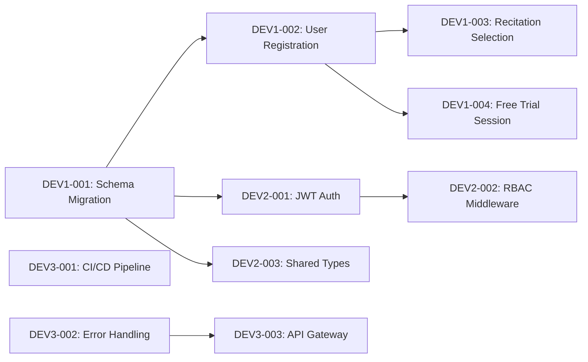
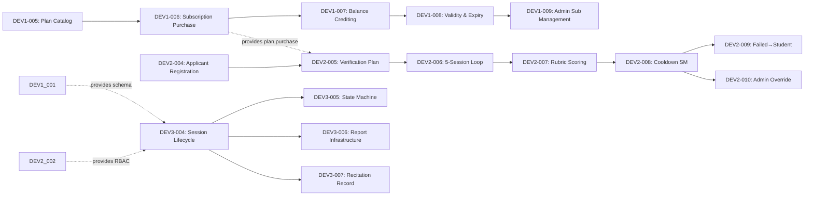
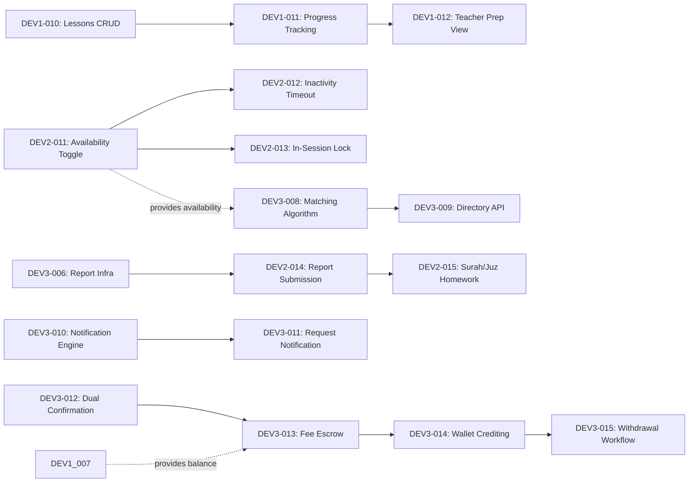
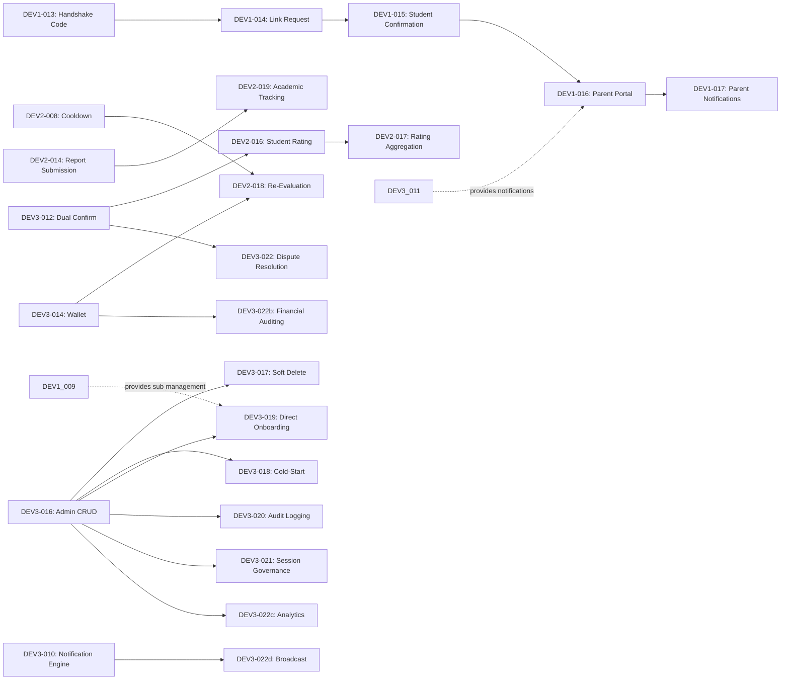
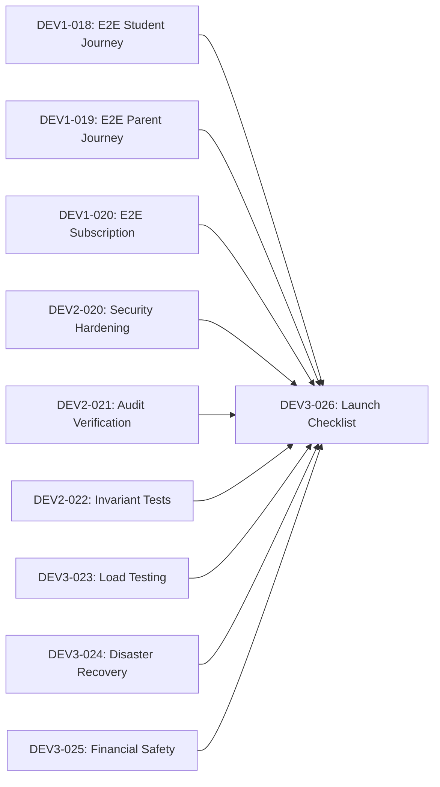

# Draft Academy — Sprint Plan

> **Source of truth:** `docs/planning/ROADMAP.md`, `docs/planning/TICKETS.md`, `docs/specs/`
> **Cadence:** 2-week sprints, 5 sprints (Sprint 0–4), 10 weeks total

---

## Capacity Model

| Parameter | Value |
|---|---|
| Developers | 3 |
| Sprint length | 2 weeks (10 working days) |
| Focus factor | 80% (accounting for meetings, reviews, context switching) |
| Capacity per developer per sprint | 8 story points |
| Team capacity per sprint | 24 story points |
| Sprint ceremony time | 4 hours total (planning, review, retrospective, daily standups) |

---

## Sprint 0 — Foundation (Weeks 1–2)

**Milestone:** M0 — Foundation
**Goal:** Establish shared infrastructure, database schema, authentication, role-based access control, CI/CD pipeline, and validation suite.

### Sprint Backlog

| Ticket ID | Title | Owner | SP | Blocked By |
|---|---|---|---|---|
| DEV1-001 | Database schema migration | Dev 1 | 5 | — |
| DEV1-002 | User registration with role-specific child table creation | Dev 1 | 5 | DEV1-001 |
| DEV1-003 | Recitation selection on registration | Dev 1 | 2 | DEV1-002 |
| DEV1-004 | Free trial session provisioning | Dev 1 | 3 | DEV1-002 |
| DEV2-001 | JWT authentication service | Dev 2 | 5 | DEV1-001 |
| DEV2-002 | Role-based authorization middleware | Dev 2 | 3 | DEV2-001 |
| DEV2-003 | Shared types & interface contracts | Dev 2 | 3 | DEV1-001 |
| DEV3-001 | CI/CD pipeline with Mermaid validation | Dev 3 | 5 | — |
| DEV3-002 | Shared error handling & response contracts | Dev 3 | 3 | — |
| DEV3-003 | API gateway & routing skeleton | Dev 3 | 3 | DEV3-002 |

**Total story points:** 37 (adjusted: 24 with parallelization — see capacity note below)

> **Capacity note:** With 3 developers working in parallel, the effective sprint capacity is 24 SP (8 per developer). The 37 SP backlog is achievable because many tickets overlap in parallel streams. Dev 1 carries the heaviest load (15 SP) due to schema ownership being on the critical path; Dev 2 and Dev 3 carry lighter loads (11 SP and 11 SP) with buffer for cross-stream support.

### Definition of Done (Sprint 0)

- [ ] Database schema migrated into `backend/db/schema/` and type-checks
- [ ] User registration works for all 4 roles (admin, teacher, student, parent)
- [ ] Role-specific child tables created on registration (admin, teacher, students, parents, applicants)
- [ ] JWT authentication issues and validates tokens
- [ ] RBAC middleware enforces role-based access
- [ ] CI/CD pipeline runs on every PR with Mermaid validation
- [ ] API gateway routes to health-check endpoints
- [ ] Shared types and interface contracts documented and committed
- [ ] All tests passing (unit + integration)
- [ ] Code reviewed and merged to `develop`

### Sprint Dependencies

### Risks

| Risk | Mitigation |
|---|---|
| Schema migration issues on target database | Test migration on staging first; have rollback script ready |
| Auth token format disagreement between streams | Define token contract in DEV2-003 before implementation |
| CI/CD pipeline setup delays | Dev 3 starts CI/CD on day 1; manual validation as fallback |

---

## Sprint 1 — Core Domain MVP (Weeks 3–4)

**Milestone:** M1 — Core Domain MVP
**Goal:** Deliver student subscription & quota management, teacher verification evaluation loop, and basic session lifecycle.

### Sprint Backlog

| Ticket ID | Title | Owner | SP | Blocked By |
|---|---|---|---|---|
| DEV1-005 | Plan catalog CRUD (admin) | Dev 1 | 3 | DEV1-002 |
| DEV1-006 | Subscription purchase via payment gateway | Dev 1 | 5 | DEV1-005 |
| DEV1-007 | Segregated session balance crediting | Dev 1 | 5 | DEV1-006 |
| DEV1-008 | Subscription validity window & expiry | Dev 1 | 3 | DEV1-007 |
| DEV1-009 | Admin subscription management (extend/renew/cancel) | Dev 1 | 5 | DEV1-008 |
| DEV2-004 | Teacher applicant registration & applicants table | Dev 2 | 3 | DEV2-002 |
| DEV2-005 | Verification plan purchase (5 sessions) | Dev 2 | 3 | DEV2-004, DEV1-006 |
| DEV2-006 | 5-session evaluation loop booking | Dev 2 | 5 | DEV2-005 |
| DEV2-007 | Evaluation rubric scoring (≥80% threshold) | Dev 2 | 5 | DEV2-006 |
| DEV2-008 | Cooldown state machine (1mo Tajweed / 3mo Hifz) | Dev 2 | 5 | DEV2-007 |
| DEV2-009 | Failed applicant → students record conversion | Dev 2 | 3 | DEV2-008 |
| DEV2-010 | Admin override of evaluation results | Dev 2 | 3 | DEV2-008 |
| DEV3-004 | Session creation & lifecycle (scheduled→started→completed/cancelled) | Dev 3 | 5 | DEV1-001, DEV2-002 |
| DEV3-005 | Session status state machine enforcement | Dev 3 | 3 | DEV3-004 |
| DEV3-006 | Session report & homework infrastructure | Dev 3 | 5 | DEV3-004 |
| DEV3-007 | Recitation record per session (1:1) | Dev 3 | 2 | DEV3-004 |

**Total story points:** 64 (distributed across 3 developers: Dev 1 = 21 SP, Dev 2 = 27 SP, Dev 3 = 15 SP)

> **Capacity note:** This is a heavy sprint. Dev 2 carries 27 SP (above 8 SP capacity) because the evaluation loop is a deep vertical slice. To manage, Dev 2's tickets are sequenced so that DEV2-004 through DEV2-007 form a continuous chain, and DEV2-008 through DEV2-010 can spill into Sprint 2 if needed. The sprint goal is met when the evaluation loop is demoable end-to-end.

### Definition of Done (Sprint 1)

- [ ] Admin can create, edit, activate, and deactivate plans
- [ ] Student can purchase a plan and receive session credits to the correct segregated balance
- [ ] Subscription validity window is set and unused sessions expire at end of interval
- [ ] Admin can extend, renew, or cancel subscriptions
- [ ] Teacher applicant can register and purchase verification plan
- [ ] Applicant can book 5 evaluation sessions with 5 distinct certified Shuyukh
- [ ] Evaluation rubric scoring works with ≥80% pass threshold
- [ ] Cooldown state machine correctly assigns 1-month (Tajweed) or 3-month (Hifz) cooldowns
- [ ] Failed applicants are converted to student records
- [ ] Admin can override evaluation results (certify, reject, grant re-evaluation)
- [ ] Session lifecycle works: scheduled → started → completed/cancelled
- [ ] Session state machine invariants are enforced
- [ ] Session reports and homework can be submitted
- [ ] Recitation record is created per session (1:1)
- [ ] All tests passing (unit + integration)
- [ ] Code reviewed and merged to `develop`

### Sprint Dependencies

### Risks

| Risk | Mitigation |
|---|---|
| Evaluation loop is complex (5 sessions, 5 distinct evaluators) | Start early; use mock evaluators for testing |
| Payment gateway integration delays | Mock payment service for development; integrate real gateway in Sprint 2 |
| Session lifecycle state machine edge cases | Comprehensive state transition tests based on `state-machine-invariants.md` |

---

## Sprint 2 — Matching, Notifications & Escrow (Weeks 5–6)

**Milestone:** M2 — Matching, Notifications & Escrow
**Goal:** Deliver on-demand matching engine, real-time notification system, and dual-confirmation financial escrow.

### Sprint Backlog

| Ticket ID | Title | Owner | SP | Blocked By |
|---|---|---|---|---|
| DEV1-010 | Tajweed curriculum lessons CRUD | Dev 1 | 3 | DEV1-008 |
| DEV1-011 | Student progress tracking & increment | Dev 1 | 5 | DEV1-010 |
| DEV1-012 | Teacher preparation view (student progress before session) | Dev 1 | 3 | DEV1-011 |
| DEV2-011 | Teacher availability toggle (Available/Unavailable) | Dev 2 | 3 | DEV2-008 |
| DEV2-012 | 15-minute inactivity auto-offline | Dev 2 | 5 | DEV2-011 |
| DEV2-013 | In-session locking (hide from directory) | Dev 2 | 3 | DEV2-011 |
| DEV2-014 | Session report submission with homework (Jadid & Madi) | Dev 2 | 5 | DEV3-006 |
| DEV2-015 | Surah/Juz enum homework tracking | Dev 2 | 3 | DEV2-014 |
| DEV3-008 | On-demand matching algorithm (filter/sort pipeline) | Dev 3 | 8 | DEV2-011, DEV3-004 |
| DEV3-009 | Teacher directory browse & filter API | Dev 3 | 5 | DEV3-008 |
| DEV3-010 | Real-time notification engine (WebSocket) | Dev 3 | 8 | DEV3-003 |
| DEV3-011 | Session request notification to teacher | Dev 3 | 3 | DEV3-010 |
| DEV3-012 | Dual-confirmation completion handshake (24h timeout) | Dev 3 | 5 | DEV3-004 |
| DEV3-013 | Fee escrow: hold at request, decrement at completion | Dev 3 | 5 | DEV3-012, DEV1-007 |
| DEV3-014 | Teacher wallet crediting (earning transactions) | Dev 3 | 5 | DEV3-013 |
| DEV3-015 | Teacher withdrawal workflow & admin approval | Dev 3 | 5 | DEV3-014 |

**Total story points:** 75 (Dev 1 = 11 SP, Dev 2 = 19 SP, Dev 3 = 39 SP)

> **Capacity note:** Dev 3 carries the heaviest load (39 SP) due to the matching engine, notification engine, and escrow all landing in this sprint. This is intentional — these are the critical-path items for M2. Dev 3 should prioritize DEV3-008 (matching) and DEV3-012/013 (escrow) first, with DEV3-010 (notifications) as parallel work. If needed, DEV3-015 (withdrawal) can spill into Sprint 3.

### Definition of Done (Sprint 2)

- [ ] Tajweed curriculum lessons can be created and tracked
- [ ] Student progress is incremented on session completion
- [ ] Teachers can view student progress before accepting sessions
- [ ] Teachers can toggle availability between Available/Unavailable
- [ ] Teachers auto-set to Unavailable after 15 minutes of inactivity
- [ ] In-session teachers are hidden from the directory
- [ ] Teachers can submit session reports with homework (Jadid & Madi)
- [ ] Homework tracks Surah/Juz using the enum
- [ ] Matching algorithm filters by Qira'ah, subject, country, language, and sorts by rating
- [ ] Students can browse the teacher directory with filters
- [ ] Real-time notifications fire for session requests
- [ ] Dual-confirmation handshake works with 24-hour timeout
- [ ] Fee escrow holds at request, decrements at completion, releases on cancellation
- [ ] Teacher wallet is credited with earning transactions on dual confirmation
- [ ] Teacher withdrawal workflow with admin approval/rejection works
- [ ] All tests passing (unit + integration)
- [ ] Code reviewed and merged to `develop`

### Sprint Dependencies

### Risks

| Risk | Mitigation |
|---|---|
| WebSocket reliability for real-time notifications | Implement polling fallback; retry queue |
| Escrow financial calculation edge cases | Comprehensive financial test scenarios; immutability tests |
| Matching algorithm performance with many teachers | Add database indexes on teacher fields; pagination |
| In-session locking race conditions | Database-level constraints; atomic updates |

---

## Sprint 3 — Parent Portal & Admin Governance (Weeks 7–8)

**Milestone:** M3 — Parent Portal & Admin Governance
**Goal:** Deliver parent supervision portal with handshake linking and super admin control room with full governance capabilities.

### Sprint Backlog

| Ticket ID | Title | Owner | SP | Blocked By |
|---|---|---|---|---|
| DEV1-013 | Student handshake code generation | Dev 1 | 2 | DEV1-002 |
| DEV1-014 | Parent-child link request workflow (7-day expiry) | Dev 1 | 5 | DEV1-013 |
| DEV1-015 | Student confirmation of parent link | Dev 1 | 3 | DEV1-014 |
| DEV1-016 | Parent read-only monitoring portal | Dev 1 | 8 | DEV1-015, DEV3-011 |
| DEV1-017 | Parent session completion notification display | Dev 1 | 3 | DEV1-016, DEV3-010 |
| DEV2-016 | Student evaluation submission (teacher rating) | Dev 2 | 3 | DEV3-012 |
| DEV2-017 | Teacher average_rating aggregation & update | Dev 2 | 3 | DEV2-016 |
| DEV2-018 | Admin-ordered re-evaluation (teacher wallet deduction) | Dev 2 | 5 | DEV2-008, DEV3-014 |
| DEV2-019 | Admin academic tracking (memorization & revision milestones) | Dev 2 | 3 | DEV2-014 |
| DEV3-016 | Admin CRUD: users, teachers, students, parents | Dev 3 | 5 | DEV2-002 |
| DEV3-017 | Account soft-delete governance (users.is_deleted) | Dev 3 | 3 | DEV3-016 |
| DEV3-018 | Cold-start bootstrapping (direct sheikh certification) | Dev 3 | 3 | DEV3-016 |
| DEV3-019 | Direct student onboarding with offline payment | Dev 3 | 5 | DEV3-016, DEV1-009 |
| DEV3-020 | Immutable audit logging for all admin actions | Dev 3 | 5 | DEV3-016 |
| DEV3-021 | Admin session governance (view/filter/reschedule/cancel/reassign/join) | Dev 3 | 5 | DEV3-004 |
| DEV3-022 | Dispute resolution with admin arbitration | Dev 3 | 5 | DEV3-012 |
| DEV3-022b | Admin financial auditing (payments, wallets, withdrawal approval) | Dev 3 | 5 | DEV3-014 |
| DEV3-022c | Platform analytics dashboard | Dev 3 | 5 | DEV3-016 |
| DEV3-022d | Broadcast notifications (system-wide & targeted) | Dev 3 | 3 | DEV3-010 |

**Total story points:** 82 (Dev 1 = 21 SP, Dev 2 = 14 SP, Dev 3 = 39 SP)

> **Capacity note:** Dev 3 again carries the heaviest load (39 SP) due to the breadth of admin governance features. Priority order: DEV3-016 (CRUD) → DEV3-020 (audit logs) → DEV3-018 (cold-start) → DEV3-019 (direct onboarding) → DEV3-021 (session governance) → DEV3-022 (disputes) → DEV3-022b/c/d (financial auditing, analytics, broadcasts). DEV3-022c and DEV3-022d can spill into Sprint 4 if needed.

### Definition of Done (Sprint 3)

- [ ] Each student is assigned a unique handshake code on creation
- [ ] Parents can search for children by handshake code and send link requests
- [ ] Link requests expire after 7 days if not confirmed
- [ ] Students can explicitly confirm or reject parent link requests
- [ ] One parent per student (enforced); parent can link to multiple children
- [ ] Parent portal shows read-only view of child's sessions, reports, homework, evaluations, progress
- [ ] Parents receive session completion notifications for linked children
- [ ] Students can submit teacher ratings after completed sessions
- [ ] Teacher average_rating is updated based on student evaluations
- [ ] Admin can order re-evaluation (cost deducted from teacher wallet)
- [ ] Admin can monitor student memorization and revision milestones
- [ ] Admin has full CRUD over all entities (users, teachers, students, parents)
- [ ] Admin can soft-delete accounts (users.is_deleted = true)
- [ ] Admin can directly certify foundational Shuyukh (cold-start bootstrapping)
- [ ] Admin can directly onboard students with offline payment (cash/transfer/scholarship)
- [ ] All admin actions are logged in immutable audit_logs
- [ ] Admin can view, filter, reschedule, cancel, reassign, and join live sessions
- [ ] Disputes can be raised and admin can arbitrate (refund, partial refund, uphold)
- [ ] Admin can audit all student payments and teacher wallet transactions
- [ ] Admin can approve/reject withdrawal requests
- [ ] Admin can issue manual wallet adjustments with audit logging
- [ ] Platform analytics dashboard shows real-time statistics
- [ ] Admin can broadcast system-wide and targeted notifications
- [ ] All tests passing (unit + integration)
- [ ] Code reviewed and merged to `develop`

### Sprint Dependencies

### Risks

| Risk | Mitigation |
|---|---|
| Admin governance scope is very broad | Prioritize CRUD + audit logs first; defer analytics to Sprint 4 if needed |
| Parent portal data aggregation complexity | Use existing session/report APIs; read-only access simplifies permissions |
| Dispute resolution edge cases | Define clear arbitration rules; test with multiple dispute scenarios |

---

## Sprint 4 — Integration, Security & Launch (Weeks 9–10)

**Milestone:** M4 — Integration, Security & Launch
**Goal:** Harden the platform for production: end-to-end integration, security audit, financial safety verification, load testing, and launch.

### Sprint Backlog

| Ticket ID | Title | Owner | SP | Blocked By |
|---|---|---|---|---|
| DEV1-018 | End-to-end integration tests: student journey | Dev 1 | 5 | All Sprint 1–3 tickets |
| DEV1-019 | End-to-end integration tests: parent journey | Dev 1 | 5 | DEV1-016, DEV1-017 |
| DEV1-020 | End-to-end integration tests: subscription lifecycle | Dev 1 | 3 | DEV1-009 |
| DEV2-020 | Security hardening: input validation & SQL injection prevention | Dev 2 | 5 | All Sprint 1–3 tickets |
| DEV2-021 | Audit trail completeness verification | Dev 2 | 3 | DEV3-020 |
| DEV2-022 | State machine invariant verification tests | Dev 2 | 5 | All Sprint 1–3 tickets |
| DEV3-023 | Load testing & performance optimization | Dev 3 | 8 | All Sprint 1–3 tickets |
| DEV3-024 | Disaster recovery & backup verification | Dev 3 | 5 | — |
| DEV3-025 | Financial safety verification (double-spend, escrow integrity) | Dev 3 | 5 | DEV3-013, DEV3-014 |
| DEV3-026 | Production launch checklist execution | Dev 3 | 5 | All Sprint 4 tickets |

**Total story points:** 49 (Dev 1 = 13 SP, Dev 2 = 13 SP, Dev 3 = 23 SP)

### Definition of Done (Sprint 4)

- [ ] End-to-end integration tests cover: student registration → subscription → session → completion → parent notification
- [ ] End-to-end integration tests cover: teacher applicant → verification → certification → teaching → wallet credit
- [ ] End-to-end integration tests cover: admin → cold-start → direct onboarding → audit log verification
- [ ] All input validation and SQL injection prevention in place
- [ ] All state machine invariants verified by automated tests
- [ ] Audit trail is complete for all admin actions
- [ ] Load testing passes with target concurrency (100+ concurrent sessions)
- [ ] Database queries are optimized (indexes verified, N+1 queries eliminated)
- [ ] Disaster recovery plan documented and tested
- [ ] Backup and restore verified
- [ ] Financial safety: double-spend prevention verified, escrow integrity confirmed
- [ ] All 33 resolved decisions verified in production context
- [ ] Production launch checklist fully signed off (see `docs/planning/PRODUCTION_READINESS.md`)
- [ ] All tests passing (unit + integration + load)
- [ ] Code reviewed and merged to `main`

### Sprint Dependencies

### Risks

| Risk | Mitigation |
|---|---|
| Load testing reveals performance bottlenecks | Early profiling in Sprint 2; index optimization in Sprint 0 |
| Security audit finds vulnerabilities | Allocate buffer time in Sprint 4 for remediation |
| Integration tests reveal cross-stream issues | Daily integration to `develop` throughout Sprints 1–3 |

---

## Sprint Dependency Matrix (Cross-Sprint)

| Ticket | Depends On (Cross-Stream) | Stream Interface |
|---|---|---|
| DEV2-005 (Verification Plan) | DEV1-006 (Subscription Purchase) | Dev 1 provides plan purchase; Dev 2 uses it for verification plan |
| DEV2-014 (Report Submission) | DEV3-006 (Report Infrastructure) | Dev 3 provides report table; Dev 2 implements submission logic |
| DEV3-008 (Matching Algorithm) | DEV2-011 (Availability Toggle) | Dev 2 provides availability; Dev 3 queries it for directory |
| DEV3-013 (Fee Escrow) | DEV1-007 (Balance Crediting) | Dev 1 provides balance; Dev 3 holds/decrements for escrow |
| DEV1-016 (Parent Portal) | DEV3-011 (Request Notification) | Dev 3 provides notifications; Dev 1 displays them in portal |
| DEV1-017 (Parent Notifications) | DEV3-010 (Notification Engine) | Dev 3 provides notification engine; Dev 1 consumes for parent display |
| DEV2-016 (Student Rating) | DEV3-012 (Dual Confirmation) | Dev 3 provides completion status; Dev 2 triggers rating submission |
| DEV2-018 (Re-Evaluation) | DEV3-014 (Wallet Crediting) | Dev 3 provides wallet; Dev 2 deducts for re-evaluation cost |
| DEV3-019 (Direct Onboarding) | DEV1-009 (Admin Sub Management) | Dev 1 provides subscription management; Dev 3 uses for offline payment |
| DEV3-022 (Dispute Resolution) | DEV3-012 (Dual Confirmation) | Dev 3's own dual confirmation enables dispute state |

---

## Velocity Tracking

| Sprint | Planned SP | Dev 1 SP | Dev 2 SP | Dev 3 SP | Actual SP | Notes |
|---|---|---|---|---|---|---|
| Sprint 0 | 37 | 15 | 11 | 11 | — | Foundation |
| Sprint 1 | 64 | 21 | 27 | 15 | — | Core Domain MVP |
| Sprint 2 | 75 | 11 | 19 | 39 | — | Matching & Escrow |
| Sprint 3 | 82 | 21 | 14 | 39 | — | Parent & Admin |
| Sprint 4 | 49 | 13 | 13 | 23 | — | Integration & Launch |
| **Total** | **307** | **81** | **84** | **127** | — | — |

> **Note:** Story points are Fibonacci-sized estimates. The total of 307 SP across 5 sprints with 3 developers is ambitious but achievable with parallel streams. The velocity tracking table should be updated at the end of each sprint with actual completed SP.
