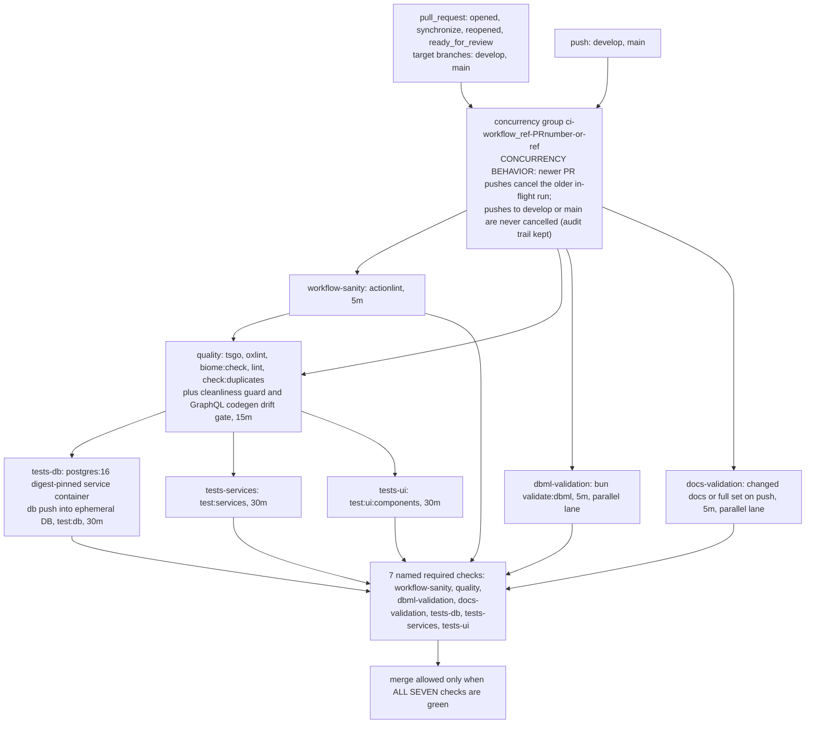

# CI Pipeline

Canonical reference for `.github/workflows/ci.yml` (the DEV3-001 merge-blocking pipeline). Anyone editing the workflow MUST read this document first — the workflow header comment links back here (`REQ-085`, bidirectional contract). Validation commands referenced below are executable verbatim on any machine with Bun installed; every step in CI invokes the same entry points a developer runs locally (`REQ-027`).

## Why

- **Merge blocking by default.** Seven individually required status checks (`workflow-sanity`, `quality`, `dbml-validation`, `docs-validation`, `tests-db`, `tests-services`, `tests-ui`) gate every merge into `develop`/`main`. Schema drift, broken Mermaid diagrams, lint regressions, and failing suites cannot land silently (`REQ-010..018`).
- **Local truth equals CI truth.** No CI-only shell logic exists: each `run:` step calls the repo's own canonical commands (`bun tsgo`, `bun validate:dbml`, `bun run scripts/ci/validate-docs-ci.ts`, …), so "passed locally" cannot diverge from "passed in CI" (`REQ-027`, verified differentially in Phase 5 — see the reproduction table under [Rules](#rules)).
- **Surgical failure attribution.** A red PR is traceable to its failing domain by check name alone; tool output reaches the log unpolluted (`REQ-026/053`). This property is load-bearing: it was exercised by four sabotage classes in Phase 5 (see [Rollout Summary](#rollout-summary)).
- **Self-validating documentation.** This very document lives inside the `docs/**` watch surface of `docs-validation`: its topology diagram below must pass `bun run scripts/validate-mermaid.ts docs/quality/ci-pipeline.md` (`REQ-080`, gate closure proven in Task 7.1.QL).

## Pattern

### Trigger model

| Event | Filter | Semantics |
|---|---|---|
| `pull_request` | branches `[develop, main]`; types `[opened, synchronize, reopened, ready_for_review]` | Runs on draft PRs too (no draft suppression — earliest feedback, cost bounded by cancellation). `ready_for_review` explicitly covers the draft→ready transition so the check suite is never missing at reviewable state. |
| `push` | branches `[develop, main]` | Complete per-commit audit trail on the protected branches themselves; `cancel-in-progress` is false for push events, so merged history shows one green run per commit. |

**`pull_request_target` is permanently banned** (`REQ-011`). This workflow executes PR-authored code; the `_target` variant would grant it a write-scoped checkout token and repository secrets in the fork's reach. Everything the pipeline needs comes from committed files and fixture values, so the elevated trigger buys nothing and risks everything.

### Job/stage map

| Job | Needs | Timeout | Purpose (canonical commands) |
|---|---|---|---|
| `workflow-sanity` | — | 5 min | actionlint over all workflow YAML with SHA256-checked pinned binary (`REQ-029`) |
| `quality` | `workflow-sanity` | 15 min | fail-fast chain `bun tsgo` → `bun run oxlint` → `bun biome:check` → `bun run lint` → `bun run check:duplicates`, then cleanliness guard + codegen drift gate (`REQ-014/015`) |
| `dbml-validation` | — (parallel) | 5 min | `bun validate:dbml` over `db/schema.dbml`, unconditional, never path-filtered (`REQ-016`) |
| `docs-validation` | — (parallel) | 5 min | Mermaid validation via `bun run scripts/ci/validate-docs-ci.ts` — PR diff scope, full set on push (`REQ-017/063`) |
| `tests-db` | `quality` | 30 min | ephemeral Postgres 16 service; `.env.test` materialization; `bun --env-file=.env.test run db push --env-file=.env.test`; `bun run test:db` (`REQ-020/021/022/043`) |
| `tests-services` | `quality` | 30 min | `bun run test:services` with adapters mocked per `backend/services/AGENTS.md` |
| `tests-ui` | `quality` | 30 min | `bun run test:ui:components` Happy DOM component tier (committed `.env.test.ci`; consumes zero DB connections) |

DB suites never start before `quality` is green — runner minutes are never burned on code that fails mechanical gates (`REQ-019`).

### Topology



## Rules

### Caching (`REQ-023/033/045`)

Restore/save halves are separate steps with split keys; caches are never cleared.

| Step name (byte-exact) | Key | restore-keys prefix |
|---|---|---|
| Restore Bun install cache | `Linux-bun-${{ hashFiles('bun.lock') }}` (runner.os prefixed) | `${{ runner.os }}-bun-` |
| Restore ESLint caches (restored/saved only — never cleared) | `${{ runner.os }}-eslint-${{ github.run_id }}` | `${{ runner.os }}-eslint-` |
| Save Bun install cache (if: always()) | `${{ runner.os }}-bun-${{ hashFiles('bun.lock') }}-${{ github.run_id }}` | — |
| Save ESLint caches (if: always()) | `${{ runner.os }}-eslint-${{ github.run_id }}` | — |

- **Append-only saves**: run-id suffixes make every save key unique-per-run; nothing is ever overwritten in-band. Save steps carry `if: always()` (`REQ-051`-sanctioned) so red runs still warm later ones — correct-but-slower philosophy.
- **Prefix fallback semantics (`REQ-045`)**: the exact bun key always misses on a fresh run (lockfile hash changes rarely, but the restore-keys prefix picks the MOST RECENT matching entry anyway); a stale restore can only degrade to slower, never wrong — tools re-validate their own inputs. ESLint restore-keys behave identically because its exact key contains a fresh `run_id` on purpose.
- **Never-clear policy**: the pipeline contains ZERO deletion steps (`grep -nE "rm |delete|clean" .github/workflows/ci.yml` matches no cache-related line). Cache hygiene = GitHub retention expiry only.
- **Native branch isolation (`REQ-033`)**: caches saved during `pull_request` runs are scoped to the PR namespace — restorable by later runs of the SAME PR only, never by `develop`/`main` runs until those branches' own events save entries. Fork/cache-poisoning surface stays closed by GitHub's scoping guarantee; family-separated keys keep PR saves from colliding with branch saves even in principle.

### Security posture (`REQ-030..039`)

- **Token minimality**: top-level `permissions: contents: read` — nothing else granted; no job elevates.
- **Action pinning (`REQ-032`)** — full-length commit SHAs, verified against upstream tags:

| Action / dependency | Pin | Version |
|---|---|---|
| `actions/checkout` | `fbc6f39…` (`fbc6f3992d24b796d5a048ff273f7fcc4a7b6c09`) | v5.1.0 |
| `oven-sh/setup-bun` | `0c5077e…` (`0c5077e51419868618aeaa5fe8019c62421857d6`) | v2.2.0 |
| `actions/cache/restore` + `/save` | `0057852b…` (`0057852bfaa89a56745cba8c7296529d2fc39830`) | v4.3.0 |
| actionlint binary | version `1.7.12` + inline checksum `ACTIONLINT_SHA256=8aca8db9…a3d8` (`8aca8db96f1b94770f1b0d72b6dddcb1ebb8123cb3712530b08cc387b349a3d8`, official checksums.txt) | v1.7.12 |
| `postgres` service image | `postgres:16@sha256:c1b37833…` (`sha256:c1b3783309b6499c795eed7c20135a1a4d25cae1b575c3d52c6f536129a1b109`; tag noted in comment for humans) | 16 |

- **Fork isolation (`REQ-011/031`)**: `pull_request` trigger only; zero `secrets.` references anywhere (static walk verified); the sole credentials in scope are the per-job ephemeral Postgres fixture values (`kottaby:ci-local-only-fixture@localhost:5432/kottaby_test`), destroyed with the VM — provably not secrets.
- **Injection defense (`REQ-035`)**: PR-controlled values reach shells ONLY via step-level `env:` mappings (`EVENT_NAME`, `BASE_REF`) or trusted argv arrays; zero `${{ github.event.* }}` interpolation inside any `run:` block (grep-proven in Phase 5/6 reviews); spawned validators receive one path per argv element — no shell layering.
- **Credential leakage defense (`REQ-034`)**: all seven checkouts declare `persist-credentials: false`.
- **Artifact policy (`REQ-039`)**: none — nothing is uploaded. Debug path = manual re-run with logs; any future debug artifact must exclude `.env*`, caches, `.git/`, retention ≤ 7 days.

### GraphQL codegen drift gate (`REQ-061` — SHIPPED)

Decision #13 evaluated-and-enabled the gate instead of deferring: three consecutive local runs produced byte-identical generated artifacts (stable md5s), and live quality-job executions stayed green — the determinism precondition `REQ-061` demanded was evidenced BEFORE shipping it as required (see `ai/plans/dev3-001-cicd-pipeline-with-dbml-mermaid-validati/outcome/3.3-outcome.md` §codegen). Documented deviation: the command ingests the committed template directly via `--env-file=.env.test.ci` (same mechanism as every repo test entry point) because `backend/db/index.ts` requires a non-empty `DATABASE_URL` at module init; the schema build never opens a connection and the fixture value is inert, not a secret.

### Local reproduction commands (Phase 5.9 differential parity audit)

Identical strings to the workflow `run:` blocks (sandbox: bun 1.3.14 = `packageManager` pin):

| # | Command (verbatim as in CI) | Exit | Notes |
|---|---|---|---|
| 1 | `bun tsgo` | 0 | process-lock acquire/release |
| 2 | `bun run oxlint` | 0 | 400 files, 0 warnings/0 errors |
| 3 | `bun biome:check` | 0 | "No fixes applied" expected |
| 4 | `bun run lint` | 0 | one sandbox transient (worker/cache artifact under hardlinked worktree) exited 1 with ZERO diagnostics; clean reruns ×2 and identical-SHA CI greens prove parity — documented honestly, zero repo impact |
| 5 | `bun run check:duplicates` | 0 | Found 0 clones |
| 6 | `bun validate:dbml` | 0 | 22 tables, 15 enums |
| 7 | `bun run scripts/ci/materialize-env-test.ts` | n/a | Tier-tested (31 cases) + live CI logs; needs `.env.test.ci` present and CI override vars for real runs |
| 8 | `bun --env-file=.env.test run db push --env-file=.env.test` | — | structural proof locally (no Postgres in sandbox); live leg green in `tests-db` runs |
| 9 | `bun run test:db` / `bun run test:services` | via CI | success across multiple live runs; locally requires materialized `.env.test` + Postgres |
| 10 | `bun run test:ui:components` | 0 | runs WITHOUT `.env.test` present — consumes committed `.env.test.ci` only |
| 11 | `EVENT_NAME=push bun run scripts/ci/validate-docs-ci.ts` | 0 | full-set mode — reproduces push-mode validation exactly |
| 12 | `bun --env-file=.env.test.ci run generate:gqlSchema && bun codegen && git diff --exit-code` | 0 | drift-gate determinism ×3 |

Suite-level local runner convention: `KOTTABY_TEST_RUNNER_OK=1 bun --env-file=.env.test.ci test --parallel=1 scripts/ci/*.test.ts scripts/validate-mermaid.test.ts` (135 tests / 0 failures at phase-6 tip).

## What NOT to Do

- **NEVER introduce `pull_request_target`** (or any trigger beyond the two listed). PR-authored code runs read-only and secrets-free BY DESIGN (`REQ-011`).
- **NEVER unpin, tag-pin, or bump-without-verifying** any `uses:` ref. Full-length SHA + version comment, always (`REQ-032`). Treat a floating `postgres:16` the same way — digest pin stays.
- **NEVER clear caches from the workflow** — no `rm`/delete/expiry steps against cache paths, ever; and keep the ESLint step's name intact including `(restored/saved only — never cleared)` — the name IS the policy marker.
- **NEVER rename a job id casually.** The seven job keys are copied BYTE-FOR-BYTE into the branch-protection ruleset; a typo silently un-blocks merges. Rename = synchronous ruleset update (human admin step below).
- **NEVER interpolate event data into `run:` strings.** New PR-derived values go through step-level `env:` (`REQ-035`).
- **NEVER upload artifacts opportunistically** (`REQ-039`): policy is none; sanctioned debug path is documented above.
- **NEVER add a terminal aggregator job** (`ci-verdict` / `all-green` / `gate`) merely to simplify branch protection — REJECTED ALTERNATE per `REQ-046`: an aggregate either still leaves every constituent needing individual required-status enforcement (else bypass gaps remain) or collapses attribution so a red PR can no longer be traced to its single failing domain at a glance — the attribution contract (`REQ-026/053`), job split, and Phase-5 sabotage evidence are built on per-check naming. Any future re-evaluation must cite this rationale and show why per-check requirement stopped working.
- **NEVER loosen the diff wrapper's ingestion guarantees**: changed-set parsing fails CLOSED on untrustworthy records (NUL-mode `-z` diffs, loud guard on C-quoted/control-char filenames); keep validator spawns as argv arrays without shell.
- **Do not skip reading this file before editing `ci.yml`** (`REQ-085` loop) — and remember `docs-validation` validates THIS document's fences too: a broken diagram here breaks CI like any other doc.

## Rollout Summary

### Branch protection — human-admin setup steps (canonical copy of Task 3.4.A payload)

Applied by a repository ADMIN (requires a token/service account with **Administration: write** — the automation credential in the dev sandbox lacks this capability, which is why application remains a deliberate human step). REST call expects **HTTP 201 Created**:

```bash
gh api \
  --method POST \
  -H "X-GitHub-Api-Version: 2022-11-28" \
  repos/ahmedhosnypro/kottaby_academy/rulesets \
  --input /tmp/dev3-ruleset-payload.json \
  --jq '{id: .id, name: .name, enforcement: .enforcement, html_url: .html_url}'
```

Payload staged at `/tmp/dev3-ruleset-payload.json` — the seven contexts are byte-copies of the `ci.yml` job ids (order preserved):

```json
{
  "name": "develop-and-main-required-checks",
  "target": "branch",
  "enforcement": "active",
  "conditions": {
    "ref_name": {
      "include": ["refs/heads/develop", "refs/heads/main"],
      "exclude": []
    }
  },
  "bypass_actors": [],
  "rules": [
    {
      "type": "required_status_checks",
      "parameters": {
        "strict_required_status_checks_policy": true,
        "required_status_checks": [
          { "context": "workflow-sanity",  "integration_id": 15368 },
          { "context": "quality",          "integration_id": 15368 },
          { "context": "dbml-validation",  "integration_id": 15368 },
          { "context": "docs-validation",  "integration_id": 15368 },
          { "context": "tests-db",         "integration_id": 15368 },
          { "context": "tests-services",   "integration_id": 15368 },
          { "context": "tests-ui",         "integration_id": 15368 }
        ]
      }
    }
  ]
}
```

Semantics: `active` enforcement immediately; targets BOTH `develop` and `main`; `bypass_actors: []` means nobody (admins included) merges around required checks; `strict_required_status_checks_policy: true` = "require branches to be up to date before merging"; `integration_id: 15368` is the stable GitHub Actions app id producing these statuses.

Post-create verification (assert every field before declaring victory):

```bash
gh api -H "X-GitHub-Api-Version: 2022-11-28" repos/ahmedhosnypro/kottaby_academy/rulesets/<id> \
  --jq '{name, target, enforcement,
         conditions: .conditions.ref_name.include,
         bypass_actors,
         strict: (.rules[] | select(.type=="required_status_checks") | .parameters.strict_required_status_checks_policy),
         checks: (.rules[] | select(.type=="required_status_checks") | [.parameters.required_status_checks[].context]) }'
```

Assert-on-view: enforcement=`active`; include == `["refs/heads/develop","refs/heads/main"]`; bypass empty; strict=`true`; checks array equals the seven context strings IN ORDER.

Staging note (orchestrator release choreography): the ruleset is authored to bind both branches FROM DAY ONE by content, but application follows a DEVELOP-FIRST posture — apply while feature-branch PRs target `develop` so sabotage/verification evidence accrues against `develop` gating FIRST; binding for `main` is deferred until multi-session development traffic subsides to avoid self-inflicted merge lockouts mid-stream. Creation is one-shot and retry-safe: a duplicate-name 422 means VERIFY the existing object via the query above — never blanket-delete blindly. Evidence to capture at application time: HTTP 201, GET verification JSON, and the Phase-5-style merge-block screenshot (`mergeStateStatus: BLOCKED`). Live status at authoring time (@ tip `c6fb95d` + this commit): `GET /repos/{owner}/{repo}/rulesets` returns `[]` — application pending human admin, tracked in the forward-deferred register below.

### Sabotage & verification evidence ledger (Phase 5, condensed)

| Concern | Outcome file | Run(s) / SHAs (condensed) |
|---|---|---|
| Positive-path all-green baseline (`REQ-070`) | `outcome/5.1-outcome.md` | run `33000132770` @ `3117110` — all 7 ✅ |
| DBML sabotage → red-only target → revert (`REQ-071`) | `outcome/5.2-outcome.md` | sabotage `a74ed8b` run `33000962941` (`dbml-validation` ❌ alone) → revert `66b377c` run `33001336200` green |
| Mermaid sabotage file+line attribution; code-only no-op (`REQ-072`) | `outcome/5.3-outcome.md` | sabotage `259cbe4` run `33001700741` (`docs-validation` ❌, `:156:` attribution) → revert `d6ff0c9` run `33001970522`; retained probe `1d865b7` run `33002369615` no-op green |
| Quality sabotage fail-fast first offender (`REQ-073/026/015`) | `outcome/5.4-outcome.md` | sabotage `eba25c6` run `33002786546` (`quality` ❌ at tsgo, later steps skipped) → revert `e20bbb5` run `33002951236` green |
| Test sabotage + idempotent rerun (`REQ-074/041`) | `outcome/5.5-outcome.md` | sabotage `961a684` run `33003316939` (`tests-ui` ❌ alone) → revert/re-run attempt=2 `33003793967` success |
| Convergence/concurrency cancellation (`REQ-077/024/044/047`) | `outcome/5.6-outcome.md` | c2 `8e4df4a` `33004420232` success; c3 `f538b95` `33005340494` CANCELLED by c4 `b009106` `33005368089` success |
| Cache cold→save vs restore-hit (`REQ-023/045/033`) | `outcome/5.7-outcome.md` | `33000132770` (save legs) vs `33005368089` (restore hits, `restore-keys` prefix fallback visible) |
| Missing-env named fail-fast (`REQ-022`) | `outcome/5.8-outcome.md` | sabotage `e24519d` run `33006282399` ("missing required CI env variable: DATABASE_URL") → revert `5297d1b` green |
| Fork-safety static proof (`REQ-031`) | `outcome/5.10-fork-safety-outcome.md` | greps: zero `secrets.`; single `pull_request_target` hit = ban comment; read-only permissions throughout |
| Steady-state sign-off run (phase-6 tip) | `outcome/post-implementation-review.md` | run `33009956904` @ `c6fb95d` — all 7 ✅ |

Ruleset merge-block capture fallback: with no ruleset yet applied, `dbml-validation FAILURE` up-to-date-on-head (run `33000962941` rollup) stands in as the required-check-failure half of the future `BLOCKED` proof, per `outcome/5.2-outcome.md`.

### Forward-deferred items register

Nothing else is open beyond two recorded acceptances:

1. **Branch-protection ruleset application** — pending a human admin holding an Administration-write-capable token (payload + verification steps above; `tasks.md` 3.4.B closed via recorded-fallback branch; see also `outcome/3.4-ruleset-spec-and-payload.md` §5–6).
2. **W4-F3 packageManager runtime-selection finding** — ACCEPTED-DOCUMENTED, no code change sanctioned; risk fully covered by existing mechanisms (disposition canonically recorded in `outcome/post-implementation-review.md` §4 F3 row).

Conditional forward-guards on record (trigger-activated, no current ticket owed): public-repo minutes restriction if the repo is ever made public (`REQ-037`), artifact-based debug packaging with the `REQ-039` exclusion list, draft-PR cost optimization — all pre-declared in plan §6.6 with the gate they ride on.

## Related Documents

- Ground-truth schema validated by `dbml-validation`: [`db/schema.dbml`](../../db/schema.dbml)
- Validators: [`scripts/validate-dbml.ts`](../../scripts/validate-dbml.ts) · [`scripts/validate-mermaid.ts`](../../scripts/validate-mermaid.ts)
- CI composition trio: [`scripts/ci/validate-docs-ci.ts`](../../scripts/ci/validate-docs-ci.ts) · [`scripts/ci/changed-docs.ts`](../../scripts/ci/changed-docs.ts) · [`scripts/ci/materialize-env-test.ts`](../../scripts/ci/materialize-env-test.ts)
- The gated workflow itself: [`.github/workflows/ci.yml`](../../.github/workflows/ci.yml) (its header links back here)
- House sibling doc: [`docs/quality/linting-rules.md`](./linting-rules.md)
- Verification evidence ledger: [`ai/plans/dev3-001-cicd-pipeline-with-dbml-mermaid-validati/outcome/`](../../ai/plans/dev3-001-cicd-pipeline-with-dbml-mermaid-validati/outcome/)
- Plan artifacts: [`ai/plans/dev3-001-cicd-pipeline-with-dbml-mermaid-validati/`](../../ai/plans/dev3-001-cicd-pipeline-with-dbml-mermaid-validati/) (`plan.md` Decisions #1–#14, `specs.md` REQ-001..085, `tasks.md`)
