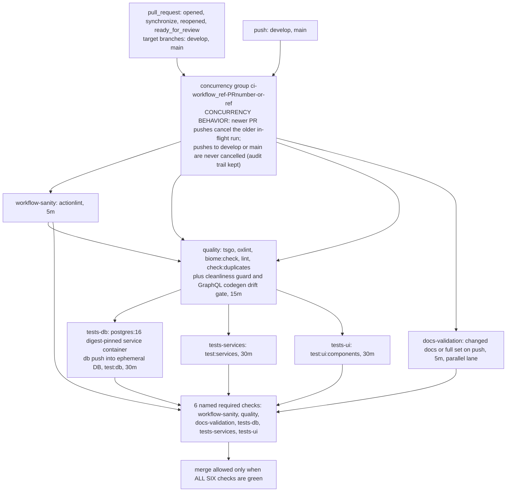

# CI Pipeline

Canonical reference for `.github/workflows/ci.yml` (the merge-blocking pipeline). Anyone editing the workflow MUST read this document first — the workflow header comment links back here, and this document links back to the workflow (bidirectional contract). Validation commands referenced below are executable verbatim on any machine with Bun installed; every step in CI invokes the same entry points a developer runs locally.

## Why

- **Merge blocking by default.** Six individually required status checks (`workflow-sanity`, `quality`, `docs-validation`, `tests-db`, `tests-services`, `tests-ui`) gate every merge into `develop`/`main`. Broken Mermaid diagrams, lint regressions, and failing suites cannot land silently.
- **Local truth equals CI truth.** No CI-only shell logic exists: each `run:` step calls the repo's own canonical commands (`bun tsgo`, `bun run scripts/ci/validate-docs-ci.ts`, …), so "passed locally" cannot diverge from "passed in CI" (verified differentially — see the reproduction table under [Rules](#rules)).
- **Surgical failure attribution.** A red PR is traceable to its failing domain by check name alone; tool output reaches the log unpolluted.
- **Self-validating documentation.** This very document lives inside the `docs/**` watch surface of `docs-validation`: its topology diagram below must pass `bun run scripts/validate-mermaid.ts docs/quality/ci-pipeline.md`.

## Pattern

### Trigger model

| Event | Filter | Semantics |
|---|---|---|
| `pull_request` | branches `[develop, main]`; types `[opened, synchronize, reopened, ready_for_review]` | Runs on draft PRs too (no draft suppression — earliest feedback, cost bounded by cancellation). `ready_for_review` explicitly covers the draft→ready transition so the check suite is never missing at reviewable state. |
| `push` | branches `[develop, main]` | Complete per-commit audit trail on the protected branches themselves; `cancel-in-progress` is false for push events, so merged history shows one green run per commit. |

**`pull_request_target` is permanently banned**. This workflow executes PR-authored code; the `_target` variant would grant it a write-scoped checkout token and repository secrets in the fork's reach. Everything the pipeline needs comes from committed files and fixture values, so the elevated trigger buys nothing and risks everything.

### Job/stage map

| Job | Needs | Timeout | Purpose (canonical commands) |
|---|---|---|---|
| `workflow-sanity` | — | 5 min | actionlint over all workflow YAML with SHA256-checked pinned binary |
| `quality` | `workflow-sanity` | 15 min | fail-fast chain `bun tsgo` → `bun run oxlint` → `bun biome:check` → `bun run lint` → `bun run check:duplicates`, then cleanliness guard + codegen drift gate |
| `docs-validation` | — (parallel) | 5 min | Mermaid validation via `bun run scripts/ci/validate-docs-ci.ts` — PR diff scope, full set on push |
| `tests-db` | `quality` | 30 min | ephemeral Postgres 16 service; `.env.test` materialization; `bun --env-file=.env.test run db push --env-file=.env.test`; `bun run test:db` |
| `tests-services` | `quality` | 30 min | `bun run test:services` with adapters mocked per `backend/services/AGENTS.md` |
| `tests-ui` | `quality` | 30 min | `bun run test:ui:components` Happy DOM component tier (committed `.env.test.ci`; consumes zero DB connections) |

DB suites never start before `quality` is green — runner minutes are never burned on code that fails mechanical gates.

### Topology



## Rules

### Caching

Restore/save halves are separate steps with split keys; caches are never cleared.

| Step name (byte-exact) | Key | restore-keys prefix |
|---|---|---|
| Restore Bun install cache | `Linux-bun-${{ hashFiles('bun.lock') }}` (runner.os prefixed) | `${{ runner.os }}-bun-` |
| Restore ESLint caches (restored/saved only — never cleared) | `${{ runner.os }}-eslint-${{ github.run_id }}` | `${{ runner.os }}-eslint-` |
| Save Bun install cache (if: always()) | `${{ runner.os }}-bun-${{ hashFiles('bun.lock') }}-${{ github.run_id }}` | — |
| Save ESLint caches (if: always()) | `${{ runner.os }}-eslint-${{ github.run_id }}` | — |

- **Append-only saves**: run-id suffixes make every save key unique-per-run; nothing is ever overwritten in-band. Save steps carry `if: always()` so red runs still warm later ones — correct-but-slower philosophy.
- **Prefix fallback semantics**: the exact bun key always misses on a fresh run (lockfile hash changes rarely, but the restore-keys prefix picks the MOST RECENT matching entry anyway); a stale restore can only degrade to slower, never wrong — tools re-validate their own inputs. ESLint restore-keys behave identically because its exact key contains a fresh `run_id` on purpose.
- **Never-clear policy**: the pipeline contains ZERO deletion steps (`grep -nE "rm |delete|clean" .github/workflows/ci.yml` matches no cache-related line). Cache hygiene = GitHub retention expiry only.
- **Native branch isolation**: caches saved during `pull_request` runs are scoped to the PR namespace — restorable by later runs of the SAME PR only, never by `develop`/`main` runs until those branches' own events save entries. Fork/cache-poisoning surface stays closed by GitHub's scoping guarantee; family-separated keys keep PR saves from colliding with branch saves even in principle.

### Security posture

- **Token minimality**: top-level `permissions: contents: read` — nothing else granted; no job elevates.
- **Action pinning** — full-length commit SHAs, verified against upstream tags:

| Action / dependency | Pin | Version |
|---|---|---|
| `actions/checkout` | `fbc6f39…` (`fbc6f3992d24b796d5a048ff273f7fcc4a7b6c09`) | v5.1.0 |
| `oven-sh/setup-bun` | `0c5077e…` (`0c5077e51419868618aeaa5fe8019c62421857d6`) | v2.2.0 |
| `actions/cache/restore` + `/save` | `0057852b…` (`0057852bfaa89a56745cba8c7296529d2fc39830`) | v4.3.0 |
| actionlint binary | version `1.7.12` + inline checksum `ACTIONLINT_SHA256=8aca8db9…a3d8` (`8aca8db96f1b94770f1b0d72b6dddcb1ebb8123cb3712530b08cc387b349a3d8`, official checksums.txt) | v1.7.12 |
| `postgres` service image | `postgres:16@sha256:c1b37833…` (`sha256:c1b3783309b6499c795eed7c20135a1a4d25cae1b575c3d52c6f536129a1b109`; tag noted in comment for humans) | 16 |

- **Fork isolation**: `pull_request` trigger only; zero `secrets.` references anywhere (static walk verified); the sole credentials in scope are the per-job ephemeral Postgres fixture values (`kottaby:ci-local-only-fixture@localhost:5432/kottaby_test`), destroyed with the VM — provably not secrets.
- **Injection defense**: PR-controlled values reach shells ONLY via step-level `env:` mappings (`EVENT_NAME`, `BASE_REF`) or trusted argv arrays; zero `${{ github.event.* }}` interpolation inside any `run:` block; spawned validators receive one path per argv element — no shell layering.
- **Credential leakage defense**: all seven checkouts declare `persist-credentials: false`.
- **Artifact policy**: none — nothing is uploaded. Debug path = manual re-run with logs; any future debug artifact must exclude `.env*`, caches, `.git/`, retention ≤ 7 days.

### GraphQL codegen drift gate

The gate ships enabled rather than deferred: its determinism precondition — consecutive local runs producing byte-identical generated artifacts (stable md5s) — was evidenced before it became required. Documented deviation: the command ingests the committed template directly via `--env-file=.env.test.ci` (same mechanism as every repo test entry point) because `backend/db/index.ts` requires a non-empty `DATABASE_URL` at module init; the schema build never opens a connection and the fixture value is inert, not a secret.

### Local reproduction commands

Identical strings to the workflow `run:` blocks (sandbox: bun 1.3.14 = `packageManager` pin):

| # | Command (verbatim as in CI) | Exit | Notes |
|---|---|---|---|
| 1 | `bun tsgo` | 0 | process-lock acquire/release |
| 2 | `bun run oxlint` | 0 | 400 files, 0 warnings/0 errors |
| 3 | `bun biome:check` | 0 | "No fixes applied" expected |
| 4 | `bun run lint` | 0 | one sandbox transient (worker/cache artifact under hardlinked worktree) exited 1 with ZERO diagnostics; clean reruns ×2 and identical-SHA CI greens prove parity — documented honestly, zero repo impact |
| 5 | `bun run check:duplicates` | 0 | Found 0 clones |
| 6 | `bun run scripts/ci/materialize-env-test.ts` | n/a | Tier-tested (31 cases) + live CI logs; needs `.env.test.ci` present and CI override vars for real runs |
| 7 | `bun --env-file=.env.test run db push --env-file=.env.test` | — | structural proof locally (no Postgres in sandbox); live leg green in `tests-db` runs |
| 8 | `bun run test:db` / `bun run test:services` | via CI | success across multiple live runs; locally requires materialized `.env.test` + Postgres |
| 9 | `bun run test:ui:components` | 0 | runs WITHOUT `.env.test` present — consumes committed `.env.test.ci` only |
| 10 | `EVENT_NAME=push bun run scripts/ci/validate-docs-ci.ts` | 0 | full-set mode — reproduces push-mode validation exactly |
| 11 | `bun --env-file=.env.test.ci run generate:gqlSchema && bun codegen && git diff --exit-code` | 0 | drift-gate determinism ×3 |

Suite-level local runner convention: `KOTTABY_TEST_RUNNER_OK=1 bun --env-file=.env.test.ci test --parallel=1 scripts/ci/*.test.ts scripts/validate-mermaid.test.ts` (135 tests / 0 failures at the steady-state tip).

## What NOT to Do

- **NEVER introduce `pull_request_target`** (or any trigger beyond the two listed). PR-authored code runs read-only and secrets-free BY DESIGN.
- **NEVER unpin, tag-pin, or bump-without-verifying** any `uses:` ref. Full-length SHA + version comment, always. Treat a floating `postgres:16` the same way — digest pin stays.
- **NEVER clear caches from the workflow** — no `rm`/delete/expiry steps against cache paths, ever; and keep the ESLint step's name intact including `(restored/saved only — never cleared)` — the name IS the policy marker.
- **NEVER rename a job id casually.** The seven job keys are copied BYTE-FOR-BYTE into the branch-protection ruleset; a typo silently un-blocks merges. Rename = synchronous ruleset update (human admin step below).
- **NEVER interpolate event data into `run:` strings.** New PR-derived values go through step-level `env:`.
- **NEVER upload artifacts opportunistically**: policy is none; sanctioned debug path is documented above.
- **NEVER add a terminal aggregator job** (`ci-verdict` / `all-green` / `gate`) merely to simplify branch protection — a REJECTED ALTERNATIVE: an aggregate either still leaves every constituent needing individual required-status enforcement (else bypass gaps remain) or collapses attribution so a red PR can no longer be traced to its single failing domain at a glance — the attribution contract and job split are built on per-check naming. Any future re-evaluation must cite this rationale and show why per-check requirement stopped working.
- **NEVER loosen the diff wrapper's ingestion guarantees**: changed-set parsing fails CLOSED on untrustworthy records (NUL-mode `-z` diffs, loud guard on C-quoted/control-char filenames); keep validator spawns as argv arrays without shell.
- **Do not skip reading this file before editing `ci.yml`** — and remember `docs-validation` validates THIS document's fences too: a broken diagram here breaks CI like any other doc.

## Rollout Summary

### Branch protection — human-admin setup steps

Applied by a repository ADMIN (requires a token/service account with **Administration: write** — the automation credential in the dev sandbox lacks this capability, which is why application remains a deliberate human step). REST call expects **HTTP 201 Created**:

```bash
gh api \
  --method POST \
  -H "X-GitHub-Api-Version: 2022-11-28" \
  repos/ahmedhosnypro/kottaby_academy/rulesets \
  --input /tmp/kottaby-ruleset-payload.json \
  --jq '{id: .id, name: .name, enforcement: .enforcement, html_url: .html_url}'
```

Payload staged at `/tmp/kottaby-ruleset-payload.json` — the seven contexts are byte-copies of the `ci.yml` job ids (order preserved):

```json
{
  "name": "develop-and-main-required-checks",
  "target": "branch",
  "enforcement": "active",
  "conditions": {
    "ref_name": {
      "include": ["refs/heads/develop", "refs/heads/main"],
      "exclude": []
    }
  },
  "bypass_actors": [],
  "rules": [
    {
      "type": "required_status_checks",
      "parameters": {
        "strict_required_status_checks_policy": true,
        "required_status_checks": [
          { "context": "workflow-sanity",  "integration_id": 15368 },
          { "context": "quality",          "integration_id": 15368 },
          { "context": "docs-validation",  "integration_id": 15368 },
          { "context": "tests-db",         "integration_id": 15368 },
          { "context": "tests-services",   "integration_id": 15368 },
          { "context": "tests-ui",         "integration_id": 15368 }
        ]
      }
    }
  ]
}
```

Semantics: `active` enforcement immediately; targets BOTH `develop` and `main`; `bypass_actors: []` means nobody (admins included) merges around required checks; `strict_required_status_checks_policy: true` = "require branches to be up to date before merging"; `integration_id: 15368` is the stable GitHub Actions app id producing these statuses.

Post-create verification (assert every field before declaring victory):

```bash
gh api -H "X-GitHub-Api-Version: 2022-11-28" repos/ahmedhosnypro/kottaby_academy/rulesets/<id> \
  --jq '{name, target, enforcement,
         conditions: .conditions.ref_name.include,
         bypass_actors,
         strict: (.rules[] | select(.type=="required_status_checks") | .parameters.strict_required_status_checks_policy),
         checks: (.rules[] | select(.type=="required_status_checks") | [.parameters.required_status_checks[].context]) }'
```

Assert-on-view: enforcement=`active`; include == `["refs/heads/develop","refs/heads/main"]`; bypass empty; strict=`true`; checks array equals the six context strings IN ORDER.

Staging note (release choreography): the ruleset is authored to bind both branches FROM DAY ONE by content, but application follows a DEVELOP-FIRST posture — apply while feature-branch PRs target `develop` so verification evidence accrues against `develop` gating FIRST; binding for `main` is deferred until multi-session development traffic subsides to avoid self-inflicted merge lockouts mid-stream. Creation is one-shot and retry-safe: a duplicate-name 422 means VERIFY the existing object via the query above — never blanket-delete blindly. Evidence to capture at application time: HTTP 201, GET verification JSON, and a merge-block screenshot (`mergeStateStatus: BLOCKED`).

### Forward-deferred items register

Nothing else is open beyond two recorded acceptances:

1. **Branch-protection ruleset application** — pending a human admin holding an Administration-write-capable token (payload and verification steps above; merge-block evidence is captured at application time).
2. **`packageManager` runtime-selection** — accepted and documented as a finding; no code change sanctioned, risk fully covered by existing mechanisms.

Conditional forward-guards on record (trigger-activated, none currently owed): a public-repo minutes restriction if the repo is ever made public; artifact-based debug packaging honoring the exclusion list given in the artifact policy above; draft-PR cost optimization.

## Related Documents

- Ground-truth schema: `backend/db/schema/` (Drizzle — sole structural source of truth)
- Validators: [`scripts/validate-mermaid.ts`](../../scripts/validate-mermaid.ts)
- CI composition trio: [`scripts/ci/validate-docs-ci.ts`](../../scripts/ci/validate-docs-ci.ts) · [`scripts/ci/changed-docs.ts`](../../scripts/ci/changed-docs.ts) · [`scripts/ci/materialize-env-test.ts`](../../scripts/ci/materialize-env-test.ts)
- The gated workflow itself: [`.github/workflows/ci.yml`](../../.github/workflows/ci.yml) (its header links back here)
- House sibling doc: [`docs/quality/linting-rules.md`](./linting-rules.md)
