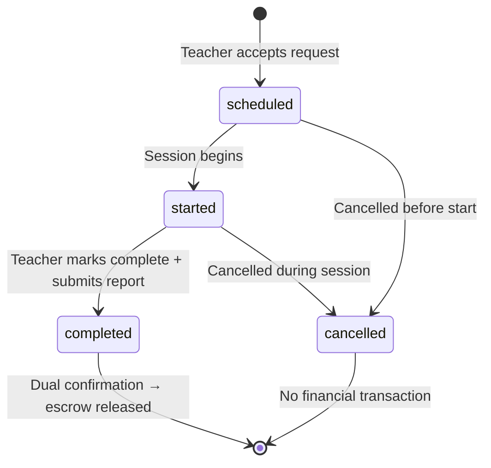
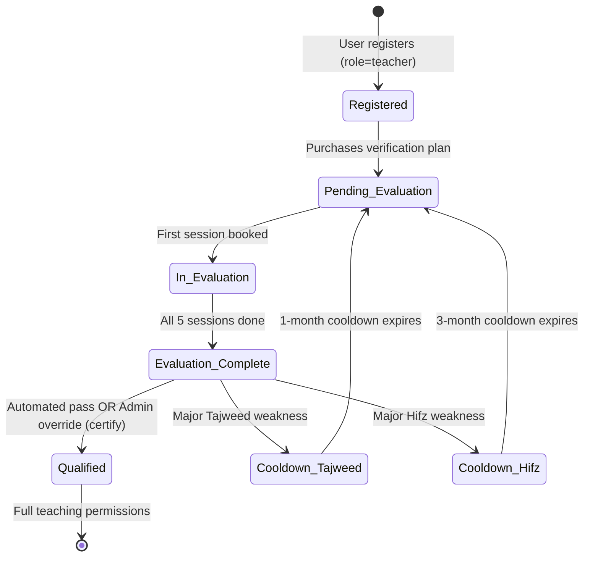
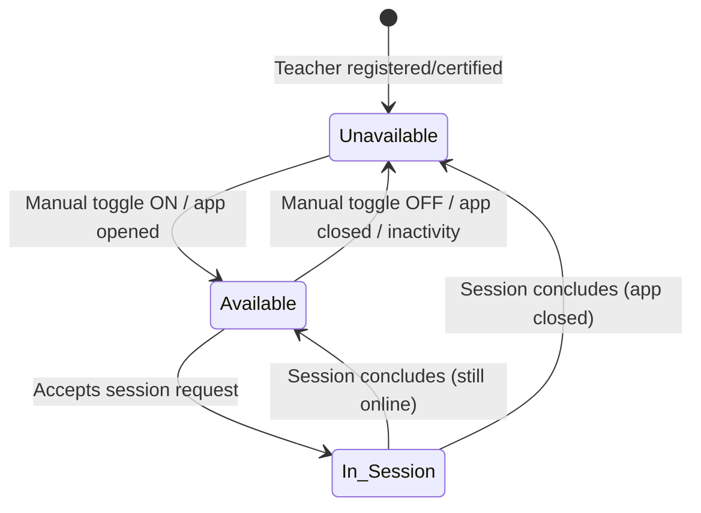
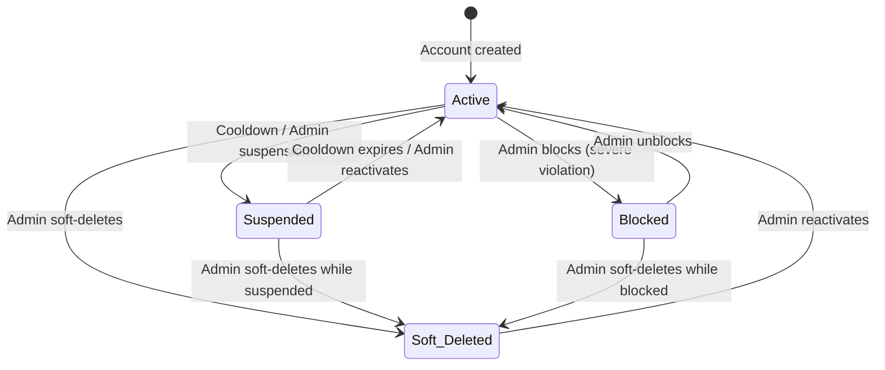

# Draft Academy — State Machine Invariants & Entity Lifecycles

> **Source of truth:** `draft_docs/1-sc.en.md`, `draft_docs/2-admin-sc.en.md`, `backend/db/schema/` (Drizzle schema)
> **Related:** `docs/workflows/` (all workflow documents)

---

## 1. Session Lifecycle

### 1.1 States
| State | Enum Value | Description |
|---|---|---|
| Scheduled | `scheduled` | Session created (teacher accepted request); not yet started |
| Started | `started` | Live session in progress |
| Completed | `completed` | Teacher marked complete + submitted report; awaiting or confirmed by student |
| Cancelled | `cancelled` | Session cancelled (before start or during) |

### 1.2 Allowed Transitions

### 1.3 Invariants
| ID | Invariant |
|---|---|
| INV-S1 | A session cannot transition from `completed` back to `started` or `scheduled`. |
| INV-S2 | A session cannot transition from `cancelled` to any other state. |
| INV-S3 | A `teacher_transaction` (type = earning) can only be created when a session transitions to `completed` AND the student confirms (dual confirmation). |
| INV-S4 | A session must have both `teacher_id` and `student_id` (NOT NULL). |
| INV-S5 | The teacher must be a certified Sheikh (`teacher.is_approved = true`) at the time of session creation. |
| INV-S6 | While a session is in `started` state, the teacher's `is_online` must be `false` (in-session lock). |
| INV-S7 | A session report (`reports`) can only be submitted for a session that has reached `completed` state. |
| INV-S8 | Homework (`home_work`) is linked to a session and can only be created when the session report is submitted. |

---

## 2. Teacher Verification Lifecycle

### 2.1 States (Conceptual)
| State | Description | Schema Representation |
|---|---|---|
| Registered | User created with role=teacher | `users.role = 'teacher'`, `teacher.is_approved = false` |
| Pending_Evaluation | Verification plan purchased | `subscriptions` (plan = verification), `teacher.is_approved = false` |
| In_Evaluation | Evaluation sessions in progress | 1-4 `session` records completed |
| Evaluation_Complete | All 5 sessions completed | 5 `session` + 5 `evaluations` records |
| Qualified | Passed evaluation | `teacher.is_approved = true` |
| Cooldown_Tajweed | Failed (Tajweed weakness) | `students.suspended = true`, `suspended_period_days = 30` |
| Cooldown_Hifz | Failed (Hifz weakness) | `students.suspended = true`, `suspended_period_days = 90` |

### 2.2 Allowed Transitions

### 2.3 Invariants
| ID | Invariant |
|---|---|
| INV-TV1 | An applicant cannot be certified (`is_approved = true`) without either (a) completing 5 evaluation sessions with 5 distinct certified Shuyukh and passing, or (b) being directly onboarded by the Admin (cold-start). |
| INV-TV2 | The 5 evaluation sessions must be with 5 **distinct** certified Shuyukh (no evaluator can evaluate the same applicant twice). |
| INV-TV3 | A cooldown period must fully expire before an applicant can re-purchase the verification plan. |
| INV-TV4 | Tajweed cooldown = 1 month (30 days); Hifz cooldown = 3 months (90 days). These are minimums. |
| INV-TV5 | The Admin override can supersede the automated aggregation result in any direction (certify, reject, or grant re-evaluation). |
| INV-TV6 | A failed applicant who is converted to a student retains student privileges (can subscribe to plans and attend sessions) during the cooldown period. |
| INV-TV7 | `teacher_verification` record stores `tajweed_level` and `hifz_level` assessments for the applicant. |

---

## 3. Teacher Availability Lifecycle

### 3.1 States
| State | `teacher.is_online` | Visible in Directory |
|---|---|---|
| Available | `true` | Yes |
| Unavailable (Offline) | `false` | No |
| In-Session (Unavailable) | `false` | No |

### 3.2 Allowed Transitions

### 3.3 Invariants
| ID | Invariant |
|---|---|
| INV-A1 | Only certified teachers (`is_approved = true`) can set their status to Available. |
| INV-A2 | While a teacher is in an active session (`session.status = started`), their `is_online` must be `false`. |
| INV-A3 | A teacher in In-Session state is hidden from the Available Teachers directory for all other students. |
| INV-A4 | Upon session conclusion, the teacher's status returns to Available only if they are still active (app open). |

---

## 4. Subscription & Session Balance Lifecycle

### 4.1 Subscription States
| State | Description | Schema Representation |
|---|---|---|
| Active | Within validity window | `subscriptions.start_date <= now < subscriptions.end_date` |
| Expired | Past validity window | `now >= subscriptions.end_date` |
| Cancelled | Admin cancelled | `subscriptions.status = 'cancelled'` ✅ RESOLVED (A.9) |
| Pending | Created but not yet active | `subscriptions.start_date > now` |

### 4.2 Session Balance Invariants
| ID | Invariant |
|---|---|
| INV-B1 | Session balances (`balance_hifz`, `balance_tajweed`, `balance_reviews`, `balance_trial`) are non-negative integers (default 0). Structurally extended by the dedicated `balance_trial` lane (4th non-negative lane) enforced via the `students_balance_trial_check` CHECK constraint. |
| INV-B2 | The full session count from a plan is credited to the respective balance immediately upon subscription activation. |
| INV-B3 | Unused sessions expire at the end of the `interval_days` window with no carryover. This expiry rule explicitly DOES NOT apply to `balance_trial`: the trial lane is not subscription-bound (no `subscriptions` row), so no `interval_days` window exists. A trial credit persists until consumed by a session booking. |
| INV-B4 | A student cannot request a session if the relevant balance is 0 (or expired). Eligibility is extended to: `(relevant intent balance > 0) OR (balance_trial > 0)` — the trial is an additional eligibility lane, not a replacement for any paid lane. The blocking semantics for a student with `balance_trial = 0` AND intent balance 0 are unchanged. |
| INV-B5 | Session balances are segregated: Hifz sessions decrement `balance_hifz`, Tajweed sessions decrement `balance_tajweed`, review sessions decrement `balance_reviews`. The dedicated `balance_trial` lane keeps INV-B5 pure: a trial is not a Hifz/Tajweed/Review purchase, so it must not co-mingle into any paid lane. |
| INV-B6 | The Admin can manually extend subscription validity windows (`end_date`). |
| INV-B7 | A trial credit is granted at most once per student record. Enforced structurally by the `trial_granted_at` marker column (nullable timestamp, set server-side on first grant) and the guarded single conditional `UPDATE students SET balance_trial = balance_trial + <count>, trial_granted_at = now() WHERE id = <studentId> AND trial_granted_at IS NULL RETURNING id` atomic statement. The `trial_granted_at IS NULL` predicate IS the atomicity mechanism — no advisory lock and no `SELECT FOR UPDATE` is required, because the predicate evaluation and the column mutation share one SQL statement (TOCTOU window = 0). A second grant attempt matches zero rows, returns an empty `RETURNING` set, and the service converts that into a localized `ConflictError` with `extensions.code = "CONFLICT"`. |
| INV-B8 | Session allowance consumption decrements `balance_trial` BEFORE any paid intent lane (`balance_hifz` / `balance_tajweed` / `balance_reviews`). When `balance_trial > 0`, the trial is decremented first and the paid lane is untouched; only when the trial has been exhausted does the existing paid-lane escrow rule (decision B.4) apply. The decrement MUST use the same single-guarded-UPDATE atomicity pattern: `UPDATE students SET balance_trial = balance_trial - 1 WHERE id = ? AND balance_trial > 0` returning a row count, with a separate conditional UPDATE on the paid lane if and only if the trial decrement returned zero rows. This preserves INV-B5 segregation and keeps trial-vs-paid analytics clean. |

---

## 5. Wallet & Transaction Lifecycle

### 5.1 Transaction States
| State | Enum Value | Description |
|---|---|---|
| Pending | `pending` | Transaction created but not yet completed (e.g., withdrawal awaiting approval) |
| Completed | `completed` | Transaction finalized |
| Failed | `failed` | Transaction failed (e.g., withdrawal rejected) |

### 5.2 Transaction Types
| Type | Enum Value | Description |
|---|---|---|
| Earning | `earning` | Session fee credited to wallet on dual confirmation |
| Withdrawal | `withdrawal` | Teacher requests payout from wallet |
| Bonus | `bonus` | Admin manual adjustment (credit or deduction) |

### 5.3 Invariants
| ID | Invariant |
|---|---|
| INV-W1 | `wallet.balance` must be >= 0 (check constraint). |
| INV-W2 | `wallet.total_earning` must be >= 0 (check constraint). |
| INV-W3 | Each teacher has exactly one wallet (`teacher_id` is unique on `wallet`). |
| INV-W4 | An `earning` transaction is created only upon dual confirmation of session completion. |
| INV-W5 | A `withdrawal` transaction starts as `pending` and transitions to `completed` (Admin approves) or `failed` (Admin rejects). |
| INV-W6 | Financial records (`student_payments`, `teacher_transaction`) are immutable once created. Corrections via new adjustment transactions only. |
| INV-W7 | An `earning` transaction is linked to a `session_id`; a `withdrawal` or `bonus` transaction may have a null `session_id`. |
| INV-W8 | `teacher_transaction.amount` must be >= 0 (check constraint). |

---

## 6. Student Account Lifecycle

### 6.1 States
| State | Schema Representation |
|---|---|
| Active | `suspended = false`, `is_blocked = false`, `is_deleted = false` |
| Suspended | `suspended = true`, `suspended_at = <ts>`, `suspended_period_days = <N>` |
| Blocked | `is_blocked = true`, `blocked_at = <ts>` |
| Soft Deleted | `is_deleted = true`, `deleted_at = <ts>` |

### 6.2 Allowed Transitions

### 6.3 Invariants
| ID | Invariant |
|---|---|
| INV-U1 | A soft-deleted student's historical sessions, reports, and financial transactions are preserved. |
| INV-U2 | A suspended student cannot request new sessions during the suspension period. |
| INV-U3 | A blocked student cannot access the platform. |
| INV-U4 | No user, student, or teacher record can be hard-deleted. |
| INV-U5 | A student's session balances are preserved across suspension/blocking/soft-delete. |

---

## 7. Parent-Child Link Lifecycle

### 7.1 States (Conceptual)
| State | Description |
|---|---|
| Code_Generated | Student assigned unique handshake code |
| Link_Requested | Parent sent link request; awaiting student action |
| Linked | Student confirmed; parent has monitoring access |
| Rejected | Student rejected the link request |
| Expired | Link request timed out without student action |
| Unlinked | Previously linked; relationship revoked |

### 7.2 Invariants
| ID | Invariant |
|---|---|
| INV-P1 | A parent cannot monitor a student without the student's explicit confirmation of the link request. |
| INV-P2 | In the MVP, parent access is strictly read-only. |
| INV-P3 | A parent receives real-time notification when a linked child's session completes. |
| INV-P4 | ✅ RESOLVED (A.2): Parent-child link data model implemented via `students.parent_id` FK and `students.handshake_code`. |

---

## 8. Payment Lifecycle

### 8.1 States
| State | Enum Value | Description |
|---|---|---|
| Pending | `pending` | Payment initiated, awaiting confirmation |
| Paid | `paid` | Payment confirmed |
| Failed | `failed` | Payment failed |
| Refunded | `refunded` | Payment refunded |

### 8.2 Invariants
| ID | Invariant |
|---|---|
| INV-PAY1 | `student_payments.amount` must be >= 0 (check constraint). |
| INV-PAY2 | Payment records are immutable. Corrections via adjustment transactions only. |
| INV-PAY3 | A subscription is activated (and session balance credited) only upon `paid` status. |
| INV-PAY4 | `student_payments` records a `payment_gateway` (stripe, paypal, paymob, fawry, other). |
| INV-PAY5 | Admin direct onboarding with offline payment (cash/transfer/scholarship) bypasses `student_payments`. **✅ RESOLVED (B.9):** Audit trail maintained via `subscriptions.payment_method`, `subscriptions.payment_reference`, and `subscriptions.payment_verified_at` fields. |

---

## 9. Homework & Progress Lifecycle

### 9.1 Homework
| ID | Invariant |
|---|---|
| INV-HW1 | Homework (`home_work`) is linked to exactly one `session_id` (NOT NULL). |
| INV-HW2 | `current_grade` and `revision_grade` are 0-100 (check constraints). |
| INV-HW3 | The first session has no prior homework to evaluate; homework is only assigned (not graded). |
| INV-HW4 | Subsequent sessions grade the previous session's homework and assign new homework. |

### 9.2 Progress
| ID | Invariant |
|---|---|
| INV-PR1 | Progress (`progress`) links a student to a lesson (`student_id`, `lesson_id`). |
| INV-PR2 | Progress is updated (incremented) upon successful completion of a Tajweed session. |
| INV-PR3 | Lessons belong to plans (`lessons.plan_id`). |

---

## 10. Evaluation Lifecycle

### 10.1 Invariants
| ID | Invariant |
|---|---|
| INV-E1 | `evaluations.score` is 0-100 (check constraint). |
| INV-E2 | Evaluations can be soft-deleted (`is_deleted`, `deleted_at`) but not hard-deleted. |
| INV-E3 | An evaluation is linked to a `user_id` (the evaluated user) and optionally a `session_id`. |
| INV-E4 | Teacher evaluations (submitted by students) update `teacher.average_rating` (0-5 scale). |
| INV-E5 | Student evaluations are aggregated from session reports and grades for cumulative performance metrics. |
| INV-E6 | Evaluation records are permanently retained for dispute resolution and teacher re-evaluations. |
