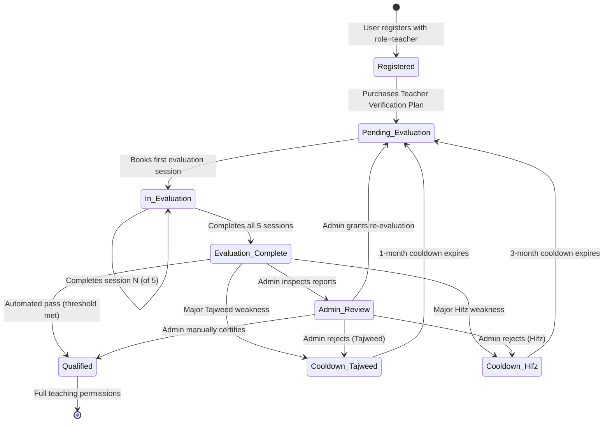
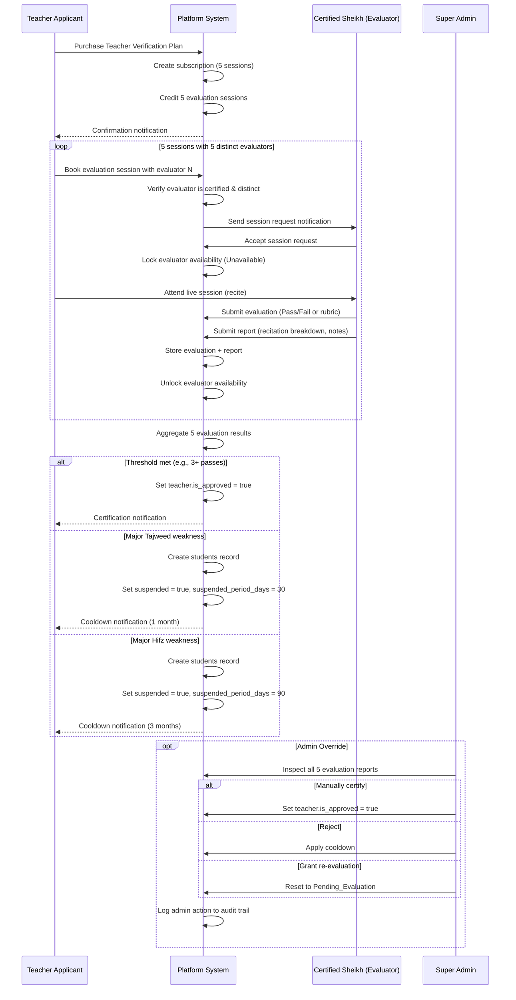
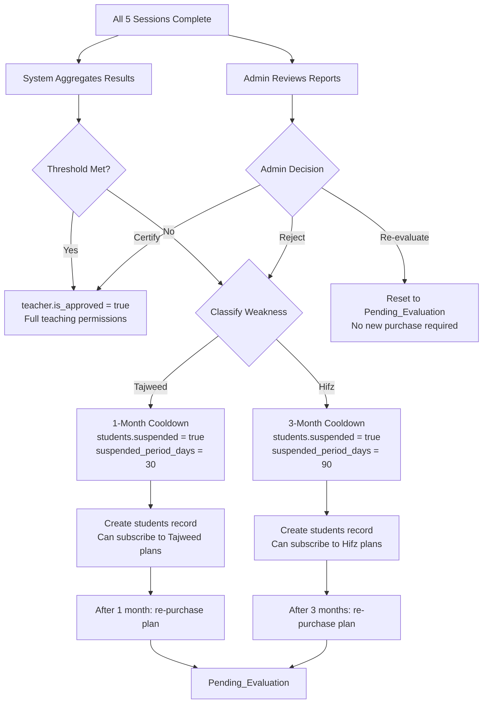

# Workflow 01 — Teacher Verification Loop

> **Source of truth:** `draft_docs/1-sc.en.md` §2, `draft_docs/2-admin-sc.en.md` §3
> **Related:** `docs/domain/GLOSSARY.md`, `docs/specs/state-machine-invariants.md`

---

## 1. Overview

The Teacher Verification Loop is the rigorous gatekeeping process that ensures only qualified Shuyukh are certified to teach on the platform. An applicant must purchase a Teacher Verification Plan, complete 5 evaluation sessions with 5 distinct certified Shuyukh, and meet the acceptance threshold — or face a cooldown period before re-applying.

---

## 2. State Machine: Teacher Applicant Lifecycle

---

## 3. Sequence Diagram: Evaluation Session Flow

---

## 4. Scoring Algorithm

### 4.1 Automated Aggregation
- The system aggregates the outcomes of 5 evaluation sessions.
- Each session produces a verdict: **Pass** or **Fail** (or granular rubric scores).
- **Example:** Passing 3 and failing 2 results in an automated fail (disqualifying the applicant from automatic teacher certification).

### 4.2 Outcome Categories
| Outcome | Condition | Action |
|---|---|---|
| **Qualified / Pass** | Applicant meets or exceeds acceptance threshold (qualifying as a Sheikh despite minor, acceptable weaknesses) | Insert into `teachers` table with `is_approved = true`; full certified teacher permissions |
| **Major Weakness in Tajweed** | Tajweed deficiency is the primary failure reason | Create `students` record; `suspended = true`; `suspended_period_days = 30` (1 month cooldown); can subscribe to Tajweed plans |
| **Major Weakness in Hifz** | Memorization deficiency is the primary failure reason | Create `students` record; `suspended = true`; `suspended_period_days = 90` (3 month cooldown); can subscribe to Hifz plans |

### 4.3 Admin Override Authority
The Admin possesses absolute authority to:
1. **Manually certify** the teacher (`teacher.is_approved = true`), overriding an automated fail.
2. **Reject** the applicant, applying the appropriate cooldown.
3. **Grant re-evaluation** by resetting the applicant to `Pending_Evaluation` without requiring a new plan purchase.

---

## 5. Cooldown Periods

| Failure Type | Cooldown Duration | Rationale |
|---|---|---|
| **Tajweed-Only Failure** | 1 month | Minimum realistic period to improve Tajweed proficiency |
| **Hifz (Memorization) Failure** | 3 months | Minimum realistic period to master memorization |

### Post-Cooldown
- Once the cooldown period expires, the user is permitted to re-purchase the 5-session Teacher Verification Plan and undergo the evaluation loop again.
- The applicant's `students` record remains (they can continue as a student during cooldown).

---

## 6. Failure Branch Diagram

---

## 7. Data Entities Involved

| Entity | Role in Workflow |
|---|---|
| `users` | Base identity for the applicant |
| `teacher` | Teacher profile; `is_approved` tracks certification; `is_evaluator` for Evaluation Committee members |
| `teacher_verification` | Stores Tajweed and Hifz level assessments |
| `subscriptions` | Teacher Verification Plan subscription (5 sessions) |
| `session` | 5 evaluation sessions (teacher_id = evaluator, student_id = applicant) |
| `evaluations` | Per-session verdict (Pass/Fail or rubric scores) |
| `reports` | Per-session recitation breakdown, Tajweed notes, qualitative observations |
| `students` | Created on failure; tracks cooldown via `suspended`, `suspended_at`, `suspended_period_days` |
| `student_payments` | Payment for the Teacher Verification Plan |

---

## 8. Resolved Decisions

> See Resolved Decisions in `docs/specs/open-decisions-and-gaps.md` for the full catalog.

- **✅ RESOLVED (B.1):** 80% pass threshold for evaluation sessions. Teacher applicants must score ≥ 80 out of 100 on each evaluation session.
- **✅ RESOLVED (B.6):** Failed applicants are moved to a separate `applicants` table. The `teacher` table is reserved for verified sheikhs only. The `applicants` table tracks `verification_attempts`, `last_attempt_at`, `cooldown_until`, and `status`.
- **✅ RESOLVED (B.7):** `teacher` record is created only after passing verification. Before that, the user exists in the `applicants` table. This resolves the shared PK conflict (a user cannot be both `teacher` and `students` simultaneously).
- **✅ RESOLVED (B.8/C.2):** `subscriptions.teacher_id` renamed to `subscriptions.user_id` (FK to `users`). The verification subscription references the user generically, not the `teacher` record.
- **✅ RESOLVED (B.5):** Admin re-evaluation is paid by the teacher (deducted from teacher's wallet). When an admin orders a re-evaluation, the cost is recorded as a `teacher_transaction` with type `withdrawal`.
