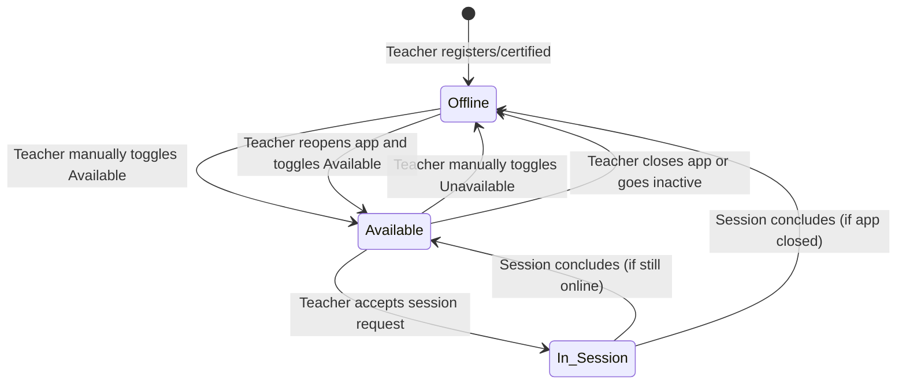
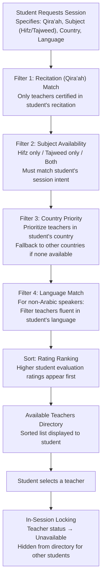
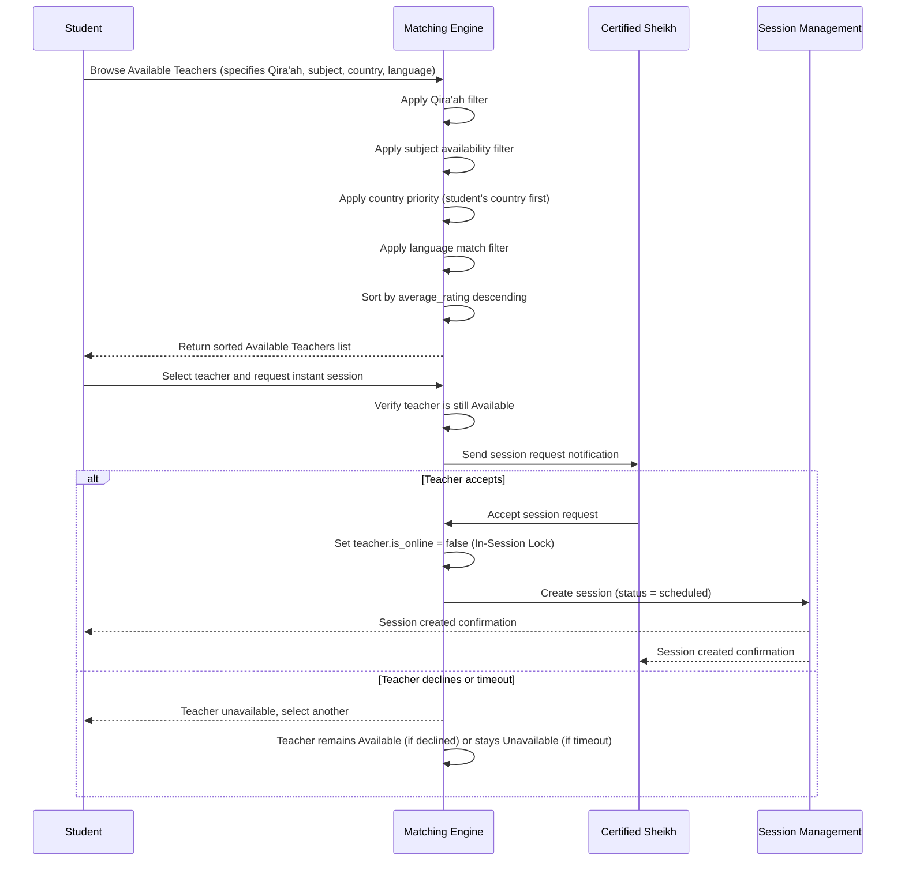

# Workflow 02 — On-Demand Matching & Queue

> **Source of truth:** `draft_docs/1-sc.en.md` §5
> **Related:** `docs/domain/GLOSSARY.md`, `docs/specs/state-machine-invariants.md`

---

## 1. Overview

The On-Demand Matching system enables students to discover and request instant sessions with available certified teachers. Unlike traditional booking systems, Draft Academy uses P2P non-dedicated matching — students browse an Available Teachers page on-demand rather than booking fixed recurring slots with a single teacher. This prevents disintermediation and provides maximum flexibility.

---

## 2. State Machine: Teacher Availability Lifecycle

---

## 3. Matching Algorithm: Filter & Sort Pipeline

---

## 4. Sequence Diagram: On-Demand Session Request

---

## 5. Presence Locking Logic

### 5.1 Status States
| State | `teacher.is_online` | Visible in Directory | Trigger |
|---|---|---|---|
| **Available** | `true` | Yes | Manual toggle ON or app opened |
| **Unavailable (Offline)** | `false` | No | Manual toggle OFF, app closed, or inactivity |
| **In-Session (Unavailable)** | `false` | No | Teacher accepts a session request |

### 5.2 In-Session Locking Rules
1. As soon as a teacher accepts a session request, their status automatically becomes `Unavailable` (`is_online = false`).
2. The teacher is hidden from the Available Teachers directory for all other students.
3. The teacher remains locked until the current session concludes (completed or cancelled).
4. Upon session conclusion, if the teacher is still online, their status returns to `Available`.

### 5.3 Automatic Offline
- If a teacher closes the web application or goes inactive, their status is set to `Unavailable`.
- This prevents students from requesting sessions from teachers who are no longer active.

---

## 6. Matching Criteria Detail

### 6.1 Recitation (Qira'ah) Matching
- Every user (student & teacher) selects their recitation reading (e.g., *Hafs 'an 'Asim*, *Warsh 'an Nafi'*).
- Students only see or are matched with teachers certified in that specific recitation.
- **Schema:** `recitation` table linked to `users` via `user_id`.

### 6.2 Subject Availability Matching
- Teachers indicate if they are available for: **Hifz only**, **Tajweed only**, or **Both**.
- Students specify their session intent (Hifz vs. Tajweed) when requesting.
- **✅ RESOLVED (A.6):** `teacher.subjects` array field added to the `teacher` table (JSON array: quran, tajweed, tafsir, etc.). See Resolved Decision A.6 in open-decisions-and-gaps.md.

### 6.3 Geographic / Country Priority
- Priority is given to teachers residing in the student's country.
- Example: A student from Morocco is prioritized Moroccan Shuyukh for cultural and dialect alignment.
- If none are available, teachers from other countries are displayed.
- **Schema:** `users.country` field.

### 6.4 Language Matching
- For non-Arabic speaking students (e.g., international Muslim learners), the system filters and matches teachers fluent in the student's foreign language.
- **Schema:** `students.primary_language`, `students.another_language`.

### 6.5 Rating / Performance Ranking
- Teachers with higher student evaluation ratings appear at the top of the search results.
- **Schema:** `teacher.average_rating` (decimal 0-5, check constraint).

---

## 7. Data Entities Involved

| Entity | Role in Workflow |
|---|---|
| `users` | Country, language for matching |
| `teacher` | `is_online` (availability), `average_rating` (ranking), `is_approved` (must be certified) |
| `students` | `primary_language`, `another_language` for language matching |
| `recitation` | Qira'ah selection for recitation matching |
| `session` | Created when teacher accepts request |
| `subscriptions` / `student_subscriptions` | Session balance eligibility check |

---

## 8. Resolved Decisions

> See Resolved Decisions in `docs/specs/open-decisions-and-gaps.md` for the full catalog.

- **✅ RESOLVED (A.6):** `teacher.subjects` array field added to the `teacher` table (JSON array: quran, tajweed, tafsir, etc.). Teacher subject availability is persisted in this field.
- **✅ RESOLVED (B.15):** 15-minute inactivity timeout. Teachers are marked unavailable after 15 minutes of inactivity (no WebSocket heartbeat or API call). `users.last_active_at` column added for tracking.
- **✅ RESOLVED:** When a teacher declines a session request, they remain Available (no ranking penalty). Declining is a normal action.
- **✅ RESOLVED (B.16):** Flexible by teacher — all options (queue, reject, offer alternatives) configurable per teacher preference via `teacher.request_preference` enum.
- **✅ RESOLVED:** The student's session balance is verified at the point of session request (before displaying available teachers is not required; balance check occurs when requesting).
- **✅ RESOLVED (A.10):** `session.intent` enum added to the `session` table (`hifz`, `tajweed`, `evaluation`). The student's session intent is captured as a field on the session request.
